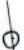
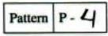

## Diffraction due to Helical Structure ${ } ^ { \mathbf { 1 } }$

Part A: Determination of geometrical parameters of a helical spring
| Tasks | Description | Marks |
| :--- | :--- | :--- |
| A1 | Number of attached pattern marking sheet(s) for Part A: 2 with label(s): P1, P2 (patterns on page 7) | 0.7 |
| A2 | Table A1: Observations from pattern P1Sr. No. Order $( n )$ ( $x _ { n } - x _ { - n }$ ) in mm   1 1 24.40   2 2 47.24   3 3 70.69   4 4 94.08   5 5 117.53   6 6 140.28 | 0.5 |
| A3 | Graph A1 for determination of $a _ { 1 } : n$ versus $\left( x _ { n } - x _ { - n } \right)$ Slope of the graph A1 $= 23.25 \mathrm {~mm}$ Calculation of $a _ { 1 }$ : $\begin{aligned} & a _ { 1 } = 2 \times \lambda \times \frac { D } { \text { Slope } } = 2 \times \lambda \times \frac { 2770 } { 23.25 } \\ & a _ { 1 } = 0.151 \mathrm {~mm} \end{aligned}$ | 0.7 |

[^0]

## S E-I

| A4 | Sr. No. $m$ ( $x _ { m } - x _ { - m }$ ) in mm   1 1 9.39   2 2 13.43   3 3 17.53   4 6 28.98   5 7 33.53   6 8 37.66   7 9 41.61   8 12 52.93   9 13 56.76   10 14 61.03   11 15 64.74 | 0.8 |
| :--- | :--- | :--- |
| A5 | Graph A2 for determination of $d _ { 1 } : m$ versus $\left( x _ { m } - x _ { - m } \right)$ Slope of the graph A2 $= 3.95 \mathrm {~mm}$ Calculation of $d _ { 1 }$ : $\begin{aligned} & d _ { 1 } = 2 \times \lambda \times \frac { D } { \text { Slope } } = 2 \times 0.000635 \times \frac { 2770 } { 3.95 } \\ & d _ { 1 } = 0.89 \mathrm {~mm} \end{aligned}$ | 0.6 |
| A6 | $\alpha _ { 1 } = 10.96 ^ { \circ }$ | 0.2 |
| A7 | Expression of $P$ in terms of $d _ { 1 }$ and $\alpha _ { 1 }$ : | 0.2 |

## S E-I

|  | $\begin{aligned} & P = \frac { d _ { 1 } } { \cos \alpha _ { 1 } } = \frac { 0.89 } { \cos 10.96 } \\ & P = 0.91 \mathrm {~mm} \end{aligned}$ |  |
| :--- | :--- | :--- |

| A8 | Expression of $R$ in terms of $P$ and $\alpha _ { 1 }$ : $\tan \alpha _ { 1 } = \frac { P } { 2 \pi R }$ $\begin{aligned} & R = \frac { P } { 2 \times \pi \times \tan \alpha _ { 1 } } = \frac { 0.91 } { 2 \times \pi \times \tan 10.96 } \\ & R = 0.75 \mathrm {~mm} \end{aligned}$ |  | 0.2 |
| :--- | :--- | :--- | :--- |
| Total |  |  | 3.9 |

Part B: Determination of geometrical parameters of double-helix-like pattern
| Tasks | Description | Marks |
| :--- | :--- | :--- |
| B1 | Attached pattern marking sheet number(s): 2 with label(s): P3, P4 (patterns on page 7) | 1.1 |
| B2 | Table B1: Observations from pattern P3Sr. No. Order $( n )$ ( $x _ { n } - x _ { - n }$ ) in mm   1 1 21.24   2 2 41.12   3 3 62.41   4 4 84.40   5 5 104.41   6 6 124.25 | 0.5 |
| B3 | Graph B1 for determination of $a _ { 2 } : n$ versus $\left( x _ { n } - x _ { - n } \right)$ | 0.5 |

## S E-I

|  | Slope of the graph $\mathrm { B } 1 = 20.8 \mathrm {~mm}$ Calculation of $a _ { 2 } : a _ { 2 } = 2 \times \lambda \times \frac { D } { \text { Slope } } = 2 \times 0.000635 \times \frac { 795 } { 20.8 } a _ { 2 } = 0.049 \mathrm {~mm}$ |  |
| :--- | :--- | :--- |

| B4 | Table B2: Observations from pattern P3Sr. No. $m$ ( $x _ { m } - x _ { - m }$ ) in mm   1 1 5.84   2 2 10.29   3 3 14.83   4 4 18.84   5 6 26.44   6 7 30.65   7 8 35.26   8 9 38.34 | 1.2 |
| :--- | :--- | :--- |
| B5 | Graph B2 for determination of $s : m$ versus $\left( x _ { m } - x _ { - m } \right)$ Slope of the graph $\mathrm { B } 2 = 4.07 \mathrm {~mm}$ Calculation of $s : s = 2 \times \lambda \times \frac { D } { \text { Slope } } = 2 \times 0.000635 \times \frac { 795 } { 4.07 } s = 0.248 \mathrm {~mm}$ | 0.5 |

| B6 | Table B3 Observations from pattern P4Sr. No. Order ( $l$ ) ( $x _ { l } - x _ { - l }$ ) in mm   1 1 11.64   2 2 15.77   3 3 19.71   4 5 26.33   5 6 30.14   6 7 33.69   7 9 39.62   8 10 43.70   9 11 47.75 | 1.6 |
| :--- | :--- | :--- |
|  |  |  |
|  |  |  |
|  |  |  |
|  |  |  |
|  |  |  |
|  |  |  |
|  |  |  |
|  |  |  |
|  |  |  |
|  |  |  |
|  |  |  |
| B7 | Graph B3   0.5   Graph B3 for determination of $d _ { 2 } : l$ versus $\left( x _ { l } - x _ { - l } \right)$ Slope of the graph B3 $= 3.52 \mathrm {~mm}$ Calculation of $d _ { 2 } : d _ { 2 } = 2 \times \frac { \lambda \times D } { \text { Slope } } = 2 \times 0.000635 \times \frac { 2770 } { 3.52 } d _ { 2 } = 1.00 \mathrm {~mm}$ |  |
| B8 | $\alpha _ { 2 } = 9.88 ^ { \circ }$ | 0.2 |
|  | Total | 6.1 |

Reference for Part A : G. Braun, D. Tierney and H. Schmitzer, Phys. Teach. 49, 140 (2011).

| Pattern P－ 1 o F － F － F厓王三王三 F J $\phi \phi$ 0  | Pattern P－ 2     |
| :--- | :--- |
| Pattern P1 $( D = 2770 \mathrm {~mm} )$ | Pattern P2 |
| □   Pattern p－3 |  |
| Pattern P3 $( D = 795 \mathrm {~mm} )$ | Pattern P4（ $D = 2770 \mathrm {~mm}$ ） |

[^0]:    ${ } ^ { 1 }$ Praveen Pathak (HBCSE-TIFR, Mumbai), Charudatt Kadolkar (IIT, Guwahati), and Manish Kapoor (Christ Church College, Kanpur) were the principal authors of this problem. The contributions of the Academic Committee, Academic Development Group and the International Board are gratefully acknowledged.
