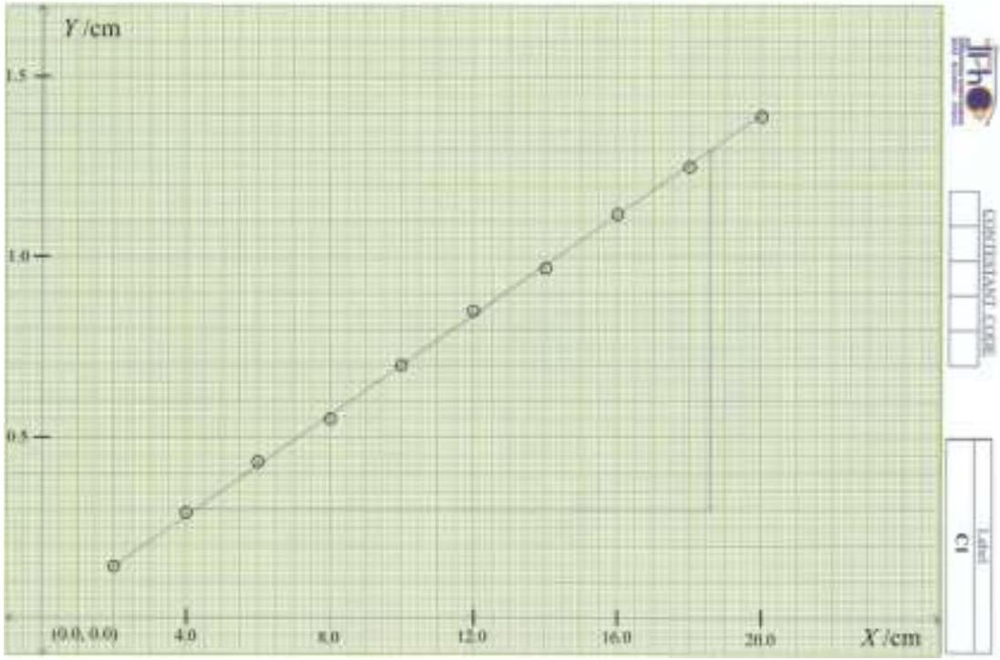
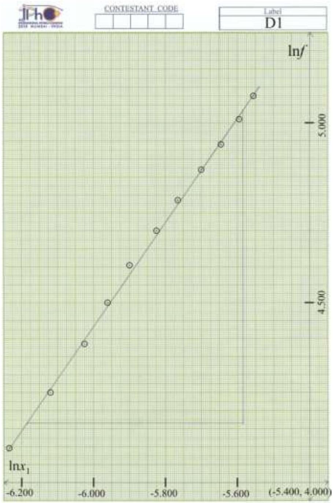
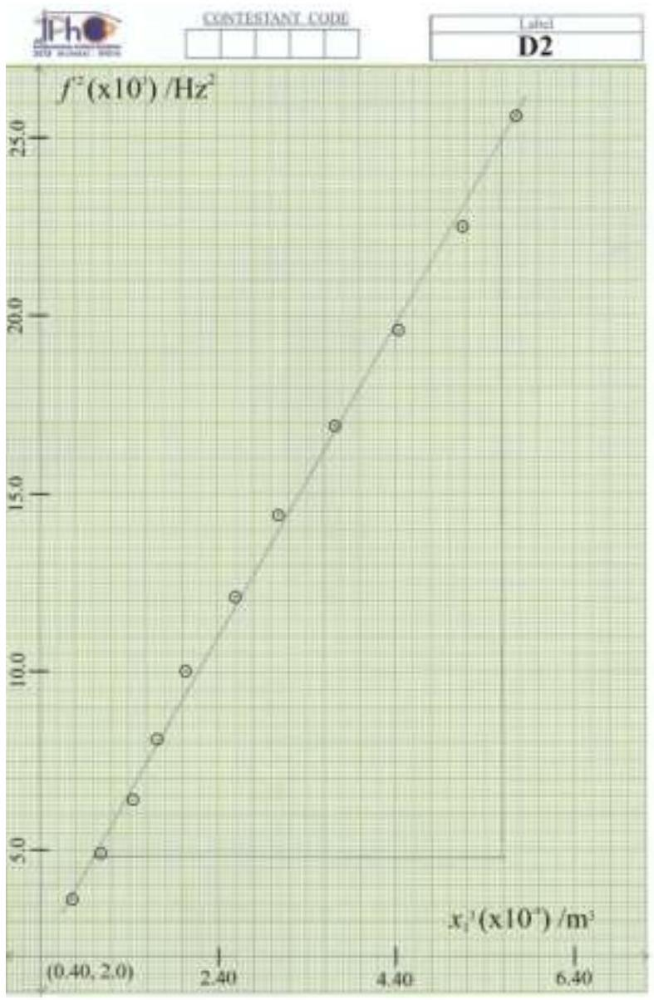
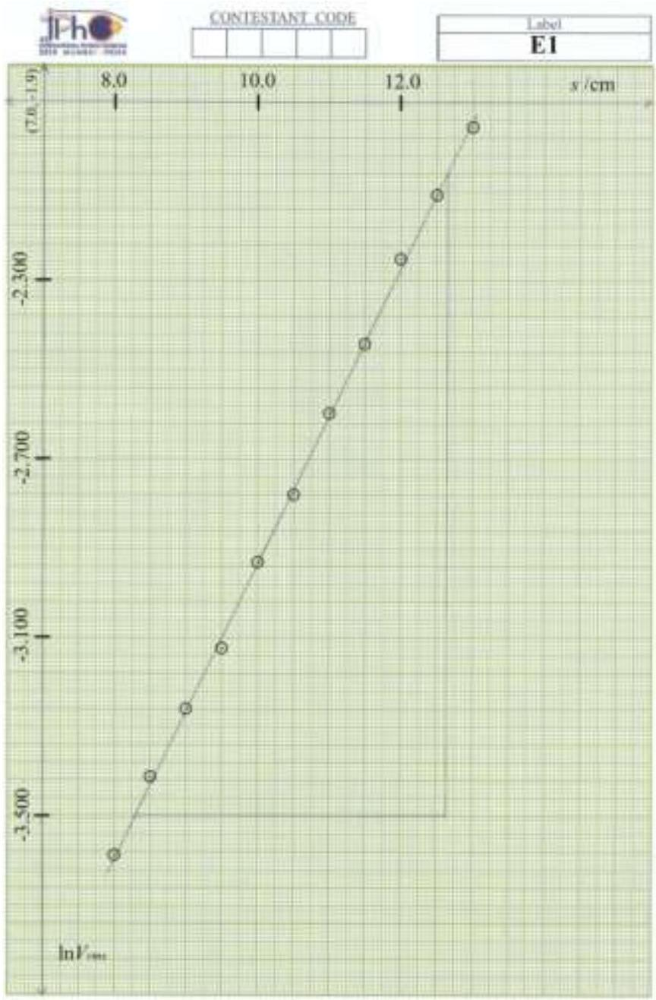

Diffraction due to surface tension waves on water ${ } ^ { \mathbf { 1 } }$
Part C: Measurement of angle, $\boldsymbol { \theta }$
[C1]

Table C1
| Obs. no. | $\boldsymbol { X } \boldsymbol { / } \mathbf { c m }$ | $\boldsymbol { Y } / \mathbf { c m }$ |
| :--- | :--- | :--- |
| 1 | 2.0 | 0.136 |
| 2 | 4.0 | 0.285 |
| 3 | 6.0 | 0.425 |
| 4 | 8.0 | 0.549 |
| 5 | 10.0 | 0.703 |
| 6 | 12.0 | 0.846 |
| 7 | 14.0 | 0.965 |
| 8 | 16.0 | 1.124 |
| 9 | 18.0 | 1.251 |
| 10 | 20.0 | 1.390 |

[C2]

Graph C1 for determination of $\boldsymbol { \theta } : \boldsymbol { X }$ versus $\boldsymbol { Y }$

Slope $= 0.0699$

$$
\theta = 4.0 ^ { \circ }
$$

[^0]
Part D: Determination of the surface tension of the liquid
[D1]:

| $l _ { 1 } = 98.5 \mathrm {~cm}$ | $l _ { 2 } = 5.5 \mathrm {~cm}$ | $L = 1.04 \mathrm {~m}$ |
| :--- | :--- | :--- |

[D2]:

Table D1
| Obs. no. | $\boldsymbol { f } \boldsymbol { / } \mathbf { H z }$ | $\mathbf { 2 } \boldsymbol { x } _ { \mathbf { 2 } } \boldsymbol { / } \mathbf { c m }$ | $\boldsymbol { x } _ { \mathbf { 1 } } \boldsymbol { / } \mathbf { c m }$ | $x _ { 1 } / \mathrm { m }$ |
| :--- | :--- | :--- | :--- | :--- |
| 1 | 60 | 0.782 | 0.196 | 0.00196 |
| 2 | 70 | 0.880 | 0.220 | 0.00220 |
| 3 | 80 | 0.966 | 0.242 | 0.00242 |
| 4 | 90 | 1.030 | 0.258 | 0.00258 |
| 5 | 100 | 1.096 | 0.274 | 0.00274 |
| 6 | 110 | 1.184 | 0.296 | 0.00296 |
| 7 | 120 | 1.253 | 0.313 | 0.00313 |
| 8 | 130 | 1.336 | 0.334 | 0.00334 |
| 9 | 140 | 1.415 | 0.354 | 0.00354 |
| 10 | 150 | 1.489 | 0.372 | 0.00372 |
| 11 | 160 | 1.545 | 0.386 | 0.00386 |

\[\begin{gathered}
\omega ^ { 2 } = \frac { \sigma } { \rho } k ^ { q } \\
f ^ { 2 } = \frac { 1 } { 4 \pi ^ { 2 } } \frac { \sigma } { \rho } \left( \frac { 2 \pi } { \lambda } \frac { \sin \theta } { L } \right) ^ { q } \left( x _ { 1 } \right) ^ { q } \\
\ln f = \frac { 1 } { 2 } \ln \left[ \frac { 1 } { 4 \pi ^ { 2 } } \frac { \sigma } { \rho } \left( \frac { 2 \pi } { \lambda } \frac { \sin \theta } { L } \right) ^ { q } \right] + \frac { q } { 2 } \ln x _ { 1 }
\end{gathered}\]

Graph for determination of $\boldsymbol { q } : \boldsymbol { \operatorname { l n } } ( \boldsymbol { f } )$ versus $\boldsymbol { \operatorname { l n } } \left( \boldsymbol { x } _ { \mathbf { 1 } } \right)$

| Table D2 |  |  |
| :--- | :--- | :--- |
| Obs. No. | $\boldsymbol { \operatorname { l n } } \boldsymbol { x } _ { \mathbf { 1 } }$ | $\boldsymbol { \operatorname { l n } } \boldsymbol { f }$ |
| 1 | -6.235 | 4.094 |
| 2 | -6.119 | 4.248 |
| 3 | -6.024 | 4.382 |
| 4 | -5.960 | 4.500 |
| 5 | -5.900 | 4.605 |
| 6 | -5.823 | 4.700 |
| 7 | -5.767 | 4.787 |
| 8 | -5.702 | 4.868 |
| 9 | -5.644 | 4.942 |
| 10 | -5.594 | 5.011 |
| 11 | -5.557 | 5.075 |

$$
\text { Slope } = 1.45
$$

$$
q = 2.90
$$

Determination of surface tension:

Equation 2:

$$
\omega ^ { 2 } = \frac { \sigma } { \rho } k ^ { 3 }
$$

## S E-II

[D4]:
Graph for determination of $\boldsymbol { \sigma } : \boldsymbol { f } ^ { \mathbf { 2 } }$ versus $\boldsymbol { x } _ { \mathbf { 1 } } { } ^ { \mathbf { 3 } }$

Table D3
| Obs. No. | $\boldsymbol { f } ^ { \mathbf { 2 } } \boldsymbol { ( } \boldsymbol { \times } \mathbf { 1 0 } ^ { \mathbf { 3 } } \boldsymbol { ) } / \mathrm { Hz } ^ { 2 }$ | $\boldsymbol { x } _ { \mathbf { 1 } } { } ^ { \mathbf { 3 } } \left( \boldsymbol { \times } \mathbf { 1 0 } ^ { \boldsymbol { - } \mathbf { 8 } } \right) / \mathrm { m } ^ { 3 }$ |
| :--- | :--- | :--- |
| 1 | 3.6 | 0.75 |
| 2 | 4.9 | 1.07 |
| 3 | 6.4 | 1.42 |
| 4 | 8.1 | 1.72 |
| 5 | 10.0 | 2.06 |
| 6 | 12.1 | 2.59 |
| 7 | 14.4 | 3.07 |
| 8 | 16.9 | 3.73 |
| 9 | 19.6 | 4.44 |
| 10 | 22.5 | 5.15 |
| 11 | 25.6 | 5.75 |

Surface Tension:

$$
\begin{gathered}
\omega ^ { 2 } = \frac { \sigma } { \rho } k ^ { 3 } \\
f ^ { 2 } = \frac { \sigma } { \rho } \frac { 2 \pi } { \lambda ^ { 3 } } \frac { \sin ^ { 3 } \theta } { L ^ { 3 } } \left( x _ { 1 } \right) ^ { 3 }
\end{gathered}
$$

Calculations:

$$
\begin{gathered}
\text { Slope } = 4.39 \times 10 ^ { 11 } \mathrm {~Hz} ^ { 2 } / \mathrm { m } ^ { 3 } \\
\therefore \text { Slope } = \frac { \sigma } { \rho } \frac { 2 \pi } { \lambda ^ { 3 } } \frac { \sin ^ { 3 } \theta } { L ^ { 3 } } = \frac { \sigma } { 1000 } \times \frac { 2 \times 3.14 } { \left( 635 \times 10 ^ { - 9 } \right) ^ { 3 } } \times \frac { ( 0.0698 ) ^ { 3 } } { ( 1.04 ) ^ { 3 } } \\
\therefore \boldsymbol { \sigma } = \mathbf { 5 9 . 2 ~ m N } / \mathbf { m }
\end{gathered}
$$

Part E: Determination of the viscosity of the water sample
[E1]: Frequency of the signal generator $= \mathbf { 1 0 0 ~ H z }$

Table E1
| Obs. No. | $\boldsymbol { S }$ /cm | $\boldsymbol { V } _ { \boldsymbol { r } m \boldsymbol { s } } \boldsymbol { / } \mathbf { V }$ | $\boldsymbol { \operatorname { l n } } \boldsymbol { ( } \boldsymbol { V } _ { \text {rms } } \boldsymbol { ) }$ |
| :--- | :--- | :--- | :--- |
| 1 | 8.0 | 0.0276 | -3.590 |
| 2 | 8.5 | 0.0330 | -3.411 |
| 3 | 9.0 | 0.0385 | -3.257 |
| 4 | 9.5 | 0.0441 | -3.121 |
| 5 | 10.0 | 0.0534 | -2.930 |
| 6 | 10.5 | 0.0622 | -2.777 |
| 7 | 11.0 | 0.0745 | -2.597 |
| 8 | 11.5 | 0.0870 | -2.442 |
| 9 | 12.0 | 0.1050 | -2.254 |
| 10 | 12.5 | 0.1215 | -2.108 |
| 11 | 13.0 | 0.1412 | -1.958 |

[E2]:
Graph for determination of $\boldsymbol { \delta } : \boldsymbol { \operatorname { l n } } \left( \boldsymbol { V } _ { \boldsymbol { r } m s } \right)$ versus $\boldsymbol { s }$

Slope $= 0.331 \mathrm {~cm} ^ { - 1 }$

$$
\therefore \delta = 0.4 \times 0.3310 = 0.1324 \mathrm {~cm} ^ { - 1 }
$$

[E3]:
Determination of viscosity, $\eta$ :

$$
\begin{gathered}
\delta = \frac { 8 } { 3 } \frac { \pi \eta f } { \sigma } \\
\eta = \frac { 3 } { 8 } \frac { \delta \sigma } { \pi f } = \frac { 3 } { 8 } \times \frac { 13.2 \times 59.2 \times 10 ^ { - 3 } } { 3.14 \times 100 } 0.933 \mathrm { mPa } \cdot \mathrm {~s} \\
\eta = \mathbf { 0 . 9 3 ~ m P a } \cdot \mathbf { s }
\end{gathered}
$$

[^0]:    ${ } ^ { 1 }$ Shirish Pathare (HBCSE, Mumbai)and K G M Nair (CMI, Chennai) were the principal authors of this problem. The contributions of the Academic Committee, Academic Development Group and the International Board are gratefully acknowledged.
