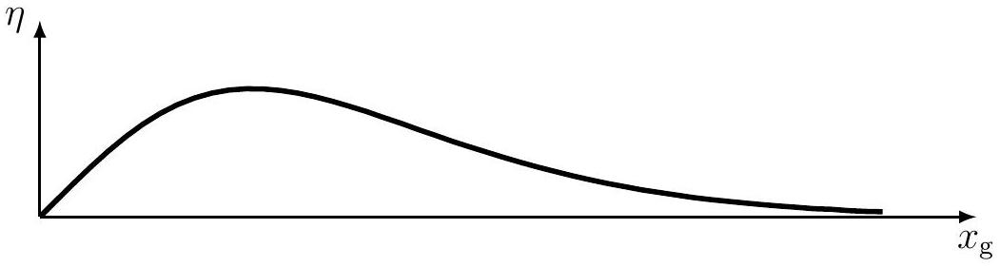

## Particles from the Sun ${ } ^ { 1 }$

Photons from the surface of the Sun and neutrinos from its core can tell us about solar temperatures and also confirm that the Sun shines because of nuclear reactions.

Throughout this problem, take the mass of the Sun to be $M _ { \odot } = 2.00 \times 10 ^ { 30 } \mathrm {~kg}$, its radius, $R _ { \odot } =$ $7.00 \times 10 ^ { 8 } \mathrm {~m}$, its luminosity (radiation energy emitted per unit time), $L _ { \odot } = 3.85 \times 10 ^ { 26 } \mathrm {~W}$, and the Earth-Sun distance, $d _ { \odot } = 1.50 \times 10 ^ { 11 } \mathrm {~m}$.

Note:

(i) $\int x e ^ { a x } d x = \left( \frac { x } { a } - \frac { 1 } { a ^ { 2 } } \right) e ^ { a x } +$ constant
(ii) $\int x ^ { 2 } e ^ { a x } d x = \left( \frac { x ^ { 2 } } { a } - \frac { 2 x } { a ^ { 2 } } + \frac { 2 } { a ^ { 3 } } \right) e ^ { a x } +$ constant
(iii) $\int x ^ { 3 } e ^ { a x } d x = \left( \frac { x ^ { 3 } } { a } - \frac { 3 x ^ { 2 } } { a ^ { 2 } } + \frac { 6 x } { a ^ { 3 } } - \frac { 6 } { a ^ { 4 } } \right) e ^ { a x } +$ constant

## A. Radiation from the Sun :

(A1) Assume that the Sun radiates like a perfect blackbody. Use this fact to calculate the temperature, $T _ { \mathrm { s } }$, of the solar surface.

Solution:
Stefan's law: $L _ { \odot } = \left( 4 \pi R _ { \odot } ^ { 2 } \right) \left( \sigma T _ { \mathrm { s } } ^ { 4 } \right)$

$$
T _ { \mathrm { s } } = \left( \frac { L _ { \odot } } { 4 \pi R _ { \odot } ^ { 2 } \sigma } \right) ^ { 1 / 4 } = 5.76 \times 10 ^ { 3 } \mathrm {~K}
$$

The spectrum of solar radiation can be approximated well by the Wien distribution law. Accordingly, the solar energy incident on any surface on the Earth per unit time per unit frequency interval, $u ( \nu )$, is given by

$$
u ( \nu ) = A \frac { R _ { \odot } ^ { 2 } } { d _ { \odot } ^ { 2 } } \frac { 2 \pi h } { c ^ { 2 } } \nu ^ { 3 } \exp \left( - h \nu / k _ { \mathrm { B } } T _ { \mathrm { s } } \right) ,
$$

where $A$ is the area of the surface normal to the direction of the incident radiation.
Now, consider a solar cell which consists of a thin disc of semiconducting material of area, $A$, placed perpendicular to the direction of the Sun's rays.

(A2) Using the Wien approximation, express the total power, $P _ { \text {in } }$, incident on the surface of the solar cell, in terms of $A , R _ { \odot } , d _ { \odot } , T _ { \mathrm { s } }$ and the fundamental constants $c , h , k _ { \mathrm { B } }$.
[^0]
Solution:

$$
P _ { \mathrm { in } } = \int _ { 0 } ^ { \infty } u ( \nu ) d \nu = \int _ { 0 } ^ { \infty } A \frac { R _ { \odot } ^ { 2 } } { d _ { \odot } ^ { 2 } } \frac { 2 \pi h } { c ^ { 2 } } \nu ^ { 3 } \exp \left( - h \nu / k _ { \mathrm { B } } T _ { \mathrm { s } } \right) d \nu
$$

Let $x = \frac { h \nu } { k _ { \mathrm { B } } T _ { \mathrm { s } } }$. Then, $\nu = \frac { k _ { \mathrm { B } } T _ { \mathrm { s } } } { h } x \quad d \nu = \frac { k _ { \mathrm { B } } T _ { \mathrm { s } } } { h } d x$.

$$
P _ { \text {in } } = \frac { 2 \pi h A R _ { \odot } ^ { 2 } } { c ^ { 2 } d _ { \odot } ^ { 2 } } \frac { \left( k _ { \mathrm { B } } T _ { \mathrm { s } } \right) ^ { 4 } } { h ^ { 4 } } \int _ { 0 } ^ { \infty } x ^ { 3 } e ^ { - x } d x = \frac { 2 \pi k _ { \mathrm { B } } ^ { 4 } } { c ^ { 2 } h ^ { 3 } } T _ { \mathrm { s } } ^ { 4 } A \frac { R _ { \odot } ^ { 2 } } { d _ { \odot } ^ { 2 } } \cdot 6 = \frac { 12 \pi k _ { \mathrm { B } } ^ { 4 } } { c ^ { 2 } h ^ { 3 } } T _ { \mathrm { s } } ^ { 4 } A \frac { R _ { \odot } ^ { 2 } } { d _ { \odot } ^ { 2 } }
$$

(A3) Express the number of photons, $n _ { \gamma } ( \nu )$, per unit time per unit frequency interval incident on the surface of the solar cell in terms of $A , R _ { \odot } , d _ { \odot } , T _ { \mathrm { s } } \nu$ and the fundamental constants $c , h , k _ { \mathrm { B } }$.

Solution:

$$
\begin{aligned}
n _ { \gamma } ( \nu ) & = \frac { u ( \nu ) } { h \nu } \\
& = A \frac { R _ { \odot } ^ { 2 } } { d _ { \odot } ^ { 2 } } \frac { 2 \pi } { c ^ { 2 } } \nu ^ { 2 } \exp \left( - h \nu / k _ { \mathrm { B } } T _ { \mathrm { s } } \right)
\end{aligned}
$$

The semiconducting material of the solar cell has a "band gap" of energy, $E _ { \mathrm { g } }$. We assume the following model. Every photon of energy $E \geq E _ { \mathrm { g } }$ excites an electron across the band gap. This electron contributes an energy, $E _ { \mathrm { g } }$, as the useful output energy, and any extra energy is dissipated as heat (not converted to useful energy).
(A4) Define $x _ { \mathrm { g } } = h \nu _ { \mathrm { g } } / k _ { \mathrm { B } } T _ { \mathrm { s } }$ where $E _ { \mathrm { g } } = h \nu _ { \mathrm { g } }$. Express the useful output power of the cell, $P _ { \text {out } }$, in terms of $x _ { \mathrm { g } } , A , R _ { \odot } , d _ { \odot } , T _ { \mathrm { s } }$ and the fundamental constants $c , h , k _ { \mathrm { B } }$.

Solution:
The useful power output is the useful energy quantum per photon, $E _ { \mathrm { g } } \equiv h \nu _ { \mathrm { g } }$, multiplied by the number of photons with energy, $E \geq E _ { \mathrm { g } }$.

$$
\begin{aligned}
P _ { \text {out } } & = h \nu _ { \mathrm { g } } \int _ { \nu _ { \mathrm { g } } } ^ { \infty } n _ { \gamma } ( \nu ) d \nu \\
& = h \nu _ { \mathrm { g } } A \frac { R _ { \odot } ^ { 2 } } { d _ { \odot } ^ { 2 } } \frac { 2 \pi } { c ^ { 2 } } \int _ { \nu _ { \mathrm { g } } } ^ { \infty } \nu ^ { 2 } \exp \left( - h \nu / k _ { \mathrm { B } } T _ { \mathrm { s } } \right) d \nu \\
& = k _ { \mathrm { B } } T _ { \mathrm { s } } x _ { \mathrm { g } } A \frac { R _ { \odot } ^ { 2 } } { d _ { \odot } ^ { 2 } } \frac { 2 \pi } { c ^ { 2 } } \left( \frac { k _ { \mathrm { B } } T _ { \mathrm { s } } } { h } \right) ^ { 3 } \int _ { x _ { \mathrm { g } } } ^ { \infty } x ^ { 2 } e ^ { - x } d x \\
& = \frac { 2 \pi k _ { \mathrm { B } } ^ { 4 } } { c ^ { 2 } h ^ { 3 } } T _ { \mathrm { s } } ^ { 4 } A \frac { R _ { \odot } ^ { 2 } } { d _ { \odot } ^ { 2 } } x _ { \mathrm { g } } \left( x _ { \mathrm { g } } ^ { 2 } + 2 x _ { \mathrm { g } } + 2 \right) e ^ { - x _ { \mathrm { g } } }
\end{aligned}
$$

(A5) Express the efficiency, $\eta$, of this solar cell in terms of $x _ { \mathrm { g } }$.

Solution:
Efficiency $\eta = \frac { P _ { \text {out } } } { P _ { \text {in } } } = \frac { x _ { \mathrm { g } } } { 6 } \left( x _ { \mathrm { g } } ^ { 2 } + 2 x _ { \mathrm { g } } + 2 \right) e ^ { - x _ { \mathrm { g } } }$

(A6) Make a qualitative sketch of $\eta$ versus $x _ { \mathrm { g } }$. The values at $x _ { \mathrm { g } } = 0$ and $x _ { \mathrm { g } } \rightarrow \infty$ should be clearly shown. What is the slope of $\eta \left( x _ { \mathrm { g } } \right)$ at $x _ { \mathrm { g } } = 0$ and $x _ { \mathrm { g } } \rightarrow \infty$ ?

Solution:

$$
\eta = \frac { 1 } { 6 } \left( x _ { \mathrm { g } } ^ { 3 } + 2 x _ { \mathrm { g } } ^ { 2 } + 2 x _ { \mathrm { g } } \right) e ^ { - x _ { \mathrm { g } } }
$$

Put limiting values, $\eta ( 0 ) = 0 \quad \eta ( \infty ) = 0$.
Since the polynomial has all positive coefficients, it increases monotonically; the exponential function decreases monotonically. Therefore, $\eta$ has only one maximum.

$$
\begin{aligned}
& \frac { \mathrm { d } \eta } { \mathrm {~d} x _ { \mathrm { g } } } = \frac { 1 } { 6 } \left( - x _ { \mathrm { g } } ^ { 3 } + x _ { \mathrm { g } } ^ { 2 } + 2 x _ { \mathrm { g } } + 2 \right) e ^ { - x _ { \mathrm { g } } } \\
& \left. \frac { \mathrm {~d} \eta } { \mathrm {~d} x _ { \mathrm { g } } } \right| _ { x _ { \mathrm { g } } = 0 } = \left. \frac { 1 } { 3 } \quad \frac { \mathrm {~d} \eta } { \mathrm {~d} x _ { \mathrm { g } } } \right| _ { x _ { \mathrm { g } \rightarrow \infty } } = 0
\end{aligned}
$$

(A7) Let $x _ { 0 }$ be the value of $x _ { \mathrm { g } }$ for which $\eta$ is maximum. Obtain the cubic equation that gives $x _ { 0 }$. Estimate the value of $x _ { 0 }$ within an accuracy of ±0.25. Hence calculate $\eta \left( x _ { 0 } \right)$.

Solution:
The maximum will be for $\frac { \mathrm { d } \eta } { \mathrm { d } x _ { \mathrm { g } } } = \frac { 1 } { 6 } \left( - x _ { \mathrm { g } } ^ { 3 } + x _ { \mathrm { g } } ^ { 2 } + 2 x _ { \mathrm { g } } + 2 \right) e ^ { - x _ { \mathrm { g } } } = 0$

$$
\Rightarrow p \left( x _ { \mathrm { g } } \right) \equiv x _ { \mathrm { g } } ^ { 3 } - x _ { \mathrm { g } } ^ { 2 } - 2 x _ { \mathrm { g } } - 2 = 0
$$

A Numerical Solution by the Bisection Method:
Now,

$$
\begin{aligned}
p ( 0 ) & = - 2 \\
p ( 1 ) & = - 4 \\
p ( 2 ) & = - 2 \\
p ( 3 ) & = 10 \quad \Rightarrow \quad 2 < x _ { 0 } < 3 \\
p ( 2.5 ) & = 2.375 \quad \Rightarrow \quad 2 < x _ { 0 } < 2.5 \\
p ( 2.25 ) & = - 0.171 \quad \Rightarrow \quad 2.25 < x _ { 0 } < 2.5
\end{aligned}
$$

The approximate value of $x _ { \mathrm { g } }$ where $\eta$ is maximum is $x _ { 0 } = 2.27$.

Alternative methods leading to the same result are acceptable.
$$
\eta ( 2.27 ) = 0.457
$$
(A8) The band gap of pure silicon is $E _ { \mathrm { g } } = 1.11 \mathrm { eV }$. Calculate the efficiency, $\eta _ { \mathrm { Si } }$, of a silicon solar cell using this value.

Solution:

$$
\begin{gathered}
x _ { \mathrm { g } } = \frac { 1.11 \times 1.60 \times 10 ^ { - 19 } } { 1.38 \times 10 ^ { - 23 } \times 5763 } = 2.23 \\
\eta _ { \mathrm { Si } } = \frac { x _ { \mathrm { g } } } { 6 } \left( x _ { \mathrm { g } } ^ { 2 } + 2 x _ { \mathrm { g } } + 2 \right) e ^ { - x _ { \mathrm { g } } } = 0.457
\end{gathered}
$$

In the late nineteenth century, Kelvin and Helmholtz (KH) proposed a hypothesis to explain how the Sun shines. They postulated that starting as a very large cloud of matter of mass, $M _ { \odot }$, and negligible density, the Sun has been shrinking continuously. The shining of the Sun would then be due to the release of gravitational energy through this slow contraction.

(A9) Let us assume that the density of matter is uniform inside the Sun. Find the total gravitational potential energy, $\Omega$, of the Sun at present, in terms of $G , M _ { \odot }$ and $R _ { \odot }$.

Solution:
The total gravitational potential energy of the Sun: $\Omega = - \int _ { 0 } ^ { M _ { \odot } } \frac { G m \mathrm {~d} m } { r }$
For constant density, $\rho = \frac { 3 M _ { \odot } } { 4 \pi R _ { \odot } ^ { 3 } } \quad m = \frac { 4 } { 3 } \pi r ^ { 3 } \rho \quad \mathrm {~d} m = 4 \pi r ^ { 2 } \rho \mathrm {~d} r$

$$
\Omega = - \int _ { 0 } ^ { R _ { \odot } } G \left( \frac { 4 } { 3 } \pi r ^ { 3 } \rho \right) \left( 4 \pi r ^ { 2 } \rho \right) \frac { \mathrm { d } r } { r } = - \frac { 16 \pi ^ { 2 } G \rho ^ { 2 } } { 3 } \frac { R _ { \odot } ^ { 5 } } { 5 } = - \frac { 3 } { 5 } \frac { G M _ { \odot } ^ { 2 } } { R _ { \odot } }
$$

(A10) Estimate the maximum possible time $\tau _ { \mathrm { KH } }$ (in years), for which the Sun could have been shining, according to the KH hypothesis. Assume that the luminosity of the Sun has been constant throughout this period.

Solution:

$$
\begin{gathered}
\tau _ { \mathrm { KH } } = \frac { - \Omega } { L _ { \odot } } \\
\tau _ { \mathrm { KH } } = \frac { 3 G M _ { \odot } ^ { 2 } } { 5 R _ { \odot } L _ { \odot } } = 1.88 \times 10 ^ { 7 } \text { years }
\end{gathered}
$$

The $\tau _ { \mathrm { KH } }$ calculated above does not match the age of the solar system estimated from studies of meteorites. This shows that the energy source of the Sun cannot be purely gravitational.

## B. Neutrinos from the Sun:

In 1938, Hans Bethe proposed that nuclear fusion of hydrogen into helium in the core of the Sun is the source of its energy. The net nuclear reaction is:

$$
4 ^ { 1 } \mathrm { H } \longrightarrow { } ^ { 4 } \mathrm { He } + 2 \mathrm { e } ^ { + } + 2 \nu _ { \mathrm { e } }
$$

The "electron neutrinos", $\nu _ { \mathrm { e } }$, produced in this reaction may be taken to be massless. They escape the Sun and their detection on Earth confirms the occurrence of nuclear reactions inside the Sun. Energy carried away by the neutrinos can be neglected in this problem.

(B1) Calculate the flux density, $\Phi _ { \nu }$, of the number of neutrinos arriving at the Earth, in units of $\mathrm { m } ^ { - 2 } \mathrm {~s} ^ { - 1 }$. The energy released in the above reaction is $\Delta E = 4.0 \times 10 ^ { - 12 } \mathrm {~J}$. Assume that the energy radiated by the Sun is almost entirely due to this reaction.

Solution:

$$
4.0 \times 10 ^ { - 12 } \mathrm {~J} \leftrightarrow 2 \nu
$$

$$
\Rightarrow \Phi _ { \nu } = \frac { L _ { \odot } } { 4 \pi d _ { \odot } ^ { 2 } \delta E } \times 2 = \frac { 3.85 \times 10 ^ { 26 } } { 4 \pi \times \left( 1.50 \times 10 ^ { 11 } \right) ^ { 2 } \times 4.0 \times 10 ^ { - 12 } } \times 2 = 6.8 \times 10 ^ { 14 } \mathrm {~m} ^ { - 2 } \mathrm {~s} ^ { - 1 } .
$$

Travelling from the core of the Sun to the Earth, some of the electron neutrinos, $\nu _ { \mathrm { e } }$, are converted to other types of neutrinos, $\nu _ { \mathrm { x } }$. The efficiency of the detector for detecting $\nu _ { \mathrm { x } }$ is 1/6th of its efficiency for detecting $\nu _ { \mathrm { e } }$. If there is no neutrino conversion, we expect to detect an average of $N _ { 1 }$ neutrinos in a year. However, due to the conversion, an average of $N _ { 2 }$ neutrinos ( $\nu _ { \mathrm { e } }$ and $\nu _ { \mathrm { x } }$ combined) are actually detected per year.
(B2) In terms of $N _ { 1 }$ and $N _ { 2 }$, calculate what fraction, $f$, of $\nu _ { \mathrm { e } }$ is converted to $\nu _ { \mathrm { x } }$.

Solution:

$$
\begin{aligned}
N _ { 1 } & = \epsilon N _ { 0 } \\
N _ { e } & = \epsilon N _ { 0 } ( 1 - f ) \\
N _ { x } & = \epsilon N _ { 0 } f / 6 \\
N _ { 2 } & = N _ { e } + N _ { x }
\end{aligned}
$$

OR

$$
\begin{gathered}
( 1 - f ) N _ { 1 } + \frac { f } { 6 } N _ { 1 } = N _ { 2 } \\
\Rightarrow f = \frac { 6 } { 5 } \left( 1 - \frac { N _ { 2 } } { N _ { 1 } } \right)
\end{gathered}
$$

In order to detect neutrinos, large detectors filled with water are constructed. Although the interactions of neutrinos with matter are very rare, occasionally they knock out electrons from water molecules in the detector. These energetic electrons move through water at high speeds, emitting electromagnetic radiation in the process. As long as the speed of such an electron is greater than the speed of light in water (refractive index, $n$ ), this radiation, called Cherenkov radiation, is emitted in the shape of a cone.

(B3) Assume that an electron knocked out by a neutrino loses energy at a constant rate of $\alpha$ per unit time, while it travels through water. If this electron emits Cherenkov radiation for a time $\Delta t$, determine the energy imparted to this electron ( $E _ { \text {imparted } }$ ) by the neutrino, in terms of $\alpha , \Delta t , n , m _ { \mathrm { e } } , c$. (Assume the electron to be at rest before its interaction with the neutrino.)

Solution:
When the electron stops emitting Cherenkov radiation, its speed has reduced to $v _ { \text {stop } } = c / n$. Its total energy at this time is

$$
E _ { \text {stop } } = \frac { m _ { \mathrm { e } } c ^ { 2 } } { \sqrt { 1 - v _ { \text {stop } } ^ { 2 } / c ^ { 2 } } } = \frac { n m _ { \mathrm { e } } c ^ { 2 } } { \sqrt { n ^ { 2 } - 1 } }
$$

The energy of the electron when it was knocked out is

$$
E _ { \text {start } } = \alpha \Delta t + \frac { n m _ { \mathrm { e } } c ^ { 2 } } { \sqrt { n ^ { 2 } - 1 } }
$$

Before interacting, the energy of the electron was equal to $m _ { \mathrm { e } } c ^ { 2 }$.
Thus, the energy imparted by the neutrino is

$$
E _ { \text {imparted } } = E _ { \text {start } } - m _ { \mathrm { e } } c ^ { 2 } = \alpha \Delta t + \left( \frac { n } { \sqrt { n ^ { 2 } - 1 } } - 1 \right) m _ { \mathrm { e } } c ^ { 2 }
$$

The fusion of H into He inside the Sun takes place in several steps. Nucleus of ${ } ^ { 7 } \mathrm { Be }$ (rest mass, $m _ { \mathrm { Be } }$ ) is produced in one of these intermediate steps. Subsequently, it can absorb an electron, producing a ${ } ^ { 7 } \mathrm { Li }$ nucleus (rest mass $m _ { \mathrm { Li } } < m _ { \mathrm { Be } }$ ) and emitting a $\nu _ { \mathrm { e } }$. The corresponding nuclear reaction is:

$$
{ } ^ { 7 } \mathrm { Be } + \mathrm { e } ^ { - } \longrightarrow { } ^ { 7 } \mathrm { Li } + \nu _ { \mathrm { e } } .
$$

When a Be nucleus ( $m _ { \mathrm { Be } } = 11.65 \times 10 ^ { - 27 } \mathrm {~kg}$ ) is at rest and absorbs an electron also at rest, the emitted neutrino has energy $E _ { \nu } = 1.44 \times 10 ^ { - 13 } \mathrm {~J}$. However, the Be nuclei are in random thermal motion due to the temperature $T _ { \mathrm { c } }$ at the core of the Sun, and act as moving neutrino sources. As a result, the energy of emitted neutrinos fluctuates with a root mean square value $\Delta E _ { \text {rms } }$.

(B4) If $\Delta E _ { \text {rms } } = 5.54 \times 10 ^ { - 17 } \mathrm {~J}$, calculate the rms speed of the Be nuclei, $V _ { \mathrm { Be } }$ and hence estimate $T _ { \mathrm { c } }$. (Hint: $\Delta E _ { \text {rms } }$ depends on the rms value of the component of velocity along the line of sight.)

Solution:
Moving ${ } ^ { 7 }$ Be nuclei give rise to Doppler effect for neutrinos. Since the fractional change in energy ( $\Delta E _ { \text {rms } } / E _ { \nu } \sim 10 ^ { - 4 }$ ) is small, the Doppler shift may be considered in the nonrelativistic limit (a relativistic treatment gives almost same answer). Taking the line of sight along the $z$-direction,

$$
\begin{aligned}
\frac { \Delta E _ { \mathrm { rms } } } { E _ { \nu } } & = \frac { v _ { z , r m s } } { c } \\
& = 3.85 \times 10 ^ { - 4 } \\
& = \frac { 1 } { \sqrt { 3 } } \frac { V _ { \mathrm { Be } } } { c }
\end{aligned}
$$

$\Rightarrow V _ { \mathrm { Be } } = \sqrt { 3 } \times 3.85 \times 10 ^ { - 4 } \times 3.00 \times 10 ^ { 8 } \mathrm {~m} \mathrm {~s} ^ { - 1 } = 2.01 \times 10 ^ { 5 } \mathrm {~m} \mathrm {~s} ^ { - 1 }$.
The average temperature is obtained by equating the average kinetic energy to the thermal energy.

$$
\begin{aligned}
& \frac { 1 } { 2 } m _ { \mathrm { Be } } V _ { \mathrm { Be } } ^ { 2 } = \frac { 3 } { 2 } k _ { \mathrm { B } } T _ { \mathrm { c } } \\
\Rightarrow \quad & T _ { \mathrm { c } } = 1.13 \times 10 ^ { 7 } \mathrm {~K}
\end{aligned}
$$

[^0]:    ${ } ^ { 1 }$ Amol Dighe (TIFR), Anwesh Mazumdar (HBCSE-TIFR) and Vijay A. Singh (ex-National Coordinator, Science Olympiads) were the principal authors of this problem. The contributions of the Academic Committee, Academic Development Group and the International Board are gratefully acknowledged.
