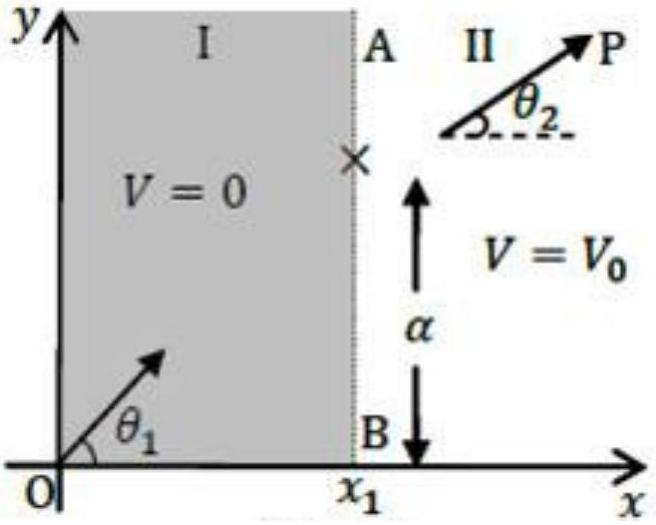
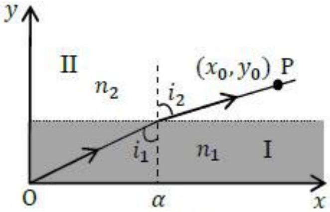
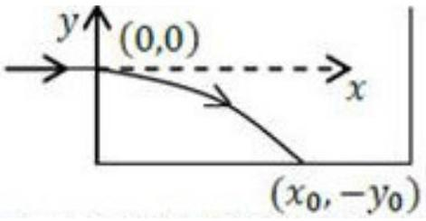
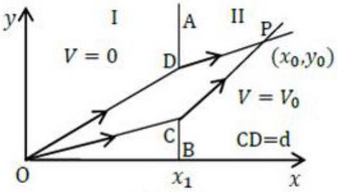
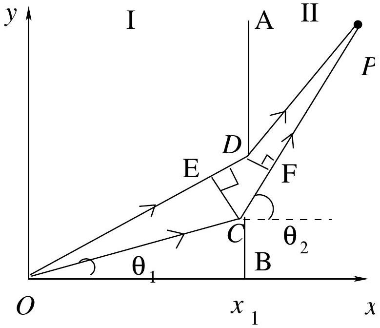
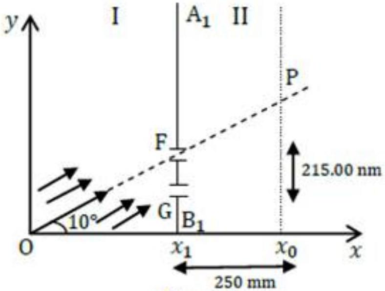
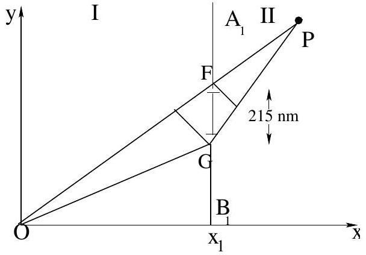

## The Extremum Principle ${ } ^ { 1 }$

## A. The Extremum Principle in Mechanics

Consider a horizontal frictionless $x - y$ plane shown in Fig. 1. It is divided into two regions, I and II, by a line AB satisfying the equation $x = x _ { 1 }$. The potential energy of a point particle of mass $m$ in region I is $V = 0$ while it is $V = V _ { 0 }$ in region II. The particle is sent from the origin O with speed $v _ { 1 }$ along a line making an angle $\theta _ { 1 }$ with the $x$-axis. It reaches point P in region II traveling with speed $v _ { 2 }$ along a line that makes an angle $\theta _ { 2 }$ with the $x$-axis. Ignore gravity and relativistic effects in this entire task T-2 (all parts).

Figure 1

(A1) Obtain an expression for $v _ { 2 }$ in terms of $m , v _ { 1 }$ and $V _ { 0 }$. [0.2]

Solution:
From the principle of Conservation of Mechanical Energy

$$
\begin{gathered}
\frac { 1 } { 2 } m v _ { 1 } ^ { 2 } = \frac { 1 } { 2 } m v _ { 2 } ^ { 2 } + V _ { 0 } \\
v _ { 2 } = \left( v _ { 1 } ^ { 2 } - \frac { 2 V _ { 0 } } { m } \right) ^ { 1 / 2 }
\end{gathered}
$$

(A2) Express $v _ { 2 }$ in terms of $v _ { 1 } , \theta _ { 1 }$ and $\theta _ { 2 }$. [0.3]

Solution:
At the boundary there is an impulsive force $( \propto d V / d x )$ in the $- x$ direction. Hence only the velocity component in the $x$-direction $v _ { 1 x }$ suffers change . The component in the $y$-direction remains unchanged. Therefore

$$
\begin{aligned}
& v _ { 1 y } = v _ { 2 y } \\
& v _ { 1 } \sin \theta _ { 1 } = v _ { 2 } \sin \theta _ { 2 }
\end{aligned}
$$

We define a quantity called action $A = m \int v ( s ) d s$, where $d s$ is the infinitesimal length along the trajectory of a particle of mass $m$ moving with speed $v ( s )$. The integral is taken over the path. As an example. for a particle moving with constant speed $v$ on a circular path of radius $R$, the action $A$ for one revolution will be $2 \pi m R v$. For a particle with constant energy $E$, it can be shown that of all the possible trajectories between two fixed points, the actual trajectory is the one on which $A$ defined above is an extremum (minimum or maximum). Historically this is known as the Principle of Least Action (PLA).

[^0]
(A3) PLA implies that the trajectory of a particle moving between two fixed points in a region of constant potential will be a straight line. Let the two fixed points O and P in Fig. 1 have coordinates $( 0,0 )$ and $\left( x _ { 0 } , y _ { 0 } \right)$ respectively and the boundary point where the particle transits from region I to region II have coordinates $\left( x _ { 1 } , \alpha \right)$. Note $x _ { 1 }$ is fixed and the action depends on the coordinate $\alpha$ only. State the expression for the action $A ( \alpha )$. Use PLA to obtain the the relationship between $v _ { 1 } / v _ { 2 }$ and these coordinates.

Solution:
By definition $A ( \alpha )$ from $O$ to $P$ is

$$
A ( \alpha ) = m v _ { 1 } \sqrt { x _ { 1 } ^ { 2 } + \alpha ^ { 2 } } + m v _ { 2 } \sqrt { \left( x _ { 0 } - x _ { 1 } \right) ^ { 2 } + \left( y _ { 0 } - \alpha \right) ^ { 2 } }
$$

Differentiating w.r.t. $\alpha$ and setting the derivative of $A ( \alpha )$ to zero

$$
\begin{gathered}
\frac { v _ { 1 } \alpha } { \left( x _ { 1 } ^ { 2 } + \alpha ^ { 2 } \right) ^ { 1 / 2 } } - \frac { v _ { 2 } \left( y _ { 0 } - \alpha \right) } { \left[ \left( x _ { 0 } - x _ { 1 } \right) ^ { 2 } + \left( y _ { 0 } - \alpha \right) ^ { 2 } \right] ^ { 1 / 2 } } = 0 \\
\therefore \frac { v _ { 1 } } { v _ { 2 } } = \frac { \left( y _ { 0 } - \alpha \right) \left( x _ { 1 } ^ { 2 } + \alpha ^ { 2 } \right) ^ { 1 / 2 } } { \alpha \left[ \left( x _ { 0 } - x _ { 1 } \right) ^ { 2 } + \left( y _ { 0 } - \alpha \right) ^ { 2 } \right] ^ { 1 / 2 } }
\end{gathered}
$$

Note this is the same as A2, namely $v _ { 1 } \sin \theta _ { 1 } = v _ { 2 } \sin \theta _ { 2 }$.

## B. The Extremum Principle in Optics

A light ray travels from medium I to medium II with refractive indices $n _ { 1 }$ and $n _ { 2 }$ respectively. The two media are separated by a line parallel to the x-axis. The light ray makes an angle $i _ { 1 }$ with the y-axis in medium I and $i _ { 2 }$ in medium II (see Fig. 2). To obtain the trajectory of the ray, we make use of another extremum (minimum or maximum) principle known as Fermat's principle of least time.

Figure 2

(B1) The principle states that between two fixed points, a light ray moves along a path such that the time taken between the two points is an extremum. Derive the relation between $\sin i _ { 1 }$ and $\sin i _ { 2 }$ on the basis of Fermat's principle.

Solution:
The speed of light in medium I is $c / n _ { 1 }$ and in medium II is $c / n _ { 2 }$, where $c$ is the speed of light in vacuum. Let the two media be separated by the fixed line $y = y _ { 1 }$. Then time $T ( \alpha )$ for light to travel from origin $( 0,0 )$ and $\left( x _ { 0 } , y _ { 0 } \right)$ is

$$
T ( \alpha ) = n _ { 1 } \left( \sqrt { y _ { 1 } ^ { 2 } + \alpha ^ { 2 } } \right) / c + n _ { 2 } \left( \sqrt { \left( x _ { 0 } - \alpha \right) ^ { 2 } + \left( y _ { 0 } - y _ { 1 } \right) ^ { 2 } } \right) / c
$$

Differentiating w.r.t. $\alpha$ and setting the derivative of $T ( \alpha )$ to zero

$$
\begin{gathered}
\frac { n _ { 1 } \alpha } { \left( y _ { 1 } ^ { 2 } + \alpha ^ { 2 } \right) ^ { 1 / 2 } } - \frac { n _ { 2 } \left( y _ { 0 } - \alpha \right) } { \left[ \left( x _ { 0 } - \alpha \right) ^ { 2 } + \left( y _ { 0 } - y _ { 1 } \right) ^ { 2 } \right] ^ { 1 / 2 } } = 0 \\
\therefore \quad n _ { 1 } \sin i _ { 1 } = n _ { 2 } \sin i _ { 2 }
\end{gathered}
$$

[Note: Derivation is similar to A3. This is Snell's law.]

Shown in Fig. 3 is a schematic sketch of the path of a laser beam incident horizontally on a solution of sugar in which the concentration of sugar decreases with height. As a consequence, the refractive index of the solution also decreases with height.

Figure 3

(B2) Assume that the refractive index n(y) depends only on y. Use the equation obtained in B1 to obtain the expresssion for the slope $d y / d x$ of the beam's path in terms of $n _ { 0 }$ at $y = 0$ and $n ( y )$.

Solution:
From Snell's law $n _ { 0 } \sin i _ { 0 } = n ( y ) \sin i$
Then,

$$
\frac { d y } { d x } = - \cot i
$$

$$
\begin{aligned}
& n _ { 0 } \sin i _ { 0 } = \frac { n ( y ) } { \sqrt { 1 + \left( \frac { d y } { d x } \right) ^ { 2 } } } \\
& \frac { d y } { d x } = - \sqrt { \left( \frac { n ( y ) } { n _ { 0 } \sin i _ { 0 } } \right) ^ { 2 } - 1 }
\end{aligned}
$$

(B3) The laser beam is directed horizontally from the origin $( 0,0 )$ into the sugar solution at a height $y _ { 0 }$ from the bottom of the tank as shown. Take $n ( y ) = n _ { 0 } - k y$ where $n _ { 0 }$ and $k$ are positive constants. Obtain an expression for $x$ in terms of $y$ and related quantities. You may use: $\int \sec \theta d \theta = \ln ( \sec \theta + \tan \theta ) +$ constant $\sec \theta = 1 / \cos \theta$ or $\int \frac { d x } { \sqrt { x ^ { 2 } - 1 } } =$ $\ln \left( x + \sqrt { x ^ { 2 } - 1 } \right) +$ constant.

Solution:

$$
\int \frac { d y } { \sqrt { \left( \frac { n _ { 0 } - k y } { n _ { 0 } \sin i _ { 0 } } \right) ^ { 2 } - 1 } } = - \int d x
$$

Note $i _ { 0 } = 90 ^ { \circ }$ so $\sin i _ { 0 } = 1$.

Method I We employ the substitution

$$
\begin{gathered}
\xi = \frac { n _ { 0 } - k y } { n _ { 0 } } \\
\int \frac { d \xi \left( - \frac { n _ { 0 } } { k } \right) } { \sqrt { \xi ^ { 2 } - 1 } } = - \int d x
\end{gathered}
$$

Let $\xi = \sec \theta$. Then

$$
\frac { n _ { 0 } } { k } \ln ( \sec \theta + \tan \theta ) = x + c
$$

Or METHOD II
We employ the substition

$$
\begin{gathered}
\xi = \frac { n _ { 0 } - k y } { n _ { 0 } } \\
\int \frac { d \xi \left( - \frac { n _ { 0 } } { k } \right) } { \sqrt { \xi ^ { 2 } - 1 } } = - \int d x \\
- \frac { n _ { 0 } } { k } \ln \left( \frac { n _ { 0 } - k y } { n _ { 0 } } + \sqrt { \left( \frac { n _ { 0 } - k y } { n _ { 0 } } \right) ^ { 2 } - 1 } \right) = - x + c
\end{gathered}
$$

Now continuing
Considering the substitutions and boundary condition, $x = 0$ for $y = 0$ we obtain that the constant $c = 0$.
Hence we obtain the following trajectory:

$$
x = \frac { n _ { 0 } } { k } \ln \left( \frac { n _ { 0 } - k y } { n _ { 0 } } + \sqrt { \left( \frac { n _ { 0 } - k y } { n _ { 0 } } \right) ^ { 2 } - 1 } \right)
$$

(B4) Obtain the value of $x _ { 0 }$, the point where the beam meets the bottom of the tank. Take $y _ { 0 }$ $= 10.0 \mathrm {~cm} , n _ { 0 } = 1.50 , k = 0.050 \mathrm {~cm} ^ { - 1 } \left( 1 \mathrm {~cm} = 10 ^ { - 2 } \mathrm {~m} \right)$.

Solution:
Given $y _ { 0 } = 10.0 \mathrm {~cm} . \quad n _ { 0 } = 1.50 \quad k = 0.050 \mathrm {~cm} ^ { - 1 }$
From (B3)

$$
x _ { 0 } = \frac { n _ { 0 } } { k } \ln \left[ \left( \frac { n _ { 0 } - k y } { n _ { 0 } } \right) + \left( \left( \frac { n _ { 0 } - k y } { n _ { 0 } } \right) ^ { 2 } - 1 \right) ^ { 1 / 2 } \right]
$$

Here $y = - y _ { 0 }$

$$
\begin{gathered}
x _ { 0 } = \frac { n _ { 0 } } { k } \ln \left[ \frac { \left( n _ { 0 } + k y _ { 0 } \right) } { n _ { 0 } } + \left( \frac { \left( n _ { 0 } + k y _ { 0 } \right) ^ { 2 } } { n _ { 0 } ^ { 2 } } - 1 \right) ^ { 1 / 2 } \right] \\
= 30 \ln \left[ \frac { 2 } { 1.5 } + \left( \left( \frac { 2 } { 1.5 } \right) ^ { 2 } - 1 \right) ^ { 1 / 2 } \right] \\
= 30 \ln \left[ \frac { 4 } { 3 } + \left( \frac { 7 } { 9 } \right) ^ { 1 / 2 } \right] \\
= 30 \ln \left[ \frac { 4 } { 3 } + 0.88 \right] \\
= 24.0 \mathrm {~cm}
\end{gathered}
$$

## C. The Extremum Principle and the Wave Nature of Matter

We now explore between the PLA and the wave nature of a moving particle. For this we assume that a particle moving from O to P can take all possible trajectories and we will seek a trajectory that depends on the constructive interference of de Broglie waves.

(C1) As the particle moves along its trajectory by an infinitesimal distance $\Delta s$, relate the change $\Delta \phi$ in the phase of its de Broglie wave to the change $\Delta A$ in the action and the Planck constant.

Solution:
From the de Broglie hypothesis

$$
\lambda \rightarrow \lambda _ { d B } = h / m v
$$

where $\lambda$ is the de Broglie wavelength and the other symbols have their usual meaning

$$
\begin{gathered}
\Delta \phi = \frac { 2 \pi } { \lambda } \Delta s \\
= \frac { 2 \pi } { h } m v \Delta s \\
= \frac { 2 \pi \Delta A } { h }
\end{gathered}
$$

(C2)
Recall the problem from part A where the particle traverses from O to P (see Fig. 4). Let an opaque partition be placed at the boundary AB between the two regions. There is a small opening CD of width $d$ in AB such that $d \ll \left( x _ { 0 } - x _ { 1 } \right)$ and $d \ll x _ { 1 }$.
Consider two extreme paths OCP and ODP such that OCP lies on the classical trajectory discussed in part A. Obtain the phase difference $\Delta \phi _ { C D }$ between

Figure 4

Solution:

Consider the extreme trajectories $O C P$ and $O D P$ of (C1)
The geometrical path difference is $E D$ in region I and $C F$ in region II.
This implies (note: $d \ll \left( x _ { 0 } - x _ { 1 } \right)$ and $d \ll x _ { 1 }$ )

$$
\begin{gathered}
\Delta \phi _ { C D } = \frac { 2 \pi d \sin \theta _ { 1 } } { \lambda _ { 1 } } - \frac { 2 \pi d \sin \theta _ { 2 } } { \lambda _ { 2 } } \\
\Delta \phi _ { C D } = \frac { 2 \pi m v _ { 1 } d \sin \theta _ { 1 } } { h } - \frac { 2 \pi m v _ { 2 } d \sin \theta _ { 2 } } { h } \\
= 2 \pi \frac { m d } { h } \left( v _ { 1 } \sin \theta _ { 1 } - v _ { 2 } \sin \theta _ { 2 } \right) \\
= 0 \quad ( \text { from } \mathrm { A } 2 \text { or } \mathrm { B } 1 )
\end{gathered}
$$

Thus near the clasical path there is invariably constructive interference.

## D. Matter Wave Interference

Consider an electron gun at O which directs a collimated beam of electrons to a narrow slit at F in the opaque partition $\mathrm { A } _ { 1 } \mathrm {~B} _ { 1 }$ at $x = x _ { 1 }$ such that OFP is a straight line. $P$ is a point on the screen at $x = x _ { 0 }$ (see Fig. 5). The speed in I is $v _ { 1 } = 2.0000$ $\times 10 ^ { 7 } \mathrm {~m} \mathrm {~s} ^ { - 1 }$ and $\theta = 10.0000 ^ { \circ }$. The potential in region II is such that the speed $v _ { 2 } =$ $1.9900 \times 10 ^ { 7 } \mathrm {~m} \mathrm {~s} ^ { - 1 }$. The distance $x _ { 0 } - x _ { 1 }$ is $250.00 \mathrm {~mm} \left( 1 \mathrm {~mm} = 10 ^ { - 3 } \mathrm {~m} \right)$. Ignore electron-electron interaction.

Figure 5

(D1) If the electrons at O have been accelerated from rest, calculate the accelerating potential $U _ { 1 }$.

Solution:

$$
\begin{gathered}
q U _ { 1 } = \frac { 1 } { 2 } m v ^ { 2 } \\
= \frac { 9.11 \times 10 ^ { - 31 } \times 4 \times 10 ^ { 14 } } { 2 } \mathrm {~J} \\
= 2 \times 9.11 \times 10 ^ { - 17 } \mathrm {~J} \\
= \frac { 2 \times 9.11 \times 10 ^ { - 17 } } { 1.6 \times 10 ^ { - 19 } } \mathrm { eV } \\
= 1.139 \times 10 ^ { 3 } \mathrm { eV } ( \simeq 1100 \mathrm { eV } ) \\
U _ { 1 } = 1.139 \times 10 ^ { 3 } \mathrm {~V}
\end{gathered}
$$

(D2) Another identical slit G is made in the partition $\mathrm { A } _ { 1 } \mathrm {~B} _ { 1 }$ at a distance of 215.00 nm (1 nm $\left. = 10 ^ { - 9 } \mathrm {~m} \right)$ below slit F (Fig. 5). If the phase difference between de Broglie waves ariving at $P$ from $F$ and $G$ is $2 \pi \beta$, calculate $\beta$.

Solution: Phase difference at $P$ is

$$
\begin{gathered}
\Delta \phi _ { P } = \frac { 2 \pi d \sin \theta } { \lambda _ { 1 } } - \frac { 2 \pi d \sin \theta } { \lambda _ { 2 } } \\
= 2 \pi \left( v _ { 1 } - v _ { 2 } \right) \frac { m d } { h } \sin 10 ^ { \circ } = 2 \pi \beta \\
\beta = 5.13
\end{gathered}
$$

(D3) What is is the smallest distance $\Delta y$ from P at which null (zero) electron detection maybe expected on the screen? [Note: you may find the approximation $\sin ( \theta + \Delta \theta ) \approx \sin \theta +$ $\Delta \theta \cos \theta$ useful]

Solution:

From previous part for null (zero) electron detection $\Delta \phi = 5.5 \times 2 \pi$

$$
\begin{aligned}
& \therefore m v _ { 1 } \frac { d \sin \theta } { h } - \frac { m v _ { 2 } d \sin ( \theta + \Delta \theta ) } { h } = 5.5 \\
\sin ( \theta + \Delta \theta ) & = \frac { \frac { m v _ { 1 } d \sin \theta } { h } - 5.5 } { \frac { m v _ { 2 } d } { h } } \\
& = \frac { v _ { 1 } } { v _ { 2 } } \sin \theta - \frac { h } { m } \frac { 5.5 } { v _ { 2 } d } \\
& = \frac { 2 } { 1.99 } \sin 10 ^ { \circ } - \frac { 5.5 } { 1374.78 \times 1.99 \times 10 ^ { 7 } \times \times 2.15 \times 10 ^ { - 7 } } \\
& = 0.174521 - 0.000935
\end{aligned}
$$

This yields $\Delta \theta = - 0.0036 ^ { \circ }$

The closest distance to P is

$$
\begin{aligned}
\Delta y & = \left( x _ { 0 } - x _ { 1 } \right) ( \tan ( \theta + \Delta \theta ) - \tan \theta ) \\
& = 250 ( \tan 9.9964 - \tan 10 ) \\
& = - 0.0162 m m \\
& = - 16.2 \mu \mathrm {~m}
\end{aligned}
$$

The negative sign means that the closest minimum is below P.
Approximate Calculation for $\theta$ and $\Delta y$
Using the approximation $\sin ( \theta + \Delta \theta ) \approx \sin \theta + \Delta \theta \cos \theta$
The phase difference of $5.5 \times 2 \pi$ gives

$$
m v _ { 1 } \frac { d \sin 10 ^ { \circ } } { h } - m v _ { 2 } \frac { d \left( \sin 10 ^ { \circ } + \Delta \theta \cos 10 ^ { \circ } \right) } { h } = 5.5
$$

From solution of the previous part

$$
m v _ { 1 } \frac { d \sin 10 ^ { \circ } } { h } - m v _ { 2 } \frac { d \sin 10 ^ { \circ } } { h } = 5.13
$$

Therefore

$$
m v _ { 2 } \frac { d \Delta \theta \cos 10 ^ { \circ } } { h } = 0.3700
$$

This yields $\Delta \theta \approx 0.0036 ^ { \circ }$

$$
\Delta y = - 0.0162 \mathrm {~mm} = - 16.2 \mu \mathrm {~m} \text { as before }
$$

(D4) The electron beam has a square cross section of $500 \mathrm {~nm} \times 500 \mathrm {~nm}$ and the setup is 2 m long. What should be the minimum beam flux density $I _ { \text {min } }$ (number of electrons per unit normal area per unit time) if, on an average, there is at least one electron in the setup at a given time?

Solution: The product of the speed of the electrons and number of electron per unit volume on an average yields the intensity.
Thus $N = 1 =$ Intensity × Area × Length/ Electron Speed

$$
= I _ { \min } \times 0.25 \times 10 ^ { - 12 } \times 2 / 2 \times 10 ^ { 7 }
$$

This gives $I _ { \text {min } } = 4 \times 10 ^ { 19 } \mathrm {~m} ^ { - 2 } \mathrm {~s} ^ { - 1 }$
R. Bach, D. Pope, Sy-H Liou and H. Batelaan, New J. of Physics Vol. 15, 033018 (2013).

[^0]:    ${ } ^ { 1 }$ Manoj Harbola (IIT-Kanpur) and Vijay A. Singh (ex-National Coordinator, Science Olympiads) were the principal authors of this problem. The contributions of the Academic Committee, Academic Development Group and the International Board are gratefully acknowledged.
