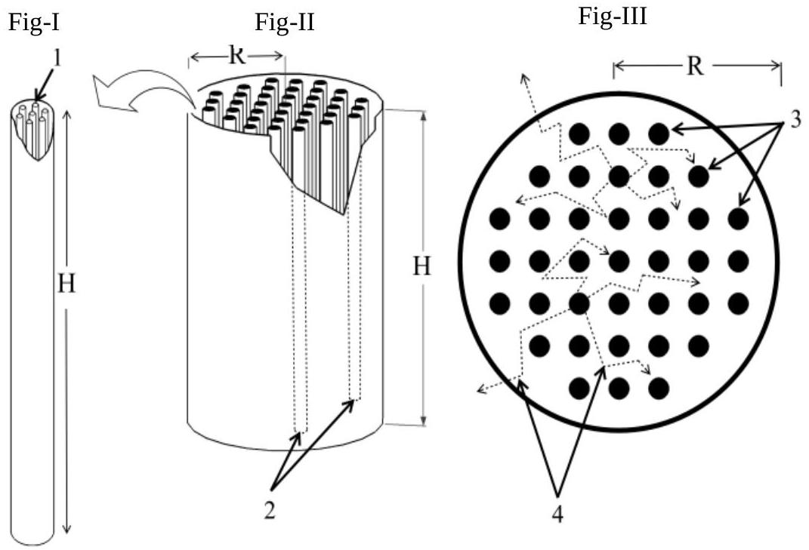
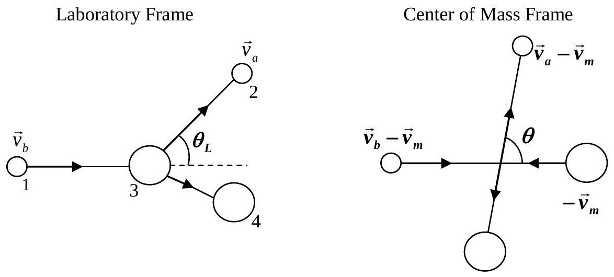

## The Design of a Nuclear Reactor ${ } ^ { 1 }$

Uranium occurs in nature as $\mathrm { UO } _ { 2 }$ with only 0.720\% of the uranium atoms being ${ } ^ { 235 } \mathrm { U }$. Neutron induced fission occurs readily in ${ } ^ { 235 } \mathrm { U }$ with the emission of 2-3 fission neutrons having high kinetic energy. This fission probability will increase if the neutrons inducing fission have low kinetic energy. So by reducing the kinetic energy of the fission neutrons, one can induce a chain of fissions in other ${ } ^ { 235 } \mathrm { U }$ nuclei. This forms the basis of the power generating nuclear reactor (NR).

A typical NR consists of a cylindrical tank of height $H$ and radius $R$ filled with a material called moderator. Cylindrical tubes, called fuel channels, each containing a cluster of cylindrical fuel pins of natural $\mathrm { UO } _ { 2 }$ in solid form of height $H$, are kept axially in a square array. Fission neutrons, coming outward from a fuel channel, collide with the moderator, losing energy, and reach the surrounding fuel channels with low enough energy to cause fission (Figs I-III). Heat generated from fission in the pin is transmitted to a coolant fluid flowing along its length. In the current problem we shall study some of the physics behind the (A) Fuel Pin, (B) Moderator and (C) NR of cylindrical geometry.

Schematic sketch of the Nuclear Reactor (NR)
Fig-I: Enlarged view of a fuel channel (1-Fuel Pins)
Fig-II: A view of the NR (2-Fuel Channels)
Fig-III: Top view of NR (3-Square Arrangement of Fuel Channels and 4-Typical Neutron Paths). Only components relevant to the problem are shown (e.g. control rods and coolant are not shown).

## A. Fuel Pin

Data for $\mathrm { UO } _ { 2 }$

1. Molecular weight $M _ { w } = 0.270 \mathrm {~kg} \mathrm {~mol} ^ { - 1 }$
2. Density $\rho = 1.060 \times 10 ^ { 4 } \mathrm {~kg} \mathrm {~m} ^ { - 3 }$
3. Melting point $T _ { m } = 3.138 \times 10 ^ { 3 } \mathrm {~K}$
4. Thermal conductivity $\lambda = 3.280 \mathrm {~W} \mathrm {~m} ^ { - 1 } \mathrm {~K} ^ { - 1 }$

A1 Consider the following fission reaction of a stationary ${ } ^ { 235 } \mathrm { U }$ after it absorbs a neutron of negligible kinetic energy.

$$
{ } ^ { 235 } \mathrm { U } + { } ^ { 1 } \mathrm { n } \longrightarrow { } ^ { 94 } \mathrm { Zr } + { } ^ { 140 } \mathrm { Ce } + 2 ^ { 1 } \mathrm { n } + \Delta E
$$

[^0]
Estimate $\Delta E$ (in MeV) the total fission energy released. The nuclear masses are: $m \left( { } ^ { 235 } \mathrm { U } \right)$ $= 235.044 \mathrm { u } ; m \left( { } ^ { 94 } \mathrm { Zr } \right) = 93.9063 \mathrm { u } ; m \left( { } ^ { 140 } \mathrm { Ce } \right) = 139.905 \mathrm { u } ; m \left( { } ^ { 1 } \mathrm { n } \right) = 1.00867 \mathrm { u }$ and $1 \mathrm { u } =$ $931.502 \mathrm { MeV } \mathrm { c } ^ { - 2 }$. Ignore charge imbalance.

Solution: $\Delta E = 208.684 \mathrm { MeV }$

Detailed solution: The energy released during the transformation is

$$
\Delta E = \left[ m \left( { } ^ { 235 } \mathrm { U } \right) + m \left( { } ^ { 1 } \mathrm { n } \right) - m \left( { } ^ { 94 } \mathrm { Zr } \right) - m \left( { } ^ { 140 } \mathrm { Ce } \right) - 2 m \left( { } ^ { 1 } \mathrm { n } \right) \right] \mathrm { c } ^ { 2 }
$$

Since the data is supplied in terms of unified atomic masses (u), we have

$$
\Delta E = \left[ m \left( { } ^ { 235 } \mathrm { U } \right) - m \left( { } ^ { 94 } \mathrm { Zr } \right) - m \left( { } ^ { 140 } \mathrm { Ce } \right) - m \left( { } ^ { 1 } \mathrm { n } \right) \right] \mathrm { c } ^ { 2 }
$$

$$
= 208.684 \mathrm { MeV } [ \text { Acceptable Range } ( 208.000 \text { to } 209.000 ) ]
$$

from the given data.

A2 Estimate $N$ the number of ${ } ^ { 235 } \mathrm { U }$ atoms per unit volume in natural $\mathrm { UO } _ { 2 }$.

Solution: $N = 1.702 \times 10 ^ { 26 } \mathrm {~m} ^ { - 3 }$
Detailed solution: The number of $\mathrm { UO } _ { 2 }$ molecules per $\mathrm { m } ^ { 3 }$ of the fuel $N _ { 1 }$ is given in the terms of its density $\rho$, the Avogadro number $N _ { A }$ and the average molecular weight $M _ { w }$ as

$$
\begin{aligned}
N _ { 1 } & = \frac { \rho N _ { A } } { M _ { w } } \\
& = \frac { 10600 \times 6.022 \times 10 ^ { 23 } } { 0.270 } = 2.364 \times 10 ^ { 28 } \mathrm {~m} ^ { - 3 }
\end{aligned}
$$

Each molecule of $\mathrm { UO } _ { 2 }$ contains one uranium atom. Since only 0.72\% of these are ${ } ^ { 235 } \mathrm { U }$,

$$
\begin{aligned}
N & = 0.0072 \times N _ { 1 } \\
& = 1.702 \times 10 ^ { 26 } \mathrm {~m} ^ { - 3 } [ \text { Acceptable Range } ( \mathbf { 1 . 6 5 0 } \text { to } \mathbf { 1 . 7 5 0 } ) ]
\end{aligned}
$$

A3 Assume that the neutron flux $\phi = 2.000 \times 10 ^ { 18 } \mathrm {~m} ^ { - 2 } \mathrm {~s} ^ { - 1 }$ on the fuel is uniform. The fission cross-section (effective area of the target nucleus) of a ${ } ^ { 235 } \mathrm { U }$ nucleus is $\sigma _ { f } = 5.400 \times 10 ^ { - 26 }$ $\mathrm { m } ^ { 2 }$. If 80.00\% of the fission energy is available as heat, estimate $Q$ (in $\mathrm { W } \mathrm { m } ^ { - 3 }$ ) the rate of heat production in the pin per unit volume. $1 \mathrm { MeV } = 1.602 \times 10 ^ { - 13 } \mathrm {~J}$.

Solution: $Q = 4.917 \times 10 ^ { 8 } \mathrm {~W} / \mathrm { m } ^ { 3 }$
Detailed solution: It is given that 80\% of the fission energy is available as heat thus the heat energy available per fission $E _ { f }$ is from a-(i)

$$
\begin{aligned}
E _ { f } & = 0.8 \times 208.7 \mathrm { MeV } \\
& = 166.96 \mathrm { MeV } \\
& = 2.675 \times 10 ^ { - 11 } \mathrm {~J}
\end{aligned}
$$

The total cross-section per unit volume is $N \times \sigma _ { f }$. Thus the heat produced per unit

volume per unit time $Q$ is

$$
\begin{aligned}
Q & = N \times \sigma _ { f } \times \phi \times E _ { f } \\
& = \left( 1.702 \times 10 ^ { 26 } \right) \times \left( 5.4 \times 10 ^ { - 26 } \right) \times \left( 2 \times 10 ^ { 18 } \right) \times \left( 2.675 \times 10 ^ { - 11 } \right) \mathrm { W } / \mathrm { m } ^ { 3 } \\
& = 4.917 \times 10 ^ { 8 } \mathrm {~W} / \mathrm { m } ^ { 3 } [ \text { Acceptable Range } ( \mathbf { 4 . 8 0 0 } \text { to } \mathbf { 5 . 0 0 0 } ) ]
\end{aligned}
$$

A4 The steady-state temperature difference between the center $\left( T _ { c } \right)$ and the surface $\left( T _ { s } \right)$ of the pin can be expressed as $T _ { c } - T _ { s } = k F ( Q , a , \lambda )$ where $k = 1 / 4$ is a dimensionless constant and $a$ is the radius of the pin. Obtain $F ( Q , a , \lambda )$ by dimensional analysis.

Solution: $T _ { c } - T _ { s } = \frac { Q a ^ { 2 } } { 4 \lambda }$.
Detailed solution: The dimensions of $T _ { c } - T _ { s }$ is temperature. We write this as $T _ { c } - T _ { s } = [ K ]$. Once can similarly write down the dimensions of $Q , a$ and $\lambda$. Equating the temperature to powers of $Q , a$ and $\lambda$, one could state the following dimensional equation:

$$
\begin{aligned}
& K = Q ^ { \alpha } a ^ { \beta } \lambda ^ { \gamma } \\
& = \left[ M L ^ { - 1 } T ^ { - 3 } \right] ^ { \alpha } [ L ] ^ { \beta } \left[ M L ^ { 1 } T ^ { - 3 } K ^ { - 1 } \right] ^ { \gamma }
\end{aligned}
$$

This yields the following algebraic equations

$$
\gamma = - 1 \text { equating powers of temperature }
$$

$\alpha + \gamma = 0$ equating powers of mass or time. From the previous equation we get $\alpha = 1$
Next $- \alpha + \beta + \gamma = 0$ equating powers of length. This yields $\beta = 2$.
Thus we obtain $T _ { c } - T _ { s } = \frac { Q a ^ { 2 } } { 4 \lambda }$ where we insert the dimensionless factor 1/4 as suggested in the problem. No penalty if the factor 1/4 is not written.

Note: Same credit for alternate ways of obtaining $\alpha , \beta , \gamma$.

A5 The desired temperature of the coolant is $5.770 \times 10 ^ { 2 } \mathrm {~K}$. Estimate the upper limit $a _ { u }$ on the radius $a$ of the pin.

Solution: $a _ { u } = 8.267 \times 10 ^ { - 3 } \mathrm {~m}$.

Detailed solution: The melting point of $\mathrm { UO } _ { 2 }$ is 3138 K and the maximum temperature of the coolant is 577 K. This sets a limit on the maximum permissible temperature $\left( T _ { c } - T _ { s } \right)$ to be less than $( 3138 - 577 = 2561 \mathrm {~K} )$ to avoid "meltdown". Thus one may take a maximum of $\left( T _ { c } - T _ { s } \right) = 2561 \mathrm {~K}$.
Noting that $\lambda = 3.28 \mathrm {~W} / \mathrm { m } - \mathrm { K }$, we have

$$
a _ { u } ^ { 2 } = \frac { 2561 \times 4 \times 3.28 } { 4.917 \times 10 ^ { 8 } }
$$

Where we have used the value of $Q$ from A2. This yields $a _ { u } \simeq 8.267 \times 10 ^ { - 3 } \mathrm {~m}$. So $a _ { u } = 8.267 \times 10 ^ { - 3 } \mathrm {~m}$ constitutes an upper limit on the radius of the fuel pin.

Note: The Tarapur 3 \& 4 NR in Western India has a fuel pin radius of $6.090 \times 10 ^ { - 3 }$ m.

B. The Moderator

Consider the two dimensional elastic collision between a neutron of mass 1 u and a moderator atom of mass Au. Before collision all the moderator atoms are considered at rest in the laboratory frame (LF). Let $\overrightarrow { v _ { b } }$ and $\overrightarrow { v _ { a } }$ be the velocities of the neutron before and after collision respectively in the LF. Let $\overrightarrow { v _ { m } }$ be the velocity of the center of mass (CM) frame relative to LF and $\theta$ be the neutron scattering angle in the CM frame. All the particles involved in collisions are moving at non-relativistic speeds

B1 The collision in LF is shown schematically with $\theta _ { L }$ as the scattering angle (Fig-IV). Sketch the collision schematically in CM frame. Label the particle velocities for 1, 2 and 3 in terms of $\overrightarrow { v _ { b } } , \overrightarrow { v _ { a } }$ and $\overrightarrow { v _ { m } }$. Indicate the scattering angle $\theta$.
    Fig-IV
    Collision in the Laboratory Frame
    1-Neutron before collision
    2-Neutron after collision
    3-Moderator Atom before collision
    4-Moderator Atom after collision

Solution:

B2 Obtain $v$ and $V$, the speeds of the neutron and the moderator atom in the CM frame after the collision, in terms of $A$ and $v _ { b }$.

Solution: Detailed solution: Before the collision in the CM frame $\left( v _ { b } - v _ { m } \right)$ and $v _ { m }$ will be magnitude of the velocities of the neutron and moderator atom respectively. From momentum conservation in the CM frame, $v _ { b } - v _ { m } = A v _ { m }$ gives $v _ { m } = \frac { v _ { b } } { A + 1 }$.

After the collision, let $v$ and $V$ be magnitude of the velocities of neutron and moderator atom respectively in the CM frame. From conservation laws,

$$
v = A V \quad \text { and } \quad \frac { 1 } { 2 } \left( v _ { b } - v _ { m } \right) ^ { 2 } + \frac { 1 } { 2 } A v _ { m } ^ { 2 } = \frac { 1 } { 2 } v ^ { 2 } + \frac { 1 } { 2 } A V ^ { 2 } \cdot ( \rightarrow [ 0.2 + 0.2 ] )
$$

Solving gives $v = \frac { A v _ { b } } { A + 1 }$ and $V = \frac { v _ { b } } { A + 1 }$. (OR) From definition of center of mass frame $v _ { m } = \frac { v _ { b } } { A + 1 }$. Before the collision in the CM frame $v _ { b } - v _ { m } = \frac { A v _ { b } } { A + 1 }$ and $v _ { m }$ will be magnitude of the velocities of the neutron and moderator atom respectively. In elastic collision the particles are scattered in the opposite direction in the CM frame and so the speeds remain same $v = \frac { A v _ { b } } { A + 1 }$ and $V = \frac { v _ { b } } { A + 1 } ( \rightarrow [ 0.2 + 0.1 ] )$.

Note: Alternative solutions are worked out in the end and will get appropriate weightage.

B3 Derive an expression for $G ( \alpha , \theta ) = E _ { a } / E _ { b }$, where $E _ { b }$ and $E _ { a }$ are the kinetic energies of the neutron, in the LF, before and after the collision respectively, and $\alpha \equiv [ ( A - 1 ) / ( A + 1 ) ] ^ { 2 }$,

Solution:

$$
G ( \alpha , \theta ) = \frac { E _ { a } } { E _ { b } } = \frac { A ^ { 2 } + 2 A \cos \theta + 1 } { ( A + 1 ) ^ { 2 } } = \frac { 1 } { 2 } [ ( 1 + \alpha ) + ( 1 - \alpha ) \cos \theta ] .
$$

Detailed solution: Since $\overrightarrow { v _ { a } } = \vec { v } + \overrightarrow { v _ { m } } , v _ { a } ^ { 2 } = v ^ { 2 } + v _ { m } ^ { 2 } + 2 v v _ { m } \cos \theta ( \rightarrow [ 0.3 ] )$. Substituting the values of $v$ and $v _ { m } , v _ { a } ^ { 2 } = \frac { A ^ { 2 } v _ { b } ^ { 2 } } { ( A + 1 ) ^ { 2 } } + \frac { v _ { b } ^ { 2 } } { ( A + 1 ) ^ { 2 } } + \frac { 2 A v _ { b } ^ { 2 } } { ( A + 1 ) ^ { 2 } } \cos \theta ( \rightarrow [ 0.2 ] )$, so

$$
\frac { v _ { a } ^ { 2 } } { v _ { b } ^ { 2 } } = \frac { E _ { a } } { E _ { b } } = \frac { A ^ { 2 } + 2 A \cos \theta + 1 } { ( A + 1 ) ^ { 2 } } .
$$

$$
G ( \alpha , \theta ) = \frac { A ^ { 2 } + 1 } { ( A + 1 ) ^ { 2 } } + \frac { 2 A } { ( A + 1 ) ^ { 2 } } \cos \theta = \frac { 1 } { 2 } [ ( 1 + \alpha ) + ( 1 - \alpha ) \cos \theta ] .
$$

Alternate form

$$
= 1 - \frac { ( 1 - \alpha ) ( 1 - \cos \theta ) } { 2 } .
$$

Note: Alternative solutions are worked out in the end and will get appropriate weightage.

B4 Assume that the above expression holds for $\mathrm { D } _ { 2 } \mathrm { O }$ molecule. Calculate the maximum possible fractional energy loss $f _ { l } \equiv \frac { E _ { b } - E _ { a } } { E _ { b } }$ of the neutron for the $\mathrm { D } _ { 2 } \mathrm { O } ( 20 \mathrm { u } )$ moderator.

Solution: $f _ { l } = 0.181$
Detailed solution: The maximum energy loss will be when the collision is head on ie., $E _ { a }$ will be minimum for the scattering angle $\theta = \pi$.

So $E _ { a } = E _ { \text {min } } = \alpha E _ { b }$.
For $\mathrm { D } _ { 2 } \mathrm { O } , \alpha = 0.819$ and maximum fractional $\operatorname { loss } \left( \frac { E _ { b } - E _ { \text {min } } } { E _ { b } } \right) = 1 - \alpha = 0.181$. [ $\boldsymbol { A } \boldsymbol { c }$ ceptable Range (0.170 to 0.190)]

C. The Nuclear Reactor

To operate the NR at any constant neutron flux $\Psi$ (steady state), the leakage of neutrons has to be compensated by an excess production of neutrons in the reactor. For a reactor in cylindrical geometry the leakage rate is $k _ { 1 } \left[ \left( \frac { 2.405 } { R } \right) ^ { 2 } + \left( \frac { \pi } { H } \right) ^ { 2 } \right] \Psi$ and the excess production rate is $k _ { 2 } \Psi$. The constants $k _ { 1 }$ and $k _ { 2 }$ depend on the material properties of the NR.

C1 Consider a NR with $k _ { 1 } = 1.021 \times 10 ^ { - 2 } \mathrm {~m}$ and $k _ { 2 } = 8.787 \times 10 ^ { - 3 } \mathrm {~m} ^ { - 1 }$. Noting that for a fixed volume the leakage rate is to be minimized for efficient fuel utilisation obtain the dimensions of the NR in the steady state.

Solution: $R = 3.175 \mathrm {~m} , H = 5.866 \mathrm {~m}$.
Detailed solution: For constant volume $V = \pi R ^ { 2 } H$,

$$
\begin{gathered}
\frac { d } { d H } \left[ \left( \frac { 2.405 } { R } \right) ^ { 2 } + \left( \frac { \pi } { H } \right) ^ { 2 } \right] = 0 \\
\frac { d } { d H } \left[ \frac { 2.405 ^ { 2 } \pi H } { V } + \frac { \pi ^ { 2 } } { H ^ { 2 } } \right] = \frac { 2.405 ^ { 2 } \pi } { V } - 2 \frac { \pi ^ { 2 } } { H ^ { 3 } } = 0
\end{gathered}
$$

gives $\left( \frac { 2.405 } { R } \right) ^ { 2 } = 2 \left( \frac { \pi } { H } \right) ^ { 2 }$.
For steady state,

$$
1.021 \times 10 ^ { - 2 } \left[ \left( \frac { 2.405 } { R } \right) ^ { 2 } + \left( \frac { \pi } { H } \right) ^ { 2 } \right] \Psi = 8.787 \times 10 ^ { - 3 } \Psi .
$$

Hence $H = 5.866 \mathrm {~m}$ [Acceptable Range (5.870 to 5.890)]
$R = 3.175 \mathrm {~m}$ [Acceptable Range (3.170 to 3.180)].

Alternative Non-Calculus Method to Optimize
Minimisation of the expression $\left( \frac { 2.405 } { R } \right) ^ { 2 } + \left( \frac { \pi } { H } \right) ^ { 2 }$, for a fixed volume $V =$ $\pi R ^ { 2 } H$ :
Substituting for $R ^ { 2 }$ in terms of $V , H$ we get $\frac { 2.405 ^ { 2 } \pi H } { V } + \frac { \pi ^ { 2 } } { H ^ { 2 } }$,
which can be written as, $\frac { 2.405 ^ { 2 } \pi H } { 2 V } + \frac { 2.405 ^ { 2 } \pi H } { 2 V } + \frac { \pi ^ { 2 } } { H ^ { 2 } }$.
Since all the terms are positive applying AMGM inequality for three positive terms we get

$$
\frac { \frac { 2.405 ^ { 2 } \pi H } { 2 V } + \frac { 2.405 ^ { 2 } \pi H } { 2 V } + \frac { \pi ^ { 2 } } { H ^ { 2 } } } { 3 } \geq \sqrt [ 3 ] { \frac { 2.405 ^ { 2 } \pi H } { 2 V } \times \frac { 2.405 ^ { 2 } \pi H } { 2 V } \times \frac { \pi ^ { 2 } } { H ^ { 2 } } } = \sqrt [ 3 ] { \frac { 2.405 ^ { 4 } \pi ^ { 4 } } { 4 V ^ { 2 } } } .
$$

The RHS is a constant. The LHS is always greater or equal to this constant implies that this is the minimum value the LHS can achieve. The minimum is achieved when all the three positive terms are equal, which gives the condition $\frac { 2.405 ^ { 2 } \pi H } { 2 V } =$ $\frac { \pi ^ { 2 } } { H ^ { 2 } } \Rightarrow \left( \frac { 2.405 } { R } \right) ^ { 2 } = 2 \left( \frac { \pi } { H } \right) ^ { 2 }$.
For steady state,

$$
1.021 \times 10 ^ { - 2 } \left[ \left( \frac { 2.405 } { R } \right) ^ { 2 } + \left( \frac { \pi } { H } \right) ^ { 2 } \right] \Psi = 8.787 \times 10 ^ { - 3 } \Psi .
$$

Hence $H = 5.866 \mathrm {~m}$ [Acceptable Range (5.870 to 5.890)]
$R = 3.175 \mathrm {~m}$ [Acceptable Range (3.170 to 3.180)].

Note: Putting the condition in the RHS gives the minimum as $\frac { \pi ^ { 2 } } { H ^ { 2 } }$. From the condition we get $\frac { \pi ^ { 3 } } { H ^ { 3 } } = \frac { 2.405 ^ { 2 } \pi ^ { 2 } } { 2 V } \Rightarrow \frac { \pi ^ { 2 } } { H ^ { 2 } } = \sqrt [ 3 ] { \frac { 2.405 ^ { 4 } \pi ^ { 4 } } { 4 V ^ { 2 } } }$.
Note: The radius and height of the Tarapur 3 \& 4 NR in Western India is 3.192 m and 5.940 m respectively.

C2 The fuel channels are in a square arrangement (Fig-III) with nearest neighbour distance 0.286 m. The effective radius of a fuel channel (if it were solid) is $3.617 \times 10 ^ { - 2 } \mathrm {~m}$. Estimate the number of fuel channels $F _ { n }$ in the reactor and the mass $M$ of $\mathrm { UO } _ { 2 }$ required to operate the NR in steady state.

Solution: $F _ { n } = 387$ and $M = 9.892 \times 10 ^ { 4 } \mathrm {~kg}$.
Detailed solution: Since the fuel channels are in square pitch of 0.286 m, the effective area per channel is $0.286 ^ { 2 } \mathrm {~m} ^ { 2 } = 8.180 \times 10 ^ { - 2 } \mathrm {~m} ^ { 2 }$.

The cross-sectional area of the core is $\pi R ^ { 2 } = 3.142 \times ( 3.175 ) ^ { 2 } = 31.67 \mathrm {~m} ^ { 2 }$, so the maximum number of fuel channels that can be accommodated in the cylinder is the integer part of $\frac { 31.67 } { 0.0818 } = 387$.

Mass of the fuel=387×Volume of the rod×density

$$
= 387 \times \left( \pi \times 0.03617 ^ { 2 } \times 5.866 \right) \times 10600 = 9.892 \times 10 ^ { 4 } \mathrm {~kg} .
$$

$F _ { n } = 387$ [Acceptable Range (380 to 394)]
$M = 9.892 \times 10 ^ { 4 } \mathrm {~kg}$ [Acceptable Range (9.000 to 10.00)]

Note 1: (Not part of grading) The total volume of the fuel is $387 \times \left( \pi \times 0.03617 ^ { 2 } \times \right.$ $5.866 ) = 9.332 \mathrm {~m} ^ { 3 }$. If the reactor works at 12.5 \% efficieny then using the result of a-(iii) we have that the power output of the reactor is $9.332 \times 4.917 \times 10 ^ { 8 } \times 0.125 =$

573 MW.
Note 2: The Tarapur 3 \& 4 NR in Western India has 392 channels and the mass of the fuel in it is $10.15 \times 10 ^ { 4 } \mathrm {~kg}$. It produces 540 MW of power.

Alternative Solutions to sub-parts B2 and B3: Let $\sigma$ be the scattering angle of the Moderator atom in the LF, taken clockwise with respect to the initial direction of the neutron before collision. Let $U$ be the speed of the Moderator atom, in the LF, after collision. From momentum and kinetic conservation in LF we have

$$
\begin{align*}
v _ { b } & = v _ { a } \cos \theta _ { L } + A U \cos \sigma ,  \tag{1}\\
0 & = v _ { a } \sin \theta _ { L } - A U \sin \sigma ,  \tag{2}\\
\frac { 1 } { 2 } v _ { b } ^ { 2 } & = \frac { 1 } { 2 } A U ^ { 2 } + \frac { 1 } { 2 } v _ { a } ^ { 2 } . \tag{3}
\end{align*}
$$

Squaring and adding eq(1) and (2) to eliminate $\sigma$ and from eq(3) we get

$$
\begin{align*}
A ^ { 2 } U ^ { 2 } & = v _ { a } ^ { 2 } + v _ { b } ^ { 2 } - 2 v _ { a } v _ { b } \cos \theta _ { L } \\
A ^ { 2 } U ^ { 2 } & = A v _ { b } ^ { 2 } - A v _ { a } ^ { 2 } \tag{4}
\end{align*}
$$

which gives

$$
\begin{equation*}
2 v _ { a } v _ { b } \cos \theta _ { L } = ( A + 1 ) v _ { a } ^ { 2 } - ( A - 1 ) v _ { b } ^ { 2 } . \tag{5}
\end{equation*}
$$

(ii) Let $v$ be the speed of the neutron after collision in the COMF. From definition of center of mass frame $v _ { m } = \frac { v _ { b } } { A + 1 }$.
$v _ { a } \sin \theta _ { L }$ and $v _ { a } \cos \theta _ { L }$ are the perpendicular and parallel components of $v _ { a }$, in the LF, resolved along the initial direction of the neutron before collision. Transforming these to the COMF gives $v _ { a } \sin \theta _ { L }$ and $v _ { a } \cos \theta _ { L } - v _ { m }$ as the perpendicular and parallel components of $v$. Substituting for $v _ { m }$ and for $2 v _ { a } v _ { b } \cos \theta _ { L }$ from eq(5) in $v = \sqrt { v _ { a } ^ { 2 } \sin ^ { 2 } \theta _ { L } + v _ { a } ^ { 2 } \cos ^ { 2 } \theta _ { L } + v _ { m } ^ { 2 } - 2 v _ { a } v _ { m } \cos \theta _ { L } }$ and simplifying gives $v = \frac { A v _ { b } } { A + 1 }$. Squaring the components of $v$ to eliminate $\theta _ { L }$ gives $v _ { a } ^ { 2 } =$ $v ^ { 2 } + v _ { m } ^ { 2 } + 2 v v _ { m } \cos \theta$. Substituting for $v$ and $v _ { m }$ and simplifying gives,

$$
\begin{gathered}
\frac { v _ { a } ^ { 2 } } { v _ { b } ^ { 2 } } = \frac { E _ { a } } { E _ { b } } = \frac { A ^ { 2 } + 2 A \cos \theta + 1 } { ( A + 1 ) ^ { 2 } } . \\
G ( \alpha , \theta ) = \frac { E _ { a } } { E _ { b } } = \frac { A ^ { 2 } + 1 } { ( A + 1 ) ^ { 2 } } + \frac { 2 A } { ( A + 1 ) ^ { 2 } } \cos \theta = \frac { 1 } { 2 } [ ( 1 + \alpha ) + ( 1 - \alpha ) \cos \theta ] .
\end{gathered}
$$

(OR)
(iii) From definition of center of mass frame $v _ { m } = \frac { v _ { b } } { A + 1 }$. After the collision, let $v$ and $V$ be magnitude of the velocities of neutron and moderator atom respectively in the COMF. From conservation laws in the COMF,

$$
v = A V \quad \text { and } \quad \frac { 1 } { 2 } \left( v _ { b } - v _ { m } \right) ^ { 2 } + \frac { 1 } { 2 } A v _ { m } ^ { 2 } = \frac { 1 } { 2 } v ^ { 2 } + \frac { 1 } { 2 } A V ^ { 2 } .
$$

Solving gives $v = \frac { A v _ { b } } { A + 1 }$ and $V = \frac { v _ { b } } { A + 1 }$. We also have $v \cos \theta = v _ { a } \cos \theta _ { L } - v _ { m }$, substituting for $v _ { m }$ and for $v _ { a } \cos \theta _ { L }$ from eq(5) and simplifying gives

$$
\frac { v _ { a } ^ { 2 } } { v _ { b } ^ { 2 } } = \frac { E _ { a } } { E _ { b } } = \frac { A ^ { 2 } + 2 A \cos \theta + 1 } { ( A + 1 ) ^ { 2 } } .
$$

$$
G ( \alpha , \theta ) = \frac { E _ { a } } { E _ { b } } = \frac { A ^ { 2 } + 1 } { ( A + 1 ) ^ { 2 } } + \frac { 2 A } { ( A + 1 ) ^ { 2 } } \cos \theta = \frac { 1 } { 2 } [ ( 1 + \alpha ) + ( 1 - \alpha ) \cos \theta ] .
$$

(OR)
(iv) From definition of center of mass frame $v _ { m } = \frac { v _ { b } } { A + 1 }$. After the collision, let $v$ and $V$ be magnitude of the velocities of neutron and moderator atom respectively in the CM frame. From conservation laws in the CM frame,

$$
v = A V \quad \text { and } \quad \frac { 1 } { 2 } \left( v _ { b } - v _ { m } \right) ^ { 2 } + \frac { 1 } { 2 } A v _ { m } ^ { 2 } = \frac { 1 } { 2 } v ^ { 2 } + \frac { 1 } { 2 } A V ^ { 2 } .
$$

Solving gives $v = \frac { A v _ { b } } { A + 1 }$ and $V = \frac { v _ { b } } { A + 1 } . U \sin \sigma$ and $U \cos \sigma$ are the perpendicular and parallel components of $U$, in the LF, resolved along the initial direction of the neutron before collision. Transforming these to the COMF gives $U \sin \sigma$ and $- U \cos \sigma + v _ { m }$ as the perpendicular and parallel components of $V$. So we get $U ^ { 2 } = V ^ { 2 } \sin ^ { 2 } \theta + V ^ { 2 } \cos ^ { 2 } \theta + v _ { m } ^ { 2 } - 2 V v _ { m } \cos \theta$. Since $V = v _ { m }$ we get $U ^ { 2 } = 2 v _ { m } ^ { 2 } ( 1 - \cos \theta )$. Substituting for $U$ from eq(4) and simplifying gives

$$
\begin{gathered}
\frac { v _ { a } ^ { 2 } } { v _ { b } ^ { 2 } } = \frac { E _ { a } } { E _ { b } } = \frac { A ^ { 2 } + 2 A \cos \theta + 1 } { ( A + 1 ) ^ { 2 } } . \\
G ( \alpha , \theta ) = \frac { E _ { a } } { E _ { b } } = \frac { A ^ { 2 } + 1 } { ( A + 1 ) ^ { 2 } } + \frac { 2 A } { ( A + 1 ) ^ { 2 } } \cos \theta = \frac { 1 } { 2 } [ ( 1 + \alpha ) + ( 1 - \alpha ) \cos \theta ] .
\end{gathered}
$$

Note: We have $v _ { a } = \frac { \sqrt { A ^ { 2 } + 2 A \cos \theta + 1 } } { A + 1 } v _ { b }$. Substituting for $v _ { a } , v , v _ { m }$ in $v \cos \theta = v _ { a } \cos \theta _ { L } - v _ { m }$ gives the relation between $\theta _ { L }$ and $\theta$,

$$
\cos \theta _ { L } = \frac { A \cos \theta + 1 } { \sqrt { A ^ { 2 } + 2 A \cos \theta + 1 } }
$$

Treating the above equation as quadratic in $\cos \theta$ gives,

$$
\cos \theta = \frac { - \sin ^ { 2 } \theta _ { L } \pm \cos \theta _ { L } \sqrt { A ^ { 2 } - \sin ^ { 2 } \theta _ { L } } } { A } .
$$

For $\theta _ { L } = 0 ^ { \circ }$ the root with the negative sign gives $\theta = 180 ^ { \circ }$ which is not correct so,

$$
\cos \theta = \frac { \cos \theta _ { L } \sqrt { A ^ { 2 } - \sin ^ { 2 } \theta _ { L } } - \sin ^ { 2 } \theta _ { L } } { A } .
$$

Substituting the above expression for $\cos \theta$ in the expression for $\frac { v _ { a } ^ { 2 } } { v _ { b } ^ { 2 } }$ gives an expression in terms of $\cos \theta _ { L }$

$$
\frac { v _ { a } ^ { 2 } } { v _ { b } ^ { 2 } } = \frac { E _ { a } } { E _ { b } } = \frac { A ^ { 2 } + 2 \cos \theta _ { L } \sqrt { A ^ { 2 } - \sin ^ { 2 } \theta _ { L } } + \cos 2 \theta _ { L } } { ( A + 1 ) ^ { 2 } } .
$$

[^0]:    ${ } ^ { 1 }$ Joseph Amal Nathan (BARC) and Vijay A. Singh (ex-National Coordinator, Science Olympiads) were the principal authors of this problem. The contributions of the Academic Committee, Academic Development Group and the International Board are gratefully acknowledged.
