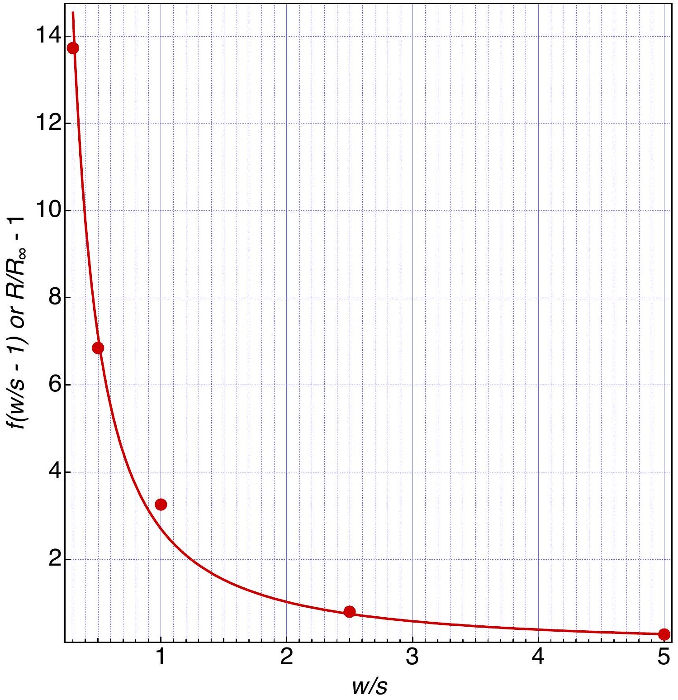
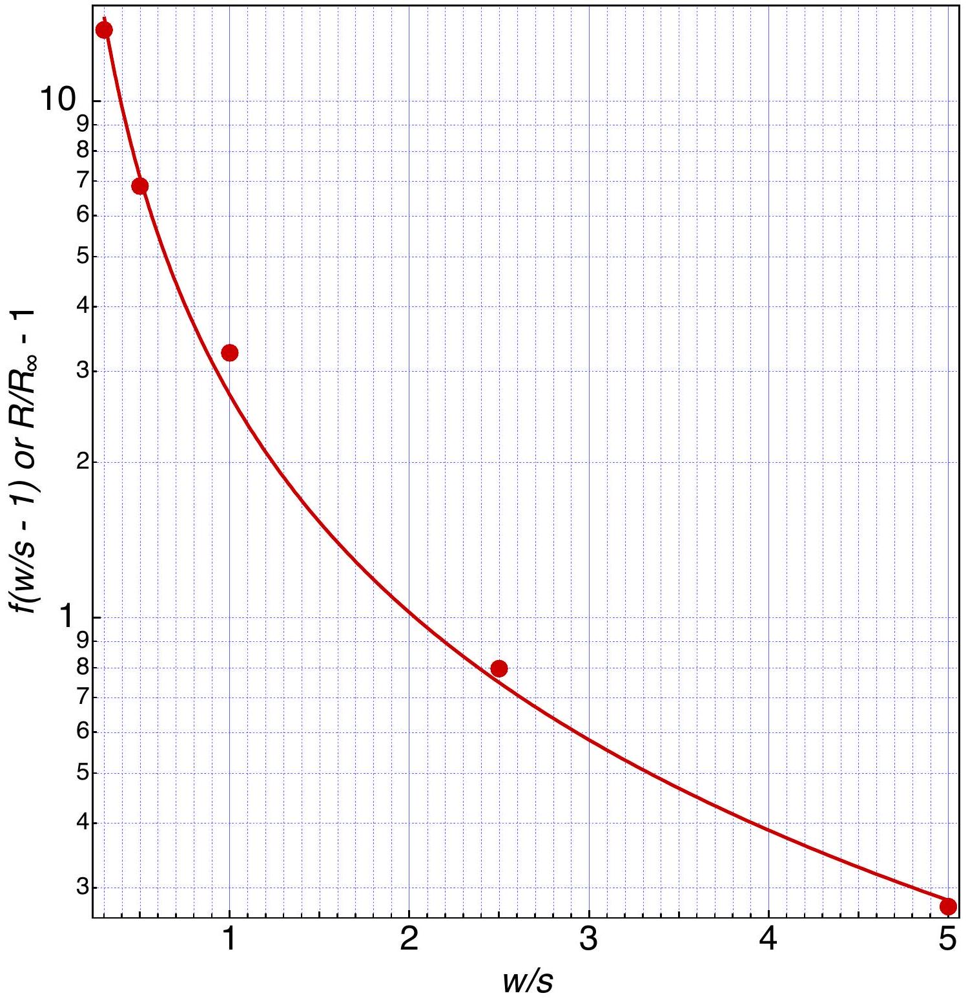
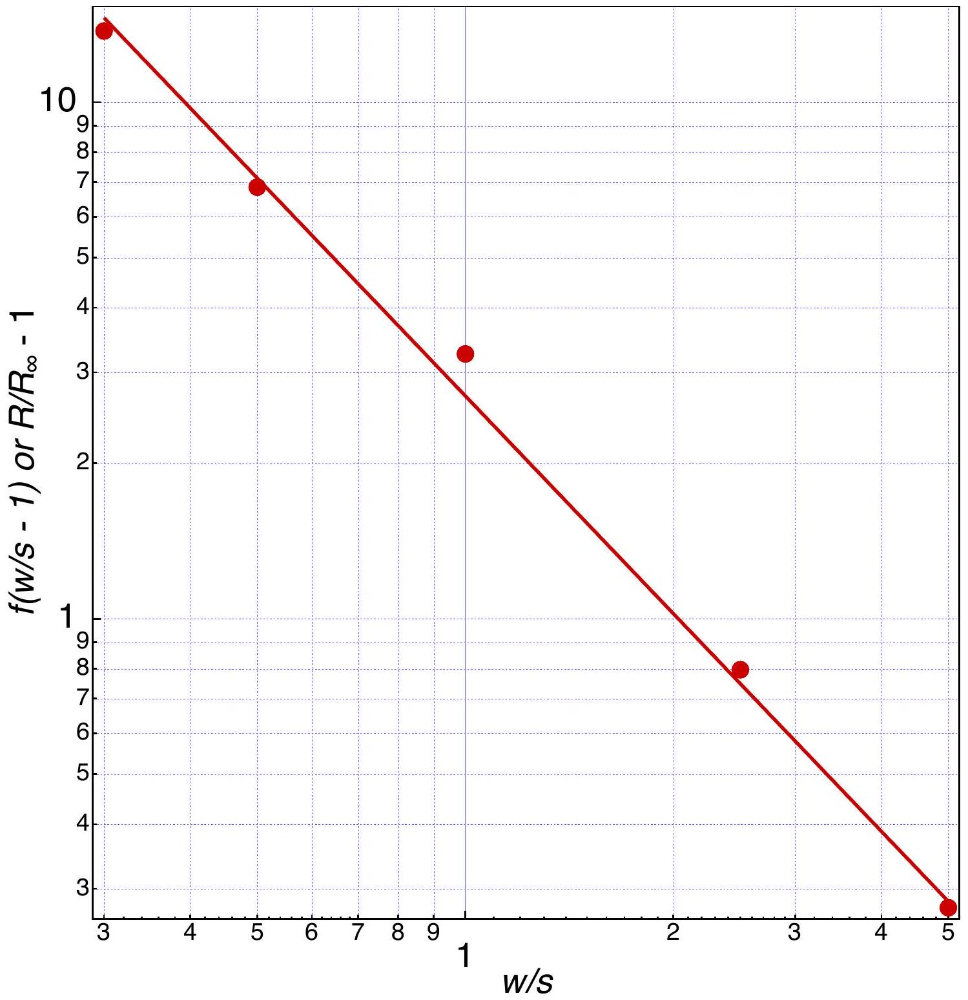
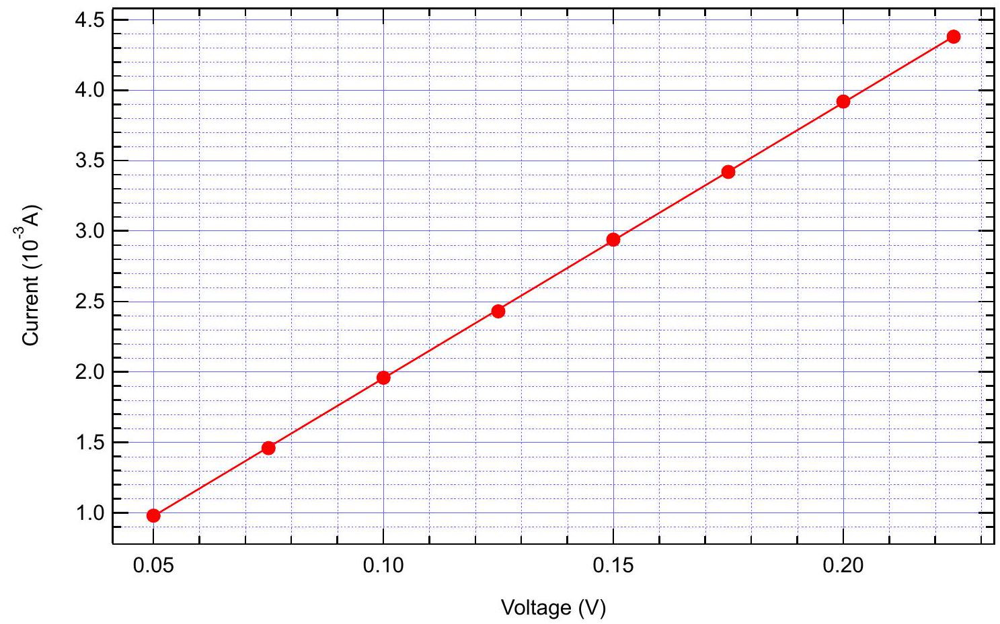
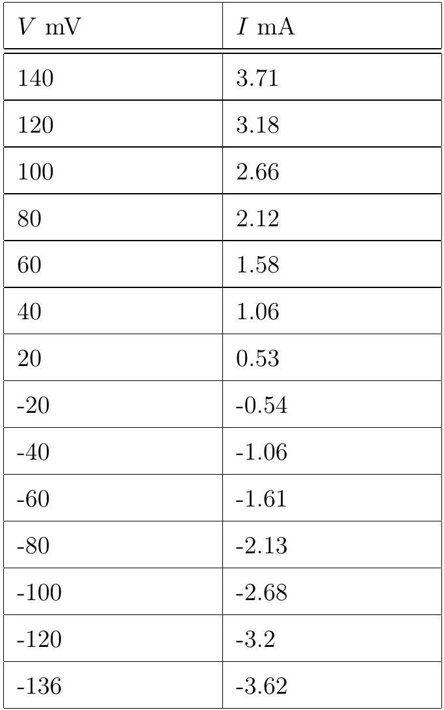
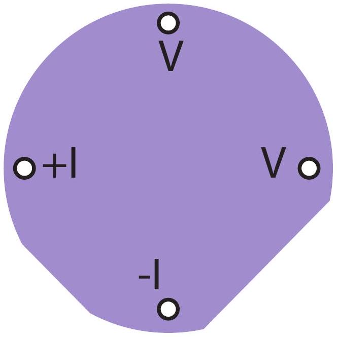
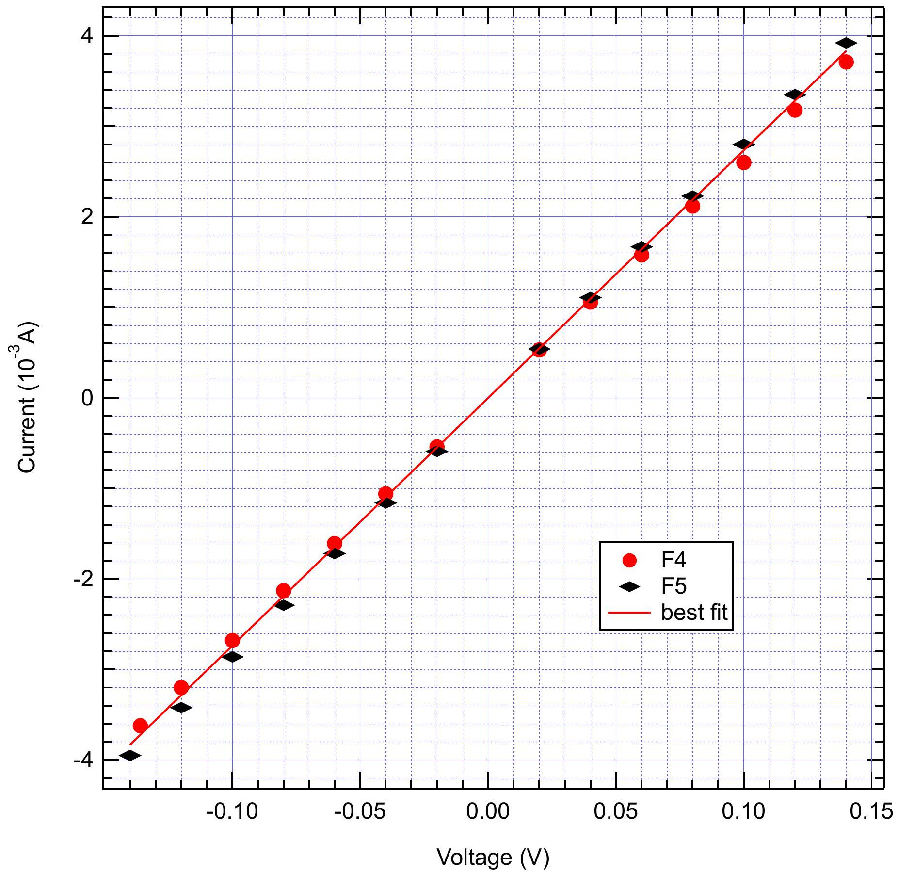

Part A. Four-point-probe (4PP) measurements (1.2 points)

Problem 1 : Electrical conductivity in two dimensions - Answer Sheet (10 points)
| A1 (0.6 pts)   $s = 2 \mathrm {~cm}$ |  |  |  |
| :--- | :--- | :--- | :--- |
| $I ( \mu \mathrm {~A} )$ | $V ( \mathrm { mV } )$ | $I ( \mu \mathrm {~A} )$ | $V ( \mathrm { mV } )$ |
| 251 | 276 | -148 | -162 |
| 516 | 566 | -256 | -281 |
| 388 | 426 | -363 | -398 |
| 147 | 161 | -507 | -557 |
| Plot your data in the graph B1 |  |  |  |
| Graph B1: $I$ vs $V$ |  |  |  |
| A2 (0.2 pts)   $R = 1.08 \mathrm { k } \Omega$ |  |  |  |
| A3 (0.4 pts)   $\Delta R = \pm 1 \Omega$ |  |  |  |

Part B. Sheet resistivity (0.3 points)
B1 (0.3 pts)
$\rho _ { \square } \equiv \rho _ { \infty } = 4.89 \mathrm { k } \Omega$

Part C. Measurements for different sample dimensions (3.2 points)
C1 (3 pts) and C2 (0.2 pts)
$s = 20 \mathrm {~mm}$
$\rho _ { \infty } = 4.89 \mathrm { k } \Omega$

| $w / s$ | I $( \mu \mathrm { A } )$ | V (mV) | $\mathrm { R } ( w / s ) ( \mathrm { k } \Omega )$ | $\mathrm { R } _ { \text {average } } ( \mathrm { k } \Omega )$ |  | $\hat { R }$ |
| :--- | :--- | :--- | :--- | :--- | :--- | :--- |
| 0.3 | 92 | 1477 | 16.1 | 15.9 |  | 14.7 |
| 0.3 | 74 | 1184 | 16 |  |  |  |
| 0.3 | 57 | 914 | 16 |  |  |  |
| 0.3 | 41 | 651 | 15.9 |  |  |  |
| 0.3 | 23 | 358 | 15.6 |  |  |  |
| 0.5 | 154 | 1306 | 8.5 | 8.5 |  | 7.8 |
| 0.5 | 127 | 1079 | 8.5 |  |  |  |
| 0.5 | 97 | 824 | 8.5 |  |  |  |
| 0.5 | 67 | 567 | 8.5 |  |  |  |
| 0.5 | 38 | 321 | 8.4 |  |  |  |
| 1 | 233 | 1071 | 4.6 | 4.6 |  | 4.3 |
| 1 | 174 | 799 | 4.6 |  |  |  |
| 1 | 135 | 621 | 4.6 |  |  |  |
| 1 | 101 | 465 | 4.6 |  |  |  |
| 1 | 59 | 271 | 4.6 |  |  |  |
| 2.5 | 389 | 749 | 1.9 | 1.9 |  | 1.8 |
| 2.5 | 319 | 635 | 2 |  |  |  |
| 2.5 | 237 | 457 | 1.9 |  |  |  |
| 2.5 | 151 | 291 | 1.9 |  |  |  |
| 2.5 | 74 | 143 | 1.9 |  |  |  |
| 5 | 467 | 648 | 1.4 | 1.4 |  | 1.3 |
| 5 | 419 | 577 | 1.4 |  |  |  |
| 5 | 363 | 499 | 1.4 |  |  |  |
| 5 | 289 | 398 | 1.4 |  |  |  |
| 5 | 185 | 254 | 1.4 |  |  |  |

Part D. Geometrical correction factor (1.9 points)
D1 (1.0 pts)
Plot your data on the appropriate graph paper: linear (Graph E1a), semi-logarithmic (D1b) or double-logarithmic (D1c) on the following pages.

D2 (0.9 pts)
$a = 2.7$
$b = - 1.4$

Graph D1a: linear scale: $I$ vs $V$

Wrong. The usage of linear scale does not allow for deduction of the parameters.

Graph D1b: semi-log scale: $I$ vs $V$
Wrong. The usage of semi-log scale does not allow for deduction of the parameters.

Graph D1c: double-log scale: $I$ vs $V$
Correct. The parameters can be deduced by fitting a line.

Part E. van der Pauw-method (3.4 points)

Note the number of your wafer here: 99 (between 1-450)

| E1 (0.4 pts) |  |  |  |
| :--- | :--- | :--- | :--- |
| $I ( \mathrm {~mA} )$ | $V ( \mathrm { mV } )$ | $I ( \mathrm {~mA} )$ | $V ( \mathrm { mV } )$ |
| 0.98 | 50 | 2.94 | 150 |
| 1.46 | 75 | 3.42 | 175 |
| 1.96 | 100 | 3.92 | 200 |
| 2.43 | 125 | 4.38 | 224 |

E2 (0.4 pts)

Graph F2: $I$ vs $V$

$R _ { 4 \mathrm { PP } } = 51.1 \Omega$
E3 (0.2 pts)

$$
w = 10 \mathrm {~cm} \quad \rightarrow \quad w / s = 5 \quad f ( w / s ) = 1.284
$$

E4 (0.1 pts)

$$
\rho _ { \square } = 180 \Omega
$$

E5 (0.6 pts)

Sketch (orientation of the current):

E6 (0.6 pts)

Sketch (orientation of the current):

| $I$ | $V$ |
| :--- | :--- |
| 140 | 3.92 |
| 120 | 3.35 |
| 100 | 2.8 |
| 80 | 2.23 |
| 60 | 1.67 |
| 40 | 1.11 |
| 20 | 0.54 |
| -20 | -0.59 |
| -40 | -1.16 |
| -60 | -1.72 |
| -80 | -2.29 |
| -100 | -2.86 |
| -120 | -3.42 |
| -140 | -3.95 |

E7 (0.5 pts)

Graph F6: $I$ vs $V$

$\langle R \rangle = 36.5 \Omega$

E8 (0.4 pts) Calculation:

$$
\begin{array} { l c }
2 \cdot e ^ { - \pi \cdot \langle R \rangle / \rho _ { \square } } = 1 & e ^ { - \pi \cdot \langle R \rangle / \rho _ { \square } } = 1 / 2 \\
- \frac { \pi \cdot \langle R \rangle } { \rho _ { \square } } = \ln ( 1 / 2 ) & \frac { \pi \cdot \langle R \rangle } { \rho _ { \square } } = \ln ( 2 ) \\
\rho _ { \square } = \frac { \pi \cdot \langle R \rangle } { \ln ( 2 ) } & \\
\rho _ { \square } = 165 \Omega &
\end{array}
$$

E9 (0.1 pts)

$$
\frac { \Delta \rho _ { \square } } { \rho _ { \square } } = 0.091 = 9.1 \%
$$

E10 (0.1 pts)

Resistivity of the Cr thin film $\rho = 1.32 \cdot 10 ^ { - 6 } \Omega \cdot \mathrm {~m}$
