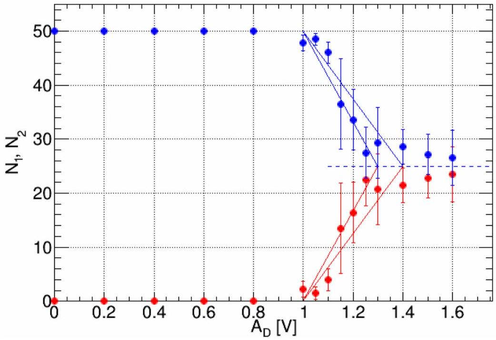
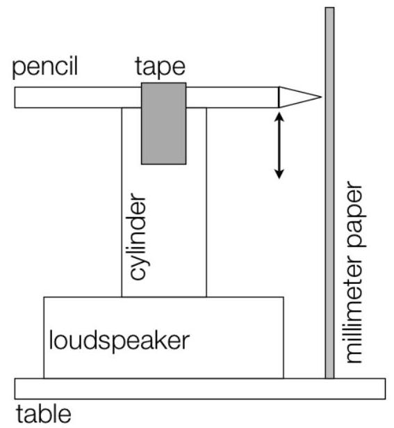

## Problem 2 : Solution - Jumping Beads - a model for phase transitions and instabilities (10 points)

Part A. Critical driving amplitude (3.3 points)

| A1 (1.2 pts)   Total number of seeds: $N _ { 0 } = 50$.   Number of readings: $n = 6$. |  |  |  |  |  |  |  |  |  |  |
| :--- | :--- | :--- | :--- | :--- | :--- | :--- | :--- | :--- | :--- | :--- |
| $A _ { D } , [ \mathrm {~V} ]$ | $N _ { 1 }$ |  |  |  |  |  | $\bar { N } _ { 1 } = \frac { 1 } { n } \Sigma _ { i = 1 } ^ { n } N _ { 1 } ^ { i }$ | $\bar { N } _ { 2 } = N _ { 0 } - \bar { N } _ { 1 }$ | $\sigma = \sqrt { \frac { \sum _ { i = 1 } ^ { n } \left( N _ { i } - \bar { N } \right) ^ { 2 } } { n - 1 } }$ | $\mathrm { SE } = \frac { \sigma } { \sqrt { n } }$ |
| 1.00 | 1 | 5 | 2 | 1 | 2 | 2 | 2.2 | 47.8 | 1.5 | 0.6 |
| 1.05 | 1 | 0 | 2 | 3 | 1 | 2 | 1.5 | 48.5 | 1.1 | 0.5 |
| 1.10 | 4 | 4 | 1 | 7 | 3 | 5 | 4.0 | 46.0 | 2.0 | 0.8 |
| 1.15 | 26 | 5 | 18 | 7 | 18 | 7 | 13.5 | 36.5 | 8.4 | 3.4 |
| 1.20 | 13 | 16 | 27 | 12 | 17 | 13 | 16.4 | 33.7 | 5.6 | 2.3 |
| 1.25 | 26 | 28 | 22 | 22 | 14 | 23 | 22.5 | 27.5 | 4.8 | 2.0 |
| 1.30 | 27 | 24 | 8 | 22 | 22 | 21 | 20.7 | 29.3 | 6.6 | 2.7 |
| 1.40 | 22 | 18 | 17 | 23 | 23 | 25 | 21.4 | 28.7 | 3.2 | 1.3 |
| 1.50 | 19 | 27 | 27 | 24 | 19 | 21 | 22.8 | 27.2 | 3.7 | 1.5 |
| 1.60 | 27 | 15 | 23 | 23 | 23 | 30 | 23.5 | 26.5 | 5.1 | 2.1 |

Plot the data in the graph A2.
A2 (1.1 pts)

Error bars represent either standard deviation $( \sigma )$ or standard error (SE).
A3 (1.0 pts)
$A _ { D , \text { crit } } = ( 1.25 \pm 0.05 ) \mathrm { V }$

Part B. Calibration (3.2 points)
| B1 (0.5 pts) |  |  |  |  |  |  |  |  |  |  |  |  |  |  |  |  |  |  |  |
| :--- | :--- | :--- | :--- | :--- | :--- | :--- | :--- | :--- | :--- | :--- | :--- | :--- | :--- | :--- | :--- | :--- | :--- | :--- | :--- |
| B2 (0.8 pts) |  |  |  |  |  |  |  |  |  |  |  |  |  |  |  |  |  |  |  |
| $A _ { D } [ \mathrm {~V} ]$ | 0.3 | 0.4 | 0.5 | 0.6 | 0.7 | 0.8 | 0.9 | 1.0 | 1.1 | 1.2 | 1.3 | 1.4 | 1.5 | 1.6 | 1.7 | 1.8 | 1.9 | 2.0 | 2.1 |
| $A [ \mathrm {~mm} ]$ | 1.0 | 1.5 | 2.0 | 2.2 | 2.6 | 3.0 | 3.2 | 3.4 | 4.0 | 4.1 | 4.2 | 4.5 | 4.8 | 5.0 | 5.0 | 5.1 | 5.1 | 5.2 | 5.2 |
| Instrumental error ±0.5 mm. |  |  |  |  |  |  |  |  |  |  |  |  |  |  |  |  |  |  |  |
| B3 (1.0 pts) |  |  |  |  |  |  |  |  |  |  |  |  |  |  |  |  |  |  |  |
| B4 (0.8 pts) $A = k _ { 0 } + k _ { 1 } \times A _ { D } ,$   where: $k _ { 0 } = 0.2 [ \mathrm {~mm} ] , k _ { 1 } = 3.1 [ \mathrm {~mm} / \mathrm { V } ]$ |  |  |  |  |  |  |  |  |  |  |  |  |  |  |  |  |  |  |  |
| B5 (0.1 pts) $A _ { \text {crit } } = ( 4.4 \pm 0.1 ) \mathrm { mm }$ |  |  |  |  |  |  |  |  |  |  |  |  |  |  |  |  |  |  |  |

Part C. Critical exponent (3.5 points)
| C1 (1.1 pts) |
| :--- |
| $A _ { D } , [ \mathrm {~V} ]$ |
| 1.00 |
| 1.05 |
| 1.10 |
| 1.15 |
| 1.20 |
| 1.25 |
| 1.30 |
| 1.40 |
| 1.50 |
| 1.60 |
| Plot the data in the graph C2. |
| C2 (1.0 pts) |
| $\left\| \left( { } ^ { 2 } \mathrm {~N} ^ { + } \mathrm { N } \right) / \left( { } ^ { 2 } \mathrm {~N} ^ { - } \mathrm { N } \right) \right\|$ |
| C3 (1.4 pts) $y = a \cdot x ^ { b } , \text { where } x = \left\| A ^ { 2 } - A _ { 0 } ^ { 2 } \right\| , y = \left\| \frac { N _ { 1 } - N _ { 2 } } { N _ { 1 } + N _ { 2 } } \right\| .$   Critical exponent $b = 0.6 \pm 0.2$. |
