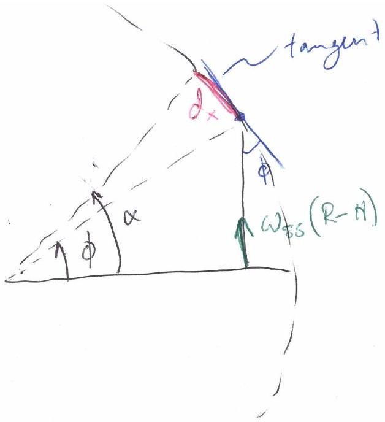
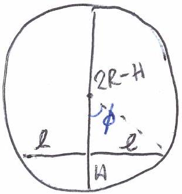
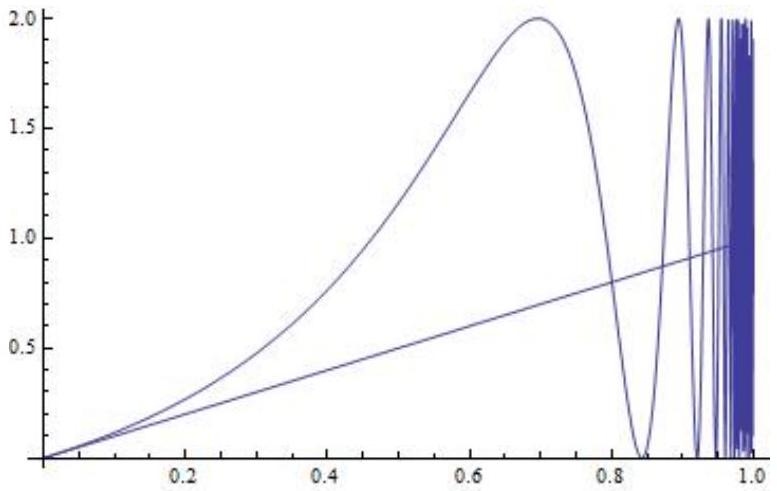
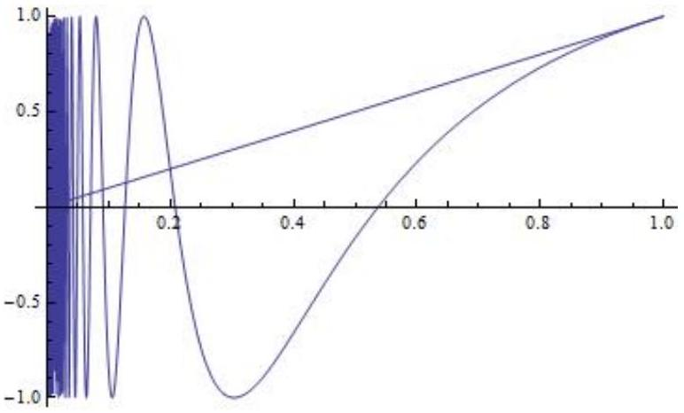
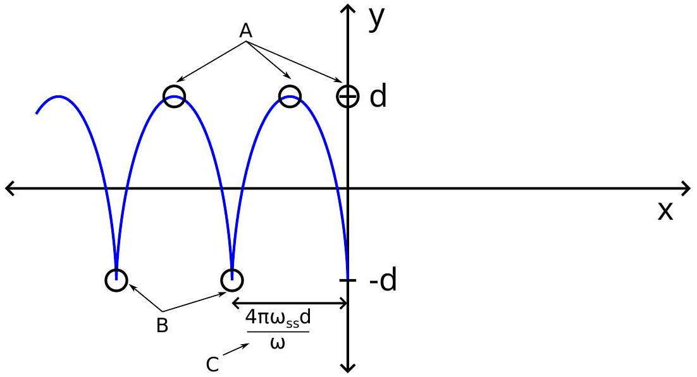

## Problem 1 : Solution/marking scheme - Two Problems in Mechanics (10 points)

Part A. The Hidden Disk (3.5 points)

A1 (0.8 pt) Find an expression for $b$ as a function of the quantities (1), the angle $\phi$ and the tilting angle $\Theta$ of the base.

Solution A1:

Geometric solution: use that torque with respect to point of contact is $0 \Rightarrow$ center of gravity has to be vertically above point of contact.

$$
\begin{aligned}
& \sin \phi = \frac { D } { b } \\
& \sin \Theta = \frac { D } { r _ { 1 } }
\end{aligned}
$$

Here $D$ may be called another name. Solve this:

$$
\sin \phi = \frac { r _ { 1 } } { b } \sin \Theta \Rightarrow b = \frac { r _ { 1 } \sin \Theta } { \sin \phi }
$$

Alternative: Torque and forces with respect to another point:
Correct equation for torque
Correct equation for force
Correct solution

A2 (0.5 pt) Find the equation of motion for $\varphi$. Express the moment of inertia $I _ { S }$ of the cylinder around its symmetry axis $S$ in terms of $T , b$ and the known quantities (1). You may assume that we are only disturbing the equilibrium position by a small amount so that $\varphi$ is always very small.

Solution A2:

Write some equation of the form $\ddot { \varphi } = - \omega ^ { 2 } \varphi$
Writing an equation of the form $\varphi = A \cos \omega t$ is also correct.
Two solutions:

1. Kinetic energy: $\frac { 1 } { 2 } I _ { S } \dot { \varphi } ^ { 2 }$ and potential energy: $- b M g \cos \varphi$. Total energy is conserved, and differentiation w.r.t. time gives the equation of motion.
2. Angular equation of motion from torque, $\tau = I _ { S } \ddot { \varphi } = - M g b \sin \varphi$.

Correct equation (either energy conservation or torque equation of motion)
Final answer

$$
T = 2 \pi \sqrt { \frac { I _ { S } } { M g b } } \Rightarrow I _ { S } = \frac { M g b T ^ { 2 } } { 4 \pi ^ { 2 } }
$$

(Derivation:

$$
\Rightarrow \ddot { \varphi } = - \frac { b M g } { I _ { S } } \sin \varphi \simeq - \frac { b g M } { I _ { S } } \varphi
$$

so that

$$
\omega ^ { 2 } = \frac { b g M } { I _ { S } }
$$

)

A3 (0.4 pt) Find an expression for the distance $d$ as a function of $b$ and the quantities (1). You may also include $r _ { 2 }$ and $h _ { 2 }$ as variables in your expression, as they will be calculated in subtask A.5.

Solution A3:

Some version of the center of mass equation, e.g.

$$
b = \frac { d M _ { 2 } } { M _ { 1 } + M _ { 2 } }
$$

correct solution:

$$
d = \frac { b M } { \pi h _ { 2 } r _ { 2 } ^ { 2 } \left( \rho _ { 2 } - \rho _ { 1 } \right) }
$$

A4 (0.7 pt) Find an expression for the moment of inertia $I _ { S }$ in terms of $b$ and the known quantities (1). You may also include $r _ { 2 }$ and $h _ { 2 }$ as variables in your expression, as they will be calculated in subtask A.5.

Solution A4:
correct answer for moment of inertia of homogeneous disk

$$
I _ { 1 } = \frac { 1 } { 2 } \pi h _ { 1 } \rho _ { 1 } r _ { 1 } ^ { 4 }
$$

Mass wrong
Factor 1/2 wrong in formula for moment of inertia of a disk
Correct answer for moment of inertia of 'excess' disk:

$$
I _ { 2 } = \frac { 1 } { 2 } \pi h _ { 2 } \left( \rho _ { 2 } - \rho _ { 1 } \right) r _ { 2 } ^ { 4 }
$$

Using Steiner's theorem:

$$
I _ { S } = I _ { 1 } + I _ { 2 } + d ^ { 2 } \pi r _ { 2 } ^ { 2 } h _ { 2 } \left( \rho _ { 2 } - \rho _ { 1 } \right)
$$

correct solution:

$$
I _ { S } = \frac { 1 } { 2 } \pi h _ { 1 } \rho _ { 1 } r _ { 1 } ^ { 4 } + \frac { 1 } { 2 } \pi h _ { 2 } \left( \rho _ { 2 } - \rho _ { 1 } \right) r _ { 2 } ^ { 4 } + \frac { b ^ { 2 } M ^ { 2 } } { \pi r _ { 2 } ^ { 2 } h _ { 2 } \left( \rho _ { 2 } - \rho _ { 1 } \right) }
$$

In terms of $d$ rather than $b$ gives 0.1 pts rather than 0.2 pts for the final answer:

$$
I _ { S } = \frac { 1 } { 2 } \pi h _ { 1 } \rho _ { 1 } r _ { 1 } ^ { 4 } + \frac { 1 } { 2 } \pi h _ { 2 } \left( \rho _ { 2 } - \rho _ { 1 } \right) r _ { 2 } ^ { 4 } + d ^ { 2 } \pi r _ { 2 } ^ { 2 } h _ { 2 } \left( \rho _ { 2 } - \rho _ { 1 } \right)
$$

A5 (1.1 pt) Using all the above results, write down an expression for $h _ { 2 }$ and $r _ { 2 }$ in terms of $b , T$ and the quantities (1). You may express $h _ { 2 }$ as a function of $r _ { 2 }$.

Solution A5:

It is not clear how exactly students will attempt to solve this system of equations. It is likely that they will use the following equation:

$$
M = \pi r _ { 1 } ^ { 2 } h _ { 1 } \rho _ { 1 } + \pi r _ { 2 } ^ { 2 } h _ { 2 } \left( \rho _ { 2 } - \rho _ { 1 } \right)
$$

solve $I _ { S }$ for $r _ { 2 } ^ { 2 }$ :

$$
r _ { 2 } ^ { 2 } = \frac { 2 } { M - \pi r _ { 1 } ^ { 2 } h _ { 1 } \rho _ { 1 } } \left( I _ { S } - \frac { 1 } { 2 } \pi h _ { 1 } \rho _ { 1 } r _ { 1 } ^ { 4 } - b ^ { 2 } \frac { M ^ { 2 } } { M - \pi r _ { 1 } ^ { 2 } h _ { 1 } \rho _ { 1 } } \right)
$$

replace $I _ { S }$ by $T$ :

$$
I _ { S } = \frac { M g b T ^ { 2 } } { 4 \pi ^ { 2 } }
$$

solve correctly for $r _ { 2 }$ :

$$
r _ { 2 } = \sqrt { \frac { 2 } { M - \pi r _ { 1 } ^ { 2 } h _ { 1 } \rho _ { 1 } } \left( M \frac { b g T ^ { 2 } } { 4 \pi ^ { 2 } } - \frac { 1 } { 2 } \pi h _ { 1 } \rho _ { 1 } r _ { 1 } ^ { 4 } - b ^ { 2 } \frac { M ^ { 2 } } { M - \pi r _ { 1 } ^ { 2 } h _ { 1 } \rho _ { 1 } } \right) }
$$

write down an equation for $h _ { 2 }$ along the lines of $M = \pi r _ { 1 } ^ { 2 } \rho _ { 1 } h _ { 1 } + \pi r _ { 2 } ^ { 2 } \left( \rho _ { 2 } - \rho _ { 1 } \right) h _ { 2 }$ and solve it correctly:

$$
h _ { 2 } = \frac { M - \pi r _ { 1 } ^ { 2 } \rho _ { 1 } h _ { 1 } } { \pi r _ { 2 } ^ { 2 } \left( \rho _ { 2 } - \rho _ { 1 } \right) }
$$

Part B. Rotating Space Station (6.5 points)

B1 (0.5 pt) At what angular frequency $\omega _ { s s }$ does the space station rotate so that the astronauts experience the same gravity $g _ { E }$ as on the Earth's surface?

Solution B1:

An equation for the centrifugal force along the lines of

$$
F _ { c e } = m \omega ^ { 2 } r
$$

Balancing the forces, correct equation

$$
g _ { E } = \omega _ { s s } ^ { 2 } R
$$

Correct solution

$$
\omega _ { s s } = \sqrt { g _ { E } / R }
$$

B2 (0.2 pt) Assuming that on Earth gravity is constant with acceleration $g _ { E }$, what would be the angular oscillation frequency $\omega _ { E }$ that a person on Earth would measure?

Solution B2:

Realize that result is independent of $g _ { E }$ Correct result:

$$
\omega _ { E } = \sqrt { k / m }
$$

B3 (0.6 pt) What angular oscillation frequency $\omega$ does Alice measure on the space station?

Solution B3:
some version of the correct equation for force

$$
F = - k x \pm m \omega _ { s s } ^ { 2 } x
$$

getting the sign right

$$
F = - k x + m \omega _ { s s } ^ { 2 } x
$$

Find correct differential equation

$$
m \ddot { x } + \left( k - m \omega _ { s s } ^ { 2 } \right) x = 0
$$

Derive correct result

$$
\omega = \sqrt { k / m - \omega _ { s s } ^ { 2 } }
$$

Using $g _ { E } / R$ instead of $\omega _ { s s } ^ { 2 }$ is also correct.

B4 (0.8 pt) Derive an expression of the gravity $g _ { E } ( h )$ for small heights $h$ above the surface of the Earth and compute the oscillation frequency $\tilde { \omega } _ { E }$ (linear approximation is enough). The radius of the Earth is given by $R _ { E }$.

Solution B4:

$$
g _ { E } ( h ) = - G M / \left( R _ { E } + h \right) ^ { 2 }
$$

linear approximation of gravity:

$$
g _ { E } ( h ) = - \frac { G M } { R _ { E } ^ { 2 } } + 2 h \frac { G M } { R _ { E } ^ { 3 } } + \ldots
$$

Realize that $g _ { E } = G M / R _ { E } ^ { 2 }$ :

$$
g _ { E } ( h ) = - g _ { E } + 2 h g _ { E } / R _ { E } + \ldots
$$

Opposite sign is also correct, as long as it is opposite in both terms.
Realize what this means for force, i.e. that the constant term can be eliminated by shifting the equilibrium point:

$$
F = - k x + 2 x m g _ { E } / R _ { E }
$$

Find correct differential equation

$$
m \ddot { x } + \left( k - 2 m g _ { E } / R _ { E } \right) x = 0
$$

correct result

$$
\tilde { \omega } _ { E } = \sqrt { k / m - 2 g _ { E } / R _ { E } }
$$

No points are deducted if student answers with $\tilde { \omega } _ { E } / ( 2 \pi )$ because "oscillation frequency" might also be interpreted as inverse period.

B5 (0.3 pt) For what radius $R$ of the space station does the oscillation frequency $\omega$ match the oscillation frequency $\tilde { \omega } _ { E }$ on the surface of the Earth? Express your answer in terms of $R _ { E }$.

Solution B5:

Write down equation

$$
\omega _ { s s } ^ { 2 } = 2 g _ { E } / R _ { E }
$$

Solve

$$
R = R _ { E } / 2
$$

If $G M / R _ { E } ^ { 2 }$ rather than $g _ { E }$ is used, give only $0.1 p t$.

B6 (1.1 pt) Calculate the horizontal velocity $v _ { x }$ and the horizontal displacement $d _ { x }$ (relative to the base of the tower, in the direction perpendicular to the tower) of the mass at the moment it hits the floor. You may assume that the height $H$ of the tower is small, so that the acceleration as measured by the astronauts is constant during the fall. Also, you may assume that $d _ { x } \ll H$.

Solution B6:

There are several possible solutions.
Solution one - Using Coriolis force

- Velocity $v _ { x }$
Equation for Coriolis force with correct velocity:
$$
F _ { C } ( t ) = 2 m \omega _ { s s } ^ { 2 } R t \omega _ { s s } = 2 m \omega _ { s s } ^ { 3 } R t
$$
Integrate this, or realize that it is like uniform acceleration for the velocity:
$$
v _ { x } ( t ) = \omega _ { s s } ^ { 3 } R t ^ { 2 }
$$
plug in correct value for
$$
t = \sqrt { 2 H / \omega _ { s s } ^ { 2 } R }
$$
overall correct result
$$
v _ { x } = 2 H \omega _ { s s }
$$
- The displacement $d _ { x }$ :
Integrate $v _ { x } ( t )$ :
$$
d _ { x } = \frac { 1 } { 3 } R \omega _ { s s } ^ { 3 } t ^ { 3 }
$$
Instead of integrating, students may simply 'average' by taking $\frac { 1 } { 2 }$ of the final velocity. This gives a factor of $\frac { 1 } { 2 }$ instead of $\frac { 1 } { 3 }$. Deduct a total of 0.1 pts for this.

Plug in value for $t$

$$
d _ { x } = \frac { 1 } { 3 } R \omega _ { s s } ^ { 3 } \left( 2 H / \omega _ { s s } ^ { 2 } R \right) ^ { 3 / 2 } = \frac { 1 } { 3 } 2 ^ { 3 / 2 } H ^ { 3 / 2 } R ^ { - 1 / 2 } = \frac { 1 } { 3 } \sqrt { \frac { 8 H ^ { 3 } } { R } }
$$

Solution two - Using inertial frame This solution is similar to the way to solve B7, but needs more complicated approximations than Solution one.

- $v _ { x }$
Here $\phi$ denotes the angle swept by the mass and $\alpha$ the angle the astronauts (and tower) has rotated when the mass lands on the floor, see
Initially the velocity of the mass in an inertial frame is $v _ { x } = \omega _ { s s } ( R - H )$.
When the mass lands, the $x$-direction has been rotated by $\phi$ so the new horizontal velocity component is then
$$
\omega _ { s s } ( R - H ) \cos \phi
$$
(Student may also write $\cos \alpha$ instead of $\cos \phi$, since $d _ { x } \ll H$.)
$$
\cos \phi = \frac { R - H } { R } = 1 - \frac { H } { R }
$$
Transforming to the rotating reference frame, one needs to subtract $\omega _ { s s } R$.
Finally in the reference frame of the astronauts
$$
v _ { x } = \omega _ { s s } R \left( 1 - \frac { H } { R } \right) ^ { 2 } - \omega _ { s s } R \approx \omega _ { s s } R \left( 1 - 2 \frac { H } { R } \right) - \omega _ { s s } R = - 2 \omega _ { s s } H
$$
The sign of the velocity depend on the choice of reference direction, so a positive sign is also correct.

- $d _ { x }$
With the notation from the calculation of $v _ { x }$
$$
\begin{gathered}
d _ { x } = ( \alpha - \phi ) R \\
\phi = \arccos \left( 1 - \frac { H } { R } \right) \\
\alpha = \omega _ { s s } t
\end{gathered}
$$
where $t$ is the fall time of the mass, which is given by
$$
t = \frac { \sqrt { R ^ { 2 } - ( R - H ) ^ { 2 } } } { \omega _ { s s } ( R - H ) }
$$
(see solution to B7)
Writing $\xi \equiv H / R$ this means
$$
d _ { x } = \left[ \frac { \sqrt { 1 - ( 1 - \xi ) ^ { 2 } } } { 1 - \xi } - \arccos ( 1 - \xi ) \right] R
$$
which is a valid end answer to the problem. It is possible, but not necessary, to approximate this for small $\xi$ :
$$
\arccos ( 1 - \xi ) \approx \sqrt { 2 \xi } \left( 1 + \frac { \xi } { 12 } \right)
$$
which after insertion into the equation for $d _ { x }$ and approximation of small $\xi$ yields the same result as in Solution one:
$$
d _ { x } = \frac { 2 } { 3 } \sqrt { \frac { 2 H ^ { 3 } } { R } }
$$
If this end answer misses the factor 2/3, deduct 0.1 points.

Solution three - Inertial frame with geometry trick
This is an alternative solution to obtain $d _ { x }$
The mass travels the distance $l$, and during the fall the space station rotates by $\phi$, see Figure 2. According to the intersecting chord theorem,

$$
l ^ { 2 } = H ( 2 R - H )
$$

The rotated angle is $\phi = \omega _ { s s } t$ where

$$
t = \frac { l } { R - H }
$$

is the fall time. Thus

$$
\begin{gathered}
\phi = \frac { \sqrt { H ( 2 R - H ) } } { R - H } \\
\frac { d } { R } = \phi - \arcsin \frac { l } { R } = \frac { \sqrt { H ( 2 R - H ) } } { R - H } - \arcsin \sqrt { x ( 2 - x ) }
\end{gathered}
$$

Figure 1: Notation for solution two

Figure 2: Notation for solution three.

Denote $x \equiv H / R$ and $y \equiv \sqrt { x ( 2 - x ) }$. Since

$$
\arcsin y \approx y + \frac { y ^ { 3 } } { 6 }
$$

one gets

$$
\frac { d } { R } \approx y ( 1 + x ) - y - y ^ { 3 } / 6 = y \left( x - y ^ { 2 } / 6 \right) \approx 2 x y / 3 \approx 2 x \sqrt { 2 x } / 3 = \frac { 2 } { 3 } \sqrt { \frac { 2 H ^ { 3 } } { R } }
$$

Final answer

B7 (1.3 pt) Find a lower bound for the height of the tower for which it can happen that $d _ { x } = 0$.

Solution B7:

The key is to use a non-rotating frame of reference. If the mass is released close enough

to the center, its linear velocity will be small enough for the space station to rotate more than $2 \pi$ before it hits the ground.
The velocity is given by

$$
v = \omega _ { s s } ( R - H )
$$

distance $d$ that the mass flies before hitting the space station

$$
d ^ { 2 } = R ^ { 2 } - ( R - H ) ^ { 2 }
$$

use non-rotating frame of reference to obtain time $t$ until impact

$$
t = d / v = \frac { \sqrt { R ^ { 2 } - ( R - H ) ^ { 2 } } } { \omega _ { s s } ( R - H ) }
$$

Now there are several possible ways to relate $H$ and the rotated angle $\phi$ of the space station:
Solution one

$$
t = \frac { R \sin \phi } { \omega _ { s s } R \cos \phi }
$$

This time must match $t = \phi / \omega _ { s s }$. Obtain the equation

$$
\phi = \tan \phi
$$

Realizing that there is an infinite number of solutions.
This equation has one trivial solution $\phi = 0$, next solution is slightly less than $3 \pi / 2$ which corresponds to the case $H > R$ (and is thus not correct). The one that gives a lower bound for $H$ is the third solution

$$
\phi \approx 5 \pi / 2
$$

The equation $\phi = \tan \phi$ can be solved graphically or numerically to obtain a close value $( \phi = 7.725 \mathrm { rad } )$ which means

$$
H / R = ( 1 - \cos \phi ) \approx 0.871
$$

Give points if the method is correct, depending on the value of $H / R$ found, according to these intervals:
$0.85 \leq H / R \leq 0.88$ : 0.4 pts
$0.5 \leq H / R < 0.85 : 0.3$ pts
$0 < H / R < 0.5$ or $H > 0.88$ : 0.2 pts
$H = 0$ or method is incorrect: 0 pts

Solution two
relation between $H$ and rotated angle $\phi$

$$
\frac { R - H } { R } = \cos \phi
$$

obtain equation of the form

$$
\frac { H } { R } = 1 - \cos \left( \frac { \sqrt { 1 - ( 1 - H / R ) ^ { 2 } } } { 1 - H / R } \right)
$$

Figure 3 gives a plot of $f ( x ) = 1 - \cos \left( \frac { \sqrt { 1 - ( 1 - x ) ^ { 2 } } } { 1 - x } \right)$. The goal is to find an approximate solution for the second intersection. The first intersection is discarded - it is introduced because of $\cos \phi = \cos ( - \phi )$ and corresponds to a situation with $H > R$.
Realizing that there is an infinite number of solutions.

Figure 3: Plot of $f ( H / R )$ and $H / R$

Figure 4: Plot of $g ( x )$ and $x$

- introduce new variable $x : = 1 - H / R$, so that the equation becomes
$$
x = \cos \left( \sqrt { 1 - x ^ { 2 } } / x \right) = : g ( x )
$$
- $g ( x )$ is then smaller than $x$ up to the first solution. In particular it is negative in some region (see figure 4). Finding the third zero thus gives a lower bound for the solution:
$$
\frac { \sqrt { 1 - x ^ { 2 } } } { x } = 5 \pi / 2
$$
- give lower bound
$$
x = 1 / \sqrt { 25 \pi ^ { 2 } / 4 + 1 } \Rightarrow H = R \left( 1 - 1 / \sqrt { 25 \pi ^ { 2 } / 4 + 1 } \right) \approx 0.874
$$
Note: the actual result is $H / R = 0.871 \ldots$.
Use the same points for the numerical answer as was mentioned in solution one.
If the student plots $f$ rather than $g$, find solution to $f = 1$ : is equivalent to the solution above. Give same number of points.
It is also possible to use $\cos \left( \frac { \sqrt { 1 - x ^ { 2 } } } { x } \right) = \sin ( 1 / x )$.

- Give an algebraic expression of $x ( t )$ and $y ( t )$. You may assume that $\omega _ { s s } d$ is small.
- Sketch the trajectory $( x ( t ) , y ( t ) )$, marking all important features such as amplitude.

Solution B8:

Note: we did not specify the overall sign of the Coriolis force. Give same amount of points if using opposite convention, but it has to be consistent! Otherwise: subtract 0.1pt for each instance of inconsistency.
Students are allowed to express everything in terms of $\omega$, they don't need to write $\sqrt { k / m - \omega _ { s s } ^ { 2 } }$ explicitly. Deduct $0.1 p t$ however if they use $k / m$ instead of $\omega$..
Realize that $y ( t )$ is standard harmonic oscillation:

$$
y ( t ) = A \cos \omega t + B
$$

Give correct constants from initial conditions

$$
y ( t ) = - d \cos \omega t
$$

Correct expression for $v _ { y } ( t )$ :

$$
v _ { y } ( t ) = - d \omega \sin \omega t
$$

Coriolis force in $x$-direction

$$
F _ { x } ( t ) = 2 m \omega _ { s s } v _ { y } ( t ) = - 2 m \omega _ { s s } d \omega \sin \omega t
$$

Realize that this implies that $x ( t )$ is also a harmonic oscillation...
...but with a constant movement term superimposed: $v t$ getting the correct amplitude:

$$
A = \frac { 2 \omega _ { s s } d } { \omega }
$$

Correct answer with correct initial conditions:

$$
x ( t ) = \frac { 2 \omega _ { s s } d } { \omega } \sin \omega t - 2 \omega _ { s s } d t
$$

Sketch:

Correct qualitative sketch:
periodic motion
overall constant movement
B): cusps
And additionally correct quantitative sketch:
$\mathrm { A } ) + \mathrm { B } )$ : peaks and cusps are at $y = \pm d$
C): cusps are at distance $\Delta x = \frac { 4 \pi \omega _ { s s } d } { \omega }$ from each other
