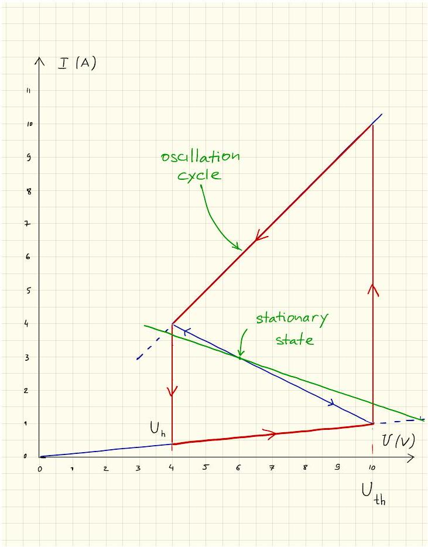
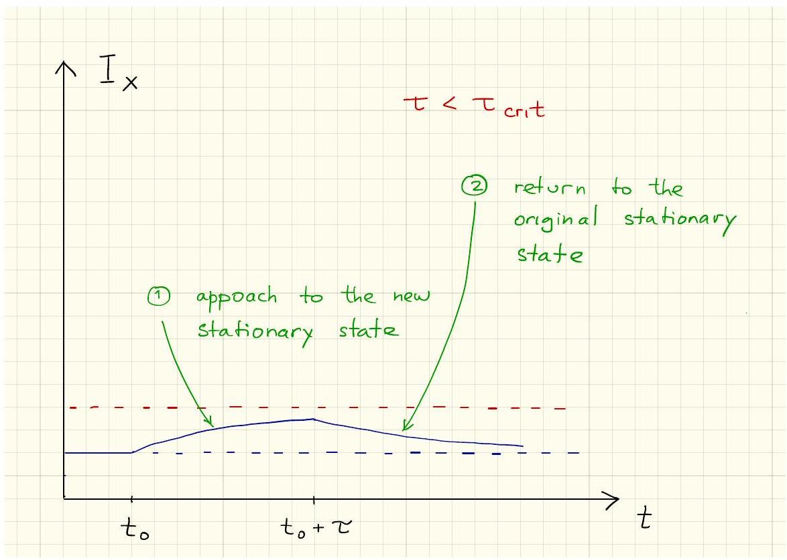
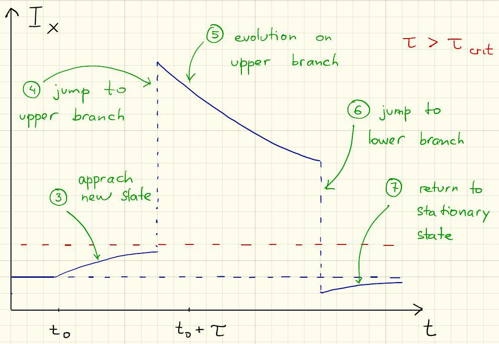

## Problem 2 : Solution/marking scheme - Nonlinear Dynamics in Electric Circuits (10 points)

Part A. Stationary states and instabilities (3 points)

Solution A1:

By looking at the $I - V$ graph, we obtain

$$
\begin{gathered}
R _ { \mathrm { off } } = 10.0 \Omega , \\
R _ { \mathrm { on } } = 1.00 \Omega , \\
R _ { \mathrm { int } } = 2.00 \Omega , \\
I _ { 0 } = 6.00 \AA .
\end{gathered}
$$

Note: No penalty for the number of digits in this question

Solution A2:

Kirchoff law for the circuit ( $U$ is the voltage of the bistable element):

$$
\mathcal { E } = I R + U
$$

This yields

$$
I = \frac { \mathcal { E } - U } { R }
$$

Hence, stationary states of the circuit are intersections of the line defined by this equation and the $I - V$ graph of $X$.

For $R = 3.00 \Omega$, one always gets exactly one intersection.
For $R = 1.00 \Omega$, one gets 1, 2 or 3 intersections depending on the value of $\mathcal { E }$.
The following table summarizes the number of points granted for possible answers to the last subquestion with $R = 1.00 \Omega$ :

| Possible answer | 1 | 2 | 3 | 1,3 | 1,2 | 2,3 | 1,2,3 |
| :--- | :--- | :--- | :--- | :--- | :--- | :--- | :--- |
| Points | 0 | 0 | 0.2 | 0.3 | 0 | 0.2 | 0.4 |

Solution A3:

The stationary state is on the intermediate branch, one can thus use the corresponding equation:

$$
\begin{aligned}
I _ { \text {stationary } } & = \frac { \mathcal { E } - R _ { \mathrm { int } } I _ { 0 } } { R - R _ { \mathrm { int } } } \\
& = 3.00 \mathrm {~A}
\end{aligned}
$$

$$
\begin{aligned}
U _ { \text {stationary } } & = R _ { \mathrm { int } } \left( I _ { 0 } - I \right) \\
& = 6.00 \mathrm {~V}
\end{aligned}
$$

Extra (non-physical) stationary states on the switched on and/or switched off branches lead to a penalty of 0.2 point.

Solution A4:

Any correct modeling such as the following:
The Kirchoff law for the circuit reads

$$
\mathcal { E } = I R + U _ { X } + L \frac { d I } { d t } = I R + \left( I _ { 0 } - I \right) R _ { \mathrm { int } } + L \frac { d I } { d t }
$$

This implies

$$
L \frac { d I } { d t } = \mathcal { E } - I _ { 0 } R _ { \mathrm { int } } - \left( R - R _ { \mathrm { int } } \right) I
$$

The separation between two cases is of importance, especially because of the relative sign of $d I / d t$ :
If $I > I _ { \text {stationary } }$, we have $d I / d t < 0$ and $I$ decreases.
If $I < I _ { \text {stationary } }$, we have $d I / d t > 0$ and $I$ increases.
Note: Formulas with time derivatives are not essential, any other correct justification is accepted.
We conclude that the stationary state is stable.

Note: The checkbox gives 0.1 points if "stable" is checked, regardless of the previous reasoning (also if there is nothing). A wrong reasoning leading to check the "unstable" option doesn't however give any point for the checkbox.

Part B. Bistable non-linear elements in physics and engineering: radio transmitter (5 points)

Solution B1:

A correctly drawn cycle gives 1.2 points, distributed as follows:

- Switched on branch is part of the cycle
- Switched off branch is part of the cycle
- Jumps are vertical (constant $U$ )
- Jumps are positioned at $U _ { \mathrm { h } }$ and $U _ { \text {th } }$
- The system moves to the left on the switched on branch

- The system moves to the right on the switched off branch

Each of the following observations individually gives up to 0.2 points, but their total cannot exceed 0.6:

- $U$ constant during jumps because the charge on the capacitor cannot change instantaneously
- The intermediate branch cannot be part of the cycle because there is a stationary state on it
- Jumps occur at corners of the IV graph because at those points the system has nowhere else to go
- The system moves moves to the left on the switched on branch because it approaches the stable stationary state (which is located outside the IV graph), or argument with the Kirchoff law
- The system moves moves to the right on the switched off branch because it approaches the stable stationary state (which is located outside the IV graph), or argument with the Kirchoff law

Solution B2:
Since the non-linear element is oscillating between the switched on and switched off branches we can put $U _ { X } = R _ { \mathrm { on } / \text { off } } I _ { X }$. On either of the branches, the circuit behaves as a standard RC-circuit with conductance $C$ and resistance $R _ { \text {on/off } } R / \left( R _ { \text {on/off } } + R \right)$ (the resistor and the element $X$ being connected in parallel). Another way to express it is to

write the Kirchhoff law for the switched on and switched off branches

$$
R _ { \mathrm { on } / \mathrm { off } } R C \frac { d I _ { X } } { d t } = \mathcal { E } - \left( R _ { \mathrm { on } / \mathrm { off } } + R \right) I _ { X }
$$

The time constant of the circuit is

$$
\frac { R _ { \mathrm { on } / \mathrm { off } } R } { R _ { \mathrm { on } / \mathrm { off } } + R } C .
$$

If the branch in question (switched on or switched off) extended indefinitely, after a long time the system would have landed in a stationary state with the voltage

$$
U _ { \mathrm { on } / \mathrm { off } } = \frac { R _ { \mathrm { on } / \mathrm { off } } } { R _ { \mathrm { on } / \mathrm { off } } + R } \mathcal { E } .
$$

Then, the time dependence of the voltage drop on the non-linear element is a sum of the constant term $U _ { \text {on/off } }$ and of the exponentially decaying term:

$$
U _ { X } ( t ) = \frac { R _ { \mathrm { on } / \mathrm { off } } } { R _ { \mathrm { on } / \mathrm { off } } + R } \mathcal { E } + \left( U _ { \mathrm { on } / \mathrm { off } } - \frac { R _ { \mathrm { on } / \mathrm { off } } } { R _ { \mathrm { on } / \mathrm { off } } + R } \mathcal { E } \right) e ^ { - \frac { R _ { \mathrm { on } / \mathrm { off } } + R } { R _ { \mathrm { on } / \mathrm { off } } { } ^ { R C } } t }
$$

There are 0.5 points distributed as follow for $U _ { X } ( t )$ :

- Correct exponential
- Correct constant term $( t \rightarrow \infty )$
- Correct coefficient in front of the exponential
- Correct equation for $U _ { X } ( t )$

Time spent by the system on the switched on branch during one cycle:

$$
t _ { \mathrm { on } } = \frac { R _ { \mathrm { on } } R } { R _ { \mathrm { on } } + R } C \log \left( \frac { U _ { \mathrm { th } } - U _ { \mathrm { on } } } { U _ { \mathrm { h } } - U _ { \mathrm { on } } } \right) = 2.41 \cdot 10 ^ { - 6 } s ,
$$

Time spent by the system on the switched off branch during one cycle:

$$
t _ { \mathrm { off } } = \frac { R _ { \mathrm { off } } R } { R _ { \mathrm { off } } + R } C \log \left( \frac { U _ { \mathrm { off } } - U _ { \mathrm { h } } } { U _ { \mathrm { off } } - U _ { \mathrm { th } } } \right) = 3.71 \cdot 10 ^ { - 6 } s .
$$

The total period of oscillations:

$$
T = t _ { \mathrm { on } } + t _ { \mathrm { off } } = 6.12 \cdot 10 ^ { - 6 } s
$$

Note: Correct final answers give full points. One may earn points for intermediate steps (see above) for partial answers.

Solution B3:

Neglect the energy consumed on the switched off branch. The energy consumed

on the switched on branch during the cycle is estimated by

$$
E = \frac { 1 } { R _ { \mathrm { on } } } \left( \frac { U _ { h } + U _ { t h } } { 2 } \right) ^ { 2 } t _ { \mathrm { on } } = 1.18 \cdot 10 ^ { - 4 } \mathrm {~J} .
$$

For the power, this gives an estimate of

$$
P \sim \frac { E } { T } = 19.3 \mathrm {~W} .
$$

Note:

- Formula + answer inside 5 W $\leq P \leq 50$ W give full points
- Formula + answer outside the range above but inside $1 \mathrm {~W} \leq P \leq 100 \mathrm {~W}$ give 0.5 points
- answer outside range but good formula gives 0.4 points

Also, the proposed formula is only an example, any other reasonable approximation of the integral of the upper branch should be accepted.

Solution B4:

The wave length of the radio signal is given by $\lambda = c T = 1.82 \cdot 10 ^ { 3 } \mathrm {~m}$.
The optimal length of the antenna is $\lambda / 4$ (or $3 \lambda / 4,5 \lambda / 4$ etc.)
The only choice which is below 1 km is $s = \lambda / 4 = 459 \mathrm {~m}$.
Note: The correct answer $s = \lambda / 4 = 459 \mathrm {~m}$ gives full points, and the mistake $s = \lambda / 2 =$ 918 m only 0.4 pts.

Part C. Bistable non-linear elements in biology: neuristor (2 points)

Solution C1:
For $\tilde { \mathcal { E } } = 12.0 \mathrm {~V}$, the steady state of the system is located on the switched off branch:

$$
\tilde { U } = \frac { R _ { \mathrm { off } } } { R + R _ { \mathrm { off } } } \tilde { \mathcal { E } } = 9.23 \mathrm {~V} .
$$

When the voltage is increased to $\mathcal { E } = 15.0 \mathrm {~V}$, the system starts moving to the right along the switched off branch (in the same way it did in task B).
If the voltage drops again before the system reaches the threshold voltage, it will simply return to the stationary state.
If system reaches the threshold voltage, it will jump to the switched on branch, and it will make one oscillations (since $\tau < T$ ) before the voltage drops again and it returns to the stationary state.

1. Approach to the new stationary state
2. Return to the old stationary state

3. Approach to the new stationary state
4. Jump to the upper branche before $t _ { 0 } + \tau$
5. Evolution on the upper branch
6. Jump to the lower branche below the old stationary state
7. Return to the old stationary state (from below)

Solution C2:

The time needed to reach the threshold voltage is given by

$$
\tau _ { \mathrm { crit } } = \frac { R _ { \mathrm { off } } R } { R _ { \mathrm { off } } + R } C \log \left( \frac { U _ { \mathrm { off } } - \tilde { U } } { U _ { \mathrm { off } } - U _ { \mathrm { th } } } \right) = 9.36 \cdot 10 ^ { - 7 } s .
$$

Note: This is the same formula as for $t _ { \text {off } }$ in task B2, with $U _ { h }$ replaced by $\tilde { U }$.

- Correct time constant
- Correct choice of voltages
- Correct final formula
- Correct numerical value

Note: Correct final answers give full points. One may earn points for intermediate steps (see above) for partial answers.

Solution C3:

Since $\tau > \tau _ { \text {crit } }$, the system will make one oscillation. We conclude that the system is a neuristor.

Note: 0.2 are given only if "Yes" is checked, regardless of the development of the other tasks.
