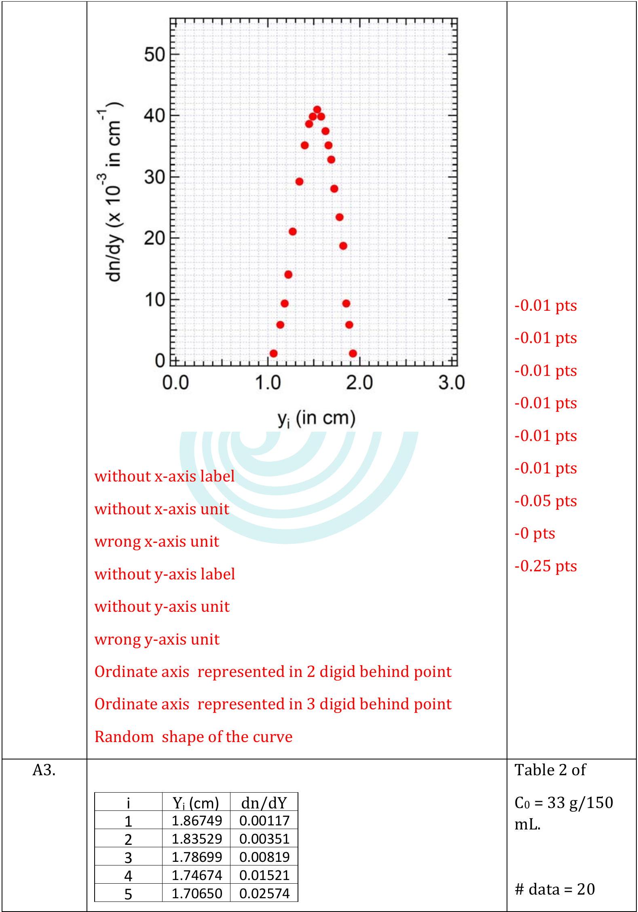

□
□
□
□
□

Determination of Refractive Index Gradient and Diffusion Coefficient of Salt Solution from Laser Deflection Measurement
(10 points)
A. Measurement of Refractive Index Gradient of Salt Water Solution (4.5 points)

| Question | Answer | Marks |
| :--- | :--- | :--- |
| A1. (1.2 pts) |  | Deflectogram of   $C _ { 0 } = 23 \mathrm {~g} / 150$ mL   Centred   Depth of dip:   $1.5 - 1.6 \mathrm {~cm}$   (0.4 pts)   -0.4   -0.05   -0.05   -0.05   -0.1 |
|  |  | Deflectogram |

□
□
□
□
□

| A1. | No dip   No reference line   Deflectogram (DL) not at the centre (+- 5mm) but the depth of dip still in 1.7 cm - 1.9 cm range   DL at the centre, the depth of dip <1.7 cm or >1.9 cm   DL not at the centre, the depth of dip <1.7 cm or >1.9 cm | of   $C _ { 0 } = 28 \mathrm { gr } / 150$ mL   Centred   Deep of dip:   $1.7 - 1.9 \mathrm {~cm}$   (0.4 pts)   -0.4   -0.05   -0.05   -0.05   -0.1 |
| :--- | :--- | :--- |

□
□
□
□
□

| A1. | No dip   No reference line   Deflectogram (DL) not at the centre (+-5mm) but the depth of dip still in 1.9-2.3 cm range   DL at the centre, the depth of dip <1.9 cm or >2.3 cm   DL not at the centre, the depth of dip <1.9 cm or >2.3 cm | Deflectogram of   $C _ { 0 } = 33 \mathrm {~g} / 150$ mL   Deep of dip:   $1.9 - 2.3 \mathrm {~cm}$   (0.4 pts)   -0.4 pts   -0.05 pts   -0.05 pts   -0.05 pts   -0.1 |
| :--- | :--- | :--- |
| A2.   (1.5 pts) | i $\delta _ { \mathrm { i } } ( \mathrm { cm } )$ $\xi _ { \mathrm { i } } ( \mathrm { cm } )$ $\mathrm { Z } _ { 0 } ( \mathrm {~cm} )$ $d ( c m )$ Z (cm)   1 0.05 11.55 $10.4 \pm 0.1$ 0.8 ± 0.1 $53.4 \pm 0.1$   2 0.35 11.3      3 0.6 11.05      4 0.9 10.85      5 1 10.65      6 1.1 10.35      7 1.3 10.15      8 1.4 9.85      9 1.45 9.7      10 1.5 9.45      11 1.6 9.25      12 1.5 8.95      13 1.4 8.65      14 1.2 8.35      15 1 8.05    | Table 1 of $\begin{aligned} & \mathrm { C } _ { 0 } = 23 \mathrm {~g} / 150 \\ & \mathrm {~mL} \\ & \text { Optimum } Z \\ & \text { and } Z _ { 0 } \\ & \# \text { data } = 20 \\ & \text { (0.5 pts) } \end{aligned}$ |

Student Code □
□
□
□
□ page 4 of 19

|  | 16 0.8 7.75      17 0.7 7.55      18 0.5 7.25      19 0.3 6.95      20 0.2 6.65      21 0.05 6.4      Correct data point must be extracted from deflectogram \# correct data points >= 20, but not all observable (Z, Z0, d) are written   Incorrect $d$   15<= \# correct data points<20,   10<\# correct data points<15   \#correct data points<10 | -0.05 pts   -0.05 pts   -0.15 pts   -0.3 pts   -0.45 pts |
| :--- | :--- | :--- |
| A2. | i $\delta _ { \mathrm { i } } ( \mathrm { cm } )$ $\xi _ { \mathrm { i } } ( \mathrm { cm } )$ $Z _ { \mathrm { o } } ( \mathrm { cm } )$ $d ( c m )$ $Z$ (cm)   1 0.05 11.65 $10.4 \pm 0.1$ 0.8 ± 0.1 $53.4 \pm 0.1$   2 0.25 11.4      3 0.4 11.2      4 0.8 11      5 1 10.75      6 1.2 10.4      7 1.4 10.2      8 1.5 10      9 1.6 9.8      10 1.7 9.5      11 1.75 9.25      12 1.7 8.95      13 1.65 8.7      14 1.5 8.4      15 1.25 8.05      16 0.9 7.6      17 0.6 7.3      18 0.4 7.05      19 0.25 6.75      20 0.05 6.3    | Table 1 of   $\mathrm { C } _ { 0 } = 28 \mathrm {~g} / 150$ mL   Optimum $Z$ and $Z _ { 0 }$   \# data = 20   (0.5 pts) |

Student Code □
□
□
□
□ page 5 of 19

|  | Correct data point must be extracted from deflectogram   \# correct data points >= 20, but not all observable (Z, Z0, d) are written   Incorrect $d$   15<= \# correct data points<20,   10<\# correct data points<15   \#correct data points<10 | -0.05 pts   -0.05 pts   -0.15 pts   -0.3 pts   -0.45 pts |
| :--- | :--- | :--- |
| A2. | i $\delta _ { \mathrm { i } } ( \mathrm { cm } )$ $\xi _ { \mathrm { i } } ( \mathrm { cm } )$ $Z _ { 0 } ( \mathrm {~cm} )$ $d ( c m )$ $Z$ (cm)   1 0.05 11.6 $10.4 \pm 0.1$ 0.8 ± 0.1 $53.4 \pm 0.1$   2 0.15 11.4      3 0.35 11.1      4 0.65 10.85      5 1.1 10.6      6 1.3 10.4      7 1.5 10.2      8 1.7 10      9 1.85 9.7      10 2 9.5      11 2.1 9.25      12 2 9      13 1.8 8.6      14 1.5 8.3      15 1.25 8.05      16 1 7.8      17 0.75 7.45      18 0.55 7.15      19 0.4 6.8      20 0.2 6.4      21 0.05 6.1      Correct data point must be extracted from deflectogram   \# correct data points >= 20, but not all observable (Z, Z0, d) are written   Incorrect d   15<= \# correct data points<20, | Table 1 of   $\mathrm { C } _ { 0 } = 33 \mathrm {~g} / 150$ mL   \# data point >= 20   (0.5 pts)   -0.05 pts   -0.05 pts   -0.15 pts |

Student Code □
□
□
□
□ page 6 of 19
page 6 of 19

|  | 10<\# correct data points<15   \#correct data points<10 | -0.3 pts   -0.45 pts |
| :--- | :--- | :--- |
| A3. (1.5 pts) | i $\mathrm { Y } _ { \mathrm { i } } ( \mathrm { cm } )$ dn/dY   1 1.85944 0.00117   2 1.81919 0.00819   3 1.77894 0.01404   4 1.74674 0.02106   5 1.71455 0.02340   6 1.66625 0.02574   7 1.63405 0.03043   8 1.58575 0.03277   9 1.56161 0.03394   10 1.52136 0.03511   11 1.48916 0.03745   12 1.44086 0.03511   13 1.39257 0.03277   14 1.34427 0.02809   15 1.29597 0.02340   16 1.24767 0.01872   17 1.21548 0.01638   18 1.16718 0.01170   19 1.11888 0.00702   20 1.07058 0.00468   21 1.03034 0.00117   Jury must check the data in table   \# wrong data point < 3   3<\# wrong data point < 6   \# wrong data point > 6 | Table 2 of   $\mathrm { C } _ { 0 } = 23 \mathrm {~g} / 150$ mL.   \# data = 20   (0.25 pts)   - 0   - 0.05 pts   -0.25pts |

| A3. | No x-axis label   No x-axis unit   Without x-axis unit   No y-axis label   No y-axis unit   Without y-axis unit   Ordinate axis represented in 2 digid behind point   Ordinate axis represented in 3 digid behind point   Random shape | Plot dn/dY vs Y   $\mathrm { C } _ { 0 } = 23 \mathrm {~g} / 150$ mL.   "Gaussian-Like" shape   (0.25 pts)   -0.01 pts   -0.01 pts   -0.01 pts   -0.01 pts   -0.01 pts   -0.01 pts   -0.05 pts   -0 pts   -0.25 pts |
| :--- | :--- | :--- |
| A3. | i $\mathrm { Y } _ { \mathrm { i } } ( \mathrm { cm } )$ dn/dY   1 1.87554 0.00117   2 1.83529 0.00585   3 1.80309 0.00936   4 1.77089 0.01872 | Table 2 of   $\mathrm { C } _ { 0 } = 28 \mathrm {~g} / 150$ mL.   \# data = 20 |

□
□
□
□
□

|  | 5 1.73065 0.02340   6 1.67430 0.02809   7 1.64210 0.03277   8 1.60990 0.03511   9 1.57770 0.03745   10 1.52941 0.03979   11 1.48916 0.04096   12 1.44086 0.03979   13 1.40061 0.03862   14 1.35232 0.03511   15 1.29597 0.02926   16 1.22352 0.02106   17 1.17523 0.01404   18 1.13498 0.00936   19 1.08668 0.00585   20 1.01424 0.00117   Jury must check the data in table   \# wrong data point < 3   3<\# wrong data point < 6   \# wrong data point > 6 | (0.25 pts)   - 0   -0.05 pts   -0.25pts |
| :--- | :--- | :--- |
| A3. |  | Plot dn/dY vs Y   $\mathrm { C } _ { 0 } = 28 \mathrm {~g} / 150$ mL.   "Gaussian-Like" shape   (0.25 pts) |

E1. Marking Scheme \& Solution
Student Code □
□
□
□
□

Experimental
Question
page 9 of 19

E1. Marking Scheme \& Solution
Student Code □
□
□
□
□

Experimental
Question □
page 10 of 19

|  | 6 1.67430 0.03043   7 1.64210 0.03511   8 1.60990 0.03979   9 1.56161 0.04330   10 1.52941 0.04681   11 1.48916 0.04915   12 1.44891 0.04681   13 1.38452 0.04213   14 1.33622 0.03511   15 1.29597 0.02926   16 1.25572 0.02340   17 1.19938 0.01755   18 1.15108 0.01287   19 1.09473 0.00936   20 1.03034 0.00468   21 0.98204 0.00117   Jury must check the data in table   \# wrong data point < 3   3<\# wrong data point < 6   \# wrong data point > 6 |  | (0.25 pts)   - 0   -0.05 pts   -0.25pts |
| :--- | :--- | :--- | :--- |
| A3. |  |  | Plot dn/dY vs Y   $\mathrm { C } _ { 0 } = 33 \mathrm {~g} / 150$ mL.   (0.25 pts) |

Student Code □
□
□
□
□ page 11 of 19

|  | without x-axis label without x-axis unit wrong x-axis unit without y-axis label without y-axis unit wrong $y$-axis unit   Ordinate axis represented in 2 digid behind point Ordinate axis represented in 3 digid behind point Random shape of the curve | -0.01 pts -0.01 pts -0.01 pts -0.01 pts -0.01 pts -0.01 pts -0.05 pts -0 pts -0.25 pts  |
| :--- | :--- | :--- |
| A4. (0.3 pts) | $h$ for 23 g/ 150 mL = $( 1.5 \pm 0.1 )$ cm | 0.1 pts |

□
□
□
□
□

|  | $h$ for $28 \mathrm {~g} / 150 \mathrm {~mL} = ( 1.5 \pm 0.1 ) \quad \mathrm { cm }$ | 0.1 pts |
| :--- | :--- | :--- |
|  | $h$ for $33 \mathrm {~g} / 150 \mathrm {~mL} = ( 1.5 \pm 0.1 ) \quad \mathrm { cm }$ | 0.1 pts |
|  | If $h$ is correctly determined from graph A3 for each concentration | - 0 |
|  | If $h$ is not correctly determined from graph A3 for each concentration | -0.1 |

B : Determination of Diffusion Coefficient ( $\mathbf { 4 . 2 }$ points)

| Question | Answer | Marks |
| :--- | :--- | :--- |
| B1. (0.9 pts) | Linear form of eq.(3) $\begin{align*} & \ln \left( \frac { d n } { d Y } \right) \approx m ( h - Y ) ^ { 2 } + C  \tag{b1}\\ & m = - \frac { 1 } { 4 D _ { e } t } \end{align*}$   Constant : $C = \ln \left( \left( \frac { d n } { d c } \right) \left( \frac { c _ { 0 } } { 2 \sqrt { \pi D _ { e } t } } \right) \right)$   Other than (b1) | 0.9 pt   -0.9 pts |
| B2. (1.8 pts) | i $( \mathrm { h } - \mathrm { vi } ) ^ { 2 }$ $\ln ( \mathrm { dn } / \mathrm { dy } )$   1 0.06592 -3.86003   2 0.050423 -3.75467   3 0.031065 -3.65936 | Table 3 of $\begin{aligned} & \mathrm { C } _ { 0 } = 23 \mathrm {~g} \\ & / 150 \mathrm {~mL} . \end{aligned}$ |

E1. Marking Scheme \& Solution Student Code □
□
□
□
□

Experimental Question 1
page 13 of 19

|  | 4 0.020752 -3.4923   5 0.00917 -3.41819   6 0.005128 -3.3831   7 0.000984 -3.3492   8 $6.99 \mathrm { E } - 07$ -3.28466   9 0.002414 -3.3492   10 0.009493 -3.41819   11 0.021237 -3.57235   12 0.037646 -3.75467   13 0.05872 -3.97781   Jury must check the data in table <pre><code># of data point &gt; 10 3 &lt;= # of data point &lt; 10 # of data point &lt; 3 # wrong data point &lt; 3 3&lt;# wrong data point &lt; 6 # wrong data point &gt;6</code></pre> | <pre><code># data = 10 (0.3 pts) -0 pts -0.05 pts -0.3 pts -0 -0.05 pts -0.25 pts</code></pre> |
| :--- | :--- | :--- |
| B2 | Using linear regression of eq. (B1.1), we obtain $m \text { (slope) } = - 10 \mathrm {~cm} ^ { - 2 } \text { till } - 8.8 \mathrm {~cm} ^ { - 2 }$ | (0.3pts) |

Student Code □
□
□
□
□ page 14 of 19

|  | without x-axis label   without x-axis unit   wrong x-axis unit   without y-axis label   without y-axis unit   wrong y-axis unit   \# of data point in linear range > 10   3 <= \# of data point in linear range < 10   \# of data point in linear range < 3 or random shape of curve   m is out of range | -0.01 pts   -0.01 pts   -0.01 pts   -0.01 pts   -0.01 pts   -0.01 pts   - 0   -0.05 pts   - 0.25 pts   -0.3 pts |
| :--- | :--- | :--- |
| B2. | i $( \mathrm { h } - \mathrm { yi } ) ^ { 2 }$ $\ln ( \mathrm { dn } / \mathrm { dy } )$   1 0.057912 -3.75467   2 0.033968 -3.57235   3 0.023136 -3.41819   4 0.014378 -3.3492   5 0.007693 -3.28466   6 0.001553 -3.22404   7 $6.99 \mathrm { E } - 07$ -3.19505   8 0.002414 -3.22404   9 0.007989 -3.25389   10 0.018955 -3.3492   11 0.037646 -3.53152   12 0.071007 -3.86003   13 0.099079 -4.26549   Jury must check the data in table | Table 3 of   $\mathrm { C } _ { 0 } = 28 \mathrm {~g}$   /150 mL   \# data =   10   (0.3 pts) |

Experimental

E1. Marking Scheme \& Solution
Question 1

Student Code □
□
□
□
□ page 15 of 19 page 15 of 19

|  | \# of data point > 10   3 <= \# of data point < 10   \# of data point < 3   \# wrong data point < 3   3<\# wrong data point < 6   \# wrong data point >6 | -0 pts   -0.05 pts   -0.3 pts   - 0   -0.05 pts   - 0.25 pts |
| :--- | :--- | :--- |
| B2. | Using linear regression of eq. (B1.1), we obtain   $m$ (slope) $= - 10.3 \mathrm {~cm} ^ { - 2 }$ till $- 11 \mathrm {~cm} ^ { - 2 }$   without x-axis label   without x-axis unit   wrong x-axis unit   without y-axis label   without y-axis unit   wrong y-axis unit | Plot of Table 3   $\mathrm { C } _ { 0 } = 28$   g/150   mL   \# data = 10   (0.3pts)   -0.01 pts   -0.01 pts   -0.01 pts   -0.01 pts   -0.01 pts   -0.01 pts   -0 pts |

□
□
□
□
□

|  | \# of data point in linear range > 10   3 <= \# of data point in linear range < 10   \# of data point in linear range < 3 or random shape of curve m is out of range | -0.05 pts   -0.3 pts   -0.3 pts |
| :--- | :--- | :--- |
| B2. | i $( \mathrm { h } - \mathrm { yi } ) ^ { 2 }$ $\ln ( \mathrm { dn } / \mathrm { dy } )$   1 0.046873 -3.65936   2 0.033968 -3.4923   3 0.023136 -3.3492   4 0.014378 -3.22404   5 0.005128 -3.13948   6 0.001553 -3.06152   7 $6.99 \mathrm { E } - 07$ -3.01273   8 0.001688 -3.06152   9 0.011126 -3.16688   10 0.023647 -3.3492   11 0.037646 -3.53152   12 0.054884 -3.75467   13 0.08446 -4.04235   Jury must check the data in table   \# of data point > 10   3 <= \# of data point < 10   \# of data point < 3   \# wrong data point < 3   3<\# wrong data point < 6   \# wrong data point >6 | Table 3 of   $\mathrm { C } _ { 0 } = 33 \mathrm {~g}$   /150 mL   \# data = 10   (0.3 pts)   -0 pts   -0.05 pts   -0.3 pts   - 0   - 0.05 pts   -0.25 |
| B2. |  | Plot of Table 3   $\mathrm { C } _ { 0 } = 33$   g/150   mL |

□
□
□
□
□

|  | Using linear regression of eq. (B1.1), we obtain $m \text { (slope) } = - 11.3 \mathrm {~cm} ^ { - 2 } \text { till } - 12.8 \mathrm {~cm} ^ { - 2 }$   without x-axis label   without x-axis unit   wrong x-axis unit   without y-axis label   without y-axis unit   wrong $y$-axis unit   m is out of range   \# of data point in linear range > 10   3 <= \# of data point in linear range < 10   \# of data point in linear range < 3 or random shape of curve | \# data = 10   (0.3pts)   -0.01 pts   -0.01 pts   -0.01 pts   -0.01 pts   -0.01 pts   -0.01 pts   -0.3 pts   -0 pts   -0.05 pts   -0.3 |
| :--- | :--- | :--- |
|  | B3 (1.5 pts) $\begin{aligned} & D \text { of } 23 \mathrm {~g} / 150 \mathrm {~mL} = \quad ( 1.38 \text { till } 1.58 ) \times 10 ^ { - 5 } \mathrm {~cm} ^ { 2 } / \mathrm { s } \\ & D \text { of } 28 \mathrm {~g} / 150 \mathrm {~mL} = \quad ( 1.26 \text { till } 1.46 ) \times 10 ^ { - 5 } \mathrm {~cm} ^ { 2 } / \mathrm { s } \end{aligned}$ | 0.5 pts   0.5 pts |

Experimental

E1. Marking Scheme \& Solution
Question

Student Code □
□
□
□
□ page 18 of 19

|  | $D$ of $33 \mathrm {~g} / 150 \mathrm {~mL} = \quad ( 1.03$ till $1.23 ) \times 10 ^ { - 5 } \mathrm {~cm} ^ { 2 } / \mathrm { s }$   $D$ is out of range for each concentration | 0.5 pts-   -0.5 pts |
| :--- | :--- | :--- |

C. Nonlinear diffusion (1.3 points)
| Question | Answer | Marks |
| :--- | :--- | :--- |
| C1. (1.3 pts) |  | Plot $D$ vs. $\mathrm { C } _ { 0 }$   0.8 pts   -0   -0.4 pts |
| C1. | $\begin{aligned} \frac { d } { d c } D = - 4.2 \times & 10 ^ { - 5 } c m ^ { 2 } m L g ^ { - 1 } s ^ { - 1 } \text { till } \\ & - 15.8 \times 10 ^ { - 5 } c m ^ { 2 } m L g ^ { - 1 } s ^ { - 1 } \end{aligned}$   Without or wrong unit   Out of range | 0.5 pts   -0.01 pts   -0.5 pts |

Student Code □
□
□
□
□ page 19 of 19
