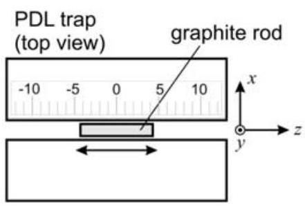
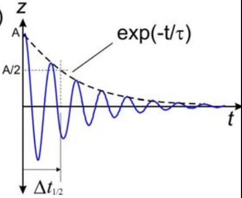
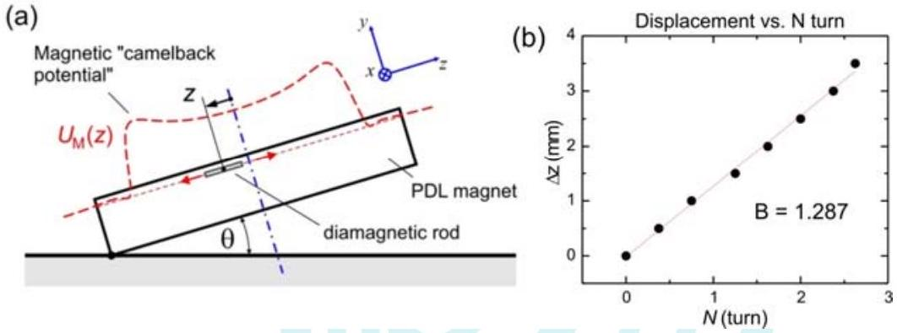

□
□
□
□
□

## Parallel Dipole Line Magnetic Trap for Earthquake \& Volcanic Sensing (10 points)

## A. BASIC CHARACTERISTICS OF PDL TRAP

1. Determination of the magnet's magnetization ( $M$ ) (2.5 pts)
| Quest ion | Answer | Marks |
| :--- | :--- | :--- |
| A. 1 0.1 pts | Record zero offset ( $B _ { 0 }$ ) of the Teslameter without any magnet nearby. Subtract subsequent field measurement with this value   Example from a Teslameter unit: $B _ { 0 } = 0.86 \mathrm { mT }$ | 0.08 pts range (-10 mT to 10 mT)   Correct unit: 0.02 pts |
| A. 2 1.15 pts | Measure magnetic field $B$ vs. $x$ in the near field region ( $7 \leq x \leq 16 \mathrm {~mm}$ ). Where $x$ is the position measured from the center of the magnet. Record and plot your result on the answer sheet.   $x _ { 0 } = 4 \mathrm {~mm} , B _ { 0 } = 0.86 \mathrm { mT } . \Delta x$ is measured from surface. $B =$ Braw - $B _ { 0 }$ $\Delta x$ $X$ Braw B $\ln ( x )$ $\ln ( B )$   (mm) (mm) (T) (T) $x$ in m $B$ in T           3 7 0.1576 0.1567 -4.962 -1.853   4 8 0.1186 0.1177 -4.828 -2.139   5 9 0.0951 0.0942 -4.710 -2.362   6 10 0.0785 0.0776 -4.605 -2.556   7 11 0.0657 0.0648 -4.510 -2.736   8 12 0.0579 0.0570 -4.423 -2.864   9 13 0.0445 0.0436 -4.343 -3.132   10 14 0.0371 0.0362 -4.269 -3.318   12 16 0.0321 0.0312 -4.135 -3.466   Plot: | Correct label and unit for data: 0.1 pts   Number of correct data for $x < = 16 \mathrm {~mm}$ :   0.05 pts for each correct data, max 0.45 pts   Plot:   -Correct axis label and unit: 0.05 pts   - Using around 75\% of plot area: 0.05 pts   -For each correct data point: 0.05 pts, max. 0.4 pts   -Adding trendline: 0.1 pts |

Student Code □
□
□
□
□ page 2 of 7

| A. 3 0.75 pts | Use your experimental data to determine the value of the exponent p.   Linear regression (LR) $y = a + b x : B = \frac { \mu _ { 0 } m } { 2 \pi } \frac { 1 } { x ^ { p } }$   $\ln ( B ) = a - p \ln x \quad$ where $a = \ln \left( \frac { \mu _ { 0 } m } { 2 \pi L } \right)$.   LR yields : $a = - 11.765$ and $b = - 1.997$   The power exponent: $p = - b = 2.0$   Note that this is in very good agreement with the exact result: at short distance $( x < L )$ a diametric (or a dipole line) magnet has $B \sim 1 / r ^ { 2 }$ dependence. See Ref. [1], Fig. 2c. | Obtaining $p$ from graph: 0.05 pts   Obtaining $p$ from linear regression: 0.1 pts   Result: $\begin{aligned} & p = 1.8 - 2.2 : 0.65 \mathrm { pts } \\ & p = 1.6 - 2.4 : 0.35 \mathrm { pts } \end{aligned}$   Result with wrong sign: $\begin{aligned} & p = ( - 1.8 ) - ( - 2.2 ) : 0.4 \mathrm { pts } \\ & p = ( - 1.6 ) - ( - 2.4 ) : 0.1 \mathrm { pts } \end{aligned}$   More than two sig. figs.: minus 0.05 pts |
| :--- | :--- | :--- |
| A. 4 0.5 pts | Determine the magnet's magnetization $M$. $\begin{aligned} & m = \frac { 2 \pi L } { \mu _ { 0 } } \exp ( a ) = 0.987 \mathrm { Am } ^ { 2 } \\ & M = \frac { m } { \pi R ^ { 2 } L } = 1.2 \times 10 ^ { 6 } \mathrm {~A} / \mathrm { m } \end{aligned}$   This is close to the more accurate results from more extensive measurements to far field (see Ref. [1], Fig. 2c) and we use this value for subsequent questions: $M = 1.1 \times 10 ^ { 6 } \mathrm {~A} / \mathrm { m }$ | Correct unit: 0.05 pts   Obtaining intercept (a) from graph: 0.025 pts Obtaining intercept from LR: 0.05 pts   Correct formula for $m$ and/or $M$ : 0.1 pts   Result for $M \left( \times 10 ^ { 6 } \mathrm {~A} / \mathrm { m } \right)$ : $\begin{aligned} & 0.9 - 1.4 : 0.3 \mathrm { pts } \\ & 0.1 - 2.5 : 0.15 \mathrm { pts } \end{aligned}$   More than 2 sig. figs.: minus 0.05 pts |

2. The Magnetic Levitation Effect and Magnetic Susceptibility ( $\boldsymbol { \chi }$ ) (1 pts)

| Quest ion | Answer | Marks |
| :--- | :--- | :--- |
| A. 5 0.1 pts | Place gently a graphite rod HB/0.5 and length $= 8 \mathrm {~mm}$. Measure the levitation height yo of the rod (see Fig. 7a). Hint: Use the insert ruler provided as shown in Fig. 7b. Press the ruler on the magnets to read the position of the graphite rod   We levitate graphite $\mathrm { HB } / 0.5 , l = 8 \mathrm {~mm}$. Using the insert-ruler, we measure approximately $\Delta y = 1 \mathrm {~mm}$ from the top of the magnet surface. Thus: $y _ { 0 } = R - \Delta y = ( 3.2 - 1 ) \mathrm { mm } = 2.2 \mathrm {~mm}$ | correct unit: 0.02   $y _ { 0 } = ( 1.7 - 2.2 ) \mathrm { mm } : 0.08$ pts   partial credit: Only $\Delta y = ( 1 - 1.5 ) \mathrm { mm }$ : 0.03 pts |

Student Code □
□
□
□
□ page 3 of 7

| A. 6 0.8 pts | Use the result from part A. 5 to determine the magnetic susceptibility $\chi$ of the graphite rod.   Solving for $\chi$ : $m g = F _ { y } = - \frac { \mu _ { 0 } M ^ { 2 } \chi V _ { R } } { 2 } \frac { R ^ { 4 } } { a ^ { 5 } } f _ { Y } \left( y _ { 0 } / a \right)$ $\chi = - \frac { 2 \rho g a ^ { 5 } } { \mu _ { 0 } M ^ { 2 } R ^ { 4 } f _ { Y } \left( y _ { 0 } / a \right) }$   We calculate: $a = R + g _ { M } / 2 = ( 3.2 + 1.5 / 2 ) \mathrm { mm } = 3.95 \mathrm {~mm}$. Using $\mathrm { y } _ { 0 } = 2.2 \mathrm {~mm} : f _ { Y } ( u ) = \frac { 4 u \left( 3 - u ^ { 2 } \right) \left( 1 - u ^ { 2 } \right) } { \left( 1 + u ^ { 2 } \right) ^ { 5 } }$, $f _ { Y } \left( y _ { 0 } / a \right) = f _ { Y } ( 2.2 / 3.95 ) = 1.07$   Using the correct $M = 1.1 \times 10 ^ { 6 } \mathrm {~A} / \mathrm { m }$; and $R = 3.2 \mathrm {~mm} , \rho = 1680 \mathrm {~kg} / \mathrm { m } ^ { 3 }$ we have: $\chi = - 1.85 \times 10 ^ { - 4 }$.   Note that this is very good agreement with the literature value for graphite pencil lead: $\chi = - 2 \times 10 ^ { - 4 }$ (see Ref.[1], pg. 2 \& Ref.[2]). The sign is negative indicating a diamagnetic material. | Correct expression for $\chi$ : 0.4 pts   Result for $\chi \left( \times 10 ^ { - 4 } \right)$ -(1.4 to 2.6) : 0.4 pts -(0.5 to 4) : 0.2 pts   Wrong sign: minus 0.1 pts |
| :--- | :--- | :--- |
| A. 7 0.1 pts | What kind of magnetic material is graphite? Choose one: (i) Ferromagnetic; (ii) Paramagnetic; or (iii) Diamagnetic? (iii) Diamagnetic. Because: (1) Graphite is repelled by magnetic field (2) The sign of $\chi$ is negative.  | Correct choice: 0.1 pts |

3. The camelback potential oscillation and magnetic susceptibility ( $\chi$ ) (1 points)

| Quest ion | Answer | Marks |
| :--- | :--- | :--- |
| A. 8 0.2 pts | Perform an oscillation for the "HB/0.5" graphite and $l = 8$ mm. Limit to small oscillation amplitude i.e. $A < 4 m m$. Determine the oscillation period. (The oscillation will decay over time due to damping, ignore this damping effect).   Example, we measured 5 oscillations of HB/0.5 with length $l = 8 \mathrm {~mm}$. We displaced it by ~3 mm and let it oscillates. We measured 5 oscillation periods:Trial 5 Tz        (s)       1 6.12     | Correct label and unit: 0.02 pts   Number of correct data each 0.01 pts, max 0.03 pts   Number of oscillation $\begin{aligned} & < 3 : 0 \mathrm { pts } \\ & > = 3 : 0.05 \mathrm { pts } \end{aligned}$   $T _ { \mathrm { z } } = ( 1.2 - 1.5 ) \mathrm { s } : 0.1 \mathrm { pts }$ |

Student Code □
□
□
□
□ page 4 of 7

|  | 2 6.13       3 6.14       Average : $T _ { \mathrm { z } } = 1.23 \mathrm {~s}$ |  |  |  |  |  |  |
| :--- | :--- | :--- | :--- | :--- | :--- | :--- | :--- |
| A. 9 0.8 pts | Calculate the magnetic susceptibility ( $\chi$ ) of the graphite using this oscillation   For harmonic oscillator : $k _ { z } = m _ { R } \omega ^ { 2 }$, solving for $\chi$ : $\chi = - \frac { k _ { z } } { C _ { 1 } \mu _ { 0 } M ^ { 2 } V _ { r } } = \frac { \omega ^ { 2 } \rho } { C _ { 1 } \mu _ { 0 } M ^ { 2 } }$   Using the correct $M = 1.1 \times 10 ^ { 6 } \mathrm {~A} / \mathrm { m }$.   Using $C _ { 1 } = 198.6 / \mathrm { m } ^ { 2 }$, and $T _ { \mathrm { z } } = 1.23 \mathrm {~s}$, we obtain $\chi = - 1.5 \times 10 ^ { - 4 } .$   Note that this is in good agreement with the literature value of the graphite pencil lead: $\chi = - 2 \times 10 ^ { - 4 }$ (Ref.[1], pg. 2); and the sign is negative indicating a diamagnetic material. |  |  |  |  |  | Correct expression for $\chi$ : 0.4 pts   Result for $\chi \left( \times 10 ^ { - 4 } \right)$ -(1.4 to 2.6) : 0.4 pts -(0.5 to 4) : 0.2 pts   Wrong sign: minus 0.1 pts |

4. Oscillator quality factor $( Q )$ and estimate of air viscosity $\mu _ { \underline { A } }$ (3.0 points)

| Quest ion | Answer | Marks |
| :--- | :--- | :--- |
| A. 10 0.5 pts | We need to determine the damping time constant of the oscillation $\tau$. Sketch how you measure $\tau$ in a simple way .   (a)   (b)   The trick is to use "half-time" concept of exponential decay. We set the oscillation and measure the time taken for the amplitude to halve. The lifetime is: $\tau = \frac { \Delta t _ { 1 / 2 } } { \ln 2 }$ | Correct idea: 0.3 pts   Correct expression for $\tau$ : 0.2 pts |
| A. 11 1.5 pts | Perform oscillation damping experiments with a group of rods with various diameters and fixed length of 8 mm. Determine the damping time constant $\tau$ for each rods | Correct label and unit 0.1   Number of correct data |

Student Code □
□
□
□
□ page 5 of 7

|  | We displaced the graphite by ~4 mm, started the stopwatch and then waited until it decays to half.Trial Diam. Actual Radius $\Delta \mathbf { t } _ { \mathbf { 1 } \boldsymbol { / } \mathbf { 2 } }$ Mean $\boldsymbol { \Delta } \mathbf { t } _ { \mathbf { 1 } \boldsymbol { / } \mathbf { 2 } }$ $\tau$ $\boldsymbol { r } ^ { \mathbf { 2 } } \boldsymbol { \times } \boldsymbol { \operatorname { l n } } ( \mathbf { 0 . 6 0 7 }$ I/r)    (mm) (mm) (s) (s) (s) $\left( \mathrm { mm } ^ { 2 } \right)$   1 0.3 0.19 3.89 3.913 5.646 0.117      3.97         3.88      2 0.5 0.28 7.69 7.617 10.989 0.224      7.57         7.59      3 0.7 0.35 8.77 8.82 12.73 0.322      8.81         8.88      4 0.9 0.45 12.4 11.70 16.88 0.482      11.33         11.38    | for each diameter (4): $\begin{aligned} & < 3 : 0.1 \mathrm { pts } \\ & > = 3 : 0.25 \mathrm { pts } \end{aligned}$ (max 1.0 pts)   Positive monotonic trend for $\tau$ vs. diameter from 0.3 to 0.9 mm with $\tau = 5$ to 20 sec : 0.4 pts |
| :--- | :--- | :--- |
| A. 12 1 pts | Determine the air viscosity $\mu _ { \mathrm { A } }$   We have: $\tau = b r ^ { 2 } \ln \left( 0.607 \times \frac { l } { r } \right)$, where: $b = \frac { 2 } { 3 } \frac { \rho } { \mu _ { A } }$. We performed linear regression $y = a + b x$, with $y = \tau$ and $x = r ^ { 2 } \ln \left( 0.607 \times \frac { l } { r } \right)$. We obtain: $b = 29.02 \mathrm {~s} / \mathrm { mm } ^ { 2 }$. $\mu _ { A } = \frac { 2 } { 3 } \frac { \rho } { b } = 38.610 ^ { - 6 } \text { Pa.s } \quad ( 1 \text { Pa.s } = 1 \mathrm {~kg} / \mathrm { m } \mathrm {~s} )$   Note that this is about 2.1x the actual viscosity of air of $18.2 \mu$.Pa.s. The discrepancy is due to the ellipsoidal | Correct unit: 0.05   Obtaining result with linear regression or plot: 0.25 pts   Result $\mu _ { \mathrm { A } } \left( \times 10 ^ { - 6 } \mathrm {~Pa} . \mathrm { s } \right)$ : $\begin{aligned} & 20 - 60 : 0.7 \mathrm { pts } \\ & 10 - 80 : 0.4 \mathrm { pts } \\ & 1 - 100 : 0.1 \mathrm { pts } \end{aligned}$ |

□
□
□
□
□

|  | approximation of the Stokes drag (vs. the actual cylindrical shape of the rod) and the proximity effect of the rod to the magnet (wall effect). Another factor is the crude nature of our manual $\tau$ determination. See Ref. [1], pg. 8. |  |
| :--- | :--- | :--- |

## B. SENSOR APPLICATION OF THE PDL TRAP

## 5. PDL Trap Seismometer (0.5 pts)

| Quest ion | Answer | Marks |
| :--- | :--- | :--- |
| B. 1   0.2 pts | Which diameter of rod do you choose?   To obtain the lowest acceleration noise floor " $a _ { n }$ " we should choose the largest diameter graphite i.e. 0.9 mm, because their damping time is the longest and the mass is the largest. | Correct answer: 0.2 pts |
| B. 2   0.3 pts | Calculate the seismometer acceleration noise floor $\left( a _ { n } \right)$ for the rod of your choice!   For HB/0.9 and length $l = 8 \mathrm {~mm}$ :   We use $\tau = 16.9 \mathrm {~s}$; and $T = 298 \mathrm {~K}$, we have: $m _ { R } = \rho \pi r ^ { 2 } l = 8.55 \times 10 ^ { - 6 } \mathrm {~kg}$ : $a _ { n } = \sqrt { \frac { 4 k _ { B } T \omega _ { 0 } } { Q m _ { R } } } = \sqrt { \frac { 8 k _ { B } T } { \tau m _ { R } } } = 1.5 \times 10 ^ { - 8 } \mathrm {~m} / \left( \mathrm { s } ^ { 2 } \mathrm {~Hz} ^ { 0.5 } \right)$ | Correct unit: 0.1   Correct answer: 0.2 pts |

## 6. PDL Trap Tiltmeter (2 pts)

| Quest ion | Answer | Marks |
| :--- | :--- | :--- |
| B. 3 0.5 pts | Derive the relation theoretically between displacement $\Delta z$ with the screw thread size $S$ and the number of turns (N). $k _ { z } \Delta z = m g \sin \theta = m g N S / D \quad \Delta z = \frac { m g S N } { k _ { z } D }$   From Question 3, we also have $k _ { z } = m \omega ^ { 2 }$ : $\Delta z = \frac { g S } { \omega ^ { 2 } D } N$ | Correct expression: 0.5 pts   Partial credit $k _ { z } \Delta z = m g \sin \theta : 0.2$ |
| B. 4 1.25 pts | By turning the screw slowly, determine the rod displacement $\Delta z$ vs. the number of screw turns (N). Determine the thread size $S$ | Correct label and unit: 0.1 pts |

Student Code □
□
□
□
□ page 7 of 7

|  | We measured the distance between screws: $D = 22 \mathrm {~cm}$, and we used the period from Q3: $T _ { z } = 1.23 \mathrm {~s}$ $\boldsymbol { \Delta } \mathbf { z }$ $\phi$ N      (mm)  (turn)      0 0 0      0.5 135 0.375      1 270 0.75      1.5 450 1.25      2 585 1.625      2.5 720 2.0      3 855 2.375      3.5 945 2.625      By performing linear regression: $y = a + b x$   We have $b = 1.287 \mathrm {~mm} /$ turns $: S = \frac { b \omega ^ { 2 } D } { g } = 0.75 \mathrm {~mm} /$ turn .   This is reasonably close to the actual value of the thread size: $S = ( 0.8 \pm 0.1 ) \mathrm { mm } /$ turn . | Distance between screws: $22.8 < D < 22.2 \mathrm {~cm} :$   0.1 pts   Number of correct data: $\begin{aligned} & < 3 \text { sets : } 0 \text { pts } \\ & 3 - 5 \text { sets: } 0.15 \mathrm { pts } \\ & > 5 \text { sets } : 0.25 \mathrm { pts } \end{aligned}$   Obtaining result with linear regression or plot: 0.2 pts   Result: $\begin{aligned} & 0.7 < S < 0.9 : 0.55 \mathrm { pts } \\ & 0.5 < S < 1.1 : 0.15 \mathrm { pts } \end{aligned}$   Correct unit for S : 0.05 |
| :--- | :--- | :--- |
| B. 5 0.25 pts | When the ground tilt changes we want the graphite rod to go to equilibrium as fast as possible (instead of sustaining very long oscillation) to allow easy reading. What is the ideal $Q$ factor for a tiltmeter?   We need critical damping thus: $Q = 0.5$ | Correct Q : 0.25 pts |

## REFERENCES:

[1] Gunawan, O. \& Virgus, Y. The one-dimensional camelback potential in the parallel dipole line trap: Stability conditions and finite size effect. J. Appl. Phys. 121, 133902, (2017). DOI:10.1063/1.4978876.
[2] Gunawan, O., Virgus, Y. \& Fai Tai, K. A parallel dipole line system. Appl. Phys. Lett. 106, 062407, (2015). DOI: 10.1063/1.4907931.
