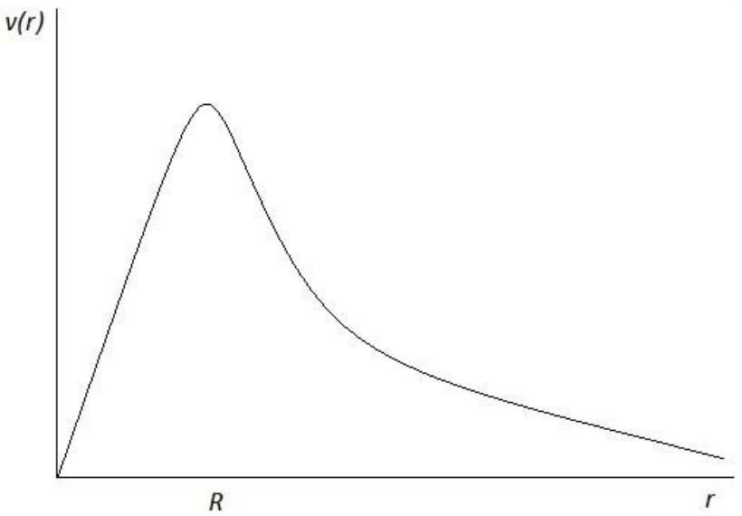
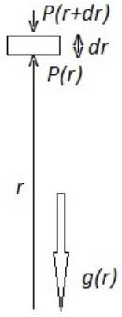

## Dark Matter

A.Cluster of Galaxies
Question A. 1

| Answer | Marks |
| :--- | :--- |
| Potential energy for a system of a spherical object with mass $M ( r ) = \frac { 4 } { 3 } \pi r ^ { 3 } \rho$ and a test particle with mass $d m$ at a distance $r$ is given by $d U = - G \frac { M ( r ) } { r } d m$ | 0.2 pts |
| Thus for a sphere of radius $R$ $\begin{aligned} U & = - \int _ { 0 } ^ { R } G \frac { M ( r ) } { r } d m = - \int _ { 0 } ^ { R } G \frac { 4 \pi r ^ { 3 } \rho } { 3 r } 4 \pi r ^ { 2 } \rho d r = - \frac { 16 } { 3 } G \pi ^ { 2 } \rho ^ { 2 } \int _ { 0 } ^ { R } r ^ { 4 } d r \\ & = - \frac { 16 } { 15 } G \pi ^ { 2 } \rho ^ { 2 } R ^ { 5 } \end{aligned}$ | 0.6 pts |
| Then using the total mass of the system $M = \frac { 4 } { 3 } \pi R ^ { 3 } \rho$   we have $U = - \frac { 3 } { 5 } \frac { G M ^ { 2 } } { R }$ | 0.2 pts |
| Total | 1.0 pts |

Question A. 2

| Answer | Marks |
| :--- | :--- |
| Using the Doppler Effect, $f _ { i } = f _ { 0 } \frac { 1 } { 1 + \beta } \approx f _ { 0 } ( 1 - \beta ) ,$   where $\beta = v / c$ and $v \ll c$. Thus the $i$-th galaxy moving away (radial) speed is $V _ { r i } = - \frac { f _ { i } - f _ { 0 } } { f _ { 0 } } c$   Alternative without approximation: $\begin{aligned} f _ { i } & = f _ { 0 } \frac { 1 } { 1 + \beta } \\ V _ { r i } & = c \left( \frac { f _ { 0 } } { f _ { i } } - 1 \right) \end{aligned}$ | 0.2 pts |
| All the galaxies in the galaxy cluster will be moving away together due to the cosmological expansion. Thus the average moving away speed of the $N$ galaxies in the cluster is $V _ { c r } = - \frac { c } { N f _ { 0 } } \sum _ { i = 1 } ^ { N } \left( f _ { i } - f _ { 0 } \right) = - \frac { c } { N } \sum _ { i = 1 } ^ { N } \left( \frac { f _ { i } } { f _ { 0 } } - 1 \right) .$   Alternative without approximation: $V _ { c r } = \frac { c f _ { 0 } } { N } \sum _ { i = 1 } ^ { N } \left( \frac { 1 } { f _ { i } } - \frac { 1 } { f _ { 0 } } \right) = \frac { c } { N } \sum _ { i = 1 } ^ { N } \left( \frac { f _ { 0 } } { f _ { i } } - 1 \right)$ | 0.3 pts |
| Total | 0.5 pts |

Question A. 3

| Answer | Marks |
| :--- | :--- |
| The galaxy moving away speed $V _ { i }$, in part A.2, is only one component of the three component of the galaxy velocity. Thus the average square speed of each galaxy with respect to the center of the cluster is $\frac { 1 } { N } \sum _ { i = 1 } ^ { N } \left( \vec { V } _ { i } - \vec { V } _ { c } \right) ^ { 2 } = \frac { 1 } { N } \sum _ { i = 1 } ^ { N } \left( V _ { x i } - V _ { x c } \right) ^ { 2 } + \left( V _ { y i } - V _ { y c } \right) ^ { 2 } + \left( V _ { z i } - V _ { z c } \right) ^ { 2 }$   Due to isotropic assumption $\frac { 1 } { N } \sum _ { i = 1 } ^ { N } \left( \vec { V } _ { i } - \vec { V } _ { c c } \right) ^ { 2 } = \frac { 3 } { N } \sum _ { i = 1 } ^ { N } \left( V _ { r i } - V _ { c r } \right) ^ { 2 }$ | 0.5 pts |
| And thus the root mean square of the galaxy speed with respect to the cluster center is $\begin{aligned} & v _ { r m s } = \sqrt { \frac { 3 } { N } \sum _ { i = 1 } ^ { N } \left( V _ { r i } - V _ { r c } \right) ^ { 2 } } = \sqrt { \frac { 3 } { N } \sum _ { i = 1 } ^ { N } \left( V _ { r i } ^ { 2 } - 2 V _ { c r } V _ { r i } + V _ { c r } ^ { 2 } \right) } = \sqrt { \frac { 3 } { N } \left( \sum _ { i = 1 } ^ { N } V _ { r i } ^ { 2 } \right) - 3 V _ { c r } ^ { 2 } } \\ & v _ { r m s } = c \sqrt { 3 } \sqrt { \left( \frac { 1 } { N } \sum _ { i = 1 } ^ { N } \left( \frac { f _ { i } } { f _ { 0 } } - 1 \right) ^ { 2 } \right) - \left( \frac { 1 } { N } \sum _ { i = 1 } ^ { N } \left( \frac { f _ { i } } { f _ { 0 } } - 1 \right) \right) ^ { 2 } } \\ & = \frac { c \sqrt { 3 } } { f _ { 0 } } \sqrt { \left( \frac { 1 } { N } \sum _ { i = 1 } ^ { N } \left( f _ { i } ^ { 2 } - 2 f _ { i } f _ { 0 } + f _ { 0 } ^ { 2 } \right) \right) - \left( \left( \frac { 1 } { N } \sum _ { i = 1 } ^ { N } f _ { i } \right) ^ { 2 } - 2 \frac { f _ { 0 } } { N } \sum _ { i = 1 } ^ { N } f _ { i } + f _ { 0 } ^ { 2 } \right) } \\ & = \frac { c \sqrt { 3 } } { f _ { 0 } N } \sqrt { \left( N \sum _ { i = 1 } ^ { N } f _ { i } ^ { 2 } \right) - \left( \sum _ { i = 1 } ^ { N } f _ { i } \right) ^ { 2 } } \end{aligned}$   Alternative without approximation: | 0.7 pts |

| $\begin{aligned} & v _ { r m s } = c \sqrt { 3 } \sqrt { \left( \frac { 1 } { N } \sum _ { i = 1 } ^ { N } \left( \frac { f _ { 0 } } { f _ { i } } - 1 \right) ^ { 2 } \right) - \left( \frac { 1 } { N } \sum _ { i = 1 } ^ { N } \left( \frac { f _ { 0 } } { f _ { i } } - 1 \right) \right) ^ { 2 } } \\ & = \frac { c \sqrt { 3 } } { f _ { 0 } } \sqrt { \left( \frac { 1 } { N } \sum _ { i = 1 } ^ { N } \left( \frac { 1 } { f _ { i } ^ { 2 } } - 2 \frac { 1 } { f _ { i } } \frac { 1 } { f _ { 0 } } + \frac { 1 } { f _ { 0 } ^ { 2 } } \right) \right) - \left( \left( \frac { 1 } { N } \sum _ { i = 1 } ^ { N } \frac { 1 } { f _ { i } } \right) ^ { 2 } - 2 \frac { 1 } { N } \frac { 1 } { f _ { 0 } } \sum _ { i = 1 } ^ { N } \frac { 1 } { f _ { i } } + \frac { 1 } { f _ { 0 } ^ { 2 } } \right) } \\ & = \frac { c f _ { 0 } \sqrt { 3 } } { N } \sqrt { \left( N \sum _ { i = 1 } ^ { N } \left( \frac { 1 } { f _ { i } } \right) ^ { 2 } \right) - \left( \sum _ { i = 1 } ^ { N } \frac { 1 } { f _ { i } } \right) ^ { 2 } } \end{aligned}$ |  |
| :--- | :--- |
| The mean kinetic energy of the galaxies with respect to the center of the cluster is $K _ { \text {ave } } = \frac { m } { 2 } \frac { 1 } { N } \sum _ { i = 1 } ^ { N } \left( \vec { V } _ { i } - \vec { V } _ { c } \right) ^ { 2 } = \frac { m } { 2 } v _ { \text {rms } } ^ { 2 }$ | 0.3 pts |
| Total | 1.5 pts |

Question A. 4

| Answer | Marks |
| :--- | :--- |
| The time average of $d \Gamma / d t$ vanishes $\left\langle \frac { d \Gamma } { d t } \right\rangle _ { t } = 0$   Now $\begin{aligned} \frac { d \Gamma } { d t } & = \frac { d } { d t } \sum _ { i } \vec { p } _ { i } \cdot \vec { r } _ { i } = \sum _ { i } \frac { d \vec { p } _ { i } } { d t } \cdot \vec { r } _ { i } + \sum _ { i } \vec { p } _ { i } \cdot \frac { d \vec { r } _ { i } } { d t } \\ & = \sum _ { i } \vec { F } _ { i } \cdot \vec { r } _ { i } + \sum _ { i } m _ { i } \vec { v } _ { i } \cdot \vec { v } _ { i } = \sum _ { i } \vec { F } _ { i } \cdot \vec { r } _ { i } + 2 K \end{aligned}$ | 0.6 pts |
| Where $K$ is the total kinetic energy of the system. Since the gravitational force on $i$-th particle comes from its interaction with other particles then $\begin{aligned} \sum _ { i } \vec { F } _ { i } \cdot \vec { r } _ { i } & = \sum _ { i , j \neq i } \vec { F } _ { j i } \cdot \vec { r } _ { i } = \sum _ { i < j } \vec { F } _ { j i } \cdot \vec { r } _ { i } - \sum _ { i > j } \vec { F } _ { i j } \cdot \vec { r } _ { i } = \sum _ { i < j } \vec { F } _ { j i } \cdot \vec { r } _ { i } - \sum _ { i < j } \vec { F } _ { j i } \cdot \vec { r } _ { j } \\ & = \sum _ { i < j } \vec { F } _ { j i } \cdot \left( \vec { r } _ { i } - \vec { r } _ { j } \right) = - \sum _ { i < j } G \frac { m _ { i } m _ { j } } { \left\| \vec { r } _ { i } - \vec { r } _ { j } \right\| ^ { 2 } } \frac { \left( \vec { r } _ { i } - \vec { r } _ { j } \right) } { \left\| \vec { r } _ { i } - \vec { r } _ { j } \right\| } \cdot \left( \vec { r } _ { i } - \vec { r } _ { j } \right) = - \sum _ { i < j } G \frac { m _ { i } m _ { j } } { \left\| \vec { r } _ { i } - \vec { r } _ { j } \right\| } = U _ { \mathrm { tot } } \end{aligned}$   Alternative proof: $\begin{array} { r }  \sum _ { i } \vec { F } _ { i } \cdot \vec { r } _ { i } = \sum _ { i , j \neq i } \vec { F } _ { j i } \cdot \vec { r } _ { i } = \vec { F } _ { 21 } \cdot \vec { r } _ { 1 } + \vec { F } _ { 31 } \cdot \vec { r } _ { 1 } + \vec { F } _ { 41 } \cdot \vec { r } _ { 1 } + \cdots + \vec { F } _ { N 1 } \cdot \vec { r } _ { 1 } + \\ \vec { F } _ { 12 } \cdot \vec { r } _ { 2 } + \vec { F } _ { 32 } \cdot \vec { r } _ { 2 } + \vec { F } _ { 42 } \cdot \vec { r } _ { 2 } + \cdots + \vec { F } _ { N 2 } \cdot \vec { r } _ { 2 } + \\ \vec { F } _ { 13 } \cdot \vec { r } _ { 3 } + \vec { F } _ { 23 } \cdot \vec { r } _ { 3 } + \vec { F } _ { 43 } \cdot \vec { r } _ { 3 } + \cdots + \vec { F } _ { N 3 } \cdot \vec { r } _ { 3 } + \ldots \\ \vec { F } _ { 1 N } \cdot \vec { r } _ { N } + \vec { F } _ { 2 N } \cdot N _ { N } + \vec { F } _ { 3 N } \cdot \vec { r } _ { N } + \cdots + \vec { F } _ { N N - 1 } \cdot \vec { r } _ { N - 1 } \end{array}$   Collecting terms and noting that $\vec { F } _ { i j } = - \vec { F } _ { j i }$ we have |  |

| $\begin{aligned} \vec { F } _ { 12 } \cdot \left( \vec { r } _ { 2 } - \vec { r } _ { 1 } \right) & + \vec { F } _ { 13 } \cdot \left( \vec { r } _ { 3 } - \vec { r } _ { 1 } \right) + \vec { F } _ { 14 } \cdot \left( \vec { r } _ { 4 } - \vec { r } _ { 1 } \right) + \cdots + \vec { F } _ { 23 } \cdot \left( \vec { r } _ { 3 } - \vec { r } _ { 2 } \right) \\ & + \vec { F } _ { 24 } \cdot \left( \vec { r } _ { 4 } - \vec { r } _ { 2 } \right) + \cdots + \vec { F } _ { 34 } \cdot \left( \vec { r } _ { 4 } - \vec { r } _ { 3 } \right) + \cdots = \sum _ { i < j } \vec { F } _ { j i } \cdot \left( \vec { r } _ { i } - \vec { r } _ { j } \right) \\ & = - \sum _ { i < j } G \frac { m _ { i } m _ { j } } { \left\| \vec { r } _ { i } - \vec { r } _ { j } \right\| ^ { 2 } } \frac { \left( \vec { r } _ { i } - \vec { r } _ { j } \right) } { \left\| \vec { r } _ { i } - \vec { r } _ { j } \right\| } \cdot \left( \vec { r } _ { i } - \vec { r } _ { j } \right) = - \sum _ { i < j } G \frac { m _ { i } m _ { j } } { \left\| \vec { r } _ { i } - \vec { r } _ { j } \right\| } = U _ { t o t } \end{aligned}$ |  |
| :--- | :--- |
| Thus we have $\frac { d \Gamma } { d t } = U + 2 K$   And by taking its time average we obtain $\left\langle \frac { d \Gamma } { d t } = U + 2 K \right\rangle _ { t } = 0$ and thus $\langle K \rangle _ { t } = - \frac { 1 } { 2 } \langle U \rangle _ { t }$. Therefore $\gamma = \frac { 1 } { 2 }$. | 0.2 pts |
| Total | 1.7 pts |

Question A. 5

| Answer | Marks |
| :--- | :--- |
| Using Virial theorem, and since the dark matter has the same root mean square speed as the galaxy, then we have $\begin{aligned} & \langle K \rangle _ { t } = - \frac { 1 } { 2 } \langle U \rangle _ { t } \\ & \frac { M } { 2 } v _ { r m s } ^ { 2 } = \frac { 1 } { 2 } \frac { 3 } { 5 } \frac { G M ^ { 2 } } { R } \end{aligned}$ | 0.3 pts |
| From which we have $M = \frac { 5 R v _ { r m s } ^ { 2 } } { 3 G }$ | 0.1 pts |
| And the dark matter mass is then $M _ { d m } = \frac { 5 R v _ { r m s } ^ { 2 } } { 3 G } - N m _ { g }$ | 0.1 pts |
| Total | 0.5 pts |

B.Dark Matter in a Galaxy
Question B. 1

| Answer | Marks |
| :--- | :--- |
| Answer B.1: The gravitational attraction for a particle at a distance $r$ from the center of the sphere comes only from particles inside a spherical volume of radius $r$. For particle inside the sphere with mass $m _ { s }$, assuming the particle is orbiting the center of mass in a circular orbit, we have $G \frac { m ^ { \prime } ( r ) m _ { s } } { r ^ { 2 } } = \frac { m _ { s } v _ { 0 } ^ { 2 } } { r }$ | 0.3 pts |
| with $m ^ { \prime } ( r )$ is the total mass inside a sphere of radius $r$ $m ^ { \prime } ( r ) = \frac { 4 } { 3 } \pi r ^ { 3 } m _ { s } n$   Thus we have $v ( r ) = \left( \frac { 4 \pi G n m _ { s } } { 3 } \right) ^ { 1 / 2 } r$ | 0.2 pts |
| While for particle outside the sphere, we have $v ( r ) = \left( \frac { 4 \pi G n m _ { s } R ^ { 3 } } { 3 r } \right) ^ { 1 / 2 }$ | 0.2 pts |

| The sketch is given below   Sketch of the rotation velocity vs distance from the center of galaxy | 0.1 pts |
| :--- | :--- |
| Total | 0.8 pts |

Question B. 2
| Answer |  | Marks |
| :--- | :--- | :--- |
| The total mass can be inferred from $G \frac { m ^ { \prime } \left( R _ { g } \right) m _ { s } } { R _ { g } { } ^ { 2 } } = \frac { m _ { s } v _ { 0 } ^ { 2 } } { R _ { g } }$   Thus $m _ { R } = m ^ { \prime } \left( R _ { g } \right) = \frac { v _ { 0 } ^ { 2 } R _ { g } } { G }$ |  |  |
|  | Total | 0.5 pts |

Question B. 3
| Answer | Marks |
| :--- | :--- |
| Base on the previous answer in B.1, if the mass of the galaxy comes only from the visible stars, then the galaxy rotation curve should fall proportional to $1 / \sqrt { r }$ on the outside at a distance $r > R _ { g }$. But in the figure of problem b) the curve remain constant after $r > R _ { g }$, we can infer from $G \frac { m ^ { \prime } ( r ) m _ { s } } { r ^ { 2 } } = \frac { m _ { s } v _ { 0 } ^ { 2 } } { r } .$ to make $v ( r )$ constant, then $m ^ { \prime } ( r )$ should be proportional to $r$ for $r > R _ { g }$, i.e. for $r > R _ { g } , m ^ { \prime } ( r ) = A r$ with $A$ is a constant. | 0.3 pts |
| While for $r < R _ { g }$, to obtain a linear plot proportional to $r$, then $m ^ { \prime } ( r )$ should be proportional to $r ^ { 3 }$, i.e. $m ^ { \prime } ( r ) = B r ^ { 3 }$. | 0.3 pts |
| Thus for $r < R _ { g }$ we have $\begin{aligned} & m ^ { \prime } ( r ) = \int _ { 0 } ^ { r } \rho _ { t } ( r ) 4 \pi r ^ { \prime 2 } d r ^ { \prime } = B r ^ { 3 } \\ & d m ^ { \prime } ( r ) = \rho _ { t } ( r ) 4 \pi r ^ { 2 } d r = 3 B r ^ { 2 } d r \end{aligned}$ Thus total mass density $\rho _ { t } ( r ) = \frac { 3 B } { 4 \pi }$ | 0.2 pts |
| $\begin{aligned} & m _ { R } = \int _ { 0 } ^ { R _ { g } } \frac { 3 B } { 4 \pi } 4 \pi r ^ { \prime 2 } d r ^ { \prime } = B R _ { g } { } ^ { 3 } \text { or } B = \frac { m _ { R } } { R _ { g } { } ^ { 3 } } = \frac { v _ { 0 } ^ { 2 } } { G R _ { g } { } ^ { 2 } } \\ & \text { Thus the dark matter mass density } \rho ( r ) = \frac { 3 v _ { 0 } ^ { 2 } } { 4 \pi G R _ { g } { } ^ { 2 } } - n m _ { s } \end{aligned}$ | 0.2 pts |

| While for $r > R _ { g }$ we have $\begin{aligned} & m ^ { \prime } ( r ) = \int _ { 0 } ^ { R _ { g } } \rho \left( r ^ { \prime } \right) 4 \pi r ^ { \prime 2 } d r ^ { \prime } + \int _ { R _ { g } } ^ { r } \rho \left( r ^ { \prime } \right) 4 \pi r ^ { \prime 2 } d r ^ { \prime } = A r \\ & m ^ { \prime } ( r ) = m _ { R } + \int _ { R _ { g } } ^ { r } \rho \left( r ^ { \prime } \right) 4 \pi r ^ { \prime 2 } d r ^ { \prime } = A r \end{aligned}$ $\begin{aligned} & \int _ { R } ^ { r } \rho \left( r ^ { \prime } \right) 4 \pi r ^ { \prime 2 } d r ^ { \prime } = A r - M _ { 0 } \\ & \rho ( r ) 4 \pi r ^ { 2 } = A , \text { or } \rho ( r ) = \frac { A } { 4 \pi r ^ { 2 } } . \end{aligned}$ | 0.2 pts |
| :--- | :--- |
| Now to find the constant $A$. $\int _ { R } ^ { r } \frac { A } { 4 \pi r ^ { \prime 2 } } 4 \pi r ^ { \prime 2 } d r ^ { \prime } = A \left( r - R _ { g } \right) = A r - m _ { R }$   Thus $A R _ { g } = m _ { R }$ and $A = \frac { v _ { 0 } ^ { 2 } } { G }$   We can also find $A$ from the following $G \frac { m ^ { \prime } ( r ) m _ { s } } { r ^ { 2 } } = G \frac { A r m _ { s } } { r ^ { 2 } } = \frac { m _ { s } v _ { 0 } ^ { 2 } } { r } , \text { thus } A = \frac { v _ { 0 } ^ { 2 } } { G } .$   Thus the dark matter mass density (which is also the total mass density since $n \approx 0$ for $r \geq R _ { g }$. $\rho ( r ) = \frac { v _ { 0 } ^ { 2 } } { 4 \pi G r ^ { 2 } } \text { for } r \geq R _ { g }$ | 0.3 pts |
| Total | 1.5 pts |

C. Interstellar Gas and Dark Matter

Question C. 1

| Answer | Marks |
| :--- | :--- |
| Consider a very small volume of a disk with area $A$ and thickness $\Delta r$, see Fig. 1 Figure 1. Hydrostatic equilibrium   In hydrostatic equilibrium we have $( P ( r ) - P ( r + \Delta r ) ) A - \rho g ( r ) A \Delta r = 0$ | 0.3 pts |
| $\begin{aligned} & \frac { \Delta P } { \Delta r } = - \rho \frac { G m ^ { \prime } ( r ) } { r ^ { 2 } } \\ & \frac { d P } { d r } = - \rho \frac { G m ^ { \prime } ( r ) } { r ^ { 2 } } = - n ( r ) m _ { p } \frac { G m ^ { \prime } ( r ) } { r ^ { 2 } } . \end{aligned}$ | 0.2 pts |
| Total | 0.5 pts |

Question C. 2

| Answer |  | Marks |
| :--- | :--- | :--- |
| Using the ideal gas law $P = n k T$ where $n = N / V$ where $n$ is the number density, we have $\frac { d P } { d r } = k T \frac { d n ( r ) } { d r } + k n ( r ) \frac { d T } { d r } = - n ( r ) m _ { p } \frac { G m ^ { \prime } ( r ) } { r ^ { 2 } }$   Thus we have $m ^ { \prime } ( r ) = - \frac { k T } { G m _ { p } } \left( \frac { r ^ { 2 } } { n ( r ) } \frac { d n ( r ) } { d r } + \frac { r ^ { 2 } } { T ( r ) } \frac { d T ( r ) } { d r } \right) .$ |  |  |
|  | Total | 0.5 pts |

Question C. 3

| Answer | Marks |
| :--- | :--- |
| If we have isothermal distribution, we have $d T / d r = 0$ and $m ^ { \prime } ( r ) = - \frac { k T _ { 0 } } { G m _ { p } } \left( \frac { r ^ { 2 } } { n ( r ) } \frac { d n ( r ) } { d r } \right)$ | 0.2 pts |
| From information about interstellar gas number density, we have $\frac { 1 } { n ( r ) } \frac { d n ( r ) } { d r } = - \frac { 3 r + \beta } { r ( r + \beta ) }$   Thus we have $m ^ { \prime } ( r ) = \frac { k T _ { 0 } r } { G m _ { p } } \frac { 3 r + \beta } { ( r + \beta ) }$ | 0.2 pts |

## T1

| Mass density of the interstellar gas is $\rho _ { g } ( r ) = \frac { \alpha m _ { p } } { r ( \beta + r ) ^ { 2 } }$ |  |
| :--- | :--- |
| Thus $\begin{aligned} & m ^ { \prime } ( r ) = \int _ { 0 } ^ { r } \left( \rho _ { g } \left( r ^ { \prime } \right) + \rho _ { d m } \left( r ^ { \prime } \right) \right) 4 \pi r ^ { \prime 2 } d r ^ { \prime } = \frac { k T _ { 0 } r } { G m _ { p } } \frac { 3 r + \beta } { ( r + \beta ) } \\ & m ^ { \prime } ( r ) = \int _ { 0 } ^ { r } \left( \frac { \alpha m _ { p } } { r ^ { \prime } \left( \beta + r ^ { \prime } \right) ^ { 2 } } + \rho _ { d m } \left( r ^ { \prime } \right) \right) 4 \pi r ^ { \prime 2 } d r ^ { \prime } = \frac { k T _ { 0 } r } { G m _ { p } } \frac { 3 r + \beta } { ( r + \beta ) } \end{aligned}$ | 0.3 pts |
| $\begin{aligned} & \left( \frac { \alpha m _ { p } } { r ( \beta + r ) ^ { 2 } } + \rho _ { d m } ( r ) \right) 4 \pi r ^ { 2 } = \frac { k T _ { 0 } } { G m _ { p } } \frac { 3 r ^ { 2 } + 6 r \beta - } { ( r + \beta ) } \\ & \rho _ { d m } ( r ) = \frac { k T _ { 0 } } { 4 \pi G m _ { p } } \frac { 3 r ^ { 2 } + 6 r \beta + \beta ^ { 2 } } { ( r + \beta ) ^ { 2 } r ^ { 2 } } - \frac { \alpha m _ { p } } { r ( \beta + r ) ^ { 2 } } \end{aligned}$ | 0.3 pts |
| Total | 1.0 pts |
