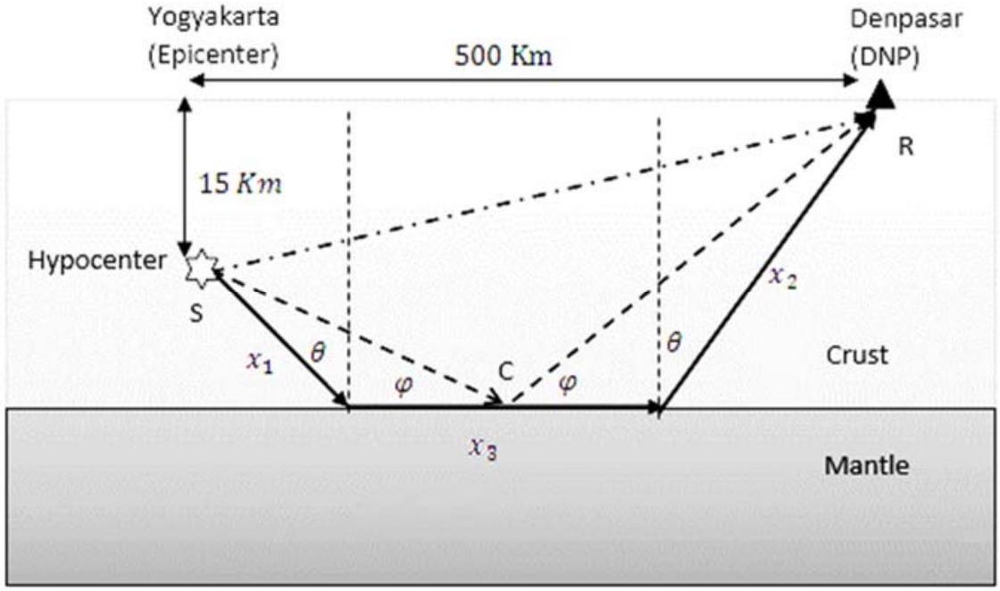
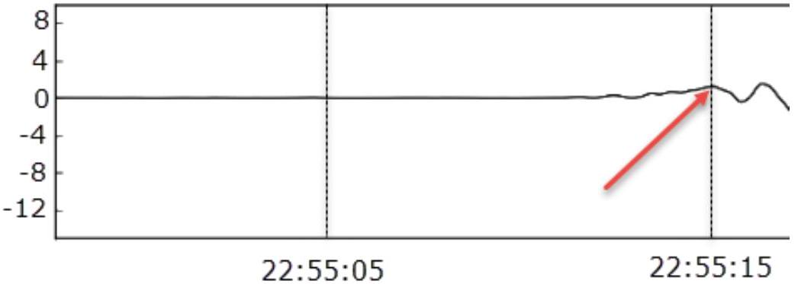

## Earthquake, Volcano and Tsunami

A. Merapi Volcano Eruption

| Question | Answer | Marks |
| :--- | :--- | :--- |
| A. 1 | Using Black's Principle the equilibrium temperature can be obtained $m _ { w } c _ { v w } \left( T _ { e } - T _ { w } \right) + m _ { m } c _ { v m } \left( T _ { e } - T _ { m } \right) = 0$   Thus, $T _ { e } = \frac { m _ { w } c _ { v w } T _ { w } + m _ { m } c _ { v m } T _ { m } } { m _ { w } c _ { v w } + m _ { m } c _ { v m } }$ | 0.5 pts |
| A. 2 | For ideal gas, $p _ { e } v _ { e } = R T _ { e }$, thus $p _ { e } = \frac { R } { v _ { e } } \frac { m _ { w } c _ { v w } T _ { w } + m _ { m } c _ { v m } T _ { m } } { m _ { w } c _ { v w } + m _ { m } c _ { v m } }$ | 0.3 pts |
| A. 3 | The relative velocity $u _ { \text {rel } }$ can be expressed as $u _ { r e l } = \kappa p ^ { \alpha } V ^ { \beta } m ^ { \gamma }$   where $\kappa$ is a dimensionless constant.   Using dimensional analysis, one can obtain that $\begin{gathered} L T ^ { - 1 } = M ^ { \alpha + \gamma } L ^ { - \alpha + 3 \beta } T ^ { - 2 \alpha } \\ \alpha + \gamma = 0 \\ - \alpha + 3 \beta = 1 \\ - 2 \alpha = - 1 \end{gathered}$   Therefore $u _ { r e l } = \kappa p ^ { 1 / 2 } V ^ { 1 / 2 } m ^ { - 1 / 2 }$ | 0.5 pts |
| Total score |  | 1.3 pts |

B. The Yogyakarta Earthquake

| Question | Answer | Marks |  |
| :--- | :--- | :--- | :--- |
| B. 1 | From the given seismogram, fig. 2   One can see that the P-wave arrived at 22:54:045 or (4.5-5.5) seconds after the earthquake occurred at the hypocenter. | 0.3 pts | 0.5 pts |
|  | Since the horizontal distance from the epicenter to the seismic station in Gamping is 22.5 km, and the depth of the hypocenter is 15 km, the distance from the hypocenter to the station is $\sqrt { 22.5 ^ { 2 } + 15 ^ { 2 } } \mathrm {~km} = 27.04 \mathrm {~km}$ | 0.1 pts |  |
|  | Therefore, the P-wave velocity is $v _ { P } = \frac { 27.04 \mathrm { Km } } { 4.7 \mathrm {~s} } = 5.75 \mathrm { Km } / \mathrm { s }$ | 0.1 pts |  |

| Question | Answer | Marks |  |
| :--- | :--- | :--- | :--- |
| B. 2 | Direct wave: $t _ { \text {direct } } = \frac { S R } { v _ { 1 } } = \frac { \sqrt { 500 ^ { 2 } + 15 ^ { 2 } } } { v _ { 1 } } = \frac { 502.021 } { 5.753 } \mathrm {~s} = 86.9 \mathrm {~s}$ | 0.2 pts | 0.6 pts |
|  | As in the case of an optical wave, the Snell's law is also applicable to the seismic wave.   Illustration for the traveling seismic Wave   Reflected wave: $t _ { \text {reflected } } = \frac { S C } { v _ { 1 } } + \frac { C R } { v _ { 1 } }$ $\begin{aligned} & S C \cos \varphi + C R \cos \varphi = 500 \Rightarrow \cot \varphi = \frac { 500 } { 45 } \\ & t _ { \text {reflected } } = \frac { 45 } { v _ { 1 } \sin \varphi } = 87.3 \mathrm {~s} \end{aligned}$ | 0.4 pts |  |

| Question | Answer | Marks |  |
| :--- | :--- | :--- | :--- |
| B. 3 | Velocity of P-wave on the mantle. The fastest wave crossing the mantle is that propagating along the upperpart of the mantle. From the figure on refracted wave, we obtain that $\begin{aligned} & \frac { \sin \theta } { v _ { 1 } } = \frac { 1 } { v _ { 2 } } ; \quad \sin \theta = \frac { v _ { 1 } } { v _ { 2 } } ; \quad \cos \theta = \sqrt { 1 - \left( \frac { v _ { 1 } } { v _ { 2 } } \right) ^ { 2 } } \\ & \cos \theta = \frac { 15 } { x _ { 1 } } ; \quad x _ { 1 } = \frac { 15 } { \cos \theta } \mathrm {~km} ; \quad x _ { 2 } = \frac { 30 } { \cos \theta } \mathrm {~km} \\ & x _ { 3 } = 500 - \left( x _ { 1 } + x _ { 2 } \right) \sin \theta = 500 - 45 \tan \theta \end{aligned}$ | 0.4 pts | 1.2 pts |
|  | The total travel time: $\begin{aligned} & t = \frac { x _ { 1 } + x _ { 2 } } { v _ { 1 } } + \frac { x _ { 3 } } { v _ { 2 } } = \frac { 45 } { v _ { 1 } \cos \theta } + \frac { 500 } { v _ { 2 } } - \frac { 45 \tan \theta } { v _ { 2 } } \\ & t \cos \theta = 45 u _ { 1 } + 500 u _ { 2 } \cos \theta - 45 u _ { 2 } \sin \theta \end{aligned}$   where $u _ { 1 } = 1 / v _ { 1 }$ and $u _ { 2 } = 1 / v _ { 2 }$. Arranging the equation, we get $\left( 500 ^ { 2 } + 45 ^ { 2 } \right) u _ { 2 } ^ { 2 } - 2 t 500 u _ { 2 } + t ^ { 2 } - 45 ^ { 2 } u _ { 1 } = 0$   whose solution is $v _ { 2 } = \frac { 500 t v _ { 1 } ^ { 2 } + 45 v _ { 1 } \sqrt { \left( 45 ^ { 2 } + 500 ^ { 2 } \right) - t ^ { 2 } v _ { 1 } ^ { 2 } } } { t ^ { 2 } v _ { 1 } ^ { 2 } - 45 ^ { 2 } }$ | 0.5 pts |  |
|  | $\times 10 ^ { - 5 } \mathrm {~m} / \mathrm { s }$ Station DNP   From the seismogram, we know that the fastest wave arrived at Denpasar station at 22:55:15, which is $t = 75 \mathrm {~s}$ from the origin time of the earthquake in Yogyakarta. Thus $v _ { 2 } = 7.1 \mathrm {~km} / \mathrm { s }$ | 0.3 pts |  |

| Question | Answer | Marks |  |
| :--- | :--- | :--- | :--- |
| B. 4 | By using Snell's law and defining $p = \sin \theta / v$ and $u = 1 / v$, we obtain $p \equiv u ( 0 ) \sin \theta _ { 0 } = u ( z ) \sin \theta ; \quad \sin \theta = \frac { p } { u ( z ) }$ | 0.2 pts | 1.4 pts |
|  | where $u ( z ) = 1 / v ( z )$ and $\theta _ { 0 }$ is the initial angle of the seismic wave direction. $\begin{aligned} & \frac { d x } { d s } = \sin \theta = \frac { p } { u ( z ) } ; \\ & \frac { d x } { d z } = \frac { d x } { d s } \frac { d s } { d z } = \frac { p } { u } \frac { } { \left( u ^ { 2 } - \right. } \\ & x = \int _ { z _ { 1 } } ^ { z _ { 2 } } \frac { 48 p } { \left( u ^ { 2 } - p ^ { 2 } \right) ^ { 1 / 2 } } d z \end{aligned}$   0.7 pts |  |  |
|  |  |  |  |

| Question | Answer | Marks |  |
| :--- | :--- | :--- | :--- |
| B. 5 | For the travel time, $d t = \frac { d s } { v ( z ) } ; \quad \frac { d t } { d s } = u ( z )$.   Thus $\frac { d t } { d z } = \frac { d t } { d s } \frac { d s } { d z } = \frac { u ^ { 2 } } { \left( u ^ { 2 } - p ^ { 2 } \right) ^ { 1 / 2 } }$   and therefore $T = 2 \int _ { 0 } ^ { z _ { t } } \frac { u ^ { 2 } } { \left( u ^ { 2 } - p ^ { 2 } \right) ^ { 1 / 2 } } d z = 2 \int _ { 0 } ^ { z _ { t } } \frac { 1 } { \left( v _ { 0 } + a z \right) } \frac { 1 } { \left( 1 - p ^ { 2 } \left( v _ { 0 } + a z \right) ^ { 2 } \right) ^ { 1 / 2 } } d z$ | 1.0 pts | 1.0 pts |
| B. 6 | The total travel time from the source to the Denpasar can be calculated using previous relation $T ( p ) = 2 \int _ { 0 } ^ { z _ { t } } \frac { u ^ { 2 } ( z ) } { \left( u ^ { 2 } ( z ) - p ^ { 2 } \right) ^ { 1 / 2 } } d z$   Which is valid for a continuous $u ( z )$. For a simplified stacked of homogeneous layers (Figure F), the integral equation became a summation $T ( p ) = 2 \sum _ { i } ^ { N } \frac { u _ { i } ^ { 2 } \Delta z _ { i } } { \left( u _ { i } ^ { 2 } - p ^ { 2 } \right) ^ { 1 / 2 } }$ | 0.6 pts | 1.0 pts |
|  | $\begin{aligned} T ( p ) & = 2 \frac { u _ { 1 } ^ { 2 } \Delta z _ { 1 } } { \left( u _ { 1 } ^ { 2 } - p ^ { 2 } \right) ^ { \frac { 1 } { 2 } } } + 2 \frac { u _ { 2 } ^ { 2 } \Delta z _ { 2 } } { \left( u _ { 2 } ^ { 2 } - p ^ { 2 } \right) ^ { \frac { 1 } { 2 } } } + 2 \frac { u _ { 3 } ^ { 2 } \Delta z _ { 3 } } { \left( u _ { 3 } ^ { 2 } - p ^ { 2 } \right) ^ { \frac { 1 } { 2 } } } \\ & = \frac { 2 \times ( 0.1504 ) ^ { 2 } \times 6 } { \left( 0.1504 ^ { 2 } - 0.143 ^ { 2 } \right) ^ { \frac { 1 } { 2 } } } + \frac { 2 \times ( 0.1435 ) ^ { 2 } \times 9 } { \left( 0.1435 ^ { 2 } - 0.143 ^ { 2 } \right) ^ { \frac { 1 } { 2 } } } \\ & \quad + \frac { 2 \times ( 0.1431 ) ^ { 2 } \times 15 } { \left( 0.1431 ^ { 2 } - 0.143 ^ { 2 } \right) ^ { \frac { 1 } { 2 } } } \\ & = 151.64 \text { second } \end{aligned}$   Note that the actual travel time from the epicenter to Denpasar is 75 seconds. By varying the parameters of velocity and depth up to suitable value of observed travel time, physicist can know Earth structure. | 0.4 pts |  |
| Total score |  |  | 5.7 pts |

## T2

C. Java Tsunami
| Question | Answer | Marks |  |
| :--- | :--- | :--- | :--- |
| C. 1 | The center of mass of the raised ocean water with respect to the ocean surface is $h / 2$. Thus $E _ { P } = \frac { h ^ { 2 } \rho \lambda L g } { 4 }$   where $\rho$ is the ocean water density. | 0.5 pts | 0.5 pts |
| C. 2 | Considering a shallow ocean wave in Fig. 5, the whole water (from the surface until the ocean floor) can be considered to be moving due to the wave motion. The potential energy is equal to the kinetic energy. $\frac { 1 } { 4 } \rho \lambda h ^ { 2 } L g = \frac { 1 } { 4 } \rho d L \lambda U ^ { 2 }$   Where $x = \lambda / 2$ and $U$ is the horizontal speed of the water component. The water component that was in the upper part $h L \frac { \lambda } { 2 }$ should be equal to the one that moves horizontally for a half of period of time $\frac { \tau } { 2 }$, i.e. $h L \lambda / 2 = d L U \tau / 2$.   Thus we have $U = \frac { h \lambda } { \tau d }$ | 0.7 pts | 1.2 pts |
|  | Accordingly, $\tau = \frac { \lambda } { \sqrt { g d } }$   Thus $v = \frac { \lambda } { \tau } = \sqrt { g d }$ | 0.5 pts |  |
| C. 3 | Using the argument that the wave energy density is proportional to its amplitude $E = k A ^ { 2 }$ with $A$ is amplitude and $k$ is a proportional constant Because the energy flux is conserve, then   $E v a = E _ { 0 } v _ { 0 } a$ for an area $a$ where the wave flow though.   Then, $k A ^ { 2 } \sqrt { g d } = k A _ { 0 } ^ { 2 } \sqrt { g d _ { 0 } }$ $A = A _ { 0 } \left( \frac { d _ { 0 } } { d } \right) ^ { \frac { 1 } { 4 } }$   (Therefore the tsunami wave will increase its amplitude and become narrower as it approaches the beach). | 1.3 pts | 1.3 pts |
| Total score |  |  | 3.0 pts |

Total Score for Problem T2:

| Section A : | 1.3 points |
| :--- | :--- |
| Section B : | 5.7 points |
| Section C : | 3.0 points |

Total : 10 points
