## Solutions to Experimental Problem 1

## Paper transistor

(Elvira Fortunato, Luís Pereira, Rui Igreja, Paul Grey, Inês Cunha, Diana Gaspar, Rodrigo Martins)

July 23, 2018

## Sketch of the solutions:

Part A. Circuit dimensioning (2.4 points)
A. 1

Using Ohm's law, the current through the voltage divisor is $I = V _ { \text {in } } / \left( R _ { x } + R _ { y } \right)$, and $V _ { \text {out } } = R _ { y } I$. Thus

A. 1
$$
V _ { \text {out } } = V _ { \text {in } } \frac { R _ { y } } { R _ { x } + R _ { y } }
$$

A. 2

A.2 Uncertainty in each measurement: $\pm 0.01 \Omega$ 0.5pt

| \# | $R _ { \mathrm { T } 1 }$ | $R _ { \mathrm { T } 2 }$ | $R _ { \mathrm { T } 3 }$ |
| :--- | :--- | :--- | :--- |
| 1 | 122.3 | 125.3 | 125.3 |
| 2 | 122.3 | 125.4 | 125.4 |
| 3 | 122.3 | 125.3 | 125.4 |
| 4 | 122.2 | 125.2 | 125.5 |
| 5 | 122.3 | 125.4 | 125.4 |
| 6 | 122.3 | 125.4 | 125.3 |
| 7 | 122.2 | 125.4 | 125.4 |
| 8 | 122.2 | 125.3 | 125.4 |
| 9 | 122.2 | 125.4 | 125.4 |
| 10 | 122.2 | 125.4 | 125.5 |
| $R$ | 122.25 | 125.35 | 125.40 |
| $\sigma _ { R }$ | 0.05 | 0.07 | 0.07 |

A. 3

A. 3 For a parallelepiped conductor of length $l$, width $w$ and thickness $t$, the resis- 0.3pt tance is given by
$$
R = \rho \frac { l } { w t }
$$
For a thin film of square shape, $l = w$, thus
$$
R = \rho \frac { l } { t y } = \frac { \rho } { t } = R _ { \square } .
$$

A. 4

The weighted average value (weighed by $1 / \sigma ^ { 2 }$ ) of the sheet resistance is $\bar { R } = 123.94 \pm 0.04 \Omega$ and $\rho = R _ { \square } t$.

A. $4 \bar { R } = 123.94 \pm 0.04 \Omega$ 0.4pt $\rho = 2.5 \pm 0.1 \times 10 ^ { - 3 } \Omega \mathrm {~m}$.

A. 5

A. 5 For a rectangular thin film $R = R _ { \square } \frac { l } { w }$, thus 0.5pt
$$
R _ { 1 } = R _ { 2 } = R _ { \square } ( 1 + 1 / 0.9 + 1 / 0.8 + 1 / 0.7 + 1 / 0.6 + 1 / 0.5 + 1 / 0.4 + 1 / 0.3 ) = 14.2897 R _ { \square }
$$
Measured values:
$$
\begin{array} { r r }
R _ { 1 } = 1776 \pm 1 \Omega & k _ { 1 } = 14.33 \\
R _ { 2 } = 1787 \pm 1 \Omega & k _ { 2 } = 14.42 \\
\bar { \kappa } = & 14.3 \pm 0.1
\end{array}
$$
Comparison with the theoretical value: the average value is compatible, within the assigned error bar, with the theoretical value.

A. 6
A. 6 Uncertainty in resistance measurements: $\pm 1 \Omega$. 0.3pt

Resistor $R _ { 1 }$ :

| Points | $R _ { x } / \Omega$ | $R _ { y } / \Omega$ |
| :--- | :--- | :--- |
| Z | 1776 | 0 |
| A | 1708 | 165 |
| B | 1578 | 296 |
| C | 1421 | 452 |
| D | 1239 | 607 |
| E | 1033 | 829 |
| F | 768 | 1072 |
| G | 439 | 1394 |
| V | 0 | 1782 |

Resistor $R _ { 2 }$ :

| Points | $R _ { x } / \Omega$ | $R _ { y } / \Omega$ |
| :--- | :--- | :--- |
| Z | 1791 | 0 |
| H | 1428 | 411 |
| I | 1120 | 737 |
| J | 882 | 996 |
| K | 670 | 1200 |
| L | 498 | 1396 |
| M | 341 | 1555 |
| N | 188 | 1719 |
| W | 0 | 1793 |

A. 7

| A. 7 |  |  |  | 0.3pt |
| :--- | :--- | :--- | :--- | :--- |
|  | Points | Points | $V _ { \text {out } } / \mathrm { V }$ |  |
|  | Z | - | - |  |
|  | A | H | 0.664 |  |
|  | B | I | 1.171 |  |
|  | C | J | 1.593 |  |
|  | D | K | 1.939 |  |
|  | E | L | 2.24 |  |
|  | F | M | 2.51 |  |
|  | G | N | 2.77 |  |
|  | V | W | 3.00 |  |
|  |  |  |  |  |

Part B. Characteristic Curves of the JFET transistor (4.5 points)
B. 1
B. $1 I _ { \mathrm { DS } } = 11.84 \pm 0.01 \mathrm {~mA}$ 0.2pt

B. 2
B. $2 I _ { \mathrm { DS } }$ currents in mA: 0.8pt

| Gate/Drain | Z | H | I | J | K | L | M | N | W |
| :--- | :--- | :--- | :--- | :--- | :--- | :--- | :--- | :--- | :--- |
| Z | 0 | 1.58 | 2.18 | 2.82 | 3.60 | 4.75 | 6.45 | 9.43 | 11.87 |
| A | 0 | 1.52 | 2.13 | 2.67 | 3.47 | 4.53 | 6.04 | 7.82 | 8.78 |
| B | 0 | 1.45 | 2.00 | 2.63 | 3.29 | 4.21 | 5.15 | 5.77 | 6.09 |
| C | 0 | 1.28 | 1.79 | 2.23 | 2.59 | 2.85 | 2.99 | 3.08 | 3.16 |
| D | 0 | 0.65 | 0.76 | 0.81 | 0.85 | 0.89 | 0.92 | 0.94 | 0.96 |
| E | 0 | 0.03 | 0.04 | 0.05 | 0.05 | 0.05 | 0.05 | 0.06 | 0.07 |
| F | 0 | 0 | 0 | 0 | 0 | 0 | 0 | 0 | 0 |
| G | 0 | 0 | 0 | 0 | 0 | 0 | 0 | 0 | 0 |
| V | 0 | 0 | 0 | 0 | 0 | 0 | 0 | 0 | 0 |

B. 3

The unloaded voltage is

$$
V _ { \text {out } } = V _ { \text {in } } \frac { R _ { y } } { R _ { x } + R _ { y } }
$$

and the loaded voltage is

$$
V _ { \mathrm { out } } ^ { \mathrm { L } } = V _ { \mathrm { in } } \frac { R _ { y } ^ { \prime } } { R _ { x } + R _ { y } ^ { \prime } } ,
$$

where $R _ { y } ^ { \prime }$ is the equivalent resistance of the parallel association between $R _ { y }$ and $R _ { \mathrm { L } }$ :

$$
R _ { y } ^ { \prime } = \frac { R _ { y } R _ { \mathrm { L } } } { R _ { y } + R _ { \mathrm { L } } } .
$$

Thus,

$$
f = \frac { \frac { R _ { y } ^ { \prime } } { R _ { x } + R _ { y } ^ { \prime } } } { \frac { R _ { y } } { R _ { x } + R _ { y } } } = \frac { \left( R _ { x } + R _ { y } \right) R _ { y } ^ { \prime } } { \left( R _ { x } + R _ { y } ^ { \prime } \right) R _ { y } } = \frac { \left( R _ { x } + R _ { y } \right) \frac { R _ { \mathrm { L } } } { R _ { y } + R _ { \mathrm { L } } } } { R _ { x } + R _ { y } \frac { R _ { \mathrm { L } } } { R _ { y } + R _ { \mathrm { L } } } }
$$

Note that in terms of $\eta = 1 / \left( 1 + \frac { R _ { y } } { R _ { \mathrm { L } } } \right)$, the factor $f$ can be written as

$$
f = \frac { \left( R _ { x } + R _ { y } \right) \eta } { R _ { x } + R _ { y } \eta }
$$

никай
"
-

$$
- 2
$$

B. 4
B. 4 0.7pt

Gate: $\mathrm { A } \quad V _ { \mathrm { GS } } = 0 \mathrm {~V} \quad R _ { \mathrm { DS } } = 50.0$

| Drain | $V _ { \text {out } } / \mathrm { V }$ | $V _ { \text {out } } ^ { L } / \mathrm { V }$ | $V _ { \mathrm { DS } } / V$ | $I _ { \mathrm { DS } } / \mathrm { mA }$ | $r I / \mathrm { V }$ | $f$ |
| :--- | :--- | :--- | :--- | :--- | :--- | :--- |
| Z | 0,000 | 0,000 | 0,000 | 0,00 | 0,000 | 1,000 |
| H | 0,664 | 0,105 | 0,089 | 1,58 | 0,016 | 0,158 |
| I | 1,171 | 0,139 | 0,117 | 2,18 | 0,022 | 0,119 |
| J | 1,593 | 0,181 | 0,153 | 2,82 | 0,028 | 0,114 |
| K | 1,939 | 0,237 | 0,201 | 3,60 | 0,036 | 0,122 |
| L | 2,240 | 0,315 | 0,267 | 4,75 | 0,048 | 0,140 |
| M | 2,510 | 0,443 | 0,379 | 6,45 | 0,065 | 0,177 |
| N | 2,770 | 0,724 | 0,630 | 9,43 | 0,094 | 0,261 |
| W | 3,000 | 3,000 | 2,881 | 11,87 | 0,119 | 1,000 |

" " -
" " to

| 2 |  | oco | on |
| :--- | :--- | :--- | :--- |
| × $\begin{gathered} \text { var } \\ \text { any } \\ \text { and } \\ \text { anin } \end{gathered}$ | cannedwent | " | aas |

" ноканты

| ${ } ^ { 2 }$ oce ow | oncr | ơm | $\infty$ |
| :--- | :--- | :--- | :--- |
| * | Sańc | 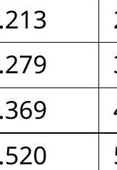 | 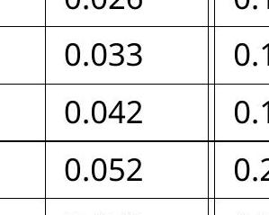 |

" " -
"

| 2 |  | " | " |
| :--- | :--- | :--- | :--- |
| * | (awany anow ano. | S | $\frac { 25 } { 29 }$ |

" " нок нат

| 2 ock | Soask of |  |  |
| :--- | :--- | :--- | :--- |
| * | S | 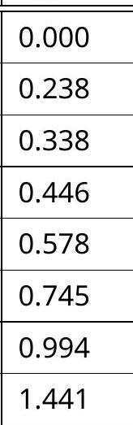 | 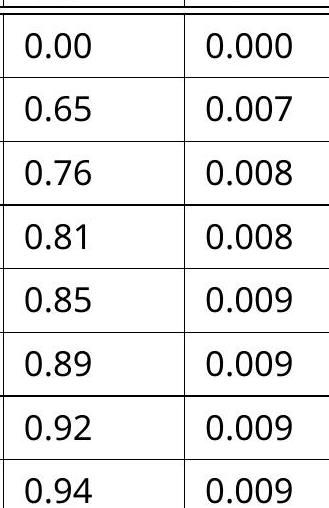 |

" "

- " "

| 2 | aco | occ | aw |
| :--- | :--- | :--- | :--- |
| Y \% lless assus | " | " | 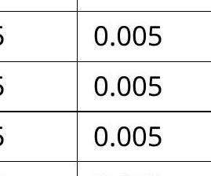 |
| * 228 | 268 | 2000 | ocs |

"

| ${ } ^ { 2 }$ occur | Soxts |  |  |
| :--- | :--- | :--- | :--- |
| * | فت. | Some of | aum |

B. 5
B. 5 Output curves:
0.5pt
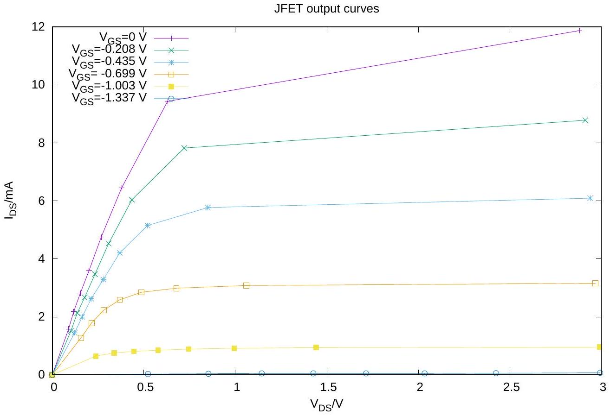
B. 6

The $R _ { \mathrm { DS } }$ values are obtained from the slopes of the linear region of the output curves (small $V _ { \mathrm { DS } }$ voltages). The last point in the plot $R _ { \mathrm { DS } } \left( V _ { \mathrm { GS } } \right)$ has a large error bars as we are missing points in the linear regime, and will be ignored.

The solid line in the plot is the result of a fit to $R _ { \mathrm { DS } } = R _ { \mathrm { DS } } ^ { 0 } \left( 1 - V _ { \mathrm { GS } } / V _ { \mathrm { P } } \right)$, that gave $R _ { \mathrm { DS } } ^ { 0 } = 52 ( 2 ) \Omega , V _ { \mathrm { P } } =$ -1.18(1) V.

| B. 6 | $V _ { \mathrm { GS } } / \mathrm { V }$ $R _ { \mathrm { DS } } / \Omega$   0 $56.5 \pm 2$   -0.208 $67.4 \pm 2$   -0.435 $84.1 \pm 4$   -0.699 $122.84 \pm 4$   -1.003 $366.6 \pm 4$   -1.337 $1111 \pm 100$   JFET $\mathrm { R } _ { \mathrm { DS } }$ vs. $\mathrm { V } _ { \mathrm { GS } }$ |
| :--- | :--- |

## B. 7

The data was obtained with $V _ { \mathrm { DS } } = + 3 \mathrm {~V}$. The solid line is the result of the fit to the data of the function

$$
I _ { \mathrm { DS } } = I _ { \mathrm { DSS } } \left( 1 - V _ { \mathrm { GS } } / V _ { \mathrm { P } } \right) ^ { 2 } .
$$

The fitted parameters are $I _ { \text {DSS } } = 11.89 \pm 0.06 \mathrm {~mA}$ and $V _ { \mathrm { P } } = - 1.42 \pm 0.02 \mathrm {~V}$.
B. 7 0.3pt
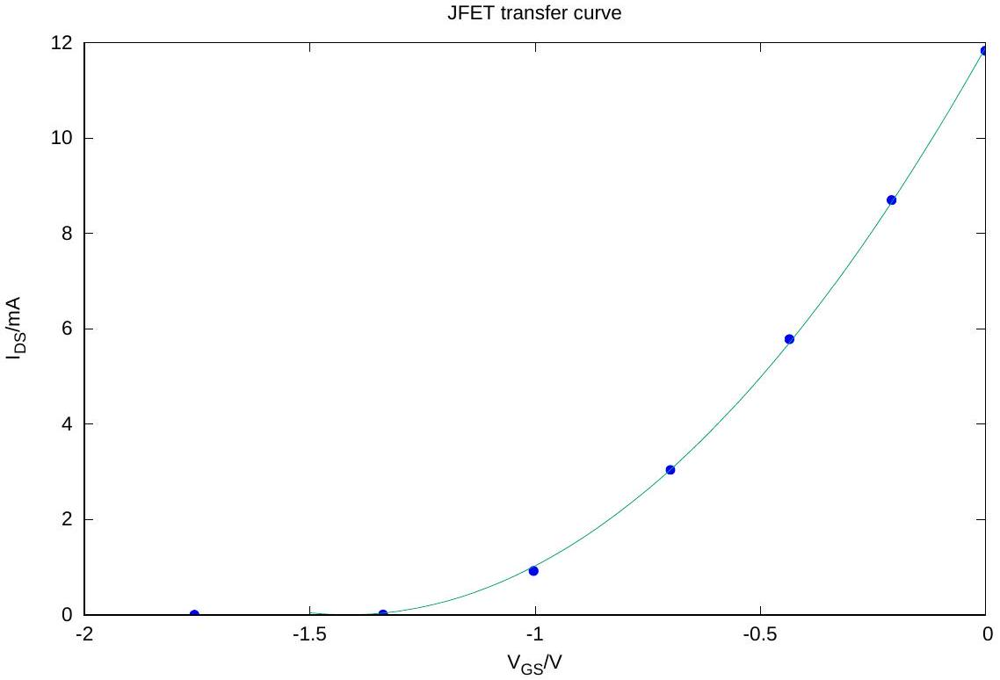

## B. 8

From

$$
I _ { \mathrm { DS } } = I _ { \mathrm { DSS } } \left( 1 - V _ { \mathrm { GS } } / V _ { \mathrm { P } } \right) ^ { 2 }
$$

a plot of $\sqrt { I _ { \mathrm { DS } } }$ as function of $V _ { \mathrm { GS } }$ should yield a straight line with slope $a = - \sqrt { I _ { \mathrm { DS } } } / V _ { \mathrm { P } }$ that intercepts the $x$-axis at $V _ { \mathrm { P } }$.

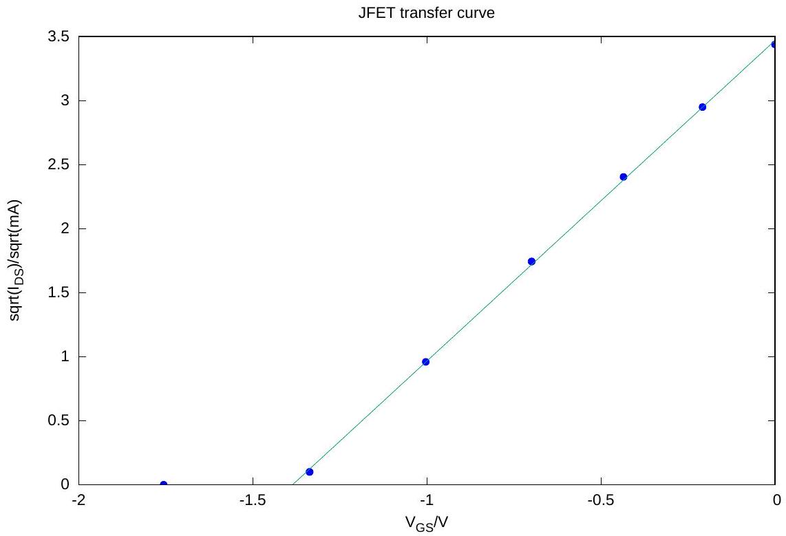

A linear fit to $f x ) = a x + b$ gave $a = 2.50 ( 2 )$ and $b = 3.47 ( 2 )$. Thus, $V _ { \mathrm { P } } = - b / a = - 1.39 ( 2 ) \mathrm { V }$ and $I _ { \mathrm { DSS } } =$ $4.23 ^ { 2 } = 12.0 ( 2 ) \mathrm { mA }$.

B. 8
$$
\begin{aligned}
& V _ { \mathrm { P } } = - b / a = - 1.39 ( 2 ) \mathrm { V } \\
& I _ { \mathrm { DSS } } = 4.23 ^ { 2 } = 12.0 ( 2 ) \mathrm { mA } .
\end{aligned}
$$

## B. 9

The transcondutance is the slope of the transfer curve at a given point. From the transfer plot, we draw the tangent at the point with abscissa -0.50 V and read the slope from the graph, obtaining $g =$ $10.8 ( 1 ) \mathrm { m } ^ { - 1 }$.

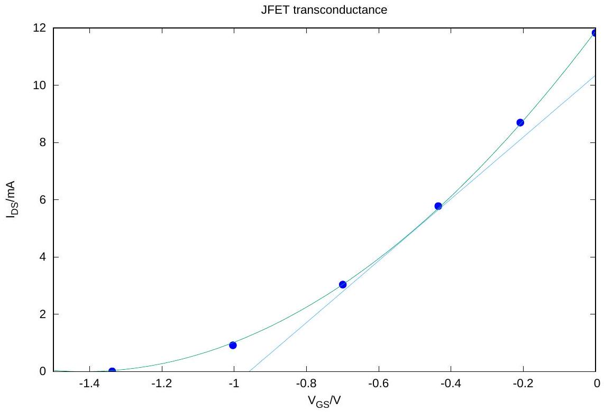

From

$$
\begin{gathered}
I _ { \mathrm { D } } = I _ { \mathrm { DSS } } \left( 1 - V _ { \mathrm { GS } } / V _ { \mathrm { P } } \right) ^ { 2 } , \\
g = \frac { \partial I _ { \mathrm { DS } } } { \partial V _ { \mathrm { GS } } } = 2 I _ { \mathrm { DSS } } \left( 1 - V _ { \mathrm { GS } } / V _ { \mathrm { P } } \right) \left( - \frac { 1 } { V _ { \mathrm { P } } } \right) = \frac { 2 I _ { \mathrm { DSS } } } { V _ { \mathrm { P } } } \left( V _ { \mathrm { GS } } / V _ { \mathrm { P } } - 1 \right) .
\end{gathered}
$$

Substituting values,

$$
g = 10.8 \mathrm {~m} ^ { - 1 }
$$

a value that agrees with that obtained using the graphical method.
B. $9 g _ { \text {measured } } = 10.8 ( 1 ) \mathrm { m } ^ { - 1 }$

$$
g _ { \text {model } } = 10.8 \mathrm {~m} ^ { - 1 }
$$

C. 1

| C. 1 |  |  |  |  | 0.8pt |
| :--- | :--- | :--- | :--- | :--- | :--- |
|  | t/s | $I _ { \mathrm { DS } } / \mu \mathrm { A }$ | t/s | $I _ { \text {DS } } / \mu \mathrm { A }$ |  |
|  | 0 | 0 | 110 | 112,0 |  |
|  | 10 | 6.6 | 120 | 116.2 |  |
|  | 20 | 25.8 | 180 | 137.7 |  |
|  | 30 | 50.1 | 240 | 155.4 |  |
|  | 40 | 66.2 | 300 | 171.2 |  |
|  | 50 | 76.7 | 360 | 184.4 |  |
|  | 60 | 83.8 | 420 | 197.9 |  |
|  | 70 | 91.6 | 480 | 209.2 |  |
|  | 80 | 97.2 | 540 | 219.1 |  |
|  | 90 | 102.6 | 600 | 220.0 |  |
|  | 100 | 107.4 | - | - |  |

C. 2

The data is similar to that of the charge of a capacitor, superimposed with an almost linear component that corresponds to the charge of the second capacitor with a larger time constant.

A least squares fit to a $A \left( 1 - \exp \left( - t / \tau _ { 1 } \right) \right) + B \left( 1 - \exp \left( - t / \tau _ { 2 } \right) \right)$ is also depicted, showing that the data can be well fitted by this model. The shorter time constant is $\tau _ { 1 } = 43 ( 8 ) \mathrm { s }$, the longer time constant, $\tau _ { 2 }$ is roughly 20 times larger.

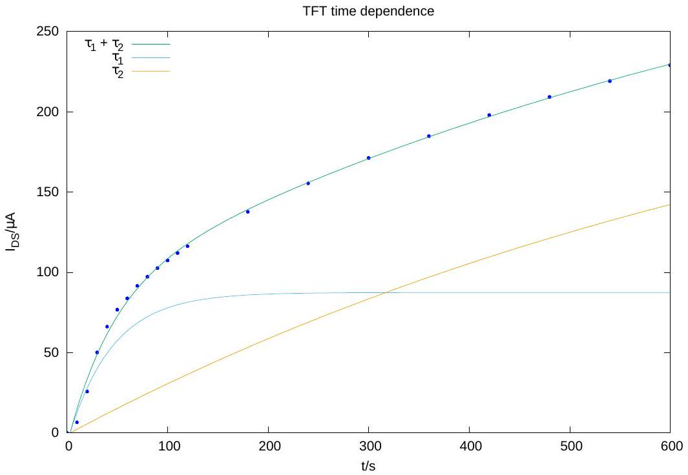

Let $I _ { \mathrm { DS } } ^ { \text {sub } } = A \left( 1 - \exp \left( - t / \tau _ { 1 } \right) \right)$ be the data subtracted from the long time constant component. A logarithmic plot of $\log \left( A - I _ { \text {DS } } ^ { \text {sub } } \right)$ should be a straight line of slope $- 1 / \tau _ { 1 }$. The constant $A$, the saturation current of the short $\tau _ { 1 }$ component, can be easily estimated from the above plot.

The slope of the line is $m = - 0.023 ( 1 )$, from which we get $\tau _ { 1 } = 44 ( 3 ) \mathrm { s }$. The error bar is underestimated, as it does not take into account the error in the subtraction of the $\tau _ { 2 }$ component.

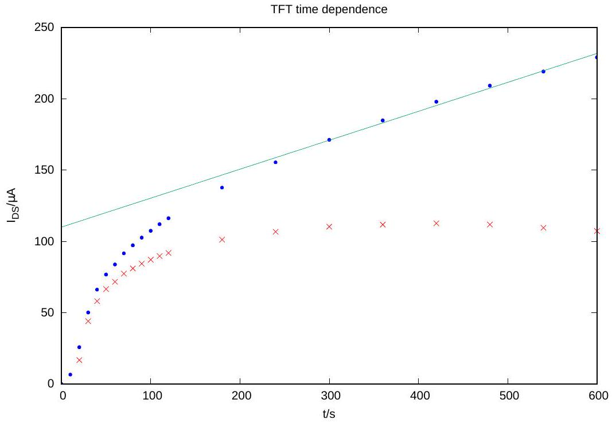
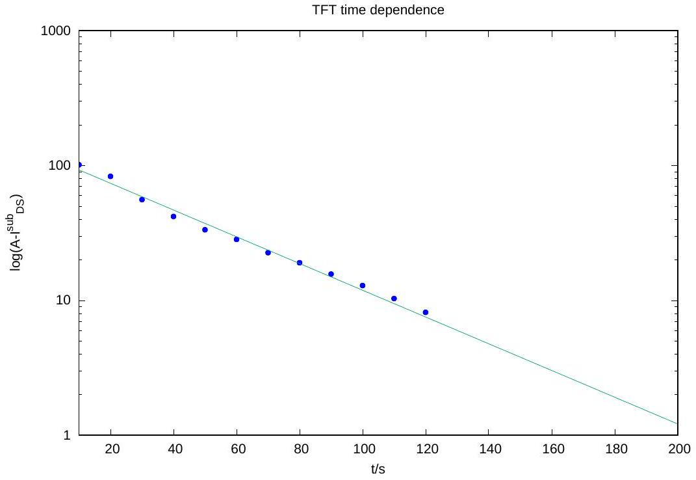

$$
\tau _ { 1 } = 44 ( 3 ) \mathrm { s } .
$$

Graphamanonana
D. 1
D. $1 R _ { \mathrm { L } } = 198 \mathrm { k } \Omega$ 0.5pt

| $t$ | $V _ { \text {in } } / \mathrm { V }$ | $V _ { \text {out } } / \mathrm { V }$ |
| :--- | :--- | :--- |
|  | -2.983 | 2.456 |
|  | -2.760 | 2.470 |
|  | -2.567 | 2.461 |
|  | -2.340 | 2.461 |
|  | -2.058 | 2.460 |
|  | -1.719 | 2.252 |
|  | -1.330 | 0.889 |
|  | -0.775 | 0.039 |

D. 2
D. 2 0.5pt
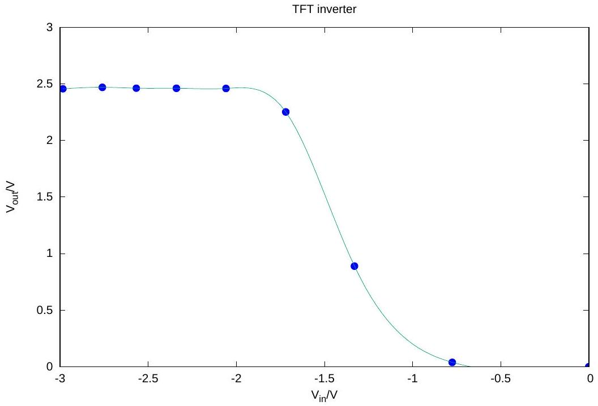
