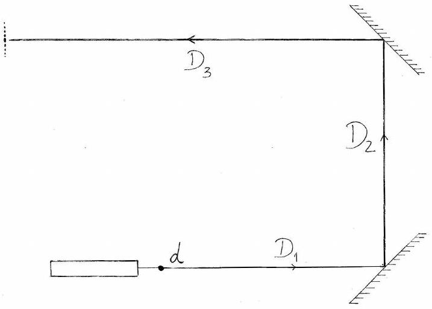
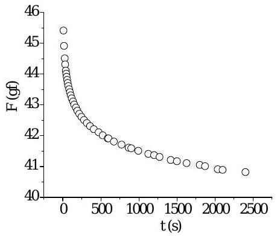
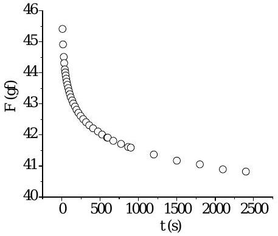
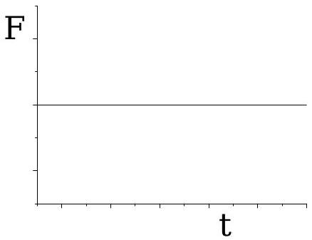
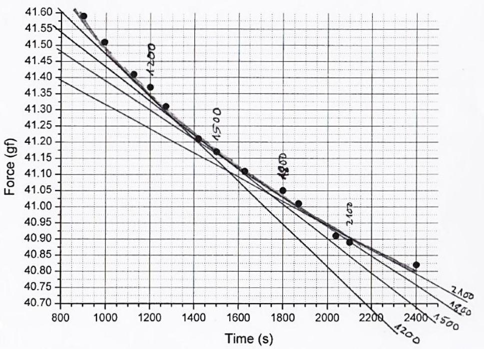
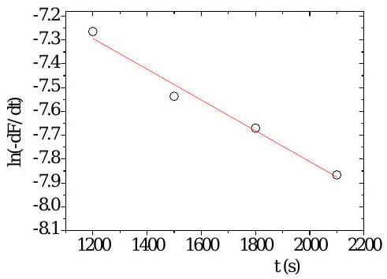
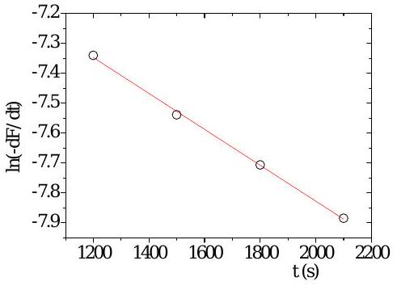
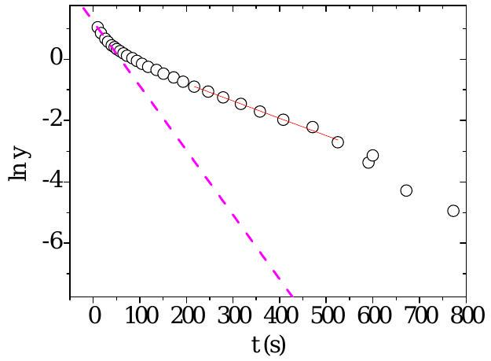

## Solutions to Experimental Problem 2

# Viscoelasticity of a polymer thread

(J. M. Gil, J. Pinto da Cunha, R. C. Vilão, H. V. Alberto)

July 22, 2018
v1.1

## Problem 2: Viscoelasticity of a polymer thread (10 points)

Part A. Stress-relaxation measurements (1.9 points)
A. 1

Measurement: $\ell _ { 0 } = 42.7 + 2 \times 0.5 = 43.7 \mathrm {~cm}$,

A. 1 0.3pt
$$
\ell _ { 0 } = ( 43.7 \pm 0.2 ) \mathrm { cm } .
$$

A. 2

A. 2 0.3pt
$$
P _ { 0 } = ( 81.11 \pm 0.03 ) \mathrm { gf } .
$$

A. 3

The table contains the readings on the scale $P$ (Question A.3) and the force on the thread, $F ( t )$, at constant strain (Question D.1). The values of $\frac { \mathrm { d } F } { \mathrm {~d} t }$ (Question D.6) were computed numerically using equal time intervals. The function $y ( t )$ is given by $y ( t ) = F ( t ) - F _ { 0 } - F _ { 1 } \mathrm { e } ^ { - t / \tau _ { 1 } }$ (Question D.10).

A.3

| $t / \mathrm { s }$ | $P ( t ) / \mathrm { gf }$ | $F / \mathrm { gf }$ | $\frac { \mathrm { d } F } { \mathrm {~d} t } / \mathrm { gf } \mathrm { s } ^ { - 1 }$ | $y ( t ) / \mathrm { gf }$ |
| :--- | :--- | :--- | :--- | :--- |
| 10 | 35.7 | 45.41 |  | 2.82 |
| 17 | 36.2 | 44.91 |  | 2.33 |
| 26 | 36.6 | 44.51 |  | 1.95 |
| 32 | 36.8 | 44.31 |  | 1.76 |
| 40 | 37.0 | 44.11 |  | 1.57 |
| 46 | 37.1 | 44.01 |  | 1.48 |
| 51 | 37.2 | 43.91 |  | 1.38 |
| 58 | 37.3 | 43.81 |  | 1.29 |
| 65 | 37.4 | 43.71 |  | 1.20 |

1.0pt

| . 3 |  | ${ } _ { 37.5 } ^ { P ( t ) / 9 }$ | $F / 9$ 43.6 | der /gf ${ } ^ { \mathrm { d } }$ | ${ } _ { 1.12 } ^ { y ( t ) / 9 \mathrm { f } }$ | " |
| :--- | :--- | :--- | :--- | :--- | :--- | :--- |
| 84   1628   1800   1869   2037   2037   2100 |  | 37.5 | ${ } ^ { 43,61 }$ |  | 0.94 |  |
|  |  | 37.8 | 43.31 |  | 0.77 |  |
|  |  | 38.0 | ${ } _ { 43.01 } ^ { 43.11 }$ |  |  |  |
|  |  | 38.3 | ${ } _ { 422.81 }$ |  | 0.55 |  |
|  |  | ${ } _ { 38.6 } ^ { 38.5 }$ | ${ } _ { 42.51 } ^ { 42.61 }$ |  | 0.35 0.29 |  |
|  |  | ${ } _ { 38 } ^ { 38 }$ | ${ } _ { 42.21 } ^ { 42.31 }$ |  |  |  |
|  |  | ${ } _ { 39.2 } ^ { 39.1 }$ | ${ } _ { 41.91 } ^ { 42.01 }$ |  | 0.07 |  |
|  |  | ${ } _ { 39.4 } ^ { 39.3 }$ | ${ } _ { 41.81 } ^ { 41.91 }$ |  | ${ } _ { 0.01 } ^ { 0.04 }$ |  |
|  |  | 39.7 | ${ } _ { 41.41 } ^ { 41.51 }$ |  |  |  |
|  |  |  |  |  | $- 0.0 \times 10 ^ { - 4 }$ |  |
|  |  | 39.8 39.9 39.94 |  |  |  |  |
|  |  | ${ } ^ { 40.0 }$ |  | [ | 0×10 |  |
|  |  | ${ } _ { 40.2 } ^ { 40.1 }$ | ${ } _ { 40.91 } ^ { 40.99 }$ |  | $3.38 \times 10 ^ { - 4 }$ |  |
|  |  |  |  |  |  |  |

A. 4

Measurement: $\ell = 50.0 + 2 \times 0.5 = 51.0 \mathrm {~cm}$,

A. 4
$$
\ell = ( 51.0 \pm 0.2 ) \mathrm { cm } .
$$

0.3pt

Part B. Measurement of the streched thread diameter (1.5 points)

B. 1
Two mirrors are used to maximize the distance D and consequently the distance between diffraction minima.
B. 1 Sketch of the method
0.6pt

B. 2
The total distance $D$ is the sum
$$
D = D _ { 1 } + D _ { 2 } + D _ { 3 } = ( 26.0 + 36.0 + 102.3 ) \mathrm { cm } = 164.3 \mathrm {~cm} = 1.643 \mathrm {~m} .
$$
The estimated uncertainties are
$$
\sigma _ { D _ { 1 } } = \sigma _ { D _ { 2 } } = \sigma _ { D _ { 3 } } \approx 0.5 \mathrm {~cm} \Rightarrow \sigma _ { D } = \sqrt { 3 \times \sigma _ { D _ { 1 } } ^ { 2 } } = 0.5 \times \sqrt { 3 } = 0.87 \mathrm {~cm} .
$$
B. 2
0.3pt
$$
D = ( 1.643 \pm 0.009 ) \mathrm { m } .
$$

B. 3

The distance between minima, $x$, is quite small. To reduce the error, the total distance $N x$, with $N = 22$, was measured:

$$
22 x = 49 \mathrm {~mm} \Rightarrow \bar { x } = 2.227 \mathrm {~mm} .
$$

The corresponding uncertainty is

$$
\sigma _ { \bar { x } } = \frac { \sigma _ { 22 x } } { 22 } = \frac { 0.25 \mathrm {~mm} } { 22 } = 0.011 \mathrm {~mm} .
$$

B. 3
0.3pt

$$
\bar { x } = ( 2.227 \pm 0.011 ) \mathrm { mm } .
$$

B. 4

Using previous results, we get

$$
d = \frac { \lambda } { \sin \theta } \simeq \frac { \lambda D } { \bar { x } } = \frac { 650 \times 10 ^ { - 9 } \mathrm {~m} \times 1.643 \mathrm {~m} } { 2.227 \times 10 ^ { - 3 } \mathrm {~m} } = 4.795 \times 10 ^ { - 4 } \mathrm {~m} = 0.480 \mathrm {~mm} .
$$

For the uncertainties, we have

$$
\frac { \sigma _ { d } } { d } = \frac { \sigma _ { \lambda } } { \lambda } + \frac { \sigma _ { D } } { D } + \frac { \sigma _ { \bar { x } } } { \bar { x } } = \frac { 10 } { 650 } + \frac { 0.0087 } { 1.643 } + \frac { 0.011 } { 2.227 } = 0.02517 \Rightarrow \sigma _ { d } = 0.02517 \times 0.480 \mathrm {~mm} = 0.012 \mathrm {~mm} .
$$

B. 4
0.3pt

$$
d = ( 0.480 \pm 0.012 ) \mathrm { mm } .
$$

Part C. Change to a new thread (0.3 points)
C. 1

Measurement: $\ell _ { 0 } ^ { \prime } = 31.6 + 2 \times 0.5 = 32.6 \mathrm {~cm}$.
C. 1
0.3pt

$$
\ell _ { 0 } ^ { \prime } = ( 32.6 \pm 0.2 ) \mathrm { cm } .
$$

Part D. Data Analysis (5.7 points)
D. 1

The force on the thread was calculated as $F ( t ) = \left( P _ { 0 } - P ( t ) \right)$, in gram-force units.
D. 1 See column $F ( t )$ in the table in A.3. 0.3pt
D. 2
D. 2

0.4pt

Left: $F ( t )$ sampled at unequal time intervals. Right: $F ( t )$ sampled at equal time intervals for $t > 1000 \mathrm {~s}$.
D. 3

The dimensionless quantity $\epsilon$ is given by

$$
\epsilon = \frac { \ell - \ell _ { 0 } } { \ell _ { 0 } } = \frac { 51.0 - 43.7 } { 43.7 } = 0.167 .
$$

The uncertainty in $\epsilon , \sigma _ { \epsilon }$, is calculated propagating the uncertainties in the measured length, $\sigma _ { \ell }$ and $\sigma _ { \ell _ { 0 } }$ :

$$
\begin{aligned}
\frac { \sigma _ { \epsilon } } { \epsilon } & = \frac { \sigma _ { \left( \ell - \ell _ { 0 } \right) } } { \ell - \ell _ { 0 } } + \frac { \sigma _ { \ell _ { 0 } } } { \ell _ { 0 } } \\
& = \frac { \sqrt { \sigma _ { \ell } ^ { 2 } + \sigma _ { \ell _ { 0 } } ^ { 2 } } } { \ell - \ell _ { 0 } } + \frac { \sigma _ { \ell _ { 0 } } } { \ell _ { 0 } } \\
& = \frac { 0.2 \times \sqrt { 2 } } { 7.3 } + \frac { 0.2 } { 43.7 } \\
& = 0.0433
\end{aligned}
$$

Therefore, $\sigma _ { \epsilon } = 0.0433 \times 0.167 = 0.0072$.
D. 3 0.3pt

$$
\epsilon = 0.167 \pm 0.007 .
$$

D. 4

One has

$$
\frac { \sigma } { \epsilon } = \frac { F } { \epsilon S } .
$$

In this case, $S = \pi ( d / 2 ) ^ { 2 } = 1.809 \times 10 ^ { - 7 } \mathrm {~m} ^ { 2 }$ and $\epsilon = 0.167$. We also have $1 \mathrm { gf } = g \times 10 ^ { - 3 } \mathrm {~N}$ with $g = 9.8 \mathrm {~m} \mathrm {~s} ^ { - 2 }$. Therefore, if $F$ is in gram-force units we have

$$
\frac { \sigma } { \epsilon } = \frac { 9.8 \times 10 ^ { - 3 } \mathrm { gf } ^ { - 1 } \mathrm {~N} } { 0.167 \times 1.809 \times 10 ^ { - 7 } \mathrm {~m} ^ { 2 } } F = \left( 324293 \mathrm { gf } ^ { - 1 } \mathrm { Nm } ^ { - 2 } \right) \quad F ,
$$

where $F$ is in gf , and $\sigma$ is in $\mathrm { N } \mathrm { m } ^ { - 2 }$. Comparing with $\frac { \sigma } { \epsilon } = \beta F$ we get

$$
\beta = 324293 \mathrm { gf } ^ { - 1 } \mathrm { Nm } ^ { - 2 } .
$$

Note that, if we write

$$
\begin{equation*}
F ( t ) = F _ { 0 } + F _ { 1 } \mathrm { e } ^ { - t / \tau _ { 1 } } + F _ { 2 } \mathrm { e } ^ { - t / \tau _ { 2 } } + F _ { 3 } \mathrm { e } ^ { - t / \tau _ { 3 } } + \cdots \tag{1}
\end{equation*}
$$

and compare with equation

$$
\begin{equation*}
\frac { \sigma } { \epsilon } = \beta F ( t ) = E _ { 0 } + E _ { 1 } \mathrm { e } ^ { - t / \tau _ { 1 } } + E _ { 2 } \mathrm { e } ^ { - t / \tau _ { 2 } } + E _ { 3 } \mathrm { e } ^ { - t / \tau _ { 3 } } + \cdots \tag{2}
\end{equation*}
$$

we conclude that $E _ { 0 } = \beta F _ { 0 } , E _ { 1 } = \beta F _ { 1 } , E _ { 2 } = \beta F _ { 2 }$, etc.
D. 4
0.3pt

$$
\beta = 3.24 \times 10 ^ { 5 } \mathrm { gf } ^ { - 1 } \mathrm {~N} \mathrm {~m} ^ { - 2 } .
$$

D. 5

For a purely elastic process, $\sigma = \epsilon E _ { 0 }$ and

$$
F = \alpha \sigma = \alpha \epsilon E _ { 0 } .
$$

Thus, a graph of a constant function is expected.
D. 5

0.4pt

D. 6

The data for $\frac { \mathrm { d } F } { \mathrm {~d} t }$ inserted in table introduced in A.3, was computed numerically for equal time intervals. However, the graphical method is also exemplified. In the present graph, tangent lines to $F ( t )$ are drawn at four different time instants (1200,1500,1800 and 2100 s). The slopes of those lines are a measure of $\frac { \mathrm { d } F } { \mathrm {~d} t }$ at those instants.

D. 6 See in the table used in A.3, the column with $\frac { \mathrm { d } F } { \mathrm {~d} t }$. 0.5pt
This graph is present only if a graphical method is used.

D. 7

For a single viscoelastic process,

$$
F = \frac { 1 } { \beta } \left( E _ { 0 } + E _ { 1 } \mathrm { e } ^ { - t / \tau _ { 1 } } \right) = F _ { 0 } + F _ { 1 } \mathrm { e } ^ { - t / \tau _ { 1 } }
$$

Therefore,

D. 7
$$
\frac { \mathrm { d } F } { \mathrm {~d} t } = - \frac { F _ { 1 } } { \tau _ { 1 } } \mathrm { e } ^ { - t / \tau _ { 1 } } , \quad \text { where } \quad F _ { 1 } = \frac { E _ { 1 } } { \beta } .
$$
0.3pt

D. 8

The linearisation of the expression of $\mathrm { d } F / \mathrm { d } t$ is accomplished using logarithms:

$$
\ln \left( - \frac { \mathrm { d } F } { \mathrm {~d} t } \right) = \ln \left( \frac { F _ { 1 } } { \tau _ { 1 } } \right) - \frac { 1 } { \tau _ { 1 } } t .
$$

 □
GAÓ十⿱一⿴囗⿱一一 ன حي
GAOZHONGSHUXUXUE ＂
прадатикановатичногонаном

$$
\sec
$$

ன்ன்றோன் வின்போதலை
＂

$$
\sec
$$

Left：$\frac { \mathrm { d } F } { \mathrm {~d} t }$ computed numerically using equal time intervals．
Right：using data from the graph in D．6．

D． 9

For the 4 points on the left graph in D．8，we can write

$$
F ( t ) = F _ { 0 } + F _ { 1 } \mathrm { e } ^ { - t / \tau _ { 1 } } \Rightarrow F _ { 0 } = F ( t ) - F _ { 1 } \mathrm { e } ^ { - t / \tau _ { 1 } }
$$

Thus，averaging $F _ { 0 }$ for the 4 points of the left graph in D．8：

$$
F _ { 0 } = \left( \frac { 40.32 + 40.31 + 40.34 + 40.30 } { 4 } \right) = 40.32 \mathrm { gf }
$$

Finally，

$$
E _ { 0 } = \beta F _ { 0 } = 324293 \times 40.32 \mathrm { Nm } ^ { - 2 } .
$$

D． 9

$$
E _ { 0 } = 1.31 \times 10 ^ { 7 } \mathrm { Nm } ^ { - 2 } .
$$

D. 10

The function $y ( t )$ is given by

$$
y ( t ) = F ( t ) - F _ { 0 } - F _ { 1 } \mathrm { e } ^ { - t / \tau _ { 1 } }
$$

and was added in the Table introduced in A. 3 using $F _ { 0 } = 40.32 \mathrm { gf } , F _ { 1 } = 2.28 \mathrm { gf }$ and $\tau _ { 1 } = 1546 \mathrm {~s}$.
D. 10 See column $y ( t )$ in the Table in A.3.
0.3pt
D. 11

Since

$$
y ( t ) = F ( t ) - F _ { 0 } - F _ { 1 } \mathrm { e } ^ { - t / \tau _ { 1 } } ,
$$

then

$$
y ( t ) = F _ { 2 } \mathrm { e } ^ { - t / \tau _ { 2 } } + F _ { 3 } \mathrm { e } ^ { - t / \tau _ { 3 } } + \cdots \quad , \quad \tau _ { 2 } > \tau _ { 3 } > \cdots
$$

At long times, when the contributions from the higher components are small enough, we expect a linear behaviour for $\ln y ( t )$ :

$$
\ln y = \ln F _ { 2 } - \frac { 1 } { \tau _ { 2 } } t .
$$

In this case, the $y ( t )$ data points become meaningless above 500 s. In the region 200-500 s the graph is linear and that region can be used to extract the parameters of the second component. The equation of the straight line is $\ln y _ { 2 } = b _ { 2 } + m _ { 2 } t$. From the graph below,

$$
\begin{gathered}
m _ { 2 } = - ( 5.65 \pm 0.19 ) \times 10 ^ { - 3 } \Rightarrow \tau _ { 2 } = \frac { 1 } { - m _ { 2 } } = 177 \mathrm {~s} \\
b _ { 2 } = 0.33 \pm 0.07 \Rightarrow F _ { 2 } = \mathrm { e } ^ { b _ { 2 } } = 1.39 \Rightarrow E _ { 2 } = \beta F _ { 2 } = 4.5 \times 10 ^ { 5 } \mathrm { Nm } ^ { - 2 } .
\end{gathered}
$$

D. 11

$$
E _ { 2 } = 4.5 \times 10 ^ { 5 } \mathrm { Nm } ^ { - 2 } , \quad \tau _ { 2 } = 177 \mathrm {~s} .
$$

The best straight line in the range 200-500 s yield the parameters $\tau _ { 2 }$ and $E _ { 2 }$ (Question D.11). The slope of the best straight line in the range [10, 30] s give an estimate of $\tau _ { 3 }$ (Questions D. 12 and D.13).

D. 12

Below around 30 s there is clear deviation from a linear behaviour indicating the presence of a third component. In our case, the first data point was acquired at $t = 10 \mathrm {~s}$.
D. 12 (0.3 pt)

$$
t _ { i } = 10 \mathrm {~s} \quad , \quad t _ { f } = 30 \mathrm {~s}
$$

D. 13

Drawing a line in the graph using the first data points (in the range defined in D.12), as shown in the graph in D.11, $\tau _ { 3 }$ can be estimated as:

$$
m _ { 3 } = - 0.02 \Rightarrow \tau _ { 3 } \approx m _ { 3 } ^ { - 1 }
$$

D. 13 0.3pt

Part E. Measuring $E$ in constant stress conditions ( 0.6 points)
E. 1

From Question C. 1 we have

$$
\ell _ { 0 } ^ { \prime } = ( 32.60 \pm 0.2 ) \mathrm { cm } .
$$

The final length $\ell ^ { \prime }$ should be measured. In our case,

$$
\ell ^ { \prime } = 42.2 + 2 \times 0.5 = 43.2 \mathrm {~cm} \Rightarrow \ell ^ { \prime } = ( 43.2 \pm 0.2 ) \mathrm { cm } .
$$

Therefore, the strain is

$$
\epsilon = \frac { \ell ^ { \prime } - \ell _ { 0 } ^ { \prime } } { \ell _ { 0 } ^ { \prime } } = 0.325 .
$$

Given that

$$
E = \frac { \sigma } { \epsilon } = \frac { \frac { M g } { \pi R ^ { 2 } } } { \epsilon } = \frac { 80.2 \times 10 ^ { - 3 } \times 9.8 } { \pi \times \left( 0.24 \times 10 ^ { - 3 } \right) ^ { 2 } \times 0.325 } = 1.337 \times 10 ^ { 7 } \mathrm { Nm } ^ { - 2 } .
$$

Note that the radius $R$ of the stretched thread was not measured. We used the value measured in task B.4: $R \approx 0.24 \times 10 ^ { - 3 } \mathrm {~m}$.

＂
＂
位法拜谨
