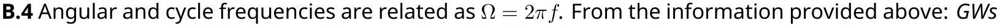
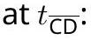

## IPh0 2018   Lisbon, Postugal

## Solutions to Theory Problem 1

LIGO-GW150914
(V. Cardoso, C. Herdeiro)

July 15, 2018
v6.0

## GW150914 (10 points)

Part A. Newtonian (conservative) orbits (3.0 points)
A. 1 Apply Newton's law to mass $M _ { 1 }$ :

$$
\begin{equation*}
M _ { 1 } \frac { \mathrm {~d} ^ { 2 } \vec { r } _ { 1 } } { \mathrm {~d} t ^ { 2 } } = G \frac { M _ { 1 } M _ { 2 } } { \left| \vec { r } _ { 2 } - \vec { r } _ { 1 } \right| ^ { 2 } } \frac { \vec { r } _ { 2 } - \vec { r } _ { 1 } } { \left| \vec { r } _ { 2 } - \vec { r } _ { 1 } \right| } . \tag{1}
\end{equation*}
$$

Use, from eq. (1) of the question sheet

$$
\begin{equation*}
\vec { r } _ { 2 } = - \frac { M _ { 1 } } { M _ { 2 } } \vec { r } _ { 1 } , \tag{2}
\end{equation*}
$$

in eq. (1) above, to obtain

$$
\begin{equation*}
\frac { \mathrm { d } ^ { 2 } \vec { r } _ { 1 } } { \mathrm {~d} t ^ { 2 } } = - \frac { G M _ { 2 } ^ { 3 } } { \left( M _ { 1 } + M _ { 2 } \right) ^ { 2 } r _ { 1 } ^ { 2 } } \frac { \vec { r } _ { 1 } } { r _ { 1 } } . \tag{3}
\end{equation*}
$$

A. 1
1.0pt

$$
n = 3 , \quad \alpha = \frac { G M _ { 2 } ^ { 3 } } { \left( M _ { 1 } + M _ { 2 } \right) ^ { 2 } } .
$$

A. 2 The total energy of the system is the sum of the two kinetic energies plus the gravitational potential energy. For circular motions, the linear velocity of each of the masses reads

$$
\begin{equation*}
\left| \vec { v } _ { 1 } \right| = r _ { 1 } \Omega , \quad \left| \vec { v } _ { 2 } \right| = r _ { 2 } \Omega , \tag{4}
\end{equation*}
$$

Thus, the total energy is

$$
\begin{equation*}
E = \frac { 1 } { 2 } \left( M _ { 1 } r _ { 1 } ^ { 2 } + M _ { 2 } r _ { 2 } ^ { 2 } \right) \Omega ^ { 2 } - \frac { G M _ { 1 } M _ { 2 } } { L } , \tag{5}
\end{equation*}
$$

Now,

$$
\begin{equation*}
\left( M _ { 1 } r _ { 1 } - M _ { 2 } r _ { 2 } \right) ^ { 2 } = 0 \quad \Rightarrow \quad M _ { 1 } r _ { 1 } ^ { 2 } + M _ { 2 } r _ { 2 } ^ { 2 } = \mu L ^ { 2 } \tag{6}
\end{equation*}
$$

Thus,

$$
\begin{equation*}
E = \frac { 1 } { 2 } \mu L ^ { 2 } \Omega ^ { 2 } - G \frac { M \mu } { L } . \tag{7}
\end{equation*}
$$

A. 2
1.0pt
A. 3 Energy (3) of the question sheet can be interpreted as describing a system of a mass $\mu$ in a circular orbit with angular velocity $\Omega$, radius $L$, around a mass $M$ (at rest). Equating the gravitational acceleration to the centripetal acceleration:

$$
\begin{equation*}
G \frac { M } { L ^ { 2 } } = \Omega ^ { 2 } L . \tag{8}
\end{equation*}
$$

This is indeed Kepler's third law (for circular orbits). Then, from (7),

$$
\begin{equation*}
E = - \frac { 1 } { 2 } G \frac { M \mu } { L } . \tag{9}
\end{equation*}
$$

A. 3

## Part B - Introducing relativistic dissipation (7.0 points)

B. 1 Some simple trigonometry for the $x , y$ motion of the masses (in an appropriate Cartesian system) yields:

$$
\begin{equation*}
\left( x _ { 1 } , y _ { 1 } \right) = r _ { 1 } ( \cos ( \Omega t ) , \sin ( \Omega t ) ) , \quad \left( x _ { 2 } , y _ { 2 } \right) = - r _ { 2 } ( \cos ( \Omega t ) , \sin ( \Omega t ) ) . \tag{10}
\end{equation*}
$$

Then,

$$
Q _ { i j } = \frac { M _ { 1 } r _ { 1 } ^ { 2 } + M _ { 2 } r _ { 2 } ^ { 2 } } { 2 } \left( \begin{array} { c c c }
\frac { 4 } { 3 } \cos ^ { 2 } ( \Omega t ) - \frac { 2 } { 3 } \sin ^ { 2 } ( \Omega t ) & 2 \sin ( \Omega t ) \cos ( \Omega t ) & 0  \tag{11}\\
2 \sin ( \Omega t ) \cos ( \Omega t ) & \frac { 4 } { 3 } \sin ^ { 2 } ( \Omega t ) - \frac { 2 } { 3 } \cos ^ { 2 } ( \Omega t ) & 0 \\
0 & 0 & - \frac { 2 } { 3 }
\end{array} \right) ,
$$

or, using some simple trigonometry and (6),

$$
Q _ { i j } = \frac { \mu L ^ { 2 } } { 2 } \left( \begin{array} { c c c }
\frac { 1 } { 3 } + \cos 2 \Omega t & \sin 2 \Omega t & 0  \tag{12}\\
\sin 2 \Omega t & \frac { 1 } { 3 } - \cos 2 \Omega t & 0 \\
0 & 0 & - \frac { 2 } { 3 }
\end{array} \right) .
$$

B. 1 1.0pt

$$
k = 2 \Omega , \quad a _ { 1 } = a _ { 2 } = \frac { 1 } { 3 } , a _ { 3 } = - \frac { 2 } { 3 } , \quad b _ { 1 } = 1 , b _ { 2 } = - 1 , b _ { 3 } = 0 , c _ { 12 } = c _ { 21 } = 1 , c _ { i j } \stackrel { \text { otherwise } } { = } 0 .
$$

B. 2 First take the derivatives:

$$
\frac { \mathrm { d } ^ { 3 } Q _ { i j } } { \mathrm {~d} t ^ { 3 } } = 4 \Omega ^ { 3 } \mu L ^ { 2 } \left( \begin{array} { c c c }
\sin 2 \Omega t & - \cos 2 \Omega t & 0  \tag{13}\\
- \cos 2 \Omega t & - \sin 2 \Omega t & 0 \\
0 & 0 & 0
\end{array} \right) .
$$

Then perform the sum:

$$
\begin{equation*}
\frac { \mathrm { d } E } { \mathrm {~d} t } = \frac { G } { 5 c ^ { 5 } } \left( 4 \Omega ^ { 3 } \mu L ^ { 2 } \right) ^ { 2 } \left[ 2 \sin ^ { 2 } ( 2 \Omega t ) + 2 \cos ^ { 2 } ( 2 \Omega t ) \right] = \frac { 32 } { 5 } \frac { G } { c ^ { 5 } } \mu ^ { 2 } L ^ { 4 } \Omega ^ { 6 } . \tag{14}
\end{equation*}
$$

B. 2 1.0pt
B. 3 Now we assume a sequency of Keplerian orbits, with decreasing energy, which is being taken from the system by the GWs.

First, from (9), differentiating with respect to time,

$$
\begin{equation*}
\frac { \mathrm { d } E } { \mathrm {~d} t } = \frac { G M \mu } { 2 L ^ { 2 } } \frac { \mathrm {~d} L } { \mathrm {~d} t } , \tag{15}
\end{equation*}
$$

Since this loss of energy is due to GWs, we equate it with (minus) the luminosity of GWs, given by (14)

$$
\begin{equation*}
\frac { G M \mu } { 2 L ^ { 2 } } \frac { \mathrm {~d} L } { \mathrm {~d} t } = - \frac { 32 } { 5 } \frac { G } { c ^ { 5 } } \mu ^ { 2 } L ^ { 4 } \Omega ^ { 6 } . \tag{16}
\end{equation*}
$$

We can eliminate the $L$ and $\mathrm { d } L / \mathrm { d } t$ dependence in this equation in terms of $\Omega$ and $\mathrm { d } \Omega / \mathrm { d } t$, by using Kepler's third law (8), which relates:

$$
\begin{equation*}
L ^ { 3 } = G \frac { M } { \Omega ^ { 2 } } , \quad \frac { \mathrm {~d} L } { \mathrm {~d} t } = - \frac { 2 } { 3 } \frac { L } { \Omega } \frac { \mathrm {~d} \Omega } { \mathrm {~d} t } . \tag{17}
\end{equation*}
$$

＂
(5) (5)
－
－

$$
\theta
$$

 никт

$$
\begin{equation*}
\theta \tag{=}
\end{equation*}
$$

Goomarcoun of
GAOZH

$$
\begin{equation*}
\pi \tag{=}
\end{equation*}
$$

＂

$$
\begin{equation*}
6 \tag{=}
\end{equation*}
$$

＂
－

$$
\begin{equation*}
\dot { m } \tag{=}
\end{equation*}
$$

＂ ன －

| Description of |
| :--- |

Goous argina GC⿱㇒⿱亠䒑口阝ُ

$$
\begin{equation*}
x \tag{=}
\end{equation*}
$$

ன்ன் GAOZHONGSHUXUXUEL

$$
\begin{equation*}
\theta \tag{=}
\end{equation*}
$$

GAOZHONGSHUXULE

$$
\begin{equation*}
\theta \tag{=}
\end{equation*}
$$

GAÓ YTY Yours

"

$$
\cos \alpha
$$

"
"标никанинующий ன 

$$
\begin{equation*}
= \tag{=}
\end{equation*}
$$

Godus aware
Goomarcomany -

$$
\begin{equation*}
\varepsilon _ { n } \tag{=}
\end{equation*}
$$

GAÓ
"

$$
\begin{equation*}
\theta \tag{=}
\end{equation*}
$$

GAÓN
"
