## Optical Measurements - Solution

Part A: The refractive index of a disk
A.1: A sketch of the experimental setup for $N = 3$

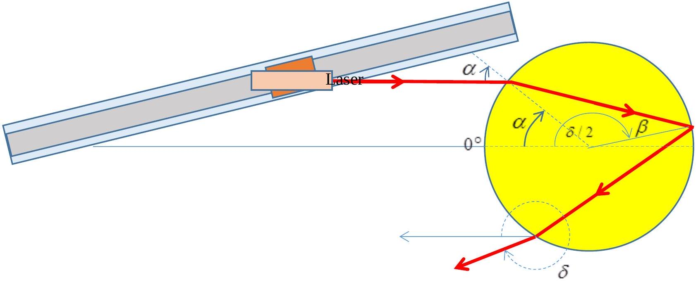
A.1: table of measured and calculated values

A.1: table of measured and calculated values
| $\alpha ( \circ )$ | $\Delta \alpha ( \circ )$ | $\delta / 2 ( \circ )$ | $\Delta \delta / 2 ( \circ )$ | $\delta ( \circ )$ | $\Delta \delta \left( \circ ^ { \circ } \right)$ | $\beta ( \circ )$ | $\sin \alpha$ | $\sin \beta$ |
| :--- | :--- | :--- | :--- | :--- | :--- | :--- | :--- | :--- |
| 15 | 0.25 | 174.5 | 0.25 | 349 | 0.5 | 10.25 | 0.259 | 0.178 |
| 20 | 0.25 | 173 | 0.25 | 346 | 0.5 | 13.5 | 0.342 | 0.233 |
| 25 | 0.25 | 172 | 0.25 | 344 | 0.5 | 16.5 | 0.423 | 0.284 |
| 30 | 0.25 | 171 | 0.25 | 342 | 0.5 | 19.5 | 0.500 | 0.334 |
| 35 | 0.5 | 170 | 0.25 | 340 | 0.5 | 22.5 | 0.574 | 0.383 |
| 40 | 1 | 169.5 | 0.25 | 339 | 0.5 | 25.25 | 0.643 | 0.427 |
| 45 | 1 | 169 | 0.25 | 338 | 0.5 | 28 | 0.707 | 0.469 |
| 50 | 1 | 169 | 0.25 | 338 | 0.5 | 30.5 | 0.766 | 0.508 |
| 55 | 1 | 169 | 0.25 | 338 | 0.5 | 33 | 0.819 | 0.545 |
| 60 | 1.5 | 170 | 0.25 | 340 | 0.5 | 35 | 0.866 | 0.574 |
| 65 | 1.5 | 171 | 0.5 | 342 | 1 | 37 | 0.906 | 0.602 |
| 70 | 1.5 | 173.5 | 1 | 347 | 2 | 38.25 | 0.940 | 0.619 |
| 75 | 2 | 176.5 | 1.5 | 353 | 3 | 39.25 | 0.966 | 0.633 |

A.2:
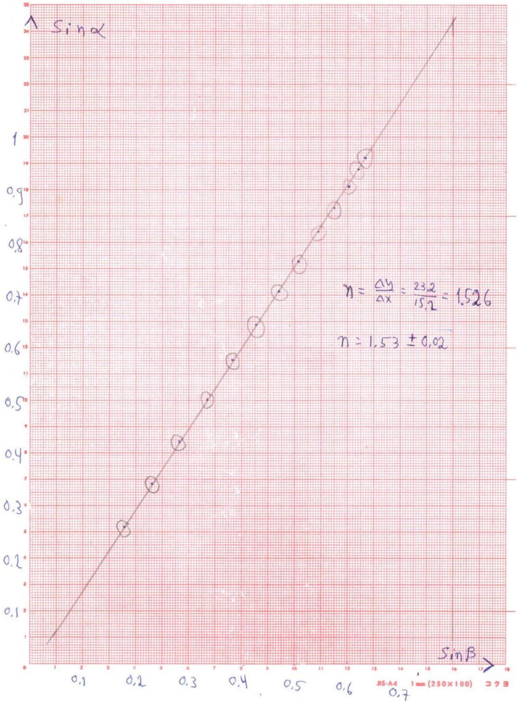

A.3:
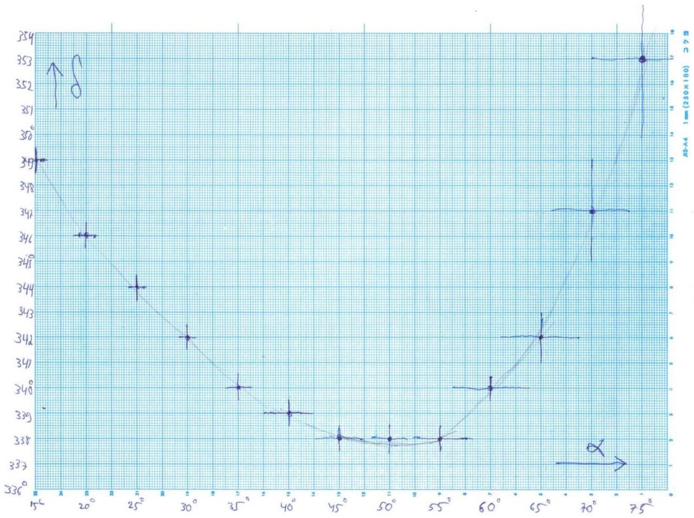

By observing the remote screen, it is possible to identify the point in which $\delta$ is minimal at the highest accuracy.

The values we find are

$$
\alpha = 49 ^ { \circ } \pm 0.25 ^ { \circ } \text { and } \delta = 338 ^ { \circ } \pm 0.5 ^ { \circ }
$$

A.4:

When $\delta$ is minimal, $\frac { d \delta } { d \alpha } = 0$.
Differentiating the relation $\delta = 2 \alpha + ( N - 1 ) \left( 180 ^ { \circ } - 2 \beta \right)$ by $\alpha$ we get:

$$
2 - 2 ( N - 1 ) \frac { d \beta } { d \alpha } = 0 \text { and therefore } \frac { d \beta } { d \alpha } = \frac { 1 } { N - 1 } \text {. }
$$

By differentiating Snell's law $\sin \alpha = n \sin \beta$ we get $\cos \alpha = n \cos \beta \cdot \frac { d \beta } { d \alpha } = \frac { n \cos \beta } { N - 1 }$
Squaring this result, as well as Snell's law and summing the expressions we get:

$$
1 = \sin ^ { 2 } \alpha + \cos ^ { 2 } \alpha = n ^ { 2 } \sin ^ { 2 } \beta + \frac { n ^ { 2 } \cos ^ { 2 } \beta } { ( N - 1 ) ^ { 2 } }
$$

Hence: $\frac { 1 } { n ^ { 2 } } = \sin ^ { 2 } \beta + \frac { \cos ^ { 2 } \beta } { ( N - 1 ) ^ { 2 } }$
We got an explicit relation between the refraction angle $\beta$ and the refraction index of the material. Due to the multiple reflections inside the disk it is possible, by following all the point in which the beam hits the disk-air interface, to measure the angle $\beta$ at very high accuracy.
A.5: a sketch showing all the measured quantities:

Define the angle $\gamma = 180 ^ { \circ } - 2 \beta$, as shown in the sketch. In fact, after two reflections inside the disk the beam exits at a point very close to the entering point. We will measure the angular location of the points where the beam hits the interface after $k$ reflection, for as many values of $k$ as we can:

| $k$ | $\alpha + k \gamma$ |
| :--- | :--- |
| 0 | 49 |
| 1 | 168.5 |
| 2 | 288.5 |
| 3 | 409 |

Note: for the case of $N = 3$ it is not possible to measure for $k > 3$ as in this case, starting from $k = 3$ the impact points co-inside with previous points.

Next we draw a graph of $y = \alpha + k \gamma$ vs. $k$ and find the linear regression slope, $\gamma$ :
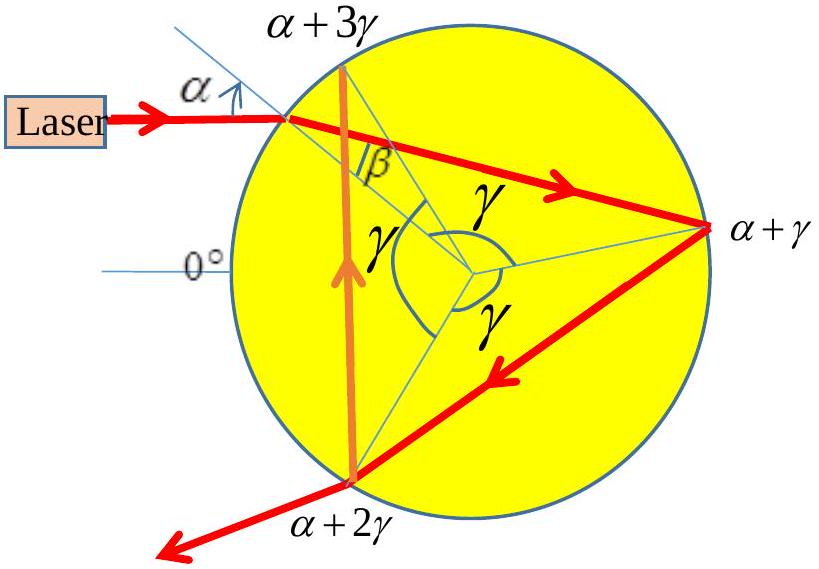

" " " 1000
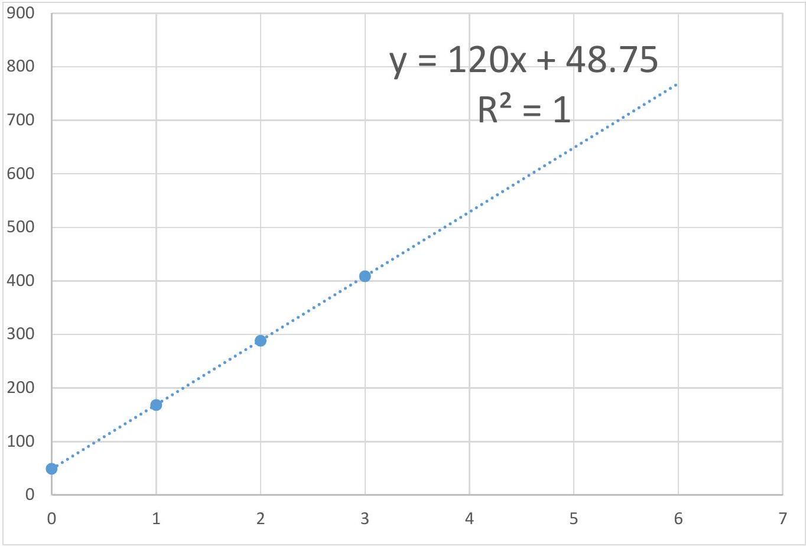

From $\gamma = 120 ^ { \circ }$ we get $\beta = 30 ^ { \circ }$, and using the equation we derived in A. 4 we get:

$$
n = \frac { 1 } { \sqrt { ( \sin \beta ) ^ { 2 } + ( \cos \beta ) ^ { 2 } / ( N - 1 ) ^ { 2 } } } = 1.512
$$

A.6: We will identify the beam exiting the disk after 4 refractions/reflections $( N = 4 )$ and we will change the incident angle until we get $\delta _ { \text {min } }$ for $N = 4$. We will measure $\alpha + k \gamma$ as a function of the number of times the beams hits the disk-air interface, $k$ :

| $k$ | $\alpha + k \gamma$ |
| :--- | :--- |
| 0 | 67 |
| 1 | 172 |
| 2 | 278 |
| 3 | 383 |
| 4 | 488 |
| 5 | 593 |
| 6 | 698.5 |

" " "25C LOUND
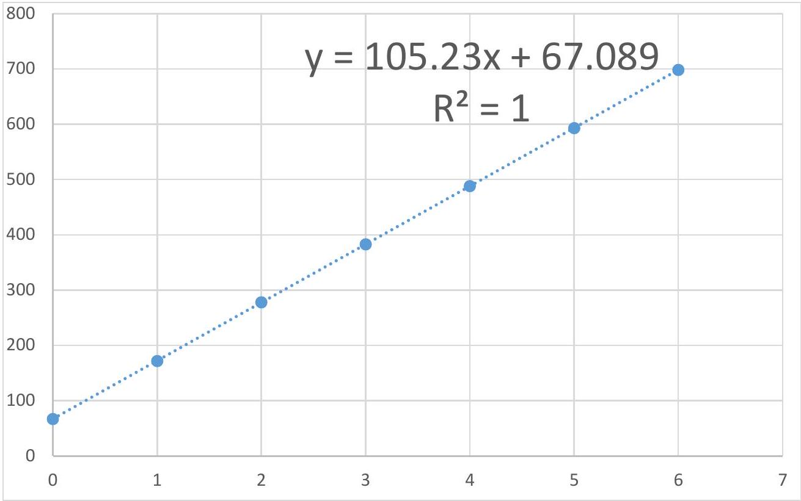

$$
n = \frac { 1 } { \sqrt { ( \sin \beta ) ^ { 2 } + ( \cos \beta ) ^ { 2 } / ( N - 1 ) ^ { 2 } } } = 1.511
$$

We'll repeat this process for $N = 5$ :
We will identify the beam exiting the disk after hitting the disk-air interface 5 times ( $N = 5$ ) and measure $\alpha + k \gamma$ as a function of the number of hits, $k$ :

| $k$ | $\alpha + k \gamma$ |
| :--- | :--- |
| 0 | 72.5 |
| 1 | 174.5 |
| 2 | 276.5 |
| 3 | 379.5 |
| 4 | 480.5 |
| 5 | 582.5 |
| 6 | 685 |

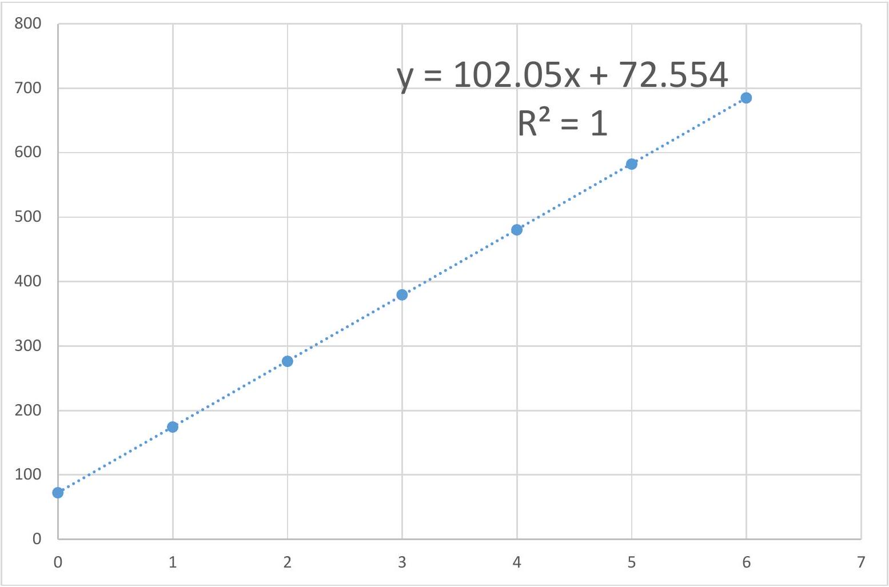

$$
n = \frac { 1 } { \sqrt { ( \sin \beta ) ^ { 2 } + ( \cos \beta ) ^ { 2 } / ( N - 1 ) ^ { 2 } } } = 1.519
$$

Averaging the three results we get: $\quad n = \frac { 1.519 + 1.511 + 1.512 } { 3 } = 1.514 \pm 0.004$

## Section B - parameters of a diffraction grating

B.1: We will mark on the table a point Q , at a distance of about $H = 70 c m$ from the screen - the wall of the experimental chamber - and at an equal distance from the chamber's side walls. Using the given measuring tape we will mark on the screen two points $P _ { 1 }$ and $P _ { 2 }$, at an equal distance of about 100cm from the left and form the right of the marked point Q . On the screen, we will mark a point $P$, placed in the middle of the interval $P _ { 1 } P _ { 2 }$. Then, we will aim a laser to go through the points QP. This beam will be perpendicular to the wall that will be used as a screen.
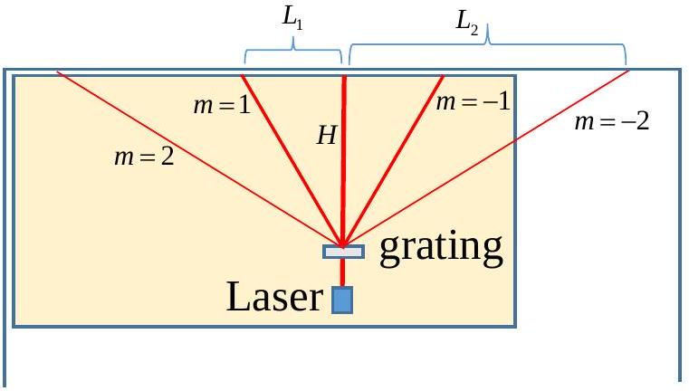

Standard method:
We will place the grating such that the beam passes through it. By gently rotating the grating we will make sure that diffraction ordered 1 and -1 as well as 2 and -2 will appear in symmetrically around the zero order point. Note that the position of the zero order on the screen does not depend on the angle $\alpha$. In this situation it ok to assume that the incident angle of the beam on the grating is $\alpha = 0$.
As in the sketch, we will measure $H , L _ { 1 }$ and $L _ { 2 }$ and use the relation $d \sin \theta _ { m } = m \lambda$.
The measured values are $2 L _ { 1 } = 53.3 \mathrm {~cm} , 2 L _ { 2 } = 163.5 \mathrm {~cm}$ and $H = 60.8 \mathrm {~cm}$.
For the first order we get $\frac { \lambda } { d } = 0.4015$. For the second order we get $\frac { \lambda } { d } = 0.4012$.
B.2: A second method

Getting higher orders is not possible at an incident angle of $\alpha = 0$. Thus we will change $\alpha$ and as a result the angle $\theta _ { m }$ will change. There is an angle in which $\theta _ { m }$ is minimal. By differentiating the relation $d \left( \sin \alpha + \sin \left( \theta _ { m } - \alpha \right) \right) = m \lambda$ by $\alpha$ we get that at the minimum ( $\frac { d \theta _ { m } } { d \alpha } = 0$ ) one gets $\cos \alpha - \cos \left( \theta _ { m } - \alpha \right) = 0 \Rightarrow \alpha = \frac { \theta _ { m } } { 2 }$. From this we get $2 d \sin \left( \frac { \theta _ { m } } { 2 } \right) = m \lambda$.

Note that there is no need to measure the angle $\alpha$, but rather to identify, by changing $\alpha$, the minimum of $\theta _ { m }$.

Using this method it is possible to measure also ordered $m = 1$ and $m = 2$. For $m = 2$ and $m = - 2$ we can verify that the beam is perpendicular to the screen by making sure the distance of these two ordered from the zero order is identical.

For $m = 3$, we will change $\alpha$ to get $\theta _ { 3 \min }$ and measure the distances $L$ and $h _ { 3 }$.

## Experiment IPhO 2019

## CA

The measured values, as shown in the sketch below, are $H = 67.0 \mathrm {~cm} , L = 100.2 \mathrm {~cm}$, $h _ { 3 } = 37.8 \mathrm {~cm}$.
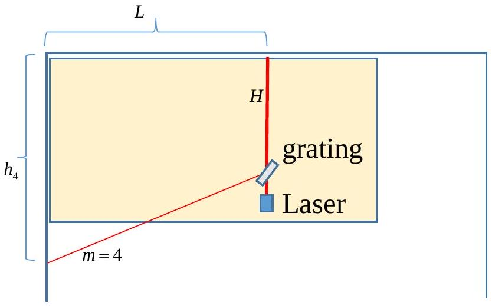
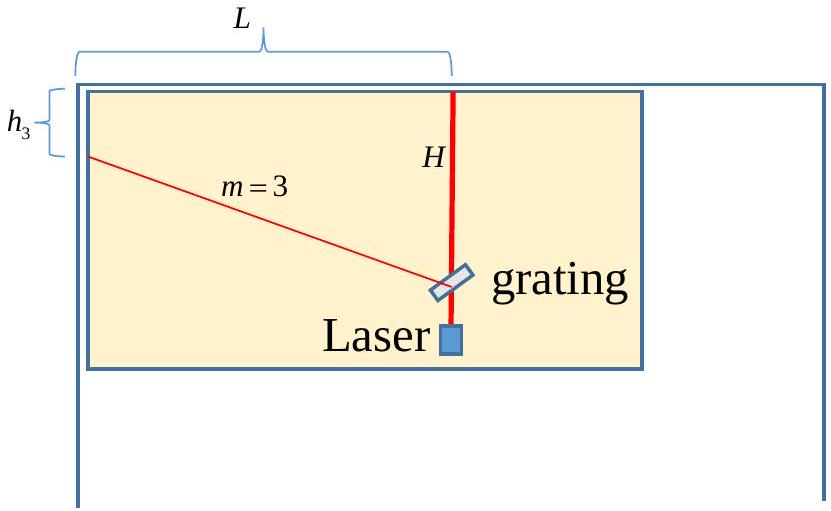
We get $\tan \theta _ { 3 \min } = \frac { L } { H - h 3 } = \frac { 100.2 } { 67.0 - 37.8 } = 3.432$ and hence $\theta _ { 3 \min } = 73.75 ^ { \circ }$
Therefore: $\frac { \lambda } { d } = \frac { 2 } { 3 } \sin \frac { \theta _ { 3 \min } } { 2 } = \frac { 2 } { 3 } \sin \frac { 73.75 ^ { \circ } } { 2 } = 0.400$
For $m = 4$ we will change $\alpha$ to get $\theta _ { 4 \min }$ and measure the distance $h _ { 4 }$.
The measured values are $H = 67.0 \mathrm {~cm} , L = 100.2 \mathrm {~cm} , h _ { 4 } = 96.3 \mathrm {~cm}$.
From the sketch we get $\tan \left( \theta _ { 4 \min } - 90 ^ { \circ } \right) = \frac { h _ { 4 } - H } { L } = \frac { 96.3 - 67.0 } { 100.2 } = 0.2924$
Hence $\theta _ { 4 \min } = 106.3 ^ { \circ }$, therefore $\frac { \lambda } { d } = \frac { 2 } { 4 } \sin \frac { \theta _ { 4 \min } } { 2 } = \frac { 1 } { 2 } \sin \frac { 106.3 ^ { \circ } } { 2 } = 0.400$

## Section C - the refraction index of a triangular prism

C.1: From the sketch showing the path of the laser beam and from the principle the beam path reversal we get that the deflection angle $\delta$ from the direction of in the incoming beam will not change if we switch the angles $\alpha _ { 1 }$ and $\alpha _ { 2 }$. Thus we get that $\delta$ achieves an extremum value (in fact, a minimal value) when the situation is perfectly symmetric, that is when $\alpha _ { 1 } = \alpha _ { 2 }$. In this case,

$$
\beta _ { 1 } = \beta _ { 2 } = \frac { \phi } { 2 } .
$$

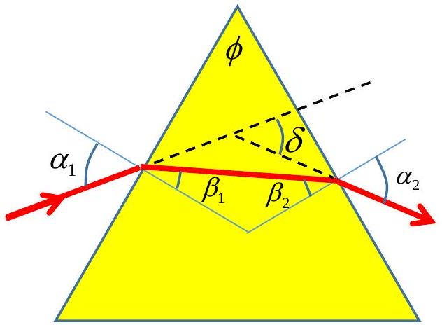
For the symmetric case, the incident angle $\alpha$ holds the relation $\alpha = \frac { \delta } { 2 } + \frac { \phi } { 2 }$ and from Snell's law we get $\sin \left( \frac { \delta } { 2 } + \frac { \phi } { 2 } \right) = n \sin \frac { \phi } { 2 }$.
If the prism is not exactly equilateral, we will mark the angles of the prism by $\phi _ { i } = 60 ^ { \circ } + 2 \varepsilon _ { i }$. From the sum of angles in a triangle we get $\sum \varepsilon _ { i } = 0$. Additionally $\beta _ { i } = 30 + \varepsilon _ { i }$. In this case $\delta _ { \text {min } } = \delta _ { 0 } + 2 \Delta _ { i }$ where $\delta _ { 0 }$ is the minimal $\delta$ when $\phi = 60 ^ { \circ }$.
From Snell's law we get $\sin \left( \frac { \delta _ { 0 } } { 2 } + 30 ^ { \circ } + \Delta _ { i } + \varepsilon _ { i } \right) = n \sin \left( 30 ^ { \circ } + \varepsilon _ { i } \right)$. Making the small angle approximation: $\sin \left( \frac { \delta _ { 0 } } { 2 } + 30 ^ { \circ } \right) + \cos \left( \frac { \delta _ { 0 } } { 2 } + 30 ^ { \circ } \right) \left( \Delta _ { i } + \varepsilon _ { i } \right) = n \sin 30 ^ { \circ } + n \cos 30 ^ { \circ } \cdot \varepsilon _ { i }$
From the equation that holds for 60° prism we get $\cos \left( \frac { \delta _ { 0 } } { 2 } + 30 ^ { \circ } \right) \left( \Delta _ { i } + \varepsilon _ { i } \right) = n \cos 30 ^ { \circ } \cdot \varepsilon _ { i }$ Averaging for all three angles we get $\left\langle \Delta _ { i } \right\rangle = 0$, and therefore $n = 2 \sin \left( \frac { \left\langle \delta _ { \text {min } } \right\rangle } { 2 } + 30 ^ { \circ } \right)$

C.2. We will use the full length of the table to magnify the distances as much as possible. We will build the setup, as described in the sketch, so that in the absence of the prism, the laser beam will hit the screen (the chamber's wall) perpendicularly. We will attach the prism holder base to the table using the adhesive tape. On it we will place the prism holder and the prism itself. We will rotate the prism to find the minimal deflection angle $\delta _ { \text {min } }$. We will then repeat the measurement of $\delta _ { \text {min } }$ for each corner of the prism.
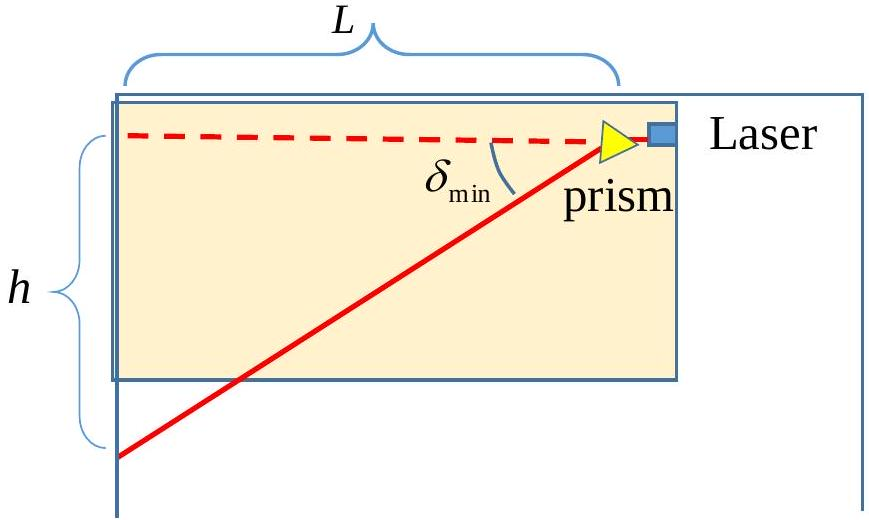

The measured values are given in the table:

| Corner No. | $L$ | $h$ | $\delta _ { \text {min } }$ |
| :--- | :--- | :--- | :--- |
| 1 | $141.6 \pm 0.2 \mathrm {~cm}$ | $175.2 \pm 0.3 \mathrm {~cm}$ | $51.05 ^ { \circ } \pm 0.1 ^ { \circ }$ |
| 2 | $141.0 \pm 0.2 \mathrm {~cm}$ | $167.1 \pm 0.3 \mathrm {~cm}$ | $49.84 ^ { \circ } \pm 0.1 ^ { \circ }$ |
| 3 | $140.7 \pm 0.2 \mathrm {~cm}$ | $171.4 \pm 0.3 \mathrm {~cm}$ | $50.62 ^ { \circ } \pm 0.1 ^ { \circ }$ |

Calculation of the error in $\delta _ { \text {min } }$ :

$$
\tan \delta _ { \min } = \frac { h } { L } \Rightarrow \frac { 1 } { \cos ^ { 2 } \delta _ { \min } } \Delta \delta _ { \min } = \sqrt { \left( \frac { \Delta h } { L } \right) ^ { 2 } + \left( \frac { h \Delta L } { L ^ { 2 } } \right) ^ { 2 } }
$$

Therefore, $\Delta \delta _ { \text {min } } = \cos ^ { 2 } \delta _ { \text {min } } \sqrt { \left( \frac { \Delta h } { L } \right) ^ { 2 } + \left( \frac { h \Delta L } { L ^ { 2 } } \right) ^ { 2 } }$
Substituting the measured values we get

$$
\Delta \delta _ { \min } = \cos ^ { 2 } 51.05 ^ { \circ } \sqrt { \left( \frac { 0.3 } { 141.6 } \right) ^ { 2 } + \left( \frac { 175.2 \cdot 0.2 } { 141.6 ^ { 2 } } \right) ^ { 2 } } = 0.0017 \mathrm { rad } = 0.1 ^ { \circ }
$$

The error in the average value of the two angles is

$$
\Delta \left\langle \delta _ { \min } \right\rangle = \frac { 0.1 ^ { \circ } } { \sqrt { 3 } } = 0.06 ^ { \circ } = 1 \cdot 10 ^ { - 3 } \mathrm { rad }
$$

From the table we get that the average value of $\delta _ { \text {min } }$ is $\left\langle \delta _ { \text {min } } \right\rangle = 50.50 ^ { \circ }$
Therefore the refraction index of the prism is

$$
n = 2 \sin \left( \frac { \left\langle \delta _ { \min } \right\rangle } { 2 } + 30 ^ { \circ } \right) = 2 \sin \left( \frac { 50.50 ^ { \circ } } { 2 } + 30 ^ { \circ } \right) = 2 \sin 55.25 ^ { \circ } = 1.6433
$$

And the error in $n : \Delta n = 2 \cos 55.25 ^ { \circ } \cdot 0.5 \Delta \left\langle \delta _ { \text {min } } \right\rangle = \cos 55.25 ^ { \circ } \cdot 1 \cdot 10 ^ { - 3 } = 6 \cdot 10 ^ { - 4 }$
Thus: $n = 1.6433 \pm 0.0006$
As the laser wavelength may vary between lasers up to a standard deviation of ±10 nm, the value found in the literature is $n ( \lambda \pm \Delta \lambda ) = 1.6425 \pm 0.0007$.
