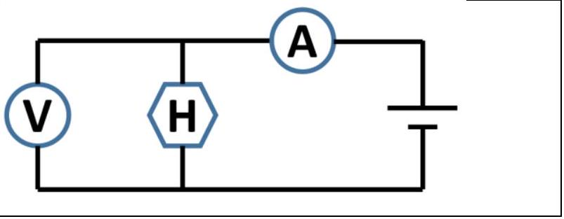
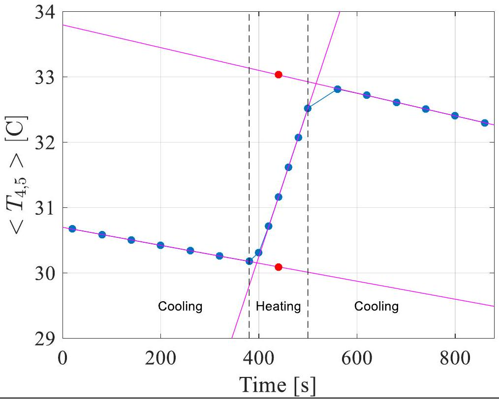
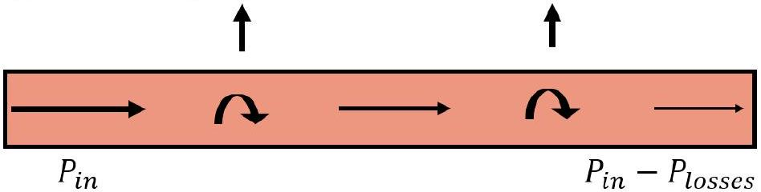
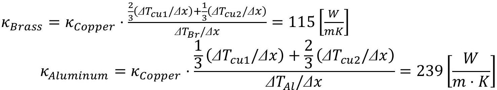

## Wiedemann-Franz Law - Solution

## Part A: Electrical conductivity of metals (1.5 points)

A.1 (1.0 points)
Magnet descend time:

| Number | Copper [s] | Aluminum[s] | Brass [s] |
| :--- | :--- | :--- | :--- |
| 1 | 17.77 | 9.23 | 6.1 |
| 2 | 17.96 | 9.39 | 5.83 |
| 3 | 18.16 | 9.22 | 6.04 |
| 4 | 18.15 | 9.37 | 5.86 |
| 5 | 17.76 | 9.36 | 6.16 |
| 6 | 18.2 | 9.44 | 5.92 |
| 7 | 17.67 | 9.65 | 5.9 |
| 8 | 17.9 | 9.18 | 6.08 |
| 9 | 17.67 | 9.41 | 5.86 |
| 10 | 18.36 | 8.96 | 5.99 |
|  |  |  |  |
| Average | 17.96 | 9.32 | 5.97 |
A.2 (0.5 points)

|  | Copper | Aluminum | Brass |
| :--- | :--- | :--- | :--- |
| Electrical conductivity $\left[ \frac { 1 } { \Omega m } \right]$ | $5.97 \times 10 ^ { 7 }$ | $2.98 \times 10 ^ { 7 }$ | $1.60 \times 10 ^ { 7 }$ |

## Experiment IPhO 2019

## S2-2

Part B: Thermal conductivity of copper (3.0 points)

| B. 1 (0.1 points) Rod 1 temperature : 22.76 [C] |  |  |  |  |  |  |
| :--- | :--- | :--- | :--- | :--- | :--- | :--- |
| B. 2 (0.5 points) |  |  |  |  |  |  |
| B. 3 (0.1 points) $P = I \cdot V = 5.51 [ \mathrm {~W} ]$ |  |  |  |  |  |  |
| B. 4 (0.5 points) |  |  |  |  |  |  |
| Time [S] | T1 [C] | T2 [C] | T3 [C] | T4[C] | T7 [C] | T8 [C] |
| 900 | 26.98 | 27.96 | 28.95 | 29.96 | 33.10 | 34.20 |
| 1050 | 27.16 | 28.16 | 29.17 | 30.20 | 33.38 | 34.48 |
| 1200 | 27.29 | 28.30 | 29.33 | 30.37 | 33.58 | 34.68 |
| B. 5 (1.0 points) |  |  |  |  |  |  |

## S2-3

B. 6 (0.5 points)

$$
\begin{aligned}
& \kappa _ { 0 } = - \frac { P } { A \frac { \Delta T } { \Delta x } } = - \frac { 5.51 [ \mathrm {~W} ] } { \pi \cdot \left( 10 ^ { - 2 } [ \mathrm {~m} ] \right) ^ { 2 } \cdot \left( - 41.8 \left[ \frac { \mathrm {~K} } { \mathrm {~m} } \right] \right) } = 420 \left[ \frac { \mathrm {~W} } { \mathrm { mK } } \right] \\
& \frac { \Delta T } { \Delta t } = \frac { 31.04 [ \mathrm { C } ] - 30.62 [ \mathrm { C } ] } { 5 \cdot 60 [ \mathrm {~s} ] } = 1.4 \cdot 10 ^ { - 3 } \left[ \frac { \mathrm {~K} } { \mathrm {~s} } \right]
\end{aligned}
$$

B. 7 (0.3 points)
higher value
We expect a higher value of $\kappa _ { 0 }$ compared with the real $\kappa _ { c u }$ because of 2 reasons:

1. A part of the supplied heat power is lost through the side walls. Therefore, the heat transfer through the cross-section of the rod is smaller.
2. Since the system is not in a steady state $\left( \frac { \Delta T } { \Delta t } \neq 0 \right)$, the corresponding power involved should be subtracted from the power supplied by the heater.

## Experiment IPhO 2019

## S2-4

Part C: Heat loss and heat capacity of copper (4.0 points)

| C. 1 (1.0 points) |  |  |  |  |  |  |  |  |  |
| :--- | :--- | :--- | :--- | :--- | :--- | :--- | :--- | :--- | :--- |
| Time[s] | $T _ { 1 } [ C ]$ | $T _ { 2 } [ C ]$ | $T _ { 3 } [ C ]$ | $T _ { 4 } [ C ]$ | $T _ { 5 } [ C ]$ | $T _ { 6 } [ C ]$ | $T _ { 7 } [ C ]$ | $T _ { 8 } [ C ]$ | $T _ { a v } [ C ]$ |
| 20 |  |  |  | 30.67 | 30.67 |  |  |  | 30.67 |
| 80 |  |  |  | 30.59 | 30.59 |  |  |  | 30.59 |
| 140 |  |  |  | 30.50 | 30.50 |  |  |  | 30.50 |
| 200 |  |  |  | 30.42 | 30.42 |  |  |  | 30.42 |
| 260 |  |  |  | 30.34 | 30.34 |  |  |  | 30.34 |
| 320 |  |  |  | 30.26 | 30.26 |  |  |  | 30.26 |
| 380 |  |  |  | 30.18 | 30.18 |  |  |  | 30.18 |
| 400 |  |  |  | 30.38 | 30.25 |  |  |  | 30.31 |
| 420 |  |  |  | 30.87 | 30.56 |  |  |  | 30.72 |
| 440 |  |  |  | 31.37 | 30.96 |  |  |  | 31.16 |
| 460 |  |  |  | 31.85 | 31.38 |  |  |  | 31.61 |
| 480 |  |  |  | 32.32 | 31.82 |  |  |  | 32.07 |
| 500 |  |  |  | 32.78 | 32.26 |  |  |  | 32.52 |
| 560 |  |  |  | 32.88 | 32.75 |  |  |  | 32.81 |
| 620 |  |  |  | 32.73 | 32.70 |  |  |  | 32.72 |
| 680 |  |  |  | 32.61 | 32.61 |  |  |  | 32.61 |
| 740 |  |  |  | 32.51 | 32.51 |  |  |  | 32.51 |
| 800 |  |  |  | 32.40 | 32.40 |  |  |  | 32.40 |
| 860 |  |  |  | 32.30 | 32.30 |  |  |  | 32.30 |
|  |  |  |  |  |  |  |  |  |  |

## S2-5

C. 2 (1.0 points)

C. 3 (1.0 points)

The purpose of this part is to correct to first order the result in part B. Hence, every solution within 10\% accuracy is accepted (see marking scheme).

| Solution 1 (using slopes): $\begin{aligned} & P _ { \text {loss } } = \left. c _ { p } \cdot m \cdot \frac { \partial T _ { a v } } { \partial t } \right\| _ { \text {Cooling } } \\ & P _ { \text {in } } = c _ { p } \cdot m \cdot \left( \left. \frac { \partial T _ { a v } } { \partial t } \right\| _ { \text {Heating } } - \left. \frac { \partial T _ { a v } } { \partial t } \right\| _ { \text {Cooling } } \right) \end{aligned}$   Where $\left. \frac { \partial T _ { a v } } { \partial t } \right\| _ { \text {Cooling } }$ is the average of both cooling slopes. $c _ { p } \cdot m = \frac { 5.5 [ W ] } { \left( 2.27 \cdot 10 ^ { - 2 } \left[ \frac { K } { s } \right] + 1.6 \cdot 10 ^ { - 3 } \left[ \frac { K } { s } \right] \right) }$ | Solution 2 (using jump): $\begin{aligned} & P _ { \text {loss } } = \left. c _ { p } \cdot m \cdot \frac { \partial T _ { a v } } { \partial t } \right\| _ { \text {Cooling } } \\ & P _ { \text {in } } \cdot \Delta t = c _ { p } \cdot m \cdot \Delta T \end{aligned}$   Where $\left. \frac { \partial T _ { a v } } { \partial t } \right\| _ { \text {Cooling } }$ is the average of the two cooling slopes, and $\Delta T$ is the extrapolated jump in temperature half way though the heating time interval. $c _ { p } \cdot m = \frac { P _ { \text {in } } \cdot \Delta t } { \Delta T } = \frac { 5.5 [ W ] \cdot 120 [ s ] } { 2.94 [ K ] } = 224 \left[ \frac { J } { K } \right]$ |
| :--- | :--- |

## Experiment IPhO 2019

## S2-6

| $c _ { p } \cdot m = 226 \left[ \frac { \mathrm {~J} } { \mathrm {~K} } \right] \Rightarrow c _ { p } = 390 \left[ \frac { \mathrm {~J} } { \mathrm {~kg} \cdot \mathrm {~K} } \right]$   Which is 1\% off the correct value. $P _ { \text {loss } } = 226 \left[ \frac { \mathrm {~J} } { \mathrm {~K} } \right] \cdot 1.4 \cdot 10 ^ { - 3 } \left[ \frac { \mathrm {~K} } { \mathrm {~s} } \right] = 0.32 [ \mathrm {~W} ]$ | $c _ { p } = 386 \left[ \frac { \mathrm {~J} } { \mathrm {~kg} \cdot \mathrm {~K} } \right]$ which is the correct value. $P _ { \text {loss } } = 224 \left[ \frac { \mathrm {~J} } { \mathrm {~K} } \right] \cdot 1.4 \cdot 10 ^ { - 3 } \left[ \frac { \mathrm {~K} } { \mathrm {~s} } \right] = 0.31 [ \mathrm {~W} ]$ |
| :--- | :--- |
| C. 4 (1.0 points)   The temperature gradient is proportional to the local heat flow.   To first order, the average temperature gradient will be proportional to the average heat flow. Therefore, the temperature gradient will be proportional to $P _ { \text {in } } - \frac { 1 } { 2 } P _ { \text {losses } }$ : $\kappa = \frac { P _ { \text {in } } - \frac { 1 } { 2 } P _ { \text {absorb } } - \frac { 1 } { 2 } P _ { \text {loss } } } { A \cdot ( \Delta T / \Delta x ) } = \frac { P _ { \text {in } } - \frac { 1 } { 2 } c _ { p } \cdot m \cdot \frac { \Delta T } { \Delta t } - \frac { 1 } { 2 } \dot { Q } _ { \text {loss } } } { A \cdot \Delta T / \Delta x } = \kappa _ { 0 } \cdot \frac { P _ { \text {in } } - \frac { 1 } { 2 } c _ { p } \cdot m \cdot \frac { \Delta T } { \Delta t } - \frac { 1 } { 2 } \dot { Q } _ { \text {loss } } } { P }$ $\kappa = 420 \left[ \frac { \mathrm {~W} } { \mathrm { mK } } \right] \cdot \frac { 5.51 [ \mathrm {~W} ] - \frac { 1 } { 2 } \cdot 226 \left[ \frac { \mathrm {~J} } { \mathrm {~K} } \right] \cdot 1.4 \cdot 10 ^ { - 3 } \left[ \frac { \mathrm {~K} } { \mathrm {~s} } \right] - \frac { 1 } { 2 } \cdot 0.32 [ \mathrm {~W} ] } { 5.51 [ \mathrm {~W} ] } = 396 \left[ \frac { \mathrm {~W} } { \mathrm { mK } } \right]$   Which gives an error of 2.5\% error compared to expected $385 \left[ \frac { W } { m K } \right]$. We expect a 1\% systematic error (see appendix). |  |
|  |  |

Part D: Thermal conductivity of multiple metals (1.0 points)

| D. 1 (0.1 points) $T = 22.65 [ C ]$ |  |  |  |
| :--- | :--- | :--- | :--- |
| D. 2 (0.2 points) |  |  |  |
| Time of measurement: 1041[s] |  |  |  |
| $T _ { 1 } [ C ]$ | $T _ { 3 } [ C ]$ | $T _ { 5 } [ C ]$ | $T _ { 8 } [ C ]$ |
| $\Delta T _ { c u 1 } / \Delta x$ | $\Delta T _ { B r } / \Delta x$ | $\Delta T _ { A l } / \Delta x$ | $\Delta T _ { c u 2 } / \Delta x$ |
| $41.79 \left[ \frac { K } { m } \right]$ | $137.86 \left[ \frac { K } { m } \right]$ | $62.86 \left[ \frac { K } { m } \right]$ | $36.07 \left[ \frac { K } { m } \right]$ |
| D. 3 (0.7 points) |  |  |  |
|  |  |  |  |

Part E: The Wiedemann-Franz law (0.5 points)

| E. 1 (0.5 points) |  |  |  |
| :--- | :--- | :--- | :--- |
|  | Copper | Aluminum | Brass |
| $\sigma \left[ \Omega ^ { - 1 } m ^ { - 1 } \right]$ Electric conductivity | $5.97 \times 10 ^ { 7 }$ | $2.98 \times 10 ^ { 7 }$ | $1.60 \times 10 ^ { 7 }$ |
| $\kappa \left[ \frac { W } { K m } \right]$   Heat conductivity | 396 | 239 | 115 |
| $L \left[ \frac { W \Omega } { K ^ { 2 } } \right]$   Lorenz coefficient | $2.21 \times 10 ^ { - 8 }$ | $2.67 \times 10 ^ { - 8 }$ | $2.40 \times 10 ^ { - 8 }$ |
