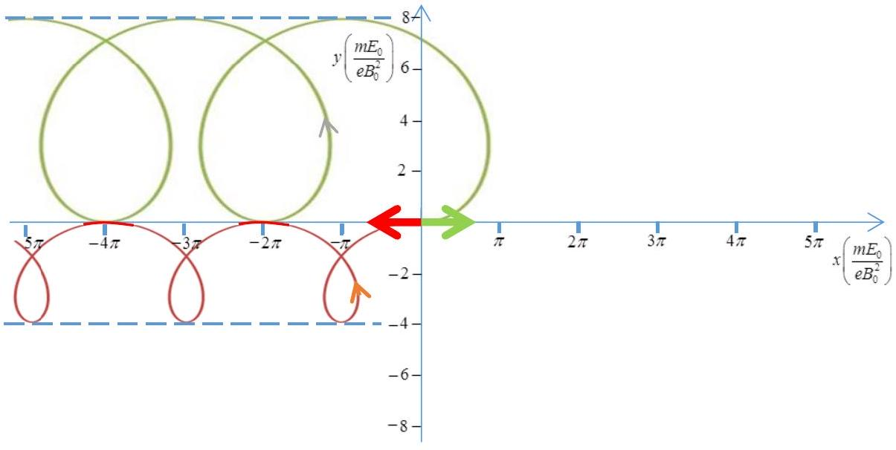
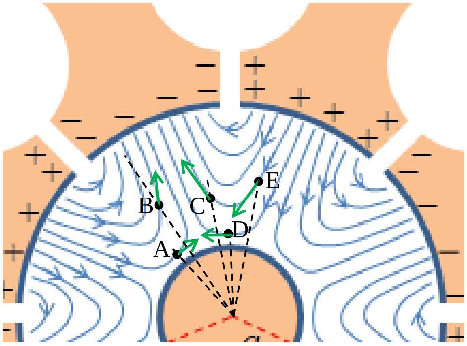
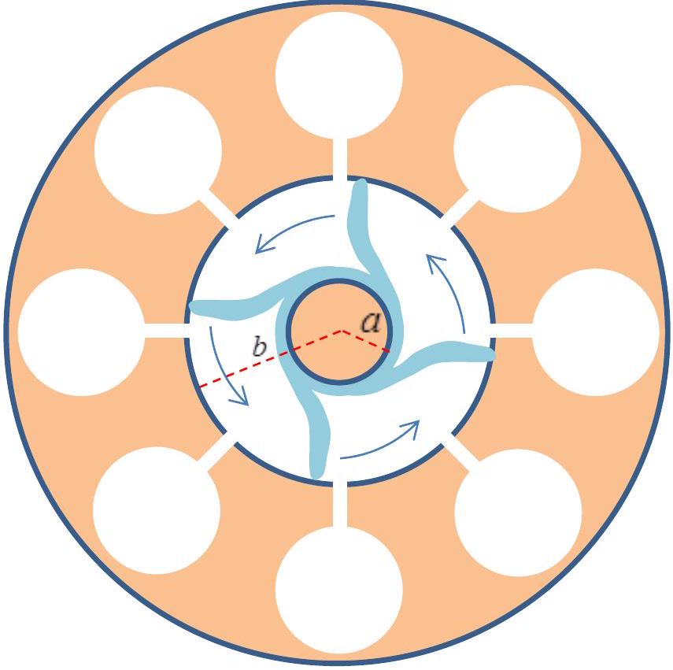

## The Physics of a Microwave Oven - Solution

## Part A: The structure and operation of a magnetron

A.1. The frequency of an LC circuit is $f = \omega / 2 \pi = 1 / ( 2 \pi \sqrt { L C } )$. If the total electric current flowing along the boundary of the cavity is $I$, it generates a magnetic field whose magnitude (by the assumptions of the question) is $0.6 \mu _ { 0 } I / h$, and a total magnetic flux equal to $\pi R ^ { 2 } \times$ $0.6 \mu _ { 0 } I / h$, hence the inductance of the resonator is $L = 0.6 \pi \mu _ { 0 } R ^ { 2 } / h$. Approximating the capacitor as a plate capacitor, its capacitance is $C = \varepsilon _ { 0 } l h / d$. Putting everything together, we find

$$
f _ { e s t } = \frac { 1 } { 2 \pi } \frac { 1 } { \sqrt { L C } } = \frac { 1 } { 2 \pi } \sqrt { \frac { h } { 0.6 \pi R ^ { 2 } \mu _ { 0 } } \frac { d } { \varepsilon _ { 0 } l h } } = \frac { 1 } { 2 \pi } \frac { c } { R } \sqrt { \frac { d } { 0.6 \pi l } } = \frac { 1 } { 2 \pi } \frac { 3 \cdot 10 ^ { 8 } } { 7 \cdot 10 ^ { - 3 } } \sqrt { \frac { 1 } { 3.6 \pi } } = 2.0 \cdot 10 ^ { 9 }
$$

Hz
A.2. Denoting the electron velocity by $\vec { u } ( t )$, in this case the total force applied on it is

$$
\vec { F } = - e \left( - E _ { 0 } \hat { y } + \vec { u } ( t ) \times B _ { 0 } \hat { z } \right) .
$$

Let us write $\vec { u } ( t ) = \vec { u } _ { D } + \vec { u } ^ { \prime } ( t )$, with $\vec { u } _ { D } = \left( - E _ { 0 } / B _ { 0 } \right) \hat { x }$ being the drift velocity of a charged particle in the crossed electric and magnetic fields (the velocity at which the electric and magnetic forces cancel each other exactly). Then $\vec { F } = - e \vec { u } ^ { \prime } ( t ) \times B _ { 0 } \hat { z }$. Thus, in a frame moving at the drift velocity $\vec { u } _ { D }$, the electron trajectory is a circle with constant-magnitude velocity $u ^ { \prime } =$ $\left| \vec { u } ^ { \prime } ( t ) \right|$, and radius $r = m u ^ { \prime } / e B _ { 0 }$. In the lab frame this circular motion is superimposed upon the drift at the constant velocity $\vec { u } _ { D }$. Hence:

1. For $\vec { u } ( 0 ) = \left( 3 E _ { 0 } / B _ { 0 } \right) \hat { x }$ we find $u ^ { \prime } = 4 E _ { 0 } / B _ { 0 }$ and $r = 4 m E _ { 0 } / e B _ { 0 } ^ { 2 }$.
2. For $\vec { u } ( 0 ) = - \left( 3 E _ { 0 } / B _ { 0 } \right) \hat { x }$ we find $u ^ { \prime } = 2 E _ { 0 } / B _ { 0 }$ and $r = 2 m E _ { 0 } / e B _ { 0 } ^ { 2 }$.

This information, together with the independence of the period of the circular motion on $u ^ { \prime }$ allows us to plot the electron trajectory in both cases (green and red, for cases 1 and 2, respectively):

A.3. The velocity of the electron in a frame of reference where the motion is approximately circular is $u ^ { \prime }$. From A. 2 we get that $u _ { D } + u ^ { \prime } = v _ { \text {max } }$ and $u _ { D } - u ^ { \prime } = v _ { \text {min } }$, hence $u ^ { \prime } = \left( v _ { \text {max } } - v _ { \text {min } } \right) / 2 < v _ { \text {max } }$.

The radius of the circular motion of the electron in this frame is $r = m u ^ { \prime } / e B _ { 0 } < m v _ { \text {max } } / e B _ { 0 }$. The maximal velocity is that corresponding to a kinetic energy, $K _ { \text {max } } = m v _ { \text {max } } ^ { 2 } / 2$, of 800 eV.
Substituting we find $r < \frac { m } { e B } \sqrt { \frac { 2 e V } { m } } = \frac { 1 } { B } \sqrt { \frac { 2 m V } { e } } = \frac { 1 } { 0.3 } \sqrt { \frac { 2 \cdot 9.1 \cdot 10 ^ { - 31 } \cdot 800 } { 1.6 \cdot 10 ^ { - 19 } } } = 3.18 \cdot 10 ^ { - 4 } \mathrm {~m} \approx 0.3 \mathrm {~mm}$.
Since this maximal radius is much smaller than the distance between the anode and the cathode, we may ignore the circular component of the electronic motion, and approximate it as pure drift.
A.4. As just explained, we may approximate the electron motion as pure drift. In task A. 2 we have found that the direction of the drift velocity $\vec { u } _ { D }$ is in the direction of the vector $\vec { E } \times$ $\vec { B }$. Since we are interested in radial component of the drift velocity, the only contribution is from the azimuthal component of the electric field. The static electric field has no azimuthal component, hence the drift in the radial direction results solely from the azimuthal component of the alternating electric field. What we have to check is if the azimuthal component points clockwise or counterclockwise. From the direction of the field lines it is easy to see (attached figure) that in

points A and B the azimuthal component pointing clockwise therefore the electrons there drift towards the cathode, while for points C, D and E the azimuthal component points counterclockwise and the electrons there drift toward the anode.

| Point | toward the anode | toward the cathode | perpendicular to the radius |
| :--- | :--- | :--- | :--- |
| A |  | X |  |
| B |  | X |  |

## S2-3

| C | X |  |
| :--- | :--- | :--- |
| D | X |  |
| E | X |  |

A.5. In this task we need to consider the azimuthal component of the drift velocity, which results from the radial component of the electric field. Since all points are at the same distance from the anode, all electrons experience the same static electric field. Hence only the radial component of the alternating field determines whether the angle between the electrons' position vectors would increase or decrease: If the radial component of the alternating field points inwards (towards the cathode), the azimuthal drift velocity will be positive (counterclockwise) and vice versa. Hence the electrons at A, B and C drift closer to each other in terms of angles, while those at D, E and F drift away from each other.

| points | angle decreases | angle increases | indeterminate |
| :--- | :--- | :--- | :--- |
| AB | X |  |  |
| BC | X |  |  |
| CA | X |  |  |
| DE |  | X |  |
| EF |  | X |  |
| DF |  | X |  |

A.6. Spokes will be created only in the regions where focusing occurs. By the result of the previous task, there are four spokes, as indicated in the attached Figure.

The electron drift sets the spokes in a counterclockwise rotation. The frequency of the alternating field is $f = 2.45 \mathrm { GHz }$. By the time the alternating field flipped its sign (half a period), each spoke moves to the next cavity, corresponding to an angle of $\pi / 4$. Therefore, the angular velocity of each spoke is $\omega = \frac { \pi } { 4 } / \frac { T } { 2 } = \frac { \pi } { 2 } f = 3.85 \cdot 10 ^ { 9 } \mathrm { rad } / \mathrm { s }$. Each spoke performs a full rotation around the magnetron after four periods of the alternating field.

A.7. The magnitude of the electric field in the region considered, $r = ( b + a ) / 2$, is the magnitude of the static field, that is, $E = V _ { 0 } / ( b - a )$, giving rise to an azimuthal drift velocity of magnitude $u _ { D } = E / B _ { 0 } = V _ { 0 } / \left[ B _ { 0 } ( b - a ) \right]$. Equating $u _ { D } / r$ with the angular velocity found in the previous task we find $V _ { 0 } = \pi f B _ { 0 } \left( b ^ { 2 } - a ^ { 2 } \right) / 4$

## Part B: The interaction of microwave radiation with water molecules

B.1. The torque at time $t$ is given by $\tau ( t ) = - q d \sin [ \theta ( t ) ] E ( t ) = - p _ { 0 } \sin [ \theta ( t ) ] E ( t )$, hence the instantaneous power delivered to the dipole by the electric field is

$$
H _ { i } ( t ) = \tau ( t ) \dot { \theta } ( t ) = - p _ { 0 } E ( t ) \sin \theta ( t ) \dot { \theta } ( t ) = E ( t ) \frac { d } { d t } \left( p _ { 0 } \cos \theta ( t ) \right) = E ( t ) \frac { d p _ { x } ( t ) } { d t }
$$

B.2. Since the average dipole density (hence the average of each molecular dipole) is parallel to the field, the absorbed power density is (angular brackets, $\langle \cdots \rangle$, denote average over time)

$$
\begin{aligned}
& \langle H ( t ) \rangle = \left\langle E _ { 0 } \sin \left( \omega _ { f } t \right) \frac { d P _ { x } } { d t } \right\rangle = \left\langle E _ { 0 } \sin \left( \omega _ { f } t \right) \frac { d } { d t } \left( \beta \varepsilon _ { 0 } E _ { 0 } \sin \left( \omega _ { f } t - \delta \right) \right) \right\rangle = \\
& E _ { 0 } ^ { 2 } \beta \varepsilon _ { 0 } \omega _ { f } \left\langle \sin \left( \omega _ { f } t \right) \cos \left( \omega _ { f } t - \delta \right) \right\rangle = 0.5 E _ { 0 } ^ { 2 } \beta \varepsilon _ { 0 } \omega _ { f } \left\langle \sin \delta + \sin \left( 2 \omega _ { f } t - \delta \right) \right\rangle = 0.5 E _ { 0 } ^ { 2 } \beta \varepsilon _ { 0 } \omega _ { f } \sin \delta
\end{aligned}
$$

B.3. The energy density of the electromagnetic field at penetration depth $z$, which is twice the electric energy density, is $2 \times \varepsilon _ { r } \varepsilon _ { 0 } \left\langle E ^ { 2 } ( z , t ) \right\rangle / 2 = \varepsilon _ { r } \varepsilon _ { 0 } E _ { 0 } ^ { 2 } ( z ) \left\langle \sin ^ { 2 } ( \omega t ) \right\rangle = \varepsilon _ { r } \varepsilon _ { 0 } E _ { 0 } ^ { 2 } ( z ) / 2$. Therefore, the time-averaged flux density at depth $z$ is:

$$
I ( z ) = \frac { 1 } { 2 } \varepsilon _ { r } \varepsilon _ { 0 } E _ { 0 } ^ { 2 } ( z ) \times \frac { c } { n } = \frac { 1 } { 2 } \sqrt { \varepsilon _ { r } } \varepsilon _ { 0 } c E _ { 0 } ^ { 2 } ( z ) ,
$$

where $c$ is the speed of light in vacuum. $I$ decreases with $z$ due to the absorbed power calculated in the previous task we find

$$
\frac { d I ( z ) } { d z } = - \frac { 1 } { 2 } \beta \varepsilon _ { 0 } \omega E _ { 0 } ^ { 2 } ( z ) \sin \delta = - \frac { \beta \omega \sin \delta } { c \sqrt { \varepsilon _ { r } } } I ( z ) ,
$$

hence $I ( z ) = I ( 0 ) \exp \left[ - z \beta \omega \sin \delta / \left( c \sqrt { \varepsilon _ { r } } \right) \right]$.
B.4. Similarly to the previous task, the energy flux corresponding to the given field is

$$
I ( z ) = \sqrt { \varepsilon _ { r } } \varepsilon _ { 0 } c \left\langle E ^ { 2 } ( z , t ) \right\rangle = \frac { 1 } { 2 } \sqrt { \varepsilon _ { r } } \varepsilon _ { 0 } c E _ { 0 } ^ { 2 } e ^ { - z \omega \sqrt { \varepsilon _ { r } } } \tan \delta / c .
$$

Equating the argument of the exponent in the last expression with the result of the previous task, and using the given approximation $\tan \delta \approx \sin \delta$ leads to $\beta = \varepsilon _ { r }$.

B.5.

1. Using previous results, the radiation power per unit area is reduced to half of its $z = 0$ value at $z _ { 1 / 2 } = c \ln 2 / \left( \omega \sqrt { \varepsilon _ { r } } \tan \delta \right) = c \sqrt { \varepsilon _ { r } } \ln 2 / \left( \omega \varepsilon _ { l } \right)$. From the given graph, at the given frequency $\varepsilon _ { r } \approx 78$ and $\varepsilon _ { l } \approx 10$, hence $z _ { 1 / 2 } \approx 12 \mathrm {~mm}$.

We have just found that the penetration depth is proportional to $\sqrt { \varepsilon _ { r } } / \varepsilon _ { l }$. From the given graph we thus find that:
2. Heating up pure water (continuous lines) decreases $\varepsilon _ { l }$ much more significantly than the corresponding decrease of $\sqrt { \varepsilon _ { r } }$ at the given frequency. Thus, the penetration depth of pure water increases with temperature, allowing deeper penetration of the microwave radiation and heating up the water inner regions.
3. On the contrary, for a soup (dilute salt solution, dashed lines) $\varepsilon _ { l }$ at the given frequency increases with temperature while $\varepsilon _ { r }$ decreases. Thus, the absorption rate increases with temperature, the penetration depth decreases, and less microwave radiation reaches its inner regions.

| material | $z _ { 1 / 2 }$ increases with temp. | $z _ { 1 / 2 }$ decreases with temp. | $z _ { 1 / 2 }$ remains the same |
| :--- | :--- | :--- | :--- |
| water | X |  |  |
| soup |  | X |  |
