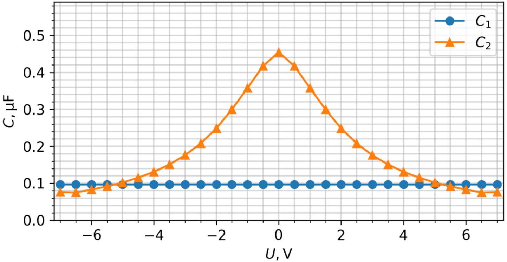
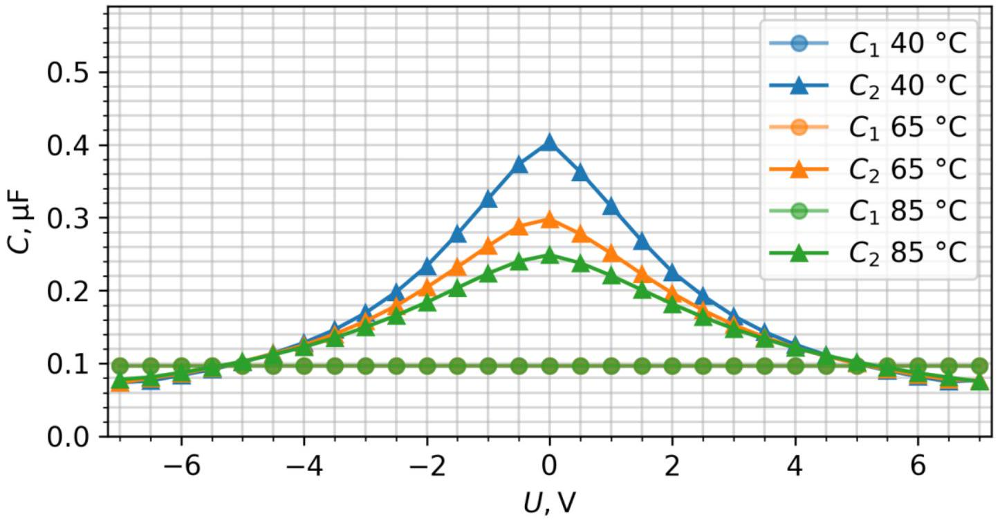
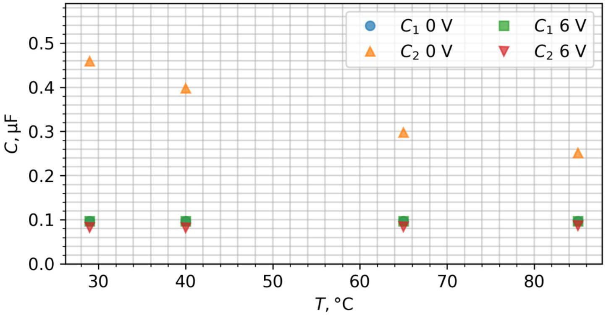

## Non-ideal capacitors (10 points)

## Capacitance measurement method:

First, measure the highest voltage the capacitor can reach by connecting it to the voltage source via jumper wire W2. Before each measurement, connect capacitor to starting voltage source with jumper wire W2 and to a final voltage source ( $U _ { f }$ ) with jumper wire W1 via the resistor R1. Capacitor C2 should be prepared that way for at least 10 s, while C1 measurement can be started immediately by disconnecting jumper wire W2 from the starting voltage source. To determine a precise value of the final voltage $U _ { f }$, it should be measured after capacitor has been connected to final source via R1 for a long time (at least 3 minutes). Then, the capacitance can be calculated from:

$$
C ( U ) = \frac { U _ { f } - U ( t ) } { R 1 } / \frac { \mathrm { d } U } { \mathrm {~d} t }
$$

When measuring C2, to ensure minimal change in charging current, capacitance should only be calculated in conditions where $U _ { f }$ and $U ( t )$ have different polarities. This way, capacitance dependence on voltage should be symmetrical around 0 V.

## Part A: Capacitors at room temperature (4 points)

A. 1 (2.3 pt)

Graph $C _ { 1 } ( U )$ should be constant, $C _ { 2 } ( U )$ must be highest at 0 V.
Example results measured at room temperature of 29 °C.

|  | $C _ { 1 }$ | $C _ { 2 }$ |
| :--- | :--- | :--- |
| 0 V | $0.100 \mu \mathrm {~F}$ | $0.473 \mu \mathrm {~F}$ |
| 3 V | $0.100 \mu \mathrm {~F}$ | $0.183 \mu \mathrm {~F}$ |
| 6 V | $0.100 \mu \mathrm {~F}$ | $0.086 \mu \mathrm {~F}$ |

$C ( U ) = \frac { U _ { f } - U ( t ) } { R 1 } / \frac { \mathrm { d } U } { \mathrm {~d} t }$.
A. 2 (0.5 pt)
$U _ { \text {max change } } = 1.6 \mathrm {~V}$ at capacitor C2
A. 3 (1.2 pt)
It's important to calculate $\int _ { 0 V } ^ { 6 V } C ( U ) d U$, not just attempt to multiply $C ( 6 \mathrm {~V} ) \cdot 6 \mathrm {~V}$

$$
q _ { 1 } = 0.60 \mu \mathrm { C } ; \quad q _ { 2 } = 1.3 \mu \mathrm { C }
$$

Part B: Calibrating NCT thermistor (1 point)
B. 1 (1.0 pt)
$R _ { 0 } = \frac { U _ { T 0 } R _ { 3 } } { U - U _ { T 0 } } \mathrm { e } ^ { - B / T }$,
where $U = 3.3 \mathrm {~V} , U _ { T 0 } - u T$ at room temperature, $T$ - room temperature in kelvins
$R _ { 0 } = 0.0341 \Omega$.

Part C: Capacitors at different temperatures (3 points)
C. 1 (1.3 pt)

Graphs $C _ { 1 } ( U , T )$ should always stay constant, $C _ { 2 } ( U )$ must be highest at 0 V

C. 2 (0.5 pt)

Graph $C _ { 1 } ( T )$ should always stay constant

C. 3 (1.2 pt)
$C _ { 1 } \left( 85 ^ { \circ } \mathrm { C } \right) / \left. C _ { 1 } \left( 40 ^ { \circ } \mathrm { C } \right) \right| _ { \mathrm { ov } } = 1.00$
$C _ { 1 } \left( 85 ^ { \circ } \mathrm { C } \right) / \left. C _ { 1 } \left( 40 ^ { \circ } \mathrm { C } \right) \right| _ { 6 \mathrm {~V} } = 1.00$
$C _ { 2 } \left( 85 ^ { \circ } \mathrm { C } \right) / \left. C _ { 2 } \left( 40 ^ { \circ } \mathrm { C } \right) \right| _ { 0 \mathrm {~V} } = 0.63$
$C _ { 2 } \left( 85 ^ { \circ } \mathrm { C } \right) / \left. C _ { 2 } \left( 40 ^ { \circ } \mathrm { C } \right) \right| _ { 6 \mathrm {~V} } = 1.06$

Part D: Sources of measurement errors (2 points)
D. 1 (1.0 pt)

Initial settings:

| S1 position | IN connection |
| :--- | :--- |
| C1 | -9V or GND |

Process:

| Step number | S1 position | IN connection | Duration, s | Measured variable |
| :--- | :--- | :--- | :--- | :--- |
| 1 | C1 | +9V | 0.2 s (any short time is good) |  |
| 2 | C1 | Free |  | $\| \mathrm { d } u C ( t ) \| / \mathrm { d } t$ |
| 3 | C1 | $+ 9 \mathrm {~V}$ | 5 s (has to be much longer than first) |  |
| 4 | C1 | Free |  | $\| \mathrm { d } u C ( t ) \| / \mathrm { d } t$ |
|  |  |  |  |  |
|  |  |  |  |  |

Verification: $| \mathrm { d } u C ( t ) | / \left. \mathrm { d } t \right| _ { 2 } = | \mathrm { d } u C ( t ) | / \left. \mathrm { d } t \right| _ { 4 }$
Main source of error: 1 (Leakage current.)

D. 2 (1.0 pt)

Initial settings:

| S1 position | IN connection |
| :--- | :--- |
| C2 | -9V or GND |

Process:

| Step number | S1 position | IN connection | Duration, s | Measured variable |
| :--- | :--- | :--- | :--- | :--- |
| 1 | C2 | +9V | 0.2 s (any short time is good) |  |
| 2 | C2 | Free |  | $\| \mathrm { d } u C ( t ) \| / \mathrm { d } t$ |
| 3 | C2 | +9V | 5 s (has to be much longer than first) |  |
| 4 | C2 | Free |  | $\| \mathrm { d } u C ( t ) \| / \mathrm { d } t$ |
|  |  |  |  |  |

Verification: $| \mathrm { d } u C ( t ) | / \left. \mathrm { d } t \right| _ { 2 } \gg | \mathrm {~d} u C ( t ) | / \left. \mathrm { d } t \right| _ { 4 }$
Alternatively,

$$
\frac { | \mathrm { d } u C ( t ) | / \left. \mathrm { d } t \right| _ { 2 } } { | \mathrm {~d} u C ( t ) | / \left. \mathrm { d } t \right| _ { 4 } } > 2 .
$$

Main source of error: 2 (Polarization properties of the capacitor's dielectric media)
