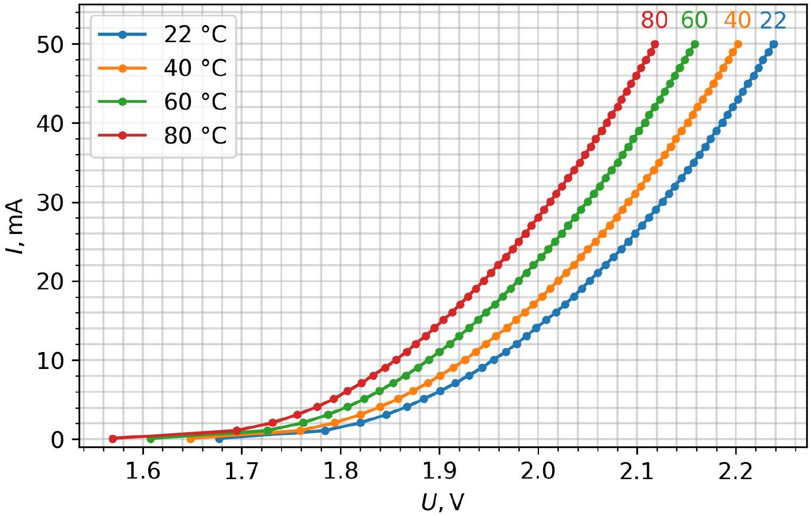
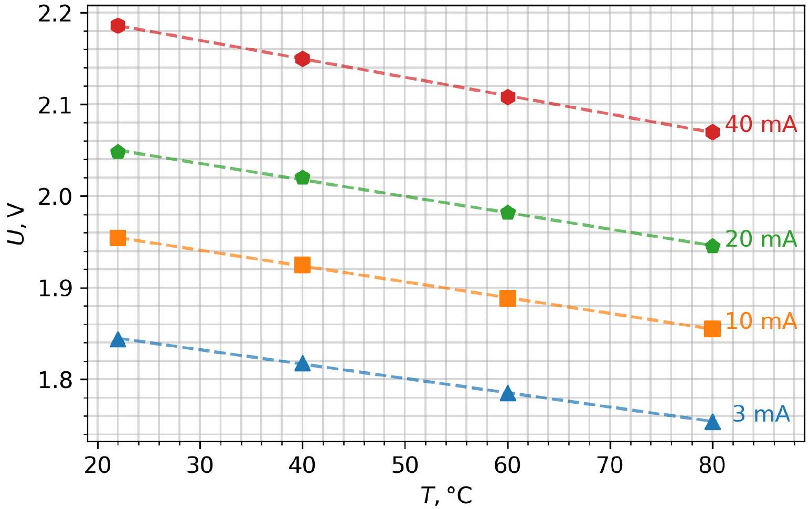
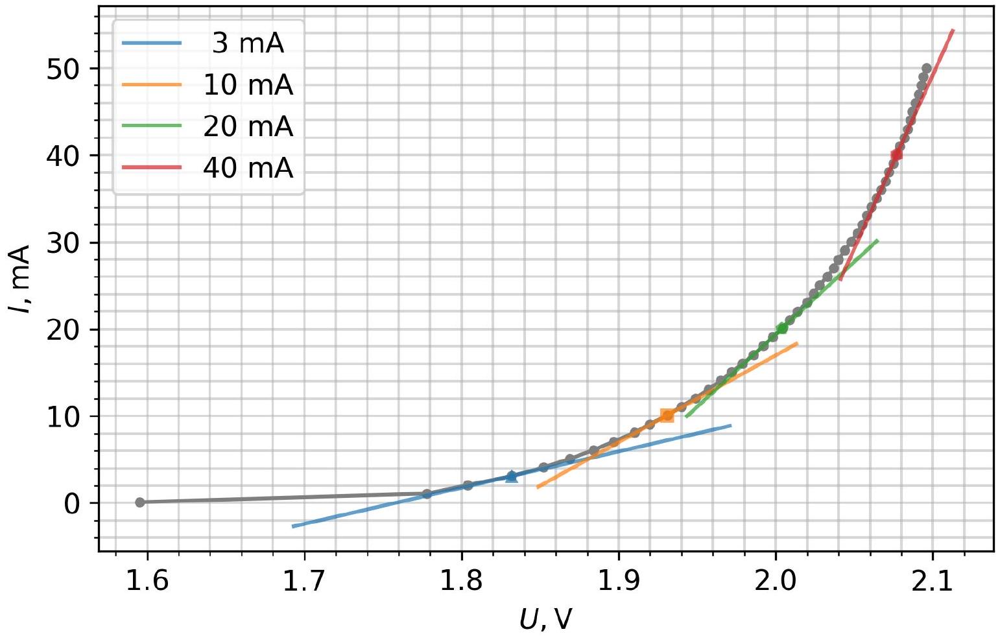
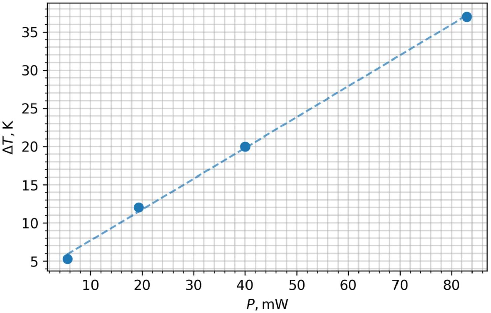

## Light Emitting Diodes (LEDs)

Volt-Ampere characteristics of the LED have to be measured in two modes: pulsed (part A) and continuous (part B). Running LED continuously produces a noticeable amount of heat, while running it in the pulsed mode allows minimizing and neglecting self-heating effect.

Students have to be able to run the automated $/ _ { \text {LED } } \left( U _ { \text {LED } } \right)$ measurement procedure and extract the required point by visually interpolating data for required values of $I _ { \text {LED. } }$.

The temperature of PCB is controlled by changing the current of the heating circuit. The heating and temperature measurement parts of this Experiment are identical to the Experiment 1.

Part A: Volt-ampere characteristics at different temperatures ( $\mathbf { 5 . 0 }$ points)
A. 1 (2.5 pt.)

Graph $I _ { \text {LED } } \left( U _ { \text {LED } } \right)$ has to be accurate (in right range) and smooth.

| A. 2 (1.0 pt.)   $U _ { \text {LED } } \left( I _ { \text {LED } } , T \right)$ : |  |  |  |  |
| :--- | :--- | :--- | :--- | :--- |
| $T$   $I _ { \text {LED } }$   3 mA   10 mA   20 mA   40 mA | "Room" 22 °C $40 ^ { \circ } \mathrm { C }$   1.844 V 1.818   1.954 1.925   2.048 2.02   2.186 2.15 |  | 60°C   1.785   1.888   1.982   2.108 | 80°C   1.754   1.855   1.945   2.07 |

A. 3 (1.5 pt.)

Graphed $U _ { \text {LED } } \left( I _ { \text {LED } } , T \right)$ from A. 2 data. $U _ { \text {LED } } ( T )$ should show clear linear trend and be approximated graphically. The slope $\left( \frac { \Delta U ( I , T ) } { \Delta T } \right)$ should also be calculated.

| $I _ { \text {LED } }$ | 3 mA | 10 mA | 20 mA | 40 mA |
| :--- | :--- | :--- | :--- | :--- |
| $\left( \frac { \Delta U ( I , T ) } { \Delta T } \right)$ | -1.55 mV/K | -1.7 mV/K | -1.8 mV/K | -2.0 mV/K |

Part B: Measurement of the LED Volt-Ampere characteristics at continuous driving current (3.5 points)
B. 1 (1.5 pt.)

Graph $I _ { \text {LED } } \left( U _ { \text {LED } } \right)$ has to be accurate (in right range) and smooth.

| $I _ { \text {LED } }$ | 3 mA | 10 mA | 20 mA | 40 mA |
| :--- | :--- | :--- | :--- | :--- |
| $U _ { \text {LED } }$ | 1.83 V | 1.93 V | 2.00 V | 2.08 V |
| $\Delta U$ | 0.014 V | 0.024 V | 0.048 V | 0.106 V |
| $T _ { \mathrm { J } }$ | $\sim 32.3 ^ { \circ } \mathrm { C }$ | ~43 °C | ~49 °C | $\sim 76.5 ^ { \circ } \mathrm { C }$ |
| $T _ { \text {PCB } }$ | $\sim 25 - 30 ^ { \circ } \mathrm { C }$ | $\sim 30 - 35 ^ { \circ } \mathrm { C }$ | $\sim 33 - 37 ^ { \circ } \mathrm { C }$ | $\sim 35 - 40 ^ { \circ } \mathrm { C }$ |

$T _ { \mathrm { J } }$ are the most important parameters to be calculated in this section.
$T _ { \mathrm { J } }$ have to be calculated by matching the $U _ { \mathrm { LED } }$ values of B section with calibration curves in A section at certain current values. This can be done by selecting the nearest points of A. 3 and calculating (interpolating) the $T _ { \mathrm { J } }$ using the calculated $\left( \frac { \Delta U ( I , T ) } { \Delta T } \right)$ coefficients. Graphical interpolation is also possible, but is not as accurate as the first one.

B. 2 (0.5 pt.)

The dynamic resistance of the LED has to be calculated as derivative at the asked values of $I _ { \text {LED } }$.

| $I _ { \text {LED } }$ | 3 mA | 10 mA | 20 mA | 40 mA |
| :--- | :--- | :--- | :--- | :--- |
| $\frac { \mathrm { d } I } { \mathrm {~d} U }$ | 41.6 mA/V | 100 mA/V | 166.7 mA/V | 400 mA/V |

B. 3 (1.5 pt.)

Graphed $\Delta T ( P )$.
$\Delta T$ for each $I _ { \text {LED } }$ has to be calculated as $\Delta T = T _ { \mathrm { J } } - T _ { \text {PCB } }$ from the data of B.1.
Caution: during the measurement of B.1, the temperature of the PCB is not constant and rises up to ~7 °C above the "room" temperature at higher currents. This has to be taken into account when calculating $\Delta T$.
The generated heat is taken as electrical power: $P = I _ { \text {LED } } \times U _ { \text {LED } }$. The energy emitted by the escaping light is neglected.
The graph should have a clear linear trend and approximated graphically. Thermal resistance is calculated as linear slope $\frac { \mathrm { d } } { \mathrm { d } P } ( \Delta T ( P ) ) \cong 400 \mathrm {~K} / \mathrm { W }$.

| $I _ { \text {LED } }$ | 3 mA | 10 mA | 20 mA | 40 mA |
| :--- | :--- | :--- | :--- | :--- |
| $\Delta T$ | 5.0 K | 12 K | 20 K | 37 K |

## Part C: Calculation of the LED current drift due to the temperature (1.5 points).

C. 1 (1.5 pt)

Method 1:
The $I _ { \text {LED } }$ under constant $U _ { \text {LED } } = U _ { 20 \text { mA } }$ is calculated (estimated):

$$
I _ { \mathrm { LED } } \left( U _ { 20 \mathrm {~mA} } , T \right) = 20 \mathrm {~mA} - \left( T - T _ { \mathrm { PCB } } \right) \times \left( \frac { \Delta U ( 20 \mathrm {~mA} , T ) } { \Delta T } \right) \times \frac { \mathrm { d } I ( 20 \mathrm {~mA} , U ) } { \mathrm { d } U } .
$$

To be accurate, we have to understand, that $\frac { \mathrm { d } I ( 20 \mathrm {~mA} , U ) } { \mathrm { d } U }$ from B. 1 involves the temperature increase of the PCB with rising current, but there is no technical capabilities to perform the measurements at constant PCB temperature. Furthermore, since the current is decreasing significantly, application of the derivatives at 20 mA is not very accurate.

Method 2:
The required values can be calculated by interpolating/extrapolating A. 3 data with $T _ { \mathrm { J } }$ calculated using $\Delta T$ values from B.3. Accuracy in this way suffers a bit due to the dependence of electrical power $P$ on temperature.

$$
I _ { L E D } \left( U _ { 20 \mathrm {~mA} } , 0 ^ { \circ } \mathrm { C } \right) \cong 10 - 15 \mathrm {~mA} , \quad I _ { L E D } \left( U _ { 20 \mathrm {~mA} } , 40 ^ { \circ } \mathrm { C } \right) \cong 22 \mathrm {~mA} .
$$
