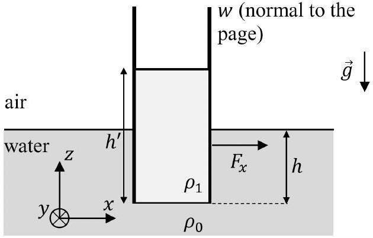
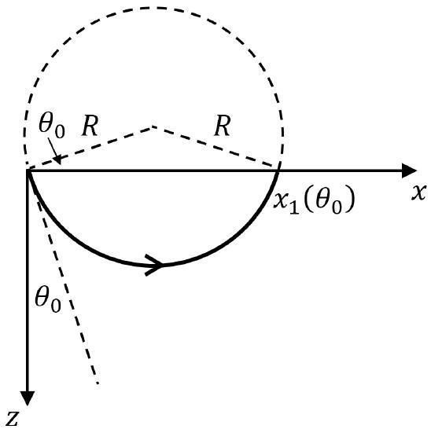
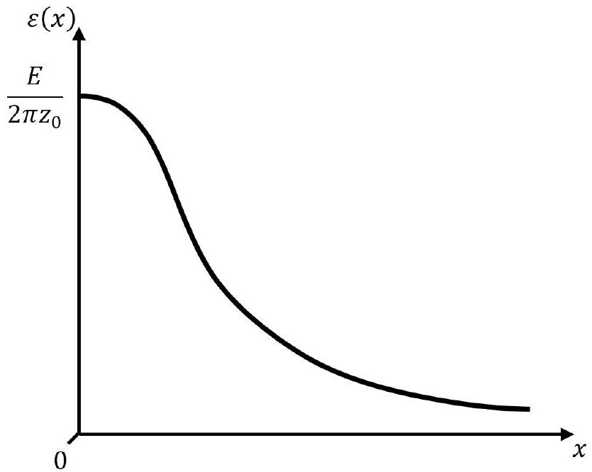

## Planetary Physics (10 points)

Part A. Mid-ocean ridge (5.0 points)
A. 1 (0.8 points)

Figure 1

Let $h ^ { \prime }$ be the height of the column of oil (see Fig. 1). Then pressure at depth $h$ below the water surface must be $p _ { h } = \rho _ { 0 } g h = \rho _ { \text {oil } } g h ^ { \prime }$, from where $h ^ { \prime } = \frac { \rho _ { 0 } } { \rho _ { \text {oil } } } h$. Horizontal force on the plate $F _ { x } = F _ { 1 } - F _ { 0 }$, where the force due to new fluid is $F _ { 1 } = \frac { \rho _ { \text {oil } } g h ^ { \prime } } { 2 } \cdot h ^ { \prime } w$ and the force due to water is $F _ { 0 } = \frac { \rho _ { 0 } g h } { 2 } \cdot h w$.

Combining all the equation above, we get

$$
F _ { x } = \left( \frac { \rho _ { 0 } } { \rho _ { \mathrm { oil } } } - 1 \right) \frac { \rho _ { 0 } g h ^ { 2 } w } { 2 } .
$$

This force acts on the right plate to the right.
A. 2 (0.6 points)

Consider a rectangular mass element of the crust. Since relation $l ( T ) = l _ { 1 } \left[ 1 - k _ { l } \left( T _ { 1 } - T \right) / \left( T _ { 1 } - T _ { 0 } \right) \right]$ holds for all three dimensions of the solid, its volume $V$ satisfies

$$
V = V _ { 1 } \left( 1 - k _ { l } \frac { T _ { 1 } - T } { T _ { 1 } - T _ { 0 } } \right) ^ { 3 } ,
$$

where $V _ { 1 }$ is the volume at $T = T _ { 1 }$. If the mass of the element is $m$, density is then

$$
\rho ( T ) = \frac { m } { V } = \frac { m } { V _ { 1 } } \left( 1 - k _ { l } \frac { T _ { 1 } - T } { T _ { 1 } - T _ { 0 } } \right) ^ { - 3 } = \rho _ { 1 } \left( 1 - k _ { l } \frac { T _ { 1 } - T } { T _ { 1 } - T _ { 0 } } \right) ^ { - 3 } .
$$

Since $k _ { l } \ll 1$, this can be approximated as

$$
\rho ( T ) \approx \rho _ { 1 } \left( 1 + 3 k _ { l } \frac { T _ { 1 } - T } { T _ { 1 } - T _ { 0 } } \right) ,
$$

so that $k = 3 k _ { l }$.

## A. 3 (1.1 points)

Since mantle behaves like a fluid in hydrostatic equilibrium, pressure $p ( x , z )$ at $z = h + D$ must be the same for all $x$. Therefore,

$$
p ( 0 , h + D ) = p ( \infty , h + D ) .
$$

Similarly, we must have

$$
p ( 0,0 ) = p ( \infty , 0 ) .
$$

Hence, the change in pressure between $z = 0$ and $z = \infty$ must be the same at both $x = 0$ and $x = \infty$. At the ridge axis

$$
p ( 0 , h + D ) - p ( 0,0 ) = \rho _ { 1 } g ( h + D ) ,
$$

while far away

$$
p ( \infty , h + D ) - p ( \infty , 0 ) = \rho _ { 0 } g h + \int _ { h } ^ { h + D } \rho ( T ( \infty , z ) ) g \mathrm {~d} z .
$$

Since the temperature of the crust at $x = \infty$ depends linearly on height, after applying the relevant temperature boundary conditions,

$$
T ( \infty , z ) = T _ { 0 } + \left( T _ { 1 } - T _ { 0 } \right) \frac { z - h } { D } .
$$

From all the equations above and by using the density formula given in the problem text,

$$
\rho _ { 1 } g ( h + D ) = \rho _ { 0 } g h + \int _ { h } ^ { h + D } \rho _ { 1 } \left( 1 + k \frac { T _ { 1 } - T _ { 0 } - \left( T _ { 1 } - T _ { 0 } \right) \frac { z - h } { D } } { T _ { 1 } - T _ { 0 } } \right) g \mathrm {~d} z ,
$$

from where we straightforwardly obtain

$$
D = \frac { 2 } { k } \left( 1 - \frac { \rho _ { 0 } } { \rho _ { 1 } } \right) h .
$$

## A. 4 (1.6 points)

The net horizontal force on the half of the ridge is the difference between the pressure forces acting at $x = 0$ and $x = \infty$ :

$$
F = L \int _ { 0 } ^ { h + D } p ( 0 , z ) \mathrm { d } z - L \int _ { 0 } ^ { h } p ( \infty , z ) .
$$

From considerations of the previous question, pressure at $x = 0$ is

$$
p ( 0 , z ) = p ( 0,0 ) + \rho _ { 1 } g z ,
$$

while very far away

$$
p ( \infty , z ) = p ( \infty , 0 ) + \rho _ { 0 } g z
$$

The equations above can be combined into

$$
F = L \int _ { 0 } ^ { h + D } \left( p ( 0,0 ) + \rho _ { 1 } g z \right) \mathrm { d } z - L \int _ { 0 } ^ { h } \left( p ( \infty , 0 ) + \rho _ { 0 } g z \right) \mathrm { d } z
$$

After a straightforward integration and using $p ( 0,0 ) = p ( \infty , 0 )$,

$$
F = L p ( 0,0 ) D + L \rho _ { 1 } g \frac { ( h + D ) ^ { 2 } } { 2 } - L \rho _ { 0 } g \frac { h ^ { 2 } } { 2 } .
$$

Since $k \ll 1$, and $D \propto k ^ { - 1 }$, the term with $D ^ { 2 } \propto k ^ { - 2 }$ is of the leading order, hence, after substituting the result of A.3, the required answer is

$$
F \approx \frac { 2 g L h ^ { 2 } \left( \rho _ { 1 } - \rho _ { 0 } \right) ^ { 2 } } { k ^ { 2 } \rho _ { 1 } } .
$$

## A. 5 (0.9 points)

Method 1: dimensional analysis. The timescale $\tau$ is expected to depend only on density of the crust $\rho _ { 1 }$, its specific heat $c$, thermal conductivity $\kappa$ and thickness $D$. Hence, we can write

$$
\tau = A \rho _ { 1 } ^ { \alpha } c ^ { \beta } \kappa ^ { \gamma } D ^ { \delta } ,
$$

where $A$ is a dimensionless constant. We will obtain the powers $\alpha - \delta$ via dimensional analysis.
Define the symbols for different dimensions: L for length, M for mass, T for time and $\Theta$ for temperature. Then $\tau , \rho _ { 1 } , c , \kappa$ and $D$ have dimensions $\mathrm { T } , \mathrm { ML } ^ { - 3 } , \mathrm {~L} ^ { 2 } \mathrm {~T} ^ { - 2 } \Theta ^ { - 1 } , \mathrm { MLT } ^ { - 3 } \Theta ^ { - 1 }$ and L, respectively. The resulting set of linear equations to balance the powers of length, mass, time and temperature, respectively, is

$$
\left\{ \begin{array} { l }
0 = - 3 \alpha + 2 \beta + \gamma + \delta , \\
0 = \alpha + \gamma , \\
1 = - 2 \beta - 3 \gamma , \\
0 = - \beta - \gamma .
\end{array} \right.
$$

This gives $\alpha = \beta = 1 , \gamma = - 1 , \delta = 2$. Hence,

$$
\tau = A \frac { c \rho _ { 1 } D ^ { 2 } } { \kappa } .
$$

Method 2: scale analysis. Consider a piece of crust of area $S$. Heat flux that has to be transmitted through the crust is of order $Q \sim c \rho _ { 1 } S D \Delta T$, where $\Delta T = T _ { 1 } - T _ { 0 }$. On the other hand, the law of thermal conductivity gives that $\kappa \frac { \Delta T } { D } \sim \frac { Q } { S \tau }$.

From the two equations, $c \rho _ { 1 } S D \Delta T \sim S \tau \kappa \frac { \Delta T } { D }$, from where we get that $\tau$ is independent of $\Delta T$ and

$$
\tau \sim \frac { c \rho _ { 1 } D ^ { 2 } } { \kappa } .
$$

## Part B. Seismic waves in a stratified medium (5.0 points)

## B. 1 (1.5 points)

Seismic waves in this problem can be treated by using ray theory. Namely, their propagation is described by the Snell's law of refraction

$$
n ( 0 ) \sin \theta _ { 0 } = n ( z ) \sin \theta ,
$$

where the refractive index is

$$
n ( z ) = \frac { c } { v ( z ) } = \frac { c } { v _ { 0 } \left( 1 + \frac { z } { z _ { 0 } } \right) }
$$

and $c$ denotes the seismic wave speed in a material with refractive index $n = 1$. From the two equations above we have

$$
v _ { 0 } \left( 1 + \frac { z } { z _ { 0 } } \right) \sin \theta _ { 0 } = v _ { 0 } \sin \theta .
$$

Method 1. Since this describes an arc of a circle, we have that at $\theta = \frac { \pi } { 2 } , z = R - R \sin \theta _ { 0 }$ (Fig. 2), giving

$$
\left( 1 + \frac { R - R \sin \theta _ { 0 } } { z _ { 0 } } \right) \sin \theta _ { 0 } = 1 ,
$$

from where the circle radius $R = \frac { z _ { 0 } } { \sin \theta _ { 0 } }$. From simple geometry we get

$$
x _ { 1 } \left( \theta _ { 0 } \right) = 2 R \cos \theta _ { 0 } ,
$$

leading to

$$
x _ { 1 } \left( \theta _ { 0 } \right) = 2 z _ { 0 } \cot \theta _ { 0 } ,
$$

i.e. $A = 2 z _ { 0 }$ and $b = 1$.

Figure 2

Method 2. Implicitly differentiating $v _ { 0 } \left( 1 + \frac { z } { z _ { 0 } } \right) \sin \theta _ { 0 } = v _ { 0 } \sin \theta$ gives

$$
\frac { \mathrm { d } z } { z _ { 0 } } \sin \theta _ { 0 } = \cos \theta \mathrm { d } \theta
$$

An infinitesimal ray path length $\mathrm { d } l$ is related to the change in the vertical coordinate via

$$
\mathrm { d } z = \mathrm { d } l \cos \theta ,
$$

giving

$$
\mathrm { d } l = \frac { z _ { 0 } } { \sin \theta _ { 0 } } \mathrm {~d} \theta
$$

This is an equation of an arc of a circle of radius $R = \frac { z _ { 0 } } { \sin \theta _ { 0 } }$
Alternatively, instead of considering an infinitesimal ray path length $\mathrm { d } l$, one can obtain the answer by writing

$$
\cot \theta = \frac { \mathrm { d } z } { \mathrm {~d} x } = \frac { \mathrm { d } z } { \mathrm {~d} \theta } \frac { \mathrm {~d} \theta } { \mathrm {~d} x } .
$$

The first derivative can be eliminated via Snell's law, leading to

$$
\cot \theta = \frac { z _ { 0 } \cos \theta } { \sin \theta _ { 0 } } \frac { \mathrm {~d} \theta } { \mathrm {~d} x } ,
$$

which can be integrated to get

$$
x _ { 1 } = - \frac { z _ { 0 } } { \sin \theta _ { 0 } } \int _ { \text {start } } ^ { \text {end } } \mathrm { d } \cos \theta = \frac { 2 z _ { 0 } \cos \theta _ { 0 } } { \sin \theta _ { 0 } } ,
$$

where we used Snell's law again to get that the ray has $\cos \theta = - \cos \theta _ { 0 }$ at the point where it reaches the surface.

## B. 2 (1.5 points)

In two dimensions, $\frac { E } { \pi } \mathrm {~d} \theta _ { 0 }$ is the energy carried by rays that are emitted within interval [ $\theta _ { 0 } , \theta _ { 0 } + \mathrm { d } \theta _ { 0 }$ ). On the other hand, the energy carried by rays that arrive at $[ x , x + \mathrm { d } x )$ is $\varepsilon \mathrm { d } x$. Therefore,

$$
\varepsilon = \frac { E } { \pi } \left| \frac { \mathrm {~d} \theta _ { 0 } } { \mathrm {~d} x } \right| .
$$

Using the result of question B.1,

$$
\frac { \mathrm { d } x } { \mathrm {~d} \theta _ { 0 } } = - \frac { A b } { \sin ^ { 2 } \left( b \theta _ { 0 } \right) } = - A b \left( 1 + \cot ^ { 2 } \left( b \theta _ { 0 } \right) \right) = - \frac { b \left( A ^ { 2 } + x ^ { 2 } \right) } { A } .
$$

Hence,

$$
\varepsilon ( x ) = \frac { E A } { \pi b \left( A ^ { 2 } + x ^ { 2 } \right) } = \frac { 2 E z _ { 0 } } { \pi \left( 4 z _ { 0 } ^ { 2 } + x ^ { 2 } \right) } .
$$

This function is plotted in Fig. 3.

Figure 3. Plot of the function $\varepsilon ( x )$.

## B. 3 (2.0 points)

Define $x _ { - } = x _ { 1 } \left( \theta _ { 0 } - \frac { \delta \theta _ { 0 } } { 2 } \right)$ and $x _ { + } = x _ { 1 } \left( \theta _ { 0 } + \frac { \delta \theta _ { 0 } } { 2 } \right)$. To the leading order in $\delta \theta _ { 0 } , x _ { - } \approx x _ { + } \approx x _ { 1 } \left( \theta _ { 0 } \right)$. With each reflection of the signal, the horizontal distance between the points where the edges of the signal reflect increases by $\left| x _ { + } - x _ { - } \right| = x _ { - } - x _ { + }$. When moving along the positive $x$-axis, these zones get wider until they overlap. If this happens after $N$ reflections, then

$$
N \approx \frac { x _ { 1 } \left( \theta _ { 0 } \right) } { x _ { - } - x _ { + } } ,
$$

where the approximate sign tends to equality as $\delta \theta _ { 0 } \rightarrow 0$.
The position where the zones start to overlap is at $x _ { \text {max } } = N x _ { 1 } \left( \theta _ { 0 } \right)$. Therefore,

$$
x _ { \max } = \frac { x _ { 1 } \left( \theta _ { 0 } \right) ^ { 2 } } { x _ { 1 } \left( \theta _ { 0 } - \frac { \delta \theta _ { 0 } } { 2 } \right) - x _ { 1 } \left( \theta _ { 0 } + \frac { \delta \theta _ { 0 } } { 2 } \right) } .
$$

Since $\delta \theta _ { 0 } \ll \theta _ { 0 }$, we can approximate

$$
x _ { 1 } \left( \theta _ { 0 } - \frac { \delta \theta _ { 0 } } { 2 } \right) - x _ { 1 } \left( \theta _ { 0 } + \frac { \delta \theta _ { 0 } } { 2 } \right) \approx - \frac { \mathrm { d } x _ { 1 } \left( \theta _ { 0 } \right) } { \mathrm { d } \theta _ { 0 } } \delta \theta _ { 0 } = \frac { A b } { \sin ^ { 2 } \left( b \theta _ { 0 } \right) } \delta \theta _ { 0 } .
$$

Combining the last two equations and substituting the $x _ { 1 } \left( \theta _ { 0 } \right)$ expression gives

$$
x _ { \max } = \frac { A \cos ^ { 2 } \left( b \theta _ { 0 } \right) } { b \delta \theta _ { 0 } } = \frac { 2 z _ { 0 } \cos ^ { 2 } \theta _ { 0 } } { \delta \theta _ { 0 } } .
$$
