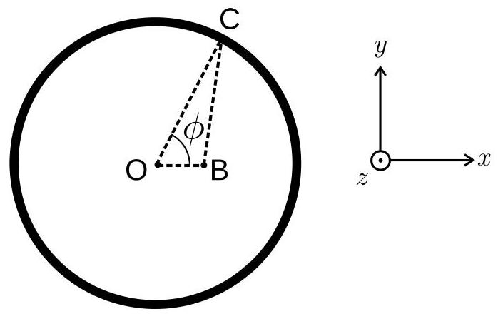
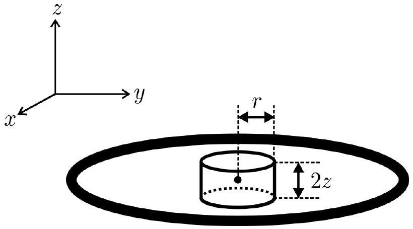
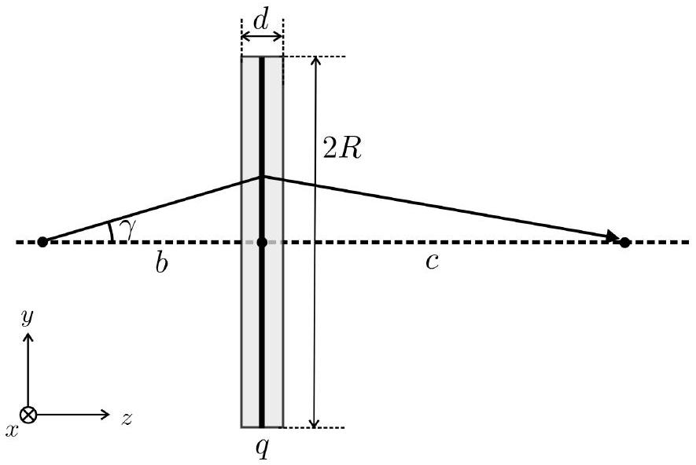
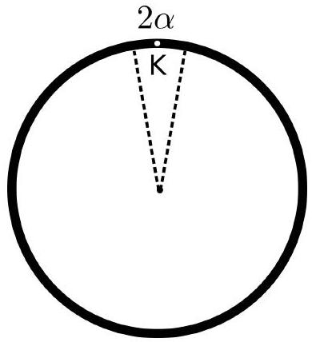
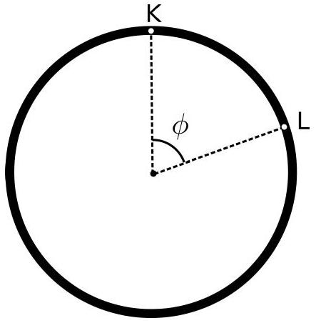
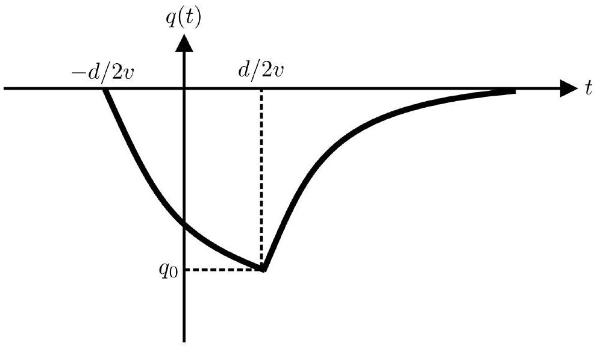

## Electrostatic lens (10 points)

## Part A. Electrostatic potential on the axis of the ring (1 point)

## A. 1 (0.3 points)

The linear charge density of the ring is $\lambda = q / ( 2 \pi R )$. All the points of the ring are situated a distance $\sqrt { R ^ { 2 } + z ^ { 2 } }$ away from point A. Integrating over the whole ring we readily obtain:

$$
\Phi ( z ) = \frac { q } { 4 \pi \varepsilon _ { 0 } } \frac { 1 } { \sqrt { R ^ { 2 } + z ^ { 2 } } } .
$$

## A. 2 (0.4 points)

Using an expansion in powers of $z$ we obtain:

$$
\Phi ( z ) = \frac { q } { 4 \pi \varepsilon _ { 0 } } \frac { 1 } { \sqrt { R ^ { 2 } + z ^ { 2 } } } = \frac { q } { 4 \pi \varepsilon _ { 0 } R } \frac { 1 } { \sqrt { 1 + \left( \frac { z } { R } \right) ^ { 2 } } } \approx \frac { q } { 4 \pi \varepsilon _ { 0 } R } \left( 1 - \frac { z ^ { 2 } } { 2 R ^ { 2 } } \right) .
$$

## A. 3 (0.2 points)

The potential energy of the electron is $V ( z ) = - e \Phi ( z )$. The force acting on the electron is

$$
F ( z ) = - \frac { \mathrm { d } V ( z ) } { \mathrm { d } z } = + e \frac { \mathrm {~d} \Phi } { \mathrm {~d} z } = - \frac { q e } { 4 \pi \varepsilon _ { 0 } R ^ { 3 } } z .
$$

If this is a restoring force, it should be negative for positive $z$. Thus, $q > 0$.

## A. 4 (0.1 points)

The equation of motion for an electron is

$$
m \ddot { z } + \frac { q e } { 4 \pi \varepsilon _ { 0 } R ^ { 3 } } z = 0
$$

(here dots denote time derivatives). We therefore get

$$
\omega = \sqrt { \frac { q e } { 4 \pi m \varepsilon _ { 0 } R ^ { 3 } } } .
$$

## Part B. Electrostatic potential in the plane of the ring (1.7 points)

## B. 1 (1.5 points)

There are two different ways to solve this problem: (i) using direct integration; (ii) using Gauss's law and the result of part A.

Figure 1: Calculating electrostatic potential in the plane of the ring through direct integration.

(i) Direct integration. We will follow the notations of Figure 1. Since the potential has cylindrical symmetry, let the point B , where we calculate the potential, be on the $x$-axis. Let

$$
| \mathrm { OB } | = r ; | \mathrm { OC } | = R .
$$

Thus:

$$
| \mathrm { BC } | ^ { 2 } = R ^ { 2 } + r ^ { 2 } - 2 R r \cos \phi .
$$

Electrostatic potential created by ring element $\mathrm { d } \phi$ at the point B :

$$
\mathrm { d } \Phi = \frac { 1 } { 4 \pi \varepsilon _ { 0 } } \frac { \lambda R \mathrm {~d} \phi } { \sqrt { R ^ { 2 } + r ^ { 2 } - 2 R r \cos \phi } } = \frac { 1 } { 4 \pi \varepsilon _ { 0 } } \frac { \lambda \mathrm {~d} \phi } { \sqrt { 1 + \frac { r ^ { 2 } } { R ^ { 2 } } - 2 \frac { r } { R } \cos \phi } } .
$$

Using the expansion given in the formulation of the problem for $\varepsilon = - 1 / 2$ we have:

$$
\mathrm { d } \Phi \approx \frac { \lambda \mathrm {~d} \phi } { 4 \pi \varepsilon _ { 0 } } \left[ 1 - \frac { 1 } { 2 } \left( \frac { r ^ { 2 } } { R ^ { 2 } } - 2 \frac { r } { R } \cos \phi \right) + \frac { 3 } { 8 } \left( \frac { r ^ { 2 } } { R ^ { 2 } } - 2 \frac { r } { R } \cos \phi \right) ^ { 2 } \right] .
$$

Ignoring the terms of the order $r ^ { 3 }$ and $r ^ { 4 }$ we get:

$$
\mathrm { d } \Phi \approx \frac { \lambda \mathrm {~d} \phi } { 4 \pi \varepsilon _ { 0 } } \left[ 1 + \frac { r } { R } \cos \phi + \frac { r ^ { 2 } } { R ^ { 2 } } \left( \frac { 3 } { 2 } \cos ^ { 2 } \phi - \frac { 1 } { 2 } \right) \right] .
$$

Integrating over all angles we finally obtain:

$$
\Phi ( r ) = \frac { \lambda } { 4 \pi \varepsilon _ { 0 } } \int _ { 0 } ^ { 2 \pi } \left[ 1 + \frac { r } { R } \cos \phi + \frac { r ^ { 2 } } { R ^ { 2 } } \left( \frac { 3 } { 2 } \cos ^ { 2 } \phi - \frac { 1 } { 2 } \right) \right] \mathrm { d } \phi .
$$

$$
\Phi ( r ) = \frac { q } { 4 \pi \varepsilon _ { 0 } R } \left( 1 + \frac { r ^ { 2 } } { 4 R ^ { 2 } } \right) .
$$

From here, comparing with the expression $\Phi ( r ) = q \left( \alpha + \beta r ^ { 2 } \right)$, we obtain

$$
\beta = \frac { 1 } { 16 \pi \varepsilon _ { 0 } R ^ { 3 } } .
$$

(ii) Gauss's law.

Figure 2: Calculating electrostatic potential in the plane of the ring via Gauss's law.

Let us analyze a small cylinder of radius $r$. The center of the cylinder coincides with the center of the ring. In part A we analyzed the potential along the $z$-axis, while in this part we analyze the potential along the radius $r$. For any $z \ll R$ and $r \ll R$ the potential has an expression:

$$
\Phi ( z , r ) = \frac { q } { 4 \pi \varepsilon _ { 0 } R } \left( 1 - \frac { z ^ { 2 } } { 2 R ^ { 2 } } \right) + q \beta r ^ { 2 } .
$$

The lowest order terms are quadratic in $r$ and $z$. Due to reflection symmetry the potential does not contain terms of the type $r z$. This, for example, immediately gives us $\alpha = 1 / \left( 4 \pi \varepsilon _ { 0 } R \right)$. Thus, for small $r$ and $z$ electric fields in the radial and axial directions are:

$$
\mathcal { E } _ { z } ( z , r ) = + \frac { q } { 4 \pi \varepsilon _ { 0 } R ^ { 3 } } z , \quad \mathcal { E } _ { r } ( z , r ) = - 2 q \beta r .
$$

Applying Gauss's law to the cylinder we obtain:

$$
\oint \overrightarrow { \mathcal { E } } \cdot \mathrm { d } \vec { S } = 0 \quad \Rightarrow \quad \int _ { \text {side } } \overrightarrow { \mathcal { E } } \cdot \mathrm { d } \vec { S } + \int _ { \text {base } } \overrightarrow { \mathcal { E } } \cdot \mathrm { d } \vec { S } = 0 .
$$

The second integral is:

$$
\int _ { \text {base } } \overrightarrow { \mathcal { E } } \cdot \mathrm { d } \vec { S } = 2 \pi r ^ { 2 } \mathcal { E } _ { z } ( z , r ) = \frac { q z r ^ { 2 } } { 2 \varepsilon _ { 0 } R ^ { 3 } }
$$

The first integral is:

$$
\int _ { \text {side } } \overrightarrow { \mathcal { E } } \cdot \mathrm { d } \vec { S } = 4 \pi r z \mathcal { E } _ { r } ( z , r ) = - 8 \pi q \beta r ^ { 2 } z
$$

Gauss's theorem thus gives:

$$
\frac { q z r ^ { 2 } } { 2 \varepsilon _ { 0 } R ^ { 3 } } - 8 \pi q \beta r ^ { 2 } z = 0
$$

This immediately yields

$$
\beta = \frac { 1 } { 16 \pi \varepsilon _ { 0 } R ^ { 3 } } ,
$$

which agrees with the result obtained via direct integration.

## B. 2 ( 0.2 points)

The potential of the electron is $V ( r ) = - e \Phi ( r )$. Force acting on the electron in the $x y$ plane is

$$
F ( r ) = - \frac { \mathrm { d } V ( r ) } { \mathrm { d } r } = + e \frac { \mathrm {~d} \Phi ( r ) } { \mathrm { d } r } = \frac { q e } { 8 \pi \varepsilon _ { 0 } R ^ { 3 } } r .
$$

To have oscilations we need the force to be negative for $r > 0$. Thus, $q < 0$.

## Part $C$. The focal length of the idealized electrostatic lens ( 2.3 points)

## C. 1 (1.3 points)

Let us consider an electron with the velocity $v = \sqrt { 2 E / m }$ at a distance $r$ from the "optical" axis (Figure 2 of the problem). The electron crosses the "active region" of the lens in time

$$
t = \frac { d } { v } .
$$

The equation of motion in the $r$ direction:

$$
m \ddot { r } = 2 e q \beta r .
$$

During the time the electron crosses the active region of the lens, the electron acquires radial velocity:

$$
v _ { r } = \frac { 2 e q \beta r } { m } \frac { d } { v } < 0 .
$$

The lens will be focusing if $q < 0$. The time it takes for an electron to reach the "optical" axis is:

$$
t ^ { \prime } = \frac { r } { \left| v _ { r } \right| } = - \frac { m v } { 2 e q \beta d } .
$$

During this time the electron travels in the $z$-direction a distance

$$
\Delta z = t ^ { \prime } v = - \frac { m v ^ { 2 } } { 2 e q \beta d } = - \frac { E } { e q d \beta } .
$$

$\Delta z$ does not depend on the radial distance $r$, therefore all electron will cross the "optical" axis (will be focused) in the same spot. Thus,

$$
f = - \frac { E } { e q d \beta } .
$$

## C. 2 (0.8 points)

Figure 3: Focusing of electrons.

Let us consider an electron emitted an an angle $\gamma$ to the optical axis (Figure 3). Its initial velocity in the radial direction is:

$$
v _ { r ; 0 } = v \sin \gamma \approx v \gamma \approx v \frac { r } { b } ,
$$

where $r$ is the radial distance of the electron when it reaches the plane of the ring. The velocity in the $z$-direction is

$$
v _ { z } = v \cos \gamma \approx v .
$$

For small angles $\gamma$ the additional velocity in the $r$-direction acquired in the "active region" is the same as in part C.1. Thus, the radial velocity after crossing the active region is

$$
v _ { r } = v \frac { r } { b } + \frac { 2 e q \beta r } { m } \frac { d } { v } ,
$$

where the first term is positive and the second term is negative, since $q < 0$. If the electrons are focused, then $v _ { r } < 0$ (this can be verified after obtaining the final result). The electron will reach the optical axis in time

$$
t ^ { \prime } = \frac { r } { \left| v _ { r } \right| } = - \frac { r } { \frac { 2 e q \beta r } { m } \frac { d } { v } + v \frac { r } { b } } = - \frac { 1 } { \frac { 2 e q \beta } { m } \frac { d } { v } + \frac { v } { b } } .
$$

During this time it will travel a distance

$$
c = t ^ { \prime } v = - \frac { 1 } { \frac { 2 e q \beta } { m } \frac { d } { v ^ { 2 } } + \frac { 1 } { b } } = - \frac { 1 } { \frac { e q \beta d } { E } + \frac { 1 } { b } } .
$$

## C. 3 (0.2 pt)

From the previous answer we obtain:

$$
\frac { 1 } { b } + \frac { 1 } { c } = - \frac { e q \beta d } { E } .
$$

Comparing with the answer of C. 1 we immediately obtain

$$
\frac { 1 } { b } + \frac { 1 } { c } = \frac { 1 } { f }
$$

i.e. the equation of a thin optical lens is valid for an electrostatic lens as well.

## Part D. The ring as a capacitor (3 points)

## D. 1 (2.0 points)

Figure 4: Calculation of the capacitance of the ring.

Let us sub-divide the entire ring into two parts: a part corresponding to the angle $2 \alpha \ll 1$, and the rest of the ring, as shown in Figure 4. While the angle is small in comparison to 1, let us assume that the length of the first part, $\alpha R$, is still large compared to $a ( \alpha R \gg a )$. Let us calculate the electrostatic potential $\Phi$ at point K. It it a sum of two terms: the first one produced by the cut-out part with an angle $2 \alpha$ (contribution $\Phi _ { 1 }$ ) and the second one originating from the rest of the ring (contribution $\Phi _ { 2 }$ ).

Contribution $\Phi _ { 1 }$. Since $\alpha \ll 1$, we can neglect the curvature of the cylinder that is cut out from the ring. The linear charge density on the ring is $\lambda = \frac { q } { 2 \pi R }$. The potential at the center of the cylinder is then given by an integral:

$$
\Phi _ { 1 } = 2 \frac { 1 } { 4 \pi \varepsilon _ { 0 } } \frac { q } { 2 \pi R } \int _ { 0 } ^ { \alpha R } \frac { \mathrm {~d} x } { \sqrt { x ^ { 2 } + a ^ { 2 } } } = \frac { q } { 4 \pi ^ { 2 } \varepsilon _ { 0 } R } \int _ { 0 } ^ { \alpha R } \frac { \mathrm {~d} ( x / a ) } { \sqrt { 1 + ( x / a ) ^ { 2 } } } = \frac { q } { 4 \pi ^ { 2 } \varepsilon _ { 0 } R } \int _ { 0 } ^ { \alpha R / a } \frac { \mathrm {~d} y } { \sqrt { 1 + y ^ { 2 } } } .
$$

Using the integral provided in the description of the problem we get:

$$
\Phi _ { 1 } = \left. \frac { q } { 4 \pi ^ { 2 } \varepsilon _ { 0 } R } \ln \left( y + \sqrt { 1 + y ^ { 2 } } \right) \right| _ { 0 } ^ { \alpha R / a } = \frac { q } { 4 \pi ^ { 2 } \varepsilon _ { 0 } R } \ln \left( \frac { \alpha R } { a } + \sqrt { 1 + \left( \frac { \alpha R } { a } \right) ^ { 2 } } \right) .
$$

As $\alpha R \gg a$,

$$
\Phi _ { 1 } \approx \frac { q } { 4 \pi ^ { 2 } \varepsilon _ { 0 } R } \ln \left( \frac { 2 \alpha R } { a } \right) .
$$

Figure 5: Calculation of the capacitance of the ring

Contribution $\Phi _ { 2 }$. In this case we can neglect the thickness $a$. Using the cosine theorem we can derive the distance between points K and L of Figure 5:

$$
| \mathrm { KL } | = 2 R \sin \frac { \phi } { 2 } .
$$

The contribution $\Phi _ { 2 }$ can then be written as an integral:

$$
\Phi _ { 2 } = 2 \frac { q } { 2 \pi } \frac { 1 } { 4 \pi \varepsilon _ { 0 } } \int _ { \alpha } ^ { \pi } \frac { \mathrm { d } \phi } { 2 R \sin \frac { \phi } { 2 } } = \frac { q } { 8 \pi ^ { 2 } \varepsilon _ { 0 } R } \int _ { \alpha } ^ { \pi } \frac { \mathrm { d } \phi } { \sin \frac { \phi } { 2 } } = \frac { q } { 4 \pi ^ { 2 } \varepsilon _ { 0 } R } \int _ { \alpha } ^ { \pi } \frac { \mathrm { d } \left( \frac { \phi } { 2 } \right) } { \sin \frac { \phi } { 2 } } = \frac { q } { 4 \pi ^ { 2 } \varepsilon _ { 0 } R } \int _ { \alpha / 2 } ^ { \pi / 2 } \frac { \mathrm {~d} \chi } { \sin \chi } .
$$

Using the integral from the formulation of the problem, we calculate:

$$
\int _ { \alpha / 2 } ^ { \pi / 2 } \frac { \mathrm {~d} \chi } { \sin \chi } = - \left. \ln \left( \frac { \cos \chi + 1 } { \sin \chi } \right) \right| _ { \alpha / 2 } ^ { \pi / 2 } = \ln \left( \frac { \cos \alpha / 2 + 1 } { \sin \alpha / 2 } \right) \approx \ln \left( \frac { 4 } { \alpha } \right)
$$

for $\alpha \ll 1$. Therefore

$$
\Phi _ { 2 } \approx \frac { q } { 4 \pi ^ { 2 } \varepsilon _ { 0 } R } \ln \left( \frac { 4 } { \alpha } \right) .
$$

The total potential and capacitance. The total potential is the sum of $\Phi _ { 1 }$ and $\Phi _ { 2 }$ :

$$
\Phi = \Phi _ { 1 } + \Phi _ { 2 } = \frac { q } { 4 \pi ^ { 2 } \varepsilon _ { 0 } R } \ln \left( \frac { 2 \alpha R } { a } \right) + \frac { q } { 4 \pi ^ { 2 } \varepsilon _ { 0 } R } \ln \left( \frac { 4 } { \alpha } \right) = \frac { q } { 4 \pi ^ { 2 } \varepsilon _ { 0 } R } \ln \left( \frac { 8 R } { a } \right) .
$$

$\alpha$ drops out from the expression. From here we obtain the capacitance $C = q / \Phi$ :

$$
C = \frac { 4 \pi ^ { 2 } \varepsilon _ { 0 } R } { \ln \left( \frac { 8 R } { a } \right) } .
$$

$C \rightarrow 0$ as $a \rightarrow 0$.

## D. 2 ( $\mathbf { 1 . 0 }$ point)

Let $q ( t )$ be the charge on the ring at a time $t$. Potential of the disk is thus $q ( t ) / C$. Voltage drop of the resistor is $R _ { 0 } I ( t ) = R _ { 0 } \mathrm {~d} q / \mathrm { d } t$. Therefore for time $- \frac { d } { 2 v } < t < \frac { d } { 2 v }$ :

$$
\frac { q ( t ) } { C } + R _ { 0 } \frac { \mathrm {~d} q } { \mathrm {~d} t } = V _ { 0 } .
$$

Integrating this equation and keeping in mind that $q ( t ) = 0$ at $t = - d / ( 2 v )$, we get:

$$
q ( t ) = C V _ { 0 } \left( 1 - \mathrm { e } ^ { - \frac { d } { 2 v R _ { 0 } C } } \mathrm { e } ^ { - \frac { t } { R _ { 0 } C } } \right) .
$$

The charge attains the largest absolute value at $t = d / ( 2 v )$. The value of the charge at this time is:

$$
q _ { 0 } = C V _ { 0 } \left( 1 - \mathrm { e } ^ { - \frac { d } { v R _ { 0 } C } } \right) .
$$

When $t > \frac { d } { 2 v }$, we get:

$$
\frac { q ( t ) } { C } + R _ { 0 } \frac { \mathrm {~d} q } { \mathrm {~d} t } = 0 .
$$

From here:

$$
q ( t ) = q _ { 0 } \mathrm { e } ^ { - \frac { t } { R _ { 0 } C } + \frac { d } { 2 v R _ { 0 C } } } = C V _ { 0 } \left( \mathrm { e } ^ { \frac { d } { 2 v R _ { 0 } C } } - \mathrm { e } ^ { - \frac { d } { 2 v R _ { 0 } C } } \right) \mathrm { e } ^ { - \frac { t } { R C } } .
$$

Therefore, we obtain:

$$
q ( t ) = \begin{cases} 0 & \text { for } t < - \frac { d } { 2 v } ; \\ C V _ { 0 } \left( 1 - \mathrm { e } ^ { - \frac { d } { 2 v R _ { 0 } C } \mathrm { e } } \mathrm { e } ^ { - \frac { t } { R _ { 0 } C } } \right) & \text { for } - \frac { d } { 2 v } < t < \frac { d } { 2 v } ; \\ C V _ { 0 } \left( \mathrm { e } ^ { \frac { d } { 2 v R _ { 0 } C } } - \mathrm { e } ^ { - \frac { d } { 2 v R _ { 0 } C } } \right) \mathrm { e } ^ { - \frac { t } { R _ { 0 } C } } & \text { for } t > \frac { d } { 2 v } . \end{cases}
$$

For a lens to be focusing we require that charge is negative, therefore $V _ { 0 } < 0$. The dependence of charge on time is shown in Figure 6.

Figure 6: Charge on the ring as a function of time.

## Part E. Focal length of a more realistic lens (2 points)

## E. 1 (1.7 points)

Like in part C, the radial equation of motion of an electron is:

$$
m \ddot { r } = 2 e q ( t ) \beta r ,
$$

where in this case $q ( t )$ depends on time. Using the notation $\eta = 2 e \beta / m$, we obtain:

$$
\ddot { r } - \eta q ( t ) r = 0 .
$$

As $f / v \gg R _ { 0 } C$, then during charging-decharging the electron does not substantially change its radial position $r$, and we can assume $r$ to be constant during the entire charging-decharging process. In this case the acquired vertical velocity is

$$
v _ { r } = \eta r \int _ { - d / ( 2 v ) } ^ { \infty } q ( t ) \mathrm { d } t
$$

We can use the derived equations for $q ( t )$ and find the integrals. The integral $\int _ { - d / ( 2 v ) } ^ { d / ( 2 v ) } q ( t ) \mathrm { d } t$ is (using the notation $d / v = t _ { 0 } , R _ { 0 } C = \tau , C V _ { 0 } = Q _ { 0 }$ ):

$$
\int _ { - t _ { 0 } / 2 } ^ { t _ { 0 } / 2 } q ( t ) \mathrm { d } t = \int _ { - t _ { 0 } / 2 } ^ { t _ { 0 } / 2 } Q _ { 0 } \left( 1 - \mathrm { e } ^ { - \frac { t _ { 0 } } { 2 \tau } } \mathrm { e } ^ { - \frac { t } { \tau } } \right) \mathrm { d } t = Q _ { 0 } \left( t _ { 0 } - \tau \left[ 1 - \mathrm { e } ^ { - t _ { 0 } / \tau } \right] \right) .
$$

The integral $\int _ { d / ( 2 v ) } ^ { \infty } q ( t ) \mathrm { d } t$ is

$$
\int _ { t _ { 0 } / 2 } ^ { \infty } Q _ { 0 } \left( \mathrm { e } ^ { \frac { t _ { 0 } } { 2 \tau } } - \mathrm { e } ^ { - \frac { t _ { 0 } } { 2 \tau } } \right) \mathrm { e } ^ { - \frac { t } { \tau } } \mathrm {~d} t = Q _ { 0 } \tau \left[ 1 - \mathrm { e } ^ { - t _ { 0 } / \tau } \right] .
$$

Adding the two integrals we obtain for the final integral:

$$
\int _ { - t _ { 0 } / 2 } ^ { \infty } q ( t ) d t = Q _ { 0 } t _ { 0 } .
$$

Interestingly, it does not depend on $\tau = R _ { 0 } C$. Therefore, the acquired vertical velocity of the electron is

$$
v _ { r } = \eta r \frac { C V _ { 0 } d } { v } = \frac { 2 e \beta C V _ { 0 } d r } { m v } .
$$

Following the logic similar to part C, we derive the focal length

$$
f = - \frac { E } { e C V _ { 0 } d \beta } .
$$

## E. 2 (0.3 points).

Comparing $f = - E / \left( e C V _ { 0 } d \beta \right)$ with $f = - E / ( e q d \beta )$ from part C we immediataly obtain $q _ { \text {eff } } = C V _ { 0 }$.
