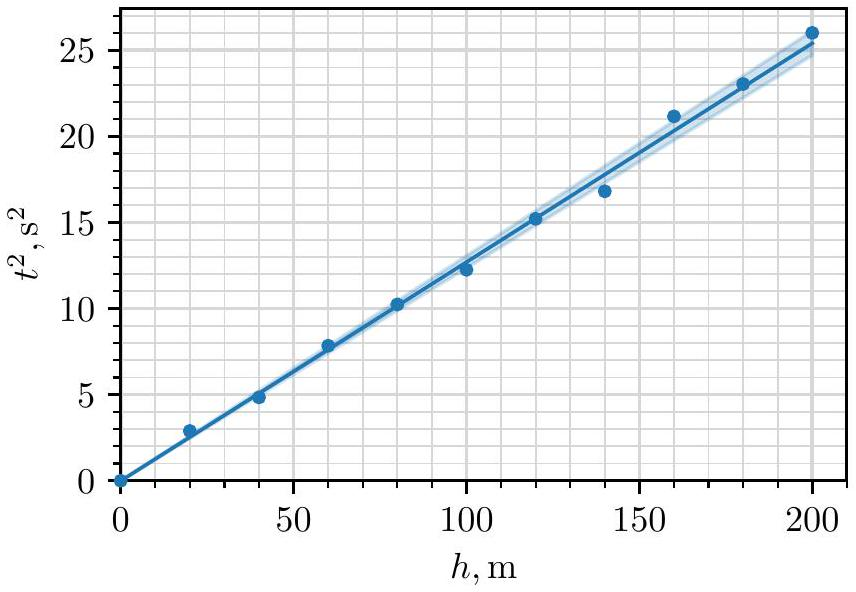
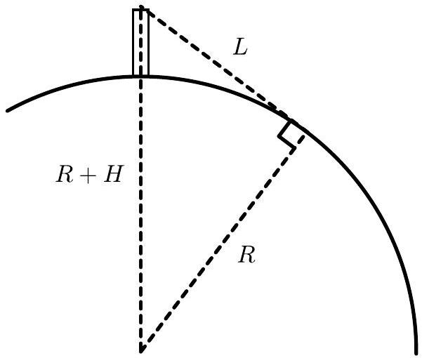
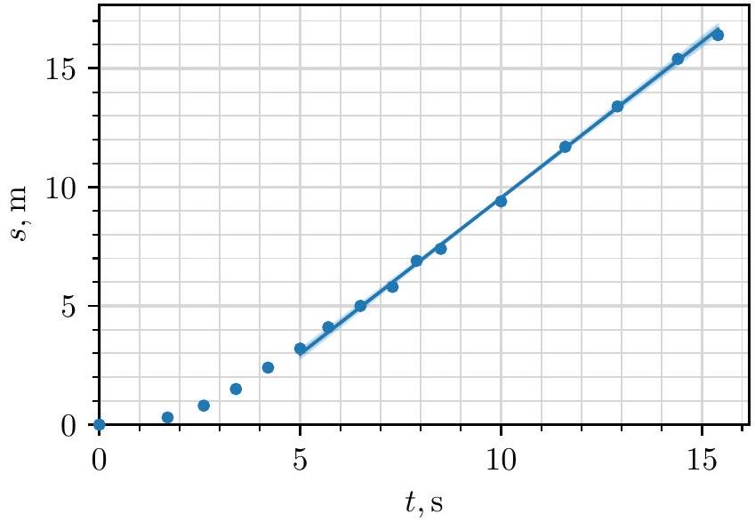
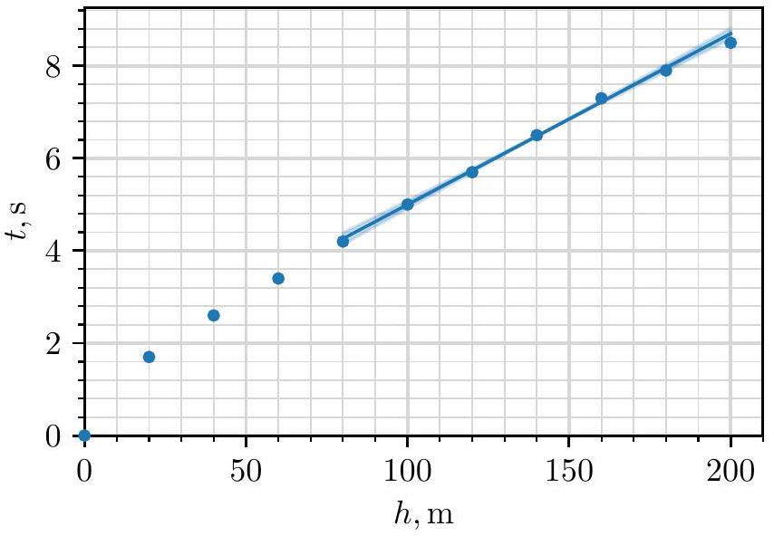
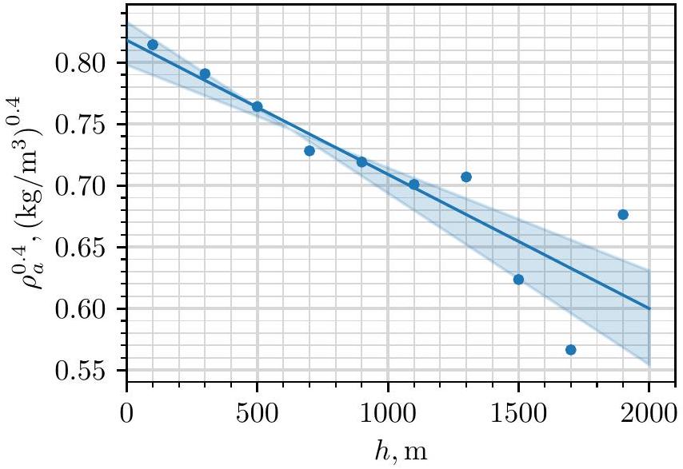
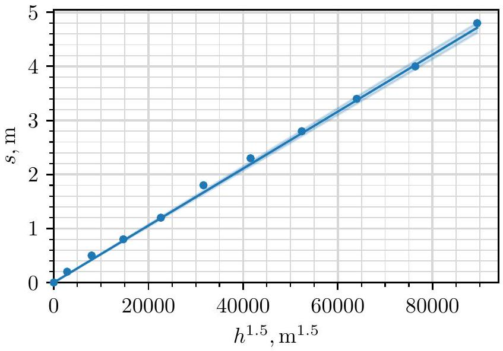
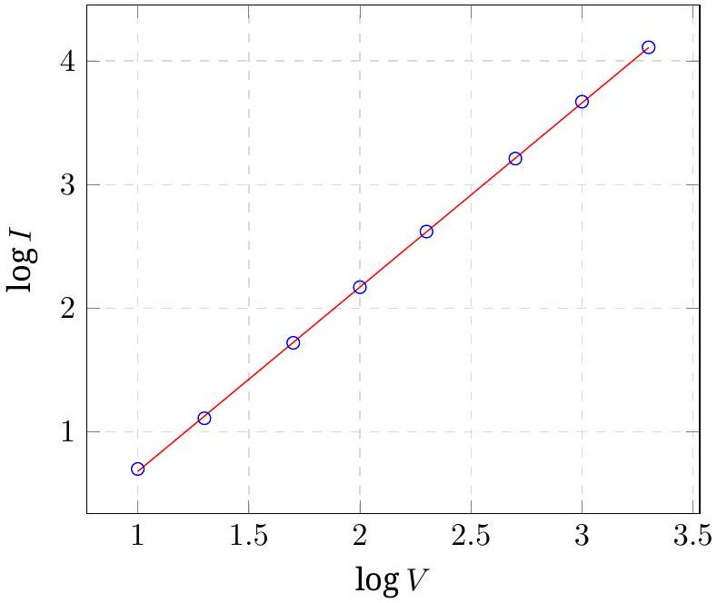
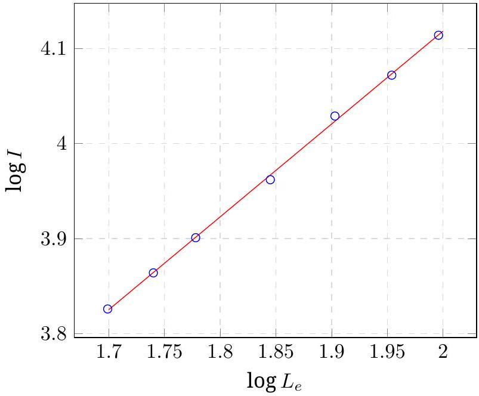
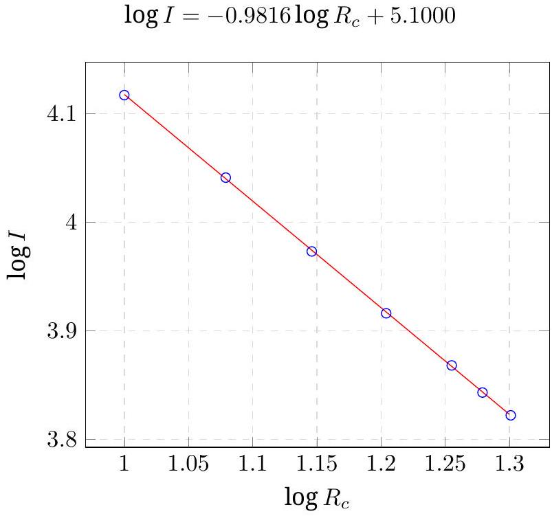
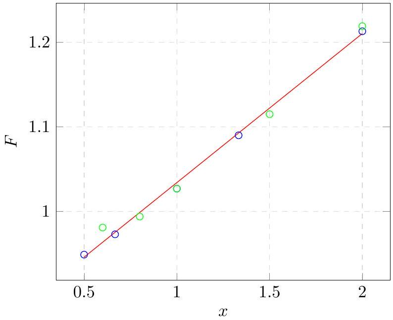

## E1: Planet - SOLUTION

A.1: The free-fall acceleration $g$ can be found by dropping the ball from low heights such that the air friction and effects from the curvature of the planet are minimized. We also choose the radius and density of the ball to be as big as possible to minimize the effect of air friction, i.e. setting $r = 50 \mathrm {~cm} , \rho = 10 \mathrm {~g} / \mathrm { cm } ^ { 3 }$. The drop height is then given by $h = g t ^ { 2 } / 2$, and so we can find $g$ from the slope of $t ^ { 2 }$ vs $h$. From the graph, we measure the slope $2 / g = 0.127 \mathrm {~s} ^ { 2 } / \mathrm { m }$ and its error $\Delta ( 2 / g ) = 0.004 \mathrm {~s} ^ { 2 } / \mathrm { m }$ and so $g = 15.7 \mathrm {~m} / \mathrm { s } ^ { 2 }$ with an error of $\Delta g = 0.5 \mathrm {~m} / \mathrm { s } ^ { 2 }$.

| $r = 50 \mathrm {~cm} , \rho = 10 \mathrm {~g} / \mathrm { cm } ^ { 3 }$ |  |  |  |
| :--- | :--- | :--- | :--- |
| $h ( \mathrm {~m} )$ | $s ( \mathrm {~m} )$ | $t ( \mathrm {~s} )$ | $t ^ { 2 } \left( \mathrm {~s} ^ { 2 } \right)$ |
| 0 | 0.0 | 0.0 | 0.0 |
| 20 | 0.0 | 1.7 | 2.9 |
| 40 | 0.0 | 2.2 | 4.8 |
| 60 | 0.0 | 2.8 | 7.8 |
| 80 | 0.1 | 3.2 | 10.2 |
| 100 | 0.1 | 3.5 | 12.2 |
| 120 | 0.2 | 3.9 | 15.2 |
| 140 | 0.0 | 4.1 | 16.8 |
| 160 | 0.1 | 4.6 | 21.2 |
| 180 | 0.1 | 4.8 | 23.0 |
| 200 | 0.1 | 5.1 | 26.0 |

Marking scheme:

| Theory | $h = g t ^ { 2 } / 2$ | 0.20 pts |
| :--- | :--- | :--- |
| Data | varying only $h$ | 0.05 pts |
|  | maximising $r$ | 0.05 pts |
|  | maximising $\rho$ | 0.05 pts |
|  | table has units | 0.05 pts |
|  | $h$ distributed roughly uniformly | 0.05 pts |
|  | $h _ { \text {max } } < 300 \mathrm {~m}$ | 0.05 pts |
|  | $h _ { \text {max } } - h _ { \text {min } } > 100 \mathrm {~m}$ | 0.05 pts |
|  | correct calculations of derived quantities | 0.05 pts |
|  | 7 or more measurements | 0.30/0.30 |
|  | 6 measurements | 0.25/0.30 |
|  | 5 measurements | 0.20/0.30 |
|  | 4 or fewer measurements | 0.10/0.30 |

| Plotting | overall plot | 0.30 pts |
| :--- | :--- | :--- |
|  | points don't cover 60\% of the area | -0.10 pts |
|  | missing axis labels | -0.05 pts |
|  | missing axis units | -0.05 pts |
|  | one plotting mistake | -0.05/-0.10 |
|  | two or more plotting mistakes | -0.10/-0.10 |
| Fit line | drawn on graph | 0.05 pts |
|  | line passes through origin | 0.05 pts |
|  | slope computed with units | 0.10 pts |
|  | uncertainty of slope computed | 0.10 pts |
| Values | $15.0 \mathrm {~m} / \mathrm { s } ^ { 2 } \leq g \leq 16.4 \mathrm {~m} / \mathrm { s } ^ { 2 }$ | 0.20/0.20 |
|  | $14.3 \mathrm {~m} / \mathrm { s } ^ { 2 } \leq g \leq 17.1 \mathrm {~m} / \mathrm { s } ^ { 2 }$ | 0.10/0.20 |
|  | units for value | 0.05 pts |
|  | $\Delta g \leq 0.7 \mathrm {~m} / \mathrm { s } ^ { 2 }$ | 0.20/0.20 |
|  | $\Delta g \leq 1.4 \mathrm {~m} / \mathrm { s } ^ { 2 }$ | 0.10/0.20 |
|  | units for error | 0.05 pts |
|  | sum | 2.0 pts |

Points are added additively (including negative points), except for blocks of grey background, where the option with maximal points should be chosen (in absolute value)
A.2: How far one can see from on top of the tower can be related to the radius of the planet via the right triangle shown in the figure below. Applying the Pythagoras theorem on the triangle, one gets $( R + H ) ^ { 2 } = L ^ { 2 } + R ^ { 2 }$ and so

$$
R = \frac { L ^ { 2 } - H ^ { 2 } } { 2 H } = 13200 \mathrm {~km} .
$$

Marking scheme:

| Theory | correct geometry (either a figure or implicitly assumed) | 0.20 pts |
| :--- | :--- | :--- |
|  | correct formula | 0.20 pts |
| Values | correct value | 0.10 pts |
|  | sum | 0.5 pts |

A.3: From Newton's law of gravity, $g = G M / R ^ { 2 }$. Hence,

$$
M = \frac { g R ^ { 2 } } { G } = 4.2 \times 10 ^ { 25 } \mathrm {~kg} .
$$

By adding the errors in quadrature, we find the error

$$
\Delta M = \frac { \Delta g } { g } M = 0.2 \times 10 ^ { 25 } \mathrm {~kg} .
$$

Our estimation of free-fall acceleration has a contribution from the centrifugal force caused by the rotation

of the planet. This serves to reduce the acceleration on the surface and hence decrease our estimation of the planet's mass.

Marking scheme:

| Theory | correct formula | 0.10 pts |
| :--- | :--- | :--- |
|  | correct phenomena | 0.20 pts |
| Values | $3.9 \times 10 ^ { 25 } \mathrm {~kg} \leq M \leq 4.5 \times 10 ^ { 25 } \mathrm {~kg}$ | 0.10/0.10 |
|  | $3.6 \times 10 ^ { 25 } \mathrm {~kg} \leq M \leq 4.8 \times 10 ^ { 25 } \mathrm {~kg}$ | 0.05/0.10 |
|  | missing units for value | -0.05 pts |
|  | $\Delta M \leq 0.3 \times 10 ^ { 25 } \mathrm {~kg}$ | 0.10/0.10 |
|  | $\Delta M \leq 0.6 \times 10 ^ { 25 } \mathrm {~kg}$ | 0.05/0.10 |
|  | missing units for error | -0.05 pts |
|  | sum | 0.5 pts |

The student can't get overall negative points for value nor error (for example when the value is completely out of range and the units are wrong).
B.1: In general, if the variations in gravitational acceleration are small (as is the case here as $H \ll R$ ), as a response to air drag, objects tend to terminal velocity where they experience no net acceleration. In the reference frame of air, this corresponds to the object falling straight down with some terminal speed $v _ { t }$. In the lab frame, the object then has horizontal and vertical speeds of $u$ and $v _ { t }$ respectively.

In order to find $u$, we can choose to drop an object that reaches terminal velocity as fast as possible and then observe how the displacement $s$ relates to the fall time $t$. When terminal velocity is reached, we expect $s = s _ { 0 } + u t$, where $s _ { 0 }$ captures the displacement related to reaching terminal velocity. To maximize the effects of air drag, we minimize radius and density, i.e. setting $\rho = 0.1 \mathrm {~g} / \mathrm { cm } ^ { 3 }$, and $r = 5 \mathrm {~cm}$. Plotting $s$ vs $t$, we measure the slope to be $u = 1.31 \mathrm {~m} / \mathrm { s }$ with an error of $\Delta u = 0.04 \mathrm {~m} / \mathrm { s }$.

| $r = 5 \mathrm {~cm} , \rho = 0.1 \mathrm {~g} / \mathrm { cm } ^ { 3 }$ |  |  |
| :--- | :--- | :--- |
| $h ( \mathrm {~m} )$ | $s ( \mathrm {~m} )$ | $t ( \mathrm {~s} )$ |
| 0 | 0.0 | 0.0 |
| 20 | 0.3 | 1.7 |
| 40 | 0.8 | 2.6 |
| 60 | 1.5 | 3.4 |
| 80 | 2.4 | 4.2 |
| 100 | 3.2 | 5.0 |
| 120 | 4.1 | 5.7 |
| 140 | 5.0 | 6.5 |
| 160 | 5.8 | 7.3 |
| 180 | 6.9 | 7.9 |
| 200 | 7.4 | 8.5 |
| 240 | 9.4 | 10.0 |
| 280 | 11.7 | 11.6 |
| 320 | 13.4 | 12.9 |
| 360 | 15.4 | 14.4 |
| 400 | 16.4 | 15.4 |

Marking scheme:

| Theory | idea of reaching terminal velocity as fast as possible | 0.15 pts |
| :--- | :--- | :--- |
|  | $s = s _ { 0 } + u t$ | 0.10 pts |
| Data | varying only $h$ | 0.05 pts |
|  | minimising $r$ | 0.05 pts |
|  | minimising $\rho$ | 0.05 pts |
|  | table has units | 0.05 pts |
|  | $h$ distributed roughly uniformly | 0.05 pts |
|  | $h _ { \text {max } } \geq 300 \mathrm {~m}$ | 0.05 pts |
|  | $h _ { \text {max } } - h _ { \text {min } } \geq 300 \mathrm {~m}$ | 0.05 pts |
|  | 7 or more measurements | 0.30/0.30 |
|  | 6 measurements | 0.25/0.30 |
|  | 5 measurements | 0.20/0.30 |
|  | 4 or fewer measurements | 0.10/0.30 |
| Plotting | overall plot | 0.30 pts |
|  | points don't cover 60\% of the area | -0.10 pts |
|  | missing axis labels | -0.05 pts |
|  | missing axis units | -0.05 pts |
|  | one plotting mistake | -0.05/-0.10 |
|  | two or more plotting mistakes | -0.10/-0.10 |
| Fit line | drawn on graph | 0.10 pts |
|  | slope computed with units | 0.10 pts |
|  | uncertainty of slope computed | 0.10 pts |
| Values | $1.25 \mathrm {~m} / \mathrm { s } \leq u \leq 1.37 \mathrm {~m} / \mathrm { s }$ | 0.20/0.20 |
|  | $1.19 \mathrm {~m} / \mathrm { s } \leq u \leq 1.43 \mathrm {~m} / \mathrm { s }$ | 0.10/0.20 |
|  | units for value | 0.05 pts |
|  | $\Delta u \leq 0.06 \mathrm {~m} / \mathrm { s }$ | 0.20/0.20 |
|  | $\Delta u \leq 0.12 \mathrm {~m} / \mathrm { s }$ | 0.10/0.20 |
|  | units for error | 0.05 pts |
|  | sum | 2.0 pts |

B.2: By keeping the measurements close to the surface, we can assume to a good approximation uniform air density. Then, using similar reasoning as before, we expect $h = h _ { 0 } + v _ { t 0 } t$, where $h _ { 0 }$ captures the part of reaching terminal velocity.

At terminal velocity, the drag force balances out gravitational acceleration:

$$
m g = 0.24 A \rho _ { a } v _ { t } ^ { 2 } .
$$

Using $m = 4 \pi \rho r ^ { 3 } / 3$ and $A = \pi r ^ { 2 }$, we get

$$
v _ { t } \left( \rho _ { a } \right) = \sqrt { \frac { 4 \rho r g } { 3 \cdot 0.24 \rho _ { a } } } .
$$

On the surface, $v _ { t 0 } = v _ { t } \left( \rho _ { a } = \rho _ { a 0 } \right)$. Using the measurements from the last subtask, we can plot $t$ vs $h$ and measure the slope to be $1 / v _ { t 0 } = 0.037 \mathrm {~s} / \mathrm { m }$ with an error of $\Delta \left( 1 / v _ { t 0 } \right) = 0.002 \mathrm {~s} / \mathrm { m }$. Hence, $v _ { t 0 } = 27.0 \mathrm {~m} / \mathrm { s } , \Delta v _ { t 0 } =$ $\Delta \left( 1 / v _ { t 0 } \right) / v _ { t 0 } ^ { 2 } = 2 \mathrm {~m} / \mathrm { s }$. Now,

$$
\rho _ { a 0 } = \frac { 4 \rho r g } { 3 \cdot 0.24 v _ { t 0 } ^ { 2 } } = 0.60 \mathrm {~kg} / \mathrm { m } ^ { 3 } .
$$

and the error is

$$
\Delta \rho _ { a 0 } = \frac { 2 \Delta v _ { t 0 } } { v _ { t 0 } } \rho _ { a 0 } = 0.07 \mathrm {~kg} / \mathrm { m } ^ { 3 } .
$$

Marking scheme:
| Theory | $h = h _ { 0 } + v _ { t 0 } t$ | 0.05 pts |
| :--- | :--- | :--- |
|  | formula for terminal velocity | 0.10 pts |
|  | final expression for $\rho _ { a 0 }$ | 0.05 pts |
| Data | reusing the data from the last | 0.05 pts |
|  | $h _ { \text {max } } \leq 200 \mathrm {~m}$ | 0.05 pts |
|  | 6 or more measurements | 0.05 pts |
| Plotting | overall plot | 0.25 pts |
|  | points don't cover 60\% of the area | -0.05 pts |
|  | missing axis labels | -0.05 pts |
|  | missing axis units | -0.05 pts |
|  | one plotting mistake | -0.05/-0.10 |
|  | two or more plotting mistakes | -0.10/-0.10 |
| Fit line | drawn on graph | 0.05 pts |
|  | slope computed with units | 0.05 pts |
|  | uncertainty of slope computed | 0.10 pts |
| Values | $0.52 \mathrm {~kg} / \mathrm { m } ^ { 3 } \leq \rho _ { a 0 } \leq 0.68 \mathrm {~kg} / \mathrm { m } ^ { 3 }$ | 0.10/0.10 |
|  | $0.44 \mathrm {~kg} / \mathrm { m } ^ { 3 } \leq \rho _ { a 0 } \leq 0.76 \mathrm {~kg} / \mathrm { m } ^ { 3 }$ | 0.05/0.10 |
|  | $\Delta \rho _ { a 0 } \leq 0.08 \mathrm {~kg} / \mathrm { m } ^ { 3 }$ | 0.10/0.10 |
|  | $\Delta \rho _ { a 0 } \leq 0.16 \mathrm {~kg} / \mathrm { m } ^ { 3 }$ | 0.05/0.10 |
|  | units for both value and error | 0.05 pts |
|  | sum | 1.0 pts |

B.3: Due to the adiabatic profile of the atmosphere, the further up you go, the more the temperature and air density decreases, but the terminal velocity increases. We can estimate the terminal velocity of the ball at different heights by comparing the dropping time of a ball with the smallest possible terminal velocity (so minimal density and radius). This hence gives a direct probe for the air density and thus the height of the atmosphere.

If the ball reaches terminal velocity instantly, then the difference in falling time between dropping the ball at heights $h _ { 1 }$ and $h _ { 2 } > h _ { 1 }$ comes simply from $h _ { 1 } < h < h _ { 2 }$. This is because in both cases the ball falls for the same amount of time at $h < h _ { 1 }$ (because the terminal velocity only depends on height). Then, if $h _ { 2 } - h _ { 1 } \ll h _ { 1 }$, we can estimate

$$
\begin{equation*}
v _ { t } \left( \frac { h _ { 1 } + h _ { 2 } } { 2 } \right) \approx \frac { h _ { 2 } - h _ { 1 } } { t \left( h _ { 2 } \right) - t \left( h _ { 1 } \right) } . \tag{1}
\end{equation*}
$$

In reality, the ball doesn't reach the terminal velocity instantaneously. However, it turns out we can, to a good approximation, neglect this effect. As a rough order of magnitude estimation, on the ground level, the ball experiences a time difference of $v _ { t 0 } / ( 2 g ) = 0.8 \mathrm {~s}$ compared to the instantaneous case. This difference will increase as the ball is dropped from further up, but as long as the atmosphere isn't too much sparser in the upper parts of the tower (we can verify this later), the difference will be insignificant compared to the total falling time of the ball. Hence, we approximate the terminal velocity via equation (1).

Because the calculated velocities are very sensitive on the measured quantities, we do repeated measurements throughout the whole height of the tower.

| $r = 5 \mathrm {~cm} , \rho = 0.1 \mathrm {~g} / \mathrm { cm } ^ { 3 }$ |  |  |  |  |  |  |
| :--- | :--- | :--- | :--- | :--- | :--- | :--- |
| $h ( \mathrm {~m} )$ | $s _ { 1 } ( \mathrm {~m} )$ | $t _ { 1 } ( \mathrm {~s} )$ | $s _ { 2 } ( \mathrm {~m} )$ | $t _ { 2 } ( \mathrm {~s} )$ | $s _ { 3 } ( \mathrm {~m} )$ | $t _ { 3 } ( \mathrm {~s} )$ |
| 200 | 7.6 | 8.4 | 7.8 | 8.6 | 7.8 | 8.6 |
| 400 | 17.0 | 15.7 | 16.9 | 15.6 | 17.3 | 15.7 |
| 600 | 26.1 | 22.6 | 25.4 | 22.2 | 26.2 | 22.7 |
| 800 | 33.6 | 28.5 | 34.6 | 29.2 | 34.3 | 29.1 |
| 1000 | 41.1 | 34.3 | 43.0 | 35.7 | 43.3 | 35.8 |
| 1200 | 51.1 | 41.9 | 50.2 | 41.2 | 50.0 | 41.1 |
| 1400 | 57.9 | 47.2 | 58.8 | 47.8 | 58.7 | 47.8 |
| 1600 | 65.5 | 53.0 | 65.1 | 52.8 | 65.3 | 52.9 |
| 1800 | 70.9 | 57.1 | 72.2 | 58.2 | 71.4 | 57.5 |
| 2000 | 78.5 | 62.9 | 79.6 | 63.8 | 79.5 | 63.7 |

Using equation (1) we make a separate table with velocities, while also adding the ground level velocity found in one of the earlier part (we set it at $h = 100 \mathrm {~m}$ because that was the centre of the range of measurements). We find air density using

$$
\rho _ { a } = \frac { 4 \rho r g } { 3 \cdot 0.24 v _ { t } ^ { 2 } } .
$$

From the density profile of an adiabatic atmosphere,

$$
\rho _ { a } ^ { \gamma - 1 } = \rho _ { a } ^ { 0.4 } = \rho _ { a 0 } ^ { 0.4 } \left( 1 - \frac { h } { H _ { 0 } } \right) .
$$

Hence, we find $H _ { 0 }$ by plotting $\rho _ { a 0 } ^ { 0.4 }$ against $h$ and fitting a straight line.

From the plot, we measure the slope $a = - \rho _ { a 0 } ^ { 0.4 } / H _ { 0 } =$ $- 1.1 \times 10 ^ { - 4 } \left( \mathrm {~kg} / \mathrm { m } ^ { 3 } \right) ^ { 0.4 } / \mathrm { m }$ and the intercept $b = \rho _ { a 0 } ^ { 2.5 } =$ $0.82 \left( \mathrm {~kg} / \mathrm { m } ^ { 3 } \right) ^ { 0.4 }$ so $H _ { 0 } = - b / a = 7500 \mathrm {~m}$. We calculate the

| $r = 5 \mathrm {~cm} , \rho = 0.1 \mathrm {~g} / \mathrm { cm } ^ { 3 }$ |  |  |  |
| :--- | :--- | :--- | :--- |
| $h ( \mathrm {~m} )$ | $v ( \mathrm {~m} / \mathrm { s } )$ | $\rho _ { a } \left( \mathrm {~kg} / \mathrm { m } ^ { 3 } \right)$ | $\rho _ { a } ^ { 0.4 } \left( \left( \mathrm {~kg} / \mathrm { m } ^ { 3 } \right) ^ { 0.4 } \right)$ |
| 100 | 27.0 | 0.599 | 0.814 |
| 300 | 28.0 | 0.556 | 0.791 |
| 500 | 29.3 | 0.510 | 0.764 |
| 700 | 31.1 | 0.452 | 0.728 |
| 900 | 31.6 | 0.438 | 0.719 |
| 1100 | 32.6 | 0.411 | 0.701 |
| 1300 | 32.3 | 0.420 | 0.707 |
| 1500 | 37.7 | 0.307 | 0.624 |
| 1700 | 42.6 | 0.241 | 0.566 |
| 1900 | 34.1 | 0.376 | 0.676 |

error from two reasonably chosen lines that correspond to maximal and minimal estimates for $H _ { 0 }$

$$
\begin{aligned}
\Delta H _ { 0 } & \approx \frac { 1 } { 2 } \left( - \frac { 0.80 \left( \mathrm {~kg} / \mathrm { m } ^ { 3 } \right) ^ { 0.4 } } { - 8.4 \times 10 ^ { - 5 } \left( \mathrm {~kg} / \mathrm { m } ^ { 3 } \right) ^ { 0.4 } / \mathrm { m } } \right. \\
& \left. + \frac { 0.83 \left( \mathrm {~kg} / \mathrm { m } ^ { 3 } \right) ^ { 0.4 } } { - 1.4 \times 10 ^ { - 4 } \left( \mathrm {~kg} / \mathrm { m } ^ { 3 } \right) ^ { 0.4 } / \mathrm { m } } \right) \approx 2000 \mathrm {~m} .
\end{aligned}
$$

We can also confirm that our assumption about the density of the atmosphere not dropping significantly in the upper parts of the tower holds true.

Alternative, less accurate solution
In this approach, it's assumed that when the air drag is maximised, the ball falls at the terminal velocity $v _ { t 0 }$ for the whole duration of the fall. This gives

$$
\frac { \mathrm { d } h } { \mathrm {~d} t } = v _ { t } ( h ) = v _ { t _ { 0 } } \cdot \left( 1 - \frac { h } { H _ { 0 } } \right) ^ { - \frac { 1 } { 2 ( \gamma - 1 ) } } .
$$

Rearranging and integrating,

$$
t \approx \frac { 1 } { v _ { t _ { 0 } } } \int \mathrm {~d} h \left( 1 - \frac { h } { H _ { 0 } } \right) ^ { \frac { 1 } { 2 ( \gamma - 1 ) } } .
$$

So far this is exact and differs from the exact solution by the "speeding up" term which is a constant and has a smaller relative contribution the higher up one goes. In order to approximate this integral, we can do a first order binomial expansion to get

$$
\begin{aligned}
t & \approx \frac { h } { v _ { t _ { 0 } } } \left( 1 - \frac { 1 } { 4 H _ { 0 } ( \gamma - 1 ) } h \right) \\
\frac { t } { h } & \approx \frac { 1 } { v _ { t _ { 0 } } } - \frac { 1 } { 4 v _ { t _ { 0 } } H _ { 0 } ( \gamma - 1 ) } h .
\end{aligned}
$$

Plotting $t / h$ vs $h$ and calculating $H _ { 0 }$ similarly to before (by calculating the intercept and the slope), we get $H _ { 0 } \approx$ 6300 m, which falls within the error range. However, because of the approximations, this approach will be awarded a maximum of 2.0 out of 3.0 points (the following grading scheme still applies, but is capped out at 2.0).

Marking scheme:

| Theory | approximating $v _ { t 0 }$ via finite difference | 0.30 pts |
| :--- | :--- | :--- |
|  | reasoning why the ball reaches terminal velocity effectively instantaneously | 0.15 pts |
|  | linearising $v _ { t 0 }$ vs $h$ | 0.25 pts |
|  | expressing $H _ { 0 }$ in terms of the slope/intercept | 0.10 pts |
| Data | varying only $h$ | 0.05 pts |
|  | minimising $r$ | 0.05 pts |
|  | minimising $\rho$ | 0.05 pts |
|  | table has units | 0.05 pts |
|  | $h$ distributed roughly uniformly | 0.05 pts |
|  | $h _ { \text {max } } - h _ { \text {min } } \geq 1800 \mathrm {~m}$ | 0.10 pts |
|  | calculating derived quantities | 0.20 pts |
|  | 15 or more measurements | 0.45/0.45 |
|  | 10-14 measurements | 0.30/0.45 |
|  | 1-9 measurements | 0.15/0.45 |
| Plotting | overall plot | 0.30 pts |
|  | points don't cover 60\% of the area | -0.10 pts |
|  | missing axis labels | -0.05 pts |
|  | missing axis units | -0.05 pts |
|  | one plotting mistake | -0.05/-0.10 |
|  | two or more plotting mistakes | -0.10/-0.10 |
| Fit line | drawn on graph | 0.10 pts |
|  | slope computed with units | 0.15 pts |
|  | uncertainty of slope computed | 0.15 pts |
| Values | $5500 \mathrm {~m} \leq H _ { 0 } \leq 9500 \mathrm {~m}$ | 0.20/0.20 |
|  | $3500 \mathrm {~m} \leq H _ { 0 } \leq 11500 \mathrm {~m}$ | 0.10/0.20 |
|  | units for value | 0.05 pts |
|  | $\Delta H _ { 0 } \leq 2000 \mathrm {~m} / \mathrm { s }$ | 0.20/0.20 |
|  | $\Delta H _ { 0 } \leq 4000 \mathrm {~m} / \mathrm { s }$ | 0.10/0.20 |
|  | units for error | 0.05 pts |
|  | sum | 3.0 pts |

B.4: From the expression for adiabatic atmosphere we have

$$
H _ { 0 } = \frac { R T _ { 0 } } { \mu g } \frac { \gamma } { \gamma - 1 }
$$

so

$$
\mu = \frac { R T _ { 0 } } { H _ { 0 } g } \frac { \gamma } { \gamma - 1 } = 72 \mathrm {~g} \mathrm {~mol} ^ { - 1 } \approx 70 \mathrm {~g} \mathrm {~mol} ^ { - 1 }
$$

and

$$
\Delta \mu = \sqrt { \frac { \Delta H _ { 0 } ^ { 2 } } { H _ { 0 } ^ { 2 } } + \frac { \Delta g ^ { 2 } } { g ^ { 2 } } } \mu = 20 \mathrm {~g} \mathrm {~mol} ^ { - 1 } .
$$

From ideal gas law,

$$
p _ { 0 } = \frac { \rho _ { a 0 } R T _ { 0 } } { \mu } = 20000 \mathrm {~Pa}
$$

and

$$
\Delta p _ { 0 } = \sqrt { \frac { \Delta \mu ^ { 2 } } { \mu ^ { 2 } } + \frac { \Delta \rho _ { a 0 } ^ { 2 } } { \rho _ { a 0 } ^ { 2 } } } p _ { 0 } = 6000 \mathrm {~Pa} .
$$

Marking scheme:

| Theory | correct expression for $\mu$ | 0.15 pts |
| :--- | :--- | :--- |
|  | correct expression for $p _ { 0 }$ | 0.15 pts |
| Values | $45 \mathrm {~g} \mathrm {~mol} ^ { - 1 } \leq \mu \leq 95 \mathrm {~g} \mathrm {~mol} ^ { - 1 }$ | 0.05 pts |
|  | $\Delta \mu \leq 25 \mathrm {~g} \mathrm {~mol} ^ { - 1 }$ | 0.05 pts |
|  | $12000 \mathrm {~Pa} \leq p _ { 0 } \leq 28000 \mathrm {~Pa}$ | 0.05 pts |
|  | $\Delta p \leq 8000 \mathrm {~Pa}$ | 0.05 pts |
|  | sum | 0.5 pts |

C.1: Our goal is to find the rotation speed $\Omega$ of the planet. The rotation of the planet affects the ball's trajectory via centrifugal and Coriolis force. The centrifugal force, however, due to $H \ll R$ is impossible to disentangle from gravitational acceleration. Coriolis force affects the ball via acceleration $\vec { a } _ { \text {cor } } = - 2 \vec { \Omega } \times \vec { v }$. This is perpendicular to both the velocity of the ball and rotation axis of the planet. Hence, it's directed along the equator, and increases linearly with the falling speed. Thus, the horizontal acceleration is given by $a _ { x } = 2 \Omega v _ { y } + a _ { \text {drag } }$.

The procedure is then to minimize the effect of air drag (maximal radius and density) and hope that the Coriolis effect contributes enough to the horizontal displacement. If we neglect air drag, then $a _ { x } = 2 \Omega v _ { y } = 2 \Omega g t$ so $v _ { x } = \int a _ { x } \mathrm {~d} t = \Omega g t ^ { 2 }$ and $x = \int v _ { x } \mathrm {~d} t = \Omega g t ^ { 3 } / 3$. The final displacement will then be $s = g \Omega t _ { f } ^ { 3 } / 3$, where the falling time satisfies $H = g t _ { f } ^ { 2 } / 2$. Putting them together, we get

$$
s = \frac { 2 \Omega } { 3 } \sqrt { \frac { 2 H ^ { 3 } } { g } } .
$$

By varying the radius/density, we do indeed confirm that the effect of Coriolis force is significant, on the order of couple of meters. By doing a suitable number of measurements in the range 0 to 2000 m and plotting $s$ vs $h ^ { 1.5 }$, we measure the slope

$$
a = \frac { 2 \Omega } { 3 } \sqrt { \frac { 2 } { g } } = 5.3 \times 10 ^ { - 5 } \mathrm {~m} ^ { - 1 / 2 }
$$

and the error

$$
\Delta a = 1.1 \times 10 ^ { - 6 } \mathrm {~m} ^ { - 1 / 2 }
$$

such that

$$
T = \frac { 2 \pi } { \Omega } = \frac { 4 \pi } { 3 a } \sqrt { \frac { 2 } { g } } = 28000 \mathrm {~s} \approx 8 h
$$

and

$$
\Delta T = \sqrt { \left( 0.5 \frac { \Delta g } { g } \right) ^ { 2 } + \frac { \Delta a ^ { 2 } } { a ^ { 2 } } } T = 0.2 \mathrm {~h} .
$$

|  |  |  |
| :--- | :--- | :--- |
| $h ( \mathrm {~m} )$ | $s ( \mathrm {~m} )$ | $h ^ { 1.5 } \left( \mathrm {~m} ^ { 1.5 } \right)$ |
| 0 | 0.0 | 0 |
| 200 | 0.2 | 2800 |
| 400 | 0.5 | 8000 |
| 600 | 0.8 | 14700 |
| 800 | 1.2 | 22600 |
| 1000 | 1.8 | 31600 |
| 1200 | 2.3 | 41600 |
| 1400 | 2.8 | 52400 |
| 1600 | 3.4 | 64000 |
| 1800 | 4.0 | 76400 |
| 2000 | 4.8 | 89400 |

Alternative solution.
An alternative approach is to consider the system in the non-rotating frame (where we don't have to deal with fictitious forces). In there, the ball starts off with speed $v _ { 0 } = \Omega ( R + H )$. Due to the conservation of angular momentum, as the ball drops towards the ground, the ball's angular speed will start increasing and the ground will start lagging behind (the ground rotates with $\Omega$ ). At height $h$, when the ball moves with angular speed $\omega$, the conservation of angular momentum reads $\omega ( R + h ) ^ { 2 } =$ $\Omega ( R + H ) ^ { 2 }$ and so the angular lag between the ball and the ground is

$$
\Delta \omega = \omega - \Omega = \Omega \left( \left( \frac { R + H } { R + h } \right) ^ { 2 } - 1 \right) \approx 2 \Omega \frac { H - h } { R } .
$$

The positional velocity shift along the ground is then $v _ { x } = \Delta \omega R = 2 \Omega ( H - h ) = \Omega g t ^ { 2 }$. We recover the same expression as for Coriolis force, and from there we proceed the same way as before.

Marking scheme:

| Theory | Deriving $s ( h )$ | 0.80 pts |
| :--- | :--- | :--- |
|  | linearising $s$ vs $h$ | 0.10 pts |
| Data | varying only $h$ | 0.05 pts |
|  | minimising $r$ and $\rho$ | 0.05 pts |
|  | table has units | 0.05 pts |
|  | $h$ distributed roughly uniformly | 0.05 pts |

|  | $h _ { \text {max } } - h _ { \text {min } } \geq 1800 \mathrm {~m}$ | 0.05 pts |
| :--- | :--- | :--- |
|  | calculating derived quantities | 0.05 pts |
|  | 7 or more measurements | 0.30/0.30 |
|  | 6 measurements | 0.25/0.30 |
|  | 5 measurements | 0.20/0.30 |
|  | 4 or fewer measurements | 0.10/0.30 |
| Plotting | overall plot | 0.30 pts |
|  | points don't cover 60\% of the area | -0.10 pts |
|  | missing axis labels | -0.05 pts |
|  | missing axis units | -0.05 pts |
|  | one plotting mistake | -0.05/-0.10 |
|  | two or more plotting mistakes | -0.10/-0.10 |
| Fit line | drawn on graph | 0.10 pts |
|  | slope computed with units | 0.10 pts |
|  | uncertainty of slope computed | 0.10 pts |
| Values | $27000 \mathrm {~s} \leq T \leq 29000 \mathrm {~s}$ | 0.20/0.20 |
|  | $26000 \mathrm {~s} \leq T \leq 30000 \mathrm {~s}$ | 0.10/0.20 |
|  | missing units for value | -0.05 pts |
|  | $\Delta T \leq 1000 \mathrm {~s}$ | 0.20/0.20 |
|  | $\Delta T \leq 2000 \mathrm {~s}$ | 0.10/0.20 |
|  | missing units for error | -0.05 pts |
|  | sum | 2.5 pts |

## E2: Cylindrical Diode - SOLUTION

Take the logarithm of Equation 1,

$$
\log I _ { \infty } = \log C + \alpha \log R _ { c } + \beta \log L _ { e } + \gamma \log V
$$

A.1: Collect data by varying $V$. To minimize error, select maximum values for all fixed variables, this means $L _ { e } = 99 \mathrm {~cm} , R _ { c } = 10 \mathrm {~cm}$, and $R _ { e } = 1.0 \mathrm {~cm}$. Distribute the voltages logarithmically between 10 and 2000

| $V ( \mathrm {~V} )$ | $I ( \mathrm {~mA} )$ | $\log V$ | $\log I$ |
| :--- | :--- | :--- | :--- |
| 10 | 5 | 1.0 | 0.70 |
| 20 | 13 | 1.3 | 1.11 |
| 50 | 52 | 1.7 | 1.72 |
| 100 | 147 | 2.0 | 2.17 |
| 200 | 415 | 2.3 | 2.62 |
| 500 | 1620 | 2.7 | 3.21 |
| 1000 | 4630 | 3.0 | 3.67 |
| 2000 | 12900 | 3.3 | 4.11 |

Plot this on a graph; the best fit line is

$$
\log I = 1.490 \log V - 0.8095
$$

so $\gamma = 1.49$.
A statistical analysis of the uncertainty in the slope yields $\gamma = 1.490 \pm 0.005$.

Assessing the slope by visually fitting lines through the error bars on the points requires considering that error bars on a log axis are given by

$$
\delta ( \log y ) = \delta \left( \frac { \ln y } { \ln 10 } \right) = \frac { 1 } { \ln 10 } \frac { \delta y } { y }
$$

Since the largest relative error is in the smallest valued quantity, the focus is on $\delta V / V$ for $V = 10 \mathrm {~V}$ and $\delta I / I$ for $I = 5 \mathrm {~mA}$. The error bars associated with the log-log plot at that point are then

$$
( 1 \pm 0.02,0.70 \pm 0.04 )
$$

The other error bars are smaller; focusing on that point alone we can fit two extreme lines and get

$$
\gamma = 1.485 \pm 0.025
$$

Either approach is acceptable.
Marking scheme:

| Data | vary only $V$ | 0.05 pts |
| :--- | :--- | :--- |
|  | $R _ { e } \geq 1 \mathrm {~cm}$ | 0.05 pts |
|  | $R _ { c } \geq 10 R _ { e } \mathrm {~cm}$ | 0.05 pts |
|  | $L _ { e } \geq 90 \mathrm {~cm}$ | 0.05 pts |
|  | table has units | 0.05 pts |
|  | $V$ distributed as log | 0.05 pts |
|  | $V _ { \text {max } } \geq 1000 \mathrm {~V}$ | 0.05 pts |
|  | $V _ { \text {min } } \geq 10 \mathrm {~V}$ | 0.05 pts |
|  | $V _ { \text {min } } \leq 50 \mathrm {~V}$ | 0.05 pts |
|  | Correct calculations | 0.05 pts |
|  | 7 or more points | 0.30/0.30 |
|  | 6 points | 0.25/0.30 |
|  | 5 points | 0.20/0.30 |
|  | 4 or fewer points | 0.10/0.30 |
| Plotting | covers > 50\% of area | 0.10 pts |
|  | Axis labels | 0.05 pts |
|  | Axis units correct | 0.05 pts |
|  | one plotting mistake | -0.05/-0.10 |
|  | two or more plotting mistakes | -0.10/-0.10 |
| Fit | line drawn on graph | 0.10 pts |
|  | slope correctly computed with units | 0.10 pts |
|  | $1.45 < \gamma < 1.55$ | 0.10 pts |
|  | uncertainty of slope computed | 0.10 pts |
|  | $\delta \gamma \leq 0.03$ | 0.10 pts |
|  | sum | 1.5 pts |

Measured data should be entered into spreadsheet that will calculate results; if deviation is too large, data point should not count.

Evidence of reverse engineering should result in zero points for the entire section
A.2: Collect data by varying $L _ { e }$. To minimize error, select maximum values for all fixed variables, this means $V =$ $2000 \mathrm {~V} , R _ { c } = 10 \mathrm {~cm}$, and $R _ { e } = 1 \mathrm {~cm}$.

| $L _ { e }$ (cm) | $I ( \mathrm {~mA} )$ | $\log L _ { e }$ | $\log I$ |
| :--- | :--- | :--- | :--- |
| 99 | 13000 | 1.996 | 4.144 |
| 90 | 11800 | 1.954 | 4.072 |
| 80 | 10700 | 1.903 | 4.029 |
| 70 | 9170 | 1.845 | 3.962 |
| 60 | 7960 | 1.778 | 3.901 |
| 55 | 7310 | 1.740 | 3.864 |
| 50 | 6700 | 1.699 | 3.826 |

Plot this on a graph; the best fit line is

$$
\log I = 0.9767 \log L _ { e } + 2.1649
$$

A.3: Collect data by varying $R _ { c }$. To minimize error, select maximum values for all fixed variables, this means $V =$ $2000 \mathrm {~V} , L _ { e } = 99 \mathrm {~cm}$, and $R _ { e } = R _ { c } / 10 \mathrm {~cm}$.

so $\beta = 0.9767$.
A statistical analysis of the uncertainty in the slope yields $\beta = 0.98 \pm 0.02$.

Graphical fitting of the steepest and shallowest lines yields $\beta = 0.97 \pm 0.02$.

Marking scheme:

| Data | vary only $L _ { e }$ | 0.05 pts |
| :--- | :--- | :--- |
|  | $R _ { e } \geq 1 \mathrm {~cm}$ | 0.05 pts |
|  | $R _ { c } \geq 10 R _ { e } \mathrm {~cm}$ | 0.05 pts |
|  | $V \geq 100 \mathrm {~V}$ | 0.05 pts |
|  | table has units | 0.05 pts |
|  | $L _ { e }$ distributed evenly | 0.05 pts |
|  | $L _ { e , \text { max } } \geq 90 \mathrm {~cm}$ | 0.05 pts |
|  | $L _ { e , \min } \geq 3 R _ { c }$ | 0.05 pts |
|  | $L _ { e , \text { min } } \leq 50 \mathrm {~cm}$ | 0.05 pts |
|  | Correct calculations of derived quantities | 0.05 pts |
|  | 7 or more points | 0.30/0.30 |
|  | 6 points | 0.25/0.30 |
|  | 5 points | 0.20/0.30 |
|  | 4 or fewer points | 0.10/0.30 |
| Plotting | covers > 50\% of area | 0.10 pts |
|  | Axis labels | 0.05 pts |
|  | Axis units correct | 0.05 pts |
|  | one plotting mistake | -0.05/-0.10 |
|  | two or more plotting mistakes | -0.10/-0.10 |
| Fit | line drawn on graph | 0.10 pts |
|  | slope correctly computed with units | 0.10 pts |
|  | $0.97 < \beta < 1.03$ | 0.10 pts |
|  | uncertainty of slope computed | 0.10 pts |
|  | $\delta \beta \leq 0.03$ | 0.10 pts |
|  | sum | 1.5 pts |

| $R _ { c } ( \mathrm {~cm} )$ | $I ( \mathrm {~mA} )$ | $\log R _ { c }$ | $\log I$ |
| :--- | :--- | :--- | :--- |
| 20 | 6640 | 1.301 | 3.822 |
| 19 | 6970 | 1.279 | 3.843 |
| 18 | 7380 | 1.255 | 3.868 |
| 16 | 8240 | 1.204 | 3.916 |
| 14 | 9390 | 1.146 | 3.973 |
| 12 | 11000 | 1.079 | 4.041 |
| 10 | 13100 | 1.000 | 4.117 |

Plot this on a graph; the best fit line is

so $\alpha = - 0.9824$.
A statistical analysis of the uncertainty in the slope yields $\beta = - 0.98 \pm 0.01$.

Graphical fitting of the steepest and shallowest lines yields $\beta = 0.97 \pm 0.02$.

Marking scheme:

| Data | vary only $R _ { c }$ | 0.05 pts |
| :--- | :--- | :--- |
|  | $R _ { e } \geq 1 \mathrm {~cm}$ | 0.05 pts |
|  | $R _ { c } \geq 10 R _ { e } \mathrm {~cm}$ | 0.05 pts |
|  | $V \geq 100 \mathrm {~V}$ | 0.05 pts |
|  | table has units | 0.05 pts |
|  | $R _ { c }$ distributed evenly | 0.05 pts |
|  | $R _ { c , \text { max } } \geq 15 \mathrm {~cm}$ | 0.05 pts |
|  | $R _ { c , \min } \geq 10 R _ { e }$ | 0.05 pts |
|  | $R _ { c , \text { min } } \leq 10 \mathrm {~cm}$ | 0.05 pts |
|  | Correct calculations of derived quantities | 0.05 pts |
|  | 7 or more points | 0.30/0.30 |
|  | 6 points | 0.25/0.30 |
|  | 5 points | 0.20/0.30 |
|  | 4 or fewer points | 0.10/0.30 |
| Plotting | covers > 50\% of area | 0.10 pts |
|  | Axis labels | 0.05 pts |
|  | Axis units correct | 0.05 pts |
|  | one plotting mistake | -0.05/-0.10 |
|  | two or more plotting mistakes | -0.10/-0.10 |
| Fit | line drawn on graph | 0.10 pts |
|  | slope correctly computed with units | 0.10 pts |
|  | $- 1.03 < \alpha < - 0.97$ | 0.10 pts |
|  | uncertainty of slope computed | 0.10 pts |
|  | $\delta \alpha \leq 0.03$ | 0.10 pts |
|  | sum | 1.5 pts |

B.1: Use all three sets of data, and the exponents from all three, and then average the results

$$
\log C = \log I - 1.495 \log V - 0.9854 \log L _ { e } + 0.9781 \log R _ { c }
$$

which gives

$$
C = ( 0.0165 \pm 0.0003 ) \mathrm { mA } / \mathrm { V } ^ { 3 / 2 }
$$

The theoretical value is approximately:

$$
\frac { 8 \pi \epsilon _ { 0 } } { 9 } \sqrt { \frac { 2 e } { m } } \approx 1.47 \times 10 ^ { - 5 } \mathrm {~A} / \mathrm { V } ^ { 3 / 2 } .
$$

Note that there is a nasty correction (the texts usually call it $\beta$, which is not the same as our exponent), that we use in the code, but aren't expecting students to find, because of this correction, we don't expect the theoretical value to hold. Students who try to solve the theoretical problem will be vexed by this.

For space reasons, we write numerical $C$ below without explicit units, but using the units of $\mu \mathrm { A } / \mathrm { V } ^ { 3 / 2 }$, that is

$$
C = 16.5 \mu \mathrm {~A} / \mathrm { V } ^ { 3 / 2 }
$$

Students must have clear units!
Marking scheme:

| Theory | clear statement | 0.20 pts |
| :--- | :--- | :--- |
| Fit | Used $R _ { c } = 10 R _ { e }$ | 0.10 pts |
|  | $C$ computed | 0.10 pts |
|  | More than 9 data points | 0.20/0.20 pts |
|  | 8 or 9 data points | 0.15/0.20 pts |
|  | 7 or 8 data points | 0.10/0.20 pts |
|  | 5 or 6 data points | 0.05/0.20 pts |
|  | $C$ has correct units | 0.10 pts |
|  | $16.2 \leq C \leq 16.8$ | 0.10/0.10 pts |
|  | $15.9 \leq C \leq 17.1$ | 0.05/0.10 pts |
|  | uncertainty computed | 0.10 pts |
|  | $0.1 < \delta C \leq 0.03$ | 0.10 pts |
|  | $0 < \delta C \leq 0.05$ | 0.05/0.10 pts |
|  | sum | 1.0 pts |

Clear statement of theory means that somewhere there is a justification for the data they are collecting and using. This can be in the form of the log formula; words are not necessary. Reusing data is okay.

C.1: Start by assuming that $L _ { e }$ matters, and look at values near $R _ { c }$. Repeat for other variables. Remember that $C$ depends on the ratio between $R _ { c } / R _ { e }$, so change these together!

Using nearest half integers, we have for the first equation

$$
I _ { \infty } = C \frac { L _ { e } } { R _ { c } } V ^ { 3 / 2 }
$$

so that

$$
F = \frac { I _ { \text {measured } } } { C \frac { L _ { e } } { R _ { c } } V ^ { 3 / 2 } }
$$

| $R _ { c }$ | $R _ { e }$ | $L _ { e }$ | $V$ | $I$ | $I _ { \infty }$ | $F$ |
| :--- | :--- | :--- | :--- | :--- | :--- | :--- |
| cm | cm | cm | V | mA | mA |  |
| 10 | 1 | 10 | 1000 | 535 | 500 | 1.071 |
| 12 | 1.2 | 10 | 1000 | 470 | 416 | 1.129 |
| 8 | 0.8 | 10 | 1000 | 647 | 624 | 1.036 |
| 10 | 1 | 12 | 1000 | 630 | 599 | 1.051 |
| 10 | 1 | 8 | 1000 | 451 | 400 | 1.129 |
| 12 | 1.2 | 12 | 1000 | 537 | 500 | 1.075 |
| 8 | 0.8 | 8 | 1000 | 537 | 500 | 1.075 |
| 10 | 1 | 10 | 1100 | 617 | 576 | 1.071 |
| 10 | 1 | 10 | 900 | 457 | 426 | 1.072 |

From this we conclude that if $R _ { c } \uparrow , F \uparrow$; if $L _ { e } \uparrow , F \downarrow$; if $V \uparrow , F$ doesn't change.

Also, we notice that the ratio $R _ { c } / L _ { e }$ seems to be the important quantity.

Marking scheme:

| Data | clearly collected | 0.10 pts |
| :--- | :--- | :--- |
| Data | $R _ { c } \uparrow \Rightarrow F \uparrow$ | 0.10 pts |
|  | $L _ { e } \uparrow \Rightarrow F \downarrow$ | 0.10 pts |
|  | $V _ { c } \uparrow : F$ no significant change | 0.10 pts |
|  | $R _ { e } \uparrow : F$ no significant change | 0.10 pts |
|  | sum | 0.5 pts |

C.2: We propose

$$
F = A + B \frac { R _ { c } } { L _ { e } }
$$

with $x = R _ { c } / L _ { e }$.
Marking scheme:

| Theory | clear statement | 0.20 pts |
| :--- | :--- | :--- |
| Def | $\begin{aligned} & x = R _ { c } / L _ { e } \\ & x = L _ { e } / R _ { c } \end{aligned}$ | $\begin{aligned} & 0.30 / 0.30 \mathrm { pts } \\ & 0.15 / 0.30 \mathrm { pts } \end{aligned}$ |
|  | sum | 0.5 pts |

Any multiple of $R _ { c } / L _ { e }$ is also acceptable.
C.3: It is important to collect data that varies $R _ { c }$ and $L _ { e }$ independently, so as to not bias our hypothesis. We will also keep the ratio with $R _ { c } / R _ { e } = 10$, in order to avoid other effects with the constant in part B.

| $R _ { c } ( \mathrm {~cm} )$ | $L _ { e }$ (cm) | $I ( \mathrm {~mA} )$ | $I _ { \infty }$ | $x$ | $F$ |
| :--- | :--- | :--- | :--- | :--- | :--- |
| 20 | 10 | 898 | 740 | 2.000 | 1.213 |
| 20 | 15 | 1210 | 1110 | 1.333 | 1.090 |
| 20 | 20 | 1520 | 1480 | 1.000 | 1.027 |
| 20 | 30 | 2160 | 2221 | 0.667 | 0.973 |
| 20 | 40 | 2810 | 2961 | 0.500 | 0.949 |
| 6 | 10 | 2420 | 2467 | 0.600 | 0.981 |
| 8 | 10 | 1840 | 1850 | 0.800 | 0.994 |
| 10 | 10 | 1520 | 1480 | 1.000 | 1.027 |
| 15 | 10 | 1100 | 987 | 1.500 | 1.115 |
| 20 | 10 | 902 | 740 | 2.000 | 1.219 |

We plot the results below; blue are the values of fixed $R _ { e }$ while green are the values of fixed $L _ { e }$.

The result is

$$
F ( x ) = 0.8579 + 0.1762 x
$$

Which is in error at $x = 1$ by about 3\%.
If you are thinking that this looks like a quadratic fit might be better, you are correct, but there really isn't time to do that for this experiment.

Marking scheme:

| Data | vary $L _ { e }$ | 0.10 pts |
| :--- | :--- | :--- |
|  | vary $R _ { c }$ | 0.10 pts |
|  | $R _ { e } \geq 0.5 \mathrm {~cm}$ | 0.05 pts |
|  | $R _ { c } = 10 R _ { e } \mathrm {~cm}$ | 0.05 pts |
|  | $V \geq 500 \mathrm {~V}$ | 0.05 pts |
|  | table has units | 0.05 pts |
|  | $L _ { e } \geq 10 \mathrm {~cm}$ | 0.05 pts |
|  | $L _ { e , \text { max } } \leq 40 \mathrm {~cm}$ | 0.05 pts |
|  | $L _ { e }$ well distributed | 0.05 pts |
|  | $R _ { c }$ | 0.05 pts |
|  | Correct calculations of derived quantities | 0.10 pts |
|  | 10 or more points | 0.30/0.30 |
|  | 9 points | 0.25/0.30 |
|  | 8 points | 0.20/0.30 |
|  | 6 or 7 points | 0.10/0.30 |
|  | 5 or fewer points | 0.05/0.30 |
| Plotting | covers > 50\% of area | 0.10 pts |
|  | Axis labels | 0.05 pts |
|  | Axis units correct | 0.05 pts |
|  | one plotting mistake | -0.05/-0.10 |
|  | two or more plotting mistakes | -0.10/-0.10 |
| Fit | line drawn on graph | 0.10 pts |
|  | slope correctly computed with units | 0.10 pts |
|  | $0.17 < B < 0.18$ | 0.10 pts |
|  | sum | 1.5 pts |
