## General rules

Rule 1: Propagating errors are not punished except
(a) those cases when the (possibly intermediate) result is clearly wrong and hence, the contestant has another opportunity to figure out that something must have gone wrong, and could start searching for the mistakes. Examples (not limited to): dimensionally wrong answer; obviously too large or too small numerical value; wrong sign of the effect;
(b) for the calculation of numerical answers: marks (usually 0.1 pts) for the numerical values are given only when the underlying formula is correct.
Rule 2: if a contestant writes down a final answer (formula) of a task, or an intermediate result needed to derive the final result, the marks are not given even if the formula is completely correct, unless it is judged that that particular formula can be obtained from the basic laws in a simple-enough-way so that could have been done purely in mind, without using paper.

## T1: Permanent magnets

## Part A: Interaction of two magnets.

(A.1) Solution 1.

For all questions, note that spurious rounding (e.g. rounding 2.4kA to 2kA) will incur a penalty of 0.1 points lost per incident. Although such rounding does technically adhere to rules about significant figures, IPhO is not meant to test one's understanding of significant figures. Such rounding is both unreasonable and makes checking solutions much more difficult. Since the distance between the magnets is big as compared to their size, we can approximate each of them as a dipole of magnitude

$$
m = \frac { \pi } { 4 } d ^ { 2 } h J = 0.75 \mathrm { Am } ^ { 2 } .
$$

Since the two dipoles are parallel to each other and to the line connecting them, the interaction energy of one of the magnets with the field of the other magnet is

$$
W = - \vec { B } \cdot \vec { m } = - \frac { \mu _ { 0 } m ^ { 2 } } { 2 \pi L ^ { 3 } } ,
$$

and by taking a derivative we obtain

$$
F _ { 1 } = \frac { \mathrm { d } W } { \mathrm {~d} L } = \frac { 3 \mu _ { 0 } m ^ { 2 } } { 2 \pi L ^ { 4 } } \approx 0.21 \mathrm { mN } .
$$

| a) $m = \frac { \pi } { 4 } d ^ { 2 } h J$ | 0.2 pts |
| :--- | :--- |
| b) $W = - \vec { B } \cdot \vec { m }$ | 0.1 pts |
| c) $F _ { 1 } = \frac { \mathrm { d } W } { \mathrm {~d} L }$ | 0.1 pts |
| d) $F _ { 1 } = \frac { 3 \mu _ { 0 } m ^ { 2 } } { 2 \pi L ^ { 4 } }$ | 0.1 pts |
| Answer: 0.21 mN | 0.1 pts |

Solution 2. The force between the magnets is found by converting one cylinder into a superconducting ring. The current in the ring is $I = \frac { m } { A } = J h$. Consider a small line element $d l$ on the ring with a radial vector joining from the dipole to the line element. The dipole moment is decomposed into radial and tangential component. By rotational symmetry along the co-axis, the force on the ring is $F = B _ { p } I \pi d$, where $B _ { p }$ is the magnetic field component lying in the plane of the ring at its line element. From the given formula of dipole field, $\left| B _ { p } \right| = \frac { \mu _ { 0 } m } { 4 \pi r ^ { 3 } } ( 2 \cos \theta \sin \theta + \sin \theta \cos \theta ) = \frac { 3 \mu _ { 0 } m \sin \theta \cos \theta } { 4 \pi r ^ { 3 } }$. Substituting $\tan \theta = \frac { d } { 2 L }$ with small angle approximation for $\sin \theta \approx \theta$ and $\cos \theta \approx 1$, one gets $F = \frac { 3 \mu _ { 0 } m ^ { 2 } } { 2 \pi L ^ { 4 } }$.

| a) $m = \frac { \pi } { 4 } d ^ { 2 } h J$ | 0.1 pts |
| :--- | :--- |
| b) $I = J h$ | 0.1 pts |
| c) $\left\| B _ { p } \right\| = \frac { 3 \mu _ { 0 } m \sin \theta \cos \theta } { 4 \pi r ^ { 3 } }$ | 0.1 pts |
| d) $F _ { 1 } = \frac { 3 \mu _ { 0 } m ^ { 2 } } { 2 \pi L ^ { 4 } }$ | 0.1 pts |
| e) small angle approx. |  |
| or correct limiting behavior | 0.1 pts |
| Answer: 0.21 mN | 0.1 pts |

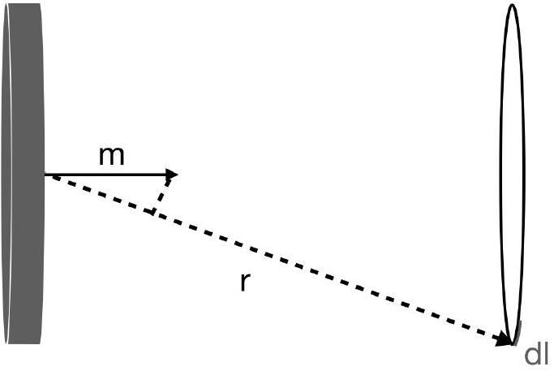
(A.2) In the case of a homogeneous magnetization, the molecular currents in the bulk of the material cancel out, leaving only a surface current at the surfaces which are not perpendicular to the magnetization vector. Hence, there is a surface current on the side surfaces of the cylinder. As the height of the surface is much smaller than the radius, these currents can be approximated as a ring current $I$; the dipole moment $\pi d ^ { 2 } I / 4$ of the ring current must be equal to the total dipole moment $\pi d ^ { 2 } h J / 4$ of the magnet, hence $I = J h \approx 2.4 \mathrm { k } A$.

| a) current around edge of magnet | 0.1 pts |
| :--- | :--- |
| c) $m = I A$ | 0.1 pts |
| d) $I = J h$ | 0.1 pts |
| Answer: 2.4 kA | 0.1 pts |

Remark: Having established the analogy to an edge current, one could instead find $I$ by evaluating the magnetic field at some point (e.g. far above the current loop) and matching to the given dipole result. Biot-Savart at a point on the ring axis at some distance $z \gg d$ above the loop gives

$$
\begin{equation*}
\mathbf { B } = B \hat { z } = \frac { \mu _ { 0 } } { 4 \pi } \int _ { 0 } ^ { 2 \pi } \frac { I ( d / 2 ) d \theta } { z ^ { 3 } } \frac { d / 2 } { z } \hat { z } = \frac { \mu _ { 0 } I d ^ { 2 } } { 8 z ^ { 3 } } \hat { z } . \tag{1}
\end{equation*}
$$

Matching this to the dipole result from the previous part gives $I = J h$ as above.
(A.3) Since the distance between the magnets is now significantly smaller than their diameter, the force can be approximately found as the force between two straight currents $I$ of length $\pi d$ at distance $L$ :

$$
F _ { 2 } = \frac { \mu _ { 0 } I ^ { 2 } } { 2 \pi L } \pi d = \frac { \mu _ { 0 } I ^ { 2 } d } { 2 L } \approx 14 \mathrm {~N} .
$$

a) Consider as straight currents
b) $B = \frac { \mu _ { 0 } I } { 2 \pi L }$
c) $F _ { 2 } = \pi d I B$
d) $F _ { 2 } = \frac { \mu _ { 0 } I ^ { 2 } d } { 2 L }$

Answer: 14 N
0.3 pts

0.3 pts
0.2 pts
0.1 pts
0.1 pts

(A.4) The chain will most likely break below the topmost magnet because then the magnetic pull between the magnets needs to compensate the largest possible weight. Let the number of magnets be $N + 1$, and the mass of a single magnet $M = \frac { \pi } { 6 } \rho \delta ^ { 3 } \approx 0.5 \mathrm {~g}$; then the weight of the magnets $F = M N g$ is balanced by the magnetic force

$$
F = \frac { 3 \mu _ { 0 } m ^ { 2 } } { 2 \pi \delta ^ { 4 } } \sum _ { n = 1 } ^ { N } \frac { 1 } { n ^ { 4 } } = \frac { \mu _ { 0 } m ^ { 2 } \pi ^ { 3 } } { 60 \delta ^ { 4 } } ,
$$

where $m = \frac { \pi } { 6 } J \delta ^ { 3 } \approx 78 \mathrm { mAm } ^ { 2 }$ and we have assumed that $N \gg 1$ so that we can assume in the sum $N = \infty$. From the force balance we obtain

$$
N = \frac { \mu _ { 0 } m ^ { 2 } \pi ^ { 3 } } { 60 M g \delta ^ { 4 } } \approx 1320
$$

hence, the total length of the chain is $N \delta = 6.6 \mathrm {~m}$. Note that $N = 1320$ is indeed much bigger than 1.

a) It will break at the top
b) $M = \frac { \pi } { 6 } \rho \delta ^ { 3 }$
c) $F = M N g$
d) $F = \frac { 3 \mu _ { 0 } m ^ { 2 } } { 2 \pi \delta ^ { 4 } } \sum _ { n = 1 } ^ { N } \frac { 1 } { n ^ { 4 } }$
e) $m = \frac { \pi } { 6 } J \delta ^ { 3 }$
f) $l = \frac { \mu _ { 0 } m ^ { 2 } \pi ^ { 3 } } { 60 M g \delta ^ { 3 } }$

Answer: 6.6 m
0.1 pts
0.1 pts
0.2 pts
0.2 pts
0.2 pts
0.1 pts
0.1 pts

Remark: if the sum is substituted with a finite sum as an approximation, with two or three terms in it, full marks are given. If only one term is kept, subtract 0.1 from d) or f). Remark 2: It's possible to get a range of final answers depending on the approximations used for $g$, mass, magnetic moment, etc. Answers that round to 1300 balls should definitely not be penalized, which corresponds to a distance range of 6.25-6.75m. 1260 balls (6.3m) is what you get with $\mathrm { g } = 10$ and mass $= 0.5 \mathrm {~g} ; 1320$ balls (6.6m) is what you get with $\mathrm { g } = 9.8$ and a mass of 0.49g (or, with-

a) Idea of magnetic charges
b) $q = m / \delta$
c) $B = \frac { \mu _ { 0 } q } { 4 \pi r ^ { 2 } }$
d) $B = \frac { J \mu _ { 0 } \delta ^ { 2 } } { 24 r ^ { 2 } }$

0.4 pts

0.4 pts
0.4 pts

0.3 pts

The same scheme applies for solutions which work with electrical charges, with a proportionality constant relating that field to the magnetic field of magnetic dipoles. Then, the sub-score a) is given for the idea of calculating the field of electrical dipoles (0.2 pts), with a correct proportionality factor between the two fields, $k = B / E =$ $\mu _ { 0 } \varepsilon _ { 0 } = c ^ { - 2 }$ (0.2 pts).

Solution 2. It is clear that from distances larger than the diameter of a magnet, the shape of the magnets doesn't matter; what matters is only the total dipole moment as this is what defines the magnitude of the field at large distances. So, we can substitute the balls with cylinders of equal volume. Now, let us require the height of these cylinders to be $\delta$; then the neighbouring cylinders in the chain will be touching each other. As a result, instead of the chain of balls, we have a long homogeneous cylinder. Equal volume means that the crosssectional area of these cylinders $A = \frac { \pi } { 6 } \delta ^ { 2 }$. We know from task A. 2 that such a cylinder can be considered as a long solenoid carrying surface density of bound currents equal to $J$. So, the magnetic field inside it $B _ { 0 } = \mu _ { 0 } J$, and therefore, it carries magnetic flux $\Phi = B _ { 0 } A = \frac { \pi } { 6 } \delta ^ { 2 } \mu _ { 0 } J$. We know that inside the solenoid, magnetic field is constant, and outside, the field is zero. However, this is valid only until the endpoints of the solenoid are far. All that flux is released near each of the endpoints of the solenoid. The released flux needs to satisfy the Maxwell equations: the $B$-field needs to have no sources and be potential. We know that the only solution in such a case is a central isotropic field $\vec { B } = f ( r ) \hat { r }$, where $r$ denotes the distance from the endpoint and $\hat { r }$ - the corresponding unit vector. From the Gauss law we conclude that $4 \pi r ^ { 2 } f ( r ) = { } ^ { \prime } \Phi = \frac { \pi } { 6 } \delta ^ { 2 } \mu _ { 0 } J$, hence $B = \frac { J \mu _ { 0 } \delta ^ { 2 } } { 24 r ^ { 2 } }$.

a) Idea of substituting spheres with cylinders
b) $A = \frac { \pi } { 6 } \delta ^ { 2 }$
c) $\Phi = \frac { \pi } { 6 } \delta ^ { 2 } \mu _ { 0 } J$
d) $B = \Phi / 4 \pi r ^ { 2 }$
e) $B = \frac { J \mu _ { 0 } \delta ^ { 2 } } { 24 r ^ { 2 } }$

0.4 pts
0.2 pts
0.4 pts
0.4 pts
0.1 pts out rounding the mass and magnetic moment and cancelling out the volume).

Remark: for part a, give only 0.1 points if students make
(A.5) Solution 1. Each of the balls creates magnetic field the cylinder replacement but then fail to make any real of a dipole $m$; the magnetic dipole creates the same field progress using it. wich would be created by two magnetic charges, equal

Solution 3. This solution follows the solution 2 up to by modulus to $q$ and of opposite sign, at a distance $s =$ the point where we have a solenoid with surface cur- $m / q$, assuming that this distance $s$ is much smaller than rent density $J$. After that we observe that at any point the distance from the dipole to the observation point. in space, the axial component of the magnetic field is Here it is convenient to select $s = \delta$ (hence $q = m / \delta$ ) because in that case almost all the positive and negative magnetic charges overlap and cancel out each other.

$$
B = \mu _ { 0 } J \frac { \Omega } { 4 \pi } ,
$$

The only ones which will not cancel out are the magnetic charges at the chain's endpoints. One of these charges is
where $\Omega$ denotes the solid angle under which we can very far so that the field at $P$ is the field of a magnetic see the interior surface of the solenoid, minus the solid charge at $O$ : angle under which we can see the outer surface. This can be derived easily from the Biot-Savart law: $\mathrm { d } B _ { z } =$

$$
B = \frac { \mu _ { 0 } q } { 4 \pi r ^ { 2 } } = \frac { \mu _ { 0 } m } { 4 \pi \delta r ^ { 2 } } = \frac { J \mu _ { 0 } \delta ^ { 2 } } { 24 r ^ { 2 } } .
$$

$\frac { \mu _ { 0 } } { 4 \pi r ^ { 2 } } j \mathrm {~d} z \mathrm {~d} \vec { l } \times \hat { r } \cdot \hat { z }$, where hats denotes unit vectors, $\mathrm { d } \vec { l }$ -an infinitesimal vector parallel to the surface current,

and $\vec { r }$ - a vector pointing from the observation point to a point on the solenoid. This can be rewritten as $\mathrm { d } B _ { z } = \frac { \mu _ { 0 } } { 4 \pi r ^ { 2 } } j \mathrm {~d} \vec { z } \times \mathrm { d } \vec { l } \cdot \hat { r } = \frac { \mu _ { 0 } } { 4 \pi r ^ { 2 } } J \mathrm {~d} \vec { A } \cdot \hat { r }$, where $\mathrm { d } \vec { A }$ denotes the area of a surface element on the solenoid. To complete our proof, it suffices to notice that $\overrightarrow { \mathrm { d } } A \cdot \hat { r }$ is the apparent area of the surface element, $\mathrm { d } \Omega = \overrightarrow { \mathrm { d } } A \cdot \hat { r } / r ^ { 2 }$.

Now, at the point $P$, the outside and inside contributions to $\Omega$ cancel out everywhere except for the circular opening of the solenoid. Thus, $\Omega = A \cos \theta / r ^ { 2 }$ so that $B _ { z } = \frac { J \mu _ { 0 } \delta ^ { 2 } } { 24 r ^ { 2 } } \cos \theta$. Finally, we can use the Gauss law to obtain expression for the radial component $B _ { R }$ (with $R$ denoting the radius in cylindrical coordinates) of the magnetic field. Someone not familiar with vector calculus can calculate the magnetic flux $\Phi _ { c }$ through a circle of radius $R _ { 0 } = r \sin \theta$. Then, the cylindrical coordinate $R = z \tan \theta ^ { \prime }$ so that $\mathrm { d } R = z \cos ^ { - 2 } \theta ^ { \prime } \mathrm { d } \theta ^ { \prime }$, and $\frac { 1 } { r ^ { 2 } } = \cos ^ { 2 } \theta ^ { \prime } / z ^ { 2 }$. Therefore $\Phi _ { c } = \int 2 \pi R B _ { z } \mathrm {~d} R =$ $\frac { \pi J \mu _ { 0 } \delta ^ { 2 } } { 12 } \cos \theta ^ { \prime } \mathrm { d } \theta ^ { \prime } = \frac { \pi J \mu _ { 0 } \delta ^ { 2 } } { 12 } \sin \theta$. We can see that this depends only the spherical coordinate $\theta$; by considering conical frusta with circular faces having the same polar angle $\theta$ we can easily conclude that the magnetic field must be radial, i.e. $B = B _ { z } / \cos \theta = \frac { J \mu _ { 0 } \delta ^ { 2 } } { 24 r ^ { 2 } }$.

a) Idea of substituting spheres with cylinders
b) $A = \frac { \pi } { 6 } \delta ^ { 2 }$
c) $B _ { z } = \frac { J \mu _ { 0 } \delta ^ { 2 } } { 24 r ^ { 2 } } \cos \theta$
d) $B = B _ { z } / \cos \theta$
e) $B = \frac { J \mu _ { 0 } \delta ^ { 2 } } { 24 r ^ { 2 } }$

Solution 4. Finally, the solution could be obtained theoretically also by summing over all the fields of individual magnets. However, this is mathematically very demanding, therefore full solution is not provided here. The first steps are as follows. (i) Writing the contribution $B _ { s z }$ and $B _ { s R }$ of a single magnet at distance $z$ from the point $O$ to the axial and radial (in cylindrical coordinates) components of the magnetic field; (ii) going from summation of individual contributions to integration by assuming linear density of dipoles $\rho _ { m } = m / \delta$ so that $\mathrm { d } m = m \mathrm {~d} z / \delta$; performing integration over $z$ to find the field components.
The mathematical derivation: A dipole at position $z$ $d m = \frac { m } { \delta } d z$ generates a magnetic field (in Cartesian coordinates):

$$
\begin{aligned}
& d B _ { z } = d B _ { r ^ { \prime } } \cos \theta - d B _ { \theta ^ { \prime } } \sin \theta = \frac { \mu _ { 0 } d m } { 4 \pi r ^ { \prime 3 } } \left( 2 - 3 \sin ^ { 2 } \theta ^ { \prime } \right) \\
& d B _ { R } = d B _ { r ^ { \prime } } \sin \theta + d B _ { \theta ^ { \prime } } \cos \theta = \frac { 3 \mu _ { 0 } d m } { 4 \pi r ^ { \prime 3 } } \sin \theta ^ { \prime } \cos \theta ^ { \prime }
\end{aligned}
$$

Where $r ^ { \prime } = \sqrt { r ^ { 2 } + z ^ { 2 } - 2 r z \cos \theta }$ and $\sin \theta ^ { \prime } = \frac { r } { r ^ { \prime } } \sin \theta$ are coordinates relative to the dipole $d m$. In order to simplify the integration, do substitution: $u = \frac { z - r \cos \theta } { r \sin \theta }$, then $r ^ { \prime } = r \sin \theta \sqrt { u ^ { 2 } + 1 } ; d z = r \sin \theta d u$. Integration for $B _ { z }$ :

$$
\begin{aligned}
B _ { z } & = \int d B _ { z } = \frac { \mu _ { 0 } m } { 4 \pi \delta } \int _ { 0 } ^ { \infty } d z \frac { 1 } { r ^ { \prime 3 } } \left( 2 - \frac { 3 r ^ { 2 } \sin ^ { 2 } \theta } { r ^ { \prime 2 } } \right) \\
& = \frac { \mu _ { 0 } m } { 4 \pi \delta r ^ { 2 } \sin ^ { 2 } \theta } \int _ { - \cot \theta } ^ { \infty } d u \left[ 2 \left( u ^ { 2 } + 1 \right) ^ { - 3 / 2 } - 3 \left( u ^ { 2 } + 1 \right) ^ { - 5 / 2 } \right] \\
& = \frac { \mu _ { 0 } m } { 4 \pi \delta r ^ { 2 } \sin ^ { 2 } \theta } \left[ \frac { 2 u } { \sqrt { u ^ { 2 } + 1 } } - \frac { 2 u ^ { 3 } + 3 u } { \left( u ^ { 2 } + 1 \right) ^ { 3 / 2 } } \right] _ { - \cot \theta } ^ { \infty } \\
& = - \frac { \mu _ { 0 } m \cos \theta } { 4 \pi \delta r ^ { 2 } }
\end{aligned}
$$

Integration for $B _ { R }$ :

$$
\begin{aligned}
B _ { R } = & \int d B _ { R } \\
= & \frac { 3 \mu _ { 0 } m } { 4 \pi \delta } \left( \int _ { 0 } ^ { r \cos \theta } d z \frac { 1 } { r ^ { \prime 3 } } \cdot \frac { r } { r ^ { \prime } } \sin \theta \sqrt { 1 - \frac { r ^ { 2 } } { r ^ { \prime 2 } } \sin ^ { 2 } \theta } \right. \\
& \left. - \int _ { r \cos \theta } ^ { \infty } d z \frac { 1 } { r ^ { \prime 3 } } \cdot \frac { r } { r ^ { \prime } } \sin \theta \sqrt { 1 - \frac { r ^ { 2 } } { r ^ { \prime 2 } } \sin ^ { 2 } \theta } \right) \\
= & - \frac { 3 \mu _ { 0 } m } { 4 \pi \delta r ^ { 2 } \sin ^ { 2 } \theta } \int _ { \cot \theta } ^ { \infty } \frac { u d u } { \left( u ^ { 2 } + 1 \right) ^ { 5 / 2 } } \\
= & - \frac { 3 \mu _ { 0 } m } { 8 \pi \delta r ^ { 2 } \sin ^ { 2 } \theta } \int _ { \cot ^ { 2 } \theta } ^ { \infty } d v ( v + 1 ) ^ { - 5 / 2 } \quad \left( v = u ^ { 2 } \right) \\
= & - \frac { \mu _ { 0 } m \sin \theta } { 4 \pi \delta r ^ { 2 } }
\end{aligned}
$$

0.2 pts
b) writing correctly $B _ { R z }$
0.2 pts
c) $\mathrm { d } m = m \mathrm {~d} z / \delta$
0.2 pts
c) $B _ { z } = \frac { J \mu _ { 0 } \delta ^ { 2 } } { 24 r ^ { 2 } } \cos \theta$
0.4 pts
d) $B _ { R } = \frac { J \mu _ { 0 } \delta ^ { 2 } } { 24 r ^ { 2 } } \sin \theta$
0.4 pts
e) $B = \frac { J \mu _ { 0 } \delta ^ { 2 } } { 24 r ^ { 2 } }$
0.1 pts

Remarks: for c) and d), a partial credit of 0.1 pts can be given for each of these integrals if the initial integral is written correctly, but the calculation of the integral is not performed or there are many mistakes. If only few mistakes were made, subtract 0.1 for each mistake made. If initial integral is written incorrectly, no points are given. Points for e) are given only if the final answer is completely correct.
Another remark: in the integration of $B _ { R }$, if the change of sign (of the cosine) is ignored, the correct answer could still be obtained (because the extra parts cancel out), but the derivation would technically be wrong.

Solution 5. It's possible to perform the direct integration of the previous solution more easily using angular variables in place of $z$. Let $s = r \sin \theta$ be the distance of closest approach of the line to $P$ for convenience and $\phi$ be the angle from a point on the line to $P$ (such that $\phi = \theta$ at the end near $P , \phi \approx \pi$ at the other end). Then the additional magnetic field from a small component given by $d \phi$ is

$$
\begin{aligned}
d \mathbf { B } = & \frac { \mu _ { 0 } \sin ^ { 3 } \phi } { 4 \pi s ^ { 3 } } \left( 2 d \mathbf { m } _ { \| } - d \mathbf { m } _ { \perp } \right) \\
= & \frac { \mu _ { 0 } \sin ^ { 3 } \phi } { 4 \pi s ^ { 3 } } d m \times \\
& ( 2 \cos \phi ( \cos \phi \hat { z } - \sin \phi \hat { r } ) - \sin \phi ( \sin \phi \hat { z } + \cos \phi \hat { r } ) ) \\
= & \frac { \mu _ { 0 } \sin ^ { 3 } \phi } { 4 \pi s ^ { 3 } } \frac { d m } { d z } d z \left( \left( 3 \cos ^ { 2 } \phi - 1 \right) \hat { z } - \cos \phi \sin \phi \hat { r } \right)
\end{aligned}
$$

Since $s = - z \tan \phi$ and $d m = m d z / \delta$, we have $d m / d \phi =$ $s m / \left( \delta \sin ^ { 2 } \phi \right)$. Then

$$
d \mathbf { B } = \frac { \mu _ { 0 } m } { 4 \pi s ^ { 2 } \delta } \left( \left( 3 \cos ^ { 2 } \phi - 1 \right) \hat { z } \sin \phi d \phi - \sin ^ { 2 } \phi \hat { r } \cos \phi d \phi \right)
$$

and thus

$$
\begin{aligned}
\mathbf { B } & = \frac { \mu _ { 0 } m } { 4 \pi s ^ { 2 } \delta } \int _ { \phi = \theta } ^ { \phi = \pi } \left( - \left( 3 \cos ^ { 2 } \phi - 1 \right) \hat { z } d \cos \phi - \sin ^ { 2 } \phi \hat { r } d \sin \phi \right) \\
& = - \frac { \mu _ { 0 } m } { 4 \pi s ^ { 2 } \delta } \left( \cos ^ { 3 } \phi - \left. \cos \phi \right| _ { \phi = \theta } ^ { \pi } \hat { z } + \left. \sin ^ { 3 } \phi \right| _ { \phi = \theta } ^ { \pi } \hat { r } \right) \\
& = \frac { \mu _ { 0 } m } { 4 \pi s ^ { 2 } \delta } \left( - \cos \theta \sin ^ { 2 } \theta \hat { z } + \sin ^ { 3 } \theta \hat { r } \right)
\end{aligned}
$$

Putting back in our expression for $s$, we have

$$
\begin{equation*}
\mathbf { B } = \frac { \mu _ { 0 } m } { 4 \pi r ^ { 2 } \delta } ( - \cos \theta \hat { z } + \sin \theta \hat { r } ) \tag{2}
\end{equation*}
$$

which is the desired result.

a) writing correctly $d \mathbf { B } / d \phi \quad 0.5$ pts
b) $d m / d \phi = s m / \left( \delta \sin ^ { 2 } \phi \right) \quad 0.2$ pts
c) $\left| B _ { z } \right| = \mu _ { 0 } m / \left( 4 \pi r ^ { 2 } \delta \right) \quad 0.4$ pts
d) $\hat { B } = - \cos \theta \hat { z } + \sin \theta \hat { r } \quad 0.4$ pts

Remark: for d, note that the coordinate system wasn't specified in the problem, so check what the student is using; the point is to get the "radially outward" (or inward) idea.

## Part B: Interaction of magnets with ferromagnetic materials.

(B.1) Due to the boundary condition at the surface of the ferromagnet, the field lines must enter the plates almost perpendicularly. Indeed, as it follows from the Ampère's circutal law, the tangential component of $\vec { B } / \mu$ is continuous at the surface of a ferromagnet; similarly, the Gauss law for the magnetic field implies that the normal component of the $B$-field is continuous. From these two facts, one can derive the "refraction law" for the field lines, $\tan \alpha = \mu \tan \beta$, where $\alpha$ and $\beta$ are the angles between the tangents of a field line and the surface normal, inside and outside of the ferromagnetic, respectively. From the fact that $\mu \gg 1$ we can deduce that as long as $\alpha$ is not small, $\beta \approx 0$. Those field lines which enter the plate must exit it somewhere, this happens somewhere farther away from the magnet, see the sketch below.
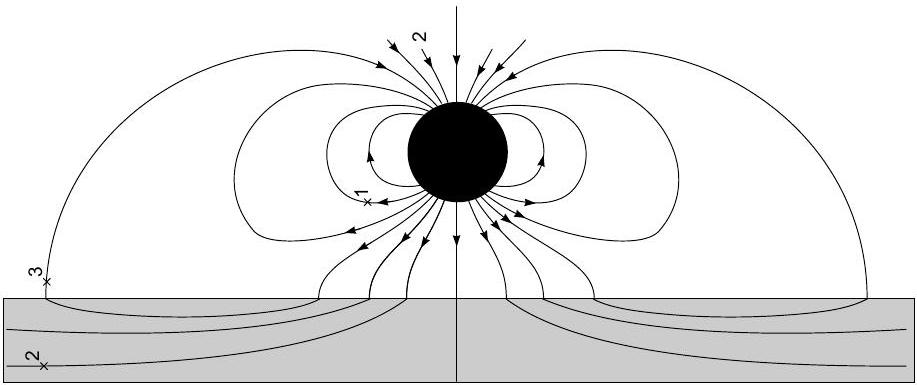

a) Field line 1 correct
b) Field line 2 correct
c) Field line 3 correct

0.2 pts
0.4 pts
0.4 pts

Remarks:
i) Subtract 0.1 both from b) and c) if the field line does not enter the plate perpendicularly;
ii) Subtract 0.1 both from b) and c) if the field line does not refract correctly;
iii) Subtract 0.1 from (b) if its segment rightwards of the magnet is not shown (note that in the student answer sheet, the magnet is to the right of the plate, not on top of it as shown in the solution);
iv) Subtract 0.1 both from a) and c) if the field line does not form a closed loop;
v) Subtract 0.1 from a) if the line touches or enters the plate; 0.1 from b) if the line exits the plate; 0.1 from c) if the line reaches the other side of the plate.
(B.2) The problem can be solved by introducing an image magnet-a mirror reflection of the real magnet with respect to the surface of the plate, with the dipole moment being both reflected and flipped. With this image magnet, the boundary condition above the plate is satisfied: the field lines enter the plate perpendicularly. Hence, the force and torque exerted to the real magnet are equal to the force and torque exerted by the image magnet. The equilibrium is achieved when the dipole is parallel to the field created by the image magnet which is the case when the dipole moment is perpendicular to the plate. Hence, leftmost boxes of the first and second row need to be marked with a tick. The force is almost the same as what was already found in part A(d), with the only difference that now there is only the first term in the sum:

$$
F = \frac { 3 \mu _ { 0 } m ^ { 2 } } { 2 \pi \delta ^ { 4 } } = 5.9 \mathrm {~N} .
$$

a) Idea of magnetic image (even if $\vec { J }$ not flipped)
b) Correct direction of the image $\vec { J }$
c) $F = \frac { 3 \mu _ { 0 } m ^ { 2 } } { 2 \pi \delta ^ { 4 } }$
d) $F = 5.9 \mathrm {~N}$
e) each correct tick
f) each incorrect tick

0.3 pts
0.2 pts
0.2 pts
0.1 pts
0.1 pts
-0.1 pts

Remark: if e) + f) adds up to a negative number, replace the total score for those two parts by 0.
(B.3) Solution 1. As explained above, the magnetic field lines are perpendicular to the surface of the ferromagnetic plate. Since the gap is narrow as compared to its width, the field lines are inside the gap almost straight. Due to the Ampère's circulation theorem it also means that the field in the gap is homogeneous. Due to the Ampère's circulation theorem, field outside the gap vanishes as the gap's width tends to 0, so in the limit all flux through the permanent magnet wraps around through the gap; see the sketch of magnetic field lines. Now, let us recall that the disc magnet is equivalent to a surface current of density $J$ along the curved surface of the disc. Hence we can write the circulation theorem along the loop defined by one of the field lines shown in the figure:

$$
I = \oint \vec { H } \cdot \mathrm {~d} \vec { r } \approx \left( B _ { 1 } + B _ { 2 } \right) h / \mu _ { 0 } ,
$$

where $B _ { 1 }$ and $B _ { 2 }$ denote the flux density inside the permanent magnet and outside the magnet (but still inside the slit), respectively. Here we have neglected the contribution of the magnetic field inside the ferromagnetic

plate to the integral because $\mu$ is very big. Due to the Gauss law, $\frac { \pi } { 4 } d ^ { 2 } B _ { 1 } = \frac { \pi } { 4 } \left( D ^ { 2 } - d ^ { 2 } \right) B _ { 2 }$; with $D = 2 d$ this yields $B _ { 1 } = 3 B _ { 2 }$. Thus, $B _ { 2 } = I \mu _ { 0 } / 4 h = J \mu _ { 0 } / 4 = 0.375 \mathrm {~T}$ and $B _ { 1 } = 1.125 \mathrm {~T}$. In order to find the force exerted to one of the ferromagnetic plates, we can notice that the force does not depend on what is creating the magnetic field and, hence, we can substitute the disc magnet with the current $I$ in a superconducting ring. Next we apply the virtual displacement method and increase the distance between the plates by $\mathrm { d } x$. In the case of a superconducting ring, the magnetic flux through the ring is conserved, and therefore, the magnetic field strength inside the gap will remain unchanged during the virtual displacement. With all this information we are ready to calculate the change of the magnetic field energy. The magnetic field energy inside the ferromagnet can be neglected because its density is ca $\mu$ times smaller than inside the gap. So, the energy is changed only because the volume of the gap is changed:

$$
\mathrm { d } W = \frac { \pi } { 8 \mu _ { 0 } } \left[ d ^ { 2 } B _ { 1 } ^ { 2 } + \left( D ^ { 2 } - d ^ { 2 } \right) B _ { 2 } ^ { 2 } \right] \mathrm { d } x = \left( \frac { 3 \pi } { 2 \mu _ { 0 } } B _ { 2 } ^ { 2 } d ^ { 2 } \right) \mathrm { d } x
$$

which means that the force

$$
F = \frac { \mathrm { d } W } { \mathrm {~d} x } = \frac { 3 \pi } { 2 \mu _ { 0 } } B _ { 2 } ^ { 2 } d ^ { 2 } = \frac { 3 \pi } { 32 } J ^ { 2 } \mu _ { 0 } d ^ { 2 } \approx 210 \mathrm {~N} .
$$

a) $\vec { B }$ in the slit is homogeneous
b) $\vec { B }$ in the permanent magnet is homog.
c) $\vec { B }$ in slit and in perm. magn. is normal
e) $I = \left( B _ { 1 } + B _ { 2 } \right) h / \mu _ { 0 }$
f) $\frac { \pi } { 4 } d ^ { 2 } B _ { 1 } = \frac { \pi } { 4 } \left( D ^ { 2 } - d ^ { 2 } \right) B _ { 2 }$
g) $B _ { 2 } = I \mu _ { 0 } / 4 h$
h) $B _ { 1 } = 3 I \mu _ { 0 } / 4 h$
i) $\mathrm { d } W = \frac { \pi } { 8 \mu _ { 0 } } \left[ d ^ { 2 } B _ { 1 } ^ { 2 } + \left( D ^ { 2 } - d ^ { 2 } \right) B _ { 2 } ^ { 2 } \right] \mathrm { d } x$
j) $F = \frac { \mathrm { d } W } { \mathrm {~d} x }$
k) $\frac { 3 \pi } { 32 } J ^ { 2 } \mu _ { 0 } d ^ { 2 }$
l) $F \approx 210 \mathrm {~N}$.

manent magnet in the magnetic field, '

$$
W _ { m } = - m B _ { 1 } = - \frac { \pi } { 4 } d ^ { 2 } I \cdot \frac { 3 I \mu _ { 0 } } { 4 h } = - 2 W _ { f } ,
$$

hence the total energy $W = - W _ { f }$. Now we can find force as $F = - \frac { \mathrm { d } W } { \mathrm {~d} h } = \frac { \mathrm { d } W _ { f } } { \mathrm {~d} h }$, yielding the same result as before. Notice that if we didn't take into account the energy of the dipole then we would have obtained the correct answer by modulus, but with a wrong sign - we would have had repulsion instead of attraction of the plates.

a) $\vec { B }$ in the slit is homogeneous
b) $\vec { B }$ in the permanent magnet is homog.
c) $\vec { B }$ in slit and in perm. magn. is normal
e) $I = \left( B _ { 1 } + B _ { 2 } \right) h / \mu _ { 0 }$
f) $\frac { \pi } { 4 } d ^ { 2 } B _ { 1 } = \frac { \pi } { 4 } \left( D ^ { 2 } - d ^ { 2 } \right) B _ { 2 }$
g) $B _ { 2 } = I \mu _ { 0 } / 4 h$
h) $B _ { 1 } = 3 I \mu _ { 0 } / 4 h$
i) $W _ { f } = \frac { \pi } { 8 \mu _ { 0 } } \left[ d ^ { 2 } B _ { 1 } ^ { 2 } + \left( D ^ { 2 } - d ^ { 2 } \right) B _ { 2 } ^ { 2 } \right] h$
j) $W _ { m } = - W _ { f }$
k) $F = \frac { \mathrm { d } W } { \mathrm {~d} h }$
l) $\frac { 3 \pi } { 32 } J ^ { 2 } \mu _ { 0 } d ^ { 2 }$
m) $F \approx 210 \mathrm {~N}$.

0.2 pts

0.2 pts
0.1 pts
0.1 pts
0.1 pts
0.1 pts
0.1 pts
0.1 pts
0.2 pts
0.1 pts
0.1 pts
0.1 pts

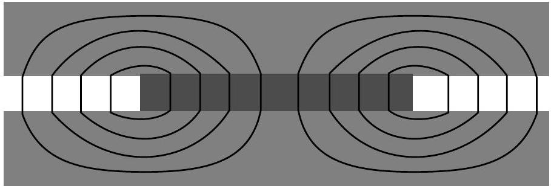

Solution 2. The second solution follows mostly the first one, and deviates only after the fields $B _ { 1 }$ and $B _ { 2 }$ have been found. Now we do not introduce the fictitious superconducting loop, and instead calculate carefully all the changes to the magnetic field energy during virtual displacements. Now the current around the perimeter of Remark: those who do not take into account the energy of the dipole will be given zero points for j), k), l), and m).

Solution 3. There is a more intuitive way of finding the field distribution. Using carefully the analogy between electric and magnetic dipole fields, one could convert the problem into a permanent electric polarization inserted between two conducting plates. From similarities among Maxwell equations, it could be observed that $E \approx B , D \approx H$ and $P \approx M$, with some prefactors involving permeabilities and permittivities. Consider putting the smaller capacitor inside the conductor plates, the charge would induce opposite charge that makes field lines perpendicular to the conductor. In addition, there should not be net charge on the metal plates upon insertion of the smaller cylinder. Hence, there is again an uniform charge density of opposite charge on the metal plate spreading over the larger region. Effectively, for $E$ field, it is equivalent to spreading the original charge on smaller plate onto the larger plate. Because the radii has ratio of $2 , E = \frac { Q } { 4 S _ { 0 } \epsilon _ { 0 } } , D _ { 2 } = \frac { Q } { 4 S _ { 0 } }$, and $D _ { 1 } = \frac { Q } { S _ { 0 } } ( 1 - 1 / 4 ) =$ $3 D _ { 2 }$. This agrees with $B _ { 2 } , B _ { 1 }$ in previous solutions. The rest easily follows. (There are confusions about $B$ or $H$ but most are due to the definition of polarization charge or current being considered free or not, a self-consistent derivation would be sufficient.The close-to-centre part of the field of electric and magnetic dipole is opposite and one should be careful about this effect inside polarisation when utilizing the analogy.) the permanent magnet is fixed to $I$ as its magnetisation is assumed to be constant. We can still use the previous expressions for the magnetic field energy if we consider the distance $h$ between the plates to be a variable:

$$
W _ { f } = \frac { \pi d ^ { 2 } h } { 8 \mu _ { 0 } } \left[ B _ { 1 } ^ { 2 } + 3 B _ { 2 } ^ { 2 } \right] , B _ { 1 } = 3 B _ { 2 } = \frac { 3 I \mu _ { 0 } } { 4 h } \Rightarrow W _ { f } = \frac { 3 \mu _ { 0 } \pi d ^ { 2 } I ^ { 2 } } { 32 h } .
$$

In addition to the change of the magnetic field energy, we also need to take into account the energy of the per-

a) correct analogy arguments
b) correct charge distributions
c) E is uniform
e) correct D expressions
f) correct conversion factor
g) $B _ { 2 } = I \mu _ { 0 } / 4 h$
h) $B _ { 1 } = 3 I \mu _ { 0 } / 4 h$
i) $W _ { f } = \frac { \pi } { 8 \mu _ { 0 } } \left[ d ^ { 2 } B _ { 1 } ^ { 2 } + \left( D ^ { 2 } - d ^ { 2 } \right) B _ { 2 } ^ { 2 } \right] h$
j) $W _ { m } = - W _ { f }$
k) $F = \frac { \mathrm { d } W } { \mathrm {~d} h }$
l) $\frac { 3 \pi } { 32 } J ^ { 2 } \mu _ { 0 } d ^ { 2 }$
m) $F \approx 210 \mathrm {~N}$.

0.2 pts
0.2 pts
0.1 pts
0.1 pts
0.1 pts
0.1 pts
0.1 pts
0.1 pts
0.2 pts
0.1 pts
0.1 pts
0.1 pts
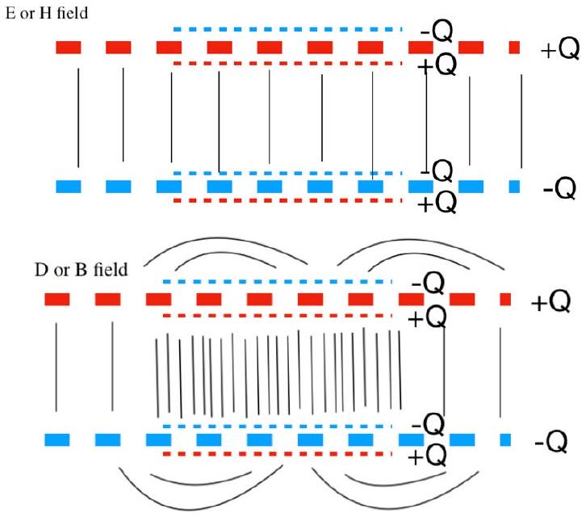

Solution 4. (Incorrect) A solution that has been submitted by a few students uses an infinite number of images of the permanent magnet. This forms an infinite rod, which they assume gives the same magnetic field as a normal magnetised rod would, 0 everywhere outside it. However, since the plates are finite, the magnetic field outside would actually be non-zero, and would need to be calculated according to Solution 1. In this case, only marks corresponding to a), b) and c) in the scheme of Solution 1 should be awarded, i.e. 0.5 marks. If someone doesn't assume the field outside to be 0 , give marks for the subsequent calculations according to solution 1. always pointing in the direction of $\hat { x }$ which ensures the rotational stability of the magnet. Attraction force between two neighbouring rows is contributed only by the vertical nearest-neighbour pairs of balls, so we can just calculate only the interaction force between two such magnets. If two such balls were to be at distance $y$, the interaction energy would be $W = \pm \frac { \mu _ { 0 } m ^ { 2 } } { 4 \pi y ^ { 3 } }$ so that the $y$ directional force $F _ { y } = \frac { \mathrm { d } W } { \mathrm {~d} y } = \mp \frac { 3 \mu _ { 0 } m ^ { 2 } } { 4 \pi y ^ { 4 } }$. This means that the two balls attract if they are antiparallel and repel otherwise. This brings us to the conclusion that the order must be antiferromagnetic, shown below in the sketch.
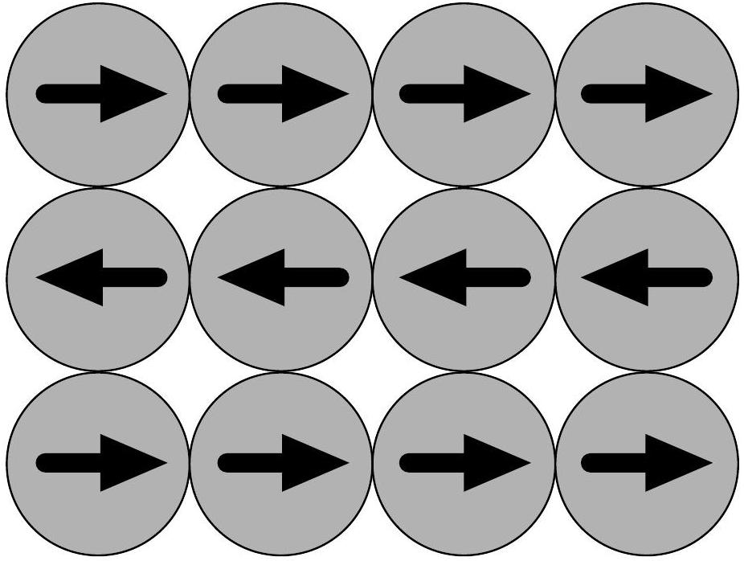

The work needed to pull out one of the magnets is easily found as its interaction energy with the four nearest neighbours, with minus sign, i.e. $W = \vec { B } \cdot \vec { m }$, where $\vec { B } = 2 \vec { B } _ { 1 } + 2 \vec { B } _ { 2 } = \frac { 3 \mu _ { 0 } m } { 2 \pi \delta ^ { 3 } } \hat { x }$ so that $W = \frac { 3 \mu _ { 0 } m ^ { 2 } } { 2 \pi \delta ^ { 3 } } = 29 \mathrm {~mJ}$.

a) Fig: left and right parallel magnets attract
b) Fig: top and bottom antipar. magn. attract
c) $\vec { B }$ from the 4 neighbours $\| \vec { m } \Rightarrow$ no torque
d) correctly marked 12 arrows
e) antiferromagnetic
f) $W = \vec { B } \cdot \vec { m }$
g) $W = \frac { 3 \mu _ { 0 } m ^ { 2 } } { 2 \pi \delta ^ { 3 } }$
h) $W = 29 m J$

0.1 pts
0.1 pts
0.1 pts
0.1 pts
0.1 pts
0.1 pts
0.1 pts
0.1 pts

## Part C: Model of ferromagnetic and antiferromagnetic materials.

Remarks: no marks for d) if any of the magnets has a wrong direction or has no arrow. No marks for e) if the score for d) is zero.
(C.1) Solution 1, Since the task is about finding only one

Solution 2, It appears that there is another stable con- configuration of dipoles, we can just try looking for configuration, see figure below figurations satisfying the requirements. The simplest approach is to start construction with the chain of magnets described in part A.4: if all the dipoles are directed parallel to each other and parallel to the chain, the system is obviously in equilibrium. Now, two such chains can be parallel to each other, and they can be also antiparallel. In both cases, each of the balls is in a stable equilibrium in terms of rotations. Indeed, each of the balls from the left and from the right contribute the field $\vec { B } _ { 1 } = \hat { x } \frac { \mu _ { 0 } m } { 2 \pi \delta ^ { 3 } }$, while each of the balls from above and below contribute $\vec { B } _ { 2 } = \pm \frac { 1 } { 2 } \vec { B } _ { 1 }$, where $\hat { x }$ denotes a horizontal unit vector; '+' corresponds to antiparallel rows, and '-' - to parallel rows. Since $B _ { 2 } < B _ { 1 }$, the sum of the four contributions is

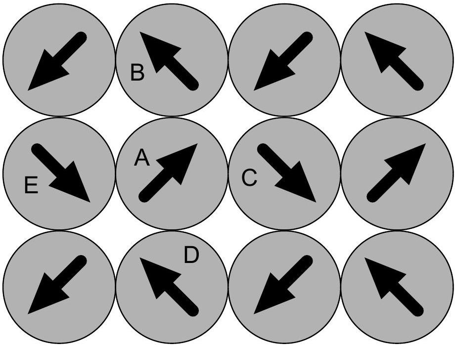

In order to show that this configuration is stable, too, let us find the direction of the magnetic field at the position of one of the balls, the ball marked with A in the figure, due to its four neighbours. Using the formula for the magnetic field of a dipole, we can see that the balls B and D create both field $b ( \hat { x } + 2 \hat { y } )$, where $\hat { x }$ and $\hat { y }$ are horizontal and vertical unit vectors. Meanwhile, both C and E create field $b ( 2 \hat { x } + \hat { y } )$ so that the total field is $6 b ( \hat { x } + \hat { y } )$; this is parallel to the dipole moment of the ball A which means that no torque is exerted on it. What is left to do is to calculate the interaction force between two neighbouring balls, e.g. A and B. One way to do it is to decompose the both dipoles into vertical and horizontal components: $\vec { m } _ { A } = m _ { 0 } \left( \hat { x } + \hat { y } \right.$ and $\vec { m } _ { B } = m _ { 0 } ( - \hat { x } + \hat { y }$, where $m _ { 0 } = m / \sqrt { 2 }$. One can easily see that the pair of dipoles $m _ { 0 } \hat { x }$ and $- m _ { 0 } \hat { x }$ attract, and the same applies to the pair $m _ { 0 } \hat { y }$ and $- m _ { 0 } \hat { y }$. It is also easy to see that there is no horizontal component for the interaction force between the remaining pairs, $m _ { 0 } \hat { x }$ with $m _ { 0 } \hat { y }$ and $m _ { 0 } \hat { y }$ and $- m _ { 0 } \hat { x }$. A little more efforts are needed to see that the horizontal component of the interaction force is also zero. To that end one can calculate first the torque $T _ { A B }$ exerted by dipole A to B with respect to the centre of the ball B, and the torque $T _ { B A }$ exerted by B to A with respect to the centre of the ball A; one can easily see from symmetry that $T _ { A B } = - T _ { B A }$. Due to Newton's third law, with respect to the centre of the ball A, the sum of torques exerted by B to A and by A to B must be zero; it can be expressed as $T _ { A B } + T _ { B A } + F _ { x } \delta = 0$, where $F _ { x }$ denotes the horizontal component of the force exerted by A to B. From this equality we can conclude that $F _ { x } = 0$. So we found that each of the neighbouring balls attract each other, hence the whole configuration is stable.

a) Showing: neighbouring magnets attract
b) $\vec { B }$ from the 4 neighbours $\| \vec { m } \Rightarrow$ no torque
c) correctly marked 12 arrows
d) antiferromagnetic
e) $W = \vec { B } \cdot \vec { m }$
f) $W = \frac { 3 \mu _ { 0 } m ^ { 2 } } { 2 \pi \delta ^ { 3 } }$
g) $W = 29 m J$

(C.2) Now we need to repeat the steps done for the previous question, with the only difference in the mutual placement of the magnets. Also, each of the magnets of the top row interacts now with two magnets of the bottom row with the three magnets forming a equilateral triangle. Since we'll be going to use virtual displacement method, we consider the interaction of three magnets forming an isosceles triangle as shown in the figure; while the base of the triangle remains fixed during virtual displacements, the length of the sides $l$ will change.
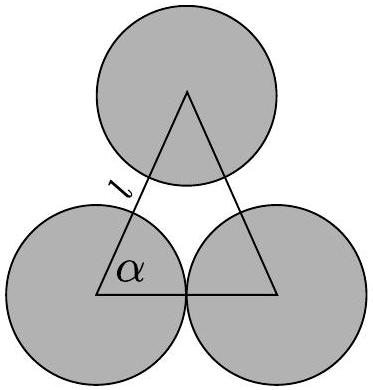
First we need an expression of the magnetic field caused by the two bottom magnets at the centre of the topmost magnet. Due to symmetry, this field must be horizontal; we can use the formula provided in the problem text for finding it. The dipole moment of the left-bottom magnet needs to be divided into components parallel and perpendicular to the radius vector drawn from its centre to the centre of the topmost magnet, $m _ { \| } = m \cos \alpha$ and $m _ { \perp } = m \sin \alpha$. Hence, we can express the resultant $x$ component of the magnetic field as

$$
\vec { B } _ { 3 x } = \frac { \mu _ { 0 } } { 4 \pi l ^ { 3 } } \left( 2 \vec { m } _ { \| } \cos \alpha - \vec { m } _ { \perp } \sin \alpha \right) = \frac { \mu _ { 0 } \vec { m } } { 4 \pi l ^ { 3 } } \left( 3 \cos ^ { 2 } \alpha - 1 \right) .
$$

The magnetic field due to both magnets is therefore $2 B _ { 3 x } \hat { x }$.

As the first thing, we can now analyse the stability of a magnet with respect to rotations. As before, we assume that the magnets in one single row are parallel to each other, and the magnets at the two neighbouring rows are either parallel or antiparallel to each other. In either case, the rows at the top and at the bottom from a given magnet are parallel to each other; let them be oriented along $\hat { x }$. Then, each row contributes $2 B _ { 3 x } \hat { x }$ to the total field at the position of our magnet. The total field has also contributions $\vec { B } _ { 4 x } = \pm \frac { \mu _ { 0 } } { 2 \pi \delta ^ { 3 } }$ from the left and right magnets; here '+' corresponds to the ferromagnetic order, and '-' - to the antiferromagnetic order. Keeping in mind that $l = \delta$ and $\cos \alpha = \frac { 1 } { 2 }$ the total field is

$$
\vec { B } _ { 5 } = 4 \vec { B } _ { 3 x } + 2 \vec { B } _ { 4 x } = \frac { \mu _ { 0 } m } { 2 \pi \delta ^ { 3 } } \left( - \frac { 1 } { 2 } \pm 2 \right) \hat { x } .
$$

This is parallel to the given magnetic dipole for both '+' and '-', which ensures stability in any case.

With $\vec { m } = \pm \hat { x } m$ and $y$ denoting the height of the isosceles triangle, the vertical component of the interaction force of a magnet with a magnet in the bottom row can be found as

$$
F _ { 5 y } = \frac { \mathrm { d } } { \mathrm {~d} y } \vec { B } _ { 3 } \cdot \vec { m } = \pm \frac { \mathrm { d } l } { \mathrm {~d} y } \frac { \mathrm {~d} } { \mathrm {~d} l } \frac { \mu _ { 0 } m ^ { 2 } } { 4 \pi l ^ { 3 } } \left( \frac { 3 \delta ^ { 2 } } { 4 l ^ { 2 } } - 1 \right) = \mp \frac { \mathrm { d } l } { \mathrm {~d} y } \frac { 3 \mu _ { 0 } m ^ { 2 } } { 16 \pi \delta ^ { 3 } } ;
$$

here we have used $\cos \alpha = \frac { \delta } { 2 l }$ and upon taking derivative, substituted $l = \delta$. For this force to be attractive, we

need a minus sign which corresponds to the ferromagnetic order (keep in mind that $\frac { \mathrm { d } l } { \mathrm {~d} y } > 0$ ). Now we are ready to mark the direction of the dipoles on the sketch, see the figure below.
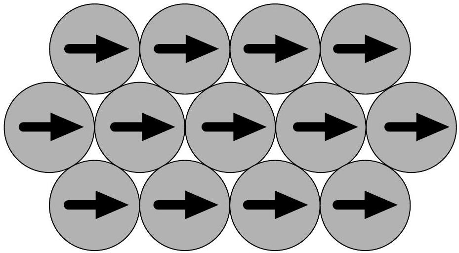

The work needed to pull out a magnet is found similarly to the part (C.1):

$$
W = \vec { B } _ { 5 } \cdot m \hat { x } = \frac { 3 \mu _ { 0 } m ^ { 2 } } { 4 \pi \delta ^ { 3 } } = 15 \mathrm {~mJ} .
$$

a) $\vec { B } _ { 3 x } = \frac { \mu _ { 0 } \vec { m } } { 4 \pi l ^ { 3 } } \left( 3 \cos ^ { 2 } \alpha - 1 \right)$
b) $\vec { B } _ { 4 x } = \pm \frac { \mu _ { 0 } } { 2 \pi \delta ^ { 3 } }$
c) $\vec { B } _ { 5 } = 4 \vec { B } _ { 3 x } + 2 \vec { B } _ { 4 x }$
d) $\vec { B } _ { 5 } = \frac { \mu _ { 0 } m } { 2 \pi \delta ^ { 3 } } \left( - \frac { 1 } { 2 } \pm 2 \right) \hat { x }$.
e) $F _ { 5 y } = \frac { \mathrm { d } } { \mathrm { d } y } \vec { B } _ { 3 } \cdot \vec { m }$
f) $F _ { 5 y } = \mp \frac { \mathrm { d } l } { \mathrm {~d} y } \frac { 3 \mu _ { 0 } m ^ { 2 } } { 16 \pi \delta ^ { 3 } }$
g) $F _ { 5 y }$ attractive
h) correctly marked 12 arrows
i) ferromagnetic
j) $W = \frac { 3 \mu _ { 0 } m ^ { 2 } } { 4 \pi \delta ^ { 3 } }$
k) $W = 15 m J$

Remark: ± signs are not required as long as the correct sign corresponding to the ferromagnetic order are used: meaning, + sign in f) and - sign in d). No marks for e) if the score for d) is zero.

## T2: James Webb Space Telescope (12 pts)

## Updated July 15, 12:30 PM China Time

Changes since July 13, 4:30 PM China Time are highlighted in red, unless those changes are only correcting minor typos that don't affect marking scheme. You are particularly urged to pay attention to any red changes in the marking scheme, as some of these may have occurred after papers were initially marked.

## Some general notes for entire Theory 2 marking

An equation which is dimensionally correct, but missing a multiplicative factor or having a single transcription error from a previous equation, will receive a deduction of -0.1 pts.

An equation which is dimensionally incorrect or one which has more than two transcription errors will receive no points.

Follow on errors are not transcription errors; the only penalty will be in the first occurrence of a mistake, except in the case of a dimensionally incorrect equation, which still receives no points, even if a follow on error.

There are two follow on caveats below.
If an error in an equation trivializes the remainder of the problem, then no additional points after that should be awarded. For example, if a student is computing counts, and they arrive at the incorrect answer of zero, then they should not get future points that compute intensity, density, uncertainty, as these would all become trivial.

If an error in an equation makes the remainder of a problem physically unrealistic, then they should get no points for any requested numerical results, but they can continue to get points for theoretical equations. For example, if a student has an extra factor of 100, they can get points for derivations, but if asked to find a temperature they will not get points for reporting 100 times the actual temperature. They will also not get points for reporting the correct actual temperature, because it will not be consistent with their theory.

If an equation can be implied to have been used, then the assumption is that it did exist and would get points. For example, writing Eq. 7 without explicitly writing Eq. 6 would get points for both equations, subject to error rules above.

In places on the mark scheme there are a range of acceptable answers, and in places the range is divided into two possible ranges, a close range for full points, and a larger range for partial points. This might appear like this:

$$
\begin{array} { l | l }
35 \mu \mathrm {~m} \leq d _ { d } \leq 47 \mu \mathrm {~m} & 0.2 \mathrm { pts } \\
20 \mu \mathrm {~m} \leq d _ { d } \leq 90 \mu \mathrm {~m} & 0.1 / 0.2 \mathrm { pts }
\end{array}
$$

which means that they get 0.2 pts if they are within the narrow range, but only 0.1 pts if they are outside the narrow range but still within the larger range. They would never get 0.3 pts in this scheme, so don't double count!

## Part A: Imaging a Star (1.8 pt)

1. Diameter of image The ratio of diameter $d _ { o }$ for an object at a distance $D _ { o } \gg f$ and an image diameter $d _ { i }$ is given by

$$
\begin{equation*}
\frac { d _ { i } } { d _ { o } } = \frac { f } { D _ { o } } , \tag{3}
\end{equation*}
$$

so the diameter of the image is

$$
\begin{aligned}
d _ { i } & = \frac { \left( 1.7 \times 10 ^ { 11 } \mathrm {~m} \right) ( 130 \mathrm {~m} ) } { ( 89 \mathrm { ly } ) \left( 3 \times 10 ^ { 8 } \mathrm {~m} / \mathrm { s } \right) ( 365 \mathrm {~d} / \mathrm { y } ) ( 86,400 \mathrm {~s} / \mathrm { d } ) } = \\
& = 2.6 \times 10 ^ { - 5 } \mathrm {~m} = 26 \mu \mathrm {~m}
\end{aligned}
$$

Marking scheme:

$$
\begin{array} { l | l }
\text { correct formula Eq } 3 & 0.2 \text { pts } \\
d _ { i } = ( 26 \pm 1 ) \mu \mathrm { m } & 0.2 \text { pts } \\
\hline \text { sum } & \mathbf { 0 . 4 p t s }
\end{array}
$$

Units must be shown for a numerical result to get points; writing the correct answer without showing work also receives full marks for this problem.

2. Diameter of central maximum
The angular radius of the central maximum is

$$
\begin{equation*}
\theta _ { \min } = 1.22 \frac { \lambda } { D } \tag{4}
\end{equation*}
$$

$\lambda = 800 \mathrm {~nm}$ is given in the problem
$D$ is the aperture size, which is the primary mirror, or $\frac { \pi } { 4 } D ^ { 2 } = 25 \mathrm {~m} ^ { 2 }$, so

$$
D = 5.6 \mathrm {~m}
$$

The diameter of the central maximum is then

$$
\begin{equation*}
d _ { d } = 2 \theta _ { \min } f = 2.44 \frac { \lambda } { D } f = 1.22 \frac { \lambda f } { \sqrt { A / \pi } } \tag{5}
\end{equation*}
$$

The numerical value is

$$
\begin{aligned}
d _ { d } & = 2 ( 1.22 ) \frac { \left( 8 \times 10 ^ { - 7 } \mathrm {~m} \right) } { ( 5.6 \mathrm {~m} ) } ( 130 \mathrm {~m} ) = \\
& = 4.5 \times 10 ^ { - 5 } \mathrm {~m} = 45 \mu \mathrm {~m}
\end{aligned}
$$

$d _ { d } = 37 \mu \mathrm {~m}$ is also acceptable (omitting the factor of 1.22 is okay).
Marking scheme:

| correct formula Eq 5 | 0.1 pts |
| :--- | :--- |
| Aperture $D = ( 5.6 \pm 0.2 ) \mathrm { m }$ | 0.1 pts |
| $35 \mu \mathrm {~m} \leq d _ { d } \leq 47 \mu \mathrm {~m}$ | 0.2 pts |
| sum | 0.4pts |

No penalty for ignoring factor of 1.22, so check their math. Units must be shown for a numerical result to get points; writing the correct answer without showing work also receives full marks for this problem.
3. Equilibrium temperature of the detector at the location of the image?
The radiant power from the star is
$$
\begin{equation*}
P _ { g } = 4 \pi r _ { o } { } ^ { 2 } \sigma T _ { g } { } ^ { 4 } \tag{6}
\end{equation*}
$$

The intensity at the location of the scope is

$$
\begin{equation*}
I _ { g } = \frac { P _ { g } } { 4 \pi D _ { o } { } ^ { 2 } } = \left( \frac { r _ { o } } { D _ { o } } \right) ^ { 2 } \sigma T _ { g } ^ { 4 } \tag{7}
\end{equation*}
$$

This is collected onto the mirror with area $A$ and focused on a single spot of radius $r _ { i }$, so that the power incident is

$$
\begin{equation*}
P _ { i } = A \left( \frac { r _ { o } } { D _ { o } } \right) ^ { 2 } \sigma T _ { g } { } ^ { 4 } = A \left( \frac { r _ { i } } { f } \right) ^ { 2 } \sigma T _ { g } { } ^ { 4 } \tag{8}
\end{equation*}
$$

But at the image we have an equilibrium temperature of

$$
P _ { i } = a \sigma T _ { p } { } ^ { 4 } ,
$$

where $a = \pi r _ { i } ^ { 2 }$, so

$$
a \sigma T _ { p } ^ { 4 } = \left( \frac { r _ { i } } { f } \right) ^ { 2 } A \sigma T _ { g } ^ { 4 }
$$

or, ignoring diffraction,

$$
\begin{equation*}
T _ { p } = \left( \frac { A } { \pi f ^ { 2 } } \right) ^ { \frac { 1 } { 4 } } T _ { g } \approx 530 \mathrm {~K} \tag{9}
\end{equation*}
$$

When considering diffraction the actual area of the stars' image is larger,

$$
\begin{equation*}
a ^ { \prime } = \left( \frac { d _ { i } + d _ { d } } { d _ { i } } \right) ^ { 2 } a \approx 7.46 a \tag{10}
\end{equation*}
$$

where the actual ratio depends on answers above. This means the actual pixel temperature will be

$$
\begin{equation*}
T _ { p , \text { correct } } = \left( \frac { A } { ( 7.46 ) \pi f ^ { 2 } } \right) ^ { \frac { 1 } { 4 } } T _ { g } \approx 320 \mathrm {~K} . \tag{11}
\end{equation*}
$$

Marking scheme:

| power of source, Eq 6 | 0.2 pts |
| :--- | :--- |
| intensity at mirror, Eq 7 | 0.2 pts |
| power of image, Eq 8 | 0.2 pts |
| correct for diffraction Eq. 10 | 0.1 pts |
| Either Eq. 9 or Eq. 11 | 0.1 pts |
| numerical result | 0.2 pts |
| sum | 1.0 pt |

Units must be shown for a numerical result to get points; the answer $T \approx ( 320 \pm 10 ) \mathrm { K }$ for including diffraction or $T \approx ( 530 \pm 10 ) \mathrm { K }$ for ignoring diffraction must be consistent with their approach. Check the number, since the ratio in Eq 10 depends on their answer to A. 2

Students must present a symbolic equation in their solution.
Writing Eq. 11 without showing any other work receives 0.8 pts; Writing Eq. 9 without showing any other work receives 0.7 pts.

## Part B: Counting Photons (1.8 pt)

1. Temperature of source
We are interested in the slope of the graph, which is
$$
\text { slope } = \frac { ( 3 ) - ( - 1 ) } { ( 0.111 / \mathrm { K } ) - ( 0.151 / \mathrm { K } ) } = - 100 \mathrm {~K}
$$
Since this is a characteristic temperature, it is at least a partial answer to the problem.
The value of
$$
\left| \frac { \Delta E _ { g } } { 6 k _ { B } } \right| = \ln 10 \times 100 \mathrm {~K} = 230 \mathrm {~K}
$$
So the value of
$$
\frac { \Delta E _ { g } } { k _ { B } } = 6 \times 230 \mathrm {~K} = 1380 \mathrm {~K}
$$
Marking scheme:
$$
\begin{array} { l | l }
\text { slope of graph } = - 100 \mathrm {~K} & 0.2 \mathrm { pts } \\
T _ { \text {graph } } = 230 \mathrm {~K} & 0.1 \mathrm { pts } \\
T _ { \text {source } } = 1380 \mathrm {~K} & 0.1 \mathrm { pts } \\
\hline \text { sum } & \mathbf { 0 . 4 } \mathbf { p t }
\end{array}
$$
Writing either temperature correctly implies they found the slope of graph, and would get the +0.2 pts. Just writing $T _ { \text {source } } = 1380 \mathrm {~K}$ gets full marks, as it really is possible to solve this in one's head.
Order of magnitude $T = 10 ^ { 3 } \mathrm {~K}$ will get full marks, and no work needs to be shown.
As this is order of magnitude, the following final answers will get full marks: $T = 600 \mathrm {~K} , T = 1000 \mathrm {~K}$, $T = ( 1380 \pm 10 ) \mathrm { K } , T = 1500 \mathrm {~K}$. Other numbers in the range $500 \leq T \leq 1500$ that are more precise than these answers ought have a problem score of no more that 0.2 pts, and must show working that supports their answers!
2. Write an expression for the total count uncertainty $\sigma _ { t }$
The three uncertainties are

$$
\sigma _ { r }
$$

and

$$
\sigma _ { d } = \sqrt { i _ { d } \tau }
$$

and

$$
\sigma _ { p } = \sqrt { p \tau }
$$

and then

$$
\sigma _ { t } { } ^ { 2 } = \sigma _ { r } { } ^ { 2 } + \left( i _ { d } + p \right) \tau
$$

Marking scheme:

| correct error for dark current | 0.1 pts |
| :--- | :--- |
| correct read photon | 0.1 pts |
| added in quadrature | 0.2 pts |
| sum | 0.4 pt |

Writing

$$
\sigma _ { t } = \sigma _ { r } + \sqrt { i _ { d } \tau } + \sqrt { p \tau }
$$

only gets +0.1, instead of the quadrature +0.2
Forgetting the read error term is a -0.1 pt deduction.
Correct dark current and photon count errors in final answer are acceptable evidence for those points; it is not necessary for the student to explicitly state what is what.
3. Determine the photon count for a signal to noise ratio of $S / N = 10$.
At a temperature of $T = 7.5 \mathrm {~K}$, the dark current is $i _ { d } =$ 5 electrons/second. This gives a total dark current count of

$$
i _ { d } \tau = 5 \times 10 ^ { 4 }
$$

Answers in the range $i _ { d } = 5 \pm 1$ will be accepted for full marks.
Let $P$ be the photon count. Then

$$
P = 10 \sigma _ { t }
$$

so

$$
\begin{equation*}
P ^ { 2 } = 100 \left( \sigma _ { r } ^ { 2 } + i _ { d } \tau + P \right) \tag{12}
\end{equation*}
$$

with solution $P \approx 2290$, and a rate of $p = 0.229$ photons per second.
Marking scheme:

$$
\begin{array} { l | l }
i _ { d } = ( 5 \pm 1 ) \mathrm { e } / \mathrm { s } & 0.2 \mathrm { pts } \\
1 \leq i _ { d } \leq 10 & 0.1 / 0.2 \mathrm { pts } \\
\mathrm { Eq } 12 & 0.1 \mathrm { pts } \\
0.206 \leq p \leq 0.25 & 0.2 \mathrm { pts } \\
0.10 \leq p \leq 0.33 & 0.1 / 0.2 \mathrm { pts } \\
\hline \text { sum } & \mathbf { 0 . 5 } \mathbf { p t }
\end{array}
$$

They only get the points for $p$, the count rate, if it agrees with their assumption for $i _ { d }$, so check the math!

Writing only the absolute counts $P$ instead of the rate $p$ would get 0.1 pts for $2060 < P < 2500$ and no points if outside this range.
Ignoring $\sigma _ { r }$ does not incur a penalty, as it is relatively small.
4. What is intensity of source?

The near-infrared photons have an energy of $E _ { g } =$ $2.3 \times 6 k _ { B } T$, so

$$
E _ { \lambda } = ( 1380 \mathrm {~K} ) \left( 1.38 \times 10 ^ { - 23 } \mathrm {~J} / \mathrm { K } \right) = 1.9 \times 10 ^ { - 20 } \mathrm {~J}
$$

This is not an order of magnitude question like B. 1
The energy received every second is

$$
E = ( 0.23 ) \left( 1.9 \times 10 ^ { - 20 } \mathrm {~J} \right) = 4.4 \times 10 ^ { - 20 } \mathrm {~J}
$$

and the incident intensity on the primary mirror is then

$$
I = \frac { E / t } { A } = \frac { \left( 4.4 \times 10 ^ { - 20 } \mathrm {~J} / \mathrm { s } \right) } { \left( 25 \mathrm {~m} ^ { 2 } \right) } = 1.8 \times 10 ^ { - 22 } \mathrm {~W} / \mathrm { m } ^ { 2 }
$$

Marking scheme:

| $E _ { \lambda } = ( 2 \pm 0.1 ) \times 10 ^ { - 20 } \mathrm {~J}$ | 0.3 pts |
| :--- | :--- |
| Forgetting ln 10 factor | -0.1 pts |
| $I = ( 1.8 \pm 0.2 ) \times 10 ^ { - 22 } \mathrm {~W}$ | 0.2 pts |
| sum | 0.5 pt |

If they forget factor $\ln 10$, then the correct intensity would be $( 7.8 \pm 0.2 ) \times 10 ^ { - 23 } \mathrm {~W}$. They only get the ln 10 penalty once!

## Part C: The Passive Cooling

1. Find expressions for the temperatures of first and fifth sheet
This is a cleaned up version of an "ideal" solution
Let $Q _ { i }$ represent heat flow off of a surface, and $Q _ { i j }$ represent the heat flow difference off of two surfaces that are facing each other.
The student needs to consider the three types of differences below:
Between sun and first sheet:
$$
\begin{equation*}
Q _ { 01 } = \epsilon A \sigma \left( \frac { I _ { 0 } } { \sigma } - T _ { 1 } ^ { 4 } \right) \tag{13}
\end{equation*}
$$
which is the net heat flow into sheet 1 from the sunside.
Between any two adjacent sheets:
$$
\begin{equation*}
Q _ { i j } = \epsilon A \sigma \left( T _ { i } ^ { 4 } - T _ { j } ^ { 4 } \right) , \tag{14}
\end{equation*}
$$
which is not the net heat flow between the sheets, it is merely a convenient expression to use later.
Between last sheet and the cold, cruel vacuum of space:
$$
\begin{equation*}
Q _ { 56 } = \epsilon A \sigma \left( T _ { 5 } ^ { 4 } \right) , \tag{15}
\end{equation*}
$$
which is the net heat flow out of the far side of the last sheet.
From the problem text, the flux emitted by one sheet and absorbed by an adjacent sheet is
$$
q _ { i } = \alpha Q _ { i }
$$
so that the net heat flow flux out of one sheet absorbed by the adjacent sheet is
$$
q _ { i j } = \alpha Q _ { i j }
$$
and the flux ejected into space between two sheets is
$$
q _ { i j } ^ { \prime } = \beta Q _ { i j }
$$
This doesn't affect the marking, but the approximation being made here is that $\beta$ is the same for all four pairs of adjacent sheets. This makes the math solvable, and was the explicit assumption that the students were told to make.
A student will need to recognize that
$$
\begin{align*}
Q _ { 01 } & = \epsilon A \sigma \left( \frac { I _ { 0 } } { \sigma } - T _ { 1 } ^ { 4 } \right)  \tag{16}\\
Q _ { 12 } & = \epsilon A \sigma \left( T _ { 1 } ^ { 4 } - T _ { 2 } ^ { 4 } \right)  \tag{17}\\
Q _ { 23 } & = \epsilon A \sigma \left( T _ { 2 } ^ { 4 } - T _ { 3 } ^ { 4 } \right)  \tag{18}\\
Q _ { 34 } & = \epsilon A \sigma \left( T _ { 3 } ^ { 4 } - T _ { 4 } ^ { 4 } \right)  \tag{19}\\
Q _ { 45 } & = \epsilon A \sigma \left( T _ { 4 } ^ { 4 } - T _ { 5 } ^ { 4 } \right)  \tag{20}\\
Q _ { 56 } & = \epsilon A \sigma \left( T _ { 5 } ^ { 4 } \right) \tag{21}
\end{align*}
$$
can be summed to give
$$
\begin{equation*}
Q _ { 01 } + Q _ { 12 } + Q _ { 23 } + Q _ { 34 } + Q _ { 45 } + Q _ { 56 } = \epsilon A I _ { 0 } \tag{22}
\end{equation*}
$$

A student will need to consider energy balance across any one sheet:

$$
\begin{equation*}
q _ { i - 1 , i } = q _ { i , i + 1 } + q _ { i , i + 1 } ^ { \prime } \tag{23}
\end{equation*}
$$

basically stating that the net flow into sheet $i$ from sheet $i - 1$ must equal the net flow out of sheet $i$ to either sheet $i + 1$ or into space.
Substitute in $Q _ { i j }$,

$$
\alpha Q _ { i - 1 , i } = \alpha Q _ { i , i + 1 } + \beta Q _ { i , i + 1 }
$$

or

$$
\begin{equation*}
Q _ { i - 1 , i } = \left( \frac { \alpha + \beta } { \alpha } \right) Q _ { i , i + 1 } \tag{24}
\end{equation*}
$$

The relation for sheet 1 is a little different:

$$
\begin{equation*}
q _ { 0,1 } = Q _ { 0,1 } = \alpha Q _ { 1,2 } + \beta Q _ { 1,2 } \tag{25}
\end{equation*}
$$

and so is the relation for sheet 5:

$$
\begin{equation*}
q _ { 4,5 } = Q _ { 5,6 } \tag{26}
\end{equation*}
$$

What will eventually matter most is

$$
\begin{equation*}
Q _ { 5,6 } = \frac { \alpha ^ { 4 } } { ( \alpha + \beta ) ^ { 4 } } Q _ { 0,1 } \tag{27}
\end{equation*}
$$

Now use the recursion of Eq. 24 to sum up the $\operatorname { six } Q _ { i j }$ terms in Eq. 22:

$$
\begin{equation*}
k Q _ { 0,1 } = \epsilon A I _ { 0 } , \tag{28}
\end{equation*}
$$

with the constant $k$ defined as

$$
\begin{equation*}
k = 1 + \frac { 1 } { \alpha + \beta } + \frac { \alpha } { ( \alpha + \beta ) ^ { 2 } } + \frac { \alpha ^ { 2 } } { ( \alpha + \beta ) ^ { 3 } } + \frac { \alpha ^ { 3 } } { ( \alpha + \beta ) ^ { 4 } } + \frac { \alpha ^ { 4 } } { ( \alpha + \beta ) ^ { 4 } } \tag{29}
\end{equation*}
$$

Substitute the expression for $Q _ { 0,1 }$ back into Eq. 13 and get

$$
\begin{equation*}
T _ { 1 } = \sqrt [ 4 ] { \frac { I _ { 0 } } { \sigma } \left( 1 - \frac { 1 } { k } \right) } = \sqrt [ 4 ] { \frac { I _ { 0 } } { k \sigma } ( k - 1 ) } \tag{30}
\end{equation*}
$$

and the into Eq. 27 and Eq. 15 to get

$$
\begin{equation*}
T _ { 5 } = \frac { \alpha } { \alpha + \beta } \sqrt [ 4 ] { \frac { I _ { 0 } } { k \sigma } } \tag{31}
\end{equation*}
$$

which can also be written elegantly as

$$
T _ { 5 } = \frac { \alpha } { \alpha + \beta } \sqrt [ 4 ] { \frac { 1 } { k - 1 } } T _ { 1 } .
$$

Marking scheme:
Net flow into sheet 1 Eq 13 0.2 pts
"Net" flow sheet $i \rightarrow j$ Eq 14
0.2 pts
Net flow out of sheet 5 Eq 15
0.2 pts
Sum to eliminate sheet temps Eq 22
0.2 pts
Generic Energy flow Eq 23
0.2 pts
Recursion for $Q _ { i j }$ Eq 24
Recursion for $Q _ { i j }$ Eq 24
Sheet 1 Energy flow Eq 25
Sheet 1 Energy flow Eq 25
Sheet 5 Energy flow Eq 26
Sheet 5 Energy flow Eq 26
Simplify sum Eq 28
Simplify sum Eq 28
Find $k$ Eq 29
Find $k$ Eq 29
Final Expression for $T _ { 1 }$, Eq 30
Final Expression for $T _ { 1 }$, Eq 30
Final Expression for $T _ { 5 }$, Eq 31
Final Expression for $T _ { 5 }$, Eq 31
sum
sum 2.4 pt

- In most cases a single mistake in an equation that is still dimensional correct will get 0.1 pts for the equation. Making the same mistake multiple times is not a follow on error, and would be penalized every time.
- Any equivalent to Eq 14 would get the 0.2 pts.
- Any attempt to balance energy flow on a generic sheet like Eq 23 that is dimensionally correct and reasonable given their presentation would get the 0.2 pts
- Since sheet 1 and sheet 5 have a different energy balance approach, they must show those separately to get those points.
- It is possible to arrive at Eq 28 based on dimensional analysis alone. A student who writes some form of Eq 28 without clear justification would get points for Eq 22 and Eq 28. They could get full marks for final sheet temperatures if it is consistent; if they did, then they would probably also get at least partial points for Eq 13 and/or Eq 15. They would need to introduce one more unknown constant to have defined $Q _ { 56 } = k ^ { \prime } Q _ { 01 }$. The maximum points I would expect with this approach is 1.2 pts.
- $k$ in Eq 29 is allowed a single error for 0.1 pts. Two errors is no points.
- Failing to include the back flux of Eq 14 is only a penalty on that equation but would be zero points, as it is a serious error. That means writing the equivalent of $Q _ { i j } = \epsilon A T _ { i } ^ { 4 }$ is zero points! The work after this would have a follow on error that would need to be traced.

## Corrections to some of the above formula

Andres Poldaru, leader from Estonia, pointed out an inconsistency in part of the Eq. 23 above derivation. The above equation does reflect the simplified schematic diagram of energy flow and loss on the question paper, but does not properly reflect the energy balance on an individual sheet. It should read, for sheets 2,3 , and 4 , as

$$
q _ { i - 1 , i } = q _ { i , i + 1 } + 2 B Q _ { i }
$$

where $B$ is the physical fraction of energy lost to space from one side of a sheet, and $Q _ { i } = \epsilon A \sigma T _ { i } ^ { 4 }$. A similar correction would exist for sheet 1 and 5, except that the factor of 2 in front of $B$ would be 1, as

$$
Q _ { 01 } = q _ { 12 } + B Q _ { 1 } \text { and } q _ { 45 } = Q _ { 56 } + B Q _ { 5 }
$$

The factor of 2 isn't the problem, it is instead that it is now difficult to align the expression for energy loss to space between sheets with the energy lost to space of a specific sheet. As such, this approach creates a much messier solution.

There is no convenient way to solve these corrected five equations without iterating, which is the motivation for some of our substitutions and approximations above, or by creating a five by five matrix and diagonalizing. At least some students attempted to do it this way.
It does not change Eq. 28, it does change the expression for the convenient constant in Eq. 29. It also changes the fifth sheet heat flow, Eq. 27. Because the variations of what students can cook up while trying to reconcile difficult physics can be numerous, all of the possible results are not presented here, as they depend on what assumptions the students opted to make.

It does not affect the approach to C. 2 or the scoring of numerical bounds on C. 3
Additional Marking Guidance:

- A generic energy flow expression like Eq. 23 that is consistent with what the student has presented will get 0.2 pts. The energy flow expression can have one reasonable simplifying assumption/approximation, so long as it does not make it trivial, for no penalty.
- A recursion relation like Eq. 24 that is consistent with what the student has presented will get 0.2 pts. The recursion relation can have one reasonable simplifying assumption/approximation, so long as it does not make it trivial, for no penalty. This likely means that the student introduced a few constants to keep it clean. That's okay. Errors in the recursion relation that are unsupported by statements of approximation or reasonable physics, or are just plain bad math, would have a penalty of -0.1 pts.
- Equations 13 and 15 must be consistent with the student's statement of Eq. 23, or they would get a penalty of-0.1 pts. In short, pick specific approach.
- Eq. 29 must be consistent with the student's approach; similarly, the final expressions for $T _ { 1 }$ and $T _ { 5 }$
- Attempting to write this problem as a matrix but not being able to solve it is equivalent to writing a recursion relation for 0.2 pts and simplifying the sum for 0.2 pts; in theory they have already gotten much or most of the points above that. Not solving the matrix, however, will have a maximum score of 2.2 pts, assuming everything else is there.
- As a reminder, don't mix and match grading schemes; follow an approach that is self consistent, and if more than one scoring approach is valid, select the one that gives the higher score.

## Original Solution

Don't use this, eh?
Start with a statement of net energy flow $q _ { 01 }$ into the first sheet from the sun:

$$
\begin{equation*}
q _ { 01 } = \epsilon A \left( I _ { 0 } - \sigma T _ { 1 } ^ { 4 } \right) \tag{32}
\end{equation*}
$$

where $A$ is the area of the sheet, $\epsilon$ is the emissivity, $\sigma$ is the StefanBoltzman constant, and $T _ { 1 }$ is the temperature of the first sheet.
Now consider the space between two sheets $i$ and $j$. Each sheet radiates an energy flow

$$
\epsilon A \sigma T ^ { 4 }
$$

toward the other sheet, but a fraction $\beta$ is ejected into space out the gap.
We have defined $\alpha$ as the fraction emitted from one sheet that is absorbed by the other sheet, so the net energy flow from sheet $i$ into sheet $j$ is

$$
\begin{equation*}
q _ { i j } = \alpha \epsilon A \sigma \left( T _ { i } { } ^ { 4 } - T _ { j } { } ^ { 4 } \right) \tag{33}
\end{equation*}
$$

There is also a lost fraction emitted into space from between the sheets, given by

$$
\begin{equation*}
q _ { i j } ^ { \prime } = \beta \epsilon A \sigma \left( T _ { i } { } ^ { 4 } - T _ { j } { } ^ { 4 } \right) = \frac { \beta } { \alpha } q _ { i j } \tag{34}
\end{equation*}
$$

Don't make the mistake of assuming that $\alpha + \beta = 1$, as some of the energy emitted from a sheet could be reabsorbed by that sheet.
Finally, write an expression for the net thermal radiant energy flow into space, with an ambient temperature of $T _ { \text {space } } = 0$, from the far side of the fifth sheet.

$$
\begin{equation*}
q _ { 5 s } = \epsilon A \left( \sigma T _ { 5 } ^ { 4 } - \sigma T _ { s } ^ { 4 } \right) = A \epsilon \sigma T _ { 5 } ^ { 4 } \tag{35}
\end{equation*}
$$

Write each of the Eq. 33, above in the form

$$
\begin{equation*}
\frac { 1 } { \alpha } q _ { i j } = A \epsilon \sigma \left( T _ { i } ^ { 4 } - T _ { j } ^ { 4 } \right) , \tag{36}
\end{equation*}
$$

and then sum up the terms from Eq. 32, the four from Eqs. 36, and Eq. 35:

$$
\begin{equation*}
q _ { 01 } + \frac { 1 } { \alpha } \left( q _ { 12 } + q _ { 23 } + q _ { 34 } + q _ { 45 } \right) + q _ { 5 s } = \epsilon A I _ { 0 } \tag{37}
\end{equation*}
$$

as all of the $T _ { i }$ terms cancel out on the right!
Now consider a schematic of the energy flow below
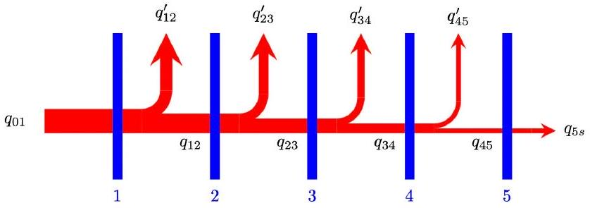
From energy conservation, the net flow into sheet one from the sun and the net flow out of sheet one toward sheet two or ejected from gap is

$$
\begin{equation*}
q _ { 01 } = q _ { 12 } + q _ { 12 } ^ { \prime } \tag{38}
\end{equation*}
$$

where $q _ { 12 } ^ { \prime }$ is the part emitted into space from the gap.
Combine with Eq. 34 and

$$
\begin{equation*}
q _ { 01 } = \left( 1 + \frac { \beta } { \alpha } \right) q _ { 12 } = \frac { \alpha + \beta } { \alpha } q _ { 12 } \tag{39}
\end{equation*}
$$

Similarly, for the remaining pairs of sheets,

$$
q _ { 23 } = \frac { \alpha } { \alpha + \beta } q _ { 12 } = \left( \frac { \alpha } { \alpha + \beta } \right) ^ { 2 } q _ { 01 } ,
$$

and

$$
q _ { 34 } = \frac { \alpha } { \alpha + \beta } q _ { 23 } = \left( \frac { \alpha } { \alpha + \beta } \right) ^ { 3 } q _ { 01 } ,
$$

and

$$
q _ { 45 } = \frac { \alpha } { \alpha + \beta } q _ { 34 } = \left( \frac { \alpha } { \alpha + \beta } \right) ^ { 4 } q _ { 01 } ,
$$

Finally, for the fifth (last) sheet all of the net energy flow in from the fourth sheet must be completely ejected into space on the dark side.

$$
\begin{equation*}
q _ { 5 s } = q _ { 45 } = \left( \frac { \alpha } { \alpha + \beta } \right) ^ { 4 } q _ { 01 } . \tag{40}
\end{equation*}
$$

The sum on the left side of Eq. 37 can then be written as

$$
\begin{equation*}
k q _ { 01 } = \epsilon A I _ { 0 } \tag{41}
\end{equation*}
$$

where

$$
k = 1 + \frac { 1 } { \alpha + \beta } + \frac { \alpha } { ( \alpha + \beta ) ^ { 2 } } + \frac { \alpha ^ { 2 } } { ( \alpha + \beta ) ^ { 3 } } + \frac { \alpha ^ { 3 } } { ( \alpha + \beta ) ^ { 4 } } + \frac { \alpha ^ { 4 } } { ( \alpha + \beta ) ^ { 4 } }
$$

is a convenient constant.
Combining Eq. 32 with Eq. 41,

$$
\frac { \epsilon A I _ { 0 } } { k } = \epsilon A \left( I _ { 0 } - \sigma T _ { 1 } ^ { 4 } \right)
$$

so

$$
\begin{equation*}
T _ { 1 } = \sqrt [ 4 ] { \frac { I _ { 0 } } { \sigma } \left( 1 - \frac { 1 } { k } \right) } = \sqrt [ 4 ] { \frac { I _ { 0 } } { k \sigma } ( k - 1 ) } \tag{42}
\end{equation*}
$$

From above,

$$
q _ { 5 s } = \left( \frac { \alpha } { \alpha + \beta } \right) ^ { 4 } q _ { 01 } .
$$

so

$$
A \epsilon \sigma T _ { 5 } ^ { 4 } = \left( \frac { \alpha } { \alpha + \beta } \right) ^ { 4 } \frac { \epsilon A I _ { 0 } } { k }
$$

or

$$
\begin{equation*}
T _ { 5 } = \frac { \alpha } { \alpha + \beta } \sqrt [ 4 ] { \frac { I _ { 0 } } { k \sigma } } \tag{43}
\end{equation*}
$$

which can also be written elegantly as

$$
T _ { 5 } = \frac { \alpha } { \alpha + \beta } \sqrt [ 4 ] { \frac { 1 } { k - 1 } } T _ { 1 } .
$$

As this part of the question is complex, with multiple ways to go wrong, and many opportunities for approximations, the marking scheme will be necessarily convoluted.
Some expected mistakes:

(a) Failing to account for the back flux of energy. This would be
$$
I _ { 0 } = 2 \sigma T _ { 1 } ^ { 4 }
$$
and then
$$
\alpha \sigma T _ { 1 } ^ { 4 } = 2 \sigma T _ { 2 } ^ { 4 } ,
$$
and so on, concluding with
$$
I _ { 0 } = \sigma \left( \frac { 2 } { \alpha } \right) ^ { 4 } T _ { 5 }
$$
or
$$
T _ { 5 } = \frac { \alpha } { 2 } T _ { 1 }
$$
(b) Inconsistent treatment of emissivity The most likely error is of the form
$$
\epsilon I _ { 0 } = \sigma T _ { 1 } ^ { 4 }
$$
(c) Incorrectly resolving $\beta$ and $\alpha$.
2. Find $\alpha$ and $\beta$

Assuming students grab the hint about effective absorptive areas, then expect
Area of gap:

$$
\begin{equation*}
A _ { \text {gap } } = 4 h \sqrt { A _ { \text {sheet } } } \tag{44}
\end{equation*}
$$

Area of one sheet $A$
Assume that the probability of being absorbed by a sheet is the ratio of effective areas

$$
\begin{equation*}
\alpha = \frac { \epsilon A _ { \text {sheet } } } { 2 \epsilon A _ { \text {sheet } } + A _ { \text {gap } } } \tag{45}
\end{equation*}
$$

This result yields $\alpha = 0.3$.
Assume the probability of ejection is a ratio of effective areas

$$
\begin{equation*}
\beta = \frac { A _ { \text {gap } } } { 2 \epsilon A _ { \text {sheet } } + A _ { \text {gap } } } \tag{46}
\end{equation*}
$$

This result yields $\beta = 0.4$.
Marking Scheme:

| Gap area Eq 44 | 0.2 pts |
| :--- | :--- |
| Estimating $\alpha$ Eq 45 | 0.2 pts |
| Estimating $\beta$ Eq 46 | 0.2 pts |
| Factor of 2 for $A$ in both | 0.2 pts |
| Weighting $A$ by emissivity in both | 0.2 pts |
| Finding $\alpha$ | 0.1 pts |
| $0.25 \leq \alpha \leq 0.35$ | 0.1 pts |
| Finding $\beta$ | 0.1 pts |
| $0.3 \leq \beta \leq 0.83$ | 0.1 pts |
| subtotal | 1.4 pt |
| Find a better $\beta$ | 0.2 pts |
| sum | 1.6 pt |

- "in both" means that to get the points they must have used the factor of two and the emissivity both times; if it is missing from one, they get 0.1 pts for the equation it is present in.
- Find $\alpha$ and $\beta$ means that it is consistent with own work.
- Assuming $2 \alpha + \beta \approx 1$ with proof would mean they only need to find either $\alpha$ or $\beta$, and they would get all of the points upon finding the other one. The highest possible subtotal score in the case would be 1.4 pts. Proof can be simple, however, like saying "two sheets, equal probability of being transmitted or absorbed into the other."
- Assuming $2 \alpha + \beta \approx 1$ without proof would mean they only need to find either $\alpha$ or $\beta$, and they would get 2/3 of the points upon finding the other one. The highest possible subtotal score in the case would be 1.2 pts.
- Assuming $\alpha + \beta \approx 1$ stating a "reasonable" proof would mean they only need to find either $\alpha$ or $\beta$, and they would get 2/3 of the points upon finding the other one. The highest possible subtotal score in the case would be 1.2 pts. Stating "energy conservation" is reasonable, though incomplete.
- Assuming $\alpha + \beta \approx 1$ without any proof would mean they only need to find either $\alpha$ or $\beta$, and they would get 1/2 of the points upon finding the other one. The highest possible subtotal score in the case would be 1.1 pts.
- Finding $\alpha$ and $\beta$ means that it is consistent with own work.
- Read the special note about finding a better $\beta$ below to understand the last 0.2 pts.

Special note
Our assumption is that the rejected heat can be written as

$$
q _ { i j } = \beta \epsilon \sigma A \left( T _ { i } ^ { 4 } - T _ { j } ^ { 4 } \right)
$$

This is certainly true, but $\beta$ would be infinite in the case of $T _ { i } = T _ { j }$. It would have been better to write

$$
q _ { i j } = \beta ^ { \prime } \epsilon \sigma A \left( T _ { i } ^ { 4 } + T _ { j } ^ { 4 } \right)
$$

which would follow the energy conservation rule $2 \alpha + \beta ^ { \prime } = 1$ if $\epsilon \ll 1$.
In fact, $\beta ^ { \prime }$ is really what the student is finding in the approach above.
Assuming that the temperatures of adjacent sheets are related by

$$
T _ { j } = \gamma T _ { i }
$$

then

$$
\beta = \beta ^ { \prime } \frac { 1 + \gamma ^ { 4 } } { 1 - \gamma ^ { 4 } }
$$

In our case,

$$
\gamma ^ { 4 } \approx \frac { ( 100 \mathrm {~K} ) } { ( 400 \mathrm {~K} ) }
$$

which means

$$
\beta = \frac { 5 } { 3 } \beta ^ { \prime } = \frac { 5 } { 3 } - \frac { 10 } { 3 } \alpha
$$

is the best estimate; in our case, we expect $\beta = 0.67$. Any who correctly does this gets those 0.2 pts. If they make a single mistake, but still end up with

$$
1 - \alpha > \beta > 1 - 2 \alpha
$$

they can still get 0.2 pts. If they make two or three mistakes, but still end up with

$$
1 - \alpha > \beta > 1 - 2 \alpha
$$

they can still get 0.1 pts. They only get these points for an effort to deal with our odd definition, and recognizing that the back flux is positive for ejection from the gap. Just writing a different $\beta$ without justification doesn't get these "special" points.
In the event that a student derives

$$
\beta = \frac { 5 } { 3 } \beta ^ { \prime } = \frac { 5 } { 3 } - \frac { 10 } { 3 } \alpha
$$

Then their minimum score for C. 3 should be 0.8 pts, then subtract off 0.1 pt for every error in their derivation if their answer is close. After that, look back at their work on estimating $\alpha$ or $\beta$ alone, and add on half points for any success, up to 1.4 pts (or 1.6 pts, if no mistakes). The score they get for C. 3 would be the larger of the two scoring approaches.
Original Solution
These might still apply in some cases; the first path was rewritten above, so not included, and the second path assumed reflective sheets at angles, so was deleted. Choice C is a variation that can yield a correct value for $\beta$, but it would need to be combined with some other approach to find $\alpha$.
Choice C: Estimate the radiant flux from the gap
Assuming that the enclosed volume is a black body in equilibrium, which it isn't, at a temperature equal to a quartic averaging of the two temperatures: $\frac { 1 } { 2 } \left( T _ { i } ^ { 4 } + T _ { j } ^ { 4 } \right)$. Then the energy is radiated out of the area according to

$$
q _ { \text {lost } } = \sigma A _ { g } \frac { 1 } { 2 } \left( T _ { i } ^ { 4 } + T _ { j } ^ { 4 } \right)
$$

where $A _ { g }$ is the area of the gap, given by

$$
A _ { g } = 4 h \sqrt { A }
$$

But energy was entering the region at the rate

$$
q _ { i n } = \epsilon \sigma A \left( T _ { i } ^ { 4 } + T _ { j } ^ { 4 } \right) ,
$$

so the fraction lost is

$$
\beta = \frac { A _ { g } } { 2 A } = \frac { 2 h } { \epsilon \sqrt { A } } = 0.7
$$

Marking Scheme:

| Estimating flux out of gap | 0.2 pts |
| :--- | :--- |
| Exact flux into volume | 0.2 pts |
| Correct estimate of gap area | 0.2 pts |
| Finding $\beta$ | 0.1 pts |
| $0.65 \leq \beta \leq 0.75$ | 0.1 pts |
| sum | 0.8 pt |

The bounds on allowed values for $\beta$ are smaller in this approach, because there really is only one reasonable answer.
Look back at the full solution to see how to score estimates for $\alpha$ based on this $\beta$.
Note that this approach has fewer possible points, as the expression for the flux out of gap makes an assumption that is based on unchecked physics.
Choice D: Another Approach?

Surely there will be some creative students who show other approaches. We will try and expand the marking scheme to recognise these approaches as soon as they occur. A rough guide for an incomplete approach is
Tentative Marking Scheme:

| Relevant correct physics equation, each | 0.2 pts |
| :--- | :--- |
| Reasonable approximation, each | 0.1 pts |

The maximum possible is still 1.6 pts.
An equation is only relevant if it can be argued that it would lead to an answer to the question within the bounds of the approach that they are following. For example, don't award points for both counting bounces and effective surfaces, unless each equation contributes to a unified approach that would lead to the answer. Find the most rewarding approach, and award points for that line of reasoning.
If a student only finds one of $\alpha$ or $\beta$, then they get 0.2 pts for the first. The marking scheme assumed they would look for $\alpha$ first, but they might have looked for $\beta$, and only found that.
Be very careful with mixing and matching approaches!
A student will not get half the points for one approach plus half the points for another approach if they attempt, but don't succeed, with both approaches. They will be awarded the higher of the two scores, not the sum.
3. Numerically determine the temperature of sheet 1 and the temperature of sheet 5.
The solar intensity is $I _ { 0 } = 1360 \mathrm {~W} / \mathrm { m } ^ { 2 }$, the background temperature of space is $T _ { b } = 20 \mathrm {~K}$ and is negligible.
Assuming a student does C. 1 correctly, and uses $2 \alpha +$ $\beta = 1$, then

| $\beta$ | $\alpha$ | $T _ { 1 } ( \mathrm {~K} )$ | $T _ { 5 } ( \mathrm {~K} )$ |
| :--- | :--- | :--- | :--- |
| 0.3 | 0.35 | 383 | 120 |
| 0.4 | 0.3 | 380 | 102 |
| 0.5 | 0.25 | 376 | 83 |
| 0.6 | 0.2 | 373 | 65 |
| 0.7 | 0.15 | 369 | 48 |

The other bound is $\alpha + \beta = 1$, in that case:

| $\beta$ | $\alpha$ | $T _ { 1 } ( \mathrm {~K} )$ | $T _ { 5 } ( \mathrm {~K} )$ |
| :--- | :--- | :--- | :--- |
| 0.3 | 0.7 | 370 | 189 |
| 0.4 | 0.6 | 368 | 165 |
| 0.5 | 0.5 | 365 | 140 |
| 0.6 | 0.4 | 363 | 114 |
| 0.7 | 0.3 | 361 | 87 |

The numbers agree well with the theoretical performance of 320 K and 90 K. Some of the major differences are explained by different coatings on different surfaces, a temperature and wavelength dependence on emissivity that is designed to reflect visible light from the sun while radiating infrared on the sunside of sheet 1, and the sheets are not uniform temperature.
Marking Scheme:

| $T _ { 1 }$ consistent with own formula | 0.1 pts |
| :--- | :--- |
| $250 \mathrm {~K} \leq T _ { 1 } \leq 400 \mathrm {~K}$ | 0.1 pts |
| $T _ { 5 }$ consistent with own formula | 0.1 pts |
| $45 \mathrm {~K} \leq T _ { 5 } \leq 200 \mathrm {~K}$ | 0.1 pts |
| sum | 0.4 pt |

The grade depends on self consistency with the previous work, so the numbers must be checked!
Note that here is a case where follow on errors could be penalized twice; students should recognize that an answer is not reasonable, as $T _ { 1 }$ should be on the order of the temperature of the Earth, and that $T _ { 5 }$ ought to have shown significant, but not incredible, cooling.

Part D: The Cryo-Cooler

1. What state variables change?
    (a) In order to force the gas through the plug, which offers up considerable viscous friction, $P _ { 1 } > P _ { 2 }$; it is this pressure difference that is the source of the force.
    (b) Viscous friction is dissipative, and the energy of moving through the plug is not allowed to go anywhere else, so the internal energy of the gas must increase as it moves through the plug, and then $U _ { 1 } < U _ { 2 }$.
    (c) Though no heat is gained or lost, this is not a constant entropy process; that can be seen because it is an irreversible process. As such, $S _ { 1 } <$ $S _ { 2 }$
    (d) Since the process of moving across a pressure gradient imparts kinetic energy to an object, it is expected that the fluid velocity on the right will be higher than the left; in fact, we are told this is marginally true. Since mass is conserved, the volume of a mole of gas on the right must also be higher than the volume of a mole on the left, and $V _ { 1 } < V _ { 2 }$.
    (e) The correct answer is $T _ { 1 } ? T _ { 2 }$. If this were an ideal gas, one might expect $T _ { 1 } \leq T _ { 2 }$ since $U \propto T$. But this is not an ideal gas, and $U$ will be a function of temperature and density. As such, it is not possible to know the comparative relation between $T _ { 1 }$ and $T _ { 2 }$. That's the whole point of this problem, and the challenge of trying to make liquid helium.
Marking scheme:
$$
\begin{array} { l | l }
\text { For each correct response } & + 0.2 \mathrm { pts } \\
\hline \mathbf { s u m } & \mathbf { 1 . 0 ~ p t }
\end{array}
$$
Explanations by the students are not needed.
2. A mole of gas at $P _ { 1 } , V _ { 1 } , T _ { 1 } , U _ { 1 }$ enters the porous plug from the left, and that mole of gas exits the porous plug on the other side at $P _ { 2 } , V _ { 2 } , T _ { 2 } , U _ { 2 }$.
Consider first a control volume approach
The figure below shows the motion of a mole of gas through the plug; the mole is shown in pink. Gas to the left of the mole pushes the mole through the plug with a constant force $P _ { 1 } A$ through a volume $V _ { 1 }$.
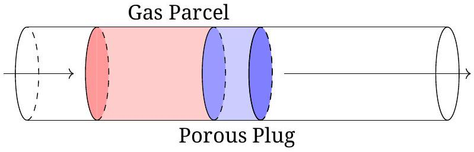
The mole of gas moves through the plug to the right hand side, in the process pushing on the air to the right of the mole with a constant force $P _ { 2 } A$, through a volume $V _ { 2 }$.

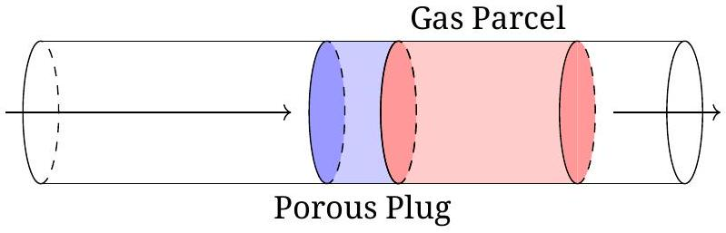
The work that the surrounding gas in region 1 does on the gas pushing it into the plug is

$$
W _ { 1 } = P _ { 1 } V _ { 1 }
$$

because the pressure is constant, and the effective change of volume is $V _ { 1 }$. Similarly, when the gas enters region 2 it must displace a volume $V _ { 2 }$ of gas that was already there, so

$$
W _ { 2 } = - P _ { 2 } V _ { 2 }
$$

The net work is then

$$
\begin{equation*}
W _ { n e t } = P _ { 1 } V _ { 1 } - P _ { 2 } V _ { 2 } \tag{47}
\end{equation*}
$$

Since there is no heat exchanged,

$$
\begin{equation*}
U _ { 2 } - U _ { 1 } = \Delta U = Q + W _ { n e t } = P _ { 1 } V _ { 1 } - P _ { 2 } V _ { 2 } \tag{48}
\end{equation*}
$$

which implies

$$
\Delta U = U _ { 2 } - U _ { 1 } = P _ { 1 } V _ { 1 } - P _ { 2 } V _ { 2 } .
$$

Upon rearranging

$$
U _ { 2 } + P _ { 2 } V _ { 2 } = U _ { 1 } + P _ { 1 } V _ { 1 }
$$

and therefore

$$
U + P V
$$

is a conserved quantity.
Marking scheme:

| Compute correct $W _ { 1 }$ | 0.1 pts |
| :--- | :--- |
| Compute correct $W _ { 2 }$ | 0.1 pts |
| Write energy law, Eq 48 | 0.2 pts |
| Show $U + P V$ conserved | 0.2 pts |
| sum | 0.6 pt |

Consider instead a differential approach
Another way to look at this problem is to focus on a differential sample of gas as it moves through the plug.
The figure below illustrates this
The total energy of parcel of molar size $\delta m$ has two relevant energy terms: the internal energy $\delta U$ and the bulk kinetic energy $\delta K$. It has a volume $\delta V$. These four quantities are extrinsic, but to simplify notation, we will drop the $\delta$. It's still there, just invisible.

For simplicity's sake, assume a cylindrical shape to the parcel, with an end cap area $\delta A$ and a length $d x$. Once again, we will drop the $\delta$. There are three forces that act on the shape, one associated with pressure on the left end, one associated with pressure on the right end, and frictional force associated with viscosity against the walls of the container.

Since this is a parcel of differential length $d x$, the net force associated with the pressure difference between the ends is

$$
F _ { e n d s } = - V \frac { d P } { d x }
$$

where $V$ is again the volume of the cylinder.
But this force is (mostly) balanced by the viscous frictional force $F _ { \text {walls } }$ with the walls of the sponge; these two forces effectively add to zero. In fact, it is the viscous forces with the wall that cause the pressure gradient across the sponge.
The bulk kinetic energy of the parcel does not change significantly as it moves through the sponge. This is seen in that the bulk speed of the gas doesn't change significantly as it moves through the sponge.
The problem with this approach is that the system is not in thermodynamic equilibrium; the process is not reversible, so it is not possible to attach well defined state variables. This means that

$$
\begin{equation*}
d U = T d S - P d V \tag{49}
\end{equation*}
$$

is not a function that can be integrated; in fact, $d S \neq$ 0 from the previous part of the problem. Arguing that $V d P = - T d S$ is rather handwavy, and resolving this actually requires considering a control volume approach.
Still, the energy conservation ideas still hold true, even if thermodynamically poorly defined, so

$$
d U = - P d V - V d P
$$

since the part associated with $- V d P$ doesn't change the bulk kinetic energy, and instead dissipates into internal energy of the gas.
The result is that

$$
d U = - d ( P V )
$$

or

$$
U + P V
$$

is a constant
Marking scheme:

$$
\begin{array} { l | l }
\text { Traditional } \delta W = - P d V & 0.1 \mathrm { pts } \\
\text { Bulk kinetic } \delta K = - V d P & 0.1 \mathrm { pts } \\
\text { Explain where } \delta K \text { goes } & 0.1 \mathrm { pts } \\
\text { Differential Eq } 49 & 0.1 \mathrm { pts } \\
\text { integrate } U + P V \text { constant } & 0.1 \mathrm { pts } \\
\hline \text { sum } & \mathbf { 0 . 5 } / \mathbf { 0 . 6 } \mathbf { p t }
\end{array}
$$

Because of the many subtle traps, this approach will not get the same number of points as the control volume approach.
Writing $d U = - P d V$ and integrating to find $U + P V$ is constant gets only 0.2 pts. This is because there are several errors: the differential is poorly defined within the sponge; because the state variables are poorly defined; $P$ is not a constant; so you can't actually integrate it; and the work done in this case is not correctly computed. Four wrongs don't make a right.
3. One can find pressure on this graph by applying

$$
d U = T d S - P d V
$$

and then requiring constant entropy so that $d S = 0$, and then

$$
\begin{equation*}
P = - \left( \frac { \partial U } { \partial V } \right) _ { S } \tag{50}
\end{equation*}
$$

which are the negative slopes of the constant entropy curves on a $U - V$ graph.
Another approach to find pressure is to consider a line of constant $U$, then

$$
\frac { P } { T } = \left( \frac { \partial S } { \partial V } \right) _ { U }
$$

Then

$$
U + P V = U - \left( \frac { \partial U } { \partial V } \right) _ { S } V
$$

is the conserved quantity.
Now $- ( \partial U / \partial V ) _ { S }$ is measured only at the point $V _ { 1 } , U _ { 1 }$, and is the slope of the tangent line to the constant entropy curve. Following that tangent line back a distance $V$ takes it to an intercept with the $U$ axis, and that intercept is then the conserved quantity.
More mathematically, define a function $H$

$$
H = U + P V
$$

then

$$
U = H _ { 2 } - P _ { 2 } V
$$

is the equation of a line,

$$
\begin{equation*}
U = H _ { 2 } + \left. \left( \frac { \partial U } { \partial V } \right) _ { S } \right| _ { 2 } V \tag{51}
\end{equation*}
$$

with the $U$ intercept equal to the conserved $H _ { 2 }$.
An estimate can be made visually, but it is difficult to be accurate. Try constructing a line from the point $V _ { 2 } = 0.120 , T _ { 2 } = 7.5$ that is tangent to the local isentrope, and the result will intercept the $U$ axis. This result is somewhere around 40. This is shown in green below.
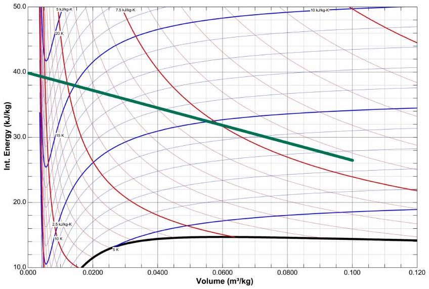
Now to improve the result.
Draw a line out from 39 that is tangent to the nearest isentrope to $V _ { 2 } = 0.100 , T _ { 2 } = 7.5$; draw another

line out from 41 that is also tangent to the nearest isentrope to $V _ { 2 } = 0.100 , T _ { 2 } = 7.5$. These are shown in purple below.

Measuring the distance with a ruler, find the fractional distance between the two purple lines to the point $V _ { 2 } = 0.100 , T _ { 2 } = 7.5$ along the highlighted green line. It is about 75\% the way from the bottom purple line. This means that the conserved quantity ought be 75\% the way up on the highlighted blue section on the graph. A line connecting the two is shown in green.

This point is about 41 kJ/kg. The actual value for the conserved quantity is $U + P V = 40.7 \mathrm {~kJ} / \mathrm { kg }$.
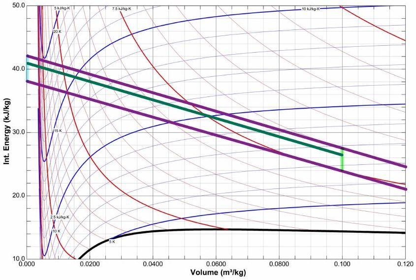

Marking scheme:

| Pressure formula stated, Eq 50 | 0.2 pts |
| :--- | :--- |
| Tangent intercept concept | 0.4 pts |
| A first estimate for $H$ | 0.2 pts |
| Upper bound for estimate set | 0.2 pts |
| Lower bound for estimate set | 0.2 pts |
| Interpolated estimate set | 0.2 pts |
| $40.5 < H < 41.0$ | 0.2/0.2 pts |
| $40.2 < H < 41.2$ | 0.1/0.2 pts |
| sum | 1.4 pt |

As the task asks for a graphical construction, and it is not possible to construct an accurate tangent to the isentrope at $T _ { 2 } = 7.5 \mathrm {~K}$ based on a single line, students must do something to improve or verify the result, even if it is correct on the first guess. Hence the upper and lower bound approach and interpolation, or something equivalent.
4. Draw a series of radial lines out from the conserved point that are tangent to lines of constant entropy. Mark the tangent point. Connect with a smooth curve; this curve is the set of points $U _ { 1 }$ as a function of $V _ { 1 }$ that has the conserved quantity. Look for the maximum temperature intercept.

This happens at about $T _ { 1 } = 11 \mathrm {~K}$. If $T _ { 1 }$ is higher than this, it would not be possible to cool down to $T _ { 2 } =$ 7.5 K .
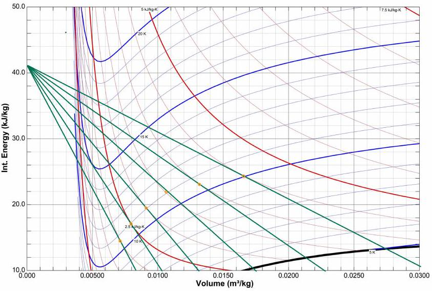
Students don't need to draw every line, as with a straight edge one can find the tangent that maximizes the temperature $T _ { 1 }$ by shifting it around visually.

| Line starts from student's $H$ | 0.2 pts |
| :--- | :--- |
| Line intercepts an isentrope | 0.2 pts |
| The isentrope matches $\max T _ { 1 }$ | 0.2 pts |
| Stated $T _ { 1 }$ within 0.5K of student's construction | 0.1 pts |
| $10 \mathrm {~K} \leq T _ { 1 } \leq 12 \mathrm {~K}$ | 0.1 pts |
| sum | 0.8 pt |

5. Using the slope of the line from the conserved quantity to the maximum temperature point, compute the pressure.
Using the results from above,

$$
P _ { 1 } = - \frac { ( 41 ) - ( 10 ) } { ( 0 ) - ( 0.0170 ) } = 1.8 \mathrm { MPa }
$$

If they didn't know to use slope by this point, they can't generate an answer. As such, they would already have received points for the pressure formula, and we only consider the numerical result

| $P$ agrees with the slope of the graph | 0.1 pts |
| :--- | :--- |
| $1.6 \mathrm { MPa } \leq P _ { 1 } \leq 2.4 \mathrm { MPa }$ | 0.1 pts |
| sum | 0.2 pt |

## T3: Scaling laws (8 pts)

Note: A correct numerical answer provided with at least two significant figures receives full marks. Inappropriate use of equality will lead to a penalty of 0.1 pts for each part of the question.

## Task A: Spaghetti (2 pts)

This is section 2.2.2 (Statics) of the syllabus.
Consider only the left half of the spaghetti straw.
Torque balance at its right endpoint implies that the torque applied to its right endpoint must balance out the torque due to gravity: $\tau \propto m l \propto d ^ { 2 } l ^ { 2 }$. This torque arises from the gradient in the horizontal stress. If the typical horizontal stress is $\sigma$, then the typical force is $F \propto \sigma d ^ { 2 }$, so the torque is $\tau \propto F d \propto \sigma d ^ { 3 }$. Hence, we obtain

$$
\sigma d ^ { 3 } \propto d ^ { 2 } l ^ { 2 } = \Rightarrow l \propto \sqrt { d } ,
$$

so

$$
l ^ { \prime } = \sqrt { \frac { d ^ { \prime } } { d } } l = \sqrt { 10 } \cdot 50 \mathrm {~cm} = 158 \mathrm {~cm} .
$$

Marking scheme:

$$
\begin{array} { l | l }
\tau \propto d ^ { 2 } l ^ { 2 } & 0.4 \mathrm { pts } \\
F \propto \sigma d ^ { 2 } & 0.5 \mathrm { pts } \\
\tau \propto \sigma d ^ { 3 } & 0.5 \mathrm { pts } \\
l \propto \sqrt { d } & 0.4 \mathrm { pts } \\
\text { Answer: } 158 \mathrm {~cm} & 0.2 \mathrm { pts }
\end{array}
$$

## Task B: Sand castle (2 pts)

This is Section 2.2.2 (statics) and 2.2.5 (hydrodynamics) of the syllabus

Due to wetting of the surfaces of the sand grains and its large surface tension water acts like a glue for sand. This means that all the grains need to be bound together by air-water interface. To achieve this there needs to be neither too little nor too much water: if there is too little water, most of the grains are dry with no surface tension binding them, and if there is too much water, almost all the grains are immersed into water, and again, there is no surface tension binding the grains. So, the overall strength of the buildings from wet sand depends on the water content; we assume that for the both types of sand, the water content is optimal, and the shape of the grains is statistically similar. Let us consider two neighbouring grains connected by a water meniscus - or "neck", as we shall be referring to it henceforth. Note that the "neck" may extend perpendicularly to the figure plane far away; so, more specifically, what the word "neck" will refer to is that part of the water-air interface for which the closest two grains are the ones under consideration.
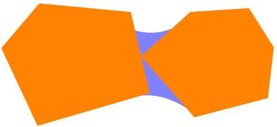

There are two processes binding the sand grains together. The first one is the force due to the surface tension, $F _ { 1 } = \gamma l$, where $\gamma$ denotes the surface tension coefficient, and $l$ - the perimeter of the "neck"; with $l \sim r _ { g }$, where $r _ { g }$ denotes the length scale of a single grain, we obtain $F _ { s } \sim \gamma r$. The second one is the pressure force caused by the negative capillary pressure in the neck, $F _ { p } = \Delta p A$, where $A$ is the cross-sectional area of the "neck", and $\Delta p \sim \gamma / r$. With $A \sim r ^ { 2 }$ we obtain $F _ { 2 } \sim \gamma r$. Thus, the both components are of the same order of magnitude and using either of them will lead to the correct scaling law. These forces press the grains against each other, hence the normal force and friction force between the grains is also on the order of $F _ { s }$ and $F _ { p }$.

Solution 1:
Based on what has been said above, the typical force needed to delocate a grain of sand is $F _ { g } \propto r _ { g }$. The force needed to delocate an entire horizontal layer of sand is then $\propto F _ { g } N _ { l }$, where $N _ { l } \sim A / r _ { g } ^ { 2 }$ is the number of grains in a layer. The force of cylinder destruction $F$ thus satisfies

$$
F \propto F _ { g } N _ { l } \propto r _ { g } / r _ { g } ^ { 2 } = r _ { g } ^ { - 1 } \propto V _ { g } ^ { - 1 / 3 }
$$

so

$$
F _ { f g } = ( 1 / 10 ) ^ { - 1 / 3 } \cdot F _ { c g } = 21.5 \mathrm {~N} .
$$

Marking scheme:

| 0.5 pts |
| :--- |
| -0.1 pts |
| 0.5 pts |
| 0.5 pts |
| 0.3 pts |
| 0.2 pts |

a) $F _ { s } \propto r _ { g }$ and $F _ { p } \propto r _ { g } \quad \mid 0.5$ pts one of the two missing -0.1 pts
b) $F _ { g } \propto r _ { g } \quad 0.5$ pts
c) $F \propto F _ { g } N _ { l } \quad 0.5$ pts
d) $F \propto r _ { g } ^ { - 1 } \quad 0.3$ pts

Answer: 21.5 N
Notes: If the student only qualitatively explains the mechanism by which the grains of sand are held together, a maximum of 0.5 pts are given. Points b)-c) are given only if derived from a).

Solution 2:
We have seen above that grains to one side of a fictitious surface exert force per cross-sectional area on the order of magnitude as the capillary pressure $\Delta p \sim \gamma / r _ { g }$. In order to get the grains moving, a pressure of the same order of magnitude needs to be applied externally. For both cylinders, the surface area where the force is applied is the same, hence the force scales as the capillary pressure, $F \propto 1 / r _ { g } \propto V ^ { - 1 / 3 }$.

Marking scheme:
The applied pressure must be $\sim \Delta p$
The curvature radius of the interface is $\sim r _ { g }$
Capillary pressure $\Delta p \sim \gamma / r _ { g }$
Answer: 21.5 N
Note: If the contribution of surface tension is neglected, 0.1 pts are subtracted.

Solution 3:
The compression force serves to break the surface tension bonds between sand grains.

Consider the energy $E$ required to push a single layer of sand into the layer beneath it. $E \propto F r _ { g }$, where $F$ is the

force required and $r _ { g }$ is the typical height of a layer (i.e., the typical length scale of a grain).

On the other hand, $E = \gamma \Delta A$, where $\gamma$ is the surface tension of water and $\Delta A$ is the total amount by which the surface of the water in the layer stretches before all the "water bonds" between the sand grains are broken.

Here, $\Delta A$ is proportional to the area $A$ of a layer and is thus a constant between the two cylinders. Hence, $E \propto$ $F r _ { g }$ is a constant between the two cylinders, i.e., $F \propto r _ { g } ^ { - 1 }$.

Marking scheme:

$$
\begin{array} { l | l }
E \propto F r _ { g } & 0.5 \mathrm { pts } \\
E \propto \gamma \Delta A & 0.5 \mathrm { pts } \\
\Delta A \propto A & 0.5 \mathrm { pts } \\
F \propto r _ { g } ^ { - 1 } & 0.3 \mathrm { pts } \\
\text { Answer: } 21.5 \mathrm {~N} & 0.2 \mathrm { pts }
\end{array}
$$

Note: If the student only qualitatively explains the mechanism by which the grains of sand are held together, a maximum of 0.5 pts are given.

Solution 4:
First of all, the force $F$ should be proportional to the cylinder's base area $A$. The force required to destroy a cylinder with base area $A = n A _ { 0 }$ is equal to the force required to destroy $n$ cylinders each with base area $A _ { 0 }$. As a result, $F \propto n \propto A$.

In addition, $F$ depends on the grain's length scale $r _ { g }$ and the water's surface tension $\gamma$. Dimensional analysis thus gives

$$
F \propto \frac { A \gamma } { r _ { g } } \propto r _ { g } ^ { - 1 }
$$

for fixed $A$ and $\gamma$.
Marking scheme:

$$
\begin{array} { l | l }
F \propto A & 0.6 \mathrm { pts } \\
F = F \left( A , r _ { g } , \gamma \right) & 0.6 \mathrm { pts } \\
F \propto \frac { A \gamma } { r _ { g } } & 0.6 \mathrm { pts } \\
\text { Answer: } 21.5 \mathrm {~N} & 0.2 \mathrm { pts }
\end{array}
$$

Note: If the student only qualitatively explains the mechanism by which the grains of sand are held together, a maximum of 0.5 pts are given.

## Task C: Interstellar travel (2 pts)

This is Section 2.5 (Relativity) of the syllabus
Let $T = 50 \mathrm { yrs }$ be the astronauts' total travel time. For maximal travel distance, the spaceship accelerates at constant proper acceleration $a = g$ for proper time $T / 4$, during which a distance of $d$ is traveled. The spaceship then decelerates at $a = - g$ for proper time $T / 4$ to come to a rest, during which another distance $d$ is traveled. The spaceship then returns to Earth using the same procedure.

Notes: Formula relating acceleration to proper acceleration is not considered as a basic SR formula and therefore if the formula is written without motivation, 0.2 pts are subtracted.

Solution 0: (incorrect)
If we ignore relativity, then $d \propto \frac { 1 } { 2 } g t ^ { 2 } \propto g$, which gives an answer of 1.5.

Marking scheme:

$$
\begin{array} { l | l }
d \propto g t ^ { 2 } & 0.2 \mathrm { pts } \\
\text { Answer: } 1.5 & 0.1 \mathrm { pts }
\end{array}
$$

Solution 1:
One way to approach the problem is to notice that constant acceleration in spaceship's frame means a constant force in the Earth's frame. This follows directly from the Lorentz transform for the electromagnetic field, more specifically from the fact that when going to a frame moving parallel to the $x$-axis, the $x$-directional electric field $E _ { x }$ remains unchanged. Hence, on the one hand, the force $F _ { x } = e E _ { x }$ exerted on an accelerating particle of rest mass $m _ { 0 }$ and carrying a charge $e$ remains constant in the lab frame. On the other hand, the acceleration of that particle in an inertial frame moving with velocity $v$, where $v$ denotes the particle's velocity at a certain moment of time $t$, is always equal to $e E _ { x } / m _ { 0 }$, regardless of the value of $t$, i.e. constant in time.

Those who are not familiar with the Lorenz transform for electromagnetic field can derive the above described property from the Lorenz transform for momentum and coordinates. We use again (i) the lab frame, and (ii) an inertial frame moving with velocity $v$, where $v$ denotes the spaceship's velocity at a certain moment of time which will be used as the origin, $t = t ^ { \prime } = 0$; let primes denote quantities in the second frame. Assuming a very short time period $t$, we can neglect terms quadratic in time so that in the frame (ii), the momentum, coordinate and the relativistic mass can be expressed as $p ^ { \prime } = F ^ { \prime } t ^ { \prime } , x ^ { \prime } = 0$, $m ^ { \prime } = m _ { 0 }$, respectively; applying the Lorenz transform yields $t = \gamma t ^ { \prime }$ and $p = \gamma \left( F ^ { \prime } t ^ { \prime } + m _ { 0 } v \right) = t F ^ { \prime } + \gamma m _ { 0 } v$. On the other hand, in the frame (i), $p = \gamma m _ { 0 } v + F t$; comparing this with the previous result yields $F = F ^ { \prime }$.

It appears that in either case, the spaceship's speed will reach almost $c$ much faster than the travel time. Hence, using for convenience the system of units where $c = 1$, the travel distance $x$ equals with a very good precision the travel time $t , x = t$.

What is left to do is to relate $t$ to the proper time $\tau$,

$$
\mathrm { d } \tau = \frac { \mathrm { d } t } { \gamma } = \mathrm { d } t \frac { m _ { 0 } } { \sqrt { m _ { 0 } ^ { 2 } + m _ { 0 } ^ { 2 } g ^ { 2 } t ^ { 2 } } } ;
$$

upon integration we obtain

$$
\tau = \operatorname { asinh } ( g t ) / g \Rightarrow x \approx t = \sinh ( g \tau ) / g \approx \exp ( g \tau ) / 2 g .
$$

So we conclude that the ratio of the travel distances is

$$
\frac { d _ { 2 } } { d _ { 1 } } = \frac { g } { 1.5 g } \exp ( 1.5 g \tau - g \tau ) = \frac { 2 } { 3 } \exp ( g T / 8 ) \approx 480 .
$$

Note that an exact relationship between $x$ and $t$ could have been obtained by expressing the energy of the spaceship as $m = m _ { 0 } + m _ { 0 } g x$, and the momentum as $p = m _ { 0 } g t$. Then the Lorenz invariant $\left( m _ { 0 } + m _ { 0 } g x \right) ^ { 2 } -$ $\left( m _ { 0 } g t \right) ^ { 2 } = m _ { 0 } ^ { 2 }$ yields $x ( x + 2 / g ) = t ^ { 2 } = \sinh ^ { 2 } ( g \tau ) / g ^ { 2 }$, hence $x = [ \cosh ( g \tau ) - 1 ] / g$.

$F _ { x }$ is Lorentz invariant $x \approx t$ $\mathrm { d } \tau = \frac { \mathrm { d } t } { \gamma }$ $\gamma ^ { - 1 } = m _ { 0 } / m$ $m = \sqrt { m _ { 0 } ^ { 2 } + p ^ { 2 } }$ $p = m _ { 0 } g t$ $t = \sinh ( g \tau ) / g$ Answer: 480

0.4 pts 0.4 pts 0.2 pts 0.2 pts 0.2 pts 0.2 pts 0.2 pts 0.2 pts

Remark: if integration boundaries for distance or proper time are wrong by a factor of 0.5, 2, 4, etc., -0.1 pts.

Solution 2:
Let $w$ be the rapidity of the spaceship, defined as $w \equiv$ $\tanh ^ { - 1 } ( \beta )$, where $\beta$ is the spaceship's velocity. Then $\beta =$ $\tanh w$, the Lorentz factor $\gamma = \cosh w$, and its momentum $p = m _ { 0 } \sinh w$.

As shown by Solution 1, a spaceship experiencing a constant proper acceleration $g$ experiences a constant three-force

$$
F = m _ { 0 } g = \frac { \mathbf { d } p } { \mathbf { d } t } = m _ { 0 } \cosh w \frac { \mathbf { d } w } { \mathbf { d } t } \Rightarrow \frac { \mathbf { d } w } { \mathbf { d } t } = \frac { g } { \cosh w } .
$$

Meanwhile, time dilation relates $t$ to the spaceship's proper time $\tau$ as

$$
\frac { \mathbf { d } t } { \mathbf { d } \tau } = \gamma = \cosh w \Rightarrow \frac { \mathbf { d } w } { \mathbf { d } \tau } = \frac { \mathbf { d } w } { \mathbf { d } t } \frac { \mathbf { d } t } { \mathbf { d } \tau } = g .
$$

Integrating yields $w = g \tau$. Recalling that $d t = \gamma d \tau$, we get the following as the total distance traveled over a quarter of the spaceship's trip:

$$
\begin{aligned}
d = \int _ { 0 } ^ { T / 4 } \beta \gamma \mathrm {~d} \tau & = \int _ { 0 } ^ { T / 4 } \tanh w \cosh w \mathrm {~d} \tau \\
& = \int _ { 0 } ^ { T / 4 } \sinh g \tau \mathrm {~d} \tau = \frac { 1 } { g } ( \cosh ( g T / 4 ) - 1 )
\end{aligned}
$$

The answer is thus

$$
\begin{aligned}
\frac { g _ { 1 } } { g _ { 2 } } \frac { \cosh \left( g _ { 2 } T / 4 c \right) - 1 } { \cosh \left( g _ { 1 } T / 4 c \right) - 1 } & = \frac { 10 } { 15 } \frac { \cosh ( 19.72 ) - 1 } { \cosh ( 13.15 ) - 1 } \\
& \approx \frac { 2 } { 3 } e ^ { 19.72 - 13.15 } = 480
\end{aligned}
$$

Marking scheme:

$$
\begin{array} { l | l }
\frac { \mathrm { d } } { \mathrm {~d} t } \left( m _ { 0 } \sinh w \right) = m _ { 0 } g & 0.5 \mathrm { pts } \\
\frac { \mathrm {~d} w } { \mathrm {~d} t } = \frac { g } { \cosh w } & 0.1 \mathrm { pts } \\
\frac { \mathrm {~d} t } { \mathrm {~d} \tau } = \cosh w & 0.4 \mathrm { pts } \\
\frac { d w } { d \tau } = g & 0.1 \mathrm { pts } \\
w = g \tau & 0.1 \mathrm { pts } \\
\frac { d } { 2 } = \int _ { 0 } ^ { T / 4 } \beta \gamma \mathrm {~d} \tau & 0.3 \mathrm { pts } \\
\frac { d } { 2 } = \int _ { 0 } ^ { T / 4 } \tanh w \cosh w d \tau & 0.2 \mathrm { pts } \\
\frac { d } { 2 } = \frac { 1 } { g } ( \cosh ( g T / 4 ) - 1 ) & 0.1 \mathrm { pts } \\
\text { Answer: } 480 & 0.2 \mathrm { pts }
\end{array}
$$

Remark: if integration boundaries for distance or proper time are wrong by a factor of 0.5, 2, 4, etc., -0.1 pts.

Solution 3: The problem can be also solved by using the trick introduced in 1905 by Henri Poincaré [Poincaré, M.H. Sur la dynamique de l'électron. Rend. Circ. Matem.

Palermo 21, 129-175 (1906)] of depicting things in $x - \mathrm { i } t$ diagram. The benefit of using this diagram is that the relativistic invariant $x ^ { 2 } - t ^ { 2 }$ transforms into Euclidean squared distance $x ^ { 2 } + \theta ^ { 2 }$ with $\theta = \mathrm { i } t$. This means that in that diagram, we can use the knowledge of Euclidean geometry. In particular, the Lorentz transform is now the rotation of the Euclidean $x - \mathrm { i } t$-space by an angle $\alpha = \arctan \frac { v } { \mathrm { i } c }$. Now, consider the trajectory of the space ship; its infinitesimal arc length is icd $\tau$, where $\mathrm { d } \tau$ is the differential of the proper time, and the infintesimal rotation angle of its tangent is $\mathrm { d } \alpha = \arctan ( \mathrm { d } v / \mathrm { i } c ) = \mathrm { d } v / \mathrm { i } c =$ $g \mathrm {~d} \tau / \mathrm { i } c$. Therefore, the curvature radius $R = \mathrm { i } c \mathrm {~d} \tau / \mathrm { d } \alpha =$ $- c ^ { 2 } / g$ is constant, i.e. the trajectory is a circle of radius $R$. Now we can easily relate the travel distance $x$ to the arc length ict:

$$
x = R ( 1 - \cos \alpha ) = R \left( 1 - \cos \frac { \mathrm { i } c \tau } { R } \right) = \frac { c ^ { 2 } } { g } \left( \cosh \frac { g \tau } { c } - 1 \right) .
$$

Marking scheme:

$$
\begin{array} { l | l }
R = \text { const in x-ict-diag. } & 0.5 \mathrm { pts } \\
R = - g ^ { 2 } / c & 0.5 \mathrm { pts } \\
\quad \text { missing '} - , & - 0.2 \mathrm { pts } \\
\quad \text { partial credit for } R = \frac { \mathrm { ic } \tau } { \mathrm {~d} \alpha } & 0.2 \mathrm { pts } \\
x = R ( 1 - \cos \alpha ) & 0.5 \mathrm { pts } \\
\frac { c ^ { 2 } } { g } \left( \cosh \frac { g \tau } { c } - 1 \right) & 0.3 \mathrm { pts } \\
\text { Answer: } 480 & 0.2 \mathrm { pts }
\end{array}
$$

Solution 4: The problem can be solved by using the velocity addition formula. Let $v = \beta c$ be the speed of the spaceship in the lab frame, $t$ be the lab time, and $\tau$ - the proper time. Also, we consider a frame which moves with constant speed $v$ in which the spaceship accelerates from rest:

$$
\beta + \mathbf { d } \beta = \frac { \beta + \frac { g \mathrm {~d} \tau } { c } } { 1 + \frac { \beta g \mathrm {~d} \tau } { c } } = \beta + \frac { g \mathrm {~d} \tau } { c } \left( 1 - \beta ^ { 2 } \right) .
$$

Thus,

$$
\frac { \mathrm { d } \beta } { 1 - \beta ^ { 2 } } = \frac { g \mathrm {~d} \tau } { c } \Rightarrow \beta = \tanh \left( \frac { g \tau } { c } \right) .
$$

From relativistic time dilation formula we obtain

$$
\mathrm { d } t = \frac { \mathrm { d } \tau } { \sqrt { 1 - \beta ^ { 2 } } } = \cosh \left( \frac { g \tau } { c } \right) \mathrm { d } \tau
$$

so that the travel distance

$$
\frac { d } { 2 } = \int v \mathrm {~d} t = c \int _ { 0 } ^ { T / 4 } \sinh \left( \frac { g \tau } { c } \right) \mathrm { d } \tau = \frac { c ^ { 2 } } { g } \left[ \cosh \left( \frac { g T } { 4 c } \right) - 1 \right]
$$

which leads to the same answer as before.

a) $\beta + \mathrm { d } \beta = \frac { \beta + \frac { g \mathrm {~d} \tau } { c } } { 1 + \frac { \beta g \tau ^ { 2 } } { c } }$
b) $\frac { \mathrm { d } \beta } { 1 - \beta ^ { 2 } } = \frac { g \mathrm {~d} \tau } { c }$
c) $\beta = \tanh \left( \frac { g \tau } { c } \right)$
d) $\mathrm { d } t = \frac { \mathrm { d } \tau } { \sqrt { 1 - \beta ^ { 2 } } }$
e) $\mathrm { d } t = \cosh \left( \frac { g \tau } { c } \right) \mathrm { d } \tau$
f) $\frac { d } { 2 } = \int v \mathrm {~d} t$
g) $\frac { d } { 2 } = c \int _ { 0 } ^ { T / 4 } \sinh \left( \frac { g \tau } { c } \right) \mathrm { d } \tau$
h) $\frac { d } { 2 } = \frac { c ^ { 2 } } { g } \left[ \cosh \left( \frac { g T } { 4 c } \right) - 1 \right]$
i) Answer: 480

0.3 pts
0.2 pts
0.2 pts
0.3 pts
0.2 pts
0.2 pts
0.2 pts
0.2 pts
0.2 pts

Remark: if integration in f) is done over proper time, no points are given for f). If integration boundaries for distance or proper time are wrong by a factor of 0.5, 2, 4, etc., -0.1 pts.

## Task D: That sinking feeling (2 pts)

(This is Sections 2.2.5 (Hydrodynamics) and 2.4.1 (Single oscillator) of the syllabus

Solution 1: The oscillation of the half-sunk sphere is driven by gravity. The non-damped angular frequency depends on the gravitational acceleration and a characteristic length, which is, for a sphere, its radius $r$, so

$$
\omega _ { 0 } \propto \sqrt { g / r }
$$

is the only dimensionally correct possible function.
The drag force $F _ { d }$ depends on the sphere's speed $v$ [m/s], its size $r$ [m], and viscosity of the liquid $\eta$ [Pa•s]. Dimensional analysis thus gives $F _ { d } \propto \eta r v$. The damping factor is thus

$$
\beta = \frac { F _ { d } } { 2 m v } \propto \frac { \eta r } { m } .
$$

Since the mass scales with $r ^ { 3 }$, we have

$$
\beta \propto \frac { 1 } { r ^ { 2 } } .
$$

Then the relation

$$
\frac { \beta ^ { 2 } } { \omega _ { 0 } ^ { 2 } } = 1 - \frac { \omega ^ { 2 } } { \omega _ { 0 } ^ { 2 } }
$$

scales as

$$
\frac { \beta ^ { 2 } } { \omega _ { 0 } ^ { 2 } } \propto \frac { 1 } { r ^ { 3 } }
$$

Oscillations only occur if $\beta / \omega _ { 0 } < 1$, so solve

$$
\frac { r } { r _ { 0 } } = \sqrt [ 3 ] { 1 - ( 0.99 ) ^ { 2 } } = 0.271
$$

Notes:

1. To obtain $\omega _ { 0 } \propto 1 / \sqrt { r }$ without dimensional analysis, note that a small displacement $y$ changes the submerged volume of the ball by $\Delta V \propto r ^ { 2 } y$, so the change in buoyant force $F \propto r ^ { 2 } y$, which gives $\omega _ { 0 } =$ $\sqrt { k / m } \propto \sqrt { r ^ { 2 } / r ^ { 3 } } = \sqrt { 1 / r }$.
2. To obtain $F _ { d } \propto \eta r v$ without dimensional analysis, note that the typical length scale $l$ in the variations in the velocity field of the water is proportional to $r$. Thus, the viscous shear $\sigma \propto \eta v / l \propto \eta v / r$. The total drag force is thus $F _ { d } \sim A \sigma \propto \eta r v$, where $A$ is ball's area of contact with the water.
3. Alternatively, to obtain $F _ { d } \propto \eta r v$, make use of the Stokes drag relation $F _ { d } = 6 \pi \eta K r v$, where $K$ is a dimensionless constant that takes into account that the ball is not in infinite homogeneous fluid.

Marking scheme:

a) $\omega _ { 0 } \propto \sqrt { g / r }$
stated without justification
effective mass $\propto r ^ { 3 }$
just the mass of the ball considered effective returning force $\propto r ^ { 2 }$
$\omega _ { 0 } \propto \sqrt { g / r }$
b) $F _ { d } \propto \eta r v$
no justification
Stokes without constant $K$
c) $\beta \propto 1 / r ^ { 2 }$
d) $\frac { \beta ^ { 2 } } { \omega _ { 2 } ^ { 2 } } = 1 - \frac { \omega ^ { 2 } } { \omega _ { 0 } ^ { 2 } }$
e) $\frac { \beta ^ { 2 } } { \omega _ { 0 } ^ { 2 } } \propto \frac { 1 } { r ^ { 3 } }$
f) Answer: 0.271

0.4 pts

-0.2 pts
0.2 pts
-0.1 pts
0.1 pts
0.1 pts
0.6 pts
-0.3 pts
-0.1 pts
0.3 pts
0.4 pts
0.2 pts
0.1 pts

Solution 2: The oscillation of the half-sunk sphere is driven by the change in buoyancy force, which is proportional to the change in displaced water volume. Thus, the restoring force $F _ { r } \propto r ^ { 2 } x$, where $x$ is the displacement of the sphere.

As discussed in Solution 1, the drag force $F _ { d } \propto r v = r \dot { x }$. The effective mass of the oscillation $m \propto r ^ { 3 }$. This leads to the equation of motion

$$
k _ { 1 } r ^ { 2 } \ddot { x } + k _ { 2 } \dot { x } + k _ { 3 } r x = 0 ,
$$

where $k _ { 1 } , k _ { 2 }$ and $k _ { 3 }$ are constant. In the case with no viscous drag, $k _ { 2 } = 0$, the motion is at frequency

$$
\omega _ { 0 } = \sqrt { \frac { k _ { 3 } } { k _ { 1 } r } } .
$$

With viscous drag, we can get the frequency $\omega$ by substituting trial solution $x = e ^ { \alpha t }$ and using $\omega = \operatorname { Im } \alpha$. This leads to

$$
\begin{gathered}
\omega = \sqrt { \omega _ { 0 } ^ { 2 } - \frac { k _ { 2 } ^ { 2 } } { 4 k _ { 1 } ^ { 2 } r ^ { 4 } } } , \\
\omega ^ { 2 } = \omega _ { 0 } ^ { 2 } \left( 1 - \frac { k _ { 2 } ^ { 2 } } { 4 k _ { 1 } ^ { 2 } r ^ { 4 } \omega _ { 0 } ^ { 2 } } \right) = \omega _ { 0 } ^ { 2 } \left( 1 - \frac { k _ { 2 } ^ { 2 } } { 4 k _ { 1 } k _ { 3 } r ^ { 3 } } \right) . \\
\text { At } r = r _ { \text {min } } , \omega = 0 \text {, so } \\
\frac { k _ { 2 } ^ { 2 } } { 4 k _ { 1 } k _ { 3 } } = r _ { \text {min } } ^ { 3 } ,
\end{gathered}
$$

and

$$
\omega ^ { 2 } = \omega _ { 0 } ^ { 2 } \left( 1 - \frac { r _ { \min } ^ { 3 } } { r _ { 0 } ^ { 3 } } \right) ,
$$

giving $\frac { r _ { \text {min } } } { r _ { 0 } } = 0.271$.
Marking scheme:

a) effective mass $\propto r ^ { 3 }$
just the mass of the ball considered
b) effective returning force $\propto r ^ { 2 }$
c) $\omega _ { 0 } \propto \sqrt { 1 / r }$
d) $F _ { d } \propto r v$
no justification
Stokes without constant $K$
e) $k _ { 1 } r ^ { 2 } \ddot { x } + k _ { 2 } \dot { x } + k _ { 3 } r x = 0$
f) $\omega$ in terms of $r$ and $\omega _ { 0 }$
if not expressed in terms of $\omega _ { 0 }$
g) Answer: 0.271

0.2 pts

-0.1 pts
0.1 pts
0.1 pts
0.6 pts
-0.3 pts
-0.1 pts
0.3 pts
0.6 pts
-0.3 pts
0.1 pts
