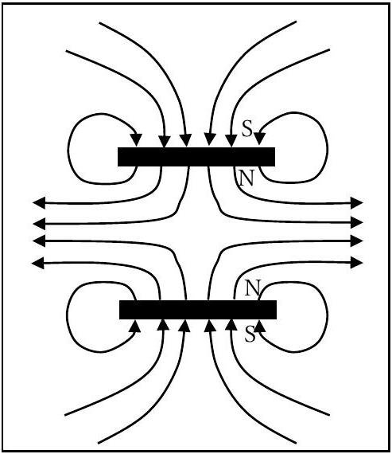
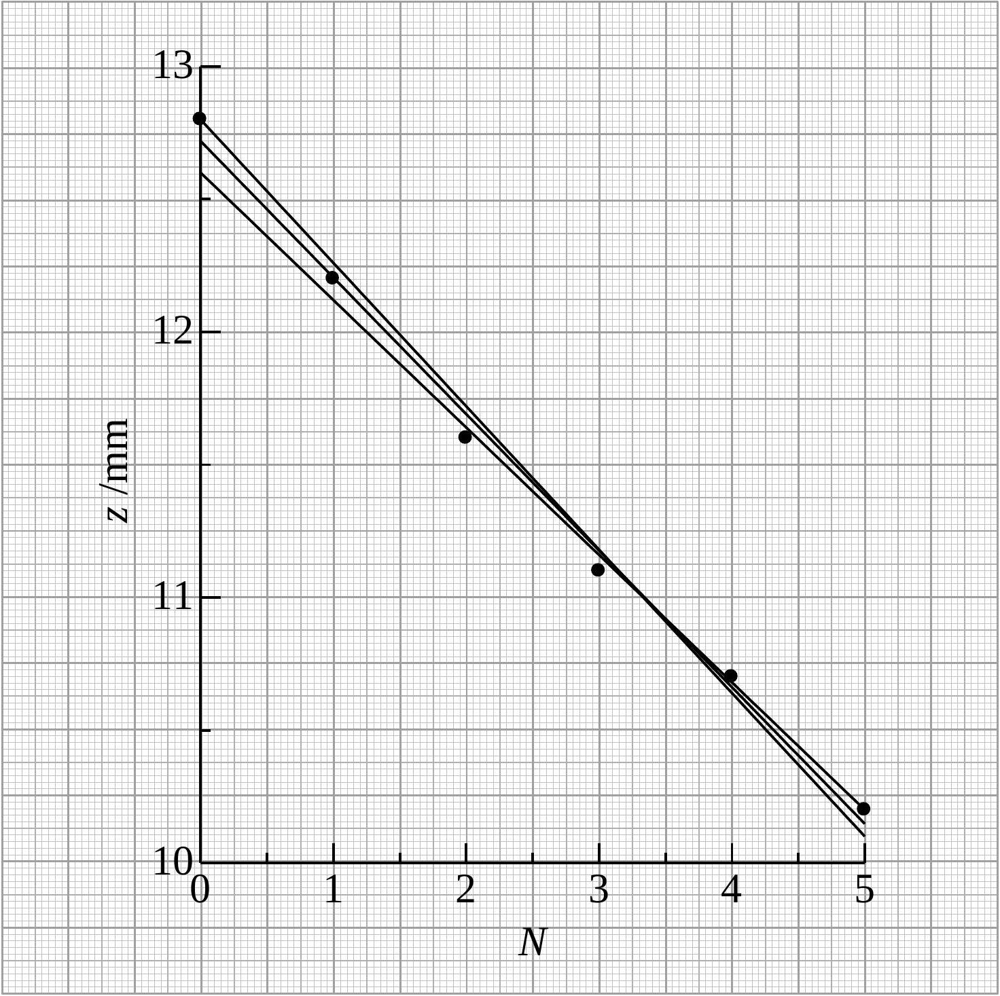
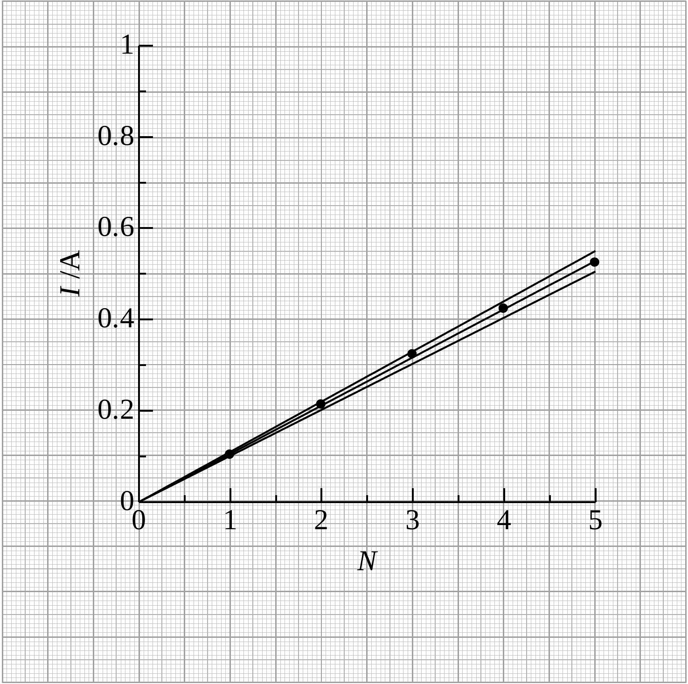
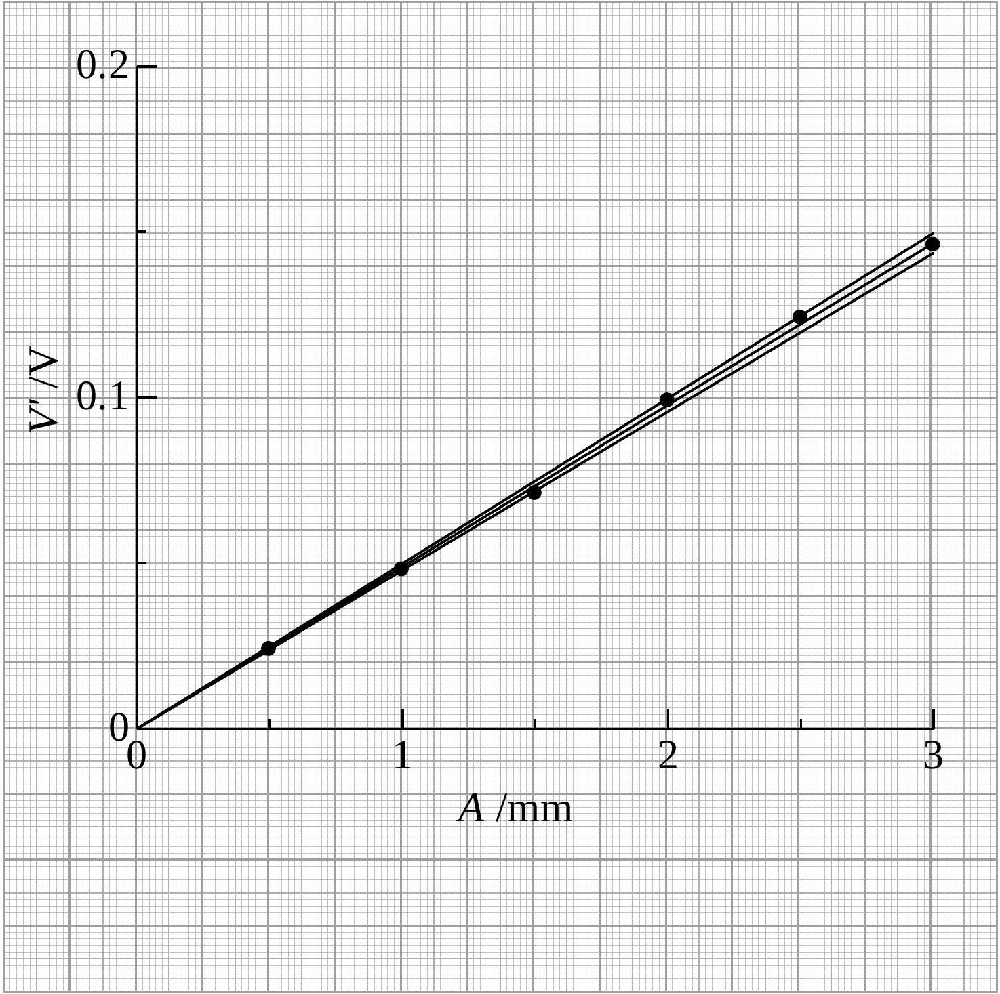
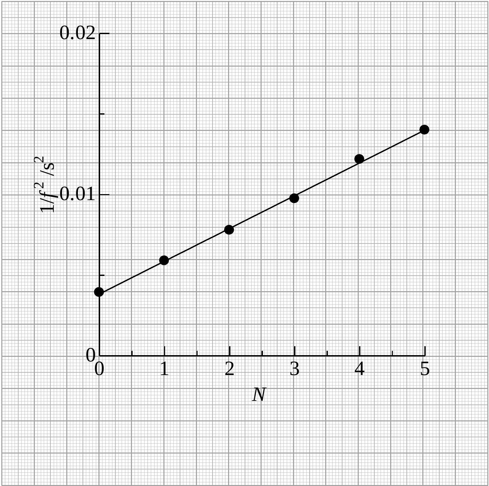
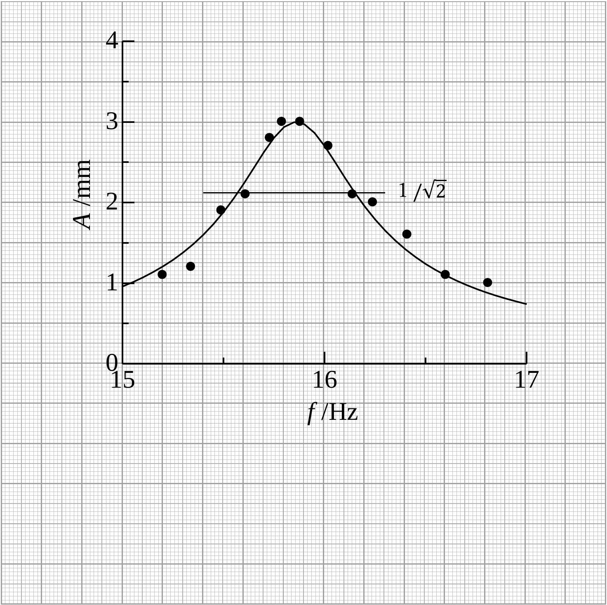
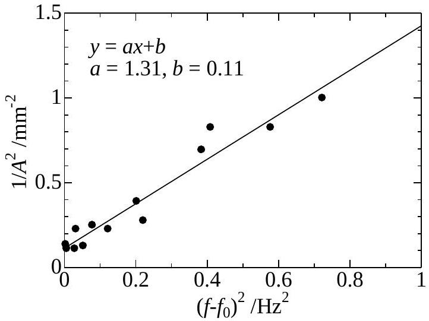

## Mass Measurement (10 points)

Write down the numbers 0 to 9 in the following table:

| 0 | 1 | 2 | 3 | 4 | 5 | 6 | 7 | 8 | 9 |
| :--- | :--- | :--- | :--- | :--- | :--- | :--- | :--- | :--- | :--- |
| 0 | 1 | 2 | 3 | 4 | 5 | 6 | 7 | 8 | 9 |

Part A: Hooke's law and electromagnetic forces (2.4 points)
A. 1 (0.4 pt)

A. 2 (0.6 pt)

| $N$ | $z / \mathrm { mm }$ | $I / \mathrm { A }$ |
| :--- | :--- | :--- |
| 0 | 12.8 | 0 |
| 1 | 12.2 | 0.103 |
| 2 | 11.6 | 0.213 |
| 3 | 11.1 | 0.323 |
| 4 | 10.7 | 0.423 |
| 5 | 10.2 | 0.524 |

"

The slope and uncertainty are read from the lines plotted on the graph.

$$
\begin{aligned}
& a = \frac { \Delta z } { \Delta N } = \frac { 10.15 - 12.70 } { 5 } = - 0.51 \\
& a _ { + } = \frac { 10.20 - 12.60 } { 5 } = - 0.48 \\
& a _ { - } = \frac { 10.10 - 12.80 } { 5 } = - 0.54 \\
& \Delta a = \frac { - 0.48 - ( - 0.54 ) } { 2 } = 0.03 \\
& a = - 0.51 \pm 0.03 \mathrm {~mm}
\end{aligned}
$$

"

The slope and uncertainty are read from the lines plotted on the graph.

$$
\begin{aligned}
& b = \frac { I } { N } = \frac { 0.53 } { 5 } = 0.106 \\
& b _ { + } = \frac { 0.55 } { 5 } = 0.110 \\
& b _ { - } = \frac { 0.505 } { 5 } = 0.101 \\
& \Delta b = \frac { 0.110 - 0.101 } { 2 } = 0.005 \\
& b = 0.106 \pm 0.005 \mathrm {~A}
\end{aligned}
$$

Part B: Induced electromotive force (3.0 points)
B. 1 (0.2 pt)

$$
V = 2 \pi f A B L
$$

B. 2 (0.5 pt)

$$
f _ { \mathrm { B } } = 15.85 \mathrm {~Hz}
$$

| $A / \mathrm { mm }$ | $V ^ { \prime } / \mathrm { V }$ |
| :--- | :--- |
| 0.5 | 0.024 |
| 1.0 | 0.048 |
| 1.5 | 0.071 |
| 2.0 | 0.099 |
| 2.5 | 0.124 |
| 3.0 | 0.146 |
|  |  |
|  |  |
|  |  |
|  |  |

"

нового и

$$
\frac { c o } { c \tau }
$$

"

$$
y = - 2
$$

"
"
"
"

$$
=
$$

$$
\begin{aligned}
& \text { company } \\
& \text { - } \\
& \text { مناطق } \\
& \text { تزبطوي } \\
& \text { }
\end{aligned}
$$

منح
"
"

| - | - |  |  |
| :--- | :--- | :--- | :--- |
| " | Gumo |  |  |
| " | απόνω |  |  |
| " | வல்ல |  |  |

C. 3 (1.0 pt)

The additional quantities $1 / f ^ { 2 }$ are calculated in Table C.2. Then, $\frac { M } { k ^ { \prime } }$ and $\frac { m } { k ^ { \prime } }$ are obtained from the graph using the equation $\frac { 1 } { f ^ { 2 } } = ( 2 \pi ) ^ { 2 } \left( \frac { M } { k ^ { \prime } } + \frac { m } { k ^ { \prime } } N \right)$.

$$
\begin{aligned}
& \frac { M } { k ^ { \prime } } = \frac { 0.0039 } { ( 2 \pi ) ^ { 2 } } = 9.88 \times 10 ^ { - 5 } \mathrm {~s} ^ { 2 } \\
& \frac { m } { k ^ { \prime } } = \frac { ( 0.0140 - 0.0039 ) / 5 } { ( 2 \pi ) ^ { 2 } } = 5.12 \times 10 ^ { - 5 } \mathrm {~s} ^ { 2 }
\end{aligned}
$$

C. 4 (0.6 pt)
$\frac { M } { m } = \frac { M / k ^ { \prime } } { m / k ^ { \prime } } = \frac { 9.88 } { 5.12 } = 1.93$
$\frac { M } { m } = 1.93$
$M = \frac { M } { m } \cdot m = 1.93 \times 0.0075 = 0.0145 \mathrm {~kg}$
$M = 14.5 \mathrm {~g}$
$k ^ { \prime } = \frac { M } { M / k ^ { \prime } } = \frac { 0.0145 } { 9.88 \times 10 ^ { - 5 } } = 147 \mathrm {~N} / \mathrm { m }$
$k ^ { \prime } = 147 \mathrm {~N} / \mathrm { m }$

## Experiment

## Part D: Resonance characteristics (2.3 points)

D. 1 (0.4 pt)

$$
\begin{aligned}
& V _ { \mathrm { AC } } ^ { \prime } = 0.157 \mathrm {~V} \\
& F _ { \mathrm { AC } } = B L I _ { \mathrm { AC } } = B L \times 0.106 \times \sqrt { 2 } V _ { \mathrm { AC } } ^ { \prime } = 0.696 \times 0.106 \times \sqrt { 2 } \times 0.157 = 0.0164 \mathrm {~N} \\
& F _ { \mathrm { AC } } = 0.0164 \mathrm {~N}
\end{aligned}
$$

D. 2 (0.9 pt)

| $f / \mathrm { Hz }$ | $A / \mathrm { mm }$ | $\left( f - f _ { 0 } \right) ^ { 2 } / \mathrm { Hz } ^ { 2 }$ | $1 / A ^ { 2 } / \mathrm { mm } ^ { - 2 }$ |
| :--- | :--- | :--- | :--- |
| 15.88 | 3.0 | 0.0064 | 0.111 |
| 15.79 | 3.0 | 0.0289 | 0.111 |
| 15.73 | 2.8 | 0.0529 | 0.128 |
| 15.61 | 2.1 | 0.1225 | 0.227 |
| 15.49 | 1.9 | 0.2209 | 0.277 |
| 15.34 | 1.2 | 0.3844 | 0.694 |
| 15.20 | 1.1 | 0.5776 | 0.826 |
| 16.02 | 2.7 | 0.0036 | 0.137 |
| 16.14 | 2.1 | 0.0324 | 0.227 |
| 16.24 | 2.0 | 0.0784 | 0.250 |
| 16.41 | 1.6 | 0.2025 | 0.391 |
| 16.60 | 1.1 | 0.4096 | 0.826 |
| 16.81 | 1.0 | 0.7225 | 1.000 |
|  |  |  |  |
|  |  |  |  |

D. 3 (1.0 pt)

Reading from the graph D. 2

$$
\begin{aligned}
& f _ { 0 } = 15.83 \mathrm {~Hz} \\
& A \left( f _ { 0 } \right) = 3.0 \mathrm {~mm} \\
& \Delta f = \frac { 15.14 - 15.56 } { 2 } = 0.29 \mathrm {~Hz}
\end{aligned}
$$

Calculaton using Eq.(4)

$$
\begin{aligned}
& M = \frac { F _ { \mathrm { AC } } } { 8 \pi ^ { 2 } f _ { 0 } \Delta f A \left( f _ { 0 } \right) } = \frac { 0.0164 } { 8 \pi ^ { 2 } \times 15.83 \times 0.29 \times 0.003 } = 0.0151 \mathrm {~kg} \\
& M = 15.1 \mathrm {~g}
\end{aligned}
$$

An alternative way to find $M$
$\left( f - f _ { 0 } \right) ^ { 2 }$ and $1 / A ^ { 2 }$ are calculated in Table D. 2 to use the linear relationship

$$
\frac { 1 } { A ^ { 2 } } = \left( \frac { 8 \pi ^ { 2 } M f _ { 0 } } { F _ { \mathrm { AC } } } \right) ^ { 2 } \cdot \left[ \left( f - f _ { 0 } \right) ^ { 2 } + ( \Delta f ) ^ { 2 } \right] .
$$

$f _ { 0 } = 15.96 \mathrm {~Hz}$ obtained in C. 2 is used.
The slope is obtained from the graph of the additional quantities or the calculation

$$
\begin{aligned}
& \left( \frac { 8 \pi ^ { 2 } M f _ { 0 } } { F _ { \mathrm { AC } } } \right) ^ { 2 } = 1.31 \mathrm {~mm} ^ { - 2 } \mathrm {~Hz} ^ { - 2 } = 1.31 \times 10 ^ { 6 } \mathrm {~m} ^ { - 2 } \mathrm {~Hz} ^ { - 2 } . \\
& M = \sqrt { 1.31 \times 10 ^ { 6 } } \times \frac { F _ { \mathrm { AC } } } { 8 \pi ^ { 2 } f _ { 0 } } = \sqrt { 1.31 \times 10 ^ { 6 } } \times \frac { 0.0164 } { 8 \pi ^ { 2 } \times 15.96 } = 0.0149 \mathrm {~kg} \\
& M = 14.9 \mathrm {~g}
\end{aligned}
$$

