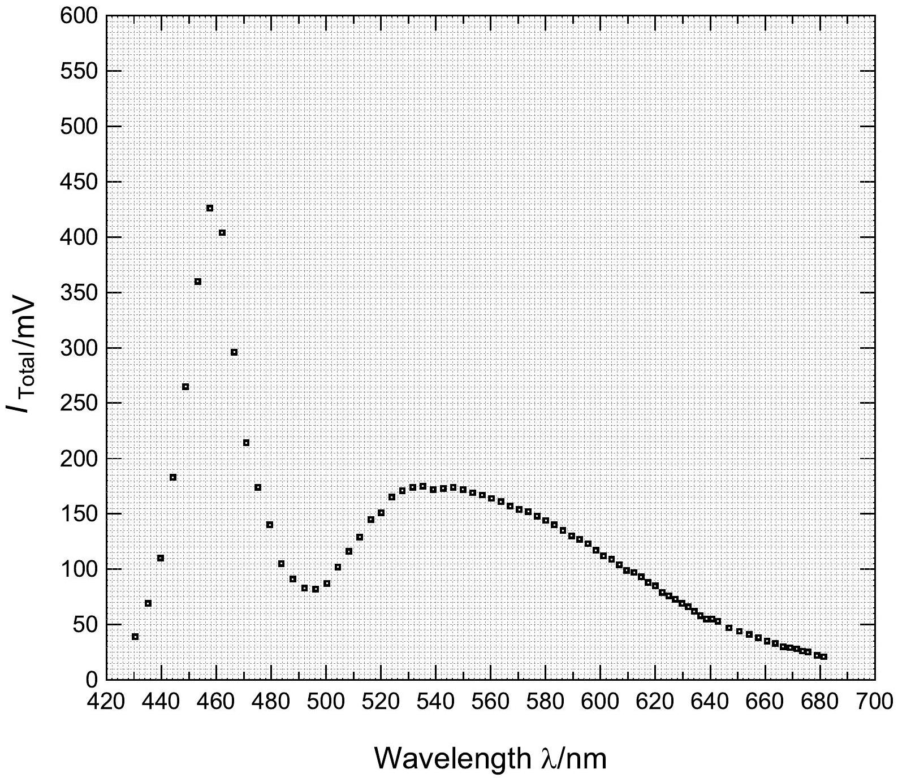
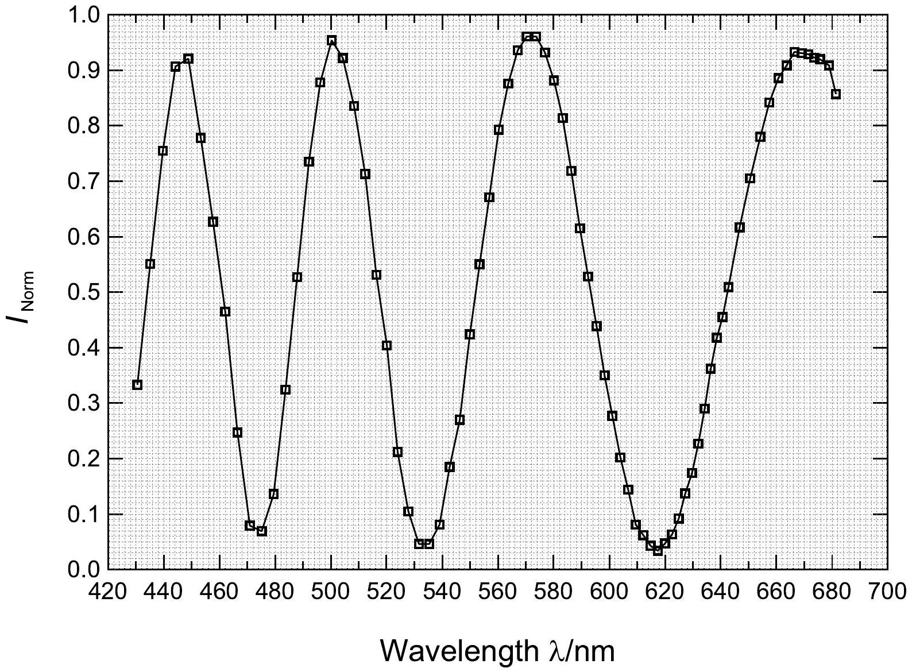

## Thickness Measurements Using Birefringence (10 points)

Values in black (blue) are typical (acceptable).
Part A. Measurement System Setup (2.3 points)
A. 1 (0.3 pt)
$\lambda = 684 \mathrm {~nm}$
$\theta = 20.0 ^ { \circ }$
A. 2 (0.2 pt)
$\theta = - 30.0 ^ { \circ } , 70.0 ^ { \circ }$
A. 3 (0.8 pt)
$\theta = - 28.0 ^ { \circ } \quad \left( - 28.9 ^ { \circ } \leq \theta \leq - 27.7 ^ { \circ } \quad \right.$ or $\left. \quad 67.7 ^ { \circ } \leq \theta \leq 68.9 ^ { \circ } \right)$
$\lambda _ { \text {Peak } } = 458 \mathrm {~nm}$
(450 nm $\leq \lambda _ { \text {Peak } } \leq 460$ nm; $\lambda _ { \text {Peak } }$ and $\theta$ must be consistent with Eq. (7) or (8).)
$\alpha = 40.0 ^ { \circ }$
A. 4 (0.3 pt)
$\varphi _ { \perp } = 90 ^ { \circ } \quad \left( 85 ^ { \circ } \leq \varphi _ { \perp } \leq 95 ^ { \circ } \quad \right.$ or $\left. \quad 265 ^ { \circ } \leq \varphi _ { \perp } \leq 275 ^ { \circ } \right)$
$\varphi _ { \| } = 0 ^ { \circ } \quad \left( \varphi _ { \| } = \varphi _ { \perp } + 90 ^ { \circ } \right.$ or $\left. \varphi _ { \perp } - 90 ^ { \circ } \right)$

A. 5 (0.2 pt)
$I _ { \text {Offset } \perp } = 0.005 \mathrm {~V} \quad \left( I _ { \text {Offset } \perp } \leq 0.010 \mathrm {~V} \right)$
$I _ { \text {Offset } \| } = 0.010 \mathrm {~V} \quad \left( I _ { \text {Offset } \| } \leq 0.020 \mathrm {~V} \right)$
A. 6 (0.5 pt)
$I _ { \perp } = 0.001 \mathrm {~V} \quad \left( I _ { \perp } \leq 0.003 \mathrm {~V} \right)$
$I _ { \| } = 0.160 \mathrm {~V} \quad \left( I _ { \| } \geq 0.100 \mathrm {~V} \right)$

Part B. Measurement of transmitted light intensities (4.7 points)
B. 1 (2.0 pt)

| $\theta _ { \text {Stage } } /$ degree | $\theta$ /degree | $\lambda / \mathrm { nm }$ | $I _ { \perp } / \mathrm { mV }$ | $I _ { \\| } / \mathrm { mV }$ | $I _ { \text {Total } } / \mathrm { mV }$ | $I _ { \text {Norm } }$ |
| :--- | :--- | :--- | :--- | :--- | :--- | :--- |
| 30.5 | -31 | 430.5 | 13 | 26 | 39 | 0.333 |
| 30 | -30.5 | 435.1 | 38 | 31 | 69 | 0.551 |
| 29.5 | -30 | 439.7 | 83 | 27 | 110 | 0.755 |
| 29 | -29.5 | 444.2 | 166 | 17 | 183 | 0.907 |
| 28.5 | -29 | 448.8 | 244 | 21 | 265 | 0.921 |
| 28 | -28.5 | 453.3 | 280 | 80 | 360 | 0.778 |
| 27.5 | -28 | 457.7 | 267 | 159 | 426 | 0.627 |
| 27 | -27.5 | 462.1 | 188 | 216 | 404 | 0.465 |
| 26.5 | -27 | 466.5 | 73 | 223 | 296 | 0.247 |
| 26 | -26.5 | 470.9 | 17 | 197 | 214 | 0.079 |
| 25.5 | -26 | 475.2 | 12 | 162 | 174 | 0.069 |
| 25 | -25.5 | 479.5 | 19 | 121 | 140 | 0.136 |
| 24.5 | -25 | 483.7 | 34 | 71 | 105 | 0.324 |
| 24 | -24.5 | 487.9 | 48 | 43 | 91 | 0.527 |
| 23.5 | -24 | 492.1 | 61 | 22 | 83 | 0.735 |
| 23 | -23.5 | 496.2 | 72 | 10 | 82 | 0.878 |
| 22.5 | -23 | 500.3 | 83 | 4 | 87 | 0.954 |
| 22 | -22.5 | 504.3 | 94 | 8 | 102 | 0.922 |
| 21.5 | -22 | 508.3 | 97 | 19 | 116 | 0.836 |

B. 1 (2.0 pt)
(Continued)

| $\theta _ { \text {Stage } } /$ degree | $\theta /$ degree | $\lambda / \mathrm { nm }$ | $I _ { \perp } / \mathrm { mV }$ | $I _ { \\| } / \mathrm { mV }$ | $I _ { \text {Total } } / \mathrm { mV }$ | $I _ { \text {Norm } }$ |
| :--- | :--- | :--- | :--- | :--- | :--- | :--- |
| 21 | -21.5 | 512.3 | 92 | 37 | 129 | 0.713 |
| 20.5 | -21 | 516.3 | 77 | 68 | 145 | 0.531 |
| 20 | -20.5 | 520.1 | 61 | 90 | 151 | 0.404 |
| 19.5 | -20 | 524.0 | 35 | 130 | 165 | 0.212 |
| 19 | -19.5 | 527.8 | 18 | 153 | 171 | 0.105 |
| 18.5 | -19 | 531.6 | 8 | 166 | 174 | 0.046 |
| 18 | -18.5 | 535.3 | 8 | 167 | 175 | 0.046 |
| 17.5 | -18 | 539.0 | 14 | 158 | 172 | 0.081 |
| 17 | -17.5 | 542.7 | 32 | 141 | 173 | 0.185 |
| 16.5 | -17 | 546.3 | 47 | 127 | 174 | 0.270 |
| 16 | -16.5 | 549.9 | 73 | 99 | 172 | 0.424 |
| 15.5 | -16 | 553.4 | 93 | 76 | 169 | 0.550 |
| 15 | -15.5 | 556.9 | 112 | 55 | 167 | 0.671 |
| 14.5 | -15 | 560.3 | 130 | 34 | 164 | 0.793 |
| 14 | -14.5 | 563.7 | 141 | 20 | 161 | 0.876 |
| 13.5 | -14 | 567.1 | 147 | 10 | 157 | 0.936 |
| 13 | -13.5 | 570.4 | 148 | 6 | 154 | 0.961 |
| 12.5 | -13 | 573.7 | 146 | 6 | 152 | 0.961 |
| 12 | -12.5 | 576.9 | 138 | 10 | 148 | 0.932 |

B. 1 (2.0 pt)
(Continued)

| $\theta _ { \text {Stage } } /$ degree | $\theta /$ degree | $\lambda / \mathrm { nm }$ | $I _ { \perp } / \mathrm { mV }$ | $I _ { \\| } / \mathrm { mV }$ | $I _ { \text {Total } } / \mathrm { mV }$ | $I _ { \text {Norm } }$ |
| :--- | :--- | :--- | :--- | :--- | :--- | :--- |
| 11.5 | -12 | 580.1 | 127 | 17 | 144 | 0.882 |
| 11 | -11.5 | 583.2 | 114 | 26 | 140 | 0.814 |
| 10.5 | -11 | 586.3 | 97 | 38 | 135 | 0.719 |
| 10 | -10.5 | 589.4 | 80 | 50 | 130 | 0.615 |
| 9.5 | -10 | 592.4 | 67 | 60 | 127 | 0.528 |
| 9 | -9.5 | 595.4 | 54 | 69 | 123 | 0.439 |
| 8.5 | -9 | 598.3 | 41 | 76 | 117 | 0.350 |
| 8 | -8.5 | 601.1 | 31 | 81 | 112 | 0.277 |
| 7.5 | -8 | 604.0 | 22 | 87 | 109 | 0.202 |
| 7 | -7.5 | 606.8 | 15 | 89 | 104 | 0.144 |
| 6.5 | -7 | 609.5 | 8 | 91 | 99 | 0.081 |
| 6 | -6.5 | 612.2 | 6 | 91 | 97 | 0.062 |
| 5.5 | -6 | 614.8 | 4 | 89 | 93 | 0.043 |
| 5 | -5.5 | 617.4 | 3 | 85 | 88 | 0.034 |
| 4.5 | -5 | 620.0 | 4 | 81 | 85 | 0.047 |
| 4 | -4.5 | 622.5 | 5 | 74 | 79 | 0.063 |
| 3.5 | -4 | 624.9 | 7 | 69 | 76 | 0.092 |
| 3 | -3.5 | 627.3 | 10 | 63 | 73 | 0.137 |
| 2.5 | -3 | 629.7 | 12 | 57 | 69 | 0.174 |

B. 1 (2.0 pt)
(Continued)

| $\theta _ { \text {Stage } } /$ degree | $\theta /$ degree | $\lambda / \mathrm { nm }$ | $I _ { \perp } / \mathrm { mV }$ | $I _ { \\| } / \mathrm { mV }$ | $I _ { \text {Total } } / \mathrm { mV }$ | $I _ { \text {Norm } }$ |
| :--- | :--- | :--- | :--- | :--- | :--- | :--- |
| 2 | -2.5 | 632.0 | 15 | 51 | 66 | 0.227 |
| 1.5 | -2 | 634.2 | 18 | 44 | 62 | 0.290 |
| 1 | -1.5 | 636.4 | 21 | 37 | 58 | 0.362 |
| 0.5 | -1 | 638.6 | 23 | 32 | 55 | 0.418 |
| 0 | -0.5 | 640.7 | 25 | 30 | 55 | 0.455 |
| -0.5 | 0 | 642.8 | 27 | 26 | 53 | 0.509 |
| -1.5 | 1 | 646.8 | 29 | 18 | 47 | 0.617 |
| -2.5 | 2 | 650.6 | 31 | 13 | 44 | 0.705 |
| -3.5 | 3 | 654.2 | 32 | 9 | 41 | 0.780 |
| -4.5 | 4 | 657.5 | 32 | 6 | 38 | 0.842 |
| -5.5 | 5 | 660.7 | 31 | 4 | 35 | 0.886 |
| -6.5 | 6 | 663.7 | 30 | 3 | 33 | 0.909 |
| -7.5 | 7 | 666.5 | 28 | 2 | 30 | 0.933 |
| -8.5 | 8 | 669.1 | 27 | 2 | 29 | 0.931 |
| -9.5 | 9 | 671.5 | 26 | 2 | 28 | 0.929 |
| -10.5 | 10 | 673.6 | 24 | 2 | 26 | 0.923 |
| -11.5 | 11 | 675.6 | 23 | 2 | 25 | 0.920 |
| -13.5 | 13 | 678.9 | 20 | 2 | 22 | 0.909 |
| -15.5 | 15 | 681.4 | 18 | 3 | 21 | 0.857 |

B. 2 (1.0 pt)

B. 3 (0.2 pt)

$$
\Delta \lambda _ { \mathrm { FWHM } } = 25 \mathrm {~nm} \quad \left( \Delta \lambda _ { \mathrm { FWHM } } \leq 40 \mathrm {~nm} \right)
$$

B. 4 (1.5 pt)

## Part C. Analyses of Measured Results (3.0 points)

C. 1 (1.5 pt)
$\lambda = 473 \mathrm {~nm} , 534 \mathrm {~nm} , 617 \mathrm {~nm}$
(455 nm $< \lambda < 479 \mathrm {~nm} , \quad 513 \mathrm {~nm} < \lambda < 539 \mathrm {~nm} , \quad 590 \mathrm {~nm} < \lambda < 620 \mathrm {~nm}$ )
$m = 8 , \quad 7 , \quad 6$
C. 2 (1.5 pt)
$L = 407 \mu \mathrm {~m} \quad ( 390 \mu \mathrm {~m} < L < 410 \mu \mathrm {~m} )$
