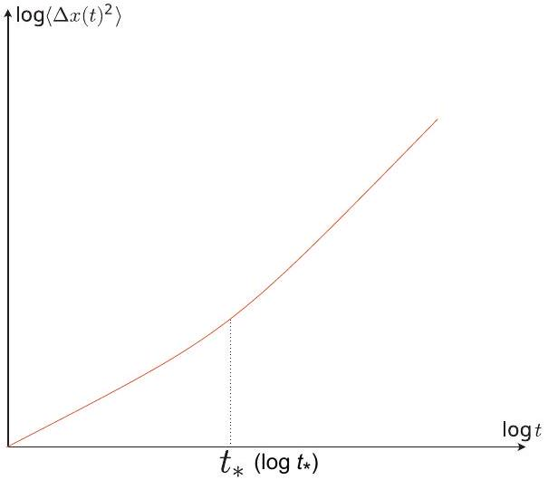

## Theory Problem 1: Characterization of Soil Colloids (10 points)

Part A. Analysis of motions of colloidal particles (1.6 points)

A. 1 The relation between the impulse and the momentum change is given by $M v _ { 0 } = I _ { 0 }$. Therefore,
$$
\begin{equation*}
v _ { 0 } = \frac { I _ { 0 } } { M } . \tag{S1.1}
\end{equation*}
$$
For the situation considered here, the equation of motion reads
$$
\begin{equation*}
M \dot { v } = - \gamma v ( t ) . \tag{S1.2}
\end{equation*}
$$
Substituting the form of the solution given in the question sheet, $v ( t ) = v _ { 0 } e ^ { - \left( t - t _ { 0 } \right) / \tau }$, we obtain
$$
\begin{equation*}
\tau = \frac { M } { \gamma } . \tag{S1.3}
\end{equation*}
$$
A. 1
$$
\begin{aligned}
v _ { 0 } & = \frac { I _ { 0 } } { M } \\
\tau & = \frac { M } { \gamma }
\end{aligned}
$$

A. 2 Thanks to the linearity of Eq. (S1.2), we can use the superposition principle, which tells us that $v ( t )$ is given by the sum of solutions for single collision events that occur before time $t$. This immediately gives the solution as

$$
\begin{equation*}
v ( t ) = \sum _ { i } \frac { I _ { i } } { M } e ^ { - \left( t - t _ { i } \right) / \tau } , \tag{S1.4}
\end{equation*}
$$

where the sum is taken in the range of $i$ that satisfies $0 < t _ { i } < t$.
It is also not difficult to figure out this superposition principle, by considering the effect of a single collision as well as the velocity change between two consecutive collisions. From A.1, it is straightforward to show that the velocity right after the $i$ th collision is given by

$$
\begin{equation*}
v \left( t _ { i } \right) = v _ { 0 } \left( t _ { i } \right) + \frac { I _ { i } } { M } , \tag{S1.5}
\end{equation*}
$$

where $v _ { 0 } \left( t _ { i } \right)$ is the velocity right before the collision. Also, since there is no collision during $t _ { i } < t < t _ { i + 1 }$, we have

$$
\begin{equation*}
v ( t ) = \left( v _ { 0 } \left( t _ { i } \right) + \frac { I _ { i } } { M } \right) e ^ { - \left( t - t _ { i } \right) / \tau } . \tag{S1.6}
\end{equation*}
$$

In particular,

$$
\begin{equation*}
v _ { 0 } \left( t _ { i + 1 } \right) = \left( v _ { 0 } \left( t _ { i } \right) + \frac { I _ { i } } { M } \right) e ^ { - \left( t _ { i + 1 } - t _ { i } \right) / \tau } . \tag{S1.7}
\end{equation*}
$$

Therefore, with $v _ { 0 } \left( t _ { 1 } \right) = 0$, we obtain

$$
\begin{equation*}
v _ { 0 } \left( t _ { i } \right) = \sum _ { j = 1 } ^ { i - 1 } \frac { I _ { j } } { M } e ^ { - \left( t _ { i } - t _ { j } \right) / \tau } \tag{S1.8}
\end{equation*}
$$

and, for $t _ { i } < t < t _ { i + 1 }$,

$$
\begin{equation*}
v ( t ) = \sum _ { j = 1 } ^ { i } \frac { I _ { j } } { M } e ^ { - \left( t - t _ { j } \right) / \tau } . \tag{S1.9}
\end{equation*}
$$

This is equivalent to Eq. (S1.4).
A. 2
0.8 pt

$$
v ( t ) = \sum _ { i } \frac { I _ { i } } { M } e ^ { - \left( t - t _ { i } \right) / \tau }
$$

the inequality specifying the range of $t _ { i }$ that needs to be considered:

$$
0 < t _ { i } < t
$$

Part B. Effective equation of motion (1.8 points)
B. 1 From the definition of the model, we have

$$
\begin{equation*}
\Delta x ( t ) = \sum _ { n = 1 } ^ { N } v _ { n } \delta . \tag{S1.10}
\end{equation*}
$$

Taking the average and using $\left\langle v _ { n } \right\rangle = 0$, we obtain

$$
\begin{equation*}
\langle \Delta x ( t ) \rangle = 0 . \tag{S1.11}
\end{equation*}
$$

For the mean square displacement, computing the square of Eq. (S1.10) and taking the average, we obtain

$$
\begin{equation*}
\left\langle \Delta x ( t ) ^ { 2 } \right\rangle = \sum _ { m = 1 } ^ { N } \sum _ { n = 1 } ^ { N } \left\langle v _ { m } v _ { n } \right\rangle \delta ^ { 2 } . \tag{S1.12}
\end{equation*}
$$

Using $\left\langle v _ { m } v _ { n } \right\rangle = C$ for $n = m$ and 0 otherwise, we find

$$
\begin{equation*}
\left\langle \Delta x ( t ) ^ { 2 } \right\rangle = \sum _ { n = 1 } ^ { N } C \delta ^ { 2 } = N C \delta ^ { 2 } \tag{S1.13}
\end{equation*}
$$

Since $N \delta = t$, we obtain

$$
\begin{equation*}
\left\langle \Delta x ( t ) ^ { 2 } \right\rangle = C \delta t . \tag{S1.14}
\end{equation*}
$$

B. 1
1.0 pt

$$
\begin{aligned}
& \langle \Delta x ( t ) \rangle = 0 \\
& \left\langle \Delta x ( t ) ^ { 2 } \right\rangle = C \delta t
\end{aligned}
$$

B. 2 As described in the question sheet, the mean square displacement $\left\langle \Delta x ( t ) ^ { 2 } \right\rangle$ is a characteristic observable of the Brownian motion, which of course takes a finite value for a given $t$. For the model considered here, we have Eq. (S1.14), but we need to consider the limit $\delta \rightarrow 0$ to describe the Brownian motion in this model. This requires that $C \delta$ remains finite, so that $C \propto \delta ^ { - 1 }$. It also follows that $\left\langle \Delta x ( t ) ^ { 2 } \right\rangle \propto t$.

- Note: The continuous time limit $\delta \rightarrow 0$ of the present model corresponds to what is called the overdamped Langevin equation. This reads, in the absence of external force as considered here,

$$
\begin{equation*}
\gamma \frac { d x } { d t } = \xi ( t ) \tag{S1.15}
\end{equation*}
$$

with a Gaussian noise $\xi ( t )$ that satisfies

$$
\begin{equation*}
\langle \xi ( t ) \rangle = 0 , \quad \left\langle \xi ( t ) \xi \left( t ^ { \prime } \right) \right\rangle = 2 D \delta \left( t - t ^ { \prime } \right) \tag{S1.16}
\end{equation*}
$$

with the diffusion coefficient $D$. Here, $\delta ( t )$ (not to confuse with $\delta$ in the problem) is called the delta function, which satisfies $\delta ( t ) = 0$ for $t \neq 0$ and $\delta ( 0 ) = \infty$ but $\int _ { a } ^ { b } \delta ( t ) d t = 1$ for any $a < 0$ and $b > 0$.

B. 2
$$
\begin{aligned}
& \alpha = - 1 \\
& \beta = 1
\end{aligned}
$$

## Part C. Electrophoresis (2.7 points)

C. 1 For particles with velocity $v ( > 0 )$, only those in the range $x _ { 0 } - v \delta \leq x \leq x _ { 0 }$ pass the position $x _ { 0 }$ during a time interval $\delta$. Therefore, the number of such particles per unit cross-sectional area and per unit time is given by

$$
\begin{equation*}
N _ { + } \left( x _ { 0 } \right) = \frac { 1 } { \delta } \int _ { x _ { 0 } - v \delta } ^ { x _ { 0 } } \frac { 1 } { 2 } n ( x ) d x \tag{S1.17}
\end{equation*}
$$

Using the Taylor expansion $n ( x ) \simeq n \left( x _ { 0 } \right) + \left( x - x _ { 0 } \right) \frac { d n } { d x } \left( x _ { 0 } \right)$ and integrating, we obtain

$$
\begin{equation*}
N _ { + } \left( x _ { 0 } \right) = \frac { 1 } { 2 } n \left( x _ { 0 } \right) v - \frac { 1 } { 4 } \frac { d n } { d x } \left( x _ { 0 } \right) v ^ { 2 } \delta . \tag{S1.18}
\end{equation*}
$$

C. 1
$$
N _ { + } \left( x _ { 0 } \right) = \frac { 1 } { 2 } n \left( x _ { 0 } \right) v - \frac { 1 } { 4 } \frac { d n } { d x } \left( x _ { 0 } \right) v ^ { 2 } \delta
$$
C. 2 Let $N _ { - } \left( x _ { 0 } \right)$ be the counterpart of $N _ { + } \left( x _ { 0 } \right)$ for particles with velocity $- v$, then
$$
\begin{equation*}
N _ { - } \left( x _ { 0 } \right) = \frac { 1 } { 2 } n \left( x _ { 0 } \right) v + \frac { 1 } { 4 } \frac { d n } { d x } \left( x _ { 0 } \right) v ^ { 2 } \delta . \tag{S1.19}
\end{equation*}
$$
With this equation, Eq. (S1.18), and $J _ { D } \left( x _ { 0 } \right) = \left\langle N _ { + } \left( x _ { 0 } \right) - N _ { - } \left( x _ { 0 } \right) \right\rangle$, we obtain
$$
\begin{equation*}
J _ { D } \left( x _ { 0 } \right) = - \frac { 1 } { 2 } \frac { d n } { d x } \left( x _ { 0 } \right) \left\langle v ^ { 2 } \right\rangle \delta = - \frac { 1 } { 2 } \frac { d n } { d x } \left( x _ { 0 } \right) C \delta . \tag{S1.20}
\end{equation*}
$$
Comparing this with Eq. (4) in the question sheet for $x = x _ { 0 } , J _ { D } \left( x _ { 0 } \right) = - D \frac { d n } { d x } \left( x _ { 0 } \right)$, we obtain
$$
\begin{equation*}
D = \frac { 1 } { 2 } C \delta . \tag{S1.21}
\end{equation*}
$$
Plugging this into the result of B.1, we obtain
$$
\begin{equation*}
\left\langle \Delta x ( t ) ^ { 2 } \right\rangle = 2 D t . \tag{S1.22}
\end{equation*}
$$

C. 2
$$
\begin{aligned}
& J _ { D } \left( x _ { 0 } \right) = - \frac { 1 } { 2 } \frac { d n } { d x } \left( x _ { 0 } \right) C \delta \\
& D = \frac { 1 } { 2 } C \delta \\
& \left\langle \Delta x ( t ) ^ { 2 } \right\rangle = 2 D t
\end{aligned}
$$
0.7 pt
C. 3 The force balance sketched in Fig. 2 is expressed by the following equation:
$$
\begin{equation*}
\Pi ( x ) A + n ( x ) A \Delta x Q E = \Pi ( x + \Delta x ) A . \tag{S1.23}
\end{equation*}
$$
Using the van 't Hoff equation for the osmotic pressure, $\Pi ( x ) = n ( x ) k T$, and carrying out the Taylor expansion of $n ( x + \Delta x )$, we obtain
$$
\begin{equation*}
\frac { d n } { d x } = \frac { n ( x ) } { k T } Q E . \tag{S1.24}
\end{equation*}
$$
C. 3
$$
\frac { d n } { d x } = \frac { n ( x ) } { k T } Q E
$$
0.5 pt
C. 4 The equation of motion for $\langle v ( t ) \rangle$ is
$$
\begin{equation*}
M \frac { d \langle v ( t ) \rangle } { d t } = - \gamma \langle v ( t ) \rangle + Q E . \tag{S1.25}
\end{equation*}
$$
By solving this with the initial condition $\langle v ( 0 ) \rangle = 0$, we obtain
$$
\begin{equation*}
\langle v ( t ) \rangle = \frac { Q E } { \gamma } \left( 1 - e ^ { - t / \tau } \right) . \tag{S1.26}
\end{equation*}
$$
Therefore,
$$
\begin{equation*}
u = \lim _ { t \rightarrow \infty } \langle v ( t ) \rangle = \frac { Q E } { \gamma } . \tag{S1.27}
\end{equation*}
$$
- Note: The student is expected to surmise that the solution to Eq. (S1.25) has a functional form analogous to that to Eq. (S1.2), whose solution is given in the question sheet.
C. 4
$$
\begin{aligned}
& \langle v ( t ) \rangle = \frac { Q E } { \gamma } \left( 1 - e ^ { - t / \tau } \right) \\
& u = \frac { Q E } { \gamma }
\end{aligned}
$$
0.5 pt
C. 5 From the result of C. 3 and Eq. (4) in the question sheet, we have
$$
\begin{equation*}
J _ { D } ( x ) = - \frac { D Q E } { k T } n ( x ) . \tag{S1.28}
\end{equation*}
$$

From the result of C. 4 and Eq. (5) in the question sheet, we have

$$
\begin{equation*}
J _ { Q } ( x ) = \frac { Q E } { \gamma } n ( x ) . \tag{S1.29}
\end{equation*}
$$

Plugging these into the flux balance condition, $J _ { D } ( x ) + J _ { Q } ( x ) = 0$, we obtain

$$
\begin{equation*}
D = \frac { k T } { \gamma } . \tag{S1.30}
\end{equation*}
$$

C. 5
0.5 pt

$$
D = \frac { k T } { \gamma }
$$

Part D. Mean square displacement (2.4 points)
D. 1 Combining the results of C. 2 and C.5, $k = R / N _ { A } , \gamma = 6 \pi a \eta$, we obtain the following equation that links the mean square displacement to $N _ { A }$ :

$$
\begin{equation*}
\left\langle \Delta x ^ { 2 } \right\rangle = \frac { R T \Delta t } { 3 \pi a \eta N _ { A } } . \tag{S1.31}
\end{equation*}
$$

From the data given in the question sheet, the mean square displacement is estimated at $\left\langle \Delta x ^ { 2 } \right\rangle =$ $6.34 \mu \mathrm {~m} ^ { 2 }$. Plugging this and the values of the parameters given in the question sheet, we obtain

$$
\begin{equation*}
N _ { A } = 5.6 \times 10 ^ { 23 } \mathrm {~mol} ^ { - 1 } . \tag{S1.32}
\end{equation*}
$$

- Note: In 1908, Jean Baptiste Perrin (1870-1942) carried out such an observation and obtained an estimate of $N _ { A }$, which turned out to be consistent with the values known at that time by other approaches. This convinced the community of the fact that molecules and hence atoms do exist as constituents of matter. Perrin was awarded the Nobel Prize in Physics in 1926 for "his work on the discontinuous structure of matter, and especially for his discovery of sedimentation equilibrium". For more details, see, e.g., S. G. Brush, "A History of Random Processes: I. Brownian Movement from Brown to Perrin", Archive for History of Exact Sciences, volume 5, pages 1-36 (1968).
- Note: On May 20, 2019, the definition of physical constants including the Avogadro constant $N _ { A }$ was changed. As a result, $N _ { A }$ is now defined by a fixed value, not to be determined through measurements.
D. 1
1.0 pt

$$
N _ { A } = 5.6 \times 10 ^ { 23 } \mathrm {~mol} ^ { - 1 }
$$

D. 2 Using $\Delta x ( t ) = \sum _ { n = 1 } ^ { N } \left( u + v _ { n } \right) \delta$ and Eq. (3) in the question sheet, we obtain

$$
\begin{equation*}
\left\langle \Delta x ^ { 2 } \right\rangle = ( u t ) ^ { 2 } + 2 D t \tag{S1.33}
\end{equation*}
$$

for general $t$. This can be rewritten as

$$
\begin{equation*}
\left\langle \Delta x ^ { 2 } \right\rangle = u ^ { 2 } t \left( t + \frac { 2 D } { u ^ { 2 } } \right) = u ^ { 2 } t \left( t + t _ { * } \right) , \tag{S1.34}
\end{equation*}
$$

with $t _ { * } = 2 D / u ^ { 2 }$. Therefore,

$$
\left\langle \Delta x ^ { 2 } \right\rangle \propto \begin{cases} t & \text { for } t \ll t _ { * }  \tag{S1.35}\\ t ^ { 2 } & \text { for } t \gg t _ { * } \end{cases}
$$

D. 2

$$
\begin{aligned}
& \left\langle \Delta x ^ { 2 } \right\rangle = ( u t ) ^ { 2 } + 2 D t \text { for general } t \\
& \left\langle \Delta x ^ { 2 } \right\rangle \propto \begin{cases} t & \text { for small } t \\
t ^ { 2 } & \text { for large } t \end{cases} \\
& t _ { * } = \frac { 2 D } { u ^ { 2 } }
\end{aligned}
$$

An example of the graph to answer:

D. 1 Since the microbe does not change the swimming direction for $t \ll \delta _ { 0 }$, we can use the result of D. 2 just by replacing $u$ by $u _ { 0 }$. By contrast, for $t \gg \delta _ { 0 }$, the motion of the microbe can be described by the model considered in PART B, though its parameter $\delta$ is not an artificial parameter anymore but is now a quantity that characterizes the microbe's motion, $\delta _ { 0 }$. The parameter $C$ is given by $C = u _ { 0 } ^ { 2 }$. Plugging this into Eq. (S1.14) and collecting all these results, we obtain

$$
\left\langle \Delta x ^ { 2 } \right\rangle = \begin{cases} 2 D t & \text { for } t \ll 2 D / u _ { 0 } ^ { 2 }  \tag{S1.36}\\ u _ { 0 } ^ { 2 } t ^ { 2 } & \text { for } 2 D / u _ { 0 } ^ { 2 } \ll t \ll \delta _ { 0 } \\ u _ { 0 } ^ { 2 } \delta _ { 0 } t & \text { for } \delta _ { 0 } \ll t \end{cases}
$$

- Note: More precisely, one can show $\left\langle \Delta x ^ { 2 } \right\rangle = \left( u _ { 0 } ^ { 2 } \delta _ { 0 } + 2 D \right) t$ for $t \gg \delta _ { 0 }$. However, in order for the intermediate regime to exist, we have $2 D / u _ { 0 } ^ { 2 } \ll \delta _ { 0 }$, from which it follows that $u _ { 0 } ^ { 2 } \delta _ { 0 } \gg 2 D$ and the expression in Eq. (S1.36) is a good approximation.
- Note: The motion of the microbe described here is called the run-and-tumble motion, except that it is usually assumed that the microbe changes the swimming direction ("tumbling") at random time intervals. Some bacteria including Escherichia coli is known to swim in this manner.
D. 3

$$
\left\langle \Delta x ^ { 2 } \right\rangle = \begin{cases} 2 D t & \text { for small } t \\ u _ { 0 } ^ { 2 } t ^ { 2 } & \text { for intermediate } t \\ u _ { 0 } ^ { 2 } \delta _ { 0 } t & \text { for large } t \end{cases}
$$

## Part E. Water purification (1.5 points)

E. 1 The interaction energy $U ( d )$ has a barrier if $c$ is small enough, but the barrier disappears if $c$ exceeds a threshold. This threshold is the critical concentration to derive in this question. The condition for the barrier to disappear is given by

$$
\begin{equation*}
\min U ^ { \prime } ( d ) = 0 . \tag{S1.37}
\end{equation*}
$$

This can be expressed by the following two equations:

$$
\begin{align*}
& U ^ { \prime } ( d ) = \frac { A } { d ^ { 2 } } - \frac { B \epsilon ( k T ) ^ { 2 } } { q ^ { 2 } \lambda } e ^ { - d / \lambda } = 0 ,  \tag{S1.38}\\
& U ^ { \prime \prime } ( d ) = - \frac { 2 A } { d ^ { 3 } } + \frac { B \epsilon ( k T ) ^ { 2 } } { q ^ { 2 } \lambda ^ { 2 } } e ^ { - d / \lambda } = 0 . \tag{S1.39}
\end{align*}
$$

Solving these, we obtain

$$
\begin{equation*}
d = 2 \lambda = \sqrt { \frac { A q ^ { 2 } \lambda } { B \epsilon ( k T ) ^ { 2 } } } \tag{S1.40}
\end{equation*}
$$

and therefore

$$
\begin{equation*}
\lambda = \frac { e ^ { 2 } A q ^ { 2 } } { 4 B \epsilon ( k T ) ^ { 2 } } . \tag{S1.41}
\end{equation*}
$$

Plugging this into $c = \frac { \epsilon k T } { 2 N _ { A } q ^ { 2 } } \lambda ^ { - 2 }$, we obtain

$$
\begin{equation*}
c = \frac { 8 B ^ { 2 } \epsilon ^ { 3 } ( k T ) ^ { 5 } } { e ^ { 4 } N _ { A } A ^ { 2 } q ^ { 6 } } . \tag{S1.42}
\end{equation*}
$$

- Note: In the literature, it is also common to consider that the critical concentration is reached when the energy barrier becomes as low as the energy for $d \rightarrow \infty$, i.e., $\max U ( d ) = 0$, although this does not meet the requirements given in the question sheet. If this condition is used instead, we find $c =$ $\frac { B ^ { 2 } \epsilon ^ { 3 } ( k T ) ^ { 5 } } { 2 e ^ { 2 } N _ { A } A ^ { 2 } q ^ { 6 } }$. This differs from Eq. (S1.42) only by a factor $e ^ { 2 } / 8 \approx 0.92$.
E. 1

$$
c = \frac { 8 B ^ { 2 } \epsilon ^ { 3 } ( k T ) ^ { 5 } } { e ^ { 4 } N _ { A } A ^ { 2 } q ^ { 6 } }
$$
