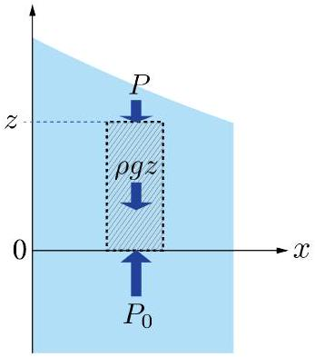
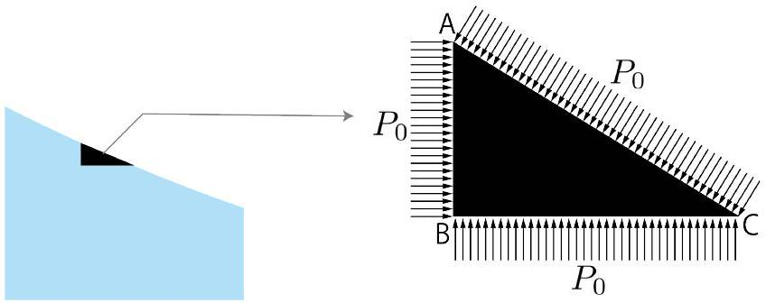
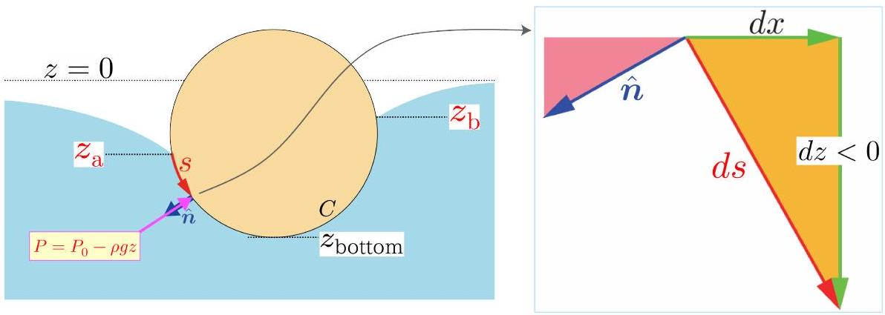

## Theory Problem 3: Water and Objects (10 points)

Part A. Merger of water drops (2.0 pt)
A. 1 The surface energy per drop before the merger is

$$
\begin{equation*}
E = 4 \pi a ^ { 2 } \gamma . \tag{S3.1}
\end{equation*}
$$

Therefore, the surface energy difference becomes

$$
\begin{equation*}
\Delta E = 4 \pi \left( 2 - 2 ^ { 2 / 3 } \right) a ^ { 2 } \gamma . \tag{S3.2}
\end{equation*}
$$

The transfer of surface energy to kinetic energy is represented by

$$
\begin{equation*}
M v ^ { 2 } / 2 = k \Delta E , \tag{S3.3}
\end{equation*}
$$

where $k = 0.06$ and $M = 4 \pi a ^ { 3 } \rho / 3 \times 2 = 8 \pi a ^ { 3 } \rho / 3$ is the mass of the drop after the merger. The numerical computation gives

$$
\begin{equation*}
v = \sqrt { \frac { 2 k \Delta E } { M } } = \sqrt { 3 \left( 2 - 2 ^ { 2 / 3 } \right) \frac { k \gamma } { \rho a } } = \sqrt { 3 \left( 2 - 2 ^ { 2 / 3 } \right) \times \frac { 0.06 \times \left( 7.27 \times 10 ^ { - 2 } \right) } { \left( 1.0 \times 10 ^ { 3 } \right) \times \left( 100 \times 10 ^ { - 6 } \right) } } = 0.232 \mathrm {~m} / \mathrm { s } . \tag{S3.4}
\end{equation*}
$$

- Note: We point out an interesting phenomenon related to this question. On a superhydrophobic surface, when small droplets merge, they release surface energy, causing the surface area to shrink. This energy release propels the merged droplet to jump up. This phenomenon mirrors the natural mechanism seen in cicadas. Cicadas' wings, which possess superhydrophobic surfaces, facilitate the removal of water droplets upon coalescence. This process serves as a natural self-cleaning system, converting surface energy to kinetic energy, as reported in the following paper: Wisdom et. al., Proc. Natl. Acad. Sci. USA 110, 7992-7997 (2013).
A. 1
2.0 pt

$$
v = 0.23 \mathrm {~m} / \mathrm { s }
$$

Part B. A vertically placed board (4.5 pt)
B. 1

Consider a vertical upright column-shaped water block as shown in the hatched area of Fig. S3-1. The vertical force balance with respect to this block per unit area leads to $P + \rho g z = P _ { 0 }$.

Fig. S3-1

B. 1
0.6 pt

$$
P = P _ { 0 } - \rho g z
$$

B. 2

Because the atmospheric pressure $P _ { 0 }$ exerts no net horizontal force on the water block, we have

$$
\begin{equation*}
f _ { x } = \int _ { z _ { 2 } } ^ { z _ { 1 } } ( - \rho g z ) d z = \frac { 1 } { 2 } \rho g \left( z _ { 2 } ^ { 2 } - z _ { 1 } ^ { 2 } \right) \tag{S3.5}
\end{equation*}
$$

This force acts in the leftward direction.

- Note: The reason why $P _ { 0 }$ exerts no net horizontal force is understood as follows. Consider a small area (infinitesimally divided piece) near the surface, which is regarded as a right-angled triangle (see Fig. S3-2).

Fig. S3-2

The horizontal component of the combined force exerted on the right-angled triangle ABC per unit length along the $y$-axis by atmospheric pressure is

$$
P _ { 0 } \times \overline { \mathrm { AB } } - P _ { 0 } \times \overline { \mathrm { AC } } \times \frac { \overline { \mathrm { AB } } } { \overline { \mathrm { AC } } } = 0
$$

Integrating infinitesimal pieces over a finite domain yields a finite volume of water, while the net force remains zero.
B. 2

$$
\begin{equation*}
f _ { x } = \frac { 1 } { 2 } \rho g \left( z _ { 2 } ^ { 2 } - z _ { 1 } ^ { 2 } \right) \tag{0.8 pt}
\end{equation*}
$$

B. 3

The horizontal component of the surface tension acting on the water block is $\gamma \cos \theta _ { 2 } - \gamma \cos \theta _ { 1 }$. Thus, the horizontal force balance is expressed as

$$
\begin{equation*}
f _ { x } + \gamma \cos \theta _ { 2 } - \gamma \cos \theta _ { 1 } = 0 . \tag{S3.6}
\end{equation*}
$$

B. 3

$$
\begin{equation*}
f _ { x } = \gamma \cos \theta _ { 1 } - \gamma \cos \theta _ { 2 } \tag{0.8 pt}
\end{equation*}
$$

B. 4

From the results of B. 2 and B.3, we have

$$
\begin{equation*}
\frac { 1 } { 2 } \rho g z _ { 1 } ^ { 2 } + \gamma \cos \theta _ { 1 } = \frac { 1 } { 2 } \rho g z _ { 2 } ^ { 2 } + \gamma \cos \theta _ { 2 } . \tag{S3.7}
\end{equation*}
$$

Since this equation holds at an arbitrary point $( x , z )$ on the water surface, we conclude

$$
\begin{equation*}
\frac { 1 } { 2 } \rho g z ^ { 2 } + \gamma \cos \theta = \text { constant } , \tag{S3.8}
\end{equation*}
$$

which is written as

$$
\begin{equation*}
\frac { 1 } { 2 } \left( \frac { z } { \ell } \right) ^ { a } + \cos \theta ( x ) = \text { constant } , \tag{S3.9}
\end{equation*}
$$

with $a = 2$ and $\ell = \sqrt { \frac { \gamma } { \rho g } }$.

- Note: The equaiton (S3.9) is a kind of conservation law. The constant $\ell$ is called the capillary length.

B. 4

$$
a = 2 , \quad \ell = \sqrt { \frac { \gamma } { \rho g } }
$$

0.8 pt
B. 5 The derivative of the water surface coordinate $z$, denoted by $z ^ { \prime }$, is associated with the angle of inclination $\theta$, given by the equation: $z ^ { \prime } = \tan \theta$. This relation yields

$$
\begin{equation*}
\cos \theta = \frac { 1 } { \sqrt { 1 + \left( z ^ { \prime } \right) ^ { 2 } } } , \tag{S3.10}
\end{equation*}
$$

which leads to

$$
\begin{equation*}
\cos \theta \simeq 1 - \frac { 1 } { 2 } \left( z ^ { \prime } \right) ^ { 2 } . \tag{S3.11}
\end{equation*}
$$

Plugging this into Eq. (S3.9), we obtain

$$
\begin{equation*}
\frac { z ^ { 2 } } { \ell ^ { 2 } } - z ^ { \prime 2 } = \text { const. } \tag{S3.12}
\end{equation*}
$$

Taking the derivative of both sides with respect to $x$, we have

$$
\begin{equation*}
z ^ { \prime \prime } = \frac { z } { \ell ^ { 2 } } \tag{S3.13}
\end{equation*}
$$

which is the differential equation that determines the water surface form.
Its general solution is

$$
\begin{equation*}
z = A e ^ { x / \ell } + B e ^ { - x / \ell } . \tag{S3.14}
\end{equation*}
$$

The boundary condition, $z ( \infty ) = 0$, leads to $A = 0$.
The boundary condition, $z ^ { \prime } ( 0 ) = \tan \theta _ { 0 }$, leads to $B = - \ell \tan \theta _ { 0 }$.
B. 5
1.5 pt

$$
z ( x ) = - \ell \tan \theta _ { 0 } e ^ { - x / \ell }
$$

## Part C. Interaction between two rods (3.5 pt)

C. 1 The horizontal component of the force due to the pressure is

$$
\begin{equation*}
\int _ { z _ { \mathrm { a } } } ^ { z _ { \mathrm { b } } } ( \rho g z ) d z = \frac { 1 } { 2 } \rho g \left( z _ { \mathrm { b } } ^ { 2 } - z _ { \mathrm { a } } ^ { 2 } \right) \tag{S3.15}
\end{equation*}
$$

Let $z _ { \text {bottom } }$ be the $z$-coordinate at the bottom of the rod. Then, we have

$$
\begin{equation*}
F _ { x } = \int _ { z _ { \text {bottom } } } ^ { z _ { \mathrm { a } } } ( - \rho g z ) d z + \left( - \int _ { z _ { \text {bottom } } } ^ { z _ { \mathrm { b } } } ( - \rho g z ) d z \right) = \int _ { z _ { \mathrm { a } } } ^ { z _ { \mathrm { b } } } ( \rho g z ) d z \tag{S3.16}
\end{equation*}
$$

- Note: The fact that the contribution due to the pressure does not depend on the shape of the crosssection can be demonstrated as follows. The pressure at the point $s$ on the contour $C$ along the crosssectional boundary is

$$
\begin{equation*}
- P \hat { n } d s = \left( - P _ { 0 } + \rho g z \right) \hat { n } d s . \tag{S3.17}
\end{equation*}
$$

Let $\hat { x }$ be the unit vector pointing the positive $x$-direction and noting $\hat { x } \cdot \hat { n } d s = d z$ (see Fig. S3-3), we obtain its horizontal component as

$$
\begin{equation*}
- P \hat { n } \cdot \hat { x } d s = - P _ { 0 } d z + \rho g z d z . \tag{S3.18}
\end{equation*}
$$

Integrating along the contour $C . { } ^ { 1 }$ We obtain

$$
\begin{equation*}
\int _ { z _ { \mathrm { a } } } ^ { z _ { \mathrm { b } } } ( \rho g z ) d z = \frac { 1 } { 2 } \rho g \left( z _ { \mathrm { b } } ^ { 2 } - z _ { \mathrm { a } } ^ { 2 } \right) \tag{S3.19}
\end{equation*}
$$

Fig. S3-3

C. 1
1.0 pt

$$
F _ { x } = \frac { 1 } { 2 } \rho g \left( z _ { \mathrm { b } } ^ { 2 } - z _ { \mathrm { a } } ^ { 2 } \right) + \gamma \left( \cos \theta _ { \mathrm { b } } - \cos \theta _ { \mathrm { a } } \right)
$$

C. 2 By applying the boundary conditions to Eq. (S3.8), we obtain

$$
\begin{equation*}
\underbrace { \frac { 1 } { 2 } \rho g z _ { \mathrm { a } } ^ { 2 } + \gamma \cos \theta _ { \mathrm { a } } } _ { x = x _ { \mathrm { a } } } = \underbrace { \frac { 1 } { 2 } \rho g z _ { 0 } ^ { 2 } + \gamma } _ { x = 0 } \tag{S3.20}
\end{equation*}
$$

$$
\begin{equation*}
\underbrace { \frac { 1 } { 2 } \rho g z _ { \mathrm { b } } ^ { 2 } + \gamma \cos \theta _ { \mathrm { b } } } _ { x = x _ { \mathrm { b } } } = \underbrace { \gamma } _ { x \rightarrow \infty } \tag{S3.21}
\end{equation*}
$$

Then, $F _ { x } = - \frac { 1 } { 2 } \rho g z _ { 0 } ^ { 2 }$ is obtained by subtracting (S3.20) from (S3.21).

- Note: The physical background of this problem is as follows. When a single rod is placed on the water surface, the shape of the water surface on both sides of the rod remains the same. In other words, the rod is placed in an environment that exhibits the left-right symmetry. Then, there is no force acting on the rod. On the other hand, when two rods are placed on the water surface, the left-right symmetry of the water surface is broken from the perspective of each rod. As a result, an attractive force is generated.

The displacement of the water surface at the midpoint between the two rods differs from that of a horizontal water surface. This deviation is represented by $z _ { 0 }$. That is to say, $z _ { 0 }$ plays the role of a symmetrybreaking parameter (see Fig. S3-4).

The fact that the attractive force between the two rods is determined solely by this parameter suggests that the symmetry breaking directly becomes the origin of the force. This corresponds to the fundamental principle in physics that relates symmetry breaking to force generation.

[^0]

Fig. S3-4

C. 2

$$
\begin{equation*}
F _ { x } = - \frac { 1 } { 2 } \rho g z _ { 0 } ^ { 2 } \tag{1.5 pt}
\end{equation*}
$$

C. 3 The general solution for the water surface height is given by the equation

$$
\begin{equation*}
z ( x ) = A e ^ { x / \ell } + B e ^ { - x / \ell } . \tag{S3.22}
\end{equation*}
$$

By considering the left-right symmetry, we find

$$
\begin{equation*}
A = B . \tag{S3.23}
\end{equation*}
$$

Applying the boundary condition $z ( 0 ) = z _ { 0 }$, we obtain

$$
\begin{equation*}
A + B = z _ { 0 } . \tag{S3.24}
\end{equation*}
$$

We thus have

$$
\begin{equation*}
A = z _ { 0 } / 2 , \quad B = z _ { 0 } / 2 . \tag{S3.25}
\end{equation*}
$$

C. 3

$$
\begin{equation*}
z _ { 0 } = \frac { 2 z _ { \mathrm { a } } } { e ^ { x _ { \mathrm { a } } / \ell } + e ^ { - x _ { \mathrm { a } } / \ell } } \tag{1.0 pt}
\end{equation*}
$$

[^0]:    ${ } ^ { 1 }$ This integral is symbolically written as $\oint _ { C } ( - P \hat { n } \cdot \hat { x } d s )$.
