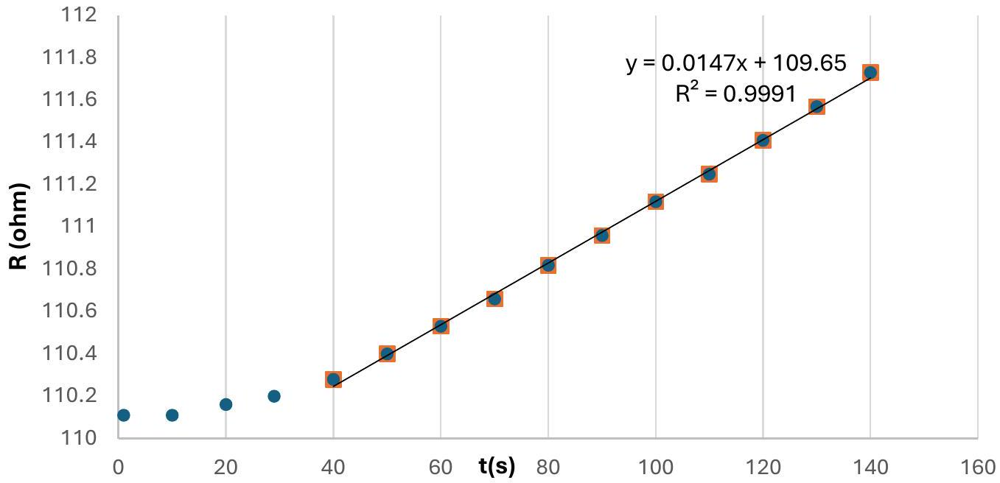
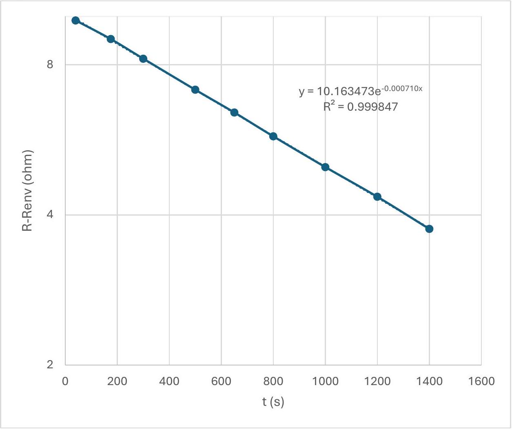
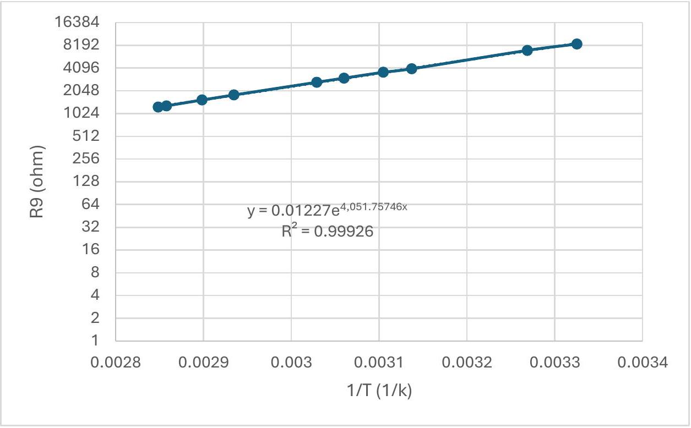
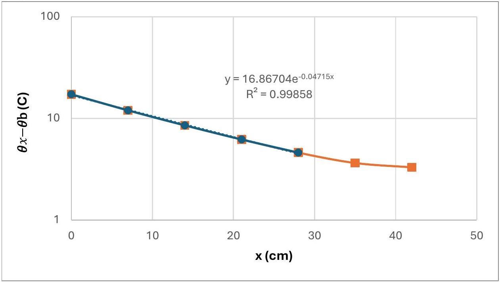
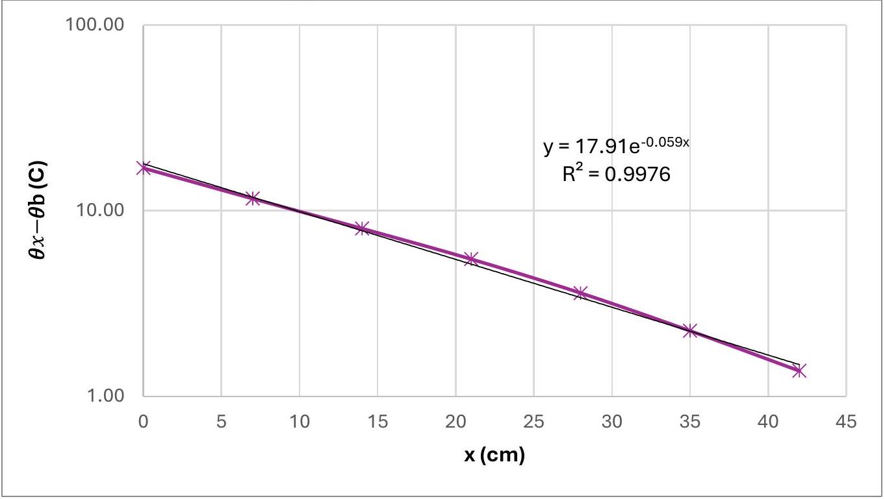
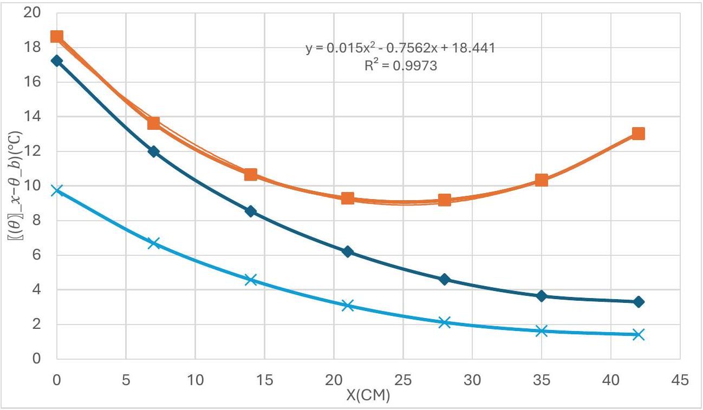
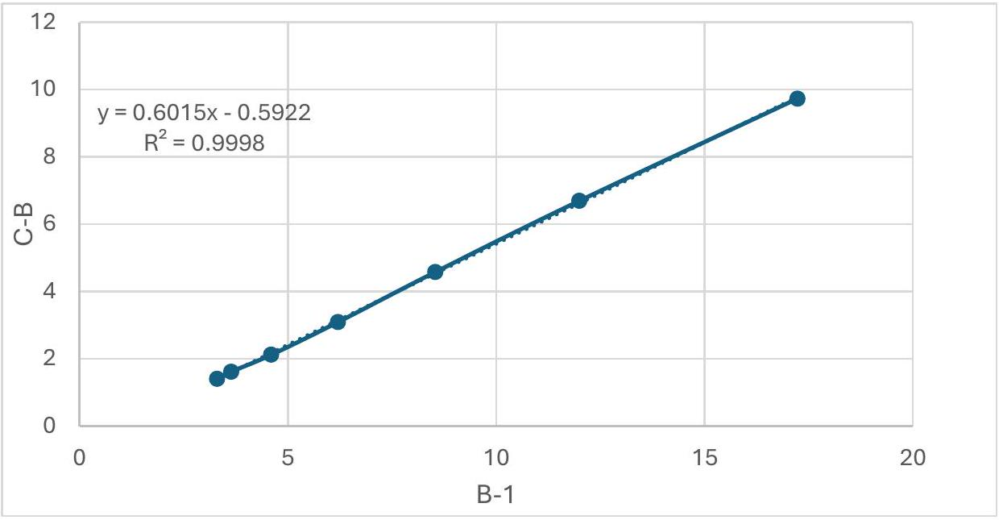

## Problem E1- Solution

## Heat Conduction in a Copper Rod (10 points)

|  | 0 | 1 | 2 | 3 | 4 | 5 | 6 | 7 | 8 | 9 |
| :--- | :--- | :--- | :--- | :--- | :--- | :--- | :--- | :--- | :--- | :--- |
|  | 0 | 1 | 2 | 3 | 4 | 5 | 6 | 7 | 8 | 9 |

Part A: The short copper rod (3.9 points)
A. 1 (0.2 pt)

$$
\begin{aligned}
& R _ { e n } = 110.11 \pm 0.01 \Omega \\
& \theta _ { e n } = 25.87 \pm 0.03 ^ { \circ } \mathrm { C }
\end{aligned}
$$

$$
\theta _ { e n } = \frac { R - R _ { 0 } } { R _ { 0 } \alpha }
$$

A. 2 (0.5 pt)

| $n$ | $R ( \Omega )$ | $t ( s )$ |
| :--- | :--- | :--- |
| 1 | 110.11 | 1 |
| 2 | 110.11 | 10 |
| 3 | 110.15 | 20 |
| 4 | 110.18 | 30 |
| 5 | 110.26 | 40 |
| 6 | 110.4 | 50 |
| 7 | 110.53 | 60 |
| 8 | 110.66 | 70 |
| 9 | 110.82 | 80 |
| 10 | 110.96 | 90 |
| 11 | 111.12 | 100 |
| 12 | 111.25 | 110 |
| 13 | 111.41 | 120 |
| 14 | 111.57 | 130 |
| 15 | 111.73 | 140 |

A. 3 (0.8 pt)

| $\Delta R / \Delta t$ | $0.0147 \Omega / s$ | $\begin{gathered} \frac { \Delta \theta } { \Delta t } = \frac { 1 } { R _ { 0 } \alpha } \frac { \Delta R } { \Delta t } \\ C _ { s } = \frac { P _ { 1 } } { \frac { \Delta \theta } { \Delta t } } , \Delta C _ { s } \approx C _ { s } \frac { \Delta P _ { 1 } } { P _ { 1 } } \end{gathered}$ |
| :--- | :--- | :--- |
| $\Delta \theta / \Delta t$ | $0.03761 ^ { \circ } \mathrm { C } / s$ |  |
| $C _ { s }$ | $52 \pm 2 \mathrm {~J} / { } ^ { \circ } \mathrm { C }$ |  |

A. 4 (0.5pt)
| $n$ | $R ( \Omega )$ | $t ( s )$ | $\left( R - R _ { e n } \right) ( \Omega )$ |
| :--- | :--- | :--- | :--- |
| 1 | 119.98 | 40 | 9.82 |
| 2 | 119.17 | 175 | 9.01 |
| 3 | 118.39 | 300 | 8.23 |
| 4 | 117.29 | 500 | 7.13 |
| 5 | 116.58 | 650 | 6.42 |
| 6 | 115.91 | 800 | 5.75 |
| 7 | 115.15 | 1000 | 4.99 |
| 8 | 114.51 | 1200 | 4.35 |
| 9 | 113.91 | 1400 | 3.75 |
| 10 | 113.40 | 1600 | 3.24 |

A. 5 (0.7 pt)

$$
\gamma = ( 710 \pm 3 ) \times 10 ^ { - 6 } s ^ { - 1 }
$$

A. 6 (0.5 pt)
| $n$ | $R ( \Omega )$ | $R _ { 9 } ( \Omega )$ | T(k) | $\frac { 1 } { T } \left( \frac { 1 } { k } \right)$ |
| :--- | :--- | :--- | :--- | :--- |
| 1 | 8528 | 110.78 | 300.733 | 0.003325 |
| 2 | 7020 | 112.81 | 305.9272 | 0.003269 |
| 3 | 4005 | 117.83 | 318.772 | 0.003137 |
| 4 | 3601 | 119.13 | 322.0984 | 0.003105 |
| 5 | 3014 | 120.96 | 326.7808 | 0.00306 |
| 6 | 2658 | 122.27 | 330.1328 | 0.003029 |
| 7 | 1803 | 126.42 | 340.7515 | 0.002935 |
| 8 | 1547 | 128.09 | 345.0245 | 0.002898 |
| 9 | 1296 | 130.00 | 349.9117 | 0.002858 |
| 10 | 1246 | 130.45 | 351.0631 | 0.002848 |

International Physics Olympiad
Isfahan Iran 2024

A. 7 (0.7 pt)

$$
E _ { g } = 0.698 \pm 0.007 \mathrm { eV }
$$

Part B: The long copper rod (4.1 points)
| B. 1 and B. 5 $\theta _ { b } = 24.41 ^ { \circ } \mathrm { C }$ |  |  |  |  |  |
| :--- | :--- | :--- | :--- | :--- | :--- |
| B. 1 (0.4pt) |  |  |  | B. 5 (0.4pt) |  |
| $n$ | $x ( c m )$ | $\theta _ { x } \left( { } ^ { \circ } \mathrm { C } \right)$ | $\theta _ { x } - \theta _ { \mathrm { b } } \left( { } ^ { \circ } \mathrm { C } \right)$ | $B ^ { ( 1 ) } e ^ { \lambda ^ { ( 0 ) } x } \left( { } ^ { \circ } \mathrm { C } \right)$ | $\theta ^ { \prime } { } _ { x } - \theta _ { \mathrm { b } } \left( { } ^ { \circ } \mathrm { C } \right)$ |
| 1 | 0 | 44.61 | 17.23 | 0.27 | 16.96 |
| 2 | 7 | 39.37 | 11.99 | 0.37 | 11.62 |
| 3 | 14 | 35.92 | 8.54 | 0.51 | 8.03 |
| 4 | 21 | 33.58 | 6.20 | 0.72 | 5.48 |
| 5 | 28 | 31.98 | 4.60 | 1.00 | 3.60 |
| 6 | 35 | 31.02 | 3.64 | 1.39 | 2.25 |
| 7 | 42 | 30.68 | 3.30 | 1.93 | 1.37 |

B. 2 (0.4 pt)

B. 3 (0.6 pt)

$$
A ^ { ( 0 ) } = 16.87 ^ { \circ } \mathrm { C }
$$

$$
\lambda ^ { ( 0 ) } = 0.047 \pm 0.005 \quad \left( \frac { 1 } { c m } \right)
$$

B. 4 (0.4 pt)

$$
\begin{gathered}
B = A e ^ { - 2 \lambda d } \\
B ^ { ( 1 ) } = 0.266 ^ { \circ } \mathrm { C }
\end{gathered}
$$

B. 6 (1.0 pt)

$$
\begin{aligned}
& A ^ { ( 1 ) } = 17.91 ^ { \circ } \mathrm { C } \\
& \lambda ^ { ( 1 ) } = 0.059 \pm 0.002 \left( \frac { 1 } { \mathrm {~cm} } \right)
\end{aligned}
$$

International Physics Olympiad
Isfahan Iran 2024

## B. 7 (0.9 pt)

$$
\begin{gathered}
P _ { 2 } = \int _ { - 0.5 c m } ^ { 42.5 c m } 2 \pi r h \left( \theta _ { x } - \theta _ { \mathrm { b } } \right) d x \quad \text { or } \quad \int _ { 0 } ^ { d } 2 \pi r h \left( \theta _ { x } - \theta _ { \mathrm { b } } \right) d x = \frac { 2 \pi r h A } { \lambda } \left( 1 - e ^ { - 2 \lambda d } \right) \\
h = \frac { P _ { 2 } \lambda } { 2 \pi r A \left( 1 - e ^ { - 2 \lambda d } \right) } , k = \frac { 2 h } { \lambda ^ { 2 } r } , P _ { 2 } = 4.5 \mathrm {~W} \\
\lambda = 0.053 \pm 0.008 \left( \frac { 1 } { \mathrm {~cm} } \right) , h = 0.0037 \pm 0.0003 \frac { \mathrm {~W} } { \mathrm { kcm } ^ { 2 } } , k = 3.9 \pm 0.3 \frac { \mathrm {~W} } { \mathrm { kcm } }
\end{gathered}
$$

## C. 1 (0.4 pt)

$$
\theta _ { b } = 27.38 ^ { \circ } \mathrm { C }
$$

| $n$ | $x ( c m )$ | $\theta _ { x } \left( { } ^ { \circ } \mathrm { C } \right)$ | $\left( \theta _ { x } - \theta _ { b } \right) \left( { } ^ { \circ } \mathrm { C } \right)$ | B-1 | C-B | Reversed order |
| :--- | :--- | :--- | :--- | :--- | :--- | :--- |
| 1 | 0 | 46.02 | 18.64 | 17.23 | 1.41 | 9.73 |
| 2 | 7 | 40.99 | 13.61 | 11.99 | 1.62 | 6.69 |
| 3 | 14 | 38.04 | 10.66 | 8.54 | 2.12 | 4.58 |
| 4 | 21 | 36.67 | 9.29 | 6.2 | 3.09 | 3.09 |
| 5 | 28 | 36.56 | 9.18 | 4.6 | 4.58 | 2.12 |
| 6 | 35 | 37.71 | 10.33 | 3.64 | 6.69 | 1.62 |
| 7 | 42 | 40.41 | 13.03 | 3.3 | 9.73 | 1.41 |

## C. 2 (0.6 pt)

(The blue plots are not necessary to draw)

## C. 3 (1.0 pt)

1) $\frac { P _ { 3 } } { P _ { 2 } } = \frac { \frac { d \theta } { d x } } { x = 42 \mathrm {~cm} } _ { \frac { d \theta } { d x } { } _ { x = 0 \mathrm {~cm} } } ^ { = \frac { \frac { \Delta \theta } { \Delta x } } { x = 42 \mathrm {~cm} } } = \frac { \theta _ { 7 } - \theta _ { 6 } } { \frac { \Delta \theta } { \Delta x } { } _ { x = 0 \mathrm {~cm} } }$
2) $\frac { P _ { 3 } } { P _ { 2 } } = \frac { \frac { d \theta } { d x } } { x = 42 c m } _ { \frac { d \theta } { d x } { } _ { x = 0 c m } } ^ { = \frac { \sinh \left( \lambda \left( 42 - x _ { 0 } \right) \right) } { \sinh \left( \lambda x _ { 0 } \right) } }$
3) calculation by integral method or sigma in several parts
4) Slope ((C-B) _ B)

$$
P _ { 3 } = 0.60 P _ { 2 } \pm 0.01 P _ { 2 }
$$
