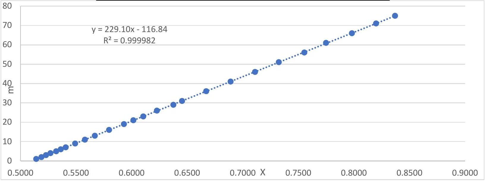
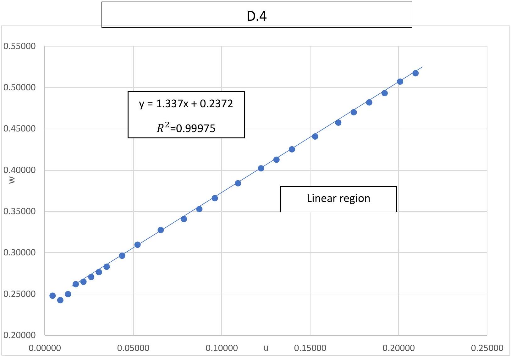

## Problem E2- Solution

| A. 1 |  |  |  |
| :--- | :--- | :--- | :--- |
| number | m | $\theta _ { m }$ (degrees) | $\sqrt { n ^ { 2 } - \sin ^ { 2 } \theta _ { m } } - \cos \theta _ { m }$ |
| 1 | 1 | 9.00 | 0.5142 |
| 2 | 2 | 13.00 | 0.5188 |
| 3 | 3 | 15.75 | 0.5229 |
| 4 | 4 | 18.00 | 0.5270 |
| 5 | 5 | 20.50 | 0.5322 |
| 6 | 6 | 22.25 | 0.5362 |
| 7 | 7 | 24.00 | 0.5406 |
| 8 | 9 | 27.00 | 0.5491 |
| 9 | 11 | 29.75 | 0.5579 |
| 10 | 13 | 32.25 | 0.5668 |
| 11 | 16 | 35.50 | 0.5798 |
| 12 | 19 | 38.50 | 0.5931 |
| 13 | 21 | 40.25 | 0.6015 |
| 14 | 23 | 42.00 | 0.6105 |
| 15 | 26 | 44.25 | 0.6228 |
| 16 | 29 | 46.75 | 0.6375 |
| 17 | 31 | 48.00 | 0.6453 |
| 18 | 36 | 51.25 | 0.6671 |
| 19 | 41 | 54.25 | 0.6891 |
| 20 | 46 | 57.00 | 0.7110 |
| 21 | 51 | 59.50 | 0.7325 |
| 22 | 56 | 62.00 | 0.7555 |
| 23 | 61 | 64.00 | 0.7750 |
| 24 | 66 | 66.25 | 0.7982 |
| 25 | 71 | 68.25 | 0.8200 |
| 26 | 75 | 69.75 | 0.8371 |

A. 2

| A. 3 |
| :--- |
| B = 229.1 |
| $\mathrm { A } = - 116.8$ |

| A. 4 |
| :--- |
| $\mathrm { h } = ( 148.9 \pm 0.1 ) \mu m$ |

| B. 1 |  |  |  |
| :--- | :--- | :--- | :--- |
| number | m | $\theta _ { m }$ (degrees) | $\theta _ { m } { } ^ { 2 } \left( \mathrm { rad } ^ { 2 } \right)$ |
| 1 | 1 | 2.50 | 0.00190 |
| 2 | 2 | 4.25 | 0.00550 |
| 3 | 3 | 5.50 | 0.00921 |
| 4 | 4 | 6.50 | 0.01287 |
| 5 | 5 | 7.25 | 0.01601 |
| 6 | 6 | 8.25 | 0.02073 |
| 7 | 8 | 9.50 | 0.02749 |
| 8 | 10 | 10.75 | 0.03520 |
| 9 | 12 | 11.75 | 0.04206 |
| 10 | 15 | 13.25 | 0.05348 |
| 11 | 18 | 14.50 | 0.06405 |
| 12 | 20 | 15.25 | 0.07084 |
| 13 | 22 | 16.00 | 0.07798 |
| 14 | 25 | 17.00 | 0.08803 |
| 15 | 29 | 18.50 | 0.10426 |
| 16 | 31 | 19.00 | 0.10997 |
| 17 | 33 | 19.75 | 0.11882 |

| B. 2 |
| :--- |
| $m = \frac { H } { 2 \lambda } \left( 1 - \frac { 1 } { n } \right) \theta _ { m } { } ^ { 2 }$ |

| B. 3 |  |  |  |  |  |  |  |  |
| :--- | :--- | :--- | :--- | :--- | :--- | :--- | :--- | :--- |
| 30 |  |  |  |  |  |  |  |  |
| 25 |  |  |  |  |  |  |  |  |
| 20 |  |  |  |  |  |  |  |  |
|  |  |  |  |  |  |  |  |  |  |  |
| 10 | .● |  |  |  |  |  |  |  |
| 5 |  |  |  |  |  |  |  |  |
| 0 |  |  |  |  |  |  |  |  |
| $\theta _ { m } ^ { 2 } \left( r a d ^ { 2 } \right)$ |  |  |  |  |  |  |  |  |

|  | B. 4 |
| :--- | :--- |
| B $= 275.7$ |  |
| A =0.43 |  |

| B. 5 |
| :--- |
| $\mathrm { H } = ( 1.061 \pm 0.004 ) \mathrm { mm }$ |

| C. 1 |  |  |  |
| :--- | :--- | :--- | :--- |
| number | m | $\theta _ { m }$ (degree) | $\theta _ { m } { } ^ { 2 } \left( \mathrm { rad } ^ { 2 } \right)$ |
| 1 | 1 | 5.75 | 0.01007 |
| 2 | 2 | 7.75 | 0.01830 |
| 3 | 3 | 9.50 | 0.02749 |
| 4 | 4 | 10.75 | 0.03520 |
| 5 | 5 | 12.00 | 0.04386 |
| 6 | 6 | 13.00 | 0.05148 |
| 7 | 7 | 14.00 | 0.05971 |
| 8 | 8 | 14.75 | 0.06627 |
| 9 | 9 | 15.75 | 0.07556 |
| 10 | 10 | 16.50 | 0.08293 |
| 11 | 11 | 17.25 | 0.09064 |
| 12 | 12 | 18.00 | 0.09870 |
| 13 | 13 | 18.50 | 0.10426 |
| 14 | 14 | 19.25 | 0.11288 |
| 15 | 15 | 19.75 | 0.11882 |

C. 2

$$
m = \frac { H } { 2 \lambda } \left( N - \frac { N ^ { 2 } } { n } \right) \theta _ { m } { } ^ { 2 }
$$

| C. 3 |  |  |  |  |  |  |  |
| :--- | :--- | :--- | :--- | :--- | :--- | :--- | :--- |
| 16 |  |  |  |  |  |  |  |
|  |  |  |  |  |  |  |  |
|  |  |  |  |  |  |  |  |
| 10 | $\mathrm { R } ^ { 2 } = 0.99895$ |  |  |  |  |  |  |
|  |  |  |  |  |  |  |  |
| 8 |  |  |  |  |  |  |  |
|  |  |  |  |  |  |  |  |
|  |  |  |  |  |  |  |  |
|  |  |  |  |  |  |  |  |
|  |  | 0.04000 | 0.06000 0.06000 | $\theta _ { m } ^ { 2 } \left( \operatorname { rad } ^ { 2 } \right)$   $\theta _ { m } ^ { 2 } \left( \operatorname { rad } ^ { 2 } \right)$ | 0.10000 | 0.12000 | 0.14000 |
|  |  |  |  |  |  |  |  |  |

| C. 4 |
| :--- |
| $\begin{aligned} & B = 128.0 \\ & A = - 0.50 \end{aligned}$ |

| C. 5 |
| :--- |
| $\mathrm { N } = 1.332 \pm 0.002$ |

| D. 1 |  |  | D. 3 |  |
| :--- | :--- | :--- | :--- | :--- |
| number | m | $\theta _ { m }$ (degree) | u | w |
| 1 | 1 | 13.25 | 0.00436 | 0.24795 |
| 2 | 2 | 19.00 | 0.00873 | 0.24265 |
| 3 | 3 | 23.00 | 0.01309 | 0.24981 |
| 4 | 4 | 26.00 | 0.01746 | 0.26200 |
| 5 | 5 | 29.00 | 0.02182 | 0.26474 |
| 6 | 6 | 31.50 | 0.02619 | 0.27069 |
| 7 | 7 | 33.75 | 0.03055 | 0.27653 |
| 8 | 8 | 35.75 | 0.03492 | 0.28307 |
| 9 | 10 | 39.25 | 0.04365 | 0.29637 |
| 10 | 12 | 42.25 | 0.05238 | 0.30973 |
| 11 | 15 | 46.25 | 0.06547 | 0.32743 |
| 12 | 18 | 50.00 | 0.07857 | 0.34076 |
| 13 | 20 | 52.00 | 0.08730 | 0.35289 |
| 14 | 22 | 53.75 | 0.09603 | 0.36608 |
| 15 | 25 | 56.25 | 0.10912 | 0.38415 |
| 16 | 28 | 58.50 | 0.12222 | 0.40213 |
| 17 | 30 | 60.00 | 0.13095 | 0.41261 |
| 18 | 32 | 61.25 | 0.13968 | 0.42517 |
| 19 | 35 | 63.25 | 0.15277 | 0.44072 |
| 20 | 38 | 65.00 | 0.16587 | 0.45761 |
| 21 | 40 | 66.00 | 0.17460 | 0.47008 |
| 22 | 42 | 67.00 | 0.18333 | 0.48193 |
| 23 | 44 | 68.00 | 0.19205 | 0.49320 |
| 24 | 46 | 68.75 | 0.20078 | 0.50715 |
| 25 | 48 | 69.75 | 0.20951 | 0.51739 |

|  | D. 2 |
| :--- | :--- |
| $\mathrm { u } = \frac { m \lambda } { h }$ | $\mathrm { W } = \frac { \frac { m \lambda } { h } \left( n + \frac { m \lambda } { 2 h } \right) } { 1 - \cos \theta _ { m } }$ |

## By removing the first 3 points

|  | D. 5 |
| :--- | :--- |
| $\begin{aligned} & B = 1.337 \\ & A = 0.2372 \end{aligned}$ |  |

| D. 6 |
| :--- |
| $\begin{aligned} & \mathrm { N } _ { \mathrm { B } } = 1.337 \pm 0.005 \\ & \mathrm {~N} _ { \mathrm { A } } = 1.3319 \pm 0.0005 \end{aligned}$ |

## Theoretical calculations:

## B. 2 \& C.2:

$$
\begin{gathered}
m = \frac { H } { \lambda } \left( \sqrt { n ^ { 2 } - N ^ { 2 } \sin ^ { 2 } \theta _ { m } } - N \cos \theta _ { m } \right) - \frac { H } { \lambda } ( n - N ) \\
\theta _ { m } \ll 1 : \quad \sin \theta _ { m } \approx \theta _ { m } \quad ; \quad \cos \theta _ { m } \approx 1 - \frac { \theta _ { m } ^ { 2 } } { 2 } \\
m = \frac { H } { \lambda } \left( n \sqrt { 1 - \frac { N ^ { 2 } \theta _ { m } ^ { 2 } } { n ^ { 2 } } } - N \left( 1 - \frac { \theta _ { m } ^ { 2 } } { 2 } \right) \right) - \frac { H } { \lambda } ( n - N ) \\
m = \frac { H } { \lambda } \left( n \left( 1 - \frac { N ^ { 2 } \theta _ { m } ^ { 2 } } { 2 n ^ { 2 } } \right) - N \left( 1 - \frac { \theta _ { m } ^ { 2 } } { 2 } \right) \right) - \frac { H } { \lambda } ( n - N ) \\
m = \frac { H } { 2 \lambda } N \left( 1 - \frac { N } { n } \right) \theta _ { m } ^ { 2 } \\
N = 1 : m = \frac { H } { 2 \lambda } \left( 1 - \frac { 1 } { n } \right) \theta _ { m } ^ { 2 }
\end{gathered}
$$

D.2:

$$
\begin{gathered}
m = \frac { h } { \lambda } \left( \sqrt { n ^ { 2 } - N ^ { 2 } \sin ^ { 2 } \theta _ { m } } - N \cos \theta _ { m } \right) - \frac { h } { \lambda } ( n - N ) \\
\frac { m \lambda } { h } + n - N \left( 1 - \cos \theta _ { m } \right) = \sqrt { n ^ { 2 } - N ^ { 2 } \sin ^ { 2 } \theta _ { m } } \\
\left( \frac { m \lambda } { h } \right) ^ { 2 } + 2 n \left( \frac { m \lambda } { h } \right) + n ^ { 2 } + N ^ { 2 } \left( 1 - \cos \theta _ { m } \right) ^ { 2 } - 2 N \left( 1 - \cos \theta _ { m } \right) \left( \frac { m \lambda } { h } + n \right) = n ^ { 2 } - N ^ { 2 } \sin ^ { 2 } \theta _ { m } \\
\left( \frac { m \lambda } { h } \right) ^ { 2 } + 2 n \left( \frac { m \lambda } { h } \right) + N ^ { 2 } \left( 2 - 2 \cos \theta _ { m } \right) - 2 N n \left( 1 - \cos \theta _ { m } \right) - 2 N \left( 1 - \cos \theta _ { m } \right) \left( \frac { m \lambda } { h } \right) = 0 \\
\frac { \frac { m \lambda } { h } \left( n + \frac { m \lambda } { 2 h } \right) } { 1 - \cos \theta _ { m } } + N ^ { 2 } - N n - N \left( \frac { m \lambda } { h } \right) = 0 \\
\frac { \frac { m \lambda } { h } \left( n + \frac { m \lambda } { 2 h } \right) } { 1 - \cos \theta _ { m } } = N ( n - N ) + \left( \frac { m \lambda } { h } \right) N \\
w = N ( n - N ) + u N
\end{gathered}
$$

International Physics Olympiad
Isfahan Iran 2024
Error calculations:
Linear equation slope and intercept uncertainties:

$$
\Delta B = B \sqrt { \frac { 1 } { n - 2 } \left( \frac { 1 } { r ^ { 2 } } - 1 \right) } \quad ; \quad \Delta A = \Delta B \sqrt { \bar { x } ^ { 2 } + \sigma _ { x } ^ { 2 } }
$$

C.5:

$$
\begin{gathered}
B = \frac { H } { 2 \lambda } \left( N - \frac { N ^ { 2 } } { n } \right) \Rightarrow \left( N - \frac { N ^ { 2 } } { n } \right) = \frac { 2 \lambda } { H } B \equiv c \\
\Rightarrow \frac { \Delta c } { c } = \sqrt { \left( \frac { \Delta B } { B } \right) ^ { 2 } + \left( \frac { \Delta H } { H } \right) ^ { 2 } } \\
\left( N - \frac { N ^ { 2 } } { n } \right) = c \Rightarrow N = \frac { n } { 2 } \pm \sqrt { \left( \frac { n } { 2 } \right) ^ { 2 } - c n }
\end{gathered}
$$

A negative sign is unacceptable in this equation.

$$
N = \frac { n } { 2 } + \sqrt { \left( \frac { n } { 2 } \right) ^ { 2 } - c n } \Rightarrow \Delta N = \frac { n } { 2 \sqrt { \left( \frac { n } { 2 } \right) ^ { 2 } - c n } } \Delta c
$$

D.6:

$$
N _ { A } \left( n - N _ { A } \right) = A \Rightarrow N _ { A } = \frac { n } { 2 } \pm \sqrt { \left( \frac { n } { 2 } \right) ^ { 2 } - A }
$$

A negative sign is unacceptable in this equation.

$$
N _ { A } = \frac { n } { 2 } + \sqrt { \left( \frac { n } { 2 } \right) ^ { 2 } - A } \Rightarrow \Delta N _ { A } = \frac { \Delta A } { 2 \sqrt { \left( \frac { n } { 2 } \right) ^ { 2 } - A } }
$$

Of course, this is calculated by ignoring the error of u and w . Since there is an h value in $u$ and $w$, the $h$ error causes an error in this quantity that is not included.
