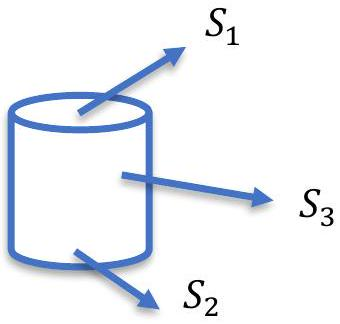

## A: Paul Trap

A-1. Due to the symmetry, on the $z$-axis the only non-zero component of electric field is in the $z$-direction. So:

$$
\vec { E } ( 0,0 , z ) = E _ { z } ( 0,0 , z ) \hat { z } = \hat { z } \int \frac { d q } { 4 \pi \epsilon _ { 0 } } \frac { 1 } { \left( R ^ { 2 } + z ^ { 2 } \right) } \times \frac { z } { \left( R ^ { 2 } + z ^ { 2 } \right) ^ { \frac { 1 } { 2 } } }
$$

The element $d q$ is equal to $\lambda R d \phi$ where $\phi$ is the angle with the $x$-axis. Thus:

$$
E ( 0,0 , z ) = \hat { z } \int \frac { \lambda R d \phi } { 4 \pi \epsilon _ { 0 } } \frac { z } { \left( z ^ { 2 } + R ^ { 2 } \right) ^ { \frac { 3 } { 2 } } } = \hat { z } \frac { \lambda R } { 2 \epsilon _ { 0 } } \frac { z } { \left( z ^ { 2 } + R ^ { 2 } \right) ^ { \frac { 3 } { 2 } } }
$$

For $z \ll R$ this can be written as:

$$
E _ { z } ( 0,0 , z ) = \frac { \lambda R } { 2 \epsilon _ { 0 } } \frac { z } { R ^ { 3 } } = \frac { \lambda z } { 2 \epsilon _ { 0 } R ^ { 2 } }
$$

Very close to the $z$-axis, we can write:

$$
E _ { z } ( x , y , z ) = E _ { z } ( 0,0 , z ) + \left. x \frac { \partial E _ { z } } { \partial x } \right| _ { ( 0,0 , z ) } + \left. y \frac { \partial E _ { z } } { \partial y } \right| _ { ( 0,0 , z ) } + O \left( x ^ { 2 } , y ^ { 2 } , z ^ { 2 } \right)
$$

Since, there is no difference between $x$ and $- x$ or $y$ and $- y$, it turns out that $\frac { \partial E _ { z } } { \partial x } = \frac { \partial E _ { z } } { \partial y } = 0$. Thus, to the first order in $x , y$, and $z$ we have:

$$
E _ { z } ( x , y , z ) = \frac { \lambda z } { 2 \epsilon _ { 0 } R ^ { 2 } }
$$

Consider a Gaussian surface in the shape of a symmetric cylinder around the $z$-axis whose bases are parallel with the $x y$-plane. The cylinder's radius is $\rho$ and its height is $2 z$ both of which are small quantities. By Gauss's law we have:

$$
0 = \frac { Q _ { i n } } { \epsilon _ { 0 } } = \oint \vec { E } \cdot d \vec { S } = \int _ { S _ { 1 } } \vec { E } \cdot d \vec { S } + \int _ { S _ { 2 } } \vec { E } \cdot d \vec { S } + \int _ { S _ { 3 } } \vec { E } \cdot d \vec { S }
$$

Integration over $S _ { 1 }$ and $S _ { 2 }$ gives:

$$
\int _ { S _ { 1 } } \vec { E } \cdot d \vec { S } = \int _ { S _ { 2 } } \vec { E } \cdot d \vec { S } = \pi \rho ^ { 2 } \times \frac { \lambda z } { 2 \epsilon _ { 0 } R ^ { 2 } }
$$

Integration over $S _ { 3 }$ involves the $\rho$-component for which we can write the following expansion:

$$
E _ { \rho } ( z , \rho , \phi ) = E _ { \rho } ( 0 , \rho , \phi ) + \left. z \frac { \partial E _ { \rho } } { \partial z } \right| _ { ( 0 , \rho , \phi ) } + O \left( z ^ { 2 } \right)
$$

We have $0 = \left. \frac { \partial E _ { \rho } } { \partial z } \right| _ { ( 0 , \rho , \phi ) }$ due to symmetry between $z$ and $- z$, hence, $E _ { \rho } ( z , \rho , \phi ) = E _ { \rho } ( 0 , \rho , \phi )$ up to the first order. Axial symmetry also implies $\frac { d E _ { \rho } } { d \phi } = 0$. Consequently:

$$
\int _ { S _ { 3 } } \vec { E } \cdot d \vec { S } = E _ { \rho } ( 0 , \rho , 0 ) \times 2 z \times 2 \pi \rho
$$

So, Gauss's law implies:

$$
0 = E _ { \rho } \times 4 \pi z \rho + 2 \pi \rho ^ { 2 } \frac { \lambda z } { 2 \epsilon _ { 0 } R ^ { 2 } }
$$

Therefore, $E _ { \rho }$ will be:

$$
E _ { \rho } = - \frac { \lambda \rho } { 4 \epsilon _ { 0 } R ^ { 2 } }
$$

In the cylindrical coordinate we will have:

$$
\vec { E } ( \rho , \phi , z ) = - \frac { \lambda \rho } { 4 \epsilon _ { 0 } R ^ { 2 } } \hat { \rho } + \frac { \lambda z } { 2 \epsilon _ { 0 } R ^ { 2 } } \hat { z }
$$

In cartesian coordinates we will have:

$$
\vec { E } ( x , y , z ) = \frac { \lambda } { 4 \epsilon _ { 0 } R ^ { 2 } } ( - x , - y , 2 z )
$$

Since the ring is positively charged, the equilibrium in the $x$ and $y$ directions are stable, while the equilibrium in the $z$-direction is unstable. The equations of motion in the $x$ and $y$ directions read:

$$
\begin{aligned}
& m \ddot { x } = q E _ { x } = - \frac { q \lambda } { 4 \epsilon _ { 0 } R ^ { 2 } } x \\
& m \ddot { y } = q E _ { y } = - \frac { q \lambda } { 4 \epsilon _ { 0 } R ^ { 2 } } y
\end{aligned}
$$

Therefore, the frequencies of small oscillations are:

$$
\omega _ { x } ^ { 2 } = \omega _ { y } ^ { 2 } = \frac { q \lambda } { 4 \epsilon _ { 0 } R ^ { 2 } m }
$$

A-1 (1.5 pt)
(a) $\vec { E } ( x , y , z ) = \frac { - \lambda x } { 4 \epsilon _ { 0 } R ^ { 2 } } \hat { x } + \frac { - \lambda y } { 4 \epsilon _ { 0 } R ^ { 2 } } \hat { y } + \frac { \lambda z } { 2 \epsilon _ { 0 } R ^ { 2 } } \hat { z }$
(b) $\omega _ { x } = \omega _ { y } = \sqrt { \frac { Q \lambda } { 4 \epsilon _ { 0 } R ^ { 2 } m } }$

A-2.
The force in the $z$-direction is:

$$
F _ { z } = q E _ { z } = \frac { Q \lambda z } { 2 \epsilon _ { 0 } R ^ { 2 } } = \frac { Q } { 2 \epsilon _ { 0 } R ^ { 2 } } \lambda _ { 0 } z + \frac { Q u } { 2 \epsilon _ { 0 } R ^ { 2 } } \cos \Omega t z
$$

the equation of motion can thus be written as:

$$
\ddot { z } = \left( \frac { Q \lambda _ { 0 } } { 2 \epsilon _ { 0 } R ^ { 2 } m } + \frac { Q u } { 2 \epsilon _ { 0 } R ^ { 2 } m } \cos \Omega t \right) z
$$

Therefore:

$$
k = \sqrt { \frac { Q \lambda _ { 0 } } { 2 \epsilon _ { 0 } R ^ { 2 } m } } \quad , \quad a = \frac { Q u } { 2 \epsilon _ { 0 } R ^ { 2 } m \Omega ^ { 2 } }
$$

A-2 (0.4 pt)

$$
k = \sqrt { \frac { Q \lambda _ { 0 } } { 2 \epsilon _ { 0 } R ^ { 2 } m } } \quad , a = \frac { Q u } { 2 \epsilon _ { 0 } R ^ { 2 } m \Omega ^ { 2 } }
$$

A. 3.
$$
z = p ( t ) + q ( t ) \quad \rightarrow \quad \ddot { p } + \ddot { q } = \left( k ^ { 2 } + a \Omega ^ { 2 } \cos \Omega t \right) ( p + q )
$$
1. We are assuming that $p$ is almost constant, $\ddot { p } \simeq 0$.
2. According to the assumptions $k ^ { 2 } \ll a \Omega ^ { 2 }$ and $q \ll p$ we can ignore $k ^ { 2 }$ in the first term on the right-hand side of the equation and $q$ in the second term.

hence, the equation of motion can be simplified as follows:

$$
\ddot { q } = p a \Omega ^ { 2 } \cos \Omega t .
$$

As we have assumed that $p$ is a constant, the second derivative of $q$ is just proportional to $\cos \Omega t$ which gives:

$$
q = - p a \cos \Omega t + c _ { 1 } t + c _ { 2 } .
$$

Since $q$ is supposed to remain small, $c _ { 1 }$ must vanish. Also $c _ { 2 } = 0$ because the mean value of $q$ is supposed to remain zero. Therefore:

$$
q = - p a \cos \Omega t
$$

A-3 (1.8 pt)
(a) $\ddot { q } ( t ) = p a \Omega ^ { 2 } \cos \Omega t$
(b) $q ( t ) = - p a \cos \Omega t$

A-4. Using the final result for $q$ the equation of motion for $p$ reads:

$$
\ddot { p } + p a \Omega ^ { 2 } \cos \Omega t = \left( k ^ { 2 } + a \Omega ^ { 2 } \cos \Omega t \right) ( p - a p \cos \Omega t )
$$

Which gives:

$$
\ddot { p } = k ^ { 2 } p - a k ^ { 2 } p \cos \Omega t - a ^ { 2 } \Omega ^ { 2 } p \cos ^ { 2 } \Omega t
$$

Averaging over one period, we'll have:

$$
\langle \cos \Omega t \rangle = 0 \quad , \quad \left\langle \cos ^ { 2 } \Omega t \right\rangle = \frac { 1 } { 2 }
$$

and:

$$
\ddot { p } = \left( k ^ { 2 } - \frac { a ^ { 2 } \Omega ^ { 2 } } { 2 } \right) p .
$$

In order for the motion to be stable, the expression inside the parentheses should be negative, i.e.

$$
\frac { a ^ { 2 } \Omega ^ { 2 } } { 2 } > k ^ { 2 } \quad \rightarrow \quad \Omega > \sqrt { 2 } \frac { k } { a }
$$

A-4 (1.5 pt)
(a) $\ddot { p } ( t ) = \left( k ^ { 2 } - \frac { a ^ { 2 } \Omega ^ { 2 } } { 2 } \right) p$
(b) $\Omega > \sqrt { 2 } \frac { k } { a }$

A.5. With the given data we have:

$$
\begin{gathered}
k = \sqrt { \frac { Q \lambda _ { 0 } } { 2 \epsilon _ { 0 } R ^ { 2 } m } } = 2 \times 10 ^ { 5 } \mathrm { rad } / \mathrm { s } \\
a = 0.04 \quad \rightarrow \quad \Omega _ { \min } = 7 \times 10 ^ { 6 } \mathrm { rad } / \mathrm { s }
\end{gathered}
$$

which is in the range of radio waves.

$$
\begin{aligned}
& \text { A-5 } ( 0.4 \mathrm { pt } ) \\
& k = 2 \times 10 ^ { 5 } \mathrm { rad } / \mathrm { s } \\
& \Omega _ { \min } = 7 \times 10 ^ { 6 } \mathrm { rad } / \mathrm { s }
\end{aligned}
$$

## B: Doppler Cooling

B-1. From the uncertainty principle we know:

$$
\Delta E \times \Delta t \simeq \hbar
$$

Here $\Delta t$ is the time $\tau$ and $\Delta E = \hbar \Delta \omega$. So:

$$
\hbar \Delta \omega \times \tau \simeq \hbar \quad \rightarrow \quad \Delta \omega \simeq \frac { 1 } { \tau } = \Gamma
$$

B-1 (0.5 pt)

$$
\Gamma = \frac { 1 } { \tau }
$$

B-2. We denote the forward and backward collision rates by $s _ { + }$and $s _ { - }$respectively. Let us proceed in the atom's frame of reference. Ignoring the terms of the order $\frac { v ^ { 2 } } { c ^ { 2 } }$, the Doppler effect can be written in the following form:

$$
\omega ^ { \prime } = \omega \left( 1 + \frac { v } { c } \right)
$$

Taking the atom's velocity in the positive $x$-direction, we have:

$$
\begin{aligned}
& \omega _ { + } = \omega _ { \mathrm { L } } \left( 1 + \frac { v } { c } \right) \\
& \omega _ { - } = \omega _ { \mathrm { L } } \left( 1 - \frac { v } { c } \right)
\end{aligned}
$$

So:

$$
\begin{aligned}
& s _ { + } = s _ { \mathrm { L } } + \alpha \left( \omega _ { \mathrm { L } } \left( 1 + \frac { v } { c } \right) - \omega _ { \mathrm { L } } \right) = s _ { \mathrm { L } } + \alpha \omega _ { \mathrm { L } } \frac { v } { c } \\
& s _ { - } = s _ { L } + \alpha \left( \omega _ { \mathrm { L } } \left( 1 - \frac { v } { c } \right) - \omega _ { \mathrm { L } } \right) = s _ { \mathrm { L } } - \alpha \omega _ { \mathrm { L } } \frac { v } { c }
\end{aligned}
$$

The momentum transfer per unit time from the oncoming photons to the atom is equal to:

$$
\pi _ { + } = s _ { + } \times \left( - \hbar k _ { + } \right)
$$

For the backward photons we have:

$$
\pi _ { - } = s _ { - } \times \left( + \hbar k _ { - } \right)
$$

Where $k _ { \pm } = \frac { \hbar \omega _ { \pm } } { c }$.
The total momentum transferred to the atom per unit time is equal to:

$$
\pi _ { + } + \pi _ { - } = - 2 \hbar k _ { \mathrm { L } } \frac { v } { c } \omega _ { \mathrm { L } } \alpha \left( 1 + \frac { s _ { \mathrm { L } } } { \alpha \omega _ { \mathrm { L } } } \right)
$$

Where with the approximation $s _ { \mathrm { L } } \ll \alpha \omega _ { \mathrm { L } }$, we will arrive at:

$$
\pi _ { + } + \pi _ { - } = - 2 \hbar k _ { \mathrm { L } } \frac { v } { c } \omega _ { \mathrm { L } } \alpha
$$

Note that as the atom is heavy, its velocity almost doesn't change after the absorption of the photon. Therefore, there will be almost no Doppler shifting in the re-emitted photon and hence, on average there will be no momentum transfer to the atom during the re-emission process.

The above expression is, in fact, the force. Since $v > 0$, we have:

$$
F = - \left( 2 \alpha \hbar k _ { \mathrm { L } } ^ { 2 } \right) v
$$

The same result holds for $v < 0$. This is in the atom's reference frame. However, as we have kept only up to the first order in $v / c$, the same result holds in the lab frame:

$$
F = - \left( 2 \alpha \hbar k _ { \mathrm { L } } ^ { 2 } \right) v
$$

$$
\begin{aligned}
& \mathrm { B } - 2 ( 1.7 \mathrm { pt } ) \\
& s _ { + } = s _ { L } + \alpha \omega _ { \mathrm { L } } \frac { v } { c } \\
& s _ { - } = s _ { L } - \alpha \omega _ { \mathrm { L } } \frac { v } { c } \\
& \pi _ { + } = s _ { + } \times \left( - \hbar k _ { + } \right) \\
& \pi _ { - } = s _ { - } \times \left( + \hbar k _ { - } \right) \\
& F = - \left( 2 \alpha \hbar k _ { \mathrm { L } } ^ { 2 } \right) v
\end{aligned}
$$

B-3. The atom's momentum before the collision is zero. After the collision it will be (assuming the photon's momentum is in the $x$-direction):

$$
P _ { 1 } = \hbar k _ { \mathrm { L } }
$$

After re-emitting the photon, we may have two equally likely outcomes for the final momentum:

1. The photon is emitted in the positive $x$-direction which causes the atom's momentum to become zero
2. The photon is emitted in the negative $x$-direction which causes the atom's momentum to become: $P _ { \mathrm { f } } = + 2 \hbar k _ { \mathrm { L } }$

Thus, the mean final energy is equal to:

$$
\left\langle E _ { \mathrm { f } } \right\rangle = \left\langle \frac { P _ { \mathrm { f } } ^ { 2 } } { 2 m } \right\rangle = \frac { 1 } { 2 } \times 0 + \frac { 1 } { 2 } \times \frac { 4 \hbar ^ { 2 } k _ { \mathrm { L } } ^ { 2 } } { 2 m } = \frac { \hbar ^ { 2 } k _ { \mathrm { L } } ^ { 2 } } { m }
$$

This process occurs during the time $\tau$. So, the input power (the power gained by the atom as a result of this process) is equal to:

$$
P _ { \mathrm { in } } = \frac { \hbar ^ { 2 } k _ { \mathrm { L } } ^ { 2 } } { m \tau }
$$

$$
\begin{aligned}
& \text { B-3 } ( 1.0 \mathrm { pt } ) \\
& P _ { \mathrm { in } } = \frac { \hbar ^ { 2 } k _ { \mathrm { L } } ^ { 2 } } { m \tau }
\end{aligned}
$$

B.4. The output power (the power lost by the atom through collision with laser photons) can be written as:

At equilibrium we should have:

$$
P _ { \text {out } } + P _ { \text {in } } = 0 \quad \rightarrow \quad \frac { \hbar ^ { 2 } k _ { \mathrm { L } } ^ { 2 } } { m \tau } = 2 \alpha \hbar k _ { \mathrm { L } } ^ { 2 } \overline { v ^ { 2 } } \quad \rightarrow \quad \overline { v ^ { 2 } } = \frac { \hbar \Gamma } { 2 \alpha m }
$$

And the temperature of this system is equal to:

$$
\frac { 1 } { 2 } m \overline { v ^ { 2 } } = \frac { 1 } { 2 } k _ { \mathrm { B } } T \quad \rightarrow \quad T = \frac { \hbar \Gamma } { 2 \alpha k _ { \mathrm { B } } }
$$

B-4 (0.8 pt)

$$
\begin{aligned}
& P _ { \text {out } } = - 2 \alpha \hbar k _ { \mathrm { L } } ^ { 2 } v ^ { 2 } \\
& \overline { v ^ { 2 } } = \frac { \hbar \Gamma } { 2 \alpha m } \\
& T = \frac { \hbar \Gamma } { 2 \alpha k _ { \mathrm { B } } }
\end{aligned}
$$

B-5. Considering the given data:

$$
T = \frac { 1055 \times 10 ^ { 34 } \mathrm {~J} . \mathrm { s } } { 2 \times 4 \times 1381 \times 10 ^ { 23 } \mathrm {~J} / \mathrm { K } \times 5 \times 10 ^ { 9 } \mathrm {~s} } = 2 \times 10 ^ { - 4 } \mathrm {~K}
$$

B-5 (0.4 pt)

$$
T = 2 \times 10 ^ { - 4 } \mathrm {~K}
$$
