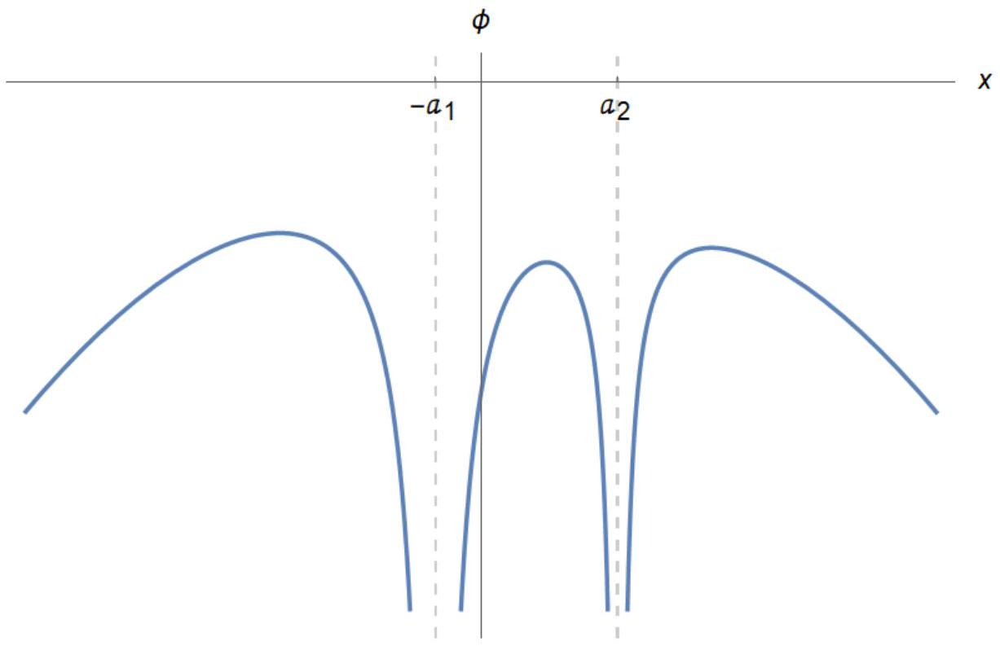

## A. A Binary System

A-1. Assume $a _ { 1 }$ and $a _ { 2 }$, are respectively, the distances of $M _ { 1 }$ and $M _ { 2 }$ from the center of mass:
$$
\left\{ \begin{array} { c }
M _ { 1 } a _ { 1 } = M _ { 2 } a _ { 2 } \\
a _ { 1 } + a _ { 2 } = a
\end{array} \rightarrow a _ { 1 } = \frac { M _ { 2 } } { M } a , a _ { 2 } = \frac { M _ { 1 } } { M } a : M = M _ { 1 } + M _ { 2 } \right.
$$
In the rotating coordinate system, a centrifugal potential has to be added to the gravitational potential of the two masses:
$$
\begin{gathered}
U = - \frac { 1 } { 2 } \omega ^ { 2 } r ^ { 2 } \quad \omega = \sqrt { \frac { G M } { a ^ { 3 } } } \\
\varphi ( x , y ) = - \frac { G M _ { 1 } } { \sqrt { \left( x + a _ { 1 } \right) ^ { 2 } + y ^ { 2 } } } - \frac { G M _ { 2 } } { \sqrt { \left( x - a _ { 2 } \right) ^ { 2 } + y ^ { 2 } } } - \frac { 1 } { 2 } \omega ^ { 2 } \left( x ^ { 2 } + y ^ { 2 } \right) \\
\varphi ( x , y ) = - \frac { G M _ { 1 } } { \sqrt { \left( x + \frac { M _ { 2 } } { M } a \right) ^ { 2 } + y ^ { 2 } } } - \frac { G M _ { 2 } } { \sqrt { \left( x - \frac { M _ { 1 } } { M } a \right) ^ { 2 } + y ^ { 2 } } } - \frac { 1 } { 2 } \frac { G M } { a ^ { 3 } } \left( x ^ { 2 } + y ^ { 2 } \right)
\end{gathered}
$$
A-1 (1.0 pt)
$$
\varphi ( x , y ) = - \frac { G M _ { 1 } } { \sqrt { \left( x + \frac { M _ { 2 } } { \left( M _ { 1 } + M _ { 2 } \right) } a \right) ^ { 2 } + y ^ { 2 } } } - \frac { G M _ { 2 } } { \sqrt { \left( x - \frac { M _ { 1 } } { \left( M _ { 1 } + M _ { 2 } \right) } a \right) ^ { 2 } + y ^ { 2 } } } - \frac { 1 } { 2 } \frac { G \left( M _ { 1 } + M _ { 2 } \right) } { a ^ { 3 } } \left( x ^ { 2 } + y ^ { 2 } \right)
$$
A-2. We set $y = 0$ in the previous equation, and obtain:
$$
\varphi ( x , 0 ) = - \frac { G M _ { 1 } } { \left| x + \frac { M _ { 2 } } { M } a \right| } - \frac { G M _ { 2 } } { \left| x - \frac { M _ { 1 } } { M } a \right| } - \frac { 1 } { 2 } \frac { G M } { a ^ { 3 } } x ^ { 2 }
$$
We draw the diagram noting that:
    1. The function has asymptotes at $x = - a _ { 1 }$ and $x = a _ { 2 }$, and it tends to $- \infty$ at both sides of these asymptotes.
    2. The function has three maxima which are called Lagrange points.
    3. The function goes to $- \infty$ for $x \rightarrow \pm \infty$

A-2 (0.7 pt)

A-3. Let $\bar { x } = x / a$, and denote the Lagrange point in the middle (between $\bar { x } = 0$ and $\bar { x } = 0.75$ ) by $\bar { x } _ { 0 }$ , we have $\frac { d \varphi } { d \bar { x } } \left( \bar { x } _ { 0 } \right) = 0$. Using the given ratios:

$$
\varphi ( \bar { x } , 0 ) = \frac { G M } { a } \left[ - \frac { \frac { 3 } { 4 } } { \left( \bar { x } + \frac { 1 } { 4 } \right) } + \frac { \frac { 1 } { 4 } } { \left( \bar { x } - \frac { 3 } { 4 } \right) } - \frac { 1 } { 2 } \bar { x } ^ { 2 } \right]
$$

Let $f ( \bar { x } ) = \frac { a } { G M } \frac { d \varphi } { d \bar { x } }$, then we have to solve for $f \left( \bar { x } _ { 0 } \right) = 0$. We have $f ( 0 ) > 0$ and $f ( 0.5 ) < 0$, so the answer lies between 0 and 0.5 . For the midpoint, we have $f \left( \bar { x } _ { 0 } = 0.25 \right) > 0$ so $0.25 < \bar { x } _ { 0 } <$ 0.5 , so by trial and error:

$$
\begin{gathered}
\left\{ \begin{array} { c }
f ( 0 ) > 0 \\
f ( 0.5 ) < 0
\end{array} \rightarrow f ( 0.25 ) > 0 \rightarrow 0.25 < \bar { x } _ { 0 } < 0.5 \rightarrow f ( 0.375 ) < 0 \rightarrow \cdots \rightarrow 0.358 < \bar { x } _ { 0 } < 0.361 \right. \\
\rightarrow f ( 0.360 ) > 0 \rightarrow 0.360 < \bar { x } _ { 0 } < 0.361 \rightarrow \frac { x _ { 0 } } { a } = \bar { x } _ { 0 } \approx 0.36
\end{gathered}
$$

So, up to two significant figures the answer is 0.36.

A-3 (0.5 pt)

$$
\frac { x _ { 0 } } { a } = 0.36
$$

A-4. The angular momentum of the system is:

$$
J = \mu a V = \mu a ^ { 2 } \omega = \frac { M _ { 1 } M _ { 2 } } { M } a ^ { 2 } \sqrt { \frac { G M } { a ^ { 3 } } } = \sqrt { \frac { G M _ { 1 } ^ { 2 } M _ { 2 } ^ { 2 } } { M } a } ,
$$

where $\mu$ is the reduced mass and $V$ is the relative velocity of the two point masses. Taking the logarithm of both sides we'll have:

$$
\ln J = \frac { 1 } { 2 } \left[ \ln \frac { G } { M } + 2 \ln M _ { 1 } + 2 \ln M _ { 2 } + \ln a \right]
$$

For slowly-varying quantities we'll obtain:

$$
\frac { \dot { J } } { J } = \frac { \dot { M } _ { 1 } } { M _ { 1 } } + \frac { \dot { M } _ { 2 } } { M _ { 2 } } + \frac { 1 } { 2 } \frac { \dot { a } } { a }
$$

because the total mass is a constant and $\dot { M } _ { 1 } + \dot { M } _ { 2 } = 0$; therefore:

$$
\frac { \dot { a } } { a } = - 2 \frac { \dot { M } _ { 1 } } { M _ { 1 } } \left( 1 - \frac { M _ { 1 } } { M _ { 2 } } \right) \quad \rightarrow \quad \dot { a } = - 2 \beta a \left( \frac { 1 } { M _ { 1 } } - \frac { 1 } { M _ { 2 } } \right)
$$

For the period we'll have:

$$
P = 2 \pi \sqrt { \frac { a ^ { 3 } } { G M } } \rightarrow \frac { \dot { P } } { P } = \frac { 3 } { 2 } \frac { \dot { a } } { a } = - 3 \frac { \dot { M } _ { 1 } } { M _ { 1 } } \left( 1 - \frac { M _ { 1 } } { M _ { 2 } } \right) \rightarrow \dot { P } = - 6 \pi \sqrt { \frac { a ^ { 3 } } { G M } } \beta \left( \frac { 1 } { M _ { 1 } } - \frac { 1 } { M _ { 2 } } \right)
$$

A-4 (0.6 pt)

$$
\begin{aligned}
& \dot { a } = - 2 \beta a \left( \frac { 1 } { M _ { 1 } } - \frac { 1 } { M _ { 2 } } \right) \\
& \dot { P } = - 6 \pi \sqrt { \frac { a ^ { 3 } } { G M } } \beta \left( \frac { 1 } { M _ { 1 } } - \frac { 1 } { M _ { 2 } } \right)
\end{aligned}
$$

A-5. In an infinitesimally thin ring with an inner radius of $r$ and an outer radius $r + d r$, energy is leaving at a rate of $- \frac { G M _ { 1 } \beta } { 2 r }$ and entering at a rate $- \frac { G M _ { 1 } \beta } { 2 r } + \frac { G M _ { 1 } \beta } { 2 r ^ { 2 } } d r$. For the ring to stay in equilibrium, the excess energy of $\frac { G M _ { 1 } \beta } { 2 r } d r$ per unit time must leave the system as radiation, so:

$$
d P = \frac { G M _ { 1 } \beta } { 2 r ^ { 2 } } d r = \sigma T ^ { 4 } 2 ( 2 \pi r d r ) = 4 \pi \sigma T ^ { 4 } d r \rightarrow T = \left( \frac { G M _ { 1 } \beta } { 8 \pi \sigma r ^ { 3 } } \right) ^ { \frac { 1 } { 4 } }
$$

A-5 (1.0 pt)

$$
T = \left( \frac { G M _ { 1 } \beta } { 8 \pi \sigma r ^ { 3 } } \right) ^ { \frac { 1 } { 4 } }
$$

A-6. From $P = 2 \pi \sqrt { \frac { a ^ { 3 } } { G M } }$ we'll have:

$$
a = \left[ \frac { P ^ { 2 } G \left( M _ { \mathrm { S } } + M _ { \mathrm { NS } } \right) } { 4 \pi ^ { 2 } } \right] ^ { \frac { 1 } { 3 } }
$$

Using the result of Part A.5, the temperature is:

$$
\mathrm { T } = \left( \frac { G M _ { \mathrm { NS } } \beta } { 8 \pi \sigma r ^ { 3 } } \right) ^ { \frac { 1 } { 4 } } = \left( \frac { 500 \pi M _ { \mathrm { NS } } \beta } { \sigma P ^ { 2 } \left( M _ { \mathrm { S } } + M _ { \mathrm { NS } } \right) } \right) ^ { \frac { 1 } { 4 } } = 9 \times 10 ^ { 3 } K
$$

A-6 (0.5 pt)

$$
T = 9 \times 10 ^ { 3 } \mathrm {~K}
$$

A.7. For the system to remain bounded, the total mechanical energy of the system must be negative:

$$
E ^ { \prime } = \frac { 1 } { 2 } \mu ^ { \prime } v ^ { \prime 2 } - \frac { G M _ { 1 } ^ { \prime } M _ { 2 } } { a } < 0 \rightarrow v ^ { \prime } < \sqrt { \frac { 2 G \left( M _ { 1 } ^ { \prime } + M _ { 2 } \right) } { a } }
$$

For an isotropic explosion, we would have $v ^ { \prime } = v = \sqrt { \frac { G M } { a } }$ therefore:

$$
\sqrt { \frac { G \left( M _ { 1 } + M _ { 2 } \right) } { a } } < \sqrt { \frac { 2 G \left( M _ { 1 } ^ { \prime } + M _ { 2 } \right) } { a } }
$$

and:

$$
\frac { M _ { 1 } - M _ { 2 } } { 2 } < M _ { 1 } ^ { \prime }
$$

A-7 (0.7 pt)

$$
\begin{aligned}
& v _ { \max } ^ { \prime } = \sqrt { \frac { 2 G \left( M _ { 1 } ^ { \prime } + M _ { 2 } \right) } { a } } \\
& M _ { 1 \min } ^ { \prime } = \frac { M _ { 1 } - M _ { 2 } } { 2 }
\end{aligned}
$$

## B. Analysis of the stability of a star

B-1. Using Newton's law of gravity:

$$
g = - \frac { 4 \pi G \int _ { 0 } ^ { r } r ^ { \prime 2 } \rho d r ^ { \prime } } { r ^ { 2 } } \stackrel { \rho \cong \rho _ { c } } { \cong } - \frac { 4 \pi G \rho _ { c } r } { 3 }
$$

B-1 (0.2 pt)

$$
g = - \frac { 4 \pi G \rho _ { \mathrm { c } } r } { 3 }
$$

B-2. Balance of forces for a differential element of volume with a surface area of $A$ and thickness $\Delta r$ between radii $r$ and $r + \Delta r$ is as follows:

$$
\vec { F } = - \frac { G M ( \vec { r } ) \rho } { r ^ { 2 } } \mathrm {~A} \Delta r - \Delta p A = 0
$$

in which $M ( r )$ is the mass of the part of the star confined within the radius $r$. As $\Delta r$ is small, we can write:

$$
\frac { G \rho } { r ^ { 2 } } \left( \int 4 \pi r ^ { \prime 2 } \rho \left( r ^ { \prime } \right) d r ^ { \prime } \right) = - \frac { d p ( r ) } { d r } = - K \gamma \rho ^ { \gamma - 1 } \frac { d \rho } { d r }
$$

Multiplying both sides of the equation by $\frac { r ^ { 2 } } { 4 \pi G \rho }$ and taking the derivative once again, we get:

$$
\frac { d } { d r } \left[ r ^ { 2 } \rho ^ { \gamma - 2 } \frac { d \rho } { d r } \right] + \frac { 4 \pi G r ^ { 2 } } { K \gamma } \rho ( r ) = 0
$$

B-2 (0.6 pt)

$$
\begin{aligned}
& h _ { 1 } ( \rho , r ) = r ^ { 2 } \rho ^ { \gamma - 2 } \\
& h _ { 2 } ( r ) = \frac { 4 \pi G r ^ { 2 } } { K \gamma }
\end{aligned}
$$

B-3.

$$
\begin{aligned}
& { \left[ \rho _ { \mathrm { c } } \right] = M L ^ { - 3 } , \quad \left[ p _ { \mathrm { c } } \right] = M L ^ { - 1 } T ^ { - 2 } , \quad [ G ] = M ^ { - 1 } L ^ { 3 } T ^ { - 2 } } \\
& { \left[ G ^ { l } p _ { \mathrm { c } } ^ { m } \rho _ { \mathrm { c } } ^ { n } \right] = \left( M ^ { - 1 } L ^ { 3 } T ^ { - 2 } \right) ^ { l } \left( M L ^ { - 1 } T ^ { - 2 } \right) ^ { m } \left( M L ^ { - 3 } \right) ^ { n } = L } \\
& \left\{ \begin{array} { c }
{ - l + n + m = 0 } \\
{ 3 l - 3 n - m = 1 } \\
{ - 2 l - 2 m = 0 }
\end{array} \rightarrow \left\{ \begin{array} { c }
l = - \frac { 1 } { 2 } \\
m = \frac { 1 } { 2 } \\
n = - 1
\end{array} \rightarrow r _ { 0 } = G ^ { - \frac { 1 } { 2 } } p _ { \mathrm { c } } ^ { \frac { 1 } { 2 } } \rho _ { \mathrm { c } } ^ { - 1 } \right. \right.
\end{aligned}
$$

B-3 (0.4 pt)

$$
r _ { 0 } = G ^ { - \frac { 1 } { 2 } } p _ { \mathrm { c } } ^ { \frac { 1 } { 2 } } \rho _ { \mathrm { c } } ^ { - 1 }
$$

B-4.

$$
\begin{gathered}
\frac { K \gamma \rho _ { c } ^ { \gamma - 1 } } { 4 \pi G r _ { 0 } ^ { 2 } x ^ { 2 } } \frac { d } { d x } \left[ x ^ { 2 } u ^ { \gamma - 2 } \frac { d u } { d x } \right] = - \rho _ { \mathrm { c } } u ( r ) \\
\frac { K \gamma \rho _ { \mathrm { c } } ^ { \gamma - 2 } } { 4 \pi G r _ { 0 } ^ { 2 } x ^ { 2 } } \frac { d } { d x } \left[ x ^ { 2 } u ^ { \gamma - 2 } \frac { d u } { d x } \right] = \frac { \gamma } { 4 \pi x ^ { 2 } } \frac { d } { d x } \left[ x ^ { 2 } u ^ { \gamma - 2 } \frac { d u } { d x } \right] = - u \\
\frac { d } { d x } \left[ x ^ { 2 } u ^ { \gamma - 2 } \frac { d u } { d x } \right] + \frac { 4 \pi x ^ { 2 } } { \gamma } u = 0
\end{gathered}
$$

B-4 (0.3 pt)

$$
\begin{aligned}
& A _ { 1 } ( u , x ) = x ^ { 2 } u ^ { \gamma - 2 } \\
& A _ { 2 } ( x ) = \frac { 4 \pi x ^ { 2 } } { \gamma }
\end{aligned}
$$

B-5.

$$
\gamma = 2 \rightarrow \frac { d } { d x } \left[ x ^ { 2 } \frac { d u } { d x } \right] = - 2 \pi x ^ { 2 } u ( x ) \rightarrow f ^ { \prime \prime } ( x ) = - 2 \pi f ( x ) \rightarrow f ( x ) = \frac { \sin ( \sqrt { 2 \pi } x ) } { \sqrt { 2 \pi } }
$$

B-5 (0.6 pt)

$$
f ( x ) = \frac { \sin ( \sqrt { 2 \pi } x ) } { \sqrt { 2 \pi } }
$$

B.6.

$$
\begin{gathered}
\frac { d ^ { 2 } u } { d x ^ { 2 } } + \frac { ( \gamma - 2 ) } { u } \left( \frac { d u } { d x } \right) ^ { 2 } + \frac { 2 } { x } \left( \frac { d u } { d x } \right) + \frac { 4 \pi } { \gamma } u ^ { 3 - \gamma } = 0 \\
u ^ { \prime } ( 0 ) = 0 , \quad \lim _ { x \rightarrow 0 } \frac { u ^ { \prime } ( x ) } { x } = u ^ { \prime \prime } ( 0 ) \\
u ^ { \prime \prime } ( 0 ) + 2 u ^ { \prime \prime } ( 0 ) + \frac { 4 \pi } { \gamma } = 0 \rightarrow \quad \gamma = - \frac { 4 \pi } { 3 u ^ { \prime \prime } ( 0 ) } \\
\gamma \sim [ 1.64,1.70 ]
\end{gathered}
$$

B-6 (0.8 pt)

$$
\gamma = [ 1.64,1.70 ]
$$

B.7.

$$
\begin{gathered}
M ( r ) = \int _ { 0 } ^ { \tilde { r } ( r , t ) } 4 \pi r ^ { \prime 2 } \tilde { \rho } \left( r ^ { \prime } , t \right) d r ^ { \prime } = \int _ { 0 } ^ { r } 4 \pi r ^ { \prime 2 } \rho \left( r ^ { \prime } \right) d r ^ { \prime } \\
4 \pi r ^ { 2 } \rho ( r ) = 4 \pi \tilde { r } ^ { 2 } \tilde { \rho } ( \tilde { r } , t ) \frac { \partial \tilde { r } } { \partial r } \rightarrow \frac { \tilde { \rho } } { \rho } = \frac { r ^ { 2 } } { \tilde { r } ^ { 2 } } \left( \frac { \partial \tilde { r } } { \partial r } \right) ^ { - 1 } = ( 1 + \epsilon ) ^ { - 3 } \cong 1 - 3 \epsilon \\
\frac { \tilde { g } } { g } = \frac { \frac { G M } { \tilde { r } ^ { 2 } } } { \frac { G M } { r ^ { 2 } } } = \frac { \frac { 1 } { \tilde { r } ^ { 2 } } } { \frac { 1 } { r ^ { 2 } } } = ( 1 + \epsilon ) ^ { - 2 } \cong 1 - 2 \epsilon
\end{gathered}
$$

B-7 (0.9 pt)

$$
\begin{aligned}
& \tilde { g } \simeq g ( 1 - 2 \epsilon ) \\
& \tilde { \rho } \simeq \rho ( 1 - 3 \epsilon )
\end{aligned}
$$

B-8. we have

$$
\frac { \partial \tilde { p } } { \partial \tilde { r } } = \tilde { \rho } ( \tilde { g } - \ddot { \tilde { r } } )
$$

And

$$
\tilde { p } = K \tilde { \rho } ^ { \gamma }
$$

So:

$$
\ddot { \tilde { r } } = \tilde { g } - \frac { \left( \frac { \partial \tilde { p } } { \partial \tilde { r } } \right) } { \tilde { \rho } } = \tilde { g } - K \gamma \tilde { \rho } ^ { \gamma - 2 } \frac { \partial \tilde { \rho } } { \partial \tilde { r } }
$$

B-8 (0.6 pt)

$$
\frac { d ^ { 2 } \tilde { r } } { d t ^ { 2 } } = \tilde { g } - K \gamma \tilde { \rho } ^ { \gamma - 2 } \frac { \partial \tilde { \rho } } { \partial \tilde { r } }
$$

B.9. Using of the results in B. 7 and B.8, we have:

$$
\begin{gathered}
\frac { d ^ { 2 } \tilde { r } } { d t ^ { 2 } } = \ddot { \tilde { r } } = \tilde { g } - K \gamma \tilde { \rho } ^ { \gamma - 2 } \frac { \partial \tilde { \rho } } { \partial \tilde { r } } = g ( 1 - 2 \epsilon ) - K \gamma \rho ^ { \gamma - 2 } \frac { \partial \rho } { \partial r } \left( \frac { ( 1 - 3 \epsilon ) ^ { \gamma - 1 } } { ( 1 + \epsilon ) } \right) \\
= g ( 1 - 2 \epsilon ) - K \gamma \rho ^ { \gamma - 2 } \frac { \partial \rho } { \partial r } ( 1 - 3 ( \gamma - 1 ) \epsilon - \epsilon )
\end{gathered}
$$

Equilibrium requires:

$$
g - K \gamma \rho ^ { \gamma - 2 } \frac { \partial \rho } { \partial r } = 0 \Rightarrow K \gamma \rho ^ { \gamma - 2 } \frac { \partial \rho } { \partial r } = g
$$

therefore:

$$
\ddot { \tilde { r } } = r \ddot { \epsilon } = g ( 1 - 2 \epsilon ) - g ( 1 - 3 ( \gamma - 1 ) \epsilon - \epsilon ) = g ( 3 \gamma - 4 ) \epsilon
$$

and:

$$
\begin{gathered}
\ddot { \epsilon } = \frac { g } { r } ( 3 \gamma - 4 ) \epsilon \\
\ddot { \epsilon } = - \frac { 4 \pi G \rho _ { \mathrm { c } } } { 3 } ( 3 \gamma - 4 ) \epsilon
\end{gathered}
$$

Stability requires that:

$$
3 \gamma - 4 > 0 \Rightarrow \gamma > \frac { 4 } { 3 }
$$

and the angular velocity of the oscillations will be:

$$
\omega = \sqrt { \frac { 4 \pi G \rho _ { \mathrm { c } } } { 3 } ( 3 \gamma - 4 ) }
$$

B-9 (0.6 pt)

$$
\begin{aligned}
& \ddot { \epsilon } = - \frac { 4 \pi G \rho _ { \mathrm { c } } } { 3 } ( 3 \gamma - 4 ) \epsilon \\
& \gamma _ { \min } = \frac { 4 } { 3 } \\
& \omega = \sqrt { \frac { 4 \pi G \rho _ { \mathrm { c } } } { 3 } ( 3 \gamma - 4 ) }
\end{aligned}
$$
