## Earth's magnetic field measurement (10 points)

## Introduction

This problem aims to measure the horizontal component of the Earth's magnetic field. A magnet will first be characterized using a so called Gouy balance, before being used to measure this magnetic field.

In the entire problem, uncertainties are expected to be determined only from the fits and not from the individual experimental points.

Equipment list

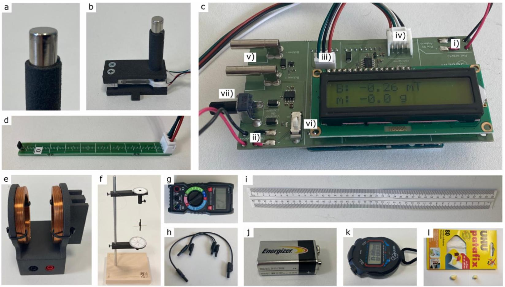
Fig. 1. Photographs of all equipment.

The list of equipment is given below and illustrated in Fig. 1. The number of items is indicated between [] when it is greater than one. Students should ask for help if something appears not to be working.

- (a) Magnets [3]. One magnet is attached to the force sensor (b) and should not be removed. Another magnet is inserted into the pod (f) and should not be removed until specified. The last one will be used in A.5. All magnets are supposed identical.
- (b) Force sensor. Connected to the Arduino (c), this sensor measures the force along its axis, noted $m _ { \mathrm { f } }$, in grams-force ("g"), which is the force experienced by a 1-gram mass on the earth's surface in the gravity field $\left( g _ { 0 } = 9.81 \mathrm {~m} \cdot \mathrm {~s} ^ { - 2 } \right)$. One of the magnets (a) is attached to it. Each time it is switched back on, the sensor display is reset to 0, regardless of the situation. This sensor must not be subjected to forces in excess of 200 grams. It needs to be unpacked carefully.
- (c) Arduino with digital display. This element is used to power the coils (e) and to perform force and magnetic field measurements, displayed directly in gram-force ("g") and mT. The battery (j) powering the Arduino must be connected to slot (i), and the battery (j) powering the coils (e) to slot (ii) (pay attention to connection polarity). The force sensor (b) and magnetic field sensor (d) should be connected to slots (iv) and (iii) respectively, and the coil power cables to slots (v). A switch (vi) closes the coil supply circuit (indicated by an LED), whose electric current can be controlled in (vii).

- (d) Magnetic field sensor with ruler. Connected to the Arduino (c), this probe measures the field $B _ { z }$ along the direction $\overrightarrow { e _ { z } }$ of the ruler, in mT.
- (e) Coils in anti-Helmholtz configuration (wound in opposite directions). These coils must be connected in series with the ammeter (g) and to the Arduino (c) to create a magnetic field.
- (f) Metallic stand on a wooden base, with suspended pod where a magnet (a) is initially inserted, and with angle markers. The detailed assembly of this device is explained below.
- (g) Multimeter. Only used as an ammeter at the 10 A range. If left inactive, the multimeter switches off, and must be switched back on by returning it to the "OFF" position. Do not use the two cables supplied in the multimeter case.
- (h) Electric wires [3].
- (i) 40 cm ruler.
- (j) 9 V batteries [3]. Their capacity is of the order of 300 mA ⋅ h.
- (k) Chronometer.
- (l) Adhesive paste. Can be used for the entire problem.

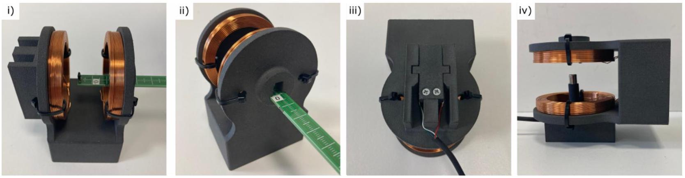
Fig. 2. Use of sensors inside the anti-Helmholtz coils.

Use of sensors interfaced with the Arduino (Fig. 2)
The magnetic field sensor (d) can slide in the coils (e) as shown in (i), while measuring the field on their axis. The $z = 0$ position for the sensor is shown in (ii), and $z$ increases as it moves inside the coils.

The force sensor (b) is inserted into the coils as shown in (iii), before turning the coil as in (iv) so that the transducer is vertical. To do this, be sure to route the electrical wires through the gutters provided.

Installation of equipment (f) (Fig. 3), to be mounted only before starting part B, with a 34 cm wire

- Insert the metal post (f0a) into the wooden plate with plastic feet (f0b) to form the stand (f0).
- The part (f1) is located on the lower part and marks the angle of the pod. Install the arm (f1b) on the metal post by means of a screw (f4), then fix the part (f1a) on it with a second screw (f4).
- The part (f2) is located on the upper part and hold the wire supporting the pod. Install the arm (f2b) on the metal post by means of a screw (f4), then insert the part (f2a) on it.
- To build the pod (f3), insert the inertia bar (f3b) and a toothpick (f3c) into the carrier part (f3a) on which a magnet (a) is already inserted. Insert the wire supporting the pod into the part (f2a), and secure it with a screw (f4). Turning part (f2a) changes the angle at which the wire is attached. The toothpick allows to precisely measure the angular position of the pod.

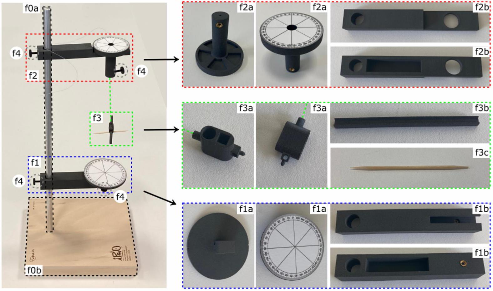
Fig. 3. Installation of the pod on the metallic stand. Parts (f1a), (f1b), (f2a), (f2b), and (f3a) are shown from two different angles. There are four identical (f4) plastic screws.

SOLUTION:
Please note that the numerical results given in the solution come from a single, consistent measurement session. The measurement ranges used in the notation take into account several measurements by various testers.

Marking scheme: students are not penalized for forcing a linear fit to pass through the origin when the studied law is proportional.

Part A. Gouy balance and magnetic moment
Modeling
We assume that a magnet can be treated as a magnetic dipole of magnetic moment $\vec { m } _ { \mathrm { m } }$. The force experienced by such a dipole of magnetic moment $\vec { m } _ { \mathrm { m } } = m _ { \mathrm { m } } \vec { e } _ { z }$ in a magnetic field $\vec { B } = B ( z ) \overrightarrow { e _ { z } }$ is

$$
\begin{equation*}
\vec { F } ( z ) = m _ { \mathrm { m } } \frac { d B ( z ) } { d z } \overrightarrow { e _ { z } } . \tag{1}
\end{equation*}
$$

When an electric current $i$ flows through the anti-Helmholtz coils, the field $\vec { B }$ along the unit vector $\vec { e } _ { z }$ of revolution axis is

$$
\begin{equation*}
\vec { B } ( z ) = \alpha i \left( z - z _ { 0 } \right) \overrightarrow { e _ { z } } . \tag{2}
\end{equation*}
$$

This equation is only valid near the center of the device, denoted by $z = z _ { 0 }$.
Magnetic field in the coils

A. 1 Estimate numerically the typical operating time $\tau$ of one of the batteries used 0.2pt in the experiment, with an electric current of the order of 2A.

SOLUTION:
The 9 V battery capacity is $Q = I \cdot \Delta t = 300 \mathrm {~mA} \cdot \mathrm {~h}$. Using an electric current $I = 2 \mathrm {~A}$, the time of use is $0.3 \times 3600 / 2 \approx 540 \mathrm {~s} \approx 9 \mathrm {~min}$.

| A.1.1. One value in the intervalle $6 \leq \tau \leq 12 \mathrm {~min}$ or $( 360 \leq \tau \leq 720 \mathrm {~s} )$. | 0.2 |
| :--- | :--- |

This result must be taken into account when developing the protocols later on, knowing that the coils are only used in part A. Note that a spare battery is available if required.

Insert the magnetic field sensor into the coils, as shown in Fig 2. See also this figure for the identification of the sensor position in the coils.

A. 2 At a fixed electric current $i _ { 0 } \simeq 1.0 \mathrm {~A}$, measure and plot the magnetic field $B _ { z }$ as 0.8pt a function of the position $z$ of the sensor on the axis of the coils. Identify the largest region $\left[ z _ { \text {min } } , z _ { \text {max } } \right]$ where the magnetic field is experimentally linear with respect to position.

SOLUTION:
The plot below is obtained at $i _ { 0 } = 1.0 \mathrm {~A}$. At the centre of the device is a zone in which the field is a linear function of position. At the edges of the device, you can see the saturation of the classical field as you approach the two coils. The zone of linearity from the figure is $[ 0.015 ; 0.032 ] \mathrm { m }$.
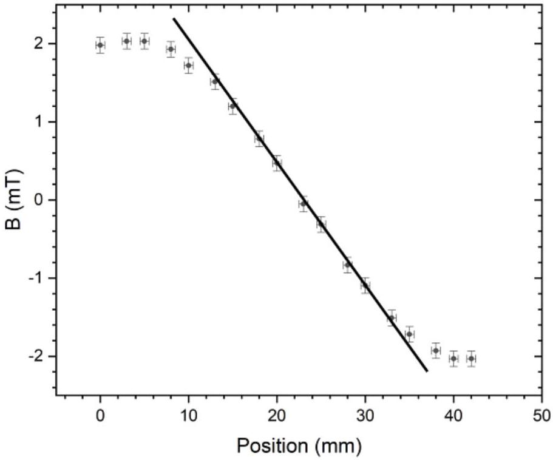

| A.2.1: Measure 6 points or more. B in [-12 ; 12] mT and z in [0 ; 60] mm. | 0.1 |
| :--- | :--- |
| A.2.2: Measure 8 points or more. B in [-12 ; 12] mT and z in [0; 60] mm. | 0.1 |
| A.2.3: Plot (axes, units). | 0.1 |
| A.2.4: Experimental plot showing linearity with correct sampling. At least 5 points. | 0.1 |
| A.2.5: Experimental plot showing deviation from linearity on the left side in [12; 18]mm. | 0.1 |
| A.2.6: Experimental plot showing deviation from linearity on the right side in [29; 35]mm. | 0.1 |
| A.2.7: $z _ { \text {min } }$ in [12 ; 18] mm. | 0.1 |
| A.2.8. $z _ { \text {max } }$ in $[ 29 ; 35 ] \mathrm { mm }$. | 0.1 |

A. 3 By placing the sensor at two positions $\left( z _ { 1 } , z _ { 2 } \right)$ in this region of linear dependency, 0.9pt draw a curve to verify the electric current dependency of $\vec { B }$ given by equation (2), and determine the value of $\alpha$, with its uncertainty.

SOLUTION:
The centre of the linear zone is around 23 mm. The values of the magnetic field at two positions $z _ { 1 } = 13 \mathrm {~mm}$ and $z _ { 2 } = 33 \mathrm {~mm}$ are measured for several electric current values. This allows to compute the gradient $\frac { B \left( z _ { 2 } \right) - B \left( z _ { 1 } \right) } { z _ { 2 } - z _ { 1 } }$ of the magnetic field as a function of electric current.
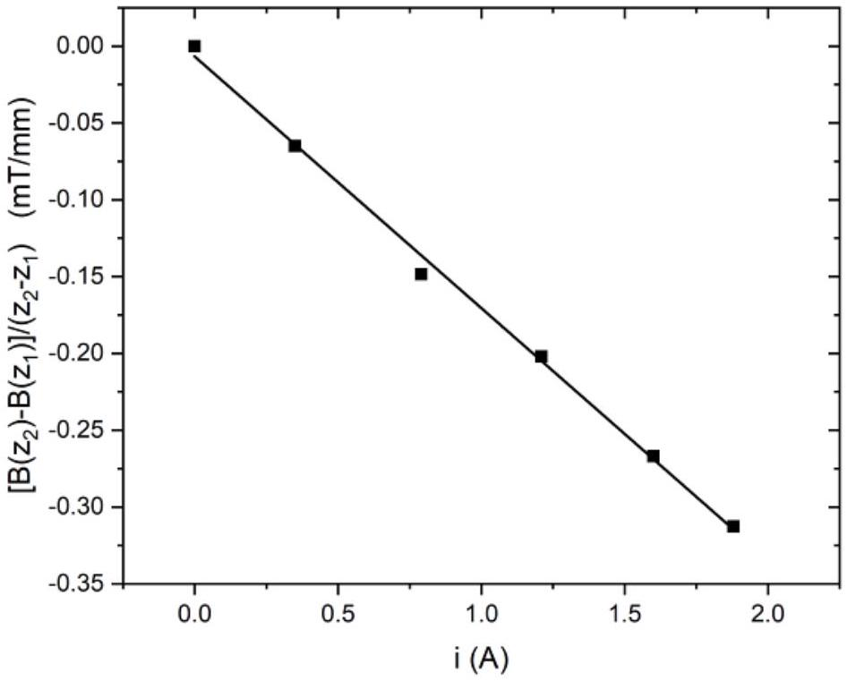
We have a linear evolution. The possible residual y-intercept may be due to the fact that the sensor is not correctly calibrated. A typical value for the slope gives $\alpha = 0.150 \pm 0.007 \mathrm {~T} \cdot \mathrm {~m} ^ { - 1 } \cdot \mathrm {~A} ^ { - 1 }$.

| A.3.1: 3 measures or more of $B$ at 2 positions (total 6). B in $[ - 25 ; 25 ] \mathrm { mT }$ and I in $[ - 3 ; 3 ] \mathrm { A }$. | 0.1 |
| :--- | :--- |
| A.3.2: 5 measures or more of $B$ at 2 positions (total 10). B in $[ - 25 ; 25 ] \mathrm { mT }$ and I in $[ - 3 ; 3 ] \mathrm { A }$. | 0.1 |
| A.3.3: Plot (axes, units). | 0.1 |
| A.3.4: Identification and calculation of the relevant slope quantity. Either $B ( z ) / \left( z - z _ { 0 } \right)$ or $\left( B \left( z _ { 2 } \right) - B \left( z _ { 1 } \right) \right) / \left( z _ { 2 } - z _ { 1 } \right)$, or these quantities divided by $i$. | 0.1 |
| A.3.5: Experimental plot showing linearity with correct sampling. | 0.1 |
| A.3.6: $\alpha$ value (with units) in [0.11; 0.19] T/m/A, | 0.1 |
| A.3.7. $\alpha$ value (with units) in [0.13 ; 0.17] T/m/A. | 0,1 |
| A.3.8. $\delta \alpha$ value (with units) in $[ 0.001 ; 0.02 ] \mathrm { T } / \mathrm { m } / \mathrm { A }$. | 0.1 |
| A.3.9. $\delta \alpha$ value (with units) in $[ 0.003 ; 0.01 ] \mathrm { T } / \mathrm { m } / \mathrm { A }$, | 0,1 |

Gouy balance
Remove the magnetic field sensor from the coils, and carefully place the force sensor inside, as described in Fig. 2, with particular attention to the placement of electrical wires in the gutters.

A. 4 Perform experimental measurements of the gram-force $m _ { \mathrm { f } }$ as a function of current $i$. Draw an appropriate plot to determine the value of the magnetic moment $m _ { \mathrm { m } }$ of the magnet, with its uncertainty.

0.8pt

SOLUTION:
We vary the electric current $i$ and measure the effective mass, which gives
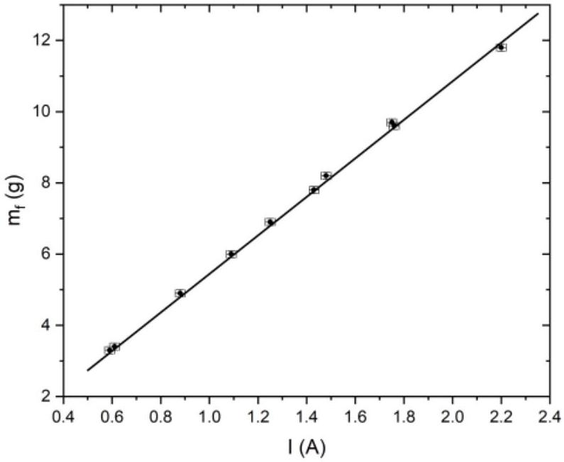
The slope of the curve is 5.48 gram-force/A, giving a slope of $( 53.7 \pm 0.8 ) \times 10 ^ { - 3 } \mathrm {~N} / \mathrm { A }$. Finally, the magnetic moment is $m _ { m } = \frac { 53.7 \times 10 ^ { - 3 } } { 0.150 } = 0.358 \mathrm {~A} \cdot \mathrm {~m} ^ { 2 }$. The uncertainty is obtained from $\frac { \delta m } { m } = \frac { \delta p } { p } + \frac { \delta \alpha } { \alpha } = 0.05$.
The magnetic moment $m _ { m } = 0.36 \pm 0.02 \mathrm {~A} \cdot \mathrm {~m} ^ { 2 }$.

| A.4.1: 6 measures or more. $m _ { f }$ in [-20 ; 20] g and I in [-3 ; 3] A. | 0.1 |
| :--- | :--- |
| A.4.2: 8 measures or more. $m _ { f }$ in [-20 ; 20] g and I in [-3 ; 3] A. | 0.1 |
| A.4.3: Plot (axes, units). | 0.1 |
| A.4.4: Experimental plot showing linearity with correct sampling. | 0.1 |
| A.4.5: $m _ { m }$ value (with units) in $[ 0.25 ; 0.45 ]$ A.m ${ } ^ { 2 }$. | 0.1 |
| A.4.6: $m _ { m }$ value (with units) in $[ 0.30 ; 0.40 ]$ A.m ${ } ^ { 2 }$ | 0.1 |
| A.4.7. $\delta m _ { m }$ value (with units) in $[ 0.003,0.07 ] \mathrm { A } . m ^ { 2 }$. | 0.1 |
| A.4.8 $\delta m$ value (with units) in $[ 0.01,0.03 ] \mathrm { A } . \mathrm { m } ^ { 2 }$. | 0.1 |

Measurements of force in newton (N) are accepted.
Alternative measurement of the magnetic moment
In the dipolar approximation, the magnetic field of a magnet of magnetic moment $m _ { \mathrm { m } }$ on its revolution axis $z$ is

$$
\begin{equation*}
B _ { z } ( z ) = \frac { \mu _ { 0 } m _ { \mathrm { m } } } { 2 \pi \left( z - z _ { \mathrm { a } } \right) ^ { 3 } } , \tag{3}
\end{equation*}
$$

where $z _ { \mathrm { a } }$ is not necessarily the geometric center of the magnet, and where $\mu _ { 0 } = 4 \pi 10 ^ { - 7 } \mathrm { H } \cdot \mathrm { m } ^ { - 1 }$.

A. 5 Measure the magnetic field $B _ { z }$ along the revolution axis of the free magnet, as a function of distance $z$. Draw a curve to verify the model given Eq. (3), showing its experimental deviations. Deduce a new value for $m _ { \mathrm { m } }$, with uncertainty.

SOLUTION:
The field B is measured directly by sticking the third magnet on the graduated ruler. You can also use the Hall sensor directly. The measurements are shown below, where the position is plotted as a function of $B ^ { - 1 / 3 }$ (see figure below).

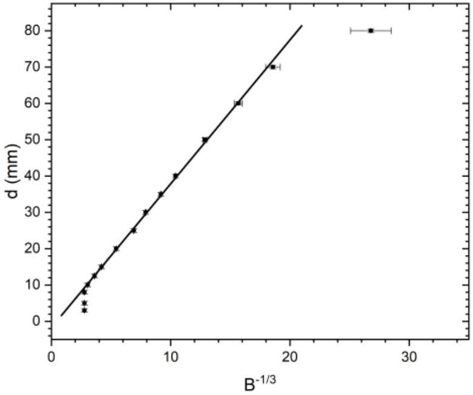
The slope is $\left( \frac { \mu _ { 0 } m _ { m } } { 2 \pi } \right) ^ { 1 / 3 } = ( 4,1 \pm 0.1 ) \times 10 ^ { - 3 } \mathrm {~m} \cdot \mathrm {~T} ^ { 1 / 3 }$, and then the new value of the magnetic moment is $m _ { m } = 0,31 \pm 0.01 \mathrm {~A} \cdot \mathrm {~m} ^ { 2 }$.

| A.5.1: 6 measures or more. B in [-100; 100] mT and din [0; 40] cm. | 0.1 |
| :--- | :--- |
| A.5.2: 8 measures or more. B in [-100; 100] mT and d in [0;40] cm. | 0.1 |
| A.5.3: Plot (axes, units). | 0.1 |
| A.5.4: Identification and calculation of the relevant quantity. Either $z = f \left( B ^ { - 1 / 3 } \right)$ or related quantity. | 0.2 |
| A.5.5: Identification of the valid region, out of near field (small $z$ ). | 0.1 |
| A.5.6. Identification of the valid region : not limited by digital quantification (high $z$ ). | 0.1 |
| A.5.7: Experimental plot showing linearity with correct sampling. | 0.2 |
| A.5.8: $m _ { m }$ value (with units) in $[ 0.25 ; 0.45 ]$ A.m ${ } ^ { 2 }$. | 0.1 |
| A.5.9: $m _ { m }$ value (with units) in $[ 0.30 ; 0.40 ]$ A.m ${ } ^ { 2 }$. | 0.1 |
| A.5.10: $\delta m _ { m }$ value (with units) in $[ 0.001,0.05 ]$ A.m ${ } ^ { 2 }$ | 0.1 |
| A.5.11: $\delta m _ { m }$ value (with units) in $[ 0.005,0.02 ] \mathrm { A } . \mathrm { m } ^ { 2 }$. | 0.1 |

A. 6 Given the two results obtained in A. 4 and A.5, propose a final experimental value 0.2pt of $m _ { \mathrm { m } }$ with its uncertainty.

SOLUTION:
The final value is given by the averaged value of the previous measurements, so $m _ { m } = 0,33 \pm 0,01 \mathrm {~A} \cdot \mathrm {~m} ^ { 2 }$.

| A.6.1 $m _ { m }$ value (with units) in $[ 0.30 ; 0.40 ]$ A.m ${ } ^ { 2 }$. | 0.1 |
| :--- | :--- |
| A.6.2 $\delta m _ { m }$ value (with units) in $[ 0.005,0.03 ]$ A.m ${ } ^ { 2 }$. | 0.1 |

## Part B. Determining the earth's magnetic field

Modeling
We now study the oscillating motion of the magnet in a horizontal plane to estimate the value of the horizontal component $B _ { \mathrm { e } }$ of the Earth's magnetic field, see Fig. 3 and the assembly instructions above Fig.3. The pod (f3), containing the magnet, is subjected to two torques around the vertical axis:

- the torque of the wire, modeled as $\Gamma _ { \mathrm { f } } = - \frac { C _ { \mathrm { f } } } { L } \left( \theta - \theta _ { 0 } \right)$, where $C _ { \mathrm { f } }$ is a constant and $L$ the total length between the two attachments of the wire, and $\theta _ { 0 }$ corresponds to the angle for which the wire is not twisted,
- the torque of the Earth's magnetic fields, given by $\Gamma _ { \mathrm { e } } = - m _ { \mathrm { m } } B _ { \mathrm { e } } \sin \left( \theta - \theta _ { \mathrm { e } } \right)$, when the angular position of the Earth's magnetic field is given by the angle $\theta _ { \mathrm { e } }$.

Denoting $J$ the unknown moment of inertia of the pod and magnet assembly around the vertical axis, the angular momentum theorem gives

$$
\begin{equation*}
J \frac { \mathrm {~d} ^ { 2 } \theta } { \mathrm {~d} t ^ { 2 } } = \Gamma _ { f } + \Gamma _ { e } = - \frac { C _ { \mathrm { f } } } { L } \left( \theta - \theta _ { 0 } \right) - m _ { \mathrm { m } } B _ { \mathrm { e } } \sin \left( \theta - \theta _ { \mathrm { e } } \right) . \tag{4}
\end{equation*}
$$

When the $\sin \left( \theta - \theta _ { \mathrm { e } } \right) \simeq \theta - \theta _ { \mathrm { e } }$ approximation is valid, this leads to an sinusoidal oscillation at a period $T$. For this part, adhesive past (I) is moldable into any shape or size and attachable to other devices.

Caution: To avoid disturbance from external magnetic fields, the magnet must be placed at least 20 cm away from any metal object or magnetic source (including the other magnets).

Experimental set-up and first measurement
For questions B. 1 to B.5, set the length of the wire to $L = 34 \mathrm {~cm}$ and make sure that it is not twisted. In this setting, we begin by assuming that the torque from the wire is negligible with respect to the torque from the Earth's magnetic field, a hypothesis to which we will return later.

To align $\theta _ { 0 }$ with $\theta _ { \mathrm { e } }$, use piece (f2a) to adjust $\theta _ { 0 }$ so the pod (f3) does not rotate when the magnet is removed. Then reinsert the magnet in the pod, and keep $\theta _ { 0 }$ unchanged until question B.5.

B. 1 Propose an experimental protocol to determine $B _ { \mathrm { e } }$. Introduce the different quantities you will measure and their units. Depict these quantities on a detailed schematic, and relate them to those given in the instructions through an equation. For each quantity, specify whether it is fixed (F) or varies (V) throughout the protocol.

SOLUTION:
The figure below describes the proposed experiment. The period $T$ for small oscillations is measured (with best precision using several periods). Since the inertial moment $J _ { 0 }$ of the pod is unknown, adding sticky paste to both ends of the pod allows the change of the inertial moment $J = J _ { 0 } + \Delta J$. The length of the pod arm is $r _ { a } = 0.04 \mathrm {~m}$.

The differential equation verified by the pod at small angles is $\frac { \Delta J } { m _ { m } } = \frac { 1 } { \omega ^ { 2 } } B _ { e } - \frac { J _ { 0 } } { m _ { m } }$. The period is $T = \frac { 2 \pi } { \omega }$ and the variation of inertial moment by adding a total mass of sticky paste $2 m _ { a }$ is $\Delta J = 2 m _ { a } . r _ { a } ^ { 2 }$. Therefore $\frac { 2 m _ { a } r _ { a } ^ { 2 } } { m _ { m } } = \frac { T ^ { 2 } } { 4 \pi ^ { 2 } } B _ { e } - \frac { J _ { 0 } } { m _ { m } }$.
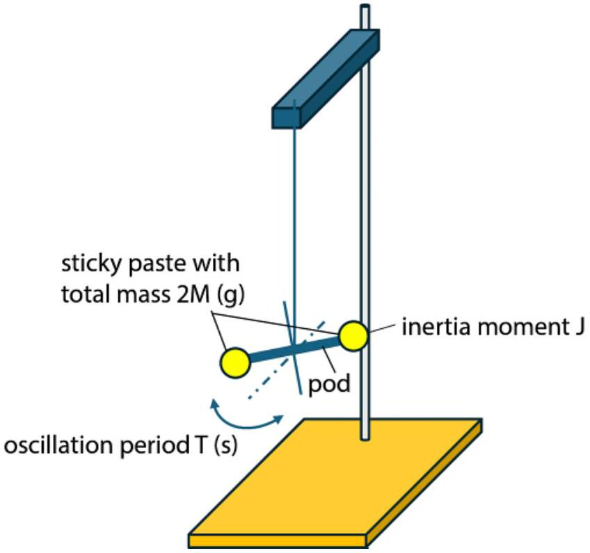

| B.1.1: Period $T$, in second, and expression of T as a function of other quantities. | 0.1 |
| :--- | :--- |
| B.1.2 Added mass $m _ { a }$, in gram, with schematic. | 0.1 |
| B.1.3 Radius of the added mass $r _ { a }$, in centimeter, with schematic. | 0.1 |

Note that the grading scheme will be evaluated as follows to take into account alternative protocols: a) If the students propose any of the quantities that already appear in the grading scheme, they will have the related points. b) If the students propose any protocol that works, and properly introduce the relevant quantities, they will have the entire points for the questions. c) No point will be given for additional quantities that do not correspond to a working protocol.

B. 2 Using the protocol described above, draw a graph to determine a first value of 1.1pt $B _ { \mathrm { e } }$, with its uncertainty.

SOLUTION:

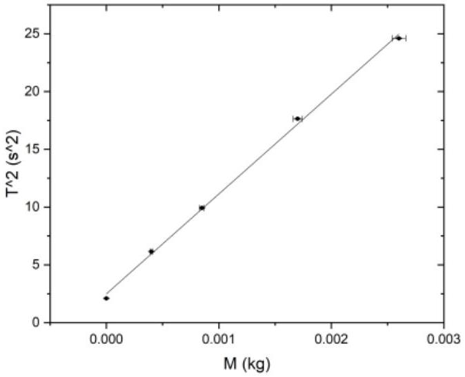

Since $\frac { 2 m _ { a } r _ { a } ^ { 2 } } { m _ { m } } = \frac { T ^ { 2 } } { 4 \pi ^ { 2 } } B _ { e } - \frac { J _ { 0 } } { m _ { m } }$, plotting $T ^ { 2 }$ versus $m _ { a }$ should give a linear function of slope $p = \frac { 8 \pi ^ { 2 } r _ { a } ^ { 2 } } { m _ { m } B _ { e } }$. One finds a slope $p = 8640 \pm 200 \mathrm {~A} ^ { - 1 } \cdot \mathrm {~T} ^ { - 1 }$. Using the value $m _ { m } = 0,31 \pm 0.01 \mathrm {~A} \cdot \mathrm {~m} ^ { 2 }$, one obtains $B _ { e } = 47 \mu \mathrm {~T}$. the relative uncertainty is $\frac { 200 } { 8640 } + \frac { 0,01 } { 0,305 } \approx 0,06$. Therefore $B _ { e } = ( 47 \pm 3 ) \mu \mathrm { T }$.

| B.2.1: 4 measures or more. | 0.1 |
| :--- | :--- |
| B.2.3: 6 measures or more. | 0.1 |
| B.2.3 : Identification and calculation of the relevant quantity. Either $T ^ { 2 } = f \left( U _ { a } \right)$ or $f \left( m _ { a } r _ { a } ^ { 2 } \right)$ or related quantity. | 0.2 |
| B.2.4 : Plot (axes, units). | 0.1 |
| B.2.5: Experimental plot showing linearity with correct sampling. | 0.2 |
| B.2.6 $B _ { e }$ value (with units) in $[ 1 ; 10 ] 10 ^ { - 5 } \mathrm {~T}$. | 0.1 |
| B.2.7. $B _ { e }$ value (with units) in $[ 1.5 ; 7 ] 10 ^ { - 5 } \mathrm {~T}$. | 0.1 |
| B.2.8. $\delta B _ { e }$ value (with units) in $[ 0.1 ; 1 ] 10 ^ { - 5 } \mathrm {~T}$. | 0.1 |
| B.2.9. $\delta B _ { e }$ value (with units) in $[ 0.2 ; 0.5 ] 10 ^ { - 5 } \mathrm {~T}$. | 0.1 |

Evaluation of the torque from the wire

B. 3 Keeping $L = 34 \mathrm {~cm}$, study the motion of the pod without the magnet, and determine the value of $C _ { \mathrm { f } }$, with experimental uncertainty: perform one period measurement for two system configurations. Specify the equation relating $C _ { \mathrm { f } }$ to the measured quantities.

SOLUTION:
The magnet is removed. The period of oscillation therefore depends on the torque due to the twisting of the wire and the moment of inertia. As the moment of inertia of the cradle remains unknown, we can

measure the period $T _ { 1 }$ without sticky paste and the period $T _ { 2 }$ with sticky paste, for a fixed length of wire. The equations involved are

$$
\begin{aligned}
& J = \frac { C _ { f } T _ { 1 } ^ { 2 } } { 4 \pi ^ { 2 } L } \\
& J + 2 m _ { a } r _ { a } ^ { 2 } = \frac { C _ { f } T _ { 2 } ^ { 2 } } { 4 \pi ^ { 2 } L } .
\end{aligned}
$$

Taking two measures, for $m _ { a } = 0$ and $m _ { a } = 2,6 \mathrm {~g}$, one finds $T _ { 1 } = 4.2 \pm 0.2 \mathrm {~s}$ and $T _ { 2 } = 15.8 \pm 0.2 \mathrm {~s}$, and therefore $C _ { f } = \frac { 8 \pi ^ { 2 } L m _ { a } r _ { a } ^ { 2 } } { T _ { 2 } ^ { 2 } - T _ { 1 } ^ { 2 } }$, so $C _ { f } = ( 5.1 \pm 0.2 ) \times 10 ^ { - 7 } \mathrm {~N} \cdot \mathrm {~m} ^ { 2 } / \mathrm { rad } \left( \mathrm { m } ^ { 3 } \cdot \mathrm {~kg} \cdot \mathrm {~s} ^ { - 2 } \right)$.

| B.3.1: Choice of a parameter that varies.   $J _ { a }$ through $m _ { a }$ and/or $r _ { a }$. | 0.1 |
| :--- | :--- |
| B.3.2: Measurements of $T _ { 1 }$ and $T _ { 2 }$. | 0.1 |
| B.3.3: Expression of $C _ { f }$ as a function of measured quantities. | 0.1 |
| B.3.4: $C _ { f }$ value (with units) in $[ 2 ; 10 ] 10 ^ { - 7 } \mathrm {~N} . \mathrm { m } ^ { 2 } / \mathrm { rad }$. | 0.1 |
| B.3.5: $C _ { f }$ value (with units) in $[ 3 ; 8 ] 10 ^ { - 7 } \mathrm {~N} . \mathrm { m } ^ { 2 } / \mathrm { rad }$. | 0.1 |
| B.3.6: $\delta C _ { f }$ value (with units) in $[ 0.05 ; 1.0 ] 10 ^ { - 7 } \mathrm {~N} . \mathrm { m } ^ { 2 } . \mathrm { rad } ^ { - 1 }$ | 0.1 |
| B.3.7: $\delta C _ { f }$ value (with units) in $[ 0.1 ; 0.5 ] 10 ^ { - 7 } \mathrm {~N} . \mathrm { m } ^ { 2 } . \mathrm { rad } ^ { - 1 }$ | 0.1 |

B. 4 Using previous measurements, give the expression and determine numerically the critical length $L _ { \mathrm { c } }$ for which the amplitude factors $C _ { \mathrm { f } } / L$ and $m _ { \mathrm { m } } B _ { \mathrm { e } }$ of the $\Gamma _ { \mathrm { f } }$ and $\Gamma _ { \mathrm { e } }$ torques are equal. In question B.2, what was the ratio $\left( C _ { \mathrm { f } } / L \right) / \left( m _ { \mathrm { m } } B _ { \mathrm { e } } \right)$ ? Choose from the intervals: [0\%, 1 \%[ ; [1 \%, 5 \%[ ; [5 \%, 20 \%[ ; [20 \%, 50 \%[ ; $[ 50 \% , \infty \% [$.

0.3pt SOLUTION:
The two previous torques are equalized, so $\frac { C _ { f } } { L _ { c } } = m _ { m } B _ { e }$ and then $L _ { c } = \frac { C _ { f } } { m _ { m } B _ { e } } = \frac { 5.1 \times 10 ^ { - 7 } } { 0.33 \times 47 \times 10 ^ { - 6 } } = 3.2 \mathrm {~cm}$. The ratio between the torque at 34cm and the critical torque at 3.2cm is therefore 3.2/34=9\%. So the answer is [5 ; 20\%[.

| B.4.1: Correct expression of $L _ { c } = C _ { f } / \left( m _ { m } B _ { e } \right)$. | 0.1 |
| :--- | :--- |
| B.4.2: $L _ { c }$ value (with units) in [2.0 ; 6.0] cm. | 0.1 |
| B.4.3: Correct range: [5\%,20\%[. | 0.1 |

Static regime measurement
We now propose a static measurement of the Earth's magnetic field. Reinsert the magnet into the pod. Use piece (f2a) in Fig. 3 to adjust the angular position $\theta _ { 0 }$, causing the wire to twist.

| B. 5 | Still at a fixed length of $L = 34 \mathrm {~cm}$, draw an appropriate plot to study how the equilibrium position of the magnet $\theta _ { \text {eq } }$ depends on the angle $\theta _ { 0 }$, and determine a second value of $B _ { \mathrm { e } }$, with its uncertainty. | 1.1pt |
| :--- | :--- | :--- |

SOLUTION:
According to the equation of motion in an equilibrium situation, we have : $\frac { C _ { f } \left( \theta _ { e q } - \theta _ { 0 } \right) } { L } = - m _ { m } B _ { e } \sin \left( \theta _ { e q } \right)$. The protocol therefore involves plotting, for a fixed length $L , \theta _ { e q } - \theta _ { 0 }$ as a function of $\sin \left( \theta _ { e q } \right)$ and checking that it is indeed a linear function, the slope of which $p = \frac { m _ { m } B _ { e } L } { C _ { f } }$ can be calculated.
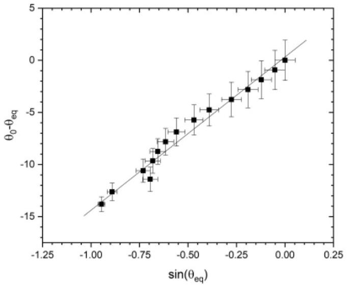
The slope obtained from the measurements is $11.1 \pm 1.7 \mathrm { rad } ^ { - 1 }$ for $L = 0.34 \mathrm {~m}$. The Earth magnetic field is then $B _ { e } = \frac { p C _ { f } } { m _ { m } L } = \frac { 11.1 \times 5.1 \times 10 ^ { - 7 } } { 0.33 \times 0.34 } = 50.5 \pm 8 \mu \mathrm {~T}$. Note that uncertainty is relatively high.

| B.5.1: Plot (axes, units). | 0.1 |
| :--- | :--- |
| B.5.2: 5 measures or more. | 0.1 |
| B.5.3: 7 measures or more. | 0.1 |
| B.5.4: Identification and calculation of the relevant quantity. Either $\left( \theta _ { e q } - \theta _ { 0 } \right) = f \left( \sin \left( \theta _ { e q } - \theta _ { e } \right) \right)$ or inverse. | 0.2 |
| B.5.5: Experimental plot showing linearity with correct sampling. | 0.2 |
| B.5.6: $B _ { e }$ value (with units) in $[ 1.0 ; 10 ] 10 ^ { - 5 } \mathrm {~T}$. | 0.1 |
| B.5.7: $B _ { e }$ value (with units) in $[ 1.5 ; 7 ] 10 ^ { - 5 } \mathrm {~T}$. | 0.1 |
| B.5.8. $\delta B _ { e }$ value (with units) in $[ 0.1 ; 2 ] 10 ^ { - 5 } \mathrm {~T}$. | 0.1 |
| B.5.9. $\delta B _ { e }$ value (with units) in $[ 0.6 ; 1 ] 10 ^ { - 5 } \mathrm {~T}$. | 0.1 |

B. 6 Vary the length $L$ and repeat the previous study for two other lengths to verify 2.3pt the $L$ dependence of the wire torque. Using a final graph that summarizes all the dependencies, determine a new value for $B _ { \mathrm { e } }$, with its uncertainty.

SOLUTION:
Now the length $L$ is varied, for $L = 26,12$ and 8 cm.

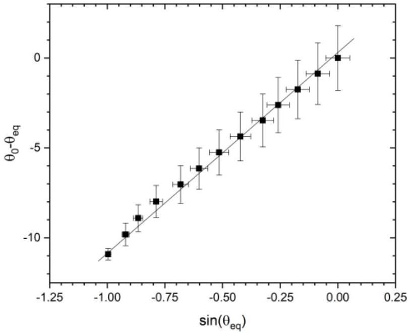
Figure B.6A: $L = 26 \mathrm {~cm}$.

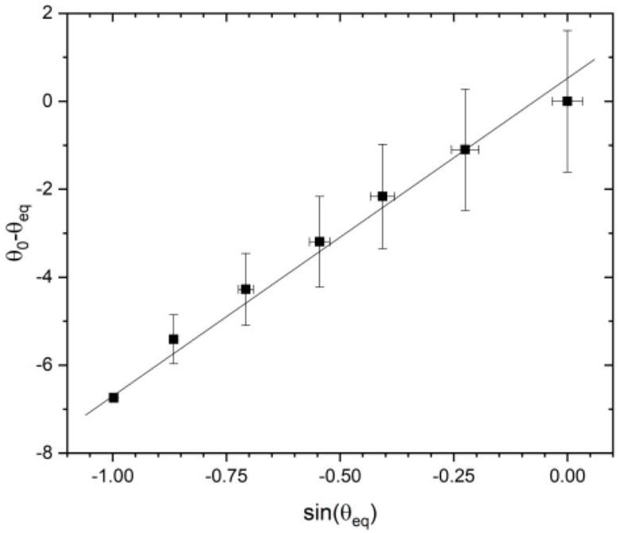
Figure B.6B: $L = 12 \mathrm {~cm}$.

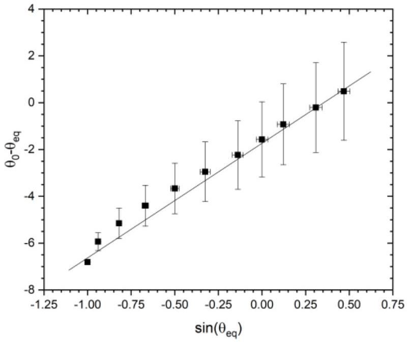
Figure B.6C: $L = 8 \mathrm {~cm}$.

The slopes are

$$
\begin{array} { l l }
L = 25 \mathrm {~cm} & p = 10.6 \pm 0.3 \mathrm { rad } ^ { - 1 } , \\
L = 12 \mathrm {~cm} & p = 6.7 \pm 0.3 \mathrm { rad } ^ { - 1 } , \\
L = 8 \mathrm {~cm} & p = 4.6 \pm 0.2 \mathrm { rad } ^ { - 1 } .
\end{array}
$$

So we can plot the slopes versus $L$ as
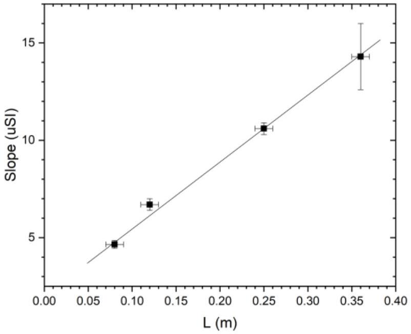

Slopes versus $L$.
As expected, the slope of figure B.6D is found to be proportional to $L$, with a slope $p ^ { \prime } = 27.1 \pm 1.5 \mathrm { rad } ^ { - 1 } \cdot \mathrm {~m} ^ { - 1 }$. A new value of $B _ { e }$ is deduced from $B _ { e } = \frac { p ^ { \prime } C _ { f } } { m _ { m } } = \frac { 5.1 \times 10 ^ { - 7 } \times 27.1 } { 0.305 } \approx 45.3 \mu \mathrm {~T}$. Relative uncertainty is given by

$$
\begin{aligned}
& \frac { \delta p ^ { \prime } } { p ^ { \prime } } + \frac { \delta C } { C } + \frac { \delta m } { m } = 0.12 , \text { so } \\
& B _ { e } = 45.3 \pm 5 \mu \mathrm {~T} .
\end{aligned}
$$

| B.6.1. Equilibrium 2 : 5 measures or more | 0,1 |
| :--- | :--- |
| B.6.2. 7 measures or more | 0,1 |
| B.6.3. Calculation of $\theta _ { e q } - \theta _ { 0 } = f \left( \sin \left( \theta _ { e q } - \theta _ { e } \right) \right)$ or inv. | 0,1 |
| B.6.4. Plot (axes, units) | 0,1 |
| B.6.5. Plot showing linearity with correct sampling | 0,2 |
| B.6.6. Slope for L2 | 0,1 |
| B.6.7. Equilibrium 3 : 5 measures or more | 0,1 |
| B.6.8. 7 measures or more | 0,1 |
| B.6.9. Calculation of $\theta _ { e q } - \theta _ { 0 } = f \left( \sin \left( \theta _ { e q } - \theta _ { e } \right) \right)$ or inv. | 0,1 |
| B.6.10. plot (axes, units) | 0,1 |
| B.6.11. Plot showing linearity with correct sampling | 0,2 |
| B.6.12. Slope for L3 | 0,1 |
| B.6.13. Identification and calculation of slope versus L | 0,3 |
| B.6.14. Plot (axes, units) | 0,2 |
| B.6.15. $B _ { e } = \frac { p ^ { \prime } C _ { f } } { m _ { m } }$ | 0,1 |
| B.6.16. $B _ { e } \in [ 1.5 ; 7 ] 10 ^ { - 5 } \mathrm {~T}$ | 0,2 |
| B.6.17. $\delta B _ { e } \in [ 0.2 ; 0.8 ] .10 ^ { - 5 } \mathrm {~T}$ | 0,1 |

Another possible solution is to represent all the measurements at different L in the same graph, by plotting $\left( \theta _ { \text {eq } } - \theta _ { 0 } \right)$ versus $L \cdot \sin \left( \theta _ { \text {eq } } - \theta _ { \text {e } } \right)$ and measure slope from there. Doing so should allow students to earn the maximum number of points according to the grading scheme.
