## Sand craters and dunes (10.0 points)

NASA's Spirit rover (Fig. 1.(a)) landed on Mars in 2004 to study its geology and potential presence of water. The landing site (Fig. 1.(b)) is surrounded by craters of various sizes and sand dunes. During exploration, the rover must avoid getting stuck in the sand dunes of Mars.

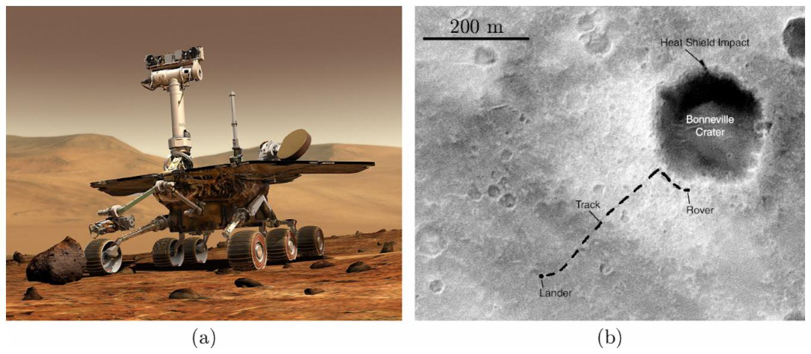
Fig. 1. (a) Artist's view of Spirit. (b) Landing site of the rover on Mars. The scale bar represents 0. . k .

The problem has two independent parts A (crater formation) and B (sand trapping) that can be treated in any order. The list of equipment is given below and illustrated in Fig. 2.

- (a) Plastic box, needs to be emptied. The empty box will be used to collect the overflowing sand during experiments.
- (b) Bowl.
- (c) Bottle of sand.
- (d) 6 steel balls in a container. The balls have 4 different diameters. The three smallest ones are identical.
- (e) Tape measure.
- (f) Holding device consisting of a wooden tray with rubber feet (f1), a vertical rod (f4), clamping screw (f2) and horizontal rod (f3). The different elements must be assembled as shown in the photo (f).
- (g) Sieve, used to find the small ball if it gets lost in the sand.
- (h) Aluminium rail, / k long.
- (i) Brush to clean the rail and balls of sand if necessary.
- (j) Wooden track.
- (k) Chronometer.
- (l) Adhesive putty.
- (m) Funnel to help to put the sand back into the box at the end.
- (n) Spoon.
- (o) Ruler.

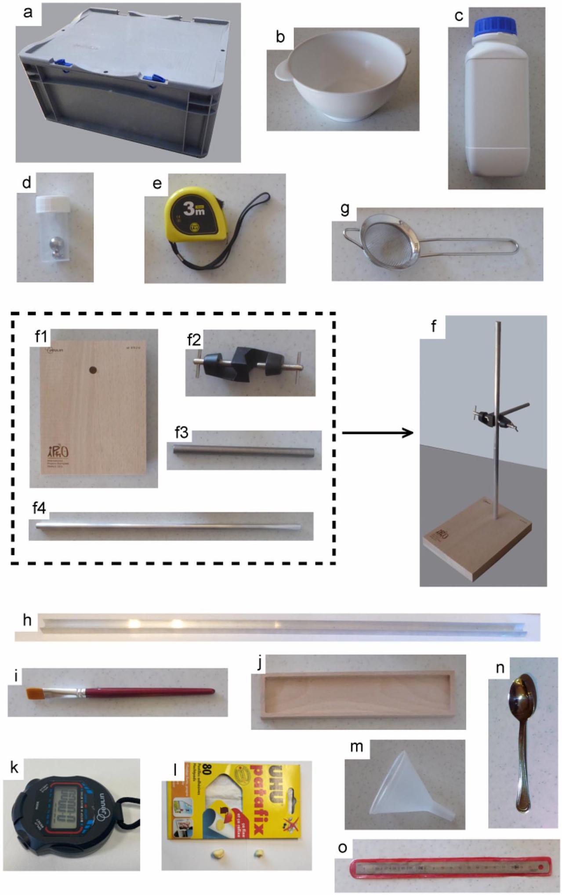
Fig. 2. Photographs of all equipment.


## A．Impact craters

Craters on Mars，whose diameter $\stackrel { \text { ® } } { \text { 年 } }$ varies from about／．k to several hundreds of km，result from the impact of meteorites．Different models predict how $\stackrel { \circ } { \text { 公 } }$ depends on the impact parameters：impactor diameter $\rho$ ，energy $\rho$（Fig．3）．

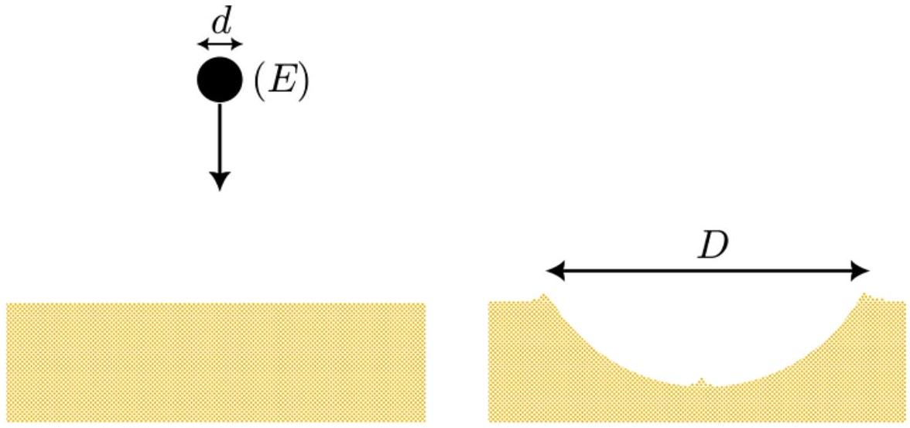
Fig．3．Crater formation．

Model 1：$\frac { \AA } { \text { depends } }$ only on the impactor diameter $\rho$ I

$$
\begin{equation*}
\stackrel { \rho } { \rho } ; q _ { j } ^ { \rho } \rho ^ { * } \tag{()}
\end{equation*}
$$

where $9 _ { j }$ is a dimensionless number independent of $P$ and $\rho$ ！
Model 2：the meteorite energy $\rho$ is converted through volumic processes during the impact．This model predicts that $\stackrel { \circ } { \rho }$ is proportional to $\rho$ »X

$$
\begin{equation*}
\stackrel { \rho } { \rho } ; q _ { j } ^ { 1 } \rho \rho ^ { \rho } x \tag{2}
\end{equation*}
$$

where $q _ { j } ^ { I }$ is a parameter independent of $P$ and $P$ ．
Model 3：$\rho$ is used to eject material outside the crater．Under this assumption

$$
\begin{equation*}
\text { P ; ૧ノฎ } \boldsymbol { R } ^ { \jmath \times x } \tag{3}
\end{equation*}
$$

where $\mathrm { I } _ { \lambda }$ is a parameter independent of P and P ．
Here，we perform experiments on crater formation at a centimeter scale to compare the three models． Steel balls of different diameters ${ } ^ { \rho l }$ and masses j ，with a density $\hat { a } _ { p } ; \overline { \mathbf { c } } _ { 1 } , 6$ ¬／．${ } ^ { \text {® } }$ ejk $\stackrel { \text { c } } { \text { c } }$（item（d）of the equipment list），act as the meteorites．

| Ball＃1 | $\rho _ { \rho }$ ；0，．k k | $\mathrm { J } _ { \text {д } }$ ；．．．11e |
| :--- | :--- | :--- |
| Ball＃2 | $\rho _ { \text {J } }$ ；3，．k k | $\mathrm { J } _ { \text {ภ } }$ ；．，3／e |
| Ball＃3 | P，7，．k K | $\mathrm { J } _ { \text {交 } }$ 1，．e |
| Ball＃4 | $\rho _ { \digamma ^ { \prime } }$／／4，k k | j ；／5e |


The bowl (b) filled with sand (c) is placed inside the emptied plastic box (a) that will help collect the excess sand. The bowl is filled completely with sand and the surface is carefully leveled with the edge of the ruler (o). Avoid compacting the sand! To release the ball above the bowl, one can use the stand equipped with a rod and thumbscrew (f). The rod serves as a guide to release the ball directly above the bowl and also to measure the drop height $\hat { \jmath }$ above the surface, which will be measured using the tape measure (e).

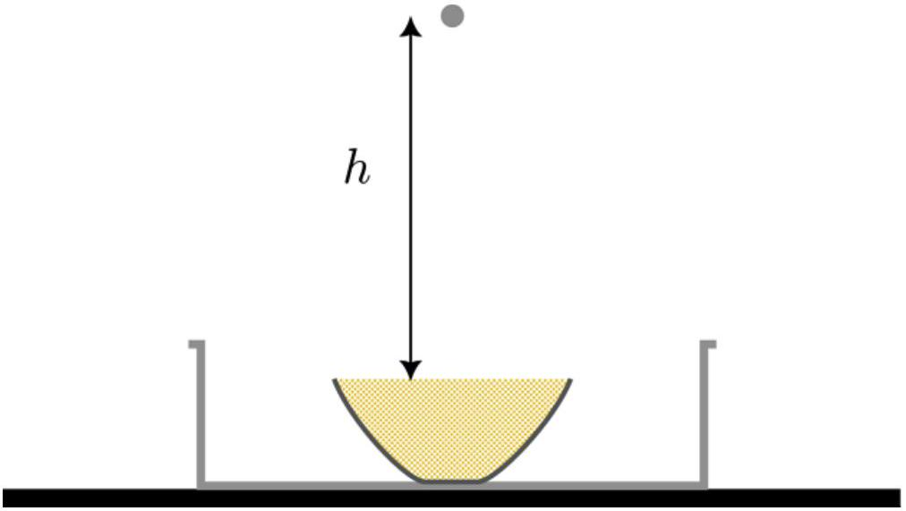
Fig. 4. Crater formation experimental setup.

Drop ball \#3 from a height $\hat { \mathrm { j } }$; 3. ak and measure the diameter $\stackrel { \circ } { \mathrm { P } }$ of the crater formed. Repeat the experiment 5 times. After each impact, mix the sand with the spoon (n), and level it carefully with the edge of ruler (o). Avoid compacting the sand! If needed, use the sieve (g) to find the ball if it gets lost in the sand.
A. 1 Present your results in a table and give $\stackrel { \circ } { \text { P } }$ with its uncertainty. 0.6pt

SOLUTION:

| D(mm) | 23 | 24 | 22 | 25 | 25 |
| :--- | :--- | :--- | :--- | :--- | :--- |

$D = ( 23.8 \AA 1.2 ) \mathrm { mm }$

| A1(1) : 2 measures of D between 22mm and 26mm | 0.2pt |
| :--- | :--- |
| A1(2) : 3 more measures of D between 22mm and 26mm | 0.2pt |
| A1(3) : mean value of D between 23mm and 25mm | 0.1 pt |
| A1(4) : uncertainty on D between 0.5 mm and 2mm | 0.1 pt |

During the fall, the air drag force is

$$
\begin{equation*}
\dot { \rho } ; \frac { l } { 6 } \hat { \mathrm {~A} } ^ { p } \rho ^ { v } \hat { a } _ { \varepsilon } q _ { l } \dot { \Gamma } ^ { J } \tag{4}
\end{equation*}
$$

where $\dot { \mathrm { r } } \cdot$ is the ball velocity, $\hat { \mathrm { a } } _ { \varepsilon } \mathrm { D } \not t , \mathrm { Oi }$ ejk $\stackrel { \sim } { \tau } \mathscr { X } _ { \text {is } }$ the air density and $\mathrm { q } _ { \mid }$is a dimensionless coefficient of order


unity.
The air drag force is negligible if the ball is dropped from a height less than the maximum drop height $\hat { \mathrm { J } } _ { \mathrm { k } \_ \mathrm { v } }$, defined as the height at which the air drag force remains less than 10 \% of the weight throughout the fall.
A. 2 Determine the theoretical expression for the maximum drop height $\hat { \mathrm { J } } _ { \mathrm { k } \_ \mathrm { v } }$. Cal- 0.5pt culate $\hat { \mathrm { J } } _ { \mathrm { k } \_ \mathrm { v } }$ numerically for the four available balls.

SOLUTION:
If the friction with air in neglected, the maximum speed writes $\dot { \Gamma } _ { \text {max } } ; \mathrm { Nj } \overline { 0 \hat { \jmath } }$ and the corresponding air friction is $\dot { \rho }$; ${ } _ { \underset { r } { J } } ^ { \nexists \rho ^ { 1 } \hat { a } _ { \varepsilon } q _ { l } } , { } ^ { \otimes 0 } \hat { \jmath } ^ { \prime }$. If we want $\dot { \rho } : \mathrm { j }$ า-/ . then we obtain

| A2(1) : s k _ v; . , / $\frac { J } { J \times 0 _ { \text {d } } } \frac { J } { \text { ป } v }$ Plor any equivalent formula involving other variables. | 0.4pt |
| :--- | :--- |
| A2(2) : 4 values for hmax = (0.9m ; 2m ; 4m ; 7m) | 0.1pt |

Investigate the relationship between $\stackrel { \circ } { \rho }$ and $\rho$ experimentally in order to compare the three power laws presented in the introduction. Find out if the exponent changes across the range of energies tested. To achieve this, take a series of measurements by dropping the balls from different heights. A wide range of energies must be covered. The balls can be dropped from heights of up to $\hat { \mathrm { j } }$; Ok in order to reach high values of $P$ while respecting the condition established in A.2. For each set of parameters, repeat the experiment only twice, and compute the mean value P .
A. 3 Present your results in a table: mass of the ball J , drop height s , impact energy 1.7pt $\rho$, crater diameter $\stackrel { \circ } { \text { P } }$.

SOLUTION:
In order to cover a wide range of impact energies, we will release the small ball from a low height $( \mathrm { h } = 10 \mathrm {~cm} )$ and the big ball from height up to 2m (no need to drop the small ball from high). A key point is to reform the sand after each impact. If not, the sand becomes harder and the craters will be smaller. The energy $\mathrm { E } = \mathrm { mgh }$ varies from $3 \mathrm { E } - 5 \mathrm {~J}$ (ball $\# 1 , \mathrm {~h} = 10 \mathrm {~cm}$ ) up to 0.4 J (ball $\# 4 , \mathrm {~h} = 2 \mathrm {~m}$ ).
The expected values established by pre-IPhO experiments follow so ; 4,70\&j $\hat { j }$ ' $\stackrel { \text { ઈ } } { \text { 包 } }$ 'where $\stackrel { \text { ô } } { \text { p } }$ is in mm, j is in g and $\hat { \jmath }$ in cm.

| A3(1) : N>5,5 correct values of D (\|D-Dref\|<0.15*Dref) | 0.3pt |
| :--- | :--- |
| A3(2) : N>8,5 correct values of D | 0.3pt |
| A3(3) : N>11,5 correct values of D | 0.3pt |
| A3(4) : Correct calculation of $\mathrm { E } = \mathrm { mgh }$ ( $\| \mathrm { E } - \mathrm { Eth } \| < 0,1 ^ { * }$ Eth) | 0.2pt |
| A3(5) : 2 decades for E (with 2 points/decade) | 0.2pt |
| A3(6) : 3 decades for E (with 2 points/decade) | 0.2pt |
| A3(7) : more than 3,5 decades for E | 0.2pt |


| A. 4 | Plot your results on the graph paper of your choice (logarithmic or linear). On the graph representation, add lines corresponding to models 1, 2 and 3. State which of the three theoretical models best fits the experimental data. | 1.2pt |
| :--- | :--- | :--- |

SOLUTION:
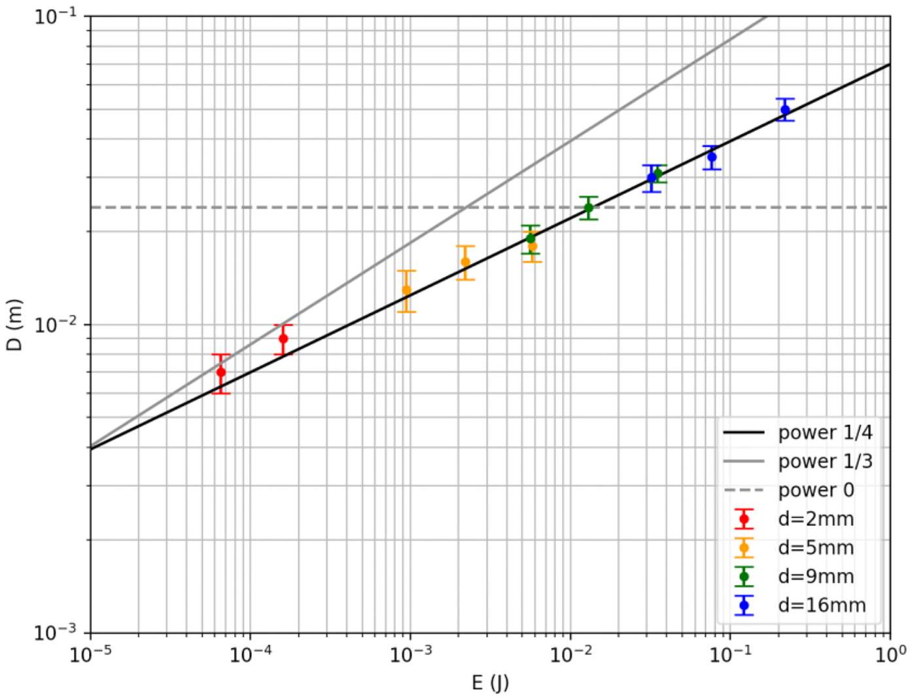

| A4(1) : axes with label and units | 0.1pt |
| :--- | :--- |
| A4(2) : theoretical straight lines of slope 1/3 and 1/4 (anywhere) | 0.2pt |
| A4(3) : theoretical straight horizontal line (exponent 0) | 0.1pt |
| A4(4) : N>4 points on the graph | 0.2pt |
| A4(5) : two points of the graph in coherence with the values in A3 | 0.2pt |
| A4(6) : points form a straight line | 0.2pt |
| A4(7) : slope mesured and conclusion 1/4 | 0.2pt |


## B. Rolling and bogging in sand

Five years after landing, the rover Spirit bogs in the sands of a Martian dune for good. Rolling in sand is particularly delicate as the motion of grains dissipates a lot of energy. Here, we study the braking of a ball rolling in sand. The ball, initially at rest, is first accelerated on a rail inclined at an angle A, then slowed down on a bed of sand.

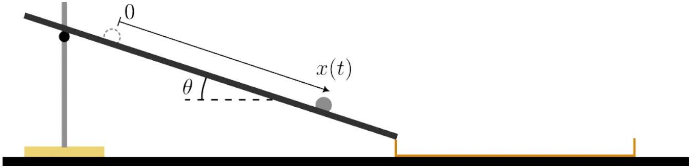
Fig. 5. Inclined rail (h) combined with the wooden track (j).

## Ball motion along the rail

Ball \#4 is released with no initial speed from an arbitrary point on the rail (h), chosen as the origin of the J-axis ( J⋅; . ) (Fig. 5). Let J\& denote the position of the ball along the rail. The moment of inertia of a ball of mass j and diameter ${ } ^ { \mathrm { P } }$ with respect to an axis passing through it center is given by $\mathrm { b } ^ { \prime } \mathrm { j } ^ { \mathrm { p } ^ { \mathrm { I } } } - /$.. The kinetic energy $\dot { b }$ of a ball moving at speed $\dot { \Gamma }$-while rotating at angular speed $\stackrel { \text { à } } { \text { a } }$ is

$$
\begin{equation*}
\mathrm { b } ; \frac { 1 } { 0 } \mathrm { j } \dot { \Gamma } ^ { ( J ) } \frac { / l } { 0 } \mathrm { bă } ^ { \star ^ { J } } , \tag{5}
\end{equation*}
$$

We assume that the ball rolls on the rail without slipping and neglect any energy dissipation.

B. 1 Express the position J of the ball as a function of time $\Gamma$; angle Ạand acceleration 0.4pt of gravity ?.

## SOLUTION:

Energy theorem (no dissipation) together with the kinematic relation $\dot { \mathrm { r } } \cdot$; ằ ⋅ d give a rapid answer.
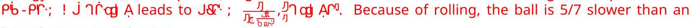 hypothetic material point.

| 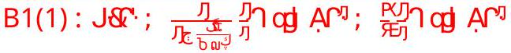 | 0.4pt |
| :--- | :--- |

One end of the rail (h) rests on the edge of the wooden track (j), which is at this point empty of sand. The other end of the rail is supported by the stand (f) in such a way that it forms an angle of inclination A; $3 ^ { \prime \prime }$ with the horizontal. Make sure to perform this adjustment carefully. The rail is secured in place (on both sides) using adhesive putty (I).

Use a chronometer (k) to measure the time $\Gamma _ { \dot { \mathbf { R } } }$ taken by the ball to travel a distance J; 3. ak along the rail.


B. 2 Take 5 measurements and present the result along with the order of magnitude of its statistical uncertainty.

SOLUTION:

| $r _ { \text {PE } } ( s )$ | 1.28 | 1.35 | 1.39 | 1.32 | 1.33 |
| :--- | :--- | :--- | :--- | :--- | :--- |

$\Gamma _ { P _ { \varepsilon } } ; \& , 11 \odot . , .2 ^ { \prime } \cdot \Gamma$

| B2(1) : 1 mesure of $\mathrm { r } _ { \text {PE } }$ between 1.2s and 1.4s | 0.2pt |
| :--- | :--- |
| B2(2) : 4 more mesures of $\mathrm { r } _ { \text {PÉ } }$ between 1.2s and 1.4s | 0.2pt |
| B2(3) : mean value of $\mathrm { r } _ { \mathrm { P } _ { \mathrm { E } } }$ between 1.25s and 1.35s | 0.2pt |
| B2(4) : uncertainty of $\mathrm { r } _ { \text {PÉ } }$ between 0.02s and 0.30s | 0.1pt |

Measure $\Gamma$ with the order of magnitude of its statistical uncertainty for at least 8 different values of i .
B. 3 Present your results in a table. 0.8pt

SOLUTION:
Since we can anticipate the arrival of the ball at the bottom of the rail, the measurements are quite reproducible.

| Í (cm) | 10 | 20 | 30 | 40 | 50 |
| :--- | :--- | :--- | :--- | :--- | :--- |
| t(s) | 0.54C0.03 | 0.87©0.05 | 1.04C0.05 | 1.16 C0.06 | 1.33 C0.04 |


| í (cm) | 60 | 70 | 80 | 90 | 100 |
| :--- | :--- | :--- | :--- | :--- | :--- |
| t(s) | 1.45@0.04 | 1.60 C0.07 | 1.71 C0.06 | 1.78 C0.05 | 1.83C0.06 |


| B3(1) : measures of t with uncertainty for 4 different values of i ( $\boldsymbol { Z } ^ { ! } ! \boldsymbol { f } ^ { \text {⋅ } }$, z: ., / ᄀsp. ) | 0.3pt |
| :--- | :--- |
| B3(2) : 4 more measures of t | 0.3pt |
| B3(3) : Í goes from 10cm up to 90cm | 0.2pt |

B. 4 Plot your results with error bars to confirm the law established at question B.1. 1pt Deduce an experimental estimate of the constant ? with its uncertainty.


We can plot í as a function of $\mathrm { r } ^ { \mathrm { p } }$ or vice versa to obtain a straight line.
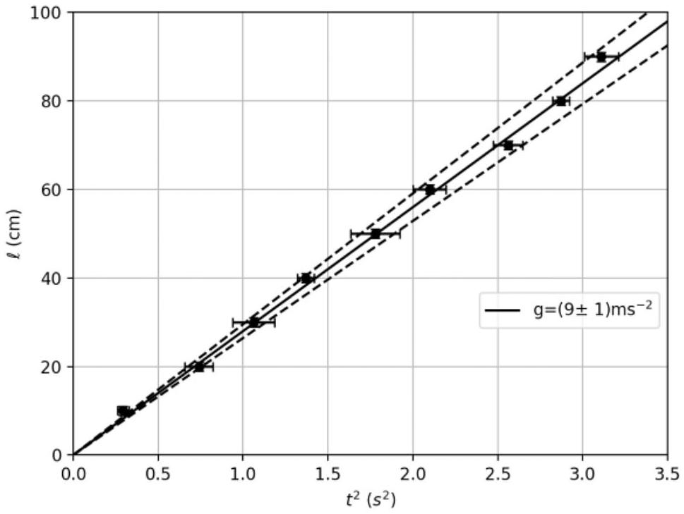

The slope is $\frac { \mathrm { P } } { \pi \times } 1$. We find $\mathrm { g } = \left( 9 \right.$ CI ) $\mathrm { ms } ^ { \leqslant \lambda }$. This value is very sensitive to an error on the slope of the rail. An error of $1 ^ { \circ }$ (out of $5 ^ { \circ }$ ) leads to an error of $2 \mathrm {~ms} ^ { \angle 刀 }$ on the value of g

One can also plot Njī as a function of ɾ̩to detect a systematic shift error on ɾ :
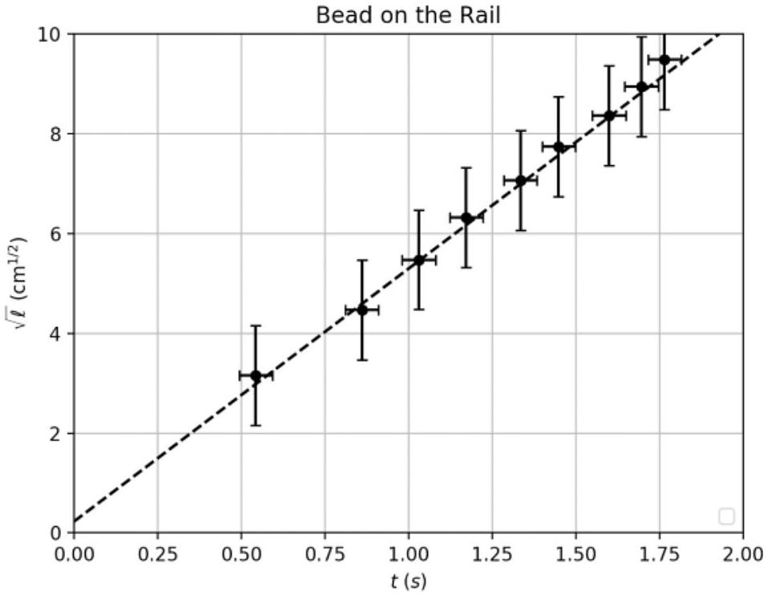


| B4(1) : smart choice for the axes ( $\mathrm { l } , \mathrm { r } ^ { \mathrm { J } }$ ) or anything that ends to a line | 0.2pt |
| :--- | :--- |
| B4(2) : Presence of error bars for t | 0.2pt |
| B4(3) : Adjustment made by a straight line. | 0.2pt |
| B4(4) : value of g between 6ms ${ } ^ { \text {九 } }$ and $14 \mathrm {~ms} ^ { \text {¿ } } \mathrm { J }$ | 0.2pt |
| B4(5) : values of g between 8ms ${ } ^ { \text {★ } }$ and $12 \mathrm {~ms} ^ { \text {★ } }$ I | 0.1 pt |
| B4(6) : Uncertainty on g of the order of 1 ms ${ } ^ { \text {¿ } }$ / | 0.1 pt |

## Motion of the ball in sand

We note I the distance travelled by the ball on the rail. On the sand, the ball comes to a stop after travelling a distance •9as defined in Fig. 6.

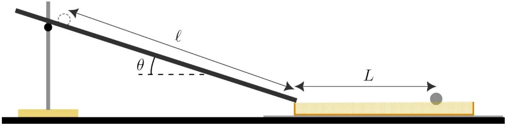
Fig. 6. Acceleration over a distance 1 and stopping over a distance ⋅ 9

It is thus slowed down by a drag force ⋅ d which may have two possible origins:

- Model \#1 (solid friction): as between two solids in relative motion, the sand exerts on the ball a constant drag force $\cdot \mathrm { d } ; ! \hat { \mathrm { A } } _ { \text {eff } } \mathrm { j } \uparrow$, where $\hat { \mathrm { A } } _ { \text {eff } }$ is the effective drag coefficient of the ball-sand contact and J is the mass of the ball.
- Model \#2 (fluid drag): the drag force depends linearly on the ball velocity, ⋅ d; ! $\dot { r } \dot { \Gamma }$-where $\dot { \Gamma }$ is a constant and $\dot { \Gamma }$ the norm of the velocity.

The goal here is to determine which proposition best describes the observed braking behavior.
When moving in sand, the ball is modelled as a point mass. Given the small value of the slope of the rail, we neglect any energy loss in the transition between the rail and the sand track. Establish the theoretical law linking ⋅ 9 to i in each of the two situations (solid friction or fluid drag). The two suggestions lead to a power law of the form ${ } ^ { 9 }$ ọ $\mathrm { l } =$ in which the exponent $\frac { \mathrm { y } } { \text { takes two different values. } }$

B. 5 For model 1 and model 2, give the relationship between ⋅ 9and I and the value 0.6pt of $\dot { \mathrm { y } }$.

## SOLUTION:

Energy considerations for model \#1 are straightforward : $\mathrm { j } \hat { \mathrm { j } } ; \hat { \mathrm { A } } _ { \text {ccd } }$ - ૧
$\_\_\_\_$
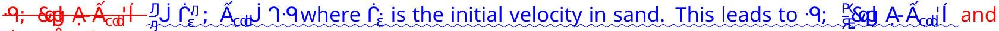 then $\mathrm { y } ; /$.

Some more calculus are needed for suggestion \#2 : we must solve the differential equation for v(t) and


```
J&.; rėẠ&! cvn& r-Ậ'' with tends to
```

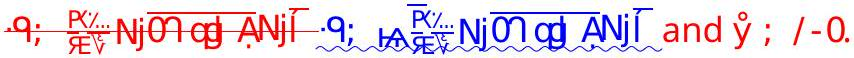

| B5(1) : model \#1: 9; Pagl A- $\hat { A } _ { \text {cal } }$ !. The answer -9; \&ed Ạ- $\hat { A } _ { \text {cdl } }$ I will also be accepted. | 0.1pt |
| :--- | :--- |
| B5(2) : model \#1: ẙ ; / | 0.1pt |
| 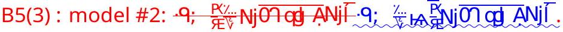 The answer •9; $\frac { \% } { v } \mathrm { Nj } \overline { \text { OT OM ẠNjĭ } }$ will also be accepted. | 0.3pt |
| B5(4) : model \#2: ẙ ; /-0 | 0.1 pt |

Place the wooden track (j) on a sheet of paper. Fill the track with sand and prepare a uniform layer by carefully scraping the surface with the ruler. Avoid compacting the sand! Adjust again carefully the angle of the rail to A; 3." Release ball \#4 ( $\rho _ { J , } ; 1 , .4 , \mathrm { k }$ ) on the inclined rail so that the distance travelled on the rail is J; 3. ak .

Before each run, stir the sand, renll the track and scrape the surface again. Clean the rail and the ball from sand by using the brush (i). At the end of the experiment, use the sheet of paper as a funnel to put the sand in excess back in the bottle.

B. 6 Measure the distance $q _ { \text {c } }$ travelled in the sand until the ball comes to a stop. 0.8pt Perform several measurements (at least 5) to determine ${ } _ { q _ { \boldsymbol { p } } }$ along with its unit and uncertainty.

SOLUTION:
If the layer is not carefully redone after each run, the sand will get harder and the ball will run out of the track.

| $\cdot q _ { \varepsilon } ( \mathrm { cm } )$ | 7.0 | 6.7 | 5.8 | 6.7 | 6.1 |
| :--- | :--- | :--- | :--- | :--- | :--- |

$$
\text { - } \varphi _ { \in } ; \quad \& \text { 4,2 ©. ,3' cm }
$$

| B6(1) : 3 measures of ⋅ $\mathrm { q } _ { \mathrm { c } }$ between 5,5cm and 7,5cm. | 0.4pt |
| :--- | :--- |
| B6(2) : 2 more measures between 5,5cm and 7,5cm | 0.2pt |
| B6(3) : mean value of ⋅ ${ } _ { q _ { \text {€ } } }$ between 5.8cm and 7.2cm | 0.1 pt |
| B6(4) : uncertainty on $\cdot q _ { \underline { \mathrm { a } } }$ between 0.2cm and 1.0cm | 0.1 pt |


| B. 7 | After several measurements for at least 8 values of I (keeping A; 3), plot•9with its error bars as a function of I and conclude which model best describes the drag force d. | 1.5pt |
| :--- | :--- | :--- |

SOLUTION:
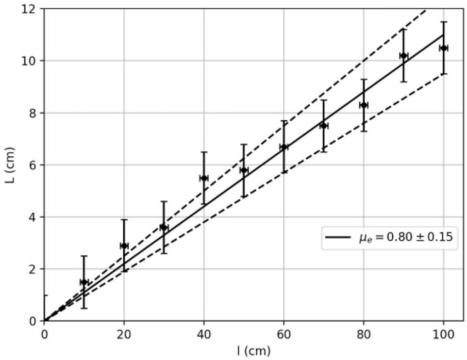

The point are compatible with a straight line and a "solid-like" friction model (suggestion \#1)

| B7(1) : 4 measures of L for different I | 0.3pt |
| :--- | :--- |
| B7(2) : 4 more measures of L | 0.2pt |
| B7(3) : Í varies (at least) from 10cm up to 90cm | 0.1 pt |
| B7(4) : graph L as a function of Í or log(•9) as a function of log(Í ), axes, values and units | 0.1 pt |
| B7(5) : more than 2,5 points on the graph | 0.1 pt |
| B7(6) : more than 5,5 points on the graph | 0.2pt |
| B7(7) : error bars between © 0.5 cm and © 1 cm for L | 0.1 pt |
| B7(8) : a linear law is ploted, and compatible with the points. | 0.2pt |
| B7(9) : conclusion y ; / and "solid-like" friction in sand. | 0.2pt |

B. 8 Based on the chosen model, specify the value of the coefficient $\hat { \mathrm { A } } _ { \text {eff } }$ or $\dot { \Gamma }$ that 0.2pt characterizes the force ⋅ d.

Experiment

International
Physics Olympiad
FRANCE 2025

Q2-13
English (Official)

The relation is •9; \&. Ạ- Á eff ' Í

$$
\hat { \mathrm { A } } _ { \text {eff } } ^ { \prime } ; . , 6 \odot . , /
$$

| B8(1) : $\hat { \mathrm { A } } _ { \text {eff } }$ between 0.6 and 1.0 | 0.2pt |
| :--- | :--- |
