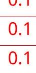
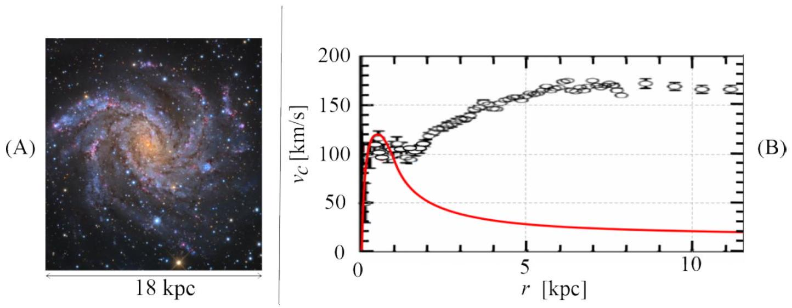
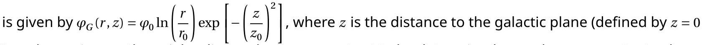
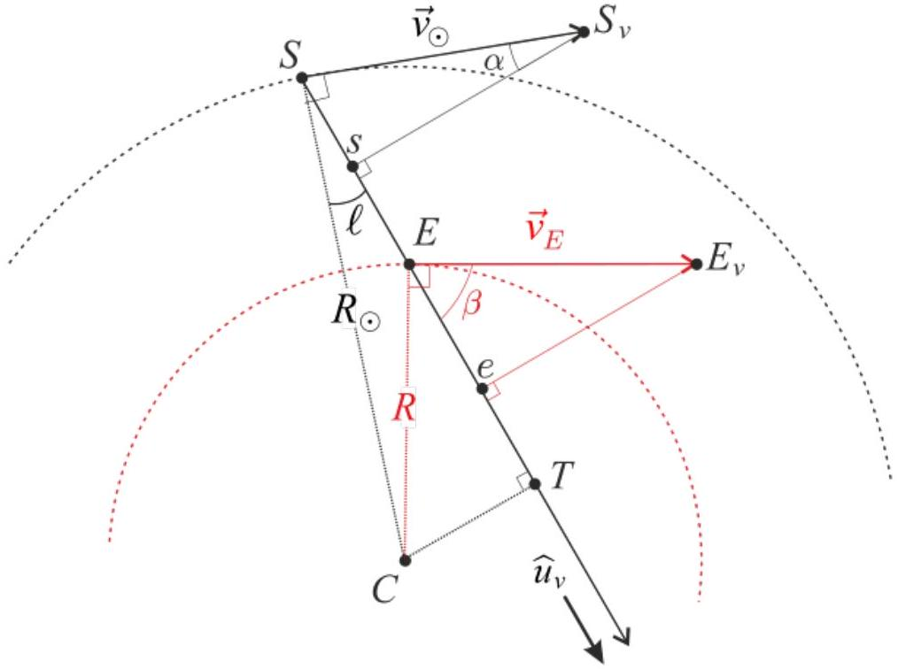
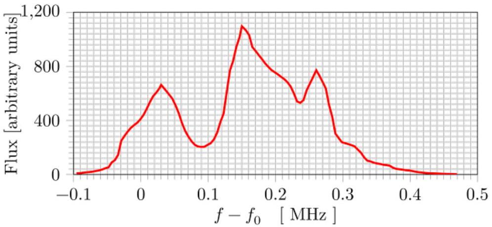
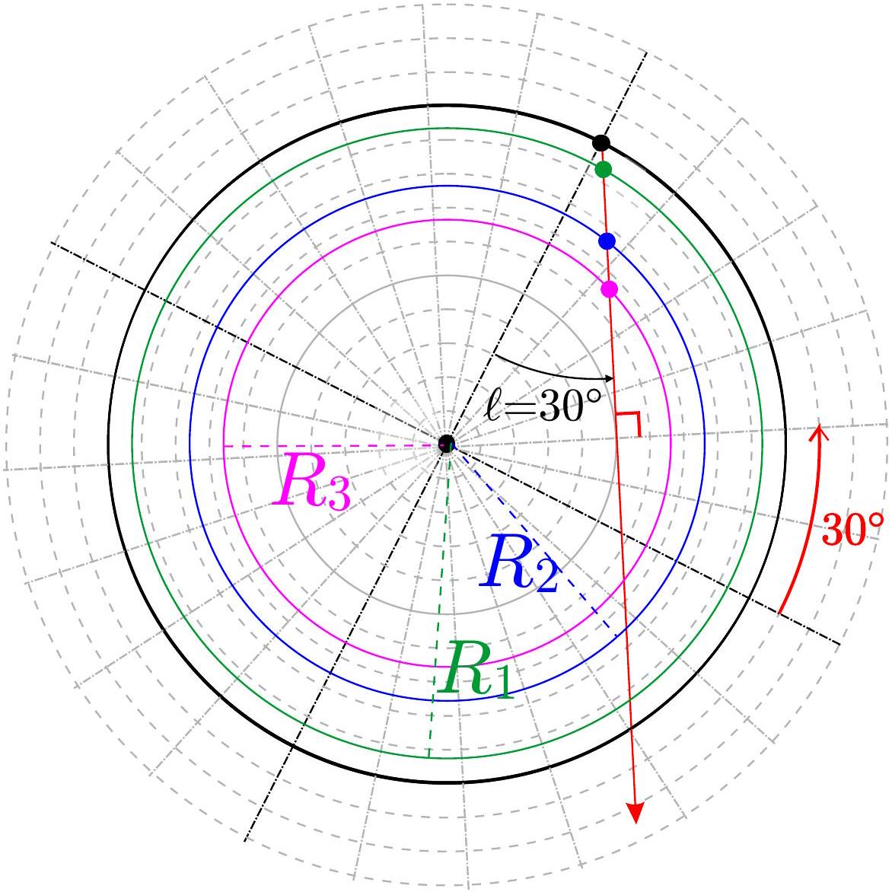
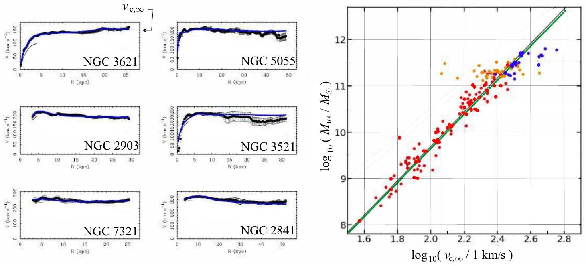

## Hydrogen and galaxies (10 points)

This problem aims to study the peculiar physics of galaxies, such as their dynamics and structure. In particular, we explain how to measure the mass distribution of our galaxy from the inside. For this we will focus on hydrogen, its main constituent.
Throughout this problem we will only use $\hbar$, defined as $\hbar = h / 2 \pi$.
Part A - Introduction
Bohr model
We assume that the hydrogen atom consists of a non-relativistic electron, with mass $m _ { e }$, orbiting a fixed proton. Throughout this part, we assume its motion is on a circular orbit.
A. 1 Determine the electron's velocity $v$ in a circular orbit of radius $r$. 0.2pt

SOLUTION:
Newton's second law on the electron in the electrical field of the proton for a circular orbit and projected on $\vec { u } _ { r } : - m _ { e } \frac { v ^ { 2 } } { r } = - \frac { e ^ { 2 } } { 4 \pi \varepsilon _ { 0 } r ^ { 2 } }$ hence $v = \sqrt { \frac { e ^ { 2 } } { 4 \pi \varepsilon _ { 0 } m _ { e } r } }$

Marking Scheme

| A.1.1 : Using Newton's second law | 0.1 |
| :--- | :--- |
| A.1.2 : Expression of the velocity | 0.1 |

In the Bohr model, we assume the magnitude of the electron's angular momentum $L$ is quantized, $L = n \hbar$ where $n > 0$ is an integer. We define $\alpha = \frac { e ^ { 2 } } { 4 \pi \varepsilon _ { 0 } \hbar c } \approx 7.27 \times 10 ^ { - 3 }$.
A. 2 Show that the radius of each orbit is given by $r _ { n } = n ^ { 2 } r _ { 1 }$, where $r _ { 1 }$ is called the 0.5pt Bohr radius. Express $r _ { 1 }$ in terms of $\alpha , m _ { e } , c$ and $\hbar$ and calculate its numerical value with 3 digits. Express $v _ { 1 }$, the velocity on the orbit of radius $r _ { 1 }$, in terms of $\alpha$ and $c$.

SOLUTION:
If the norm $L$ of the angular momentum is quantified, for a circular orbit of radius $r _ { n }$ it is $L = m _ { e } r _ { n } v _ { n } = n \hbar$. In the previous question, we have already obtained a relation between $r$ and $v$ that can be used for $r _ { n }$ and $v _ { n }$ and gives $v _ { n } = \sqrt { \frac { e ^ { 2 } } { 4 \pi \varepsilon _ { 0 } m _ { e } r _ { n } } } = \sqrt { \frac { \alpha \hbar c } { m _ { e } r _ { n } } }$. Then using the quantifed expression we get $r _ { n } = \frac { n \hbar } { m _ { e } v _ { n } } = \frac { n \hbar } { m _ { e } } \sqrt { \frac { m _ { e } r _ { n } } { \alpha \hbar c } }$ thus $r _ { n } = \frac { \hbar n ^ { 2 } } { \alpha m _ { e } c }$ and then $r _ { 1 } = \frac { \hbar } { \alpha m _ { e } c }$. For the numerical value we previously compute $\alpha = 7.27 \times 10 ^ { - 3 }$ and then $r _ { 1 } = 5.31 \times 10 ^ { - 11 } \mathrm {~m}$. For the velocity, we get $m _ { e } v _ { 1 } ^ { 2 } = \frac { e ^ { 2 } } { 4 \pi \varepsilon _ { 0 } r _ { 1 } } = \frac { e ^ { 2 } m _ { e } v _ { 1 } } { 4 \pi \varepsilon _ { 0 } \hbar }$ and then $v _ { 1 } = \frac { e ^ { 2 } } { 4 \pi \varepsilon _ { 0 } \hbar } = \alpha c$.

Marker Scheme

| 26mament. |  |
| :--- | :--- |
| " |  |

" н никаниканома "

 ослежащающаемованой Gooun
"

| A.3.2 : Expression for $E _ { 1 }$ with $\alpha$ | 2 |
| :--- | :--- |

Hydrogen fine and hyperfine structures
The rare spontaneous inversion of the electron's spin causes a photon to be emitted on average once per 10 million years per hydrogen atom. This emission serves as a hydrogen tracer in the universe and is thus fundamental in astrophysics. We will study the transition responsible for this emission in two steps.

First, consider the interaction between the electron spin and the relative motion of the electron and the proton. Working in the electron's frame of reference, the proton orbits the electron at a distance $r _ { 1 }$. This produces a magnetic field $\vec { B } _ { 1 }$.

A. 4 Determine the magnitude $B _ { 1 }$ of $\vec { B } _ { 1 }$ at the position of the electron in terms of $\mu _ { 0 } , \quad 0.5 \mathrm { pt }$ $e , \alpha , c$ and $r _ { 1 }$.

SOLUTION:
The period of the motion is : $T = \frac { 2 \pi r _ { 1 } } { v _ { 1 } }$.
The current $i$ corresponding to the orbit of the proton is $i = \frac { e } { T }$ hence $i = \frac { e v _ { 1 } } { 2 \pi r _ { 1 } } = \frac { e \alpha c } { 2 \pi r _ { 1 } }$.
The magnetic field created by a loop with current $i$ and radius $R$ is : $B = \frac { \mu _ { 0 } i } { 2 R }$, which here gives $B _ { 1 } = \frac { \mu _ { 0 } e \alpha c } { 4 \pi r _ { 1 } ^ { 2 } }$ .

Marker Scheme

| A.4.1 : Expression for the period | 0.1 |
| :--- | :--- |
| A.4.2 : Expression for the current | 0.2 |
| A.4.3 : General expression for $B$ | 0.1 |
| A.4.4 : Inject $i$ into $B$ | 0.1 |

Second, the electron spin creates a magnetic moment $\overrightarrow { \mathscr { M } } _ { s }$. Its magnitude is roughly $\mathscr { M } _ { s } = \frac { e } { m _ { e } } \hbar$. The fine (F) structure is related to the energy difference $\Delta E _ { \mathrm { F } }$ between an electron with a magnetic moment $\overrightarrow { \mathscr { M } } _ { s }$ parallel to $\vec { B } _ { 1 }$ and that of an electron with $\overrightarrow { \mathscr { M } } _ { s }$ anti-parallel to $\vec { B } _ { 1 }$. Similarly, the hyperfine (HF) structure is related to the energy difference $\Delta E _ { \mathrm { HF } }$, due to the interaction between parallel and anti-parallel magnetic moments of the electron and the proton. It is known to be approximately $\Delta E _ { \mathrm { HF } } \simeq 3.72 \frac { m _ { e } } { m _ { p } } \Delta E _ { \mathrm { F } }$ where $m _ { p }$ is the proton mass.

A. 5 Express $\Delta E _ { \mathrm { F } }$ as a function of $\alpha$ and $E _ { 1 }$. 0.5pt Express the wavelength $\lambda _ { \mathrm { HF } }$ of a photon emitted during a transition between the two states of the hyperfine structure and give its numerical value with two digits.

SOLUTION:
The potential energy corresponding to the interaction between the spin magnetic moment $\overrightarrow { \mathscr { M } } _ { s }$ and the nuclear magnetic field : $E _ { p } = - \overrightarrow { \mathscr { M } } _ { s } \cdot \vec { B } _ { 1 }$

The difference $\Delta E _ { \mathrm { F } }$ between the energy of two electrons with a spin parallel and antiparallel to $\vec { B } _ { 1 }$ is then $\Delta E _ { \mathrm { F } } = 2 \mathscr { M } _ { s } B _ { 1 }$. Using previous expressions one finds: $\Delta E _ { \mathrm { F } } = 2 \frac { e } { m _ { e } } \hbar B _ { 1 } = 2 \frac { e } { m _ { e } } \hbar \frac { \mu _ { 0 } e \alpha c } { 4 \pi r _ { 1 } ^ { 2 } }$ which writes $\Delta E _ { \mathrm { F } } = - 4 \alpha ^ { 2 } E _ { 1 }$ hence $\Delta E _ { \mathrm { HF } } = - 3.72 \frac { m _ { e } } { m _ { p } } 4 \alpha ^ { 2 } E _ { 1 }$.
The wavelength of the photon corresponding to this transition is then $\frac { h c } { \lambda _ { \mathrm { HF } } } = \Delta E _ { \mathrm { HF } } = - 3.72 . \frac { m _ { e } } { m _ { p } } a ^ { 2 } E _ { 1 }$ hence $\lambda _ { \mathrm { HF } } = - \frac { h c } { 3.72 \cdot \frac { h c } { m _ { p } } 4 \alpha ^ { 2 } E _ { 1 } }$ whose value is $\lambda _ { \mathrm { HF } } = 21 \mathrm {~cm}$.

Marker Sheme

| A.5.1 : Expression for the potential energy | 0.1 |
| :--- | :--- |
| A.5.2 : Expression for $\Delta E _ { \mathrm { F } }$ | 0.1 |
| A.5.3 : Expression for $\Delta E _ { \mathrm { HF } }$ in term of $\alpha$ | 0.1 |
| A.5.4 : Expression for $\lambda _ { \mathrm { HF } }$ | 0.1 |
| A.5.5 : Numerical value for $\lambda _ { \mathrm { HF } }$ | 0.1 |

Part B - Rotation curves of galaxies
Data

- Kiloparsec: $1 \mathrm { kpc } = 3.09 \times 10 ^ { 19 } \mathrm {~m}$
- Solar mass : $1 \mathrm { M } _ { \odot } = 1.99 \times 10 ^ { 30 } \mathrm {~kg}$

We consider a spherical galaxy centered around a fixed point $O$. At any point $P$, let $\rho = \rho ( P )$ be the volumetric mass density and $\varphi = \varphi ( P )$ the associated gravitational potential (i.e. potential energy per unit mass). Both $\rho$ and $\varphi$ depend only on $r = \| \overrightarrow { O P } \|$. The motion of a mass $m$ located at $P$, due to the field $\varphi$, is restricted to a plane containing $O$.

B. 1 In the case of a circular orbit, determine the velocity $v _ { c }$ of an object on a circular 0.2pt orbit passing through $P$ in terms of $r$ and $\frac { d \varphi } { d r }$.

SOLUTION:
The force created by the potential is $\vec { F } = - \vec { \nabla } ( m \varphi ( r ) ) = - m \frac { d \varphi } { d r } \vec { u } _ { r }$. Newton's second law for a circular orbit then gives $m \frac { v _ { c } ^ { 2 } } { r } = m \frac { d \varphi } { d r }$ hence $v _ { c } = \sqrt { r \frac { d \varphi } { d r } }$.

SOLUTION:

| B.1.1 : Using Newton's second law | 0.1 |
| :--- | :--- |
| B.1.2 : Expression for the velocity. | 0.1 |

Fig. 1(A) is a picture of the spiral galaxy NGC 6946 in the visible band (from the 0.8 m Schulman Telescope at the Mount Lemmon Sky Center in Arizona). The little ellipses in Fig. 1(B) show experimental measurements of $v _ { c }$ for this galaxy. The central region ( $r < 1 \mathrm { kpc }$ ) is named the bulge. In this region, the mass distribution is roughly homogeneous. The red curve is a prediction for $v _ { c }$ if the system were homogeneous in the bulge and keplerian ( $\varphi ( r ) = - \beta / r$ with $\beta > 0$ ) outside it, i.e. considering that the total mass of the galaxy is concentrated in the bulge.

Fig. 1: NGC 6946 galaxy: Picture (A) and rotation curve (B).

B. 2 Deduce the mass $M _ { b }$ of the bulge of NGC 6946 from the red rotation curve in 0.5pt Fig. 1(B), in solar mass units.

SOLUTION:
Either by Gauss's theorem $4 \pi r ^ { 2 } g ( r ) = - 4 \pi G M _ { \text {int } } ( r )$, then one gets $g ( r ) = G M _ { \text {int } } ( r ) / r ^ { 2 } g ( r ) = - G M _ { \text {int } } ( r ) / r ^ { 2 }$. or one knows the law $g ( r ) = G M / r ^ { 2 } g ( r ) = - G M / r ^ { 2 }$ and intuits that one can use the interior mass

$g ( r ) = G M _ { \text {int } } ( r ) / r ^ { 2 } g ( r ) = - G M _ { \text {int } } ( r ) / r ^ { 2 }$
If there is almost no more mass after the bulge radius $r _ { b }$ then if $r > r _ { b } , M _ { \text {int } } ( r ) = M _ { b }$ and $\vec { g } \left( r > r _ { b } \right) = - \frac { G M _ { b } } { r ^ { 2 } } \vec { u } _ { r }$. But $\vec { g } = - \frac { d \varphi } { d r } \vec { u } _ { r }$. This gives $v _ { c } \left( r > r _ { b } \right) = \sqrt { \frac { G M _ { b } } { r } }$. One can then deduce that if the velocity is given only by the bulge, at a given distance $R$ we must have $M _ { b } = v _ { c } ^ { 2 } R / G$. On the red curve we can read $v _ { c } = 20 \mathrm {~km} \cdot \mathrm {~s} ^ { - 1 }$ at $R = 10 \mathrm { kpc }$ hence $M _ { b } = \frac { v _ { c } ^ { 2 } R } { G } \simeq \frac { 4.10 ^ { 8 } \times 3.10 ^ { 20 } } { 6,7.10 ^ { - 11 } } \simeq 1,8.10 ^ { 39 } \mathrm {~kg}$ so that $M _ { b } \simeq 9.10 ^ { 8 } M _ { \odot }$.

Marker Scheme

| B.2.1 : $g ( r ) = G M _ { \text {int } } ( r ) / r ^ { 2 } g ( r ) = - G M _ { \text {int } } ( r ) / r ^ { 2 }$ via Gauss' Theorem or another method resulting in an equivalent result. | 0.1 |
| :--- | :--- |
| B.2.2 : Expression for $\vec { g } \left( r > r _ { b } \right)$ | 0.1 |
| B.2.3 : Expression for $M _ { b }$ | 0.1 |
| B.2.4 : Taking the right value of $v _ { c }$ in the figure | 0.1 |
| B.2.5 : Numerical value for $M _ { b }$ with a tolerance of $\pm 25 \%$ | 0.1 |

Comparing the keplerian model and the experimental data makes astronomers confident that part of the mass is invisible in the picture. They thus suppose that the galaxy's actual mass density is given by

$$
\begin{equation*}
\rho _ { m } ( r ) = \frac { C _ { m } } { r _ { m } ^ { 2 } + r ^ { 2 } } \tag{1}
\end{equation*}
$$

where $C _ { m } > 0$ and $r _ { m } > 0$ are constants.
B. 3 Show that the velocity profile $v _ { c , m } ( r )$, corresponding to the mass density in Eq. 1.8pt 1, can be written $v _ { c , m } ( r ) = \sqrt { k _ { 1 } - \frac { k _ { 2 } \cdot \arctan \left( \frac { r } { r _ { m } } \right) } { r } }$. Express $k _ { 1 }$ and $k _ { 2 }$ in terms of $C _ { m } , r _ { m }$ and $G$.
( Hints: $\int _ { 0 } ^ { r } \frac { x ^ { 2 } } { a ^ { 2 } + x ^ { 2 } } d x = r - a \arctan ( r / a )$, and: $\arctan ( x ) \simeq x - x ^ { 3 } / 3$ for $x \ll 1$. )
Simplify $v _ { c , m } ( r )$ when $r \ll r _ { m }$ and when $r \gg r _ { m }$.
Show that if $r \gg r _ { m }$, the mass $M _ { m } ( r )$ embedded in a sphere of radius $r$ with the mass density given by Eq. 1 simplifies and depends only on $C _ { m }$ and $r$.
Estimate the mass of the galaxy NGC 6946 actually present in the picture in Fig.
1(A).

SOLUTION:
On the one hand, writing Gauss' theorem on a sphere of radius $r$ gives $\int \vec { g } ( r ) \cdot \overrightarrow { d S } = 4 \pi r ^ { 2 } g ( r ) = - 4 \pi G M _ { \text {int } }$ and thus $g ( r ) = G M _ { \text {int } } ( r ) / r ^ { 2 } g ( r ) = - G M _ { \text {int } } ( r ) / r ^ { 2 }$. As long as this final formula is given it doesn't matter the method.

But, on the other hand $M _ { \text {int } } = \int _ { 0 } ^ { r } 4 \pi x ^ { 2 } \rho ( x ) d x = 4 \pi C _ { m } \left[ r - r _ { m } \arctan \left( \frac { r } { r _ { m } } \right) \right]$ hence

$$
\begin{equation*}
g _ { m } ( r ) = - \frac { 4 \pi C _ { m } G \left[ r - r _ { m } \arctan \left( \frac { r } { r _ { m } } \right) \right] } { r ^ { 2 } } \tag{2}
\end{equation*}
$$

But as $- m \frac { v _ { c , m } ^ { 2 } } { r } = - m g _ { m } ( r ) - m \frac { v _ { c , m } ^ { 2 } } { r } = m g _ { m } ( r )$ we finally get $v _ { c , m } = \sqrt { r g _ { m } ( r ) } v _ { c , m } = \sqrt { - r g _ { m } ( r ) }$ wich writes

$$
\begin{equation*}
v _ { c , m } = \sqrt { \frac { 4 \pi C _ { m } G \left[ r - r _ { m } \arctan \left( \frac { r } { r _ { m } } \right) \right] } { r } } \tag{3}
\end{equation*}
$$

One can then read $k _ { 1 } = 4 \pi C _ { m } G$ and $k _ { 2 } = 4 \pi C _ { m } G r _ { m }$
Two regime could be considered:

- if $r \ll r _ { m }$, a third order Taylor expansion of arctan gives $v _ { c , m } \simeq \sqrt { \frac { 4 \pi C _ { m } G r ^ { 2 } } { 3 r _ { m } ^ { 2 } } }$,
- and if $r \gg r _ { m }$ then $\arctan \left( \frac { r } { r _ { m } } \right) \simeq \pi / 2$ and $v _ { c , m } \simeq \sqrt { 4 \pi C _ { m } G }$.

The function $v _ { c , m } ( r )$ is vanishing when $r \rightarrow 0$ and is asymptotically constant with value $\sqrt { 4 \pi C _ { m } G }$ when $r \rightarrow + \infty$ : this corresponds to the observational curve for the galaxy considered (black circles on the right part of figure 1(B). A natural interpretation for $r _ { m }$ is the typical radius beyond which the circular velocity is constant. On this picture one can read $v _ { c } \simeq 160 \mathrm {~km} \cdot \mathrm {~s} ^ { - 1 }$ for the constant value of $v _ { c , m }$ after $r _ { m }$, then one can deduce $C _ { m } = \frac { v _ { c } ^ { 2 } } { 4 \pi G } \simeq \frac { \left( 1,6.10 ^ { 5 } \right) ^ { 2 } } { 4 \pi \times 6.67 .10 ^ { - 11 } } \simeq 3.10 ^ { 19 } \mathrm {~kg} \cdot \mathrm {~m} ^ { - 1 }$. The mass embedded in a sphere of radius $r$ is given by $M _ { \mathrm { int } } = \int _ { 0 } ^ { r } 4 \pi x ^ { 2 } \rho _ { m } ( x ) d x = 4 \pi C _ { m } \left[ r - r _ { m } \arctan \left( \frac { r } { r _ { m } } \right) \right]$ which reduces to $M _ { \mathrm { int } } \simeq 4 \pi C _ { m } r$ if $r \gg r _ { m }$. In the picture we have a radius $R = 9 \mathrm { kpc } = 2.27 \times 10 ^ { 20 } \mathrm {~m}$ of the galaxy, then a mass $M _ { \text {inthefigure } } \simeq 4 \pi C _ { m } R \simeq 10 ^ { 41 } \mathrm {~kg} \simeq 10 ^ { 11 } \mathrm { M } _ { \odot }$.
This mass corresponds to more than ten times the value of the mass actually visible in this picture : this is the dark matter concept.

Marker Scheme

| B.3.1 : $g ( r ) = G M _ { \text {int } } ( r ) / r ^ { 2 }$ via Gauss' Theorem or another method resulting in an equivalent result. | 0.2 |
| :--- | :--- |
| B.3.2 : Interior mass | 0.3 |
| B.3.3. : Expression for $g ( r )$ | 0.1 |
| B.3.4 : Using Newton's second law | 0.1 |
| B.3.5 : Expression for $k _ { 1 }$ | 0.1 |
| B.3.6 : Expression for $k _ { 2 }$ | 0.1 |
| B.3.7 : Simplification for $\nu _ { c }$ in the case $r \ll r _ { m }$ | 0.2 |
| B.3.8 : Simplification for $v _ { c }$ in the case $r \gg r _ { m }$ | 0.2 |
| B.3.9 : Value of $C _ { m }$ | 0.2 |
| B.3.10 : Expression for $M _ { m }$ in the case $r \gg r _ { m }$ | 0.2 |
| B.3.11 : Mass in the figure (good if nearest power of ten) | 0.1 |

Part C - Mass distribution in our galaxy
For a spiral galaxy, the model for Eq. 1 is modified and one usually considers the gravitational potential

 Graphange

" настой att ник новом "

SOLUTION:
The equation of motion is given by Newton's second law $m \vec { a } = \vec { F } = - m \vec { \nabla } \varphi$, projected on $\vec { u } _ { z }$, it gives $m \ddot { z } = - m \frac { \partial \varphi } { \partial z }$. Using the given potential we have $\ddot { z } = \frac { 2 z } { z _ { 0 } ^ { 2 } } \varphi _ { 0 } \ln \left( \frac { r } { r _ { 0 } } \right) \exp \left[ - \left( \frac { z } { z _ { 0 } } \right) ^ { 2 } \right]$. Near the galactic plane ( $z = 0$ ) the exponential is equal to 1 and can be simplified to give $\ddot { z } \simeq \frac { 2 z } { z _ { 0 } ^ { 2 } } \varphi _ { 0 } \ln \left( \frac { r } { r _ { 0 } } \right)$. If $r < r _ { 0 }$ the In is negative and the equation of motion is of the form $\ddot { z } \simeq - \omega _ { 0 } ^ { 2 } z$ with $\left\lvert \, \omega _ { 0 } = \sqrt { \frac { 2 \varphi _ { 0 } } { z _ { 0 } ^ { 2 } } \left| \ln \left( \frac { r } { r _ { 0 } } \right) \right| } \right.$. This proves that $z$ is oscillating around $z = 0$ and that the motion is stable.

Marker Scheme

| C.1.1 : Newton's second law, or equivalent method | 0.1 |
| :--- | :--- |
| C.1.2 : Projection on the z axis | 0.1 |
| C.1.3 : Equation of motion | 0.1 |
| C.1.4 : Equation near the galactic plane | 0.1 |
| C.1.5 : Expression for $\omega _ { 0 }$ | 0.1 |

From here on, we set $z = 0$.

C. 2 Identify the regime, either $r \gg r _ { m }$ or $r \ll r _ { m }$, in which the model of Eq. 1 recovers 0.6pt a potential of the form $\varphi _ { G } ( r , 0 )$ with a suitable definition of $\varphi _ { 0 }$.
Under this condition $v _ { c } ( r )$ no longer depends on $r$. Express it in terms of $\varphi _ { 0 }$.

SOLUTION:
Using the density given by equation (1) in part B, we have obtained

$$
\begin{equation*}
g _ { m } ( r ) = - \frac { 4 \pi C _ { m } G \left[ r - r _ { m } \arctan \left( \frac { r } { r _ { m } } \right) \right] } { r ^ { 2 } } \tag{4}
\end{equation*}
$$

Hence, considering $r \gg r _ { m }$, one can simplify this relation to $g _ { m } ( r ) \simeq - \frac { 4 \pi C _ { m } G } { r }$. The gravitational potential can be obtained by integration, we then have : $\varphi ( r ) = + 4 \pi C _ { m } G \ln ( r ) + \operatorname { cst }$. The constant can be found by correctly choosing the origin of the potential. This potential corresponds to: $\varphi _ { G } ( r , z = 0 ) = \varphi _ { 0 } \ln \left( \frac { r } { r _ { 0 } } \right)$ with $\varphi _ { 0 } = + 4 \pi C _ { m } G$. In that case, the equation of motion in the galactic plane gives $- m \frac { v _ { c } ^ { 2 } } { r } = - m g _ { m } ( r )$ which writes $v _ { c } = \sqrt { r g _ { m } ( r ) } = \sqrt { 4 \pi C _ { m } G }$, so that $v _ { c } = \sqrt { \varphi _ { 0 } }$.

Marker Scheme

| C2.1 : Condition for simplication $r \gg r _ { m }$ | 0.1 |
| :--- | :--- |
| C2.2 : Expression for $\varphi ( r )$ | 0.2 |
| C2.3 : Identification of $\varphi _ { 0 }$ | 0.1 |
| C2.4 : Newton's second law | 0.1 |
| C2.5 : Expression for $v _ { c }$ | 0.1 |

Therefore, outside the bulge the velocity modulus $v _ { c }$ does not depend on the distance to the galactic center. We will use this fact, as astronomers do, to measure the galaxy's mass distribution from the inside.

All galactic objects considered here for astronomical observations, such as stars or nebulae, are primarily composed of hydrogen. Outside the bulge, we assume that they rotate on circular orbits around the galactic center $C . S$ is the sun's position and $E$ that of a given galactic object emitting in the hydrogen spectrum. In the galactic plane, we consider a line of sight $S E$ corresponding to the orientation of an observation, on the unit vector $\widehat { u } _ { v }$ (see Fig. 2).

Fig. 2: Geometry of the measurement

Let $\ell$ be the galactic longitude, measuring the angle between $S C$ and the $S E$. The sun's velocity on its circular orbit of radius $R _ { \odot } = 8.00 \mathrm { kpc }$ is denoted $\vec { v } _ { \odot }$. A galactic object in $E$ orbits on another circle of radius $R$ at velocity $\vec { v } _ { E }$. Using a Doppler effect on the previously studied 21 cm line, one can obtain the relative radial velocity $v _ { r E / S }$ of the emitter $E$ with respect to the sun $S$ : it is the projection of $\vec { v } _ { E } - \vec { v } _ { \odot }$ on the line of sight.
C. 3 Determine $v _ { r E / S }$ in terms of $\ell , R , R _ { \odot }$ and $v _ { \odot }$. Then, express $R$ in terms of $R _ { \odot } , v _ { \odot } , \quad 0.7 \mathrm { pt }$ $\ell$ and $v _ { r E / S }$.

SOLUTION:
We have $\overrightarrow { S s } = v _ { \odot } \sin ( \alpha ) \widehat { u } _ { v }$ and $\overrightarrow { E e } = v _ { E } \cos ( \beta ) \widehat { u } _ { v }$. In the right triangle $S s S _ { v }$ the sum of angles gives $\left( \widehat { \overrightarrow { S s } , \overrightarrow { S S _ { v } } } \right) = \frac { \pi } { 2 } - \alpha$, but, as $\vec { v } _ { \odot }$ is perpendicular to the radius $C S$, we also have $\left( \widehat { \overrightarrow { S s } , \overrightarrow { S S _ { v } } } \right) = \frac { \pi } { 2 } - \ell :$ then $\alpha = \ell$. On the other side, we have $C T = R _ { \odot } \sin ( \ell ) = R \sin \left( \frac { \pi } { 2 } - \beta \right)$, which gives $\cos ( \beta ) = \frac { R _ { \odot } } { R } \sin ( \ell )$. Merging all of these results and taking into account that $v _ { E } = v _ { \odot }$ and that $\vec { v } _ { r E / S } = \overrightarrow { E e } - \overrightarrow { S s }$ we have $v _ { r E / S } = v _ { \odot } \left( \frac { R _ { \odot } } { R } - 1 \right) \sin ( \ell )$ and finally $R = \frac { R _ { \odot } } { 1 + \frac { v _ { r E / S } } { v _ { \odot } \sin ( \ell ) } }$.

Marker Scheme

| C3.1 : Expression for $\overrightarrow { S s }$ | 0.1 |
| :--- | :--- |
| C3.2 : Expression for $\overrightarrow { E e }$ | 0.1 |
| C3.3 : $\alpha = \ell$ | 0.1 |
| C3.4 : Expression for $\cos ( \beta )$ | 0.1 |
| C3.5 : Expression for $v _ { r , E / S }$ | 0.2 |
| C3.6 : Expression for $R$ | 0.1 |

Using a radio telescope, we make observations in the plane of our galaxy toward a longitude $\ell = 30 ^ { \circ }$. The frequency band used contains the 21 cm line, whose frequency is $f _ { 0 } = 1.42 \mathrm { GHz }$. The results are reported in Fig. 3.

Fig. 3: Electromagnetic signal as a function of the frequency shift, measured in the radio frequency band at $\ell = 30 ^ { \circ }$ using EU-HOU RadioAstronomy

C. 4 In our galaxy, $v _ { \odot } = 220 \mathrm {~km} \cdot \mathrm {~s} ^ { - 1 }$. Determine the values of the relative radial velocity (with 3 significant digits) and the distance from the galactic center (with 2 significant digits) of the 3 sources observed in Fig. 3. Distances should be expressed as multiples of $R _ { \odot }$.

In Fig. 3 one can measure the 3 frequency shifts $\left( f - f _ { 0 } \right)$ corresponding to each peak : $\Delta f _ { 1 } = 0.03 \mathrm { MHz }$, $\Delta f _ { 2 } = 0.15 \mathrm { MHz }$ and $f _ { 3 } = 0.26 \mathrm { MHz }$. One can then compute the relative Doppler velocity using $v _ { r , i } = c \Delta f _ { i } / f _ { 0 }$ , with $f _ { 0 } = 1420 \mathrm { MHz }$ one gets

- $v _ { r , 1 } = 6.33 \mathrm {~km} \cdot \mathrm {~s} ^ { - 1 }$
- $v _ { r , 2 } = 31.7 \mathrm {~km} \cdot \mathrm {~s} ^ { - 1 }$
- $v _ { r , 3 } = 54.9 \mathrm {~km} \cdot \mathrm {~s} ^ { - 1 }$

As peaks are placed on grid points, the tolerance in the value is due to fact that candidates could use $c = 3.00 \times 10 ^ { 8 } \mathrm {~m} / \mathrm { s }$ in the place of the 9 digits given in the formulary.
The corresponding distances from the galactic center are then obtained using the relation $R _ { i } = \frac { R _ { \odot } } { 1 + \frac { v _ { r , i } } { v _ { \odot } \sin \ell } }$, with $\ell = 30 ^ { \circ }$ we obtain :

- $R _ { 1 } = 0.95 R _ { \odot }$
- $R _ { 2 } = 0.78 R _ { \odot }$
- $R _ { 3 } = 0.67 R _ { \odot }$

Marker Scheme

| C4.1 : Doppler formula for $v _ { r }$ | 0.1 |
| :--- | :--- |
| C4.2 : Getting the 3 numerical values for $\Delta _ { f }$ | 0.2 |
| C4.3 : Numerical values of the 3 velocities $\left( \pm 0.01 \mathrm {~km} \cdot \mathrm {~s} ^ { - 1 } \right)$ | 0.2 |
| C4.4 : Numerical values of the 3 distances $\left( \pm 0.01 R _ { \odot } \right)$ | 0.1 |

C. 5 On the top view of our galaxy (in the answer box), indicate the positions of the 0.6pt sources observed in Fig. 3.
What could be deduced from repeated measurements changing $\ell$ ?

SOLUTION:
As indicated on the figure below, the right line of sight could be obtained geometrically (i.e. without protractor) : using the 15° grid graduation one can going back from 30° from the perpendicular line to CS, we then obtain a radius which perpendicular to the line of sight, in other words as $\sin \left( 30 ^ { \circ } \right) = 0.5$ the line of sight is passing by S and is tangenting the circle of radius CS/2.

Drawing the circles or radius, and, the line of sight with from we get 2 possible intersection for each peak : a near one and a far one. We plot only the nearest for each source on the answer figure.

The far intersections for each source is much further away and hence is likely less intense. Astronomers could also use the variation in the radio signal when they slowly vary the longitude to determine the right position of the actual source. A continuous variation of $\ell$ in the interval $[ 0,2 \pi ]$ makes hydrogen sources appear in the galaxy, as the galaxy is essentially composed of hydrogen, one can trace its mass distribution : i.e. the spiral structure.

Marker Scheme

| C5.1 : Getting the right line of sight | 0.1 |
| :--- | :--- |
| C5.2 : Drawing for the 3 circles | 0.2 |
| C5.3 : Drawing for the 3 points | 0.2 |
| C5.4 : Deduction | 0.1 |

## Part D - Tully-Fisher relation and MOND theory

The flat external velocity curve of NGC 6946 in Fig. 1 is a common property of spiral galaxies, as can be seen in Fig. 4 (left). Plotting the external constant velocity value $v _ { c , \infty }$ as a function of the measured total mass $M _ { \text {tot } }$ of each galaxy gives an interesting correlation called the Tully-Fischer relation, see Fig. 4 (right).

Fig. 4. Left: Rotation curves for typical spiral galaxies - Right: $\log _ { 10 } \left( M _ { \text {tot } } \right)$ as a function of $\log _ { 10 } \left( v _ { c , \infty } \right)$ on linear scales. Colored dots correspond to different galaxies and different surveys. The green line is the Tully-Fischer relation which is in very good agreement with the best fit line of the data (in black).

D. 1 Assuming that the radius $R$ of a galaxy doesn't depend on its mass, show that 0.4pt the model of Eq. 1 (part B) gives a relation of the form $M _ { \text {tot } } = \eta v _ { c , \infty } ^ { \gamma }$ where $\gamma$ and $\eta$ should be specified. Compare this expression to the Tully-Fischer relation by computing $\gamma _ { T F }$.

SOLUTION:
We have obtained $v _ { c , \infty } ^ { 2 } = 4 \pi C _ { m } G$ and for a galaxy of radius $R$, we have $M _ { \text {tot } } \simeq 4 \pi C _ { m } R$. This gives $C _ { m } = \frac { M _ { \mathrm { tot } } } { 4 \pi R }$ and $v _ { c , \infty } ^ { 2 } = 4 \pi \frac { M _ { \mathrm { tot } } } { 4 \pi R } G$. This relation is of the expected form $M _ { \mathrm { tot } } = \eta v _ { c , \infty } ^ { \gamma }$ with $\gamma = 2$ and $\eta = R / G$. Analysing the data we get the power law exponent of the Tully-Fisher relation as $\gamma _ { T F } \simeq \frac { 12 - 9 } { 2.6 - 1.8 } = 3.75$ : the dark matter model from part B is not able to reproduce this law.

Marker Scheme

| D1.1 : Recall for $v _ { c , \infty }$ | 0.1 |
| :--- | :--- |
| D1.2 : Expression for $\eta$ | 0.1 |
| D1.3 : Expression for $\gamma$ | 0.1 |
| D1.4 : Numerical value for $\gamma _ { T F }$ (correct if it is between 3.5 and 4) | 0.1 |

In the extremely low acceleration regime, of the order of $a _ { 0 } = 10 ^ { - 10 } \mathrm {~m} \cdot \mathrm {~s} ^ { - 2 }$, the MOdified Newtonian Dynamics (MOND) theory suggests that one can modify Newton's second law using $\vec { F } = m \mu \left( \frac { a } { a _ { 0 } } \right) \vec { a }$ where $a = \| \vec { a } \|$ is the modulus of the acceleration and the $\mu$ function is defined by $\mu ( x ) = \frac { x } { 1 + x }$.

D. 2 Using data for NGC 6946 in Fig. 1, estimate, within Newton's theory, the mod- 0.2pt ulus of the acceleration $a _ { m }$ of a mass in the outer regions of NGC 6946.

SOLUTION:
Considering that outer orbits are circular, the corresponding acceleration for a test mass $m$ is radial and given in newtonian theory by $a _ { m } \simeq v _ { c } ^ { 2 } / R$. In the case of NGC 6946, the value of the velocity is roughly constant and equal to $v _ { c } = 160 \mathrm {~km} \cdot \mathrm {~s} ^ { - 1 }$ as far $R > 5 \mathrm { kpc }$. For this smallest distance from the center, the acceleration is $a _ { m } = \frac { \left( 1.6 .10 ^ { 5 } \right) ^ { 2 } } { 5.3 .10 ^ { 19 } } \simeq 1.5 \times 10 ^ { - 10 } \mathrm {~m} \cdot \mathrm {~s} ^ { - 2 }$, this value is the maximal acceleration to which as star is submitted in the outer regions of this galaxy. It corresponds to the MOND regime.

Marker Scheme

| D2.1 : Expression for $a _ { m }$ | 0.1 |
| :--- | :--- |
| D2.2 : Numerical value for $a _ { m }$ (good nearest power of ten) | 0.1 |

D. 3 Let $m$ be a mass on a circular orbit of radius $r$ with velocity $v _ { c , \infty }$ in the gravity 0.8pt field of a fixed mass $M$.
Within the MOND theory, with $a \ll a _ { 0 }$, determine the Tully-Fischer exponent.
Using data for NGC 6946 and/or Tully-Fischer law, calculate $a _ { 0 }$ to show that MOND operates in the correct regime.

SOLUTION:
If $x = a / a _ { 0 } \ll 1$, then $\mu ( x \ll 1 ) \simeq x$ and MOND theory gives $\vec { F } = m \frac { a } { a _ { 0 } } \vec { a }$. Considering a gravitational interaction between $M$ and $m$ we then have for the radial component of the modified Newton's second Law $G \frac { M } { r ^ { 2 } } m = m \frac { a ^ { 2 } } { a _ { 0 } }$. The radial acceleration on a circular orbit of radius $r$ is always given by $a = v _ { c , \infty } ^ { 2 } / r$, the modified second law writes now $G \frac { M } { r ^ { 2 } } = \frac { v _ { c , \infty } ^ { 4 } } { r ^ { 2 } a _ { 0 } }$ which gives $v _ { c , \infty } = \left( a _ { 0 } G M \right) ^ { 1 / 4 }$, and thus $M = \frac { 1 } { a _ { 0 } G } v _ { c , \infty } ^ { 4 }$. Considering the notation from D.1, this is a power law relation with $\gamma _ { \text {MOND } } = 4$ in accordance with the Tully-Fischer relation.

For the NGC 6946 galaxy, we read $v _ { c , \infty } = 160 \mathrm {~km} \cdot \mathrm {~s} ^ { - 1 }$ thus $\log _ { 10 } \left( \frac { v _ { c , \infty } } { 1 \mathrm {~km} \cdot \mathrm {~s} ^ { - 1 } } \right) = 2.2$ and one can read the corresponding total mass by the Tully-Fischer relation as $\log \left( M _ { \text {tot } } / M _ { \odot } \right) = 10.5$ thus $M _ { \text {tot } } = 2.10 ^ { 40,5 } \mathrm {~kg}$. One can obtain similar numbers using experimental data on the curve of Fig. 4. Introducing these values in the relation $a _ { 0 } = \frac { v _ { c , \infty } ^ { 4 } } { G M _ { \mathrm { tot } } }$ it gives $a _ { 0 } = 1.5 \times 10 ^ { - 10 } \mathrm {~m} \cdot \mathrm {~s} ^ { - 2 }$ as expected.

Marker Scheme

| D3.1 : Considering the hypothesis $a \ll a _ { 0 }$ | 0.1 |
| :--- | :--- |
| D3.2 : Newton's second law | 0.1 |
| D3.3 : Expression for $v _ { c , \infty }$ | 0.1 |
| D3.4 : Numerical value for $\gamma _ { M O N D }$ | 0.1 |
| D3.5 : Numerical value for $\log _ { 10 } \left( v _ { c , \infty } / 1 \mathrm {~km} / \mathrm { s } \right)$ | 0.1 |
| D3.6 : Numerical value for $\log _ { 10 } ( M )$ | 0.1 |
| D3.7 : Expression for $a _ { 0 }$ | 0.1 |
| D3.8 : Numerical value for $a _ { 0 }$ (good if nearest power of ten) | 0.1 |

D. 4 Considering relevant cases, determine $v _ { c } ( r )$ for all values of $r$ in the MOND theory in the case of a gravitational field due to a homogeneously distributed mass $M$ with radius $R _ { b }$.

SOLUTION:
Taking the full formula for $\mu$, the modified second law with circular velocity $v _ { c }$ at radius $r$ writes now $\mathscr { G } ( r ) m = - m \frac { \frac { v _ { f } ^ { 2 } } { \vec { a } _ { 0 } r } } { 1 + \frac { v _ { f } ^ { 2 } } { a _ { 0 } r } } \frac { v _ { f } ^ { 2 } } { r }$ where $\mathscr { G } ( r )$ is the gravitational field of the homogeneous ball of mass $M$ and with radius $R _ { b }$. This field can be deduced from Gauss' theorem it is

$$
\mathscr { G } ( r ) = \left\{ \begin{array} { l l l }
- G M / r ^ { 2 } & \text { if } & r > R _ { b }  \tag{5}\\
- G M r / R _ { b } ^ { 3 } & \text { if } & r \leq R _ { b }
\end{array} \right.
$$

Outside the ball : $r > R _ { b }$. After a small reorganisation, $v _ { c }$ appears to be solution of the biquadratic equation $v _ { c } ^ { 4 } - \frac { G M } { r } v _ { c } ^ { 2 } - a _ { 0 } G M = 0$. The positive root of this equation is

$$
\begin{equation*}
v _ { c } ( r ) = \sqrt { \frac { G M } { 2 r } \left( 1 + \sqrt { 1 + \frac { 4 a _ { 0 } r ^ { 2 } } { G M } } \right) } \quad \text { which is valid only if } r > R _ { b } \tag{6}
\end{equation*}
$$

When $r \rightarrow \infty , v _ { c }$ is asymptotically constant and $M \rightarrow \frac { v _ { c , \infty } ^ { 4 } } { a _ { 0 } G }$ which is the Tully-Fisher relation. Inside the ball $: r \leq R _ { b }$. With a similar reorganisation, $v _ { c }$ appears now to be solution of another biquadratic equation which is $v _ { c } ^ { 4 } - \frac { G M } { r } \left( \frac { r } { R _ { b } } \right) ^ { 3 } v _ { c } ^ { 2 } - a _ { 0 } G M \left( \frac { r } { R _ { b } } \right) ^ { 3 } = 0$. The positive solution is now

$$
\begin{equation*}
v _ { c } ( r ) = \sqrt { \frac { G M } { 2 r } \left( \frac { r } { R _ { b } } \right) ^ { 3 } \left[ 1 + \sqrt { 1 + \frac { 4 a _ { 0 } r ^ { 2 } } { G M } \left( \frac { R _ { b } } { r } \right) ^ { 3 } } \right] } \quad \text { which is valid only if } r \leq R _ { b } \tag{7}
\end{equation*}
$$

When $r \rightarrow 0$, we recover $v _ { c } \rightarrow 0$ as in the experimental data.
Marker Scheme

| D4.1 : Modified second law | 0.1 |
| :--- | :--- |
| D4.2 : Gravitational field in the case $r > R _ { b }$ | 0.1 |
| D4.3 : Gravitational field in the case $r < R _ { b }$ | 0.1 |
| D4.4 : Bi-quadratic equation in the case $r > R _ { b }$ | 0.1 |
| D4.5 : Expression for $\nu _ { c }$ in the case $r > R _ { b }$ | 0.1 |
| D4.6 : Behaviour in the limit $r \rightarrow \infty$ | 0.1 |
| D4.7 : Bi-quadractic equation for $r < R _ { b }$ | 0.1 |
| D4.8 : Expression for $v _ { c }$ when $r < R _ { b }$ | 0.1 |
| D4.9 : Behaviour when $r \rightarrow 0$ | 0.1 |
