## Cox's Timepiece (10 points)

In 1765, British clockmaker James Cox invented a clock whose only source of energy is the fluctuations in atmospheric pressure. Cox's clock used two vessels containing mercury. Changes in atmospheric pressure caused mercury to move between the vessels, and the two vessels to move relative to each other. This movement acted as an energy source for the actual clock.

We propose an analysis of this device. Throughout, we assume that

- the Earth's gravitational field $\vec { g } = - g \overrightarrow { u _ { z } }$ is uniform with $g = 9.8 \mathrm {~m} \cdot \mathrm {~s} ^ { - 2 }$ and $\overrightarrow { u _ { z } }$ a unit vector;
- all liquids are incompressible and their density is denoted $\rho$;
- no surface tension effects will be considered;
- the variations of atmospheric pressure with altitude are neglected;
- the surrounding temperature $T _ { \mathrm { a } }$ is uniform and all transformations are isothermal.

Fig. 1. Artistic view of Cox's clock ${ } ^ { 1 }$

## Part A - Pulling on a submerged tube

We first consider a bath of water that occupies the semi-infinite space $z \leq 0$. The air above it is at a pressure $P _ { \mathrm { a } } = P _ { 0 }$. A cylindrical vertical tube of length $H = 1 \mathrm {~m}$, cross-sectional area $S = 10 \mathrm {~cm} ^ { 2 }$ and mass $m = 0.5 \mathrm {~kg}$ is dipped into the bath. The bottom end of the tube is open, and the top end of the tube is closed. We denote $h$ the altitude of the top of the tube and $z _ { \ell }$ that of the water inside the tube. The thickness of the tube walls is neglected.

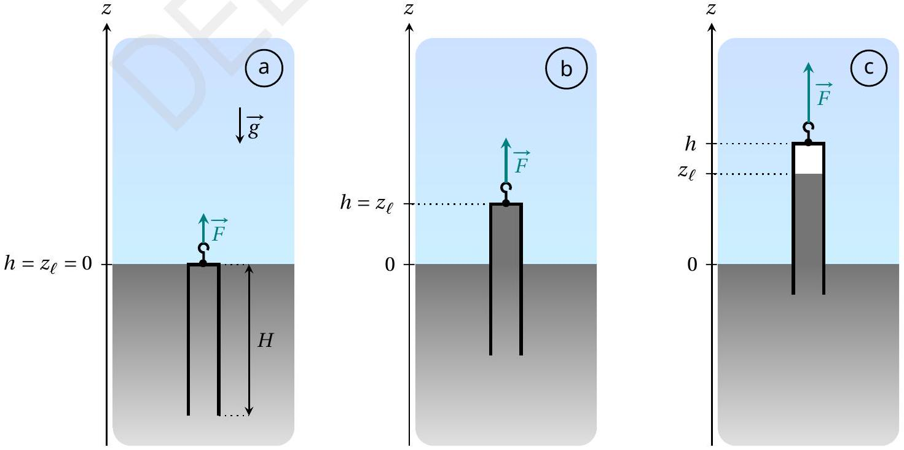
Fig. 2. Sketch of the tube in different configurations

We start from the situation where the tube in Fig. 2 contains no gas and its top is at the bath level: in other words, $h = 0$ and $z _ { \ell } = 0$ (case a). The tube is then slowly lifted until its bottom end reaches the bath level. The pulling force exerted on the tube is denoted $\vec { F } = F \overrightarrow { u _ { z } }$.

A. 1 For the configuration shown in Fig. 2 (case b), express the pressure $P _ { \mathrm { w } }$ in the water at the top of the tube. Also express the force $\vec { F }$ necessary to maintain the tube at this position. Expressions must be written in terms of $P _ { 0 } , \rho , m , S , h , g$ and $\overrightarrow { u _ { z } }$.

0.2pt

SOLUTION:
According to the hydrostatic law, one has

$$
P _ { \mathrm { w } } = P _ { \mathrm { a } } - \rho g h = P _ { 0 } - \rho g h
$$

In the configuration shown in Fig. 2 (case b), the tube is submitted to three forces: its weight, the resultant of the pressure forces and the force exerted by the operator. Thus, at equilibrium, one has

$$
\overrightarrow { 0 } = m \vec { g } + \left( P _ { \mathrm { w } } - P _ { 0 } \right) S \overrightarrow { u _ { z } } + \vec { F }
$$

which leads to

$$
\vec { F } = - [ m + \rho S h ] \vec { g } = [ m + \rho S h ] g \overrightarrow { u _ { z } }
$$

MARKING SCHEME:

| Expression of $P _ { \mathrm { w } }$ (as a function of $P _ { \mathrm { a } }$ or $P _ { 0 }$ ) | 0.1 |
| :--- | :--- |
| Expression of $\vec { F }$ | 0.1 |

Three experiments are performed. In each, the tube is lifted from the initial state shown in Fig. 2(a) under the conditions specified in Table 1.

| Experiment | Liquid | $T _ { \mathrm { a } } \left( { } ^ { \circ } \mathrm { C } \right)$ | $\rho \left( \mathrm { kg } \cdot \mathrm { m } ^ { - 3 } \right)$ | $P _ { \text {sat } } ( \mathrm { Pa } )$ |
| :--- | :--- | :--- | :--- | :--- |
| 1 | Water | 20 | $1.00 \times 10 ^ { 3 }$ | $2.34 \times 10 ^ { 3 }$ |
| 2 | Water | 80 | $0.97 \times 10 ^ { 3 }$ | $47.4 \times 10 ^ { 3 }$ |
| 3 | Water | 99 | $0.96 \times 10 ^ { 3 }$ | $99.8 \times 10 ^ { 3 }$ |

Table 1. Experimental conditions and numerical values of physical quantities for each experiment ( $P _ { \text {sat } }$ designates the saturated vapour pressure of the pure fluid)

In each case, we study the evolution of the force $F$ that must be applied in order to maintain the tube in equilibrium at an altitude $h$, the external pressure being fixed at $P _ { \mathrm { a } } = P _ { 0 } = 1.000 \times 10 ^ { 5 } \mathrm {~Pa}$. Two different behaviours are possible

Behaviour A
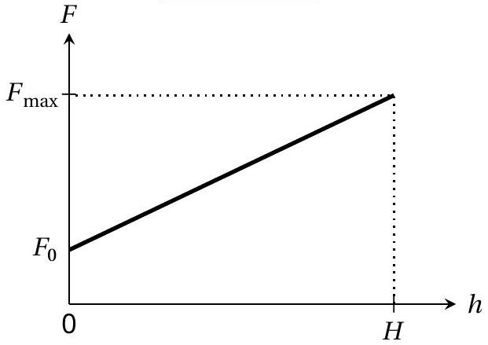

Behaviour B
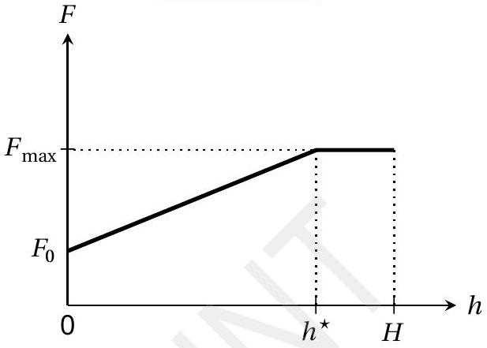

A. 2 For each experiment, complete the table in the answer sheet to indicate the expected behaviour and the numerical values for $F _ { \text {max } }$ and for $h ^ { \star }$ (when pertinent), where $F _ { \text {max } }$ and $h ^ { \star }$ are defined in the figures illustrating the two behaviours.

SOLUTION:
Physically, the altitude $h ^ { \star }$ corresponds to the threshold at which saturated vapour appears in the tube. This altitude can be expressed using the hydrostatic law, writing

$$
P _ { \mathrm { w } } = P _ { 0 } - \rho g h ^ { \star } = P _ { \mathrm { sat } } \left( T _ { \mathrm { a } } \right) .
$$

One can find

$$
h ^ { \star } = \frac { P _ { 0 } - P _ { \mathrm { sat } } \left( T _ { \mathrm { a } } \right) } { \rho g } ,
$$

and calculate its numerical value for each experiment. If the value obtained is higher than $H$, behaviour A is observed; otherwise, behaviour B is observed. According to the previous question, the force $F$ is related to $h$ by

$$
F = [ m + \rho S h ] g
$$

which leads to

$$
F _ { \max } = \begin{cases} { [ m + \rho S H ] g } & \text { for behaviour A } \\ { \left[ m + \rho S h ^ { \star } \right] g } & \text { for behaviour B } \end{cases}
$$

One can deduce the following predictions:

| Experiment | Behaviour (A or B ?) | $h ^ { \star } ( \mathrm { cm } )$ | $F _ { \text {max } }$ (N) |
| :--- | :--- | :--- | :--- |
| 1 | A |  | 14.7 |
| 2 | A |  | 14.4 |
| 3 | B | 2.1 | 5.1 |

MARKING SCHEME:

| All behaviours are correct (*all or nothing*): A/A/B | 0.2 |
| :--- | :--- |
| Experiment 1: Numerical value of $F _ { \text {max } }$ in [14.6, 15] (N) | 0.1 |
| Experiment 2: Numerical value of $F _ { \text {max } }$ in [14, 14.5] (N) | 0.1 |
| Experiment 3: Numerical value of $h ^ { \star }$ in $[ 2,2.2 ]$ (cm) (0.1 pt if only literal expression is correct) | 0.2 |
| Experiment 3: Numerical value of $F _ { \text {max } }$ in [5,5.2] (N) (0.1 pt if only literal expression is correct) | 0.2 |

When we replace the water with liquid mercury (whose properties are given below), behaviour B is observed.

| Liquid | $T _ { \mathrm { a } } \left( { } ^ { \circ } \mathrm { C } \right)$ | $\rho \left( \mathrm { kg } \cdot \mathrm { m } ^ { - 3 } \right)$ | $P _ { \text {sat } } ( \mathrm { Pa } )$ |
| :--- | :--- | :--- | :--- |
| Mercury | 20 | $13.5 \times 10 ^ { 3 }$ | 0.163 |

A. 3 Express the relative error, denoted $\varepsilon$, committed when we evaluate the maximal 0.3pt force $F _ { \text {max } }$ neglecting $P _ { \text {sat } }$ compared to $P _ { 0 }$. Give the numerical value of $\varepsilon$.

SOLUTION:
For behaviour B, the expression of $F _ { \max }$ previously obtained can be reformulated as

$$
F _ { \max } = m g + \left( P _ { 0 } - P _ { \mathrm { sat } } \right) S
$$

Neglecting the saturated vapour pressure compared to the atmospheric pressure, one obtains

$$
F _ { \max } \simeq m g + P _ { 0 } S
$$

Thus, the relative error $\varepsilon$ is given by

$$
\varepsilon = \frac { P _ { \mathrm { sat } } } { P _ { 0 } + m g / S } \simeq 1.6 \times 10 ^ { - 6 }
$$

MARKING SCHEME:

| Literal expression of $\varepsilon$ (with or without $P _ { \text {sat } }$ in denominator) | 0.2 |
| :--- | :--- |
| Numerical value of $\varepsilon$ in $[ 1,2 ] \times 10 ^ { - 6 }$ | 0.1 |

From now on, we work with mercury (density $\rho = 13.5 \times 10 ^ { 3 } \mathrm {~kg} \cdot \mathrm {~m} ^ { - 3 }$ ) at the ambient temperature $T _ { \mathrm { a } } = 20 ^ { \circ } \mathrm { C }$ and we take $P _ { \text {sat } } = 0$.

Let us consider a tube with a reservoir on top, modeled as two superposed cylinders of different dimensions, as shown in Fig. 3.

- the bottom part (still called the tube) has cross-sectional area $S _ { \mathrm { t } }$ and height $H _ { \mathrm { t } } = 80 \mathrm {~cm}$;
- the top part (called the bulb) has cross-sectional area $S _ { \mathrm { b } } > S _ { \mathrm { t } }$ and height $H _ { \mathrm { b } } = 20$ cm.

This two-part tube is dipped into a semi-infinite liquid bath.

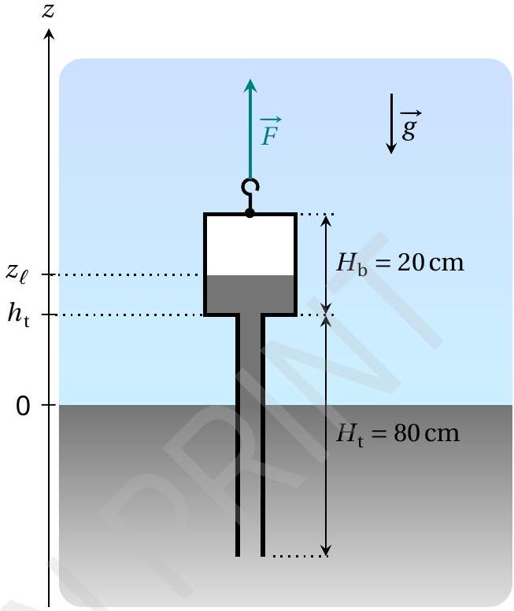
Fig. 3. Sketch of the two-part barometric tube

As in Part A, the system is prepared such that the tube contains no air. We identify the vertical position of the tube by the altitude $h _ { \mathrm { t } }$ of the junction between the tube and the bulb. The height of the column of mercury is again denoted $z _ { \ell }$. The force $\vec { F }$ that must be exerted to maintain the tube in equilibrium in the configuration shown in Fig. 3 can now be written as

$$
\begin{equation*}
\vec { F } = \left( m _ { \mathrm { tb } } + m _ { \mathrm { add } } \right) g \overrightarrow { u _ { z } } \tag{1}
\end{equation*}
$$

where $m _ { \mathrm { tb } }$ is the total mass of the two-part tube (when empty of mercury).

B. 1 On the answer sheet, color the area corresponding to the volume of liquid mer- 0.3pt cury that is responsible for the term $m _ { \text {add } }$ appearing in equation (1).

SOLUTION:
By adapting the reasoning used at part A, one can deduce that the mass $m _ { \text {add } }$ corresponds to the liquid mass in the two-part tube which is above the outside surface of the liquid bath, as shown below.
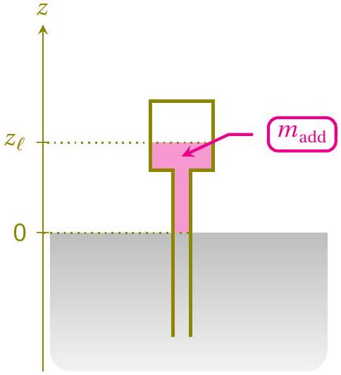

MARKING SCHEME:

| Coloring of the correct area (0.1 pt only if a correct expression of $m _ { \text {add } }$ is provided but the colored area is incorrect) | 0.3 |
| :--- | :--- |

The mass $m _ { \text {add } }$ depends both on the height $h _ { \mathrm { t } }$ and the atmospheric pressure $P _ { \mathrm { a } }$. For the next question, assume that the atmospheric pressure is fixed at $P _ { \mathrm { a } } = P _ { 0 } = 1.000 \times 10 ^ { 5 } \mathrm {~Pa}$. Starting from the situation where the system is completely submerged, the tube is slowly lifted until its base is flush with the liquid bath.

B. 2 Sketch the evolution of the mass $m _ { \text {add } }$ as a function of $h _ { \mathrm { t } }$ for $h _ { \mathrm { t } } \in \left[ - H _ { \mathrm { b } } , H _ { \mathrm { t } } \right]$. On 1.4pt the graph, provide the expression for the slopes of the different segments, as well as the $h _ { \mathrm { t } }$ analytical value of any angular points, in terms of $P _ { 0 } , \rho , g , S _ { \mathrm { b } } , S _ { \mathrm { t } }$, $H _ { \mathrm { b } }$ and $H _ { \mathrm { t } }$.

SOLUTION:
Using the same reasoning as in question A2, one can determine that saturated vapour appears in the two-part barometric tube when the altitude of the liquid column in the tube reaches the critical value

$$
z _ { \ell } ^ { \star } = \frac { P _ { 0 } - P _ { \text {sat } } } { \rho g } = \frac { P _ { 0 } } { \rho g } = 76 \mathrm {~cm}
$$

taking $P _ { \text {sat } } = 0$. Combining this result with that of the previous question, one obtains the following graph:
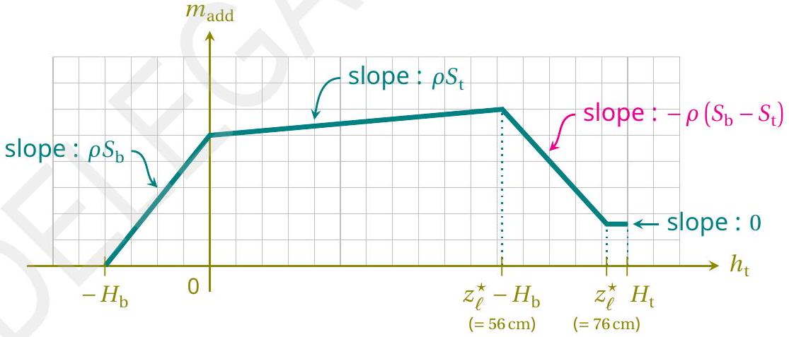

MARKING SCHEME:

| Qualitative aspect: Graph with 4 straight pieces (0.1 pt only if there are 3 pieces; 0 else) | 0.2 |
| :--- | :--- |
| Qualitative aspect: For the 1st \& 2nd pieces, the slopes are positive *and* the slope of 2nd piece is less than that of 1st (*all or nothing*) | 0.2 |
| Qualitative aspect: The 3rd piece has a negative slope | 0.2 |
| Qualitative aspect: The 4th piece has a null slope | 0.2 |
| Expressions of the two first slopes (*all or nothing*) | 0.1 |
| Expression of the negative slope | 0.2 |
| $h _ { \mathrm { t } }$ analytical values of the 3 intermediate angular points (0.1 pt per value) | 0.3 |

As the system is lifted while $P _ { \mathrm { a } } = P _ { 0 } = 10 ^ { 5 } \mathrm {~Pa}$, we stop when the free surface of the liquid is in the middle of the bulb. The value of $h _ { \mathrm { t } }$ is fixed and then we observe variations in the mass $m _ { \text {add } }$ due to variations in the atmospheric pressure described by

$$
\begin{equation*}
P _ { \mathrm { a } } ( t ) = P _ { 0 } + P _ { 1 } ( t ) \tag{2}
\end{equation*}
$$

where $P _ { 0 }$ designates the average value and $P _ { 1 }$ is a perturbative term. We model $P _ { 1 }$ by a periodic triangular function of amplitude $A = 5 \times 10 ^ { 2 } \mathrm {~Pa}$ and period $\tau _ { 1 }$ of 1 week.

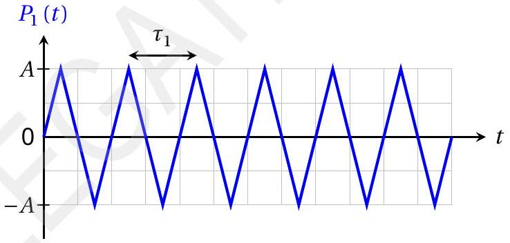
Fig. 4. Simplified model of the perturbative term $P _ { 1 } ( t )$

B. 3 Given that $S _ { \mathrm { t } } = 5 \mathrm {~cm} ^ { 2 }$ and $S _ { \mathrm { b } } = 200 \mathrm {~cm} ^ { 2 }$, express the amplitude $\Delta m _ { \text {add } }$ of the variations of the mass $m _ { \text {add } }$ over time, then give its numerical value. Assume that the liquid surface always stays in the bulb.

SOLUTION:
By neglecting the saturated vapour pressure in the bulb, the altitude $z _ { \ell }$ of the free surface of the liquid in the tube is given by

$$
z _ { \ell } ( t ) = \frac { P _ { \mathrm { a } } ( t ) } { \rho g } = \frac { P _ { 0 } } { \rho g } + \frac { P _ { 1 } ( t ) } { \rho g } = \underbrace { h _ { \mathrm { t } } + \frac { H _ { \mathrm { b } } } { 2 } } _ { \text {mean value } z _ { \ell , 0 } } + \underbrace { \frac { P _ { 1 } ( t ) } { \rho g } } _ { \text {perturbative term } }
$$

which leads to

$$
m _ { \mathrm { add } } ( t ) = \rho \left[ S _ { \mathrm { t } } h _ { \mathrm { t } } + S _ { \mathrm { b } } \left( z _ { \ell } ( t ) - h _ { \mathrm { t } } \right) \right] = \rho \left[ S _ { \mathrm { t } } h _ { \mathrm { t } } + S _ { \mathrm { b } } \left( z _ { \ell , 0 } - h _ { \mathrm { t } } \right) \right] + \frac { S _ { \mathrm { b } } P _ { 1 } ( t ) } { g }
$$

The first term gives the mean value of the mass $m _ { \text {add } } ( t )$, while the last term characterizes its temporal variations. One can deduce the magnitude

$$
\Delta m _ { \mathrm { add } } = \frac { S _ { \mathrm { b } } A } { g } \simeq 1 \mathrm {~kg}
$$

MARKING SCHEME:

| Literal expression of $\Delta m _ { \text {add } }$ | 0.2 |
| :--- | :--- |
| Numerical value *with unit*, in [1 kg, 1.1 kg] | 0.1 |

Part C - Cox's timepiece
The real mechanism developed by Cox is complex (Fig. 5). We study a simplified version, depicted in Fig. 6, and described below

- a cylindrical bottom cistern containing a mercury bath ;
- a two-part barometric tube identical to that studied in part B, which is still completely emptied of any air, is dipped into the bath ;
- the cistern and the two-part tube are each suspended by a cable. Both cables (assumed to be inextensible and of negligible mass) pass through a system of ideal pullies and finish attached to either side of the same mass $M$, which can slide on a horizontal surface ;
- the total volume of liquid mercury contained in the system is $V _ { \ell } = 5 \mathrm {~L}$.

The height, cross-section and masses of each part are given in Table 2. The position of mass $M$ is referenced by the coordinate $x$ of its center of mass. We consider solid friction between the horizontal support and the mass $M$, without distinction between static and dynamic coefficients; the magnitude of this force when sliding occurs is denoted $F _ { \mathrm { s } }$.

Two stops limit the displacement of the mass $M$ such that $- X \leq x \leq X$ (with $X > 0$ ). Assume that the value of $X$ guarantees that

- the bottom of the two-part tube never touches the bottom of the cistern nor comes out of the liquid bath;
- the altitude $z _ { \ell }$ of the mercury column is always in the upper bulb.

Fig. 5. Real Cox's timepiece ${ } ^ { 2 }$ (without mercury)

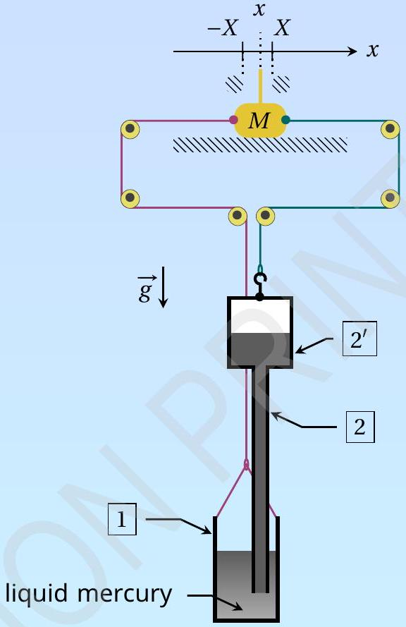
Fig. 6. Sketch of the system modeling the timepiece

| Reference | Name | Height | Cross section area | Empty mass |
| :--- | :--- | :--- | :--- | :--- |
| 1 | cistern | $H _ { \mathrm { c } } = 30 \mathrm {~cm}$ | $S _ { \mathrm { c } } = 210 \mathrm {~cm} ^ { 2 }$ | $m _ { \mathrm { c } }$ |
| 2 | tubular part of the barometric tube | $H _ { \mathrm { t } } = 80 \mathrm {~cm}$ | $S _ { \mathrm { t } } = 5 \mathrm {~cm} ^ { 2 }$ | total mass of the barometric tube : $m _ { \mathrm { tb } }$ |
| 2' | bulb of the barometric tube | $H _ { \mathrm { b } } = 20 \mathrm {~cm}$ | $S _ { \mathrm { b } } = 200 \mathrm {~cm} ^ { 2 }$ |  |

Table 2. Dimensions and notations for the model system

The system evolves in contact with the atmosphere, whose pressure fluctuates as in Fig. 4 (still with amplitude $A = 5 \times 10 ^ { 2 } \mathrm {~Pa}$ and period $\tau _ { 1 } = 1$ week). At the start $t = 0$, the mass $M$ is at rest at $x = 0$ and the tensions exerted by the two cables on either side of the mass $M$ are in balance while $P _ { 1 } ( 0 ) = 0$. We define

$$
\begin{equation*}
\xi = \frac { S _ { \mathrm { b } } + S _ { \mathrm { c } } - S _ { \mathrm { t } } } { S _ { \mathrm { b } } S _ { \mathrm { c } } } \frac { F _ { \mathrm { s } } } { A } \simeq \frac { S _ { \mathrm { b } } + S _ { \mathrm { c } } } { S _ { \mathrm { b } } S _ { \mathrm { c } } } \frac { F _ { \mathrm { s } } } { A } \tag{3}
\end{equation*}
$$

where the last expression uses that $S _ { \mathrm { t } } \ll S _ { \mathrm { b } } , S _ { \mathrm { c } }$ (which we will assume is valid until the end of the problem).
C. 1 Determine the threshold $\xi ^ { \star }$ such that $M$ remains indefinitely at rest when $\xi > \xi ^ { \star }$. 1pt

SOLUTION:
Consider the case in which the mass $M$ stays at rest at $x = 0$. At the start $t = 0$, the tensions exerted by the two cables on either side of the mass $M$ are in balance: the force $F _ { 0 }$ required to suspend the barometric tube (with the fluid it contains) is equal to that required to suspend the cistern (with the fluid it contains). When the atmospheric pressure increases from $P _ { \mathrm { a } } = P _ { 0 }$, the fluid rises in the barometric tube while it descends in the cistern. As a result, the added mass in the tube increases, while the added mass in the cistern decreases. We denote $m _ { 1 , \mathrm { tb } }$ and $m _ { 1 , \mathrm { c } }$ the (algebraic) variation of the apparent masses of each container. Thus, the tensions exerted by the two cables can be written:

- $\left[ F _ { 0 } + m _ { 1 , \mathrm { tb } } g \right] \overrightarrow { u _ { x } }$ for the cable on the right, suspending the tube;
- $\left[ F _ { 0 } + m _ { 1 , \mathrm { c } } g \right] \overrightarrow { u _ { x } }$ for the cable on the left, suspending the cistern.

According to the principle of mass conservation, one can immediately state that $m _ { 1 , \mathrm { tb } } = - m _ { 1 , \mathrm { c } }$. Subsequently, we choose to keep only $m _ { 1 , \mathrm { c } }$ in the expressions (but all the calculations can be carried out while keeping $m _ { 1 , \mathrm { tb } }$ ).

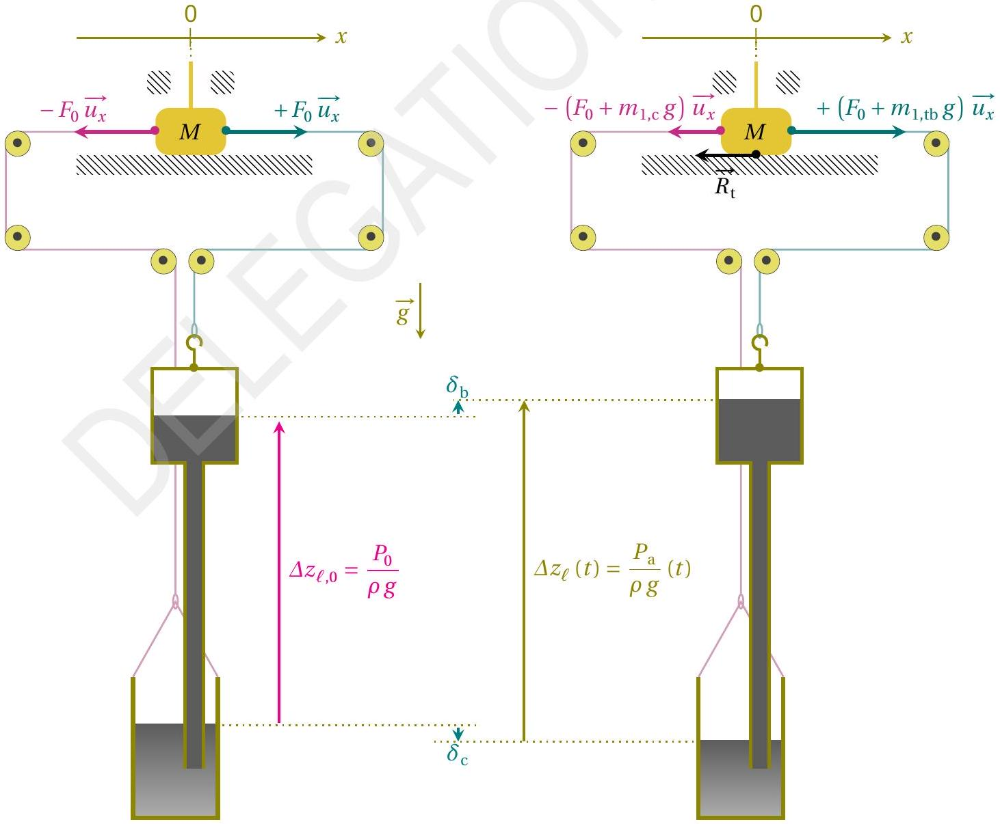
The friction force between the support and the mass $M$ needed to maintain the equilibrium is therefore given by

$$
\overrightarrow { R _ { \mathrm { t } } } = - \left[ F _ { 0 } - m _ { 1 , \mathrm { c } } g \right] \overrightarrow { u _ { x } } + \left[ F _ { 0 } + m _ { 1 , \mathrm { c } } g \right] \overrightarrow { u _ { x } } = 2 m _ { 1 , \mathrm { c } } g \overrightarrow { u _ { x } }
$$

In addition, according to the sketch above (where displacements $\delta _ { \mathrm { b } }$ and $\delta _ { \mathrm { c } }$ are algebraic), we have $m _ { 1 , \mathrm { c } } = \rho S _ { \mathrm { c } } \delta _ { \mathrm { c } }$.

It is now necessary to determine $\delta _ { \mathrm { c } }$. One can use

- the hydrostatic law : $\delta _ { \mathrm { b } } - \delta _ { \mathrm { c } } = \frac { P _ { 1 } } { \rho g }$
- the conservation of the total volume/mass of mercury : $S _ { \mathrm { b } } \delta _ { \mathrm { b } } = - \left[ S _ { \mathrm { c } } - S _ { \mathrm { t } } \right] \delta _ { \mathrm { c } } \simeq - S _ { \mathrm { c } } \delta _ { \mathrm { c } } \quad$ (given that $\left. S _ { \mathrm { t } } \ll S _ { \mathrm { b } } , S _ { \mathrm { c } } \right)$

Solving the system formed by those equations, one finds

$$
\delta _ { \mathrm { c } } = - \frac { S _ { \mathrm { b } } } { S _ { \mathrm { b } } + S _ { \mathrm { c } } - S _ { \mathrm { t } } } \frac { P _ { 1 } } { \rho g } \simeq - \frac { S _ { \mathrm { b } } } { S _ { \mathrm { b } } + S _ { \mathrm { c } } } \frac { P _ { 1 } } { \rho g }
$$

which finally yields

$$
\overrightarrow { R _ { \mathrm { t } } } = - \frac { 2 S _ { \mathrm { b } } S _ { \mathrm { c } } } { S _ { \mathrm { b } } + S _ { \mathrm { c } } - S _ { \mathrm { t } } } P _ { 1 } \overrightarrow { u _ { x } } \simeq - \frac { 2 S _ { \mathrm { b } } S _ { \mathrm { c } } } { S _ { \mathrm { b } } + S _ { \mathrm { c } } } P _ { 1 } \overrightarrow { u _ { x } }
$$

With the triangular model for $P _ { 1 } ( t )$, the maximum static friction force is obtained when $P _ { 1 } = \pm A$. Therefore, according to the Coulomb's law of friction, the mass $M$ stays at rest if and only if

$$
\frac { 2 S _ { \mathrm { b } } S _ { \mathrm { c } } } { S _ { \mathrm { b } } + S _ { \mathrm { c } } - S _ { \mathrm { t } } } A < F _ { \mathrm { s } }
$$

This inequality can be rewritten as

$$
2 < \frac { S _ { \mathrm { b } } + S _ { \mathrm { c } } - S _ { \mathrm { t } } } { S _ { \mathrm { b } } S _ { \mathrm { c } } } \frac { F _ { \mathrm { s } } } { A } = \xi
$$

which allows us to identify

$$
\xi ^ { \star } = 2
$$

MARKING SCHEME:

| Introduction of geometric parameters to locate the positions of the fluid surfaces in each vessel | 0.1 |
| :--- | :--- |
| Expression of mass or volume variation of fluid in at least one of the vessels, in terms of those geometric parameters (with or without using $S _ { \mathrm { t } } \ll S _ { \mathrm { b } } , S _ { \mathrm { c } }$ ) | 0.1 |
| Physical law: Conservation of the total mass/volume | 0.2 |
| Physical law: Expression of barometric difference of heights between the two surfaces | 0.2 |
| Physical law: Expression of the friction force at equilibrium (with or without using $S _ { \mathrm { t } } \ll S _ { \mathrm { b } } , S _ { \mathrm { c } }$ ) | 0.1 |
| Physical law: Use of Coulomb's law in sticky situation | 0.1 |
| Conclusion: Obtaining $\xi ^ { \star }$ | 0.2 |

For the next question only, suppose that the mass $M$ is temporarily blocked at $x = X$.

C. 2 Give an expression for the total tension force $\vec { T } = T \overrightarrow { u _ { x } }$ acting on the mass $M$ due to the tension in two cables at this position, when $P _ { 1 } = 0$, in terms of $\rho , g , X$ and pertinent cross-sections.

SOLUTION:
Let us compare the configurations of the system when $x = 0$ and when $x = X$.

$$
\text { At } x = 0
$$

$$
\text { At } x = X
$$

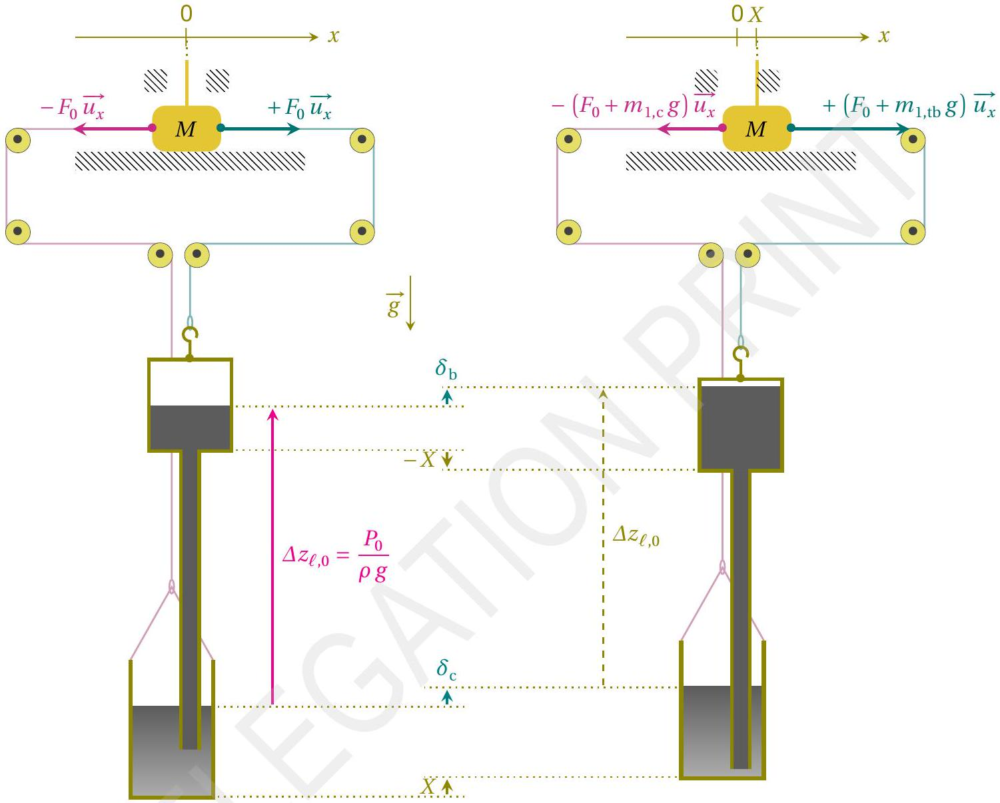
Assuming that the atmospheric pressure is temporarily fixed at $P _ { 0 }$, the difference $\Delta z _ { \ell }$ of fluid heights between the cistern and the barometric tube is the same in both configurations. It is given by $\Delta z _ { \ell , 0 } = P _ { 0 } / \rho g$ and leads to

$$
\delta _ { \mathrm { b } } = \delta _ { \mathrm { c } }
$$

The total volume/mass of mercury is also conserved. This conservation can be expressed by the equation

$$
\underbrace { \left( S _ { \mathrm { c } } - S _ { \mathrm { t } } \right) \delta _ { \mathrm { c } } - \left( S _ { \mathrm { c } } + S _ { \mathrm { t } } \right) X } _ { \begin{array} { c }
\text { volume of mercury } \\
\text { algebraically won by the cistern }
\end{array} } + \underbrace { S _ { \mathrm { b } } \left( \delta _ { \mathrm { b } } + X \right) } _ { \begin{array} { c }
\text { volume of mercury } \\
\text { algebraically won by the bulb }
\end{array} } = 0
$$

which can be reformulated as

$$
S _ { \mathrm { b } } \delta _ { \mathrm { b } } + \left( S _ { \mathrm { c } } - S _ { \mathrm { t } } \right) \delta _ { \mathrm { c } } = \left( S _ { \mathrm { c } } - S _ { \mathrm { b } } + S _ { \mathrm { t } } \right) X
$$

One obtains

$$
\delta _ { \mathrm { b } } = \delta _ { \mathrm { c } } = \frac { S _ { \mathrm { c } } - S _ { \mathrm { b } } + S _ { \mathrm { t } } } { S _ { \mathrm { b } } + S _ { \mathrm { c } } - S _ { \mathrm { t } } } X
$$

Thus, the supplementary added mass in the cistern is given by

$$
m _ { 1 , \mathrm { c } } = \rho S _ { \mathrm { c } } \left( \delta _ { \mathrm { c } } - X \right) = - \rho \frac { 2 S _ { \mathrm { c } } \left( S _ { \mathrm { b } } - S _ { \mathrm { t } } \right) } { S _ { \mathrm { c } } + S _ { \mathrm { b } } - S _ { \mathrm { t } } } X \simeq - \frac { 2 S _ { \mathrm { b } } S _ { \mathrm { c } } } { S _ { \mathrm { b } } + S _ { \mathrm { c } } } \rho X
$$

and, as explained in C1, we still have $m _ { 1 , \mathrm { tb } } = - m _ { 1 , \mathrm { c } }$.
Finally, according to the sketch, one obtain the resultant tension force $\vec { T } = \left( m _ { 1 , \mathrm { tb } } - m _ { 1 , \mathrm { c } } \right) g \overrightarrow { u _ { x } } = - 2 m _ { 1 , \mathrm { c } } g \overrightarrow { u _ { x } }$, that is

$$
\vec { T } = \frac { 4 S _ { \mathrm { c } } \left( S _ { \mathrm { b } } - S _ { \mathrm { t } } \right) } { S _ { \mathrm { b } } + S _ { \mathrm { c } } - S _ { \mathrm { t } } } \rho g X \overrightarrow { u _ { x } } \simeq \frac { 4 S _ { \mathrm { b } } S _ { \mathrm { c } } } { S _ { \mathrm { b } } + S _ { \mathrm { c } } } \rho g X \overrightarrow { u _ { x } }
$$

MARKING SCHEME:

| Introduction of geometric parameters to locate the positions of the fluid surfaces in each vessel | 0.1 |
| :--- | :--- |
| Expressions of mass or volume variations of fluid in one of the vessels in terms of $X$ and those geometric parameters (with or without using $S _ { \mathrm { t } } \ll S _ { \mathrm { b } } , S _ { \mathrm { c } }$ ) | 0.3 |
| Physical law: Conservation of the total mass/volume | 0.2 |
| Physical law: Expression of barometric difference of heights between the two surfaces | 0.2 |
| Expression of the total tension force $\vec { T }$ (with or without using $S _ { \mathrm { t } } \ll S _ { \mathrm { b } } , S _ { \mathrm { c } }$ ) | 0.2 |

When $\xi < \xi ^ { \star }$, starting again from $x = 0$ and $P _ { 1 } = 0$, two different behaviours can be observed for $t \geq 0$. To distinguish them, we need to introduce another parameter

$$
\begin{equation*}
\lambda = \frac { 2 \left( S _ { \mathrm { b } } - S _ { \mathrm { t } } \right) } { S _ { \mathrm { b } } } \frac { \rho g X } { A } \simeq \frac { 2 \rho g X } { A } \tag{4}
\end{equation*}
$$

C. 3 Complete the table in the answer sheet to indicate the condition under which each regime is obtained. Conditions must be expressed as inequalities on $\xi$ and/or $\lambda$. In addition, sketch the variations of $x ( t ) / X$ for $t \in \left[ 0,3 \tau _ { 1 } \right]$ that are consistent with the variations of $P _ { 1 } ( t ) / A$ already present. Specification of remarkable points coordinates is not required.

SOLUTION:
When $\xi < \xi ^ { \star }$, there necessarily exists an instant from which the mass $M$ begins to sweep on the right. From there, the mass $M$ is continuously accelerated by the total tension $\vec { T }$ until it is blocked by the stop at $x = X$. According to Fig. 5, one can assume that $X$ is of the order of a few centimeters, so the time

needed to switch between the two positions $x = 0$ and $x = X$ can reasonably be neglected in front of the period $\tau _ { 1 }$.

Once blocked at $x = X$, the resultant tension $\vec { T }$ can be determined by generalizing the reasoning carried out in the two previous questions. One obtains the following equations:

- hydrostatic law : $\quad \delta _ { \mathrm { b } } - \delta _ { \mathrm { c } } = \frac { P _ { 1 } } { \rho g }$
- conservation of the volume/mass: $\quad S _ { \mathrm { b } } \delta _ { \mathrm { b } } + \left( S _ { \mathrm { c } } - S _ { \mathrm { t } } \right) \delta _ { \mathrm { c } } = \left( S _ { \mathrm { c } } - S _ { \mathrm { b } } + S _ { \mathrm { t } } \right) X$

The resolution of this system gives

$$
\delta _ { \mathrm { c } } = \frac { S _ { \mathrm { c } } - S _ { \mathrm { b } } + S _ { \mathrm { t } } } { S _ { \mathrm { b } } + S _ { \mathrm { c } } - S _ { \mathrm { t } } } X - \frac { S _ { \mathrm { b } } } { S _ { \mathrm { b } } + S _ { \mathrm { c } } - S _ { \mathrm { t } } } \frac { P _ { 1 } } { \rho g }
$$

from which we deduce the perturbative added mass

$$
m _ { 1 , \mathrm { c } } = \rho S _ { \mathrm { c } } \left( \delta _ { \mathrm { c } } - X \right) = - \rho \left[ \frac { 2 S _ { \mathrm { c } } \left( S _ { \mathrm { b } } - S _ { \mathrm { t } } \right) } { S _ { \mathrm { b } } + S _ { \mathrm { c } } - S _ { \mathrm { t } } } X + \frac { S _ { \mathrm { b } } S _ { \mathrm { c } } } { S _ { \mathrm { b } } + S _ { \mathrm { c } } - S _ { \mathrm { t } } } \frac { P _ { 1 } } { \rho g } \right] = - m _ { 1 , \mathrm { tb } }
$$

Then finally

$$
\vec { T } = - 2 m _ { 1 , \mathrm { c } } g \overrightarrow { u _ { x } } = \left[ \frac { 4 S _ { \mathrm { c } } \left( S _ { \mathrm { b } } - S _ { \mathrm { t } } \right) } { S _ { \mathrm { b } } + S _ { \mathrm { c } } - S _ { \mathrm { t } } } \rho g X + \frac { 2 S _ { \mathrm { b } } S _ { \mathrm { c } } } { S _ { \mathrm { b } } + S _ { \mathrm { c } } - S _ { \mathrm { t } } } P _ { 1 } \right] \overrightarrow { u _ { x } }
$$

According to Coulomb's law of friction, the mass $M$ will stay at rest at the position $x = X$ while $\vec { T } \cdot \overrightarrow { u _ { x } } > - F _ { \mathrm { s } }$. With the model adopted for $P _ { 1 } ( t )$, this condition is always satisfied if

$$
\frac { 4 S _ { \mathrm { c } } \left( S _ { \mathrm { b } } - S _ { \mathrm { t } } \right) } { S _ { \mathrm { b } } + S _ { \mathrm { c } } - S _ { \mathrm { t } } } \rho g X - \frac { 2 S _ { \mathrm { b } } S _ { \mathrm { c } } } { S _ { \mathrm { b } } + S _ { \mathrm { c } } - S _ { \mathrm { t } } } A > - F _ { s }
$$

Hence, using the parameters $\xi$ and $\lambda$, one can identify the two possible regimes :

- Regime 1: $\xi + 2 \lambda > 2$ (once at $x = X$, the mass $M$ stays indefinitely at rest)
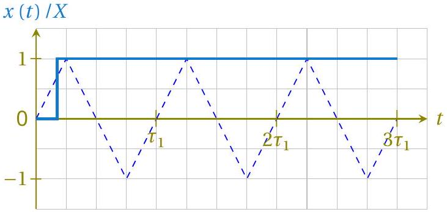
- Regime 2 : $\xi + 2 \lambda < 2$ (once at $x = X$, the mass $M$ will periodically sweep between the two stops)

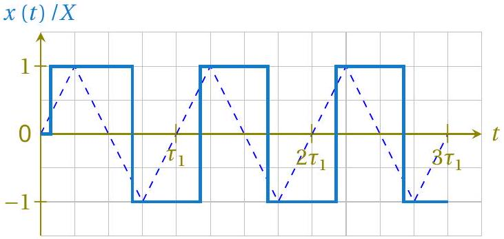

MARKING SCHEME:

| Expression for $\vec { T }$ in the general case, containing both $P _ { 1 }$ and $X$ terms. | 0.2 |
| :--- | :--- |
| At least one inequality is correct (without considering strict or large) | 0.2 |
| Both inequalities are correct (without considering strict or large) | 0.1 |
| Global appearance of *both* graphs: one seems to show an aperiodic behaviour, the other a periodic behaviour (*all or nothing*) | 0.2 |
| Global appearance: each graph is in accordance with the correct sign of obtained inequality (focus on symbols > /<, without considering if the inequality is strict or large) | 0.2 |
| Either graph 1 or 2 shows: A first switch from $x = 0$ to $x = X$ that begins somewhere in the interval $t \in \left( 0 , \frac { \tau _ { 1 } } { 4 } \right]$ | 0.2 |
| Either graph 1 or 2 shows: The switch is instantaneous | 0.2 |
| Graph in aperiodic regime: $x = X$ for all times after the first switch | 0.1 |
| Graph in periodic regime: the behaviour is periodic with period $\tau _ { 1 }$ (except for the first switch) | 0.1 |
| Graph in periodic regime: the positive and negative parts of the graph are similar | 0.2 |
| Graph in periodic regime: $x ( t ) / X$ is described by a rectangular function, of magnitude 1 and duty cycle 50\% in steady state | 0.2 |
| Graph in periodic regime: the first step at $x = X$ last longer than others | 0.1 |

In the real Cox's timepiece, energy provided by the mechanism is stored using a system of ratchets and used to raise a counterweight, like in a traditional clock. In the simplified model studied here, the energy recovered by the clock corresponds to the energy dissipated by the friction force exerted by the horizontal surface on the mass $M$. From now on, we assume that the system is dimensioned such that to work in the regime that allows the clock to recuperate energy. We also assume that the permanent regime is established. We denote $W$ the energy dissipated by the solid friction force during a period $\tau _ { 1 }$, which can be expressed only in terms of $F _ { \mathrm { s } }$ and $X$.

All else equal, $F _ { \mathrm { s } }$ and $X$ can be adjusted to maximize the energy $W$; we denote $F _ { \mathrm { s } } ^ { \star }$ and $X ^ { \star }$ their respective values in the optimal situation.

C. 4 Considering $S _ { \mathrm { b } } \simeq S _ { \mathrm { c } }$ and $S _ { \mathrm { t } } \ll S _ { \mathrm { b } }$, determine the expressions for $F _ { \mathrm { s } } ^ { \star }$ and $X ^ { \star }$ as 1pt functions of $\rho , g , S _ { \mathrm { c } }$ and $A$. Express the corresponding maximum energy $W ^ { \star }$, then calculate its numerical value with $A = 5 \times 10 ^ { 2 } \mathrm {~Pa}$.

SOLUTION:
During a period, there is one motion to the left and one to the right. The total length of the displacement is $4 X$. The total work $W$ of the friction force is thus $W = 4 F _ { \mathrm { S } } X$.

We have to optimize this quantity with the constraint $\xi + 2 \lambda \leq 2$, which can also be written as

$$
\frac { 2 \rho g X } { A } + \frac { F _ { \mathrm { s } } } { S _ { \mathrm { c } } A } \leq 1
$$

The optimum is obtained at the limit of the condition, when $F _ { \mathrm { S } } = S _ { \mathrm { c } } ( A - 2 \rho g X )$. The work is then $W = 4 X S _ { \mathrm { c } } ( A - 2 \rho g X )$. It is maximal for

$$
X ^ { \star } = \frac { A } { 4 \rho g } \quad \text { and } \quad F _ { \mathrm { s } } ^ { \star } = \frac { A S _ { \mathrm { c } } } { 2 }
$$

leading to the following optimal work

$$
W ^ { \star } = \frac { A ^ { 2 } S _ { \mathrm { c } } } { 2 \rho g } \simeq 20 \mathrm {~mJ}
$$

MARKING SCHEME:

| Starting point: $W = 4 F _ { \mathrm { s } } X$ | 0.2 |
| :--- | :--- |
| Optimization: $\xi + 2 \lambda = 2$ or equivalent $F _ { \mathrm { s } } = S _ { \mathrm { c } } ( A - 2 g X )$ | 0.3 |
| Expression of $X ^ { \star }$ | 0.1 |
| Expression of $F _ { \mathrm { s } } ^ { \star }$ | 0.1 |
| Expression of $W ^ { \star }$ | 0.2 |
| Numerical value for $W ^ { \star }$ *with unit*: in [19 mJ, 21 mJ] | 0.1 |

We denote $W _ { \mathrm { pr } } ^ { \star }$ the work of atmospheric pressure forces received by the system in the optimal situation during a period $\tau _ { 1 }$.

C. 5 Express $W _ { \mathrm { pr } } ^ { \star }$, then calculate the ratio $W ^ { \star } / W _ { \mathrm { pr } } ^ { \star }$. It could be useful to represent the 1.7pt evolution of the system in a ( $P , V$ ) diagram, where $V$ is the system's volume.

SOLUTION:
The variations of pressure and of the vessel's position lead to fluid transfer between the cistern and the two-part tube. As a consequence, the total volume $V ( t )$ occupied by the system in the atmosphere changes and can be denoted

$$
V ( t ) = V _ { 0 } + V _ { 1 } ( t )
$$

where $V _ { 0 }$ is the volume in the initial state (when $x = 0$ and $P _ { \mathrm { a } } = P _ { 0 }$ ) whereas $V _ { 1 } ( t )$ is a perturbation term. Physically, $V _ { 1 }$ corresponds to the change of the volume of liquid in the cistern, and is thus given by

$$
V _ { 1 } = \frac { m _ { 1 , \mathrm { c } } } { \rho }
$$

where $m _ { 1 , \mathrm { c } }$ has already been expressed in C3 (just replace $X$ with $x ( t )$ ). Given that $S _ { \mathrm { b } } \simeq S _ { \mathrm { c } }$ and $S _ { \mathrm { t } }$ is neglected, one obtains in any state

$$
V _ { 1 } ( t ) = - S _ { \mathrm { c } } \left[ x ( t ) + \frac { P _ { 1 } ( t ) } { 2 \rho g } \right] = - S _ { \mathrm { c } } X \left[ \frac { x ( t ) } { X } + \frac { 1 } { \lambda } \frac { P _ { 1 } ( t ) } { A } \right]
$$

Over one period, the work of atmospheric pressure forces received by the system is defined as

$$
W _ { \mathrm { pr } } = \oint _ { 1 \text { period } } - P _ { \mathrm { a } } \mathrm {~d} V = - \oint _ { 1 \text { period } } P _ { 1 } \mathrm {~d} V _ { 1 }
$$

and can thus be identified to the area of the cycle described by the system in a $\left( P _ { 1 } , V _ { 1 } \right)$ diagram.
Considering the optimal situation determined in the previous question, one observes the following behaviour once in steady state
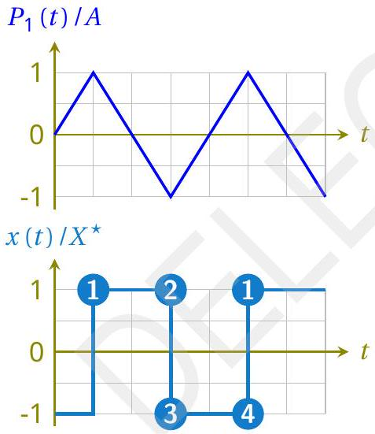

| State | $P _ { 1 }$ | $x$ | $V _ { 1 }$ |
| :--- | :--- | :--- | :--- |
| 1 | $A$ | $X ^ { \star }$ | $- 3 S _ { \mathrm { c } } X ^ { \star }$ |
| 2 | $- A$ | $X ^ { \star }$ | $S _ { \mathrm { c } } X ^ { \star }$ |
| 3 | $- A$ | $- X ^ { \star }$ | $3 S _ { \mathrm { c } } X ^ { \star }$ |
| 4 | $A$ | $- X ^ { \star }$ | $- S _ { \mathrm { c } } X ^ { \star }$ |

Therefore, one can draw the following cycle in a $\left( P _ { 1 } , V _ { 1 } \right)$ diagram

English (Official)
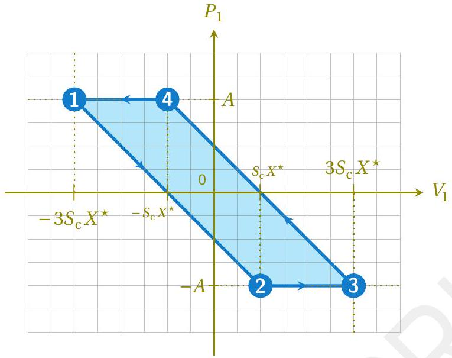
The work of the pressure force is the surface area inside this parallelogram, that is the product of its base $2 S _ { \mathrm { C } } X ^ { \star }$ by its height $2 A$. As a consequence

$$
W _ { \mathrm { pr } } ^ { \star } = 4 S _ { \mathrm { c } } X ^ { \star } A = \frac { S _ { \mathrm { c } } A ^ { 2 } } { \rho g }
$$

and

$$
\frac { W ^ { \star } } { W _ { \mathrm { pr } } ^ { \star } } = \frac { 1 } { 2 }
$$

MARKING SCHEME:

| Physical analysis: In the optimal case, the mass $M$ switches between the two positions $x = \pm X$ when $P _ { 1 } = \pm A$ | 0.1 |
| :--- | :--- |
| Physical analysis: During a period, the system describes a cycle formed of 2 iso- $x$ and 2 iso- $P$ transformations (sketch of cycle, or a table or any other pertinent description) | 0.2 |
| Physical analysis: Correct sequence of the successive states and/or direction of the cycle using $x$ and $P$ | 0.2 |
| General expression of the volume of the system in an $( P , x )$ state: $V = - S _ { \mathrm { c } } \left[ x + \frac { P _ { 1 } } { 2 \rho g } \right] +$ Cste | 0.3 |
| Expressions of the volume in the 4 states of the cycle: $- 3 S _ { \mathrm { c } } X ^ { \star } \longrightarrow S _ { \mathrm { c } } X ^ { \star } \longrightarrow 3 S _ { \mathrm { c } } X ^ { \star } \longrightarrow - S _ { \mathrm { c } } X ^ { \star }$ (*all or nothing*) | 0.2 |
| Method used to calculate the work of atmospheric pressure forces: $W _ { \mathrm { pr } } = - \oint _ { 1 \text { period } } P _ { \mathrm { a } } \mathrm { d } V$ (explicit integral or area of the cycle in $( P , V )$ diagram or other pertinent method) | 0.2 |
| Obtaining $W _ { \text {pr } } ^ { \star } = 4 S _ { \mathrm { c } } X ^ { \star } A = \frac { S _ { \mathrm { c } } A ^ { 2 } } { \rho g }$ | 0.2 |
| Final result: $\frac { W ^ { \star } } { W _ { \mathrm { pr } } ^ { \star } } = \frac { 1 } { 2 }$ | 0.3 |

Credits:

\[1]: Bruno Vacaro;
\[2]: Victoria and Albert Museum, London.
