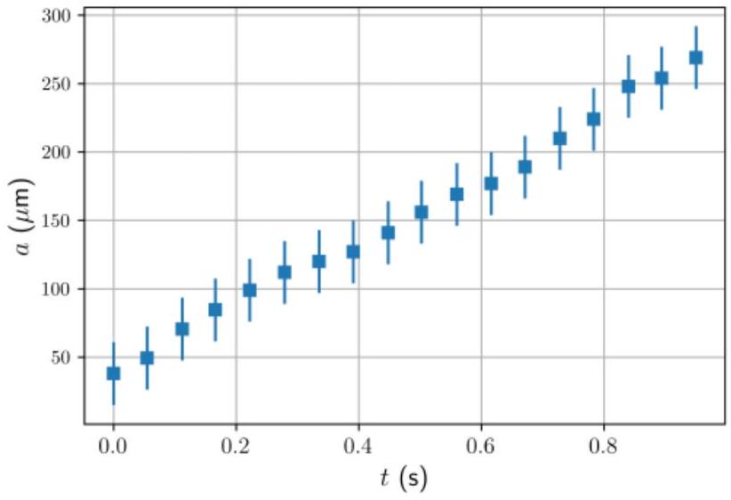
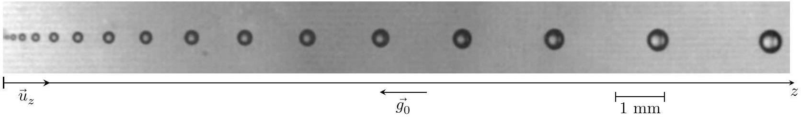
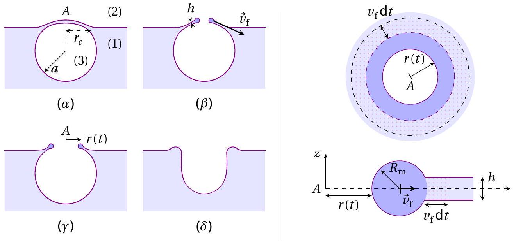
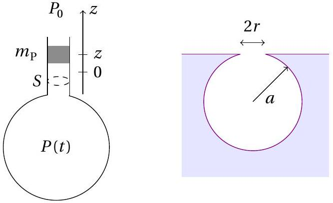
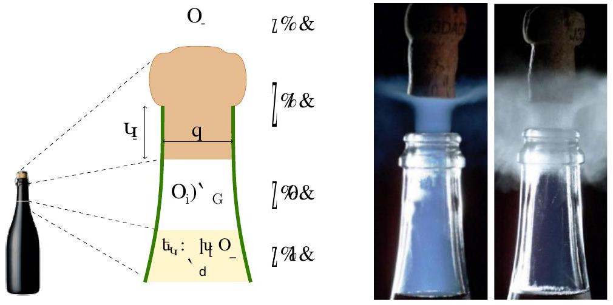

## Champagne! (10 points)

Warning: Excessive alcohol consumption is harmful to health and drinking alcohol below legal age is prohibited.

Champagne is a French sparkling wine. Fermentation of sugars produces carbon dioxide ( $\mathrm { CO } _ { 2 }$ ) in the bottle. The molar concentration of $\mathrm { CO } _ { 2 }$ in the liquid phase $c _ { \ell }$ and the partial pressure $P _ { \mathrm { CO } _ { 2 } }$ in the gas phase are related by $c _ { \ell } = k _ { \mathrm { H } } P _ { \mathrm { CO } _ { 2 } }$, known as Henry's law and where $k _ { \mathrm { H } }$ is called Henry's constant.

Data

- Surface tension of champagne $\sigma = 47 \times 10 ^ { - 3 } \mathrm {~J} \cdot \mathrm {~m} ^ { - 2 }$
- Density of the liquid $\rho _ { \ell } = 1.0 \times 10 ^ { 3 } \mathrm {~kg} \cdot \mathrm {~m} ^ { - 3 }$
- Henry's constant at $T _ { 0 } = 20 ^ { \circ } \mathrm { C } , k _ { \mathrm { H } } \left( 20 ^ { \circ } \mathrm { C } \right) = 3.3 \times 10 ^ { - 4 } \mathrm {~mol} \cdot \mathrm {~m} ^ { - 3 } \cdot \mathrm {~Pa} ^ { - 1 }$
- Henry's constant at $T _ { 0 } = 6 ^ { \circ } \mathrm { C } , k _ { \mathrm { H } } \left( 6 { } ^ { \circ } \mathrm { C } \right) = 5.4 \times 10 ^ { - 4 } \mathrm {~mol} \cdot \mathrm {~m} ^ { - 3 } \cdot \mathrm {~Pa} ^ { - 1 }$
- Atmospheric pressure $P _ { 0 } = 1 \mathrm { bar } = 1.0 \times 10 ^ { 5 } \mathrm {~Pa}$
- Gases are ideal with an adiabatic coefficient $\gamma = 1.3$

Fig. 1. A glass filled with champagne.

## Part A. Nucleation, growth and rise of bubbles

Immediately after opening a bottle of champagne at temperature $T _ { 0 } = 20 ^ { \circ } \mathrm { C }$, we fill a glass. The pressure in the liquid is $P _ { 0 }$ and its temperature stays constant at $T _ { 0 }$. The concentration $c _ { \ell }$ of dissolved $\mathrm { CO } _ { 2 }$ exceeds the equilibrium concentration and we study the nucleation of a $\mathrm { CO } _ { 2 }$ bubble. We note $a$ its radius and $P _ { \mathrm { b } }$ its inner pressure.
A. 1 Express the pressure $P _ { \mathrm { b } }$ in terms of $P _ { 0 } , a$ and $\sigma$. 0.2pt

SOLUTION:

$$
\text { A.1. Laplace's law: } P _ { \mathrm { b } } = P _ { 0 } + \frac { 2 \sigma } { a }
$$

0.2

In the liquid, the concentration of dissolved $\mathrm { CO } _ { 2 }$ depends on the distance to the bubble. At long distance we recover the value $c _ { \ell }$ and we note $c _ { \mathrm { b } }$ the concentration close to the bubble surface. According to Henry's law, $c _ { \mathrm { b } } = k _ { \mathrm { H } } P _ { \mathrm { b } }$. We furthermore assume in all the problem that bubbles contain only $\mathrm { CO } _ { 2 }$.

Since $c _ { \ell } \neq c _ { \mathrm { b } } , \mathrm { CO } _ { 2 }$ molecules diffuse from areas of high to low concentration. We assume also that any molecule from the liquid phase reaching the bubble surface is transferred to the vapour.
A. 2 Express the critical radius $a _ { \mathrm { c } }$ above which a bubble is expected to grow in terms 0.5pt of $P _ { 0 } , \sigma , c _ { \ell }$ and $c _ { 0 }$ where $c _ { 0 } = k _ { \mathrm { H } } P _ { 0 }$. Calculate numerically $a _ { \mathrm { c } }$ for $c _ { \ell } = 4 c _ { 0 }$.

SOLUTION:
A.2.1. $a _ { \mathrm { c } }$ is so $c _ { \ell } = c _ { \mathrm { b } }$
A.2.2. $c _ { \mathrm { b } } = k _ { \mathrm { H } } P _ { \mathrm { b } } = k _ { \mathrm { H } } \left( P _ { 0 } + \frac { 2 \sigma } { a } \right)$ and $c _ { 0 } = k _ { \mathrm { H } } P _ { 0 }$ so $a _ { \mathrm { c } } = \frac { 2 \sigma } { P _ { 0 } \left( c _ { \ell } / c _ { 0 } - 1 \right) }$

A.2.3. $a _ { \mathrm { c } } = 0.3 \mu \mathrm {~m}$

| A.2.1. comparison (equality $c _ { \mathrm { b } } = c _ { \ell }$ or inequality $c _ { \mathrm { b } } \leq c _ { \ell }$ ) | 0.1 |
| :--- | :--- |
| A.2.2. exact expression $a _ { \mathrm { c } } = \frac { 2 \sigma } { P _ { 0 } \left( c _ { \ell } / c _ { 0 } - 1 \right) }$ | 0.2 |
| A.2.3. numerical value $a _ { \mathrm { c } } = 0.3 \mu \mathrm {~m}$ | 0.2 |

In practice, bubbles mainly grow from pre-existing gas cavities. Consider then a bubble with initial radius $a _ { 0 } \approx 40 \mu \mathrm {~m}$. The number of moles of $\mathrm { CO } _ { 2 }$ transferred at the bubble's surface per unit area and time is noted $j$. Two models are possible for $j$.

- model (1) $j = \frac { D } { a } \left( c _ { \ell } - c _ { \mathrm { b } } \right)$ where $D$ is the diffusion coefficient of $\mathrm { CO } _ { 2 }$ in the liquid.
- model (2) $j = K \left( c _ { \ell } - c _ { \mathrm { b } } \right)$ where $K$ is a constant here.

Experimentally, the bubble radius $a ( t )$ is found to depend on time as shown in Fig. 2. Here $c _ { \ell } \approx 4 c _ { 0 }$, and since bubbles are large enough to be visible, the excess pressure due to surface tension can be neglected and $P _ { \mathrm { b } } \approx P _ { 0 }$.

A. 3 Express the number of $\mathrm { CO } _ { 2 }$ moles in the bubble $n _ { \mathrm { c } }$ in terms of $a , P _ { 0 } , T _ { 0 }$ and ideal gas constant $R$. Find $a ( t )$ for both models. Indicate which model explains the experimental results in Fig. 2. Depending on your answer, calculate numerically $K$ or $D$.

Fig. 2. Time evolution of $\mathrm { CO } _ { 2 }$ bubble radius in a glass of champagne (adapted from [1]).

SOLUTION:

A. 3.1. The number of moles of $\mathrm { CO } _ { 2 }$ (ideal gas) inside the bubble is $n _ { \mathrm { c } } = \frac { 4 } { 3 } \pi a ^ { 3 } \frac { P _ { 0 } } { R T _ { 0 } }$
A. 3.2. Equation : balance of $\mathrm { CO } _ { 2 }$ in the bubble
A. 3.3 $\frac { \mathrm { d } n _ { \mathrm { c } } } { \mathrm { d } t } = 4 \pi a ^ { 2 } \frac { \mathrm {~d} a } { \mathrm {~d} t } \frac { P _ { 0 } } { R T } = j 4 \pi a ^ { 2 } \Rightarrow \frac { \mathrm {~d} a } { \mathrm {~d} t } = j \frac { R T } { P _ { 0 } }$
A. 3.4. Model 1: $\frac { \mathrm { d } a } { \mathrm {~d} t } = \frac { D R T } { a P _ { 0 } } \left( c _ { \ell } - c _ { 0 } \right)$ so $a ^ { 2 } = a _ { 0 } ^ { 2 } + \frac { 2 D R T _ { 0 } } { P _ { 0 } } \left( c _ { \ell } - c _ { 0 } \right) t$

A. 3.5. Model 2: $\frac { \mathrm { d } a } { \mathrm {~d} t } = \frac { K R T _ { 0 } } { P _ { 0 } } \left( c _ { \ell } - c _ { 0 } \right)$ so $a = a _ { 0 } + \frac { K R T _ { 0 } } { P _ { 0 } } \left( c _ { \ell } - c _ { 0 } \right) t$
A. 3.6. Experimental data : $\frac { \mathrm { d } a } { \mathrm {~d} t }$ is constant: model 2
A. 3.7 Slope of the experimental data : $\dot { a } \approx 150 / 0.62 \approx 0.24 \mathrm {~mm} \cdot \mathrm {~s} ^ { - 1 }$
A. 3.8 $K = 1.0 \times 10 ^ { - 4 } \mathrm {~m} \cdot \mathrm {~s} ^ { - 1 }$

| A.3.1. $n _ { \mathrm { c } } = \frac { 4 } { 3 } \pi a ^ { 3 } \frac { P _ { 0 } } { R T _ { 0 } }$ | 0.1 |
| :--- | :--- |
| A.3.2. any equation that that can be interpreted as a particule balance | 0.1 |
| A.3.3. equation between $\dot { a }$ (or $\dot { n } _ { \mathrm { c } }$ ) and $j$ | 0.2 |
| A.3.4. model $1 a$ exact with $a _ { 0 }$ present | 0.2 |
| A.3.5. model $2 a$ exact with $a _ { 0 }$ present | 0.2 |
| A.3.6. model 2 | 0.1 |
| A.3.7. value of the slope: total mark only if $\frac { \mathrm { d } a } { \mathrm {~d} t }$ is in range $[ 210 - 250 ] \mu \mathrm { m } \cdot \mathrm { s } ^ { - 1 }$ | 0.1 |
| A.3.8. any value of $K$ in range $[ 0.9 - 1.1 ] \times 10 ^ { - 4 } \mathrm {~m} \cdot \mathrm {~s} ^ { - 1 }$ | 0.2 |

Eventually bubbles detach from the bottom of the glass and continue to grow while rising. Fig. 3. shows a train of bubbles. The bubbles of the train have the same initial radius and are emitted at a constant frequency $f _ { \mathrm { b } } = 20 \mathrm {~Hz}$.

Fig. 3. A train of bubbles. The photo is rotated horizontally for the page layout (adapted from [1]).

For the range of velocities studied here, the drag force $F$ on a bubble of radius $a$ moving at velocity $v$ in a liquid of dynamic viscosity $\eta$ is given by Stokes' law $F = 6 \pi \eta a v$. Measurements show that at any moment in time, the bubble can be assumed to be travelling at its terminal velocity.

A. 4 Give the expression of the main forces exerted on a vertically rising bubble. 0.8pt Obtain the expression of $v ( a )$. Give a numerical estimate of $\eta$ using $\rho _ { \ell } , g _ { 0 }$ and quantities measured on Fig. 3.

SOLUTION:
A.4.1. Main forces: buoyancy $\frac { 4 } { 3 } \pi a ^ { 3 } \rho _ { \ell } g _ { 0 }$, drag force $6 \pi \eta a v$, weight is negligible: $\frac { \rho _ { \mathrm { CO } _ { 2 } } } { \rho _ { \ell } } = \frac { P _ { e } M _ { \mathrm { CO } _ { 2 } } } { R T \rho _ { \ell } } \approx 10 ^ { - 3 }$ : $m _ { \mathrm { b } } \ll m _ { \ell }$
A.4.2. Simplified equation is a balance between buoyancy and drag force $\frac { 4 } { 3 } \pi a ^ { 3 } \rho _ { \ell } g _ { 0 } = 6 \pi \eta a \nu$ so $v = \frac { 2 } { 9 \eta } a ^ { 2 } \rho _ { \ell } g _ { 0 }$.
A.4.3. Time between two bubbles: $\Delta t = 1 / f _ { \mathrm { b } }$

A.4.4. Using $\eta = \frac { 2 \rho _ { \ell } g _ { 0 } } { 9 } \times \frac { a ^ { 2 } } { v }$ for the penultimate bubble ( $n - 1$ ) with $a _ { n - 1 } \approx 0.19 \mathrm {~mm}$

A. 4.5. $v \left( t _ { n - 1 } \right) = \frac { z \left( t _ { n } \right) - z \left( t _ { n - 2 } \right) } { 2 \times f _ { \mathrm { b } } ^ { - 1 } } = 4.5 \mathrm {~cm} \cdot \mathrm {~s} ^ { - 1 }$
A. 4.6. $\eta \approx 2 \times 10 ^ { - 3 } \mathrm {~Pa} \cdot \mathrm {~s}$

| A.4.1. Expression of main forces (gravity force present or absent): fullmark | 0.1 |
| :--- | :--- |
| A.4.2. expression $v = \frac { 2 } { 9 \eta } a ^ { 2 } \rho _ { \ell } g _ { 0 }$ (full mark on this point with or without the gravity force) | 0.2 |
| A.4.3. taking account of the time during two positions $\Delta t = 1 / f _ { \mathrm { b } } = 5 \times 10 ^ { - 2 } \mathrm {~s}$ | 0.1 |
| A.4.4. full mark for one coherent value of the radius measured on Fig.3. last bubble in $[ 0.20 - 0.30 ] \mathrm { mm }$ penultimate bubble : radius in $[ 0.16 - 0.24 ] \mathrm { mm }$ antepenultimate bubble : radius in $[ 0.14 - 0.22 ] \mathrm { mm }$ | 0.1 |
| A.4.5. full mark for one coherent value of the velocity measured on Fig.3. last bubble $v \in [ 4.3,4.8 ] \mathrm { cm } \cdot \mathrm { s } ^ { - 1 }$ penultimate bubble $v \in [ 4.2,4.6 ] \mathrm { cm } \cdot \mathrm { s } ^ { - 1 }$ antepenultimate bubble $\nu \in [ 3.7 - 4.2 ] \mathrm { cm } \cdot \mathrm { s } ^ { - 1 }$ | 0.1 |
| A.4.6. full mark for any value or $\eta$ in range $[ 1.0 - 4.0 ] 10 ^ { - 3 } \mathrm {~Pa} \cdot \mathrm {~s}$ | 0.2 |

The quasi-stationary growth of bubbles with rate $q _ { a } = \frac { \mathrm { d } a } { \mathrm {~d} t }$ still applies during bubble rise.

A. 5 Express the radius $a _ { H _ { \ell } }$ of a bubble reaching the free surface in terms of height travelled $H _ { \ell }$, growth rate $q _ { a } = \frac { \mathrm { d } a } { \mathrm {~d} t }$, and any constants you may need. Assume $a _ { H _ { \ell } } \gg a _ { 0 }$ and $q _ { a }$ constant, and give the numerical value of $a _ { H _ { \ell } }$ with $H _ { \ell } = 10 \mathrm {~cm}$ and $q _ { a }$ corresponding to Fig. 2.

0.5pt

SOLUTION:
A.5.1. $v = \frac { \mathrm { d } z } { \mathrm {~d} t } = \frac { 2 \rho _ { \ell } g _ { 0 } } { 9 \eta } a ^ { 2 }$ and $\frac { \mathrm { d } a } { \mathrm {~d} t } = q _ { a }$ so $\frac { \mathrm { d } z } { \mathrm {~d} a } = \frac { 2 \rho _ { \ell } g _ { 0 } } { 9 q _ { a } \eta } a ^ { 2 }$
Neglecting $a ( z = 0 ) , z = \frac { 2 \rho _ { \ell } g _ { 0 } } { 27 q _ { a } \eta } a ^ { 3 }$ so $a _ { H _ { \ell } } = \left( \frac { 27 q _ { a } \eta H _ { \ell } } { 2 \rho _ { \ell } g _ { 0 } } \right) ^ { 1 / 3 }$
A.5.2. $a _ { H _ { \ell } } = 3.9 \times 10 ^ { - 4 } \mathrm {~m}$ for $\eta = 2.0 \times 10 ^ { - 3 } \mathrm {~Pa} \cdot \mathrm {~s}$

| A.5.1. $a _ { H _ { \ell } } = \left( \frac { 27 q _ { a } \eta H _ { \ell } } { 2 \rho _ { \ell } g _ { 0 } } \right) ^ { 1 / 3 }$ | 0.3 |
| :--- | :--- |
| A.5.2. full mark if $a _ { H _ { \ell } } \in [ 0.36 - 0.49 ] \mathrm { mm }$ | 0.2 |

There are $N _ { \mathrm { b } }$ nucleation sites of bubbles. Assume that the bubbles are nucleated at a constant frequency

$f _ { \mathrm { b } }$ at the bottom of a glass of champagne (height $H _ { \ell }$ for a volume $V _ { \ell }$ ), with $a _ { 0 }$ still negligible. Neglect diffusion of $\mathrm { CO } _ { 2 }$ at the free surface.

A. 6 Write the differential equation for $c _ { \ell } ( t )$. Obtain from this equation the charac- 1.1pt teristic time $\tau$ for the decay of the concentration of dissolved $\mathrm { CO } _ { 2 }$ in the liquid. teristic time $\tau$ for the decay of the concentration of dissolved $\mathrm { CO } _ { 2 }$ in the liquid.

SOLUTION:
A.6.1 The rate of bubbles reaching the free surface by unit time is $N _ { \mathrm { b } } f _ { \mathrm { b } }$
A.6.2. So the volume of $\mathrm { CO } _ { 2 }$ released per unit time at the free surface is:
$\frac { \mathrm { d } V } { \mathrm {~d} t } = \frac { 4 } { 3 } \pi a _ { H _ { \ell } } ^ { 3 } N _ { \mathrm { b } } f _ { \mathrm { b } }$
A.6.3. According to A.5, $\frac { \mathrm { d } V } { \mathrm {~d} t } = \frac { 18 \pi N _ { \mathrm { b } } f _ { \mathrm { b } } \eta H _ { \ell } } { \rho _ { \ell } g _ { 0 } } q _ { a }$
A.6.4. With $q _ { a } = \frac { \mathrm { d } a } { \mathrm {~d} t } = \frac { R T _ { 0 } } { P _ { 0 } } K \left( c _ { \ell } - c _ { 0 } \right)$ according to A3.
A.6.5. In the bubble, $c _ { \mathrm { b } } \approx c _ { 0 }$. Using the ideal gas law, the total number $n$ of $\mathrm { CO } _ { 2 }$ moles in $V _ { \ell }$ verifies: $\frac { \mathrm { d } n } { \mathrm {~d} t } = - \frac { P _ { 0 } } { R T _ { 0 } } \frac { \mathrm {~d} V } { \mathrm {~d} t } = - \frac { 18 \pi N _ { \mathrm { b } } f _ { \mathrm { b } } \eta K H _ { \ell } } { \rho _ { \ell } g _ { 0 } } \left( c _ { \ell } - c _ { 0 } \right)$
With $c _ { \ell } = \frac { n } { V _ { \ell } }$, we get a first order linear ODE $\frac { \mathrm { d } c _ { \ell } } { \mathrm { d } t } = \frac { 1 } { V _ { \ell } } \frac { \mathrm { d } n } { \mathrm {~d} t } = - \frac { 18 \pi N _ { \mathrm { b } } f _ { \mathrm { b } } \eta K H _ { \ell } } { \rho _ { \ell } g V _ { \ell } } \left( c _ { \ell } - c _ { 0 } \right)$
A.6.6. Exponential decay with characteristic time: $\tau = \frac { \rho _ { \ell } g V _ { \ell } } { 18 \pi N _ { \mathrm { b } } f _ { \mathrm { b } } \eta K H _ { \ell } }$

| A.6.1. Correct count of bubbles reaching the free surface by unit time: $N _ { \mathrm { b } } f _ { \mathrm { b } }$ | 0.1 |
| :--- | :--- |
| A.6.2. Balance at the free surface: $\frac { \mathrm { d } V } { \mathrm {~d} t } = \frac { 4 } { 3 } \pi a _ { H _ { \ell } } { } ^ { 3 } N _ { \mathrm { b } } f _ { \mathrm { b } }$ | 0.2 |
| A.6.3. Exact expression of $\frac { \mathrm { d } V } { \mathrm {~d} t } = \frac { 18 \pi N _ { \mathrm { b } } f _ { \mathrm { b } } \eta H _ { \ell } } { \rho _ { \ell } g _ { 0 } } q _ { a }$ using A.5. | 0.1 |
| A.6.4. $q _ { a } = \frac { \mathrm { d } a } { \mathrm {~d} t } = \frac { R T _ { 0 } } { P _ { 0 } } K \left( c _ { \ell } - c _ { 0 } \right)$ | 0.2 |
| A.6.5. First order linear differential equation $\frac { \mathrm { d } c _ { \ell } } { \mathrm { d } t } + \frac { 18 \pi N _ { \mathrm { b } } f _ { \mathrm { b } } \eta K H _ { \ell } } { \rho _ { \ell } g _ { 0 } V _ { \ell } } \left( c _ { \ell } - c _ { 0 } \right) = 0$. If an homogeneous mistake has been made at a previous task, but the differential equation is first order and coherent, fullmark. | 0.3 |
| A.6.6. Exponential decay with characteristic time: $\tau = \frac { \rho _ { \ell } g _ { 0 } V _ { \ell } } { 18 \pi N _ { \mathrm { b } } f _ { \mathrm { b } } \eta K H _ { \ell } }$ full mark if the numerical coefficient is absent or different of $1 / 18 \pi$ (reasonable solution) | 0.2 |

Part B. Acoustic emission of a bursting bubble
Small bubbles are nearly spherical as they reach the free surface. Once the liquid film separating the bubble from the air thins out sufficiently, a circular hole of radius $r$ forms in the film and, driven by surface tension, opens very quickly (Fig. 4. left). The hole opens at constant speed $v _ { \mathrm { f } }$ (Fig. 4. right). The film outside the rim remains still, with constant thickness $h$.

Fig. 4. (Left) ( $\alpha$ ) Bubble at the surface: (1) liquid, (2) air at pressure $P _ { 0 }$ and (3), $\mathrm { CO } _ { 2 }$ at pressure $P _ { \mathrm { b } } , ( \beta )$ and $( \gamma )$ retraction of the liquid film, where the rim is in dark blue, $( \delta )$ bubble collapse. (Right) Retraction of the liquid film at time $t$. Top: sketch of the pierced film seen from above. Bottom: cross-section of the rim and the retracting film. During $\mathrm { d } t$ the rim accumulates nearby liquid (dotted).

Due to dissipative processes, only half of the difference of the surface energy between $t$ and $t + \mathrm { d } t$ of the rim and the accumulated liquid is transformed into kinetic energy. We further assume that the variation of the surface of the rim is negligible compared to that of the film.

B. 1 Express $v _ { \mathrm { f } }$ in terms of $\rho _ { \ell } , \sigma$ and $h$.

SOLUTION:
B.1.1. and 1.2. Variation of kinetic energy: system : the rim (perimeter $\ell = 2 \pi r$ ) and the volume $\delta V = h \ell \mathrm {~d} t = h 2 \pi r v _ { f } \mathrm {~d} t \delta V = h \ell v _ { f } \mathrm {~d} t = h 2 \pi r v _ { f } \mathrm {~d} t$ : during $d t$ the volume $\delta V$ get a kinetic energy $d E _ { c } = \frac { 1 } { 2 } \rho _ { \ell } \delta V v _ { f } ^ { 2 } = \frac { 1 } { 2 } \rho _ { \ell } h \ell v _ { f } \mathrm {~d} t = \pi r \rho _ { \ell } h v _ { f } \mathrm {~d} t d E _ { c } = \frac { 1 } { 2 } \rho _ { \ell } \delta V v _ { f } ^ { 2 } = \frac { 1 } { 2 } \rho _ { \ell } h \ell v _ { f } ^ { 3 } \mathrm {~d} t = \pi r \rho _ { \ell } h v _ { f } ^ { 3 } \mathrm {~d} t$.

B. 1.3. surface tension energy: $E _ { s } = \sigma S$ for a surface $S$
B. 1.4. $\delta E _ { s } = - 2 \sigma \ell v _ { f } \mathrm {~d} t = - 4 \sigma \pi r v _ { f } \mathrm {~d} t$.
B. 1.5. Kinetic energy theorem: the lost energy is $\delta E _ { s } / 2 < 0$ so $\mathrm { d } E _ { c } + \delta E _ { s } = \delta E _ { s } / 2$
B. 1.6. $v _ { f } = \sqrt { 2 \sigma / \rho _ { \ell } h }$

If partial answer: $v _ { f } = \sqrt { \sigma / \rho _ { \ell } h }$ obtained only by dimensional analysis: 0.2 pt to the question

## Q3-7   English (Official)

| B.1.1. Any expression of kinetic energy | 0.1 |
| :--- | :--- |
| B.1.2. Variation of kinetic energy (differential or finite variation accepted) | 0.2 |
| B.1.3. Expression of a surface energy or a variation. | 0.1 |
| B.1.4. Exact expression of $\delta E _ { s }$ | 0.3 |
| B.1.5. Kinetic energy balance (without sign mistake). If the candidate forget the energy loss, it is treated as a small mistake (-0.1 pt) | 0.2 |
| B.1.6. exact expression of $v _ { f }$ | 0.2 |

Fig. 5. (Left) a Helmholtz resonator. (Right) a bubble as an oscillator.

When the film bursts, it releases internal pressure and emits a sound. We model this acoustic emission by a Helmholtz resonator: a cavity open to the atmosphere at $P _ { 0 }$ through a bottleneck aperture of area $S$ (Fig. 5. left). In the neck, a mass $m _ { \mathrm { p } }$ makes small amplitude position oscillations due to the pressure forces it experiences as the gas in the cavity expands or compresses adiabatically. The gravity force on $m _ { \mathrm { p } }$ is negligible compared to pressure forces. Let $V _ { 0 }$ be the volume of gas under the mass $m _ { \mathrm { p } }$ for $P = P _ { 0 }$ as $z = 0$.

B. 2 Express the frequency of oscillation $f _ { 0 }$ of $m _ { \mathrm { p } }$. Hint: for $\varepsilon \ll 1 , ( 1 + \varepsilon ) ^ { \alpha } \approx 1 + \alpha \varepsilon$.

1.1pt

SOLUTION:

B. 2.1. Pressure forces on $m _ { p }$ : $F _ { z } = P ( t ) S - P _ { 0 } S$
B. 2.2. Volume $V ( t ) = V _ { 0 } + S z$
B. 2.3. Adiabatic and reversible compression for an ideal gas: $P V ( t ) ^ { \gamma } = P _ { 0 } V _ { 0 } ^ { \gamma }$ so $P ( t ) = P _ { 0 } \left( \frac { V _ { 0 } } { V _ { 0 } + S z } \right) ^ { \gamma } = P _ { 0 } \left( \frac { 1 } { 1 + S z / V _ { 0 } } \right) ^ { \gamma }$
B. 2.4. Approximation: $P ( t ) \approx P _ { 0 } \left( 1 - \gamma \frac { S z } { V _ { 0 } } \right)$
B. 2.5. Pressure force: $F _ { z } = - \gamma S ^ { 2 } P _ { 0 } \frac { z } { V _ { 0 } }$
B. 2.6. Newton's 2nd law: $m _ { p } \ddot { z } = - \gamma S ^ { 2 } P _ { 0 } \frac { z } { V _ { 0 } }$ so $m _ { p } \ddot { z } + \gamma S ^ { 2 } P _ { 0 } \frac { z } { V _ { 0 } } = 0$
B. 2.7. Harmonic oscillator of angular frequency $\omega _ { 0 } ^ { 2 } = S ^ { 2 } \frac { P _ { 0 } \gamma } { m _ { p } V _ { 0 } }$
B. 2.8. $f _ { 0 } = \frac { 1 } { 2 \pi } \sqrt { \frac { S ^ { 2 } P _ { 0 } \gamma } { m _ { p } V _ { 0 } } }$

| B.2.1. Pressure force with $P _ { 0 }$ | 0.1 |
| :--- | :--- |
| B.2.2. Expression of volume $V ( t )$ | 0.1 |
| B.2.3. Expression of $P ( t )$ with adiabatic reversible process for an ideal gas | 0.2 |
| B.2.4. Approximate pressure | 0.2 |
| B.2.5. Exact linearized pressure force | 0.1 |
| B.2.6. Law of motion | 0.1 |
| B.2.7. Harmonic oscillator, angular frequency | 0.2 |
| B.2.8. Expression of $f _ { 0 }$ | 0.1 |

The Helmholtz model may be used for a bubble of radius $a . V _ { 0 }$ is the volume of the closed bubble. From litterature, the mass of the equivalent of the piston is $m _ { p } = 8 \rho _ { g } r ^ { 3 } / 3$ where $r$ is the radius of the circular aperture and $\rho _ { g } = 1.8 \mathrm {~kg} \cdot \mathrm {~m} ^ { - 3 }$ is the density of the gas (Fig. 5. right). During the bursting process, $r$ goes from 0 to $r _ { \mathrm { c } }$, given by $r _ { \mathrm { c } } = \frac { 2 } { \sqrt { 3 } } a ^ { 2 } \sqrt { \frac { \rho _ { \ell } g _ { 0 } } { \sigma } }$. At the same time, the frequency of emitted sound increases until a maximum value of 40 kHz and the bursting time is $t _ { b } = 3 \times 10 ^ { - 2 } \mathrm {~ms}$.

B. 3 Find the radius $a$ and the thickness $h$ of the champagne film separating the 1.1pt bubble from the atmosphere.

SOLUTION:
Determination of a

B. 3.1. The maximal value of $f _ { 0 }$ is $f _ { 0 } = 40 \mathrm { kHz }$ is obtained for $r = r _ { c }$
B. 3.2. Exact expression of $f _ { 0 }$ with $m = \frac { 8 r ^ { 3 } } { 3 } \rho _ { g }$ and $S = \pi r _ { c } ^ { 2 } : f _ { 0 } = \frac { 1 } { 2 \pi } \sqrt { \frac { 3 r _ { c } \pi ^ { 2 } P _ { 0 } \gamma } { 8 \rho _ { g } V _ { 0 } } }$ so $f _ { 0 } = \frac { 1 } { 2 \pi } \sqrt { \frac { \gamma P _ { 0 } } { \rho _ { g } } } \sqrt { \frac { 3 \sqrt { 3 } \pi } { 16 a } } \sqrt { \frac { \rho _ { \ell } g _ { 0 } } { \sigma } }$ or $a = \frac { 3 \sqrt { 3 } } { 64 \pi } \frac { \gamma P _ { 0 } } { \rho _ { g } f _ { 0 } ^ { 2 } } \sqrt { \frac { \rho _ { \ell } g _ { 0 } } { \sigma } }$
B. 3.3. $a = 0.53 \mathrm {~mm}$

Determination of $h$

B. 3.4. $r _ { \mathrm { c } } = \frac { 2 } { \sqrt { 3 } } a ^ { 2 } \sqrt { \frac { \rho _ { \ell } g _ { 0 } } { \sigma } }$ and $r _ { c } = 0.15 \mathrm {~mm}$ so $v _ { f } = \frac { r _ { c } } { t _ { b } } = 5.0 \mathrm {~m} \cdot \mathrm {~s} ^ { - 1 }$
B. 3.5. $h = \frac { 2 \sigma } { \rho _ { \ell } v _ { f } ^ { 2 } } = \frac { 3 t _ { \mathrm { b } } ^ { 2 } } { 2 a ^ { 4 } } \sqrt { \frac { \sigma ^ { 3 } } { \rho _ { \ell } ^ { 3 } g _ { 0 } } } h = \frac { 2 \sigma } { \rho _ { \ell } v _ { f } ^ { 2 } } = \frac { 3 t _ { \mathrm { b } } ^ { 2 } \sigma ^ { 2 } } { 2 a ^ { 4 } \rho _ { \ell } ^ { 2 } g _ { 0 } }$
B. 3.6. Numerical value $h = 3.7 \mu \mathrm {~m}$

| B.3.1. Use of $r _ { c }$ for $f _ { 0 }$ | 0.1 |
| :--- | :--- |
| B.3.2. Exact expression of $f _ { 0 }$ in terms of $a , \rho _ { g } , \sigma , g _ { 0 } , \rho _ { \ell } , P _ { 0 }$ or expression of $a$ | 0.3 |
| B.3.3. Exact numerical value between 0.5 mm and 0.6 mm | 0.2 |
| B.3.4. Relationship between $t _ { b } , v _ { \mathrm { f } }$ and $r _ { c }$ or $a$ | 0.2 |
| B.3.5. Expression of $h$ in terms of $\sigma , \rho _ { \ell }$ and $v _ { f }$ (or $a$ and $t _ { \mathrm { b } }$ ) | 0.1 |
| B.3.6. Numerical value $h = 3.7 \mu \mathrm {~m}$ | 0.2 |

## Part C. Popping champagne

In a bottle, the total quantity of $\mathrm { CO } _ { 2 }$ is $n _ { \mathrm { T } } = 0.2 \mathrm {~mol}$, either dissolved in the volume $V _ { \mathrm { L } } = 750 \mathrm {~mL}$ of liquid champagne, or as a gas in the volume $V _ { \mathrm { G } } = 25 \mathrm {~mL}$ under the cork (Fig. 6. left). $V _ { \mathrm { G } }$ contains only $\mathrm { CO } _ { 2 }$. The equilibrium between both $\mathrm { CO } _ { 2 }$ phases follows Henry's Law. We suppose that the fast gaseous $\mathrm { CO } _ { 2 }$ expansion when the bottle is opened, is adiabatic and reversible. Ambient temperature $T _ { 0 }$ and pressure $P _ { 0 } = 1$ bar are constant.

Fig. 6. Left: traditional bottleneck: (1) surrounding air, (2) cork stopper, (3) headspace, (4) liquid champagne. Right: Two phenomena observed while opening the bottle at two different temperatures (adapted from [2]).

C. 1 Give the numerical value of the pressure $P _ { \mathrm { i } }$ of gaseous $\mathrm { CO } _ { 2 }$ in the bottle for 0.4pt $T _ { 0 } = 6 ^ { \circ } \mathrm { C }$ and $T _ { 0 } = 20 ^ { \circ } \mathrm { C }$.

SOLUTION:

C. 1.1. Conservation of $\mathrm { CO } _ { 2 }$ molecules: $n _ { T } = n _ { V } + n _ { L } = n _ { V } + k _ { H } \left( T _ { 0 } \right) P _ { i } V _ { L }$
C. 1.2. Ideal gas law: $n _ { V } = \frac { P _ { i } V _ { G } } { R T _ { 0 } }$
$$
P _ { i } = \frac { n _ { T } } { V _ { L } k _ { H } \left( T _ { 0 } \right) + \frac { V _ { G } } { R T _ { 0 } } } = \frac { \frac { n _ { T } R T _ { 0 } } { V _ { G } } } { 1 + R T _ { 0 } k _ { H } \left( T _ { 0 } \right) \frac { V _ { L } } { V _ { G } } }
$$
C. 1.3. For $T _ { 0 } = 6 { } ^ { \circ } \mathrm { C } : P _ { i } = 4.81 \mathrm { bar }$

C.1.4. For $T _ { 0 } = 20 ^ { \circ } \mathrm { C } : P _ { i } = 7.76 \mathrm { bar }$

| C.1.1. Conservation of $\mathrm { CO } _ { 2 }$ molecules | 0.1 |
| :--- | :--- |
| C.1.2. Litteral expression of $P _ { i }$ | 0.1 |
| C.1.3. For $T _ { 0 } = 6 { } ^ { \circ } \mathrm { C } : P _ { i } = 4.81 \mathrm { bar }$ | 0.1 |
| C.1.4. For $T _ { 0 } = 20 ^ { \circ } \mathrm { C } : P _ { i } = 7.76$ bar | 0.1 |

Another step of champagne production (not described here) leads to the following values of $P _ { i }$ that we will use for the next questions: $P _ { \mathrm { i } } = 4.69$ bar at $T _ { 0 } = 6 ^ { \circ } \mathrm { C }$ and $P _ { \mathrm { i } } = 7.45$ bar at $T _ { 0 } = 20 ^ { \circ } \mathrm { C }$.

During bottle opening, two different phenomena can be observed, depending on $T _ { 0 }$ (Fig. 6. right).

- either a blue fog appears, due to the formation of solid $\mathrm { CO } _ { 2 }$ crystals (but water condensation is inhibited);
- or a grey-white fog appears, due to water vapor condensation in the air surrounding the bottleneck. In this latter case, there is no formation of $\mathrm { CO } _ { 2 }$ solid crystals.

The saturated vapor pressure $P _ { \text {sat } } ^ { \mathrm { CO } _ { 2 } }$ for the $\mathrm { CO } _ { 2 }$ solid/gas transition follows : $\log _ { 10 } \left( \frac { P _ { \text {sat } } ^ { \mathrm { CO } _ { 2 } } } { P _ { 0 } } \right) = A - \frac { B } { T + C }$ with $T$ in $\mathrm { K } , A = 6.81 , B = 1.30 \times 10 ^ { 3 } \mathrm {~K}$ and $C = - 3.49 \mathrm {~K}$.

C. 2 Give the numerical value $T _ { \mathrm { f } }$ of the $\mathrm { CO } _ { 2 }$ gas at the end of the expansion, after opening a bottle, if $T _ { 0 } = 6 ^ { \circ } \mathrm { C }$ and if $T _ { 0 } = 20 ^ { \circ } \mathrm { C }$, if no phase transition occured. Choose which statements are true (several statements possible):
    1. At $T _ { 0 } = 6 ^ { \circ } \mathrm { C }$ a grey-white fog appears while opening the bottle.
    2. At $T _ { 0 } = 6 ^ { \circ } \mathrm { C }$ a blue fog appears while opening the bottle.
    3. At $T _ { 0 } = 20 ^ { \circ } \mathrm { C }$ a grey-white fog appears while opening the bottle.
    4. At $T _ { 0 } = 20 ^ { \circ } \mathrm { C }$ a blue fog appears while opening the bottle.

SOLUTION:
C.2.1. The adiabatic reversible expansion goes from $P _ { i }$ to $P _ { 0 }$.
C.2.2. $T _ { f } = T _ { 0 } \left( \frac { P _ { i } } { P _ { 0 } } \right) ^ { ( 1 / \gamma ) - 1 }$
C.2.3. For $T _ { 0 } = 6 { } ^ { \circ } \mathrm { C } : P _ { i } = 4.69 \mathrm { bar }$ and $T _ { f } = 195.3 \mathrm {~K} = - 77.8 ^ { \circ } \mathrm { C }$.
C.2.4. For $T _ { 0 } = 20 ^ { \circ } \mathrm { C } : P _ { i } = 7.45$ bar and $T _ { f } = 184.3 \mathrm {~K} = - 88.8 ^ { \circ } \mathrm { C }$.
C.2.5. First method: comparison $P _ { \text {sat } } \left( T _ { f } \right)$ and $P _ { f } = P _ { 0 }$.

Second method: evaluation of the transition temperature at $P _ { 0 }$ and comparison with $T _ { f }$.
C.2.6. First method: $P _ { \text {sat } } ^ { \mathrm { CO } _ { 2 } } \left( T _ { f } = 6 ^ { \circ } \mathrm { C } \right) = 1.07$ bar $> P _ { 0 }$. As the solid-liquid frontier has a positive slope in $P , T$ state-diagram, the final state of $\mathrm { CO } _ { 2 }$ is gaseous. $P _ { \text {sat } } ^ { \mathrm { CO } _ { 2 } } \left( T _ { f } = 20 ^ { \circ } \mathrm { C } \right) = 0.41 \mathrm { bar } < P _ { 0 }$. As the solid-gas frontier has a positive slope in $P , T$ state-diagram, the final gaseous state hypothesis is inconsistent and a phase transition has occured in the latter case.
Second method: $T _ { \text {trans } } = \frac { B } { A - \log _ { 10 } \left( \frac { P _ { 0 } } { P _ { 0 } } \right) } - C . T _ { \text {trans } } = 194.4 \mathrm {~K} = - 78.8 ^ { \circ } \mathrm { C }$. For $T _ { 0 } = 6 ^ { \circ } \mathrm { C } : T _ { f } = 195.3 \mathrm {~K} > T _ { \text {trans } }$; the final state of $\mathrm { CO } _ { 2 }$ is gaseous. For $T _ { 0 } = 20 ^ { \circ } \mathrm { C } : T _ { f } = 184.3 \mathrm {~K} < T _ { \text {trans } }$; the final gaseous state hypothesis is

inconsistent and a phase transition has occured.
C.2.7. The true statements are: 1 and 4.

| C.2.1. Final pressure of the expansion. | 0.1 |
| :--- | :--- |
| C.2.2. Litteral expression of $T _ { f }$. | 0.1 |
| C.2.3. For $T _ { 0 } = 6 { } ^ { \circ } \mathrm { C } : P _ { i } = 4.69 \mathrm { bar }$ and $T _ { f } = 195.3 \mathrm {~K}$; | 0.1 |
| C.2.4. For $T _ { 0 } = 20 ^ { \circ } \mathrm { C } : P _ { i } = 7.45 \mathrm { bar }$ and $T _ { f } = 184.3 \mathrm {~K}$; | 0.1 |
| C.2.5. Idea of comparison between $P _ { \text {sat } }$ and $P _ { 0 }$ or evaluation of the transition temperature at $P _ { 0 }$ and idea of comparison with $T _ { f }$. | 0.1 |
| C.2.6. Numerical comparison. | 0.1 |
| C.2.7. True statements (all or nothing). | 0.1 |

During bottle opening, the cork stopper pops out. We now determine the maximum height $H _ { \mathrm { c } }$ it reaches. Assume that the friction force $F$ due to the bottleneck on the cork stopper is $F = \alpha A$ where $A$ is the area of contact and $\alpha$ is a constant to determine. Initially, the pressure force slightly overcomes the friction force. The cork's mass is $m = 10 \mathrm {~g}$, its diameter $d = 1.8 \mathrm {~cm}$ and the length of the cylindrical part initially stuck in the bottleneck is $\ell _ { 0 } = 2.5 \mathrm {~cm}$. Once the cork has left the bottleneck, you can neglect the net pressure force.
C. 3 Give the numerical value of $H _ { \mathrm { c } }$ if the external temperature is $T _ { 0 } = 6 ^ { \circ } \mathrm { C }$. 1.3pt

SOLUTION:
C.3.1. Let us evaluate the work of the friction force. $\vec { F } = - \alpha . \pi d \left( l _ { 0 } - z \right) \overrightarrow { u _ { z } }$. Initially, this force slightly compensates the pressure force: $F = \pi \alpha d \ell _ { 0 } = \pi \frac { d ^ { 2 } } { 4 } \left( P _ { i } - P _ { 0 } \right)$ so $\alpha = \left( P _ { i } - P _ { 0 } \right) \frac { d } { 4 \ell _ { 0 } }$
C.3.2. $\vec { F } = - \left( P _ { i } - P _ { 0 } \right) \pi d ^ { 2 } \frac { \left( \ell _ { 0 } - z \right) } { 4 \ell _ { 0 } } \vec { u } _ { z }$ The total work is therefore: $W _ { f } = - \alpha \pi d \frac { \ell _ { 0 } ^ { 2 } } { 2 } = - \frac { \left( P _ { i } - P _ { 0 } \right) \pi d ^ { 2 } } { 8 } \ell _ { 0 }$
C.3.3. and C.3.4. Work of the internal pressure force:

First method: the variation of internal energy of the gas is:

$$
\Delta U _ { g } = \frac { n _ { V } R } { \gamma - 1 } \left( T _ { f } - T _ { 0 } \right) = \frac { n _ { V } R } { \gamma - 1 } T _ { 0 } \left( \frac { 1 } { \left( 1 + \frac { \pi d ^ { 2 } \ell _ { 0 } } { 4 V _ { G } } \right) ^ { \gamma - 1 } } - 1 \right) = \frac { P _ { i } V _ { G } } { \gamma - 1 } \left( \frac { 1 } { \left( 1 + \frac { \pi d ^ { 2 } \ell _ { 0 } } { 4 V _ { G } } \right) ^ { ( \gamma - 1 ) } } - 1 \right)
$$

As its expansion is adiabatic: $\Delta U _ { g } = W _ { \text {cork } \text { → } \mathrm { CO } 2 } = - W _ { \text {CO2 } \text { → } \text { cork } }$ The cork stopper receives therefore a work from this gas equals to $- \Delta U _ { g }$.

$$
W _ { \mathrm { CO } 2 \rightarrow \mathrm { cork } } = \frac { P _ { i } V _ { G } } { \gamma - 1 } \left( 1 - \frac { 1 } { \left( 1 + \frac { \pi d ^ { 2 } \ell _ { 0 } } { 4 V _ { G } } \right) ^ { ( \gamma - 1 ) } } \right)
$$

Second method: let us write $P$ the internal pressure during the expansion. The work received by the cork is:

$$
W _ { \mathrm { CO } 2 \rightarrow \text { cork } } = \int _ { V _ { G } } ^ { V _ { F } } P d V \text {, where } V _ { F } = V _ { G } + \frac { \pi d ^ { 2 } \ell _ { 0 } } { 4 } \text { and } P _ { 0 } V _ { F } ^ { \gamma } = P _ { i } V _ { G } ^ { \gamma } \text {. }
$$

The integration leads to the same result.
C.3.5. The work due to the external pressure $P _ { 0 }$ is: $W _ { e } = - P _ { 0 } . \frac { \pi d ^ { 2 } } { 4 } \ell _ { 0 }$
C.3.6. Energy balance. The cork stopper has an initial kinetic energy: $E _ { c } = - \Delta U _ { g } + W _ { f } + W _ { e }$
(The work of the weight is negligible and should not be taken into account).
At $T _ { 0 } = 6 ^ { \circ } \mathrm { C } : P _ { i } = 4.69 \mathrm { bar } . W _ { f } = - 1.17 \mathrm {~J} ; W _ { e } = - 0.64 \mathrm {~J} ; \Delta U _ { g } = - 2.57 \mathrm {~J} ; E _ { c } = 0.76 \mathrm {~J}$
C.3.7. The maximum height reached by the cork stopper is therefore: $H _ { c } = \frac { E _ { c } } { m g _ { 0 } } = \frac { - \Delta U _ { g } + W _ { f } + W _ { e } } { m g _ { 0 } }$.
C.3.8. $H _ { c } = 7.7 \mathrm {~m}$

If the candidates assumed a constant pressure $P _ { i }$ for the gaseous $\mathrm { CO } _ { 2 }$ during its expansion, they would find a work done by $\mathrm { CO } _ { 2 }$ on the cork equal to: $P _ { i } \left( \pi \ell _ { 0 } d ^ { 2 } / 4 \right) = 3 \mathrm {~J}$ instead of 2.56 J and finally $H _ { c } = 12 \mathrm {~m}$. The difference is not negligible!

| C.3.1. Correct expression of $\alpha$ (all or nothing). If $\alpha$ is not correct (contribution of $P _ { 0 }$ forgotten for example), 0 point but the following items are evaluated with this uncorrect $\alpha$. | 0.2 |
| :--- | :--- |
| C.3.2. Expression of the friction work (all or nothing) | 0.2 |
| C.3.3. Consequences of the adiabatic reversible expansion (1st principle with $Q = 0$ or $P V ^ { \gamma } = P _ { i } V _ { G } ^ { \gamma }$ ) | 0.1 |
| C.3.4. Exact expression of the work (all or nothing) Partial points : if $P$ is considered constant during the expansion, 0 point for C.3.4. but all points for the following items if coherent with the incorrect work expression. | 0.3 |
| C.3.5. Work due to external pressure correct. If this item is forgotten by the candidate, 0 point. | 0.1 |
| C.3.6. Correct $E _ { c }$ with the 3 contributions (even if errors in the writing of the contributions). If the candidate has forgotten the contribution of the external pressure, 0 point. | 0.1 |
| C.3.7. Correct energy balance during the free flight or use of Newton's second law. | 0.20.1 |
| C.3.8. Correct numerical value of $H _ { c }$. If the candidate has forgotten the contribution of the external pressure in C.3.5 but $H _ { c }$ is coherent, fullmark. | 0.2 |

[1] Liger-Belair et al, Am. J. Enol. Vitic., Vol. 50, No. 3 (1999).
[2] Liger-Belair et al., Sc. Reports 7, 10938 (2017).
