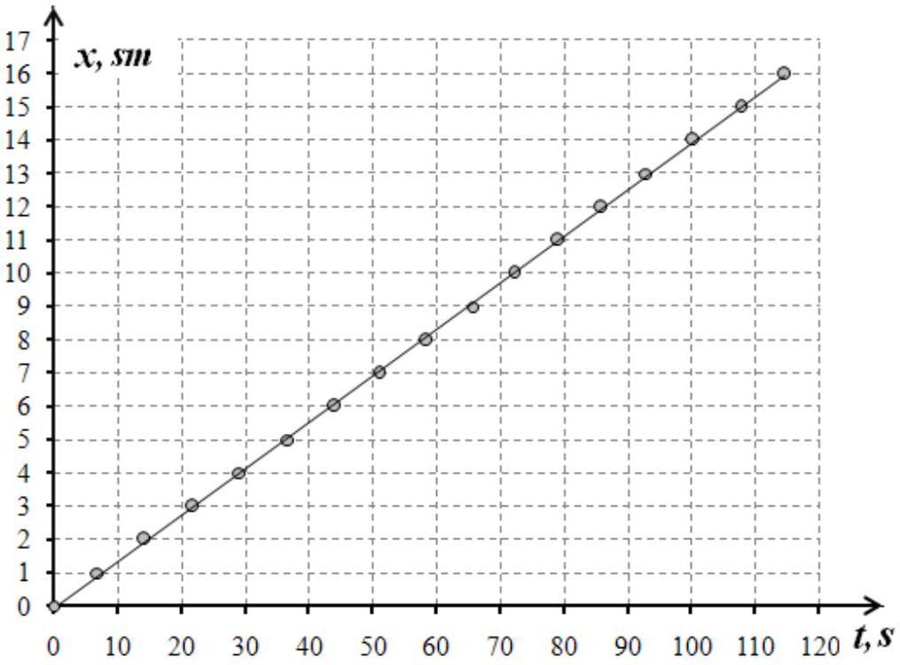
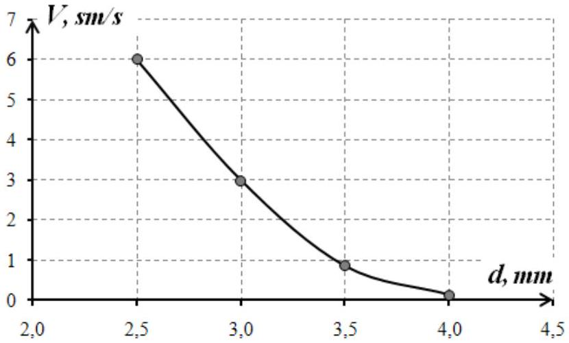
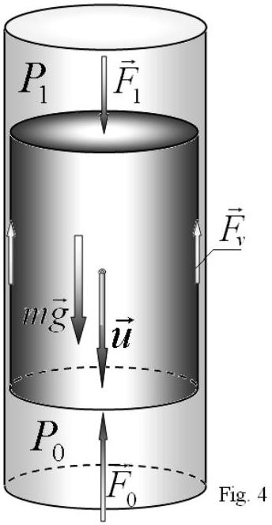
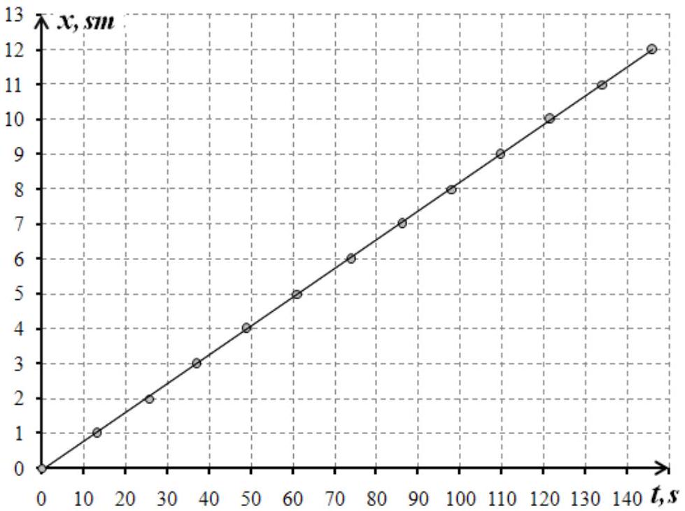

## Experimental competition

## Solution

Part 1.

1. It is necessary to obtain the motion law of the rod. In this experiment it is preferable to measure time intervals at which the rod passes preliminary fixed paths, say 1 sm. Table 1 shows the corresponding measurements and Fig. 1 graphically demonstrates the same dependence.

Table 1.
| $\boldsymbol { x } \boldsymbol { , } \boldsymbol { s } \boldsymbol { m }$ | $\boldsymbol { t } \boldsymbol { , } \boldsymbol { s }$ |
| :--- | :--- |
| 0 | 0 |
| 1 | 6,9 |
| 2 | 14,3 |
| 3 | 21,8 |
| 4 | 29,2 |
| 5 | 36,8 |
| 6 | 44,1 |
| 7 | 51,0 |
| 8 | 58,4 |
| 9 | 65,7 |
| 10 | 72,2 |
| 11 | 79,0 |
| 12 | 85,9 |
| 13 | 92,9 |
| 14 | 100,3 |
| 15 | 107,7 |
| 16 | 114,6 |

Fig. 1 The motion law of the rod

The experimental line in Fig. 1 is linear with high accuracy which proves that the rod really moves uniformly. The most accurate technique of determining average velocity of the rod is least-squares method. The slope of the straight line in Fig. 1 gives an average velocity which in this particular case is

$$
V = ( 0,140 \pm 0,001 ) \mathrm { sm } / \mathrm { s }
$$

2. In this part of the experiment it is necessary to measure the rod velocity several times and to guarantee maximal accuracy the fixed path for the rod to pass should be over 10 sm. Table 2 presents the measurement results for the time intervals $\boldsymbol { t }$ for the rods of different diameters and the calculated velocities $\boldsymbol { V }$.

Table 2.
| d, mm | $\boldsymbol { x } \boldsymbol { , } \boldsymbol { s } \boldsymbol { m }$ | $\boldsymbol { t } _ { \mathbf { 1 } } \boldsymbol { , } \boldsymbol { s }$ | $t _ { 2 } , s$ | $\boldsymbol { t } _ { \mathbf { 3 } } \boldsymbol { , } \boldsymbol { s }$ | $\langle t \rangle , s$ | $\Delta \boldsymbol { t } \boldsymbol { , } \boldsymbol { s }$ | $\boldsymbol { V } \boldsymbol { , } \boldsymbol { s } \boldsymbol { m } \boldsymbol { / } \boldsymbol { s }$ | $\boldsymbol { \Delta } \boldsymbol { V } \boldsymbol { , } \boldsymbol { s } \boldsymbol { m } / \boldsymbol { s }$ |
| :--- | :--- | :--- | :--- | :--- | :--- | :--- | :--- | :--- |
| 4,0 | 10 | 77,5 | 76,6 | 81,7 | 78,60 | 5,4 | 0,13 | 0,01 |
| 3,5 | 10 | 11,7 | 11,6 | 12,0 | 11,76 | 0,48 | 0,85 | 0,03 |
| 3,0 | 10 | 3,4 | 3,3 | 3,3 | 3,35 | 0,12 | 2,99 | 0,11 |
| 2,5 | 20 | 3,3 | 3,5 | 3,2 | 3,33 | 0,30 | 6,01 | 0,54 |

To calculate the average velocity the following formula is used

$$
\begin{equation*}
V = \frac { x } { \langle t \rangle } , \tag{1}
\end{equation*}
$$

where $\langle t \rangle$ is the average of the measured time intervals.
The experimental error can be evaluated as

$$
\begin{equation*}
\Delta t = 2 \sqrt { \frac { \sum \left( t _ { i } - ( t ) \right) ^ { 2 } } { n } } , \quad \Delta V = V \frac { \Delta t } { ( t ) } \tag{2}
\end{equation*}
$$

The corresponding dependence is plotted

Fig. 2 The dependence rod velocity on the rod diameter

3. To check the validity of the formula written in the experimental task it is necessary to plot in logarithmic scale the average velocity dependence on the difference between the diameters of the test tube and the rod. It is done in Fig.3.
The linearity of the obtained line clearly demonstrates the power dependence between the chosen values, i.e. proves the validity of formula (1) written in the experimental task// It is possible that the last point in Fig. 3 deviates slightly from the straight line due to the big gap between the rod and the test tube walls.
4. The power index in formula (1) is numerically equal to the slope of the straight line in Fig.3. Calculation with the least-squares method gives rise to the following value

$$
\gamma = 3,11 \pm 0,16
$$

5. When the rod sinks the liquid has to flow between the lateral surface of the rod and the test tube walls (Fig.4). To overcome the viscous friction of the liquid, the pressure difference $\Delta P = P _ { 0 } - P _ { 1 }$ should appear between the lower and upper ends of the rod. It is this difference in the pressure that produces an additional force acting on the sinking rod. Besides, the rod is slowed down by the above mentioned viscous friction acting on its lateral surface.

It is reasonable to assume that the viscous friction force acting on the liquid in the gap from the tube walls is proportional to the average velocity of the flowing liquid and inversely proportional to the gap size.

$$
\begin{equation*}
F _ { v } = \beta \frac { v } { h } \tag{3}
\end{equation*}
$$

At uniform flowing of the liquid this force is compensated by the pressure difference (the weight of the liquid in the gap is negligible due to the small size of the gap)

$$
\begin{equation*}
\beta \frac { v } { h } \approx S _ { 1 } \Delta P , \tag{4}
\end{equation*}
$$

where $S _ { 1 } = 2 \pi R h$ is the area of the transversal section of the gap. Since the rod moves slowly, one can neglect the viscous friction and write

$$
\begin{equation*}
m g = S _ { 0 } \Delta P , \tag{5}
\end{equation*}
$$

where $S _ { 0 } = \pi R ^ { 2 }$ is the area of the rod transversal section. It follows from formulas (4)-(5) that the average velocity of the liquid in the gap is found as

$$
\begin{equation*}
v = \frac { m g } { R \beta } h ^ { 2 } \tag{6}
\end{equation*}
$$

The rod velocity $u$ is related to the average velocity of the liquid in the gap as $S _ { 0 } u = S _ { 1 } v$, thusпоэтому

$$
\begin{equation*}
u = \frac { 2 h } { R } v \sim h ^ { 3 } . \tag{7}
\end{equation*}
$$

The results obtained above verify formula (7) within the experimental error.

## Part 2.

1. The experimental technique used in this task is quite analogous to the same task in Part 1. In Table 3 and Fig. 5 the results are presented for the wood stick.

Table 3.
| $\boldsymbol { x } \boldsymbol { , } \boldsymbol { c } \boldsymbol { M }$ | $\boldsymbol { t } \boldsymbol { , } \boldsymbol { c }$ |
| :--- | :--- |
| 0 | 0,0 |
| 1 | 13,1 |
| 2 | 25,6 |
| 3 | 37,0 |
| 4 | 48,8 |
| 5 | 61,3 |
| 6 | 73,9 |
| 7 | 86,1 |
| 8 | 98,2 |
| 9 | 109,6 |
| 10 | 121,7 |
| 11 | 134,0 |
| 12 | 146,0 |

Fig. 5 The motion law of the wood stick

It is seen that the wood stick also emerges uniformly and its average velocity, calculated by the least-squares method from Table 3, is

$$
V = ( 0,0825 \pm 0,0004 ) \mathrm { cm } / \mathrm { c }
$$

2. To obtain velocities it is enough to measure time intervals for a wood stick to pass a fixed path several times. Results of the measurements shows that within the experimental error the emerging velocity does not depend on the stick length and equals to

$$
V = ( 0,08 \pm 0,01 ) \mathrm { sm } / \mathrm { s }
$$

Thus, the plot is just a horizontal straight line.
3. In this case the diameters of sticks are all equal. It is obvious that the viscous friction is proportional to the stick length. $\beta \sim l$. The mass and the pressure difference is also proportional to the length $l$. Consequently, it follows from formula (6) that the velocity of the flowing liquid and, thus, the velocity of the stick does not depend on the length.
