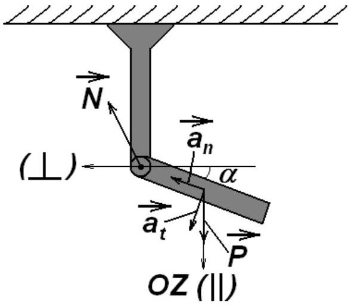
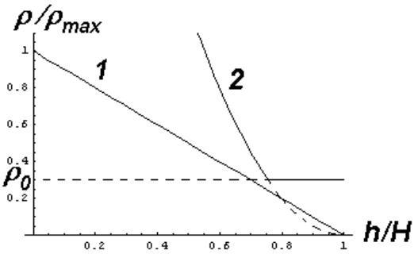
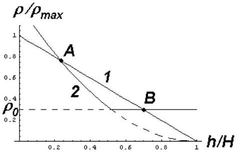
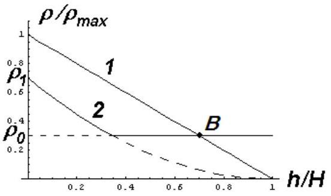
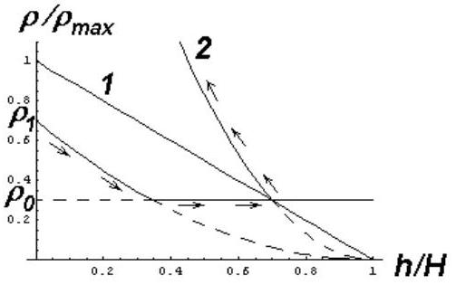
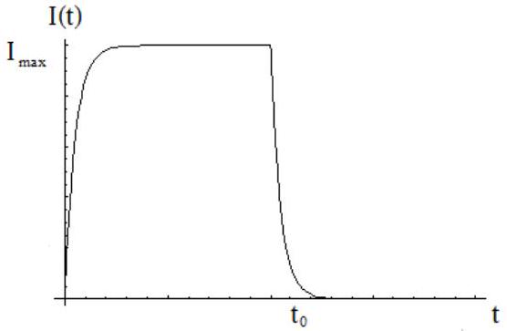
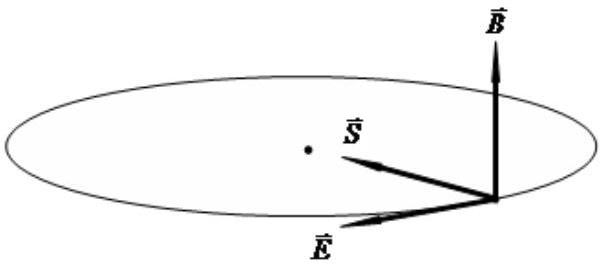

# SOLUTIONS FOR THEORETICAL COMPETITION

## Theoretical Question 1

## 1A

Potential energy of the rigid rod $U = m g l / 2 \sin \alpha$ transforms to the kinetic energy of its rotation $E = J \omega ^ { 2 } / 2$, where $J = m l ^ { 2 } / 3$ is its inertia moment with respect to the vertical support, $\omega$ is the angular velocity. Making balance of these energies, one can find angular velocity of the center of mass around the axis of the support, and after that one can get instantaneous angular velocity of rotation of the center of mass around the axis of the support, and with the help of the obtained expression we find normal acceleration

$$
a _ { n } = \omega ^ { 2 } \left( \frac { l } { 2 } \right) = \frac { 3 } { 2 } g \sin \alpha
$$

We find the tangent acceleration from the dynamics equation $M = \beta J$, where $M = m g l / 2 \cos \alpha$ is momentum of the gravity force with respect to the axis of rotation, $\beta$ is angular acceleration of the center of mass related to tangent acceleration $a _ { t } = \beta l / 2$ :

$$
a _ { t } = \frac { 3 } { 4 } \mathrm {~g} \cos \alpha
$$

Center of mass acceleration a is found from the equation

$$
\mathbf { P } + \mathbf { N } = \mathrm { ma }
$$

where P is gravity force, N is reaction force of the support. Decomposing this equation into vertical and horizontal components, and accounting for

$$
\begin{gathered}
a _ { n \| } = - a _ { n } \cos \alpha , a _ { n \perp } = a _ { n } \sin \alpha , \\
a _ { t \| } = a _ { t } \sin \alpha , a _ { t \perp } = a _ { t } \sin \alpha ,
\end{gathered}
$$

we find

$$
\begin{gathered}
N _ { \| } = m g \left( \frac { 3 } { 4 } \cos ^ { 2 } \alpha - \frac { 3 } { 2 } \sin ^ { 2 } \alpha - 1 \right) , \\
N _ { \perp } = \frac { 9 } { 4 } m g \cos \alpha \sin \alpha .
\end{gathered}
$$

Marking scheme
| No. | Items | Points |
| :--- | :--- | :--- |
| 1 | Writing down balance equation for the kinetic and potential energies and determination of the angular velocity of rotation of the center of mass | 0.5 |

| 2 | Determination of the normal acceleration | 0.5 |
| :--- | :--- | :--- |
| 3 | Determination of the tangent acceleration from the equation of dynamics of rotation | 0.75 |
| 4 | Determination of the component of the reaction force of the support from the 2nd Newton law | 1.25 |

## 1B

First of all let us find dependencies of the liquid density and pressure upon the height measured from the vessel bottom:

$$
\begin{align*}
& \rho _ { \text {жибкости } } ( h ) = \rho _ { \max } \left( 1 - \frac { h } { H } \right)  \tag{1}\\
& p ( h ) = \int _ { h } ^ { H } \rho ( x ) g d x = \frac { 1 } { 2 } \rho _ { \max } g H \left( 1 - \frac { h } { H } \right) ^ { 2 } \tag{2}
\end{align*}
$$

One can see that pressure goes to zero at the top level of the vessel. It means that in this region volume of the gas will exceed the volume of the test-tube, so the gas bulbs will come out. Until the gas doesn't come out from the test-tube, its isothermal expansion takes place, so

$$
\begin{equation*}
p ( h ) V ( h ) = \frac { 1 } { 2 } \rho _ { \max } g H V _ { 1 } . \tag{3}
\end{equation*}
$$

From (2) and (3) one can obtain:

$$
\begin{equation*}
V ( h ) = \frac { V _ { 1 } } { \left( 1 - \frac { h } { H } \right) ^ { 2 } } . \tag{4}
\end{equation*}
$$

Formula (4) is valid for $V ( h ) < V _ { 0 }$, i.e. for

$$
\begin{equation*}
h < H \left( 1 - \sqrt { \frac { V _ { 1 } } { V _ { 0 } } } \right) . \tag{5}
\end{equation*}
$$

One can write down the average density of the gas in the test-tube taking into account the mass of its walls from (4)-(5):

$$
\rho _ { \text {aasa } } ( h ) = \frac { M } { V ( h ) } = \begin{cases} \rho _ { 1 } \left( 1 - \frac { h } { H } \right) ^ { 2 } , & h < H \left( 1 - \sqrt { \frac { V _ { 1 } } { V _ { 0 } } } \right) ;  \tag{6}\\ \rho _ { 0 } , & h \geq H \left( 1 - \sqrt { \frac { V _ { 1 } } { V _ { 0 } } } \right) , \end{cases}
$$

where $\rho _ { 0,1 } = M / V _ { 0,1 }$.
Various kinds of dependencies of $\rho / \rho _ { \text {max } }$ upon $h / H$ are plotted on Fig.1-3. Curve 1 corresponds to the liquid, while curve 2 corresponds to the average density of the gas in the test-tube taking into account the mass of its walls.

Fig. 1

Fig. 2

Fig. 3

Fig. 4

Curves 1 and 2 don't intersect (Fig.1), if the condition $\rho _ { \text {газа } } > \rho _ { \text {жибкости } }$ is fulfilled for $h = H \left( 1 - \sqrt { \frac { V _ { 1 } } { V _ { 0 } } } \right)$, i.e.

$$
\begin{equation*}
\frac { \rho _ { 0 } } { \rho _ { \max } } > \sqrt { \frac { V _ { 1 } } { V _ { 0 } } } . \tag{7}
\end{equation*}
$$

In this case the test-tube will always sink.
If the conditions

$$
\begin{equation*}
\frac { \rho _ { 0 } } { \rho _ { \max } } < \sqrt { \frac { V _ { 1 } } { V _ { 0 } } } , \quad \rho _ { 1 } > \rho _ { \max } \tag{8}
\end{equation*}
$$

are fulfilled in the same time, curves intersect in two points A and B (Fig.2):

$$
\begin{array} { l l }
h = H \left( 1 - \frac { \rho _ { \max } } { \rho _ { 1 } } \right) & ( \text { point A } ) ; \\
h = H \left( 1 - \frac { \rho _ { 0 } } { \rho _ { \max } } \right) & ( \text { point B } ) . \tag{10}
\end{array}
$$

Point A is unstable because the test-tube will sink due to the shift down, and it will rise due to the shift up. Analysis of stability of the point B will be presented below.
If conditions

$$
\begin{equation*}
\rho _ { 1 } < \rho _ { \max } , \quad \frac { \rho _ { 0 } } { \rho _ { \max } } < \sqrt { \frac { V _ { 1 } } { V _ { 0 } } } , \tag{11}
\end{equation*}
$$

are fulfilled, only the intersection point B exists (Fig.3). But one should take into account that at the horizontal part of curve 2 motion to the right along this curve results to the gas flow out of the testtube. Consequently, motion to the left along the curve will be quite different. It will take place along the parabola corresponding to (6) (upper line of the formula), but with the new (larger) value of $\rho _ { 1 }$ corresponding to the amount of gas remained in the test-tube.

Grading scheme
| 1. Pressure dependency upon the height | 0.5 |
| :--- | :--- |
| 2. Dependency of the average gas density in the test-tube upon the height: |  |
| a) taking into account the gas flow from the test-tube (complete answer) | 1.0 |
| b) without taking into account the gas flow from the test-tube (incomplete answer) |  |
|  | 0.5 |
| 3. Comparison of dependencies of liquid and gas densities upon the height: |  |
| a) for three cases (complete answer) | 1.25 |
| b) for two cases (incomplete answer) | 0.75 |
| c) for one case (incomplete answer) | 0.5 |
| 4. Determination of the height corresponding to the intersection points: |  |
| a) two points (complete answer) | 0.5 |
| b) one point (incomplete answer) | 0.25 |
| 5. Study of stability for point A | 0.25 |

6. Study of stability for point B 0.5

Totally (maximum) 4.0

## 1C

The form of shape described in the problem is explained by the appearance of the full shade (dark rectangle) and the semi-shadow (lighter outer rectangle). Fig. 1 illustrates the course of outer rays forming a shadow $C _ { 1 } C _ { 2 }$ and the semi-shadow ( $C _ { 1 } D _ { 1 }$ and $C _ { 2 } D _ { 2 }$ ) in cross section perpendicular to one sides of the source. Denote the full width of the shadow $C _ { 1 } ^ { b } C _ { 2 } ^ { b } - x _ { 1 }$, the width of the semishadow $D _ { 1 } D _ { 2 } - x _ { 2 }$. These values can be expressed through the geometric dimensions of the source and the plate.
From the similarity of the triangles $A _ { 2 } B _ { 1 } B _ { 2 }$ and $A _ { 2 } D _ { 1 } C _ { 2 }$ it follows

$$
\begin{equation*}
\frac { x _ { 1 } + x _ { 2 } } { 2 a } = \frac { L } { L - h } \tag{1}
\end{equation*}
$$

From the similarity of the triangles $A _ { 1 } A _ { 2 } B _ { 2 }$ and $B _ { 2 } C _ { 2 } D _ { 2 }$ it follows

$$
\begin{equation*}
\frac { x _ { 2 } - x _ { 1 } } { 2 b } = \frac { h } { L - h } = \frac { L } { L - h } - 1 \tag{2}
\end{equation*}
$$

From the drawing of shadows, we define the required sizes

$$
x _ { 1 } = 12 с м , \quad x _ { 2 } = 28 с м
$$

Using formula (1) we find

$$
\frac { L } { L - h } = 2
$$

Hence, we find $h = \frac { L } { 2 } = 1,5 м$. From formula (2) we find one of the transverse source size $b = 8,0 c м$. Similar calculations for the perpendicular cross section gives the following results:

$$
x _ { 1 } = 18 с м , \quad x _ { 2 } = 22 с м
$$

Then, it follows that $c = 2,0 с м$.
The results indicate that the long side of the source is placed horizontally (if you use fig. 2 from the conditions of the problem).

Marking scheme.
| No. | Solution item number | Points |
| :--- | :--- | :--- |
| 1 | Plotting of the ray tracing to explain the emergence of the shadow and semi-shadow | 0,5 |
| 2 | Geometric relationships between size of the source, location and size of the plate and size of the shadow and the semishadow (1)-(2) | $2 \times 0,25$ |
| 3 | Calculation of height of the plate above the floor (with a numerical value) | 0,5 |
| 4 | Calculation of the dimensions of the source (with numerical | $2 \times 0,5$ |

|  | values) |  |
| :--- | :--- | :--- |
| 5 | Position of the source with respect to the shadow | 0,5 |

## Theoretical Question 2

## Solution

1. [1 point] The total inertia moment with respect to the rotation axis is a sum of the inertia moment of the coil itself and the metallic wire

$$
\begin{equation*}
J = J _ { 0 } + m r ^ { 2 } . \tag{1}
\end{equation*}
$$

2. [1 point] The equation of the coil rotation as a rigid bode takes the form

$$
\begin{equation*}
J \varepsilon = J \frac { d \omega } { d t } = - M \tag{2}
\end{equation*}
$$

where $\varepsilon$ is the angular acceleration.
It follows from equation (2) that the coil stops at the time moment

$$
\begin{equation*}
t _ { 0 } = \frac { \omega _ { 0 } J } { M } . \tag{3}
\end{equation*}
$$

Finally, the dependence of the angular velocity on time $t$ is found as

$$
\omega ( t ) = \left\{ \begin{array} { l l }
\omega _ { 0 } - \frac { M } { J } t , & t < t _ { 0 } = \frac { \omega _ { 0 } J } { M }  \tag{4}\\
0 , & t \geq t _ { 0 }
\end{array} . \right.
$$

3. [1 point] At the stoppage of the coil, electrons keep on moving due to their inertia, as a result the galvanometer registers the electric current.. Let $a = \varepsilon r$ be the linear acceleration of the coil rim. If the coil is tightly reeled up and the wire is rather thin that linear acceleration is directed along the wire. At the stoppage process electrons are subjected to the inertial force $- m _ { e } a$ opposite to the linear acceleration of the coil. This inertial force can be interpreted as an effective electric field

$$
\begin{equation*}
E _ { e f f } = - \frac { m _ { e } a } { e } . \tag{5}
\end{equation*}
$$

Thus, the effective electromotive force in the coil caused by the inertia of freely moving electrons is obtained as

$$
\begin{equation*}
\operatorname { Emf } = E _ { e f f } \ell = - \frac { m _ { e } } { e } a \ell . \tag{6}
\end{equation*}
$$

Therefore, the Ohm's law for the electric circuit is written as

$$
\begin{equation*}
I R = - \text { Emf } = \frac { m _ { e } a \ell } { e } . \tag{7}
\end{equation*}
$$

Taking into account solution of 2, one gets

$$
I ( t ) = \left\{ \begin{array} { l l }
\frac { M m _ { e } r \ell } { e J R } , & t < t _ { 0 } = \frac { \omega _ { 0 } J } { M } .  \tag{8}\\
0 , & t \geq t _ { 0 }
\end{array} . \right.
$$

4. [2 points] The electric charge, registered by the galvanometer, is found from (8) as

$$
\begin{equation*}
Q = I t _ { 0 } = \frac { m _ { e } \omega _ { 0 } r \ell } { e R } . \tag{9}
\end{equation*}
$$

The charge-to-mass ratio of electron is simply obtained as

$$
\begin{equation*}
\frac { e } { m _ { e } } = \frac { \omega _ { 0 } r \ell } { R Q } . \tag{10}
\end{equation*}
$$

5. [1 point] In this case equation (7) is rewritten as follows

$$
\begin{equation*}
L \frac { d I } { d t } + I R = - \operatorname { Emf } = \frac { m _ { e } a \ell } { e } . \tag{11}
\end{equation*}
$$

where $L = \mu _ { 0 } n ^ { 2 } \pi r ^ { 2 } h$ is the coil inductance.
It follows from equation (11) that the maximal electric current strength is

$$
\begin{equation*}
I _ { \max } = \frac { M m _ { e } r \ell } { e J R } . \tag{12}
\end{equation*}
$$

The qualitative dependence of the electric current strength is plotted below

6. [1 point] The maximal electromagnetic energy stored in the coil equals

$$
\begin{equation*}
W _ { 0 } = \frac { L I _ { \max } ^ { 2 } } { 2 } = \frac { \mu _ { 0 } \pi h } { 2 } \left( \frac { n M m _ { e } r ^ { 2 } \ell } { e J R } \right) ^ { 2 } . \tag{13}
\end{equation*}
$$

7. [3 points] In the stationary regime the magnetic field inductance

$$
\begin{equation*}
B = \mu _ { 0 } n I \tag{14}
\end{equation*}
$$

remains constant in the coil and the electric field is absent. This is not true for initial time moments while the electric current increases from 0 to its maximal value determined by formula (12). According to (14) the varying magnetic field generates the vortex electric field which causes the flux of the electromagnetic energy to appear. The strength of the vortex electric field at the lateral surface of the coil is found from the electromagnetic induction law of Faradey

$$
\begin{equation*}
E m f = E 2 \pi r = - \frac { d \Phi } { d t } = \frac { d } { d t } \left( B \pi r ^ { 2 } \right) , \tag{15}
\end{equation*}
$$

as

$$
\begin{equation*}
E = \frac { r } { 2 } \frac { d B } { d t } = \frac { \mu _ { 0 } n r } { 2 } \frac { d I } { d t } . \tag{16}
\end{equation*}
$$

The mutual orientation of the vectors $\vec { E } , \vec { B }$ и $\vec { S }$ is shown below.

Substituting expressions (14) and |(16) into the expression for the Pointing vector and taking into account that the vectors $\vec { E }$ and $\vec { B }$ are perpendicular, one obtains

$$
\begin{equation*}
S = \frac { \mu _ { 0 } n ^ { 2 } r } { 2 } I \frac { d I } { d t } . \tag{17}
\end{equation*}
$$

Thus, the electromagnetic energy, going inward the lateral surface of the coil while the electric current increases, is given by the summation (or integrating) of (17) as

$$
\begin{equation*}
W = \frac { \mu _ { 0 } n ^ { 2 } r } { 4 } I _ { \max } ^ { 2 } 2 \pi r h = \frac { \mu _ { 0 } \pi h } { 2 } \left( \frac { n M m _ { e } r ^ { 2 } \ell } { e J R } \right) ^ { 2 } . \tag{18}
\end{equation*}
$$

It is obvious that the same amount of the electromagnetic energy goes outward while the electric current strength decreases

$$
\begin{equation*}
W ^ { \prime } = \frac { \mu _ { 0 } n ^ { 2 } r } { 4 } I _ { \max } ^ { 2 } 2 \pi r h = \frac { \mu _ { 0 } \pi h } { 2 } \left( \frac { n M m _ { e } r ^ { 2 } \ell } { e J R } \right) ^ { 2 } . \tag{19}
\end{equation*}
$$

Marking scheme
| № | Content | Points |
| :--- | :--- | :--- |
| 1 | Total inertia moment (1) | 1 |
| 2 | Equation of motion (2) | 0.25 |
| 3 | Stoppage time (3) | 0.25 |
| 4 | Dependence (4) of the angular velocity on time $t$ | 0.5 |
| 5 | Expressions for the effective electric field (5) or (6) | 0.25 |
| 6 | The Ohm's law (7) | 0.25 |
| 7 | Dependence (8) of the electric current strength on time $t$ | 0.5 |
| 8 | Charge (9) registered by the galvanometer | 1 |
| 9 | Charge-to-mass ratio (10) for electron | 1 |
| 10 | Equation (11) for the electric current strength | 0.25 |
| 11 | Maximal electric current strength (12) | 0.25 |
| 12 | Qualitative dependence of the electric current strength | 0.5 |
| 13 | Maximal energy (13) | 1 |
| 14 | Magnetic field induction (14) | 0.5 |
| 15 | Electromagnetic induction law (15) | 0.5 |
| 16 | Vortex electric field strength (16) | 0.5 |
| 17 | Pointing vector (17) | 0.5 |
| 18 | Electromagnetic energy (18) | 0.5 |
| 19 | Electromagnetic energy (19) | 0.5 |
