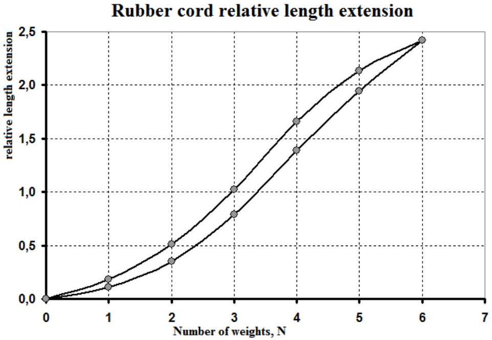
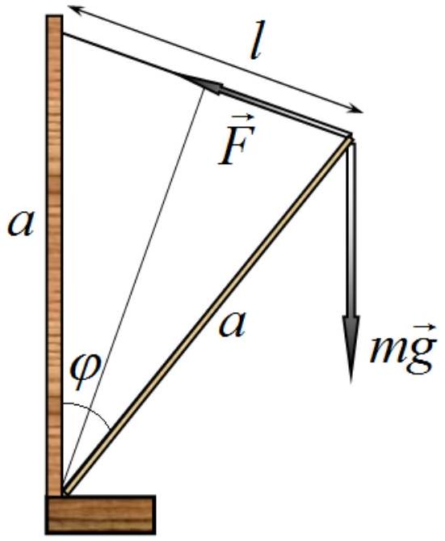
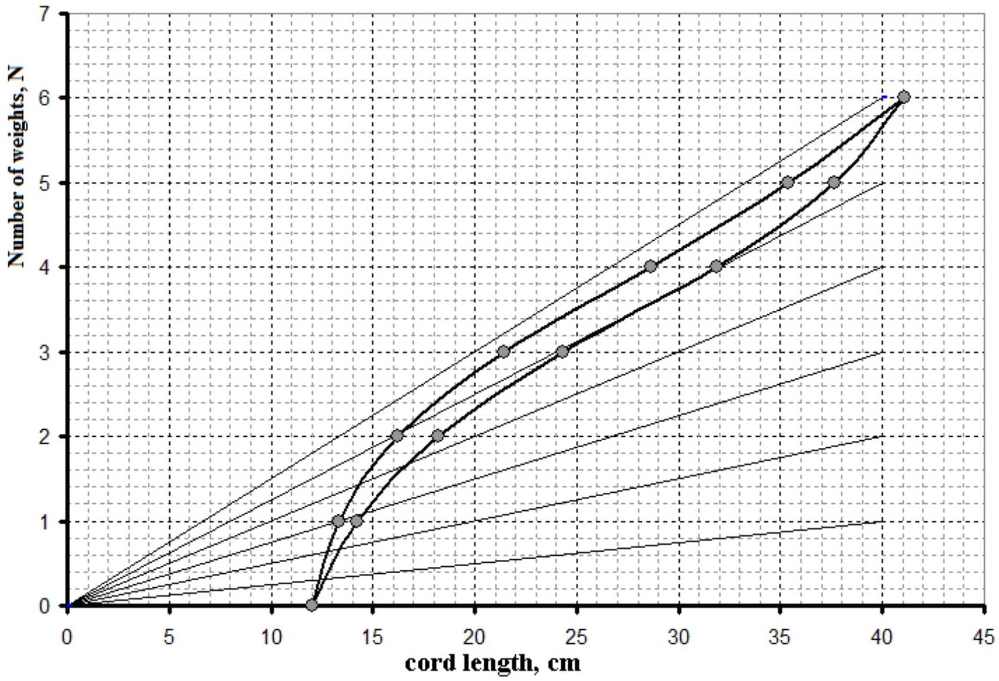
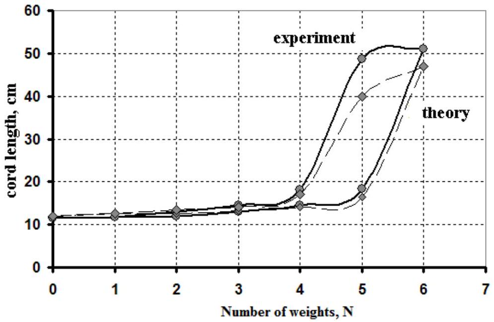
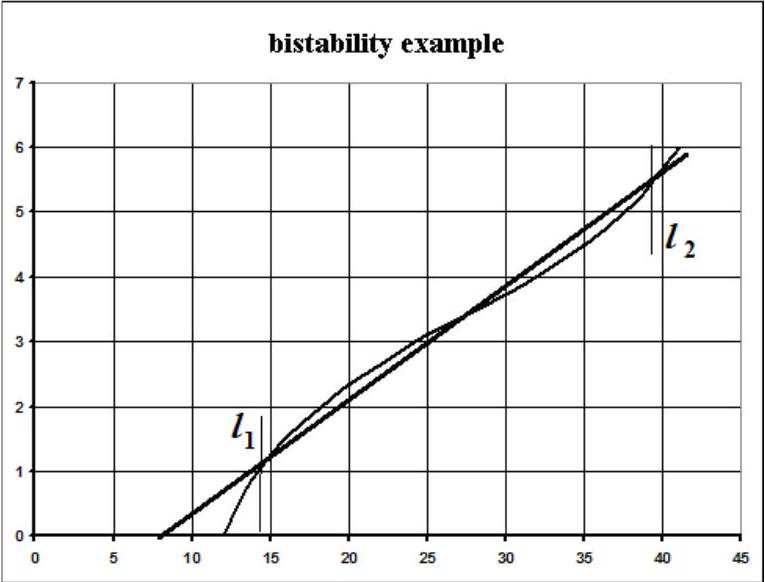

## SOLUTIONS FOR EXPERIMENTAL COMPETITION

## Part 1

The measurement results are shown in Table 1. The last column gives the calculated values of the strain $\varepsilon = \left( l - l _ { 0 } \right) / l _ { 0 }$. The plot of the rubber cord length relative extension against the weights is shown in Fig. 1; 1 weight $= 100 \mathrm {~g}$.

| Number of weights, N | L, cm | $\varepsilon$ |
| :--- | :--- | :--- |
| 0 | 20,8 | 0,00 |
| 1 | 23,1 | 0,11 |
| 2 | 28,1 | 0,35 |
| 3 | 37,2 | 0,79 |
| 4 | 49,7 | 1,39 |
| 5 | 61,3 | 1,95 |
| 6 | 71,2 | 2,42 |
| 5 | 65,2 | 2,13 |
| 4 | 55,3 | 1,66 |
| 3 | 42,1 | 1,02 |
| 2 | 31,5 | 0,51 |
| 1 | 24,6 | 0,18 |
| 0 | 20,8 | 0,00 |

Table 1

Figure 1

## Part 2

2.1 The equilibrium condition follows from equating the torques of the elastic and the gravity forces written as $F ( l ) a \cos \frac { \varphi } { 2 } = m g a \sin \varphi$, where $\varphi$ is the angle of deviation from the vertical. Taking into account that $\sin \varphi = 2 \sin \frac { \varphi } { 2 } \cos \frac { \varphi } { 2 }$ and $2 a \sin \frac { \varphi } { 2 } = l$, we obtain the condition (1).
2.2 When plotting these graphs it is necessary to renormalize the length of the rubber cord for each value of the stretching force: $l = \frac { l _ { 0 } } { L _ { 0 } } L$. The curves of the functions $f ( l ) = m g \frac { l } { a }$ are

straight lines passing through the origin. Required drawing is carried out in Fig. 2.

Figure 2

Equilibrium positions correspond to the intersection points of the graphs.
Table 2 represents the equilibrium positions found both with the help of Fig. 2 and obtained experimentally. Fig. 3 shows the corresponding curves, a fairly good agreement is achieved.

| F, N | L, exp. | L, theory |
| :--- | :--- | :--- |
| 0 | 11,6 | 12,0 |
| 1 | 11,7 | 12,5 |
| 2 | 12,0 | 12,7 |
| 3 | 13,1 | 13,2 |
| 4 | 14,6 | 14,0 |
| 5 | 18,4 | 16,5 |
| 6 | 51,0 | 47,0 |
| 5 | 48,7 | 40,0 |
| 4 | 18,2 | 17,0 |
| 3 | 14,6 | 14,0 |
| 2 | 13,0 | 13,5 |
| 1 | 11,8 | 12,5 |
| 0 | 11,6 | 12,0 |

Table 2

Figure 3

## Part 3. Bistability.

The bistability is possible when the straight line $f ( l ) = m g \frac { l - \delta } { a }$ has three intersection points with the plot of the elastic force. A possible graph is shown in Fig. 4. Note that the intermediate position of equilibrium is unstable!

With the equipment provide the bistability is clearly observed at 5 or 6 weights (500 or 600 g).

The equilibrium positions correspond to the rubber cord lengths 13-14 cm and 36-44 cm.

Figure 4

## Marking scheme

|  | Content | Points |
| :--- | :--- | :--- |
| Часть 1. Растяжение. |  | 4,5 |
| 1.1 | Measurements: |  |
|  | - measurements made (12 points); | 1 |
|  | - the hysteresis loop obtained; | 0,5 |
|  | - measurement made with the accuracy less than 20\% | 1,0 |
|  | - measurement made with the accuracy less than 30\% | $( 0,5 )$ |
| 1.2 | The plot of the unit elongation against the gravity of hanging weights: |  |
|  | - calculation of the unit elongation for all experimental points; |  |
|  | - the graph plotted (the axes are named and ticked; the points are |  |
|  | placed according to the table; the approximate curve is drawn) | 1 |
|  |  | 1 |
| Part 2. Equilibrium |  | 7,5 |
| 2.1 | The proof for the equilibrium position: |  |
|  | - the torque of the gravity force; the torque of the elastic force; | 0,5 |
|  | - geometrical relations and trigonometric transformations; | 0,5 |
| 2.2 | The theoretical calculation of the cord length: |  |
|  | - fornula for calculation of the cord length from the unit elongation; | 0,5 |
|  | - calculation for all values of the elastic force; | 0,5 |
|  | - the graph of the elastic force against the cord length (the axes are named and ticked; the points are placed according to the table; the approximate curve is drawn); |  |
|  | - 6 straight lines drawn; | 0,5 |
| 2.3 | -the values are taken from the graph (12 points); | 0,5 |
|  | - the theoretical curve of the cord length against the gravity force (he axes are named and ticked; the points are placed according to the table; the approximate curve is drawn); | 0,5 |

| 2.4 | Measurements: - measurements conducted (10 points); - the hysteresis loop is obtained (differences at 4 and 5 weights); - measurement conducted with the accuracy less than 20\%; - measurement conducted with the accuracy less than 50\%;  | 1 0,5 1,0 $( 0,5 )$ |
| :--- | :--- | :--- |
| 2.5 | The experimental graph drawn: - the points are placed according to the table; - the approximate curve is drawn.  | 0,5 0,5 |
| Part 3. Bistability |  | 3 |
| 3.1 | The qualitative explanation of the bistability: - the approximate curve of the gravity force against the cord length; - the shifted straight line is drawn to have three intersection points; - the stable equilibrium positions are determined;  | 0,5 0,5 0,5 |
| 3.2 | the stable equilibrium positions are found experimentally: - at the weight 500 g (or 600 g is possible); - the cord lengths at equilibrium positions are obtained in the intervals stated above  | 1 0,5 |
