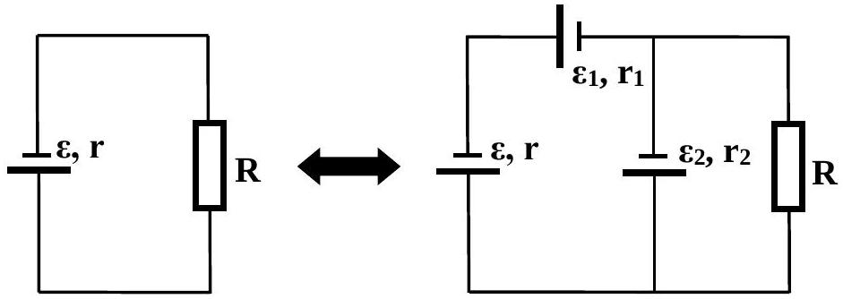
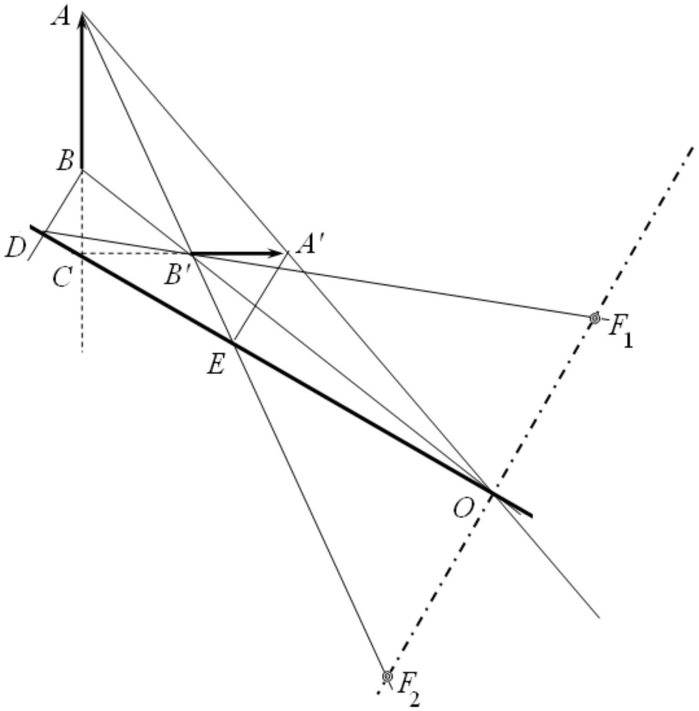
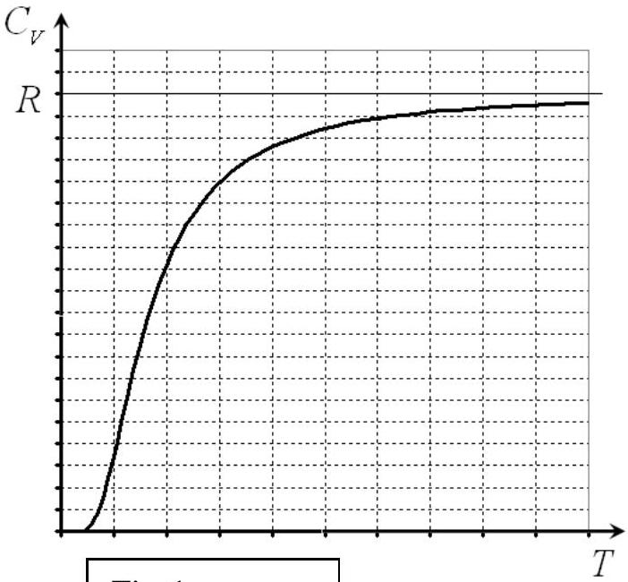
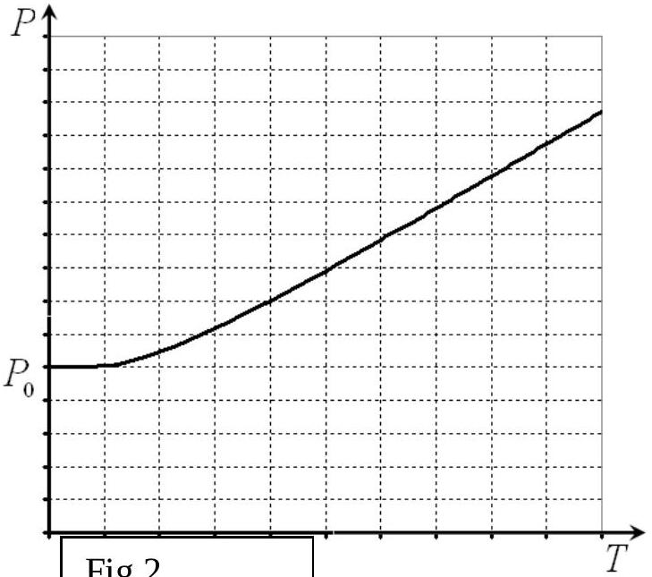

## SOLUTIONS FOR THEORETICAL COMPETITION Theoretical Question 1 (10 points) 1A (3.5 points)

It is elementary to show that the jump of the cube appears at the puck position depicted in the picture on the left hand side. Let $u$ be the cube velocity of mass $M$ at this time moment and let $w$ be the horizontal relative velocity of the puck of mass $m$ with respect to the cube. Since the friction in the system is totally absent, the horizontal projection of the total momentum of the system is conserved,

$$
\begin{equation*}
m \mathrm { v } = M u + m ( u - w ) , \tag{1}
\end{equation*}
$$

as well as with the total mechanical energy,

$$
\begin{equation*}
\frac { m v ^ { 2 } } { 2 } = \frac { M u ^ { 2 } } { 2 } + \frac { m } { 2 } \left[ w ^ { 2 } + ( u - w ) ^ { 2 } \right] + 2 m g R . \tag{2}
\end{equation*}
$$

In the instant frame of reference associated with the cube, the puck moves with the velocity $w$ along the circle of radius $R$ and its equation of motion projected on the radial direction is given by

$$
\begin{equation*}
N + m g = \frac { m w ^ { 2 } } { R } . \tag{3}
\end{equation*}
$$

It is rather obvious that the condition of the cube's jump from the plane of the table is found, according to Newton's third law, as

$$
\begin{equation*}
N = M g . \tag{4}
\end{equation*}
$$

Solving the set of equations (1)-(4), the puck velocity is obtained as

$$
\begin{equation*}
\mathrm { v } = \sqrt { g R } \sqrt { 5 + \frac { M } { m } + 4 \frac { m } { M } } . \tag{5}
\end{equation*}
$$

The minimal velocity of the puck is derived from relation (5) by differentiating over $M / m$,

$$
\begin{equation*}
\mathrm { v } _ { \min } = 3 \sqrt { g R } \tag{6}
\end{equation*}
$$

and it is achieved at the mass ratio

$$
\begin{equation*}
M / m = 2 . \tag{7}
\end{equation*}
$$

## Marking scheme

| № | Content | points |
| :--- | :--- | :--- |
| 1 | Formula (1) | 0.5 |
| 2 | Formula (2) | 0.5 |
| 3 | Formula (3) | 0.5 |
| 4 | Formula (4) | 0.5 |
| 5 | Formula (5) | 0.5 |
| 6 | Formula (6) | 0.5 |
| 7 | Formula (7) | 0.5 |

## 1B (4 points)

We can replace the infinite circuit of current sources by an effective current source with an emf $\varepsilon$ and an internal resistance $r$. Thus, we obtain the circuit shown in the figure on the left hand side. Then, we disconnect the resistance $R$, add another two current sources and connect back the resistance $R$. Hence, we obtain the circuit shown in the figure on the right hand side. Since the

number of cells with the sources is infinite, then both circuits should be equivalent at any value of $R$.

It can be shown from the direct current laws that the following two statements are valid:

1. Let us take two current sources with $\varepsilon _ { 1 } , r _ { 1 }$ and $\varepsilon _ { 2 } , r _ { 2 }$, connected in series. Then, they can be replaced by a single source with $\varepsilon = \varepsilon _ { 1 } + \varepsilon _ { 2 }$ and $r = r _ { 1 } + r _ { 2 }$.
2. Let us take two current sources with $\varepsilon _ { 1 } , r _ { 1 }$ and $\varepsilon _ { 2 } , r _ { 2 }$, connected in parallel. Then, they can be replaced by a single source with $\varepsilon = \left( \varepsilon _ { 1 } r _ { 2 } + \varepsilon _ { 2 } r _ { 1 } \right) / \left( r _ { 1 } + r _ { 2 } \right)$ and $r = r _ { 1 } r _ { 2 } / \left( r _ { 1 } + r _ { 2 } \right)$.

Now, applying 1 and 2 to the circuit shown on the right hand side, we should obtain the circuit shown on the left hand side, thus the following relations must be satisfied:

$$
\begin{align*}
& \varepsilon = \frac { \left( \varepsilon + \varepsilon _ { 1 } \right) r _ { 2 } + \varepsilon _ { 2 } \left( r + r _ { 1 } \right) } { r + r _ { 1 } + r _ { 2 } } ,  \tag{1}\\
& r = \frac { r _ { 2 } \left( r + r _ { 1 } \right) } { r + r _ { 1 } + r _ { 2 } } . \tag{2}
\end{align*}
$$

Solution is given by

$$
\begin{align*}
& \varepsilon = \varepsilon _ { 2 } + \frac { \varepsilon _ { 1 } } { 2 } \left( \sqrt { 1 + \frac { 4 r _ { 2 } } { r _ { 1 } } } - 1 \right) = 3.0 \mathrm {~V} ,  \tag{3}\\
& r = \frac { r _ { 1 } } { 2 } \left( \sqrt { 1 + \frac { 4 r _ { 2 } } { r _ { 1 } } } - 1 \right) = 1.0 \Omega . \tag{4}
\end{align*}
$$

Therefore, the current flowing through the resistance $R$ is found as

$$
\begin{equation*}
I = \frac { \varepsilon } { R + r } = 1.0 \mathrm {~A} . \tag{5}
\end{equation*}
$$

## Marking scheme

| № | Content | Points |
| :--- | :--- | :--- |
| 1 | Equivalent circuit | 1,0 |
| 2 | Rule 1 | 0.5 |
| 3 | Rule 2 | 0.5 |
| 4 | Formula (1) | 0.5 |
| 5 | Formula (2) | 0.5 |
| 6 | Formula (3) | 0.25 |
| 7 | Formula (4) | 0.25 |
| 8 | Formula (5) | 0.5 |

## 1C (2.5 points)

All the rays eradiated from the point A have to pass through the point A' after refraction in the lens; all the rays eradiated from the point B have to pass through the point B' after refraction in the lens. Rays passing through the optical center of the lens do not change direction. Therefore, the point of intersection of lines AA' and BB' is the optical center O of the lens. If a ray passes through both the points A and B, then it should necessarily pass through the points A' and B'. Consequently, the point of the intersection of lines AB and A'B' lies in the plane of the lens. Thus, the plane of the lens passes through the points O and C. The main optical axis of the lens passes through its optical center and is perpendicular to the plane of the lens, Further constructions are traditional: we draw ray BD through the point B which is parallel to the main optical axis, and after refraction in the lens the ray (or its extension) should pass through $\mathrm { B } ^ { \prime }$. From its continuation to the intersection with the main optical axis, we find one of the main focuses $\mathrm { F } _ { 1 }$. Similarly, we find the second main focus $\mathrm { F } _ { 2 }$. The drawing above shows that the lens is concave (diverging).

## Theoretical Question 2 (10 points) Electrical conductivity of metals

## Ohm's law

1. [1 point]

In accordance with the Joule-Lentz law, the heat power released in the conductor is found as

$$
\begin{equation*}
P = \frac { U ^ { 2 } } { R } , \tag{1}
\end{equation*}
$$

which means that the specific heat power $P _ { V }$ is written as

$$
\begin{equation*}
P _ { V } = \frac { U ^ { 2 } } { R V } = \frac { U ^ { 2 } } { R S l } . \tag{2}
\end{equation*}
$$

With the aid of

$$
\begin{equation*}
R = \rho \frac { l } { S } = \frac { 1 } { \sigma } \frac { l } { S } \text { and } E = \frac { U } { l } \text {, } \tag{3}
\end{equation*}
$$

one gets

$$
\begin{equation*}
P _ { V } = \sigma E ^ { 2 } . \tag{4}
\end{equation*}
$$

## The Drude model

2. [1 point]

The second law of Newton for the electron motion in a constant electric field is read as

$$
\begin{equation*}
m \mathbf { a } = \mathbf { F } = - e \mathbf { E } . \tag{5}
\end{equation*}
$$

It follows from Eq.(5) that for the time interval $\tau$ the electron passes the distance

$$
\begin{equation*}
s = \frac { a \tau ^ { 2 } } { 2 } , \tag{6}
\end{equation*}
$$

which means that the module of the average velocity of the electron is

$$
\begin{equation*}
u = \frac { s } { \tau } = \frac { a \tau } { 2 } = \frac { e E \tau } { 2 m } , \tag{7}
\end{equation*}
$$

or, in the vector form,

$$
\begin{equation*}
\mathbf { u } = - \frac { e \tau } { 2 m } \mathbf { E } . \tag{8}
\end{equation*}
$$

3. [1 point]

The current density depends on the electron number density, its electric charge, and its average velocity as follows:

$$
\begin{equation*}
\mathbf { j } = - n e \mathbf { u } = \frac { e ^ { 2 } n \tau } { 2 m } \mathbf { E } , \tag{9}
\end{equation*}
$$

which is Ohm's law with the specific conductivity found as

$$
\begin{equation*}
\sigma = \frac { e ^ { 2 } n \tau } { 2 m } . \tag{10}
\end{equation*}
$$

4. [1 point]

Each electron transfers its kinetic energy at the end of the acceleration, i.e. at the moment of collision with an ion,

$$
\begin{equation*}
E _ { k } = \frac { m u _ { \max } ^ { 2 } } { 2 } = \frac { m } { 2 } \left( \frac { e E \tau } { m } \right) ^ { 2 } . \tag{11}
\end{equation*}
$$

By definition there are $n$ electrons in the cubic meter of the conductor, and each of them transfers its kinetic energy (11) for the time interval $\tau$. Thus, the total specific energy $Q _ { V }$ transferred by electrons to the crystal lattice in the unit of volume and in the unit of time,

$$
\begin{equation*}
Q _ { V } = \frac { n E _ { k } } { \tau } = \frac { n m u ^ { 2 } } { 2 \tau } = \frac { e ^ { 2 } n \tau } { 2 m } E ^ { 2 } = \sigma E ^ { 2 } . \tag{12}
\end{equation*}
$$

This expression coincides with Eq.(4), thus proving the validity of the Joule-Lenz law in the Drude model.

## Magnetoresistance

5. [1 point]

In the presence of magnetic field the equation of motion for the electron is written as

$$
\begin{equation*}
m \frac { d \mathbf { u } } { d t } = - e \mathbf { E } - e \mathbf { u } \times \mathbf { B } . \tag{13}
\end{equation*}
$$

The projections on the coordinate axes are found as

$$
\begin{align*}
m \frac { d u _ { x } } { d t } & = e E + e B u _ { y }  \tag{14}\\
m \frac { d u _ { y } } { d t } & = - e B u _ { x }  \tag{15}\\
m \frac { d u _ { z } } { d t } & = 0 \tag{16}
\end{align*}
$$

Eq.(16) shows that the electron trajectory lies in $X Y$ plane. Substituting $u _ { x } ^ { \prime } = u _ { x }$, $u _ { y } ^ { \prime } = u _ { y } + E / B$ into Eqs. (14)-(15), we obtain

$$
\begin{align*}
& m \frac { d u _ { x } ^ { \prime } } { d t } = e B u _ { y }  \tag{17}\\
& m \frac { d u _ { y } ^ { \prime } } { d t } = - e B u _ { x } ^ { \prime } \tag{18}
\end{align*}
$$

Solutions to Eqs. (17) and (18) are derived as harmonic oscillations of the form

$$
\begin{align*}
& u _ { x } ^ { \prime } = A \cos ( \omega t + \alpha ) ,  \tag{19}\\
& u _ { y } ^ { \prime } = A \sin ( \omega t + \alpha ) , \tag{20}
\end{align*}
$$

or, in terms of the previous variables,

$$
\begin{align*}
& u _ { x } = A \cos ( \omega t + \alpha )  \tag{21}\\
& u _ { y } = A \sin ( \omega t + \alpha ) - \frac { E } { B } \tag{22}
\end{align*}
$$

where $\omega = e B / m$.
From initial conditions $u _ { x } = 0$ and $u _ { y } = 0$, we determine the constants $A = E / B$ and $\alpha = \pi / 2$. Substitution into Eqs. (21) and (22) yields

$$
\begin{align*}
& u _ { x } ( t ) = \frac { E } { B } \sin \left( \frac { e B } { m } t \right) ,  \tag{23}\\
& u _ { y } ( t ) = - \frac { E } { B } \left[ 1 - \cos \left( \frac { e B } { m } t \right) \right] . \tag{24}
\end{align*}
$$

## 6. [2 points]

At small magnitude of the magnetic field induction, Eq. (23) takes the form

$$
\begin{equation*}
u _ { x } = \frac { e E } { m } t - \frac { e ^ { 3 } E B ^ { 2 } } { 6 m ^ { 3 } } t ^ { 3 } . \tag{25}
\end{equation*}
$$

The displacement of the electron along the $O X$ axis over the time interval $\tau$ equals

$$
\begin{equation*}
s = \frac { e E } { 2 m } \tau ^ { 2 } - \frac { e ^ { 3 } E B ^ { 2 } } { 24 m ^ { 3 } } \tau ^ { 4 } , \tag{26}
\end{equation*}
$$

and the average speed is found as

$$
\begin{equation*}
u _ { a v } = \frac { s } { \tau } = \frac { e E } { 2 m } \tau - \frac { e ^ { 3 } E B ^ { 2 } } { 24 m ^ { 3 } } \tau ^ { 3 } . \tag{27}
\end{equation*}
$$

Thus, we are able to determine the relative deviation of the specific conductivity as

$$
\begin{equation*}
\frac { \Delta \sigma } { \sigma } = \frac { n e u _ { a v } ( B ) - n e u _ { a v } ( B = 0 ) } { n e u _ { a v } ( B = 0 ) } = - \frac { 1 } { 12 } \left( \frac { e \tau B } { m } \right) ^ { 2 } , \tag{28}
\end{equation*}
$$

and, therefore,

$$
\begin{equation*}
\mu = - \frac { 1 } { 12 } \left( \frac { e \tau } { m } \right) ^ { 2 } , \quad v = 2 . \tag{29}
\end{equation*}
$$

## The Hall effect

## 7. [0.5 points]

The Lorentz force acting on the electrons is directed downward, therefore the negative charge is accumulated near the bottom face.

## 8. [1.5 points]

Since the electrons are accumulated near the bottom face of the bar, the Hall electric field is oppositely directed with respect to the $O Y$ axis. Hence, the electron equation of motion (13) is rewritten as

$$
\begin{align*}
& m \frac { d u _ { x } } { d t } = e E + e B u _ { y } ,  \tag{30}\\
& m \frac { d u _ { y } } { d t } = e E _ { H } - e B u _ { x } ,  \tag{31}\\
& m \frac { d u _ { z } } { d t } = 0 . \tag{32}
\end{align*}
$$

Again, the electron trajectory lies in the $X Y$ plane. Making substitution $u _ { x } ^ { \prime } = u _ { x } - E _ { H } / B$, $u _ { y } ^ { \prime } = u _ { y } + E / B$ in Eqs. (30) and (31), one gets

$$
\begin{align*}
& m \frac { d u _ { x } ^ { \prime } } { d t } = e B u _ { y } ^ { \prime }  \tag{33}\\
& m \frac { d u _ { y } ^ { \prime } } { d t } = - e B u _ { x } ^ { \prime } . \tag{34}
\end{align*}
$$

Solutions to Eqs. (33) and (34) are again derived as harmonic oscillations of the form

$$
\begin{align*}
& u _ { x } ^ { \prime } = A \cos ( \omega t + \alpha ) ,  \tag{35}\\
& u _ { y } ^ { \prime } = A \sin ( \omega t + \alpha ) , \tag{36}
\end{align*}
$$

or, in terms of the previous variables,

$$
\begin{equation*}
u _ { x } = A \cos ( \omega t + \alpha ) + \frac { E _ { H } } { B } , \tag{37}
\end{equation*}
$$

$$
\begin{equation*}
u _ { y } = A \sin ( \omega t + \alpha ) - \frac { E } { B } . \tag{38}
\end{equation*}
$$

From initial conditions $u _ { x } = 0$ and $u _ { y } = 0$, we obtain the following final solution

$$
\begin{align*}
& u _ { x } ( t ) = \frac { E } { B } \sin \left( \frac { e B } { m } t \right) + \frac { E _ { H } } { B } \left[ 1 - \cos \left( \frac { e B } { m } t \right) \right] ,  \tag{39}\\
& u _ { y } ( t ) = \frac { E _ { H } } { B } \sin \left( \frac { e B } { m } t \right) - \frac { E } { B } \left[ 1 - \cos \left( \frac { e B } { m } t \right) \right] . \tag{40}
\end{align*}
$$

9. [1 point]

At small magnitudes of the magnetic field induction, the condition for zero final displacement $y ( \tau ) = 0$ along the $O Y$ axis at the time moment $\tau$

$$
\begin{equation*}
\int _ { 0 } ^ { \tau } u _ { y } ( t ) d t = 0 \Rightarrow E _ { H } = \frac { e E \tau } { 3 m } B , \tag{41}
\end{equation*}
$$

or

$$
\begin{equation*}
E _ { H } = \frac { 2 j } { 3 n e } B . \tag{42}
\end{equation*}
$$

Marking scheme
|  | Content | points |
| :--- | :--- | :--- |
| 1 | The Joule-Lenz law (1) | 0.25 |
| 2 | The specific heat power (2) | 0.25 |
| 3 | Formulae (3) | 0.25 |
| 4 | Final result (4) | 0.25 |
| 5 | Equation of motion (5) | 0.25 |
| 6 | Path (6) | 0.25 |
| 7 | Average speed (7) | 0.25 |
| 8 | Vector of the average velocity (8) | 0.25 |
| 9 | Current density (9) | 0.5 |
| 10 | Specific conductivity (10) | 0.5 |
| 11 | Kinetic energy of electrons (11) | 0.5 |
| 12 | Total heat transferred (12) | 0.5 |
| 13 | Equation of motion (13) | 0,25 |
| 14 | Equations of motion (14)-(16) | 0,25 |
| 15 | Velocity (23) | 0,25 |
| 16 | Velocity (24) | 0,25 |
| 17 | Expansion of the velocity (25) | 0,25 |
| 18 | Displacement (26) | 0,25 |
| 19 | Average speed (27) | 0.5 |
| 20 | Final result (29) | 2*0.5 |
| 21 | The correct face stated | 0.5 |
| 22 | Equations of motion (30)-(32) | 0.5 |
| 23 | Velocity (39) | 0.5 |
| 24 | Velocity (40) | 0.5 |
| 25 | The Hall electric field strength (41) | 0.5 |
| 26 | The Hall electric field strength (42) | 0.5 |

## Theoretical Question 3

1 [1 point] The constant $C$ is found from the condition that the total number of particles is equal to $N$ :

$$
\begin{equation*}
\sum _ { n = 1 } ^ { \infty } N _ { n } = N . \tag{1}
\end{equation*}
$$

Substituting the expression for the Boltzmann distribution function and obtaining summation, we get

$$
\begin{align*}
& N = \sum _ { n = 1 } ^ { \infty } N _ { n } = \sum _ { n = 1 } ^ { \infty } C \exp \left( - n \frac { \varepsilon } { k _ { B } T } \right) = C \frac { \exp \left( - \frac { \varepsilon } { k _ { B } T } \right) } { 1 - \exp \left( - \frac { \varepsilon } { k _ { B } T } \right) } \Rightarrow \\
& N _ { n } = N \frac { 1 - \exp \left( - \frac { \varepsilon } { k _ { B } T } \right) } { \exp \left( - \frac { \varepsilon } { k _ { B } T } \right) } \exp \left( - n \frac { \varepsilon } { k _ { B } T } \right) \tag{2}
\end{align*}
$$

2 [3 points] The internal energy of the gas is a sum of the kinetic energies of all atoms:

$$
\begin{align*}
& U = \sum _ { n = 1 } ^ { \infty } E _ { n } N _ { n } = \sum _ { n = 1 } ^ { \infty } \operatorname { Cn } \varepsilon \exp \left( - n \frac { \varepsilon } { k _ { B } T } \right) = C \frac { \exp \left( - \frac { \varepsilon } { k _ { B } T } \right) } { \left( 1 - \exp \left( - \frac { \varepsilon } { k _ { B } T } \right) \right) ^ { 2 } } =  \tag{3}\\
& = N \frac { \varepsilon } { 1 - \exp \left( - \frac { \varepsilon } { k _ { B } T } \right) }
\end{align*}
$$

In the classical limit $k _ { B } T \gg \varepsilon$, the argument of the exponent is small, it is thus justifiable to use the approximate formula $\exp \left( - \frac { \varepsilon } { k _ { B } T } \right) \approx 1 - \frac { \varepsilon } { k _ { B } T }$. In this case, we obtain

$$
\begin{equation*}
U = N k _ { B } T . \tag{4}
\end{equation*}
$$

At low temperatures, the exponent itself is small, $\exp \left( - \frac { \varepsilon } { k _ { B } T } \right) \ll 1$, hence

$$
\begin{equation*}
U = N \frac { \varepsilon } { 1 - \exp \left( - \frac { \varepsilon } { k _ { B } T } \right) } \approx N \varepsilon \left( 1 + \exp \left( - \frac { \varepsilon } { k _ { B } T } \right) \right) . \tag{5}
\end{equation*}
$$

3 [3 points] The molar heat capacity at fixed volume is found as

$$
\begin{equation*}
C _ { V } = \frac { \partial U } { \partial T } . \tag{6}
\end{equation*}
$$

In the most general case we derive

$$
\begin{equation*}
C _ { V } = \frac { \partial U } { \partial T } = \frac { N _ { A } \varepsilon } { \left( 1 - \exp \left( - \frac { \varepsilon } { k _ { B } T } \right) \right) ^ { 2 } } \exp \left( - \frac { \varepsilon } { k _ { B } T } \right) \frac { \varepsilon } { k _ { D } T ^ { 2 } } = R \left( \frac { \varepsilon } { k _ { B } T } \right) ^ { 2 } \frac { \exp \left( - \frac { \varepsilon } { k _ { B } T } \right) } { \left( 1 - \exp \left( - \frac { \varepsilon } { k _ { B } T } \right) \right) ^ { 2 } } . \tag{7}
\end{equation*}
$$

In order to approximate expressions in two limiting cases it is easier to use the expansions deduced in Subproblem 2. In the high temperature limit, we get

$$
\begin{align*}
& k _ { B } T \gg \varepsilon \\
& U = N _ { A } k _ { B } T \quad \Rightarrow \quad C _ { V } = R ^ { \cdot } \tag{8}
\end{align*}
$$

i.e. the molar heat capacity is a constant. Here $N _ { A }$ is the Avogadro constant, $N _ { A } k _ { B } = R$ stands for the universal gas constant.
At law temperatures,

$$
\begin{align*}
& U = N _ { A } \varepsilon \left( 1 + \exp \left( - \frac { \varepsilon } { k _ { B } T } \right) \right) \Rightarrow \\
& C _ { V } = N _ { A } \varepsilon \frac { \varepsilon } { k _ { B } T ^ { 2 } } \exp \left( - \frac { \varepsilon } { k _ { B } T } \right) = R \left( \frac { \varepsilon } { k _ { B } T } \right) ^ { 2 } \exp \left( - \frac { \varepsilon } { k _ { B } T } \right) . \tag{9}
\end{align*}
$$

Fig. 1

It is seen that the molar heat capacity goes to zero as the temperature vanishes. The schematic plot is drawn in figure 1.

4 [3 points] Calculation of the gas pressure can be conducted in different ways. For example, the average force exerted on the wall by a single atom is equal to the ratio of the moment transferred to the time interval between two consecutive collisions,

$$
\begin{equation*}
\left\langle f _ { n } \right\rangle = \frac { \Delta p } { \Delta \tau } = \frac { 2 m v _ { n } } { 2 L / v _ { n } } = \frac { m v _ { n } ^ { 2 } } { L } = 2 \frac { E _ { n } } { L } . \tag{10}
\end{equation*}
$$

To determine the pressure it is necessary to summarize those forces

$$
\begin{equation*}
P = \frac { \sum _ { n } N _ { n } \left\langle f _ { n } \right\rangle } { S } = \frac { 2 } { S L } \sum _ { n = 1 } ^ { \infty } N _ { n } E _ { n } = 2 \frac { U } { V } . \tag{11}
\end{equation*}
$$

Substituting the formula for the internal gas energy (3), we obtain

$$
\begin{equation*}
P = 2 \frac { N } { V } \frac { \varepsilon } { 1 - \exp \left( - \frac { \varepsilon } { k _ { B } T } \right) } . \tag{12}
\end{equation*}
$$

In the two limiting cases the above obtained expressions for the internal energy should be used.

$$
\begin{align*}
& \text { At } k _ { B } T \gg \varepsilon \\
& \qquad P = 2 \frac { N } { V } k _ { B } T , \tag{13}
\end{align*}
$$

i.e. the pressure is proportional to the absolute temperature.
At low temperatures, we have

$$
\begin{equation*}
P = 2 \frac { N \varepsilon } { V } \left( 1 + \exp \left( - \frac { \varepsilon } { k _ { B } T } \right) \right) . \tag{14}
\end{equation*}
$$

At temperatures going to zero, the pressure tends to a constant value

$$
\begin{equation*}
P _ { 0 } = 2 \frac { N \varepsilon } { V } . \tag{15}
\end{equation*}
$$

The schematic plot of the pressure against the temperature is shown in figure 2.

Marking scheme

Marking scheme
| № | Contents | points |  |
| :--- | :--- | :--- | :--- |
| 1 | Normalizing condition (1) | 0,5 | 1 |
| 2 | Calculation of the number of particles (2) | 0,5 |  |
|  |  |  |  |
| 3 | General expression for the internal energy U | 0,5 | 3 |
| 4 | Calculation of the internal energy U (3) | 1,0 |  |
| 5 | Calculation of the classical limit of U (4) | 0,5 |  |
| 6 | Calculation of the low temperature limit of U (5) | 1,0 |  |
|  |  |  |  |
| 7 | General expression for the molar heat capacity C_V (6) | 0,5 | 3 |
| 8 | Calculation of the molar heat capacity C_V (7) | 1,0 |  |
| 9 | Calculation of the classical limit of C_V (8) | 0,5 |  |
| 10 | Calculation of the low temperature limit of C_V (9) | 0,5 |  |
| 11 | Schematic plot for C_V | 0,5 |  |
|  |  |  |  |
| 12 | General expression for average force (10) | 0,5 |  |
| 12 | General expression for P (11) | 0,5 | 3   3 |
| 13 | Calculation of the pressure P (12) | 0,5 |  |
| 14 | Calculation of the classical limit of P (13) | 0,5 |  |
| 15 | Calculation of the low temperature limit of P (14) | 0,5 |  |
| 16 | Schematic plot P | 0,5 |  |
