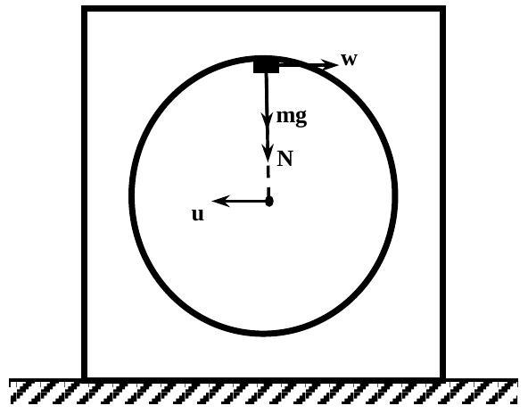

## SOLUTIONS FOR THEORETICAL COMPETITION Theoretical Question 1 (10 points) 1A (3.5 points)

It is elementary to show that the jump of the cube appears at the puck position depicted in the picture on the left hand side. Let $u$ be the cube velocity of mass $M$ at this time moment and let $w$ be the horizontal relative velocity of the puck of mass $m$ with respect to the cube. Since the friction in the system is totally absent, the horizontal projection of the total momentum of the system is conserved,

$$
\begin{equation*}
m \mathrm { v } = M u + m ( u - w ) , \tag{1}
\end{equation*}
$$

as well as with the total mechanical energy,

$$
\begin{equation*}
\frac { m v ^ { 2 } } { 2 } = \frac { M u ^ { 2 } } { 2 } + \frac { m } { 2 } \left[ w ^ { 2 } + ( u - w ) ^ { 2 } \right] + 2 m g R . \tag{2}
\end{equation*}
$$

In the instant frame of reference associated with the cube, the puck moves with the velocity $w$ along the circle of radius $R$ and its equation of motion projected on the radial direction is given by

$$
\begin{equation*}
N + m g = \frac { m w ^ { 2 } } { R } . \tag{3}
\end{equation*}
$$

It is rather obvious that the condition of the cube's jump from the plane of the table is found, according to Newton's third law, as

$$
\begin{equation*}
N = M g . \tag{4}
\end{equation*}
$$

Solving the set of equations (1)-(4), the puck velocity is obtained as

$$
\begin{equation*}
\mathrm { v } = \sqrt { g R } \sqrt { 5 + \frac { M } { m } + 4 \frac { m } { M } } . \tag{5}
\end{equation*}
$$

The minimal velocity of the puck is derived from relation (5) by differentiating over $M / m$,

$$
\begin{equation*}
\mathrm { v } _ { \min } = 3 \sqrt { g R } \tag{6}
\end{equation*}
$$

and it is achieved at the mass ratio

$$
\begin{equation*}
M / m = 2 . \tag{7}
\end{equation*}
$$
