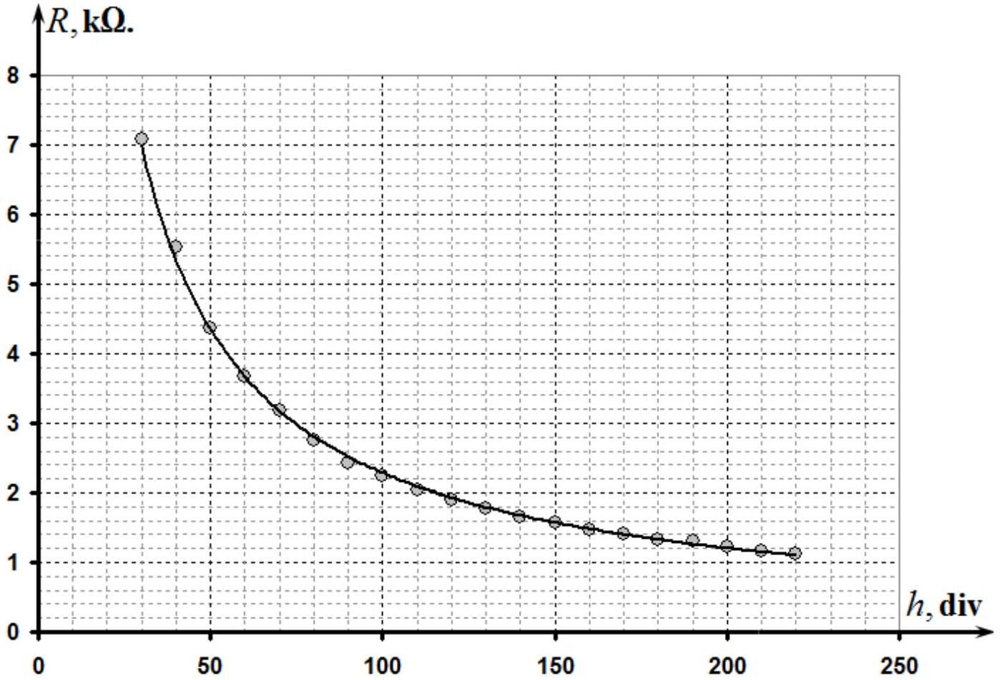
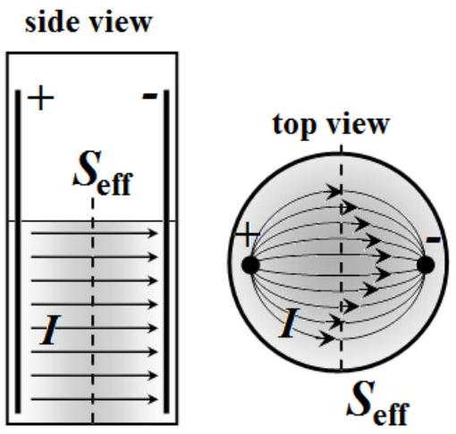
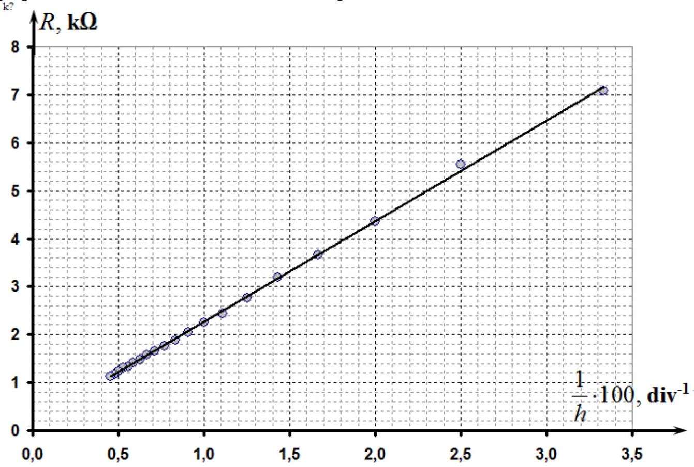
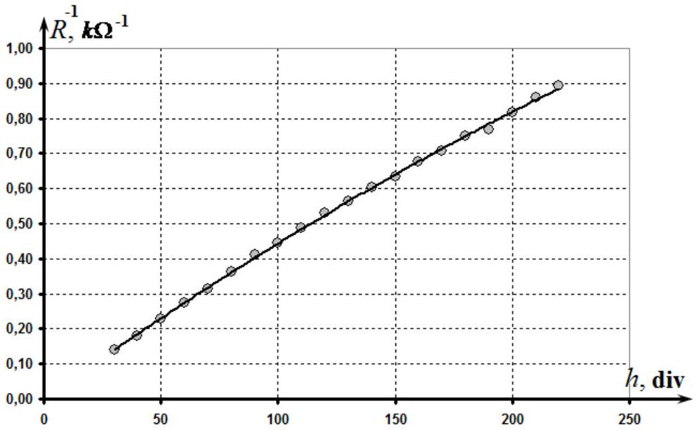
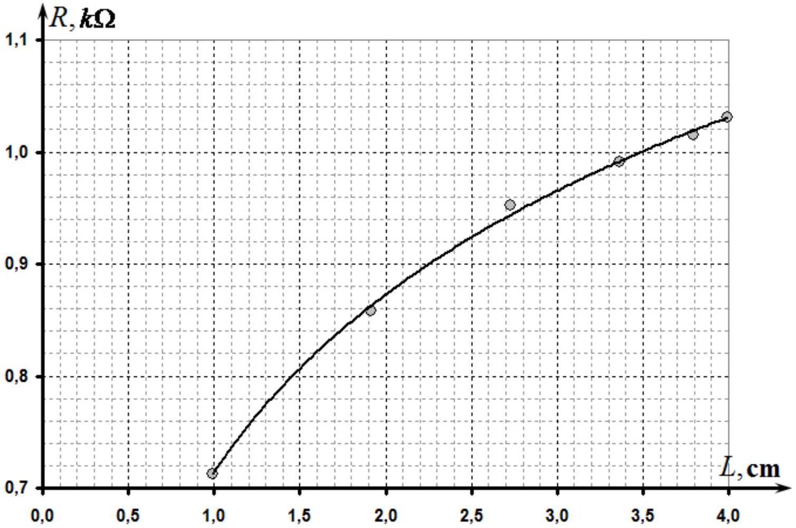
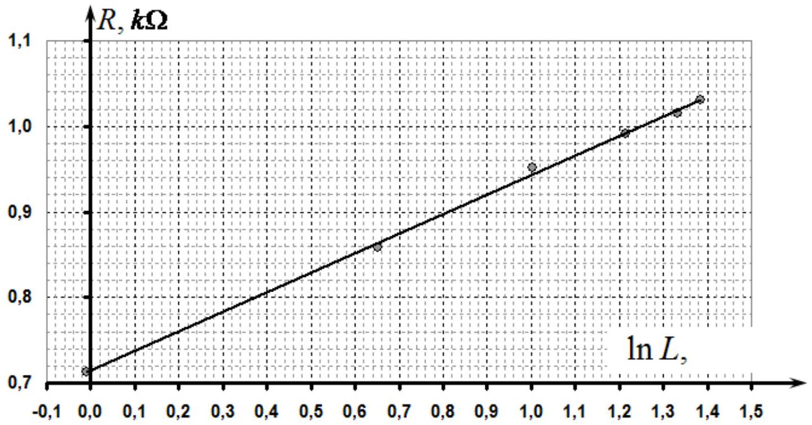
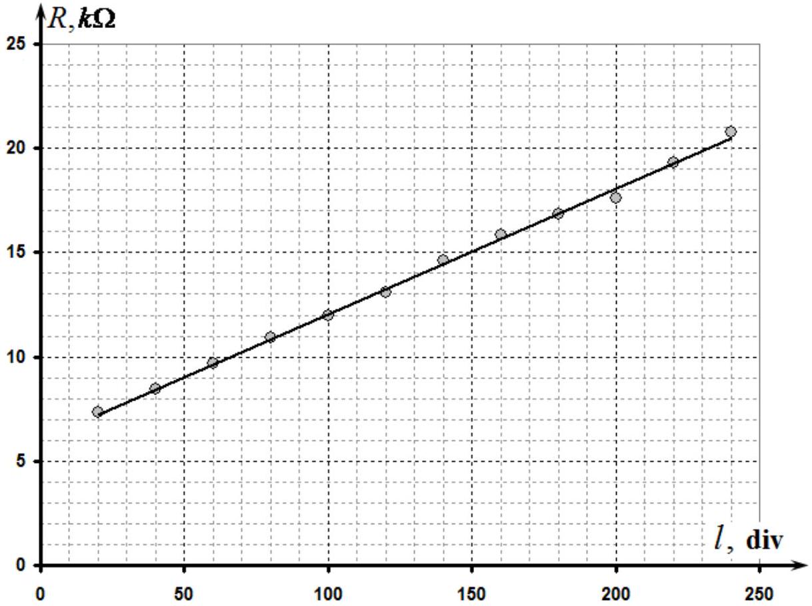
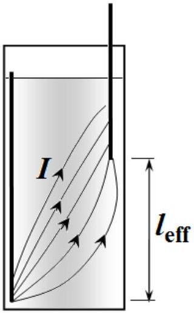

## SOLUTIONS FOR THE EXPERIMENTAL COMPETITION Electric currents in volume

## PART 1

1.1 The resistance of the resistor provided is equal $R _ { 0 } = 2,0 \pm 0,1 \mathrm { k } \Omega$.
1.2 Since the resistorts are connected in series the same current flows through each of them, then the following relation holds

$$
\frac { U _ { R } } { R _ { 0 } } = \frac { U _ { x } } { R _ { x } }
$$

from which it follows that

$$
\begin{equation*}
R _ { x } = R _ { 0 } \frac { U _ { x } } { U _ { R } } . \tag{1}
\end{equation*}
$$

Thus, to measure an unknown resistance it is enough to measure the voltage drops on the unknown resistance and the resistor provided.

If the source voltage was stabilized, it would be sufficient to measure the voltage drop on just one of them.

## PART 2

2.1 The results of measurement of the voltage drops against the height of the water poured into the vessel are presented in Table 1. This table also shows the calculated resistance of the water between the electrodes (s3okes).

Note that the height was measured by the scale of the measuring glass.

Table 1. Dependence of the resistivity on the height of the water level.
| $h$, div. | 100 / h, $\operatorname { div } ^ { 1 }$ | $U _ { x } , \mathrm {~V}$ | $U _ { R } , \mathrm {~V}$ | $R , \mathrm { k } \Omega$ | $1 / R , \mathrm { k } \Omega ^ { - 1 }$ |
| :--- | :--- | :--- | :--- | :--- | :--- |
| 30 | 3,33 | 3,82 | 1,08 | 7,07 | 0,14 |
| 40 | 2,50 | 3,60 | 1,30 | 5,54 | 0,18 |
| 50 | 2,00 | 3,36 | 1,54 | 4,36 | 0,23 |
| 60 | 1,67 | 3,17 | 1,73 | 3,66 | 0,27 |
| 70 | 1,43 | 3,01 | 1,89 | 3,19 | 0,31 |
| 80 | 1,25 | 2,84 | 2,06 | 2,76 | 0,36 |
| 90 | 1,11 | 2,69 | 2,21 | 2,43 | 0,41 |
| 100 | 1,00 | 2,59 | 2,31 | 2,24 | 0,45 |
| 110 | 0,91 | 2,48 | 2,42 | 2,05 | 0,49 |
| 120 | 0,83 | 2,38 | 2,52 | 1,89 | 0,53 |
| 130 | 0,77 | 2,30 | 2,60 | 1,77 | 0,57 |
| 140 | 0,71 | 2,22 | 2,68 | 1,66 | 0,60 |
| 150 | 0,67 | 2,16 | 2,74 | 1,58 | 0,63 |
| 160 | 0,63 | 2,08 | 2,82 | 1,48 | 0,68 |
| 170 | 0,59 | 2,03 | 2,87 | 1,41 | 0,71 |
| 180 | 0,56 | 1,96 | 2,94 | 1,33 | 0,75 |
| 190 | 0,53 | 1,93 | 2,97 | 1,30 | 0,77 |
| 200 | 0,50 | 1,86 | 3,04 | 1,22 | 0,82 |
| 210 | 0,48 | 1,80 | 3,10 | 1,16 | 0,86 |
| 220 | 0,45 | 1,76 | 3,14 | 1,12 | 0,89 |

The graph of the obtained dependence is shown in the figure below.

Simple measurement can easily show that the volume $V _ { 0 } = 200 \mathrm { ml }$ corresponds to the height $h _ { 0 } = 170 \mathrm {~mm}$.Therefore, the height of the water poured is calculated by the formula $h = V \frac { h _ { 0 } } { V _ { 0 } }$, i.e.the the division value of the scale is $\delta = 0,85 \mathrm {~mm} / \mathrm { ml }$.
2.2 The current distribution is schematically shown in the figure on the right.

The current flows between the lateral surfaces of the spokes, thus the height of water level determines an effective cross-sectional area.
2.3 It is therefore reasonable to assume that the resistance of water between the spokes is inversely proportional to the height of water level

$$
\begin{equation*}
R _ { x 0 } = \frac { A } { h } , \tag{2}
\end{equation*}
$$

where $A$ is a constant meaning the water resistance of the unit of height. Then, the measured resistance should be described by the formula

$$
\begin{equation*}
R _ { x } = \frac { A } { h } + B , \tag{3}
\end{equation*}
$$

where $B$ is a constant denoting the additional resistance (of contacts, of an oxide layer on the surface of the spokes, etc.).
2.4 To check the validity of formula (3) it is sufficient to plot the dependence of the resistance on the inversed height of the water column $1 / h$. That is, the linear dependence should be observed for the following values:

$$
\begin{align*}
& y = R \\
& x = \frac { 1 } { h } . \tag{4}
\end{align*}
$$

A graph of this function is shown in the figure below.

The parameters of this linear dependence, calculated by the mean square method

$$
\begin{align*}
& a = ( 210 \pm 3 ) \mathrm { k } \Omega \cdot \operatorname { div }  \tag{5}\\
& b = ( 0,17 \pm 0,03 ) \mathrm { k } \Omega
\end{align*}
$$

To determine the parameters in relation (3) it is necessary to recalculate (5) from divisions of the scale to millimeters. Thus, we get
$k \Omega$

$$
\begin{align*}
& A = a \cdot \delta = ( 178 \pm 2 ) k \Omega \cdot m m  \tag{6}\\
& B = b = ( 0,17 \pm 0,03 ) k \Omega
\end{align*} .
$$

Note. Although it is possible to use the linearization of the type $\frac { 1 } { R } = \frac { h } { A }$, but this leads to worse results, since it ignores the additional resistance of the circuit.

## PART 3

3.1 In order to measure the distance between the spokes it is easier to measure the length of the arc $l$ between the spokes using the marks made on a strip of the adhesive tape. Then the distance between the spokes can be calculated using the geometric formula

$$
\begin{equation*}
L = D \sin \frac { l } { D } , \tag{7}
\end{equation*}
$$

where $D = 40 \mathrm {~mm}$ is the diameter of the measuring glass.
The measurement results of the water resistance on the distance between the spokes are shown in Table 2.

Table 2.
| $l , \mathrm {~cm}$ | $L , \mathrm {~cm}$ | $U _ { x } , \mathrm {~V}$ | $U _ { R } , \mathrm {~V}$ | $R , \mathrm { k } \Omega$ | $\ln L$ |
| :--- | :--- | :--- | :--- | :--- | :--- |
| 1 | 0,990 | 1,29 | 3,62 | 0,713 | -0,010 |
| 2 | 1,918 | 1,45 | 3,38 | 0,858 | 0,651 |
| 3 | 2,727 | 1,59 | 3,34 | 0,952 | 1,003 |
| 4 | 3,366 | 1,62 | 3,27 | 0,991 | 1,214 |
| 5 | 3,796 | 1,64 | 3,23 | 1,015 | 1,334 |
| 6 | 3,990 | 1,65 | 3,2 | 1,031 | 1,384 |

The graph of the obtained dependence is presented in the figure below.

3.2 It is theoretically possible to show that the resistance of the medium between two long parallel electrodes in an infinite medium is given by

$$
\begin{equation*}
R = \frac { \rho } { \pi h } \ln \frac { L } { r _ { 0 } } , \tag{8}
\end{equation*}
$$

where $h$ is the length of the electrodes (spokes), $r _ { 0 }$ is their radius.

We can assume that in this case the water resistance between the electrodes depends linearly on the logarithm of the distance between them, that is,

$$
\begin{equation*}
R ( L ) = A \ln L + B . \tag{9}
\end{equation*}
$$

3.3 To check the feasibility of (9) it is necessary to plot the dependence of the resistance on the logarithm of the distance $\ln L$. That is the linear dependence should be observed for the following values:

$$
\begin{align*}
& y = R \\
& x = \ln L \tag{10}
\end{align*} .
$$

This graph is shown in the figure below which confirms assumption (9).

The parameters of this linear dependence, calculated by the least square method, are found as follows

$$
\begin{align*}
& a = ( 0,23 \pm 0,01 ) k \Omega  \tag{11}\\
& b = ( 0,71 \pm 0,01 ) k \Omega
\end{align*}
$$

It is obvious that the value of the parameter $b$ depends on the unit of distance $L$. In this case, values in (11) correspond to the parameters in (9).

## PART 4

4.1 The results of the resistance measurements depending on the height of the second spoke in water are shown in Table 3. In this case, to measure the height one has to make use of the scale of the measuring glass, so as the units are milliliters.

Table 3
| l,ml | $U _ { x } , \mathrm {~V}$ | $U _ { R } , \mathrm {~V}$ | $\mathrm { R } , \mathrm { k } \Omega$ |
| :--- | :--- | :--- | :--- |
| 20 | 3,85 | 1,05 | 7,3 |
| 40 | 3,96 | 0,94 | 8,4 |
| 60 | 4,06 | 0,84 | 9,7 |
| 80 | 4,14 | 0,76 | 10,9 |
| 100 | 4,20 | 0,70 | 12,0 |
| 120 | 4,25 | 0,65 | 13,1 |
| 140 | 4,31 | 0,59 | 14,6 |

| 160 | 4,35 | 0,55 | 15,8 |
| :--- | :--- | :--- | :--- |
| 180 | 4,38 | 0,52 | 16,8 |
| 200 | 4,40 | 0,50 | 17,6 |
| 220 | 4,44 | 0,46 | 19,3 |
| 240 | 4,47 | 0,43 | 20,8 |

The graph of this dependence is shown in the figure below.

4.2 Approximate distribution of currents in this case is shown in the figure on the right.
4.3 In this case the distance between the spokes plays the role of the effective length of a conductor, so the water resistance between the spokes in this case is approximately linearly dependent on $l$, which is confirmed by the experimental data. Additional resistance may be due to a limitation of currents near the tips of the spokes.

Thus, this dependence is described by

$$
\begin{equation*}
R _ { x } = a l + b . \tag{12}
\end{equation*}
$$

4.4 According to the obtained experimental data, the linear dependence holds at all distances $l$. Deviations from linearity are possible at small and large values of $l$. However, in the range of values $l \in [ 50,150 ]$ the dependence is definetly linear.

The parameters in (12), calculated by the least square method, are found as

$$
\begin{align*}
& a ^ { \prime } = ( 0,060 \pm 0,002 ) k \Omega / \operatorname { div } .  \tag{13}\\
& b = ( 6,0 \pm 0,3 ) k \Omega
\end{align*}
$$

If the height $h$ is measured in millimeters, then the valueof the coefficient $a$ is

$$
\begin{equation*}
a = ( 0,071 \pm 0,002 ) \mathrm { k } \Omega / \mathrm { mm } . \tag{14}
\end{equation*}
$$

## Part 5

5.1 In order to estimate the specific water resistivity it is preferable to use data from Part 4.The linearity of the dependence obtained indicates that in the middle the stream lines are approximately parallel to the vessel walls. It is also possible to assume that in this region the current flows through the entire cross section of the vessel. Consequently, we can use the formula for the resistance presented in this problem.

The obtained value of the slope (14) is the resistance of one millimeter of the water column, which makes it possible to evaluate its specific electrical resistivity

$$
\begin{equation*}
a = \frac { \Delta R } { \Delta l } = \frac { \rho } { S } \Rightarrow \rho = a S = a \frac { V _ { 0 } } { h _ { 0 } } . \tag{7}
\end{equation*}
$$

On substituting numerical values we get

$$
\begin{equation*}
\rho = a \frac { V _ { 0 } } { h _ { 0 } } = 0,071 \frac { 10 ^ { 3 } \Omega } { 10 ^ { - 3 } \mathrm {~m} } \cdot \frac { 200 \cdot 10 ^ { - 6 } \mathrm {~m} ^ { 3 } } { 170 \cdot 10 ^ { - 3 } \mathrm {~m} } \approx 83 \Omega \cdot \mathrm {~m} \tag{8}
\end{equation*}
$$

## Grading scheme for Experimental Competition

If the resistance measurements were carried out in an ohmmeter mode of the multimeter, all the points for the measurement results are reduced by two times!

In the table below italics indicates grading for alternative solutions.

| N | Content | total | points |
| :--- | :--- | :--- | :--- |
| 1.1 | Resistance $R _ { 0 } = 2,0 \pm 0,1 \mathrm { k } \Omega$ | 0,2 | 0,2 |
| 1.2 | Formula (1) | 0,3 | 0,3 |
| 2.1 | Measurements of the experimental data and plotting the graph (reasonable values have been obtained for the resistance in the range from 1 to $10 \mathrm { k } \Omega$. Otherwise no points are given) | 2,5 |  |
|  | Measurements made in the range that include more than 180 divisions of the scale (max-min); in the range that includes more than 150 divisions; in the range that includes more than 100 divisions; less than 100 divisions; |  | 0,75   $( 0,5 ) ( 0,25 )$ (0) |
|  | Number of experimental points: 10 and more; 7-9; 5-6; less than 5 |  | 0,75 $( 0,5 ) ( 0,25 )$ (0) |
|  | Resistance values are correctly calculated for each measured point |  | 0,25 |
|  | Monotonically decreasing dependence is obtained; the resistance changes at least 5 times; resistance varies less than 5 times; |  | 0,25   (0) |
|  | Plot is made - size of plot is not less than 1/4 of sheet; - axes are denoted by units, digits are indicated; - all table data points are correctly drawn in a plot; - smooth line passing through the points is shown;  |  | 0,1 0,1 0,2 0,1 |
| 2.2 | Streamlines are shown in the figures | 0,5 |  |
|  | In the plane of the spokes: straight lines are perpendicular to the spokes (slight distortion might appear near the bottom |  | 0,25 |

|  | and the top of the vessel); |  |  |
| :--- | :--- | :--- | :--- |
|  | In the perpendicular plane: convex symmetric lines between the electrodes filling most of the cross-section; |  | 0,25 |
| 2.3 | Form of dependence | 0,8 |  |
|  | - Inverse proportionality; (otherwise no points are given) |  | 0,6 |
|  | - There is a constant component for the resistance; |  | 0,2 |
| 2.4 | Linearization and determination of parameters | 1,2 |  |
|  | Type of relationship: - Dependence $R ( 1 / h )$; - Dependence $R ^ { - 1 } ( h )$, or in a double logarithmic scale; - Other;  |  | 0,2 $( 0,1 )$ (0) |
|  | Plotting the graph of the linearized dependence - All points are plotted; - Smoothing line through the points is shown  |  | 0,2 0,2 |
|  | - Correct evaluation of the parameters of the linearized dependence $( 200 \pm 30 \% ) \mathrm { k } \Omega \cdot \mathrm { div }$ step, or $( 180 \pm 30 \% ) \mathrm { k } \Omega \cdot \mathrm { mm }$ - if the deviation is of 30\% to 75\% - the grade is twice less; - if there is a large deviation, no points are given)  &#160;&#160;- By using Least Square Method; &#160;&#160;- By using plot (or by using all points); &#160;&#160;- By using two points;  |  | 0,4 $( 0,2 ) ( 0,1 )$ |
|  | Calculation of the height measured in units of length (mm or cm) - Measuring and calculation of the division value of the scale (correct) - Calculation of the slope (if all the previous calculations in units of length) |  | 0,1 0,1 $( 0,1 )$ |
| 3.1 | Measurements and ploting of the experimental data (reasonable values for the resistances in the range of 0.5 to 2 $\mathrm { k } \Omega$, otherwise no points are given) | 1,5 |  |
|  | Measurement of the distance between the spokes: - An arc of a circle with calculations; - Direct measurement by a ruler;  |  | 0,2 $( 0,1 )$ |
|  | - Measured in the range of 1 to 4 cm - (Otherwise nopoints are given);  |  | 0,3 |
|  | - Number of points - 6 or more; - Number of points - 4-5; - Less than 4  |  | 0,3 $( 0,2 )$ |
|  | An increasing convex relationship is obtained |  | 0,2 |
|  | Plot is made - size of a plot is not less than 1/4 of sheet; - units of axes are stated, digits are indicated; - all table data points are correctly drawn in a plot; - smooth line passing through the points is shown;  |  | 0,1 0,1 0,2 0,1 |
| 3.2 | Form of dependence | 1 |  |
|  | Logarithmic dependence There is constant contribution in the dependence; |  | 0,7 0,3 |

|  | Some other reasonable convex increasing dependence |  | $( 0,3 )$ |
| :--- | :--- | :--- | :--- |
| 3.3 | Linearization and determination of parameters | 1 |  |
|  | - Dependence $R ( \ln L )$; - Other reasonable linearization in accordance with the formula 3.2 |  | 0,4 $( 0,2 )$ |
|  | Plotting the graph of the linearized dependence - All points are plotted; - Smoothing line is shown;  |  | 0,1 0,1 |
|  | Parameters: (slope is in the range $a = ( 0,2 \pm 30 \% ) \mathrm { k } \Omega$; - if the deviation of 30\% to 75\% the grading points are twice less; - if there is a large deviation, no points are given) - By using Least Square Method; - By using plot (or by using all points); - By using two points;  |  | 0,4 $( 0,2 ) ( 0,1 )$ |
| 4.1 | Measurements of the experimental data and plotting the graph (reasonable values have been obtained for the resistance in the range of 5 to $30 \mathrm { k } \Omega$. Otherwise no points are given) | 2,4 |  |
|  | Measurements are made in the range of more than 180 divisions of the scale (max-min); in the range of more than 150 divisions; in the range of more than 100 divisions; less than 100 divisions; |  | 0,75 $( 0,5 ) ( 0,25 )$ (0) |
|  | Number of experimental points: 10 and more; 7-9; 5-6; less than 5 |  | 0,75 $( 0,5 ) ( 0,25 )$ (0) |
|  | Resistance values are correctly calculated for each measured point |  |  |
|  | Monotonically increasing dependence is obtained; there is linear part in the plot No linear part in the plot |  | 0,2 |
|  | Plot is made - units of axes are stated, digits are indicated; - all table data points are correctly drawn in a plot; - smooth line passing through the points is shown;  |  | 0,1 0,2 0,1 |
| 4.2 | Sketch of streamlines | 0,3 |  |
|  | Lines - start from the open end of the spoke; - go straight up; - are distributed along the length of second spoke;  |  | 0,1 0,1 0,1 |
| 4.3 | Form of the dependence | 0,4 |  |
|  | - there is term proportional to $l$; - there is a constant component; (other than linear types of dependence are not accepted); |  | 0,2 0,2 |
| 4.4 | Linearity interval | 0,1 |  |
|  | - interval is shown (deviations near the ends of interval measurement are allowed) |  | 0,1 |
| 4.5 | Parameters | 0.8 |  |

|  | - Correct evaluation of the linearized dependence: the slope ( $( 0,060 \pm 30 \% ) \mathrm { k } \Omega / \operatorname { div }$ or $( 0,07 \pm 30 \% ) ) \mathrm { k } \Omega / \mathrm { mm }$ -if deviations are from 30\% to 75\% the grade pointa are twice less; - if there is a large deviation, no points are given) &#160;&#160;- By using Least Square Method; &#160;&#160;- By using plot (or by using all points); &#160;&#160;- By using two points;  |  | 0,6 |
| :--- | :--- | :--- | :--- |
|  | - Constant component of the resistance: &#160;&#160;- In the range 4-10 k $\Omega$ &#160;&#160;- In the range of $2 - 4 \mathrm { k } \Omega$ or $10 - 12 \mathrm { k } \Omega$; &#160;&#160;- Otherwise no grade points;  |  | 0,2 $( 0,1 )$ |
| 5.1 | The calculation of the specific resistivity of water | 2 |  |
|  |  &#160;&#160;- Dependence from Part 4 is taken; &#160;&#160;- Other reasonable dependence (with a correct formula for the resistance);  |  | 0,3 $( 0,1 )$ |
|  | Equation (7) is used to calculate the resistance by using:  &#160;&#160;- The slope of the graph; &#160;&#160;- (using 1-2 points for calculation);  |  | 0,4 $( 0,2 )$ |
|  | The calculation of the specific resistance $( 80 \Omega \cdot \mathrm {~m} )$ : &#160;&#160;- Values in the range $60 - 100 \Omega \cdot$; &#160;&#160;- Values in the range $40 - 120 \Omega \cdot$; &#160;&#160;- Values in the range $20 - 150 \Omega \cdot$; &#160;&#160;- Otherwise zero grade points.  |  | 1,3 $( 1,0 ) ( 0,5 )$ |
