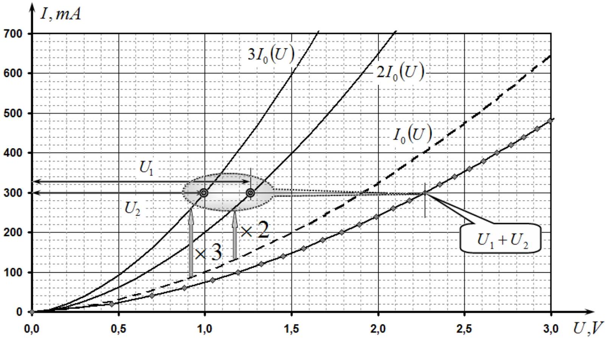
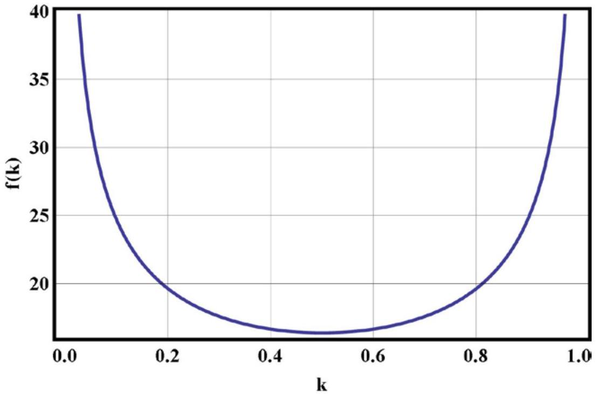

## SOLUTIONS OF PROBLEMS OF THEORETICAL TOUR Problem 1. (10 points)

Problem 1A. 2012
Forces acting on the system are shown in Fig. Since the hard core and non-tensile yarn, acceleration loads are as 1:2:3. The sum of the torques acting on a weightless rod is zero. These two conditions together with the equations of the 2nd law of Newton for all goods provide a system of equations

$$
\left\{ \begin{array} { c }
20 m a = 20 m g - T _ { 1 }  \tag{1}\\
12 m \cdot 2 a = 12 m g - T _ { 2 } \\
m \cdot 3 a = T _ { 3 } - m g \\
T _ { 1 } l + T _ { 2 } \cdot 2 l = T _ { 3 } \cdot 3 l
\end{array} \right.
$$

from which we find

$$
\begin{equation*}
a = \frac { 41 } { 77 } g . \tag{2}
\end{equation*}
$$

However, this value of acceleration is obtained second load more free-fall acceleration. This means that the second thread of the load will not be tight, but its acceleration is equal to $g$. You can also show that the formal system of equations (1) that, for which the thread cannot be. Therefore, the thread to which the suspended second load, the rod does not work. Therefore, the system of equations (1) incorrectly describes the device under consideration. To calculate the acceleration of the rod and the other second load should be deleted.

Valid values for the acceleration of the first and third loads are from the following system of equations

$$
\left\{ \begin{array} { c }
20 m a = 20 m g - T _ { 1 }  \tag{3}\\
m \cdot 3 a = T _ { 3 } - m g \\
T _ { 1 } l = T _ { 3 } \cdot 3 l
\end{array} \right.
$$

Finally, we obtain $\quad a = \frac { 17 } { 29 } g$

$$
\begin{equation*}
a _ { 1 } = \frac { 17 } { 29 } g , \quad a _ { 2 } = g , \quad a _ { 3 } = \frac { 51 } { 29 } g . \tag{4}
\end{equation*}
$$

Grading scheme of Problem 1A.
| № |  | points |
| :--- | :--- | :--- |
| 1 | Figure with all the forces | 0,4 |
| 2 | The system of equations (1) | 0,8 |
| 3 | The solution of (1) to speed up (2) | 0,4 |
| 4 | Exception 4 second load from a consideration of | 0,3 |
| 5 | Proof of exceptions (second acceleration load greater tensile strength filament is negative) | 0,7 |
| 6 | Acceleration second load is equal to $g$ | 0,4 |
| 7 | The system of equations (3) | 0,6 |
| 8 | A solution of (3) for the acceleration (4) | 0,4 |
|  | Total | 4,0 |

## Task 1.B. And diodes

We denote the voltage on a pair of parallel-connected diodes by $U _ { 1 }$ and on three of the diodes by $U _ { 2 }$. The total current in the circuit $I$ can be found in two ways:

- A double value of the current through one diode pair:
$$
\begin{equation*}
I = 2 I _ { 0 } \left( U _ { 1 } \right) ; \tag{1}
\end{equation*}
$$

- Three times the value as a force in one of the three diodes:

$$
\begin{equation*}
I = 3 I _ { 0 } \left( U _ { 2 } \right) . \tag{2}
\end{equation*}
$$

We construct the graphs of $2 I _ { 0 } ( U )$ and $3 I _ { 0 } ( U )$. It's enough to "multiply" the graph of the $I _ { 0 } ( U )$ by appropriate factor, i.e. for several values of the voltage on the schedule to remove the corresponding values of the forces of currents, multiply them by 2 and 3 and apply the appropriate point on the graphs. When connected in series the total voltage is the sum of the stresses in some parts of the circuit, so

$$
\begin{equation*}
U _ { 1 } + U _ { 2 } = U . \tag{3}
\end{equation*}
$$

Graphically, this condition corresponds to a "horizontally summing" graphs $2 I _ { 0 } ( U )$ and ${ } ^ { 3 } I _ { 0 } ( U )$ : for a given value of current and voltage values $U _ { 1 }$ and $U _ { 2 }$ are read, and their sum is then the value is applied to the chart.

Note that the formal solution of the problem can be written as (for the inverse functions):

$$
U ( I ) = U _ { 0 } \left( \frac { I } { 2 } \right) + U _ { 0 } \left( \frac { I } { 3 } \right)
$$

where $U _ { 0 } ( I )$ - the inverse of graphically given functions $I _ { 0 } ( U )$.

Grading scheme of Problem 1B
| № | Contents of number scores | Points |
| :--- | :--- | :--- |
| 1 | In a parallel connection of power currents are added | 0,3 |
| 2 | Plotting functions $2 I _ { 0 } ( U )$ and $3 I _ { 0 } ( U )$ | 0,6 |
| 3 | If you are connected in parallel are added voltage | 0,3 |
| 4 | "Horizontal" summation | 0,7 |
| 5 | are calculated for: |  |
|  | - 3 points; | 0,3 |
|  | - 6 points. | 0,6 |
| 6 | Alternatives to (realized ideas): |  |
|  | - To approximate the dependence; | 0,4 |
|  | - To solve the equations explicitly; | 0,4 |
|  | Total | 2,5 |

## Tasks 1.C. Flat lens

Plate will form an image $S ^ { \prime }$ if the optical path length $l = S A B S ^ { \prime }$ for any ray of light, emerging from the source, and refract in plate, will be the same for all rays (tautochronism condition for lens).

Consider a beam incident on the plate at a distance from its axis. We assume that $r \ll a$, ie, we use the paraxial approximation. Distance $| S A |$ found using the Pythagorean theorem and make the approximation $r \ll a$, given that:

$$
\begin{equation*}
| S A | = \sqrt { a ^ { 2 } + r ^ { 2 } } = a \sqrt { 1 + \frac { r ^ { 2 } } { a ^ { 2 } } } \approx a \left( 1 + \frac { 1 } { 2 } \frac { r ^ { 2 } } { a ^ { 2 } } \right) , \tag{1}
\end{equation*}
$$

Similarly, the distance is expressed $\left| B S ^ { \prime } \right|$

$$
\begin{equation*}
\left| B S ^ { \prime } \right| = \sqrt { b ^ { 2 } + r ^ { 2 } } = b \sqrt { 1 + \frac { r ^ { 2 } } { b ^ { 2 } } } \approx b \left( 1 + \frac { 1 } { 2 } \frac { r ^ { 2 } } { b ^ { 2 } } \right) . \tag{2}
\end{equation*}
$$

Thus, the optical path length $S A B S ^ { \prime }$ is equal to

$$
\begin{align*}
& l = | S A | + n ( r ) h + \left| B S ^ { \prime } \right| = a \left( 1 + \frac { 1 } { 2 } \frac { r ^ { 2 } } { a ^ { 2 } } \right) + n _ { 0 } \left( 1 - \beta r ^ { 2 } \right) h + b \left( 1 + \frac { 1 } { 2 } \frac { r ^ { 2 } } { b ^ { 2 } } \right) = \\
& = a + n _ { 0 } h + b + \left( \frac { 1 } { 2 a } + \frac { 1 } { 2 b } - n _ { 0 } \beta h \right) r ^ { 2 } \tag{3}
\end{align*}
$$

This value does not depend on $r$ (i.e., the same for all rays) for the vanishing of the factor

$$
\begin{equation*}
\frac { 1 } { 2 a } + \frac { 1 } { 2 b } - n _ { 0 } \beta h = 0 \tag{4}
\end{equation*}
$$

which can be rewritten as

$$
\begin{equation*}
\frac { 1 } { a } + \frac { 1 } { b } = 2 n _ { 0 } \beta h \tag{5}
\end{equation*}
$$

This expression is identical in form with a thin lens formula

$$
\begin{equation*}
\frac { 1 } { a } + \frac { 1 } { b } = \frac { 1 } { F } , \tag{6}
\end{equation*}
$$

where F is focal length.
Comparing (5) and (6), we find the focal length of the plate

$$
\begin{equation*}
F = \frac { 1 } { 2 n _ { 0 } \beta h } \tag{7}
\end{equation*}
$$

From formula (5) also found the distance from the plate to the image:

$$
\begin{equation*}
b = \frac { a } { 2 n _ { 0 } \beta h a - 1 } . \tag{8}
\end{equation*}
$$

The alternative is a geometrical optics approximation.
This problem, in principle, can be solved in the framework of geometrical optics. The main stages (of the very complex solutions) are:

- Use the law of refraction by Snelius;
- The choice of an arbitrary beam and determine the angle of incidence on the plate;
- Angle of the beam after refraction at the front edge of plate;
- Obtaining a differential equation for the beam path inside the plate;
- Solution of this equation in the quadratic approximation;
- The angle at the exit of the plate (should be negative);
- The angle after refraction on the rear face;
- Determination of the distance to the intersection with the axis of the plate;
- Proof of the constancy of the distance for all the rays;
- Getting the lens formula;
- Write the formula for the focal length.

Grading scheme of Problem 1C
| № |  | points |
| :--- | :--- | :--- |
| 1 | Formulation of basic idea: the constancy of the propagation time for all the paths | 1,5 |
| 2 | Using the quadratic approximation (for small angles) | 0,5 |
| 3 | Calculation of distances $\| S A \|$ and $\left\| B S ^ { \prime } \right\|$ - The exact formula; - Expansion of the approximate formula;  | 0,2 0,4 |
| 4 | The optical path length (3) | 0,2 |
| 5 | A formula of a thin lens (4) | 0,3 |
| 6 | Focal length of lens (7) | 0,2 |
| 7 | Distance to the image (8) | 0,2 |
|  | Total | 3,5 |

Grading for geometrical optics approximation (alternative solution)
| № |  | points |
| :--- | :--- | :--- |
| 1 | The Law of refraction | 0,1 |
| 2 | Two small-angle approximation (but quadratic) | 0,3 |
| 3 | The starting angle of the plate | 0,1 |
| 4 | The differential equation for the ray trajectory in a plate | 0,5 |
| 5 | The solution to the quadratic approximation | 0,5 |
| 5 | The value of the angle near the back edge | 0,2 |
| 6 | The value of the angle after refraction on the rear face | 0,1 |
| 7 | The point of intersection with the optical axis | 0,2 |
| 8 | Persistence of distance $b$ for all the refracted rays | 0,1 |
| 9 | formula analogous to the thin lens | 0,2 |
| 10 | The formula for the focal length | 0,2 |
|  | Total | 3,5 |

## Problem 2   Adventures of a piston (10 points)

2.1. [0.5 points] From the equilibrium condition of the piston, we find pressure of the gas

$$
\begin{equation*}
p _ { 1 } = p _ { 0 } + \frac { M g } { S } = p _ { 0 } ( 1 + \alpha ) = 1.99 \times 10 ^ { 5 } \mathrm {~Pa} \tag{1}
\end{equation*}
$$

2.2 and 2.3. [2 points] In the first stage the gas is compressed and heats up to a certain temperature. Because the vessel wall and the piston are made of a material that conducts heat poorly, gas compression can be assumed to be adiabatic, but the process is not equilibrium and we cannot use the adiabatic equation. In the transition from the initial to the final state of the system piston+gas by external forces (gravity and atmospheric pressure) have made the work

$$
\begin{equation*}
A = M g \left( H - H _ { 1 } \right) + p _ { 0 } S \left( H - H _ { 1 } \right) = \left( M g + p _ { 0 } S \right) \left( H - H _ { 1 } \right) \tag{2}
\end{equation*}
$$

By hypothesis, only half of this work is to increase the internal energy of the gas

$$
\begin{equation*}
\Delta U = \frac { A } { 2 } \tag{3}
\end{equation*}
$$

Where

$$
\begin{equation*}
\Delta U = \frac { v R } { \gamma - 1 } \left( T _ { 1 } - T _ { 0 } \right) \tag{4}
\end{equation*}
$$

Here, ${ } ^ { v }$ is the number of moles, $R$ is the universal gas constant. We write the equation of state of ideal gas for the initial and final states

$$
\begin{gather*}
p _ { 0 } S H = v R T _ { 0 }  \tag{5}\\
\left( p _ { 0 } + \frac { M g } { S } \right) S H _ { 1 } = v R T _ { 1 } \tag{6}
\end{gather*}
$$

Solving system of equations (2) - (6), we obtain

$$
\begin{gather*}
T _ { 1 } = T _ { 0 } \left( 1 + \frac { \gamma - 1 } { \gamma + 1 } \frac { M g } { p _ { 0 } S } \right) = T _ { 0 } \left( 1 + \frac { \gamma - 1 } { \gamma + 1 } \alpha \right) = 317  \tag{7}\\
H _ { 1 } = \frac { H } { \left( 1 + M g / p _ { 0 } S \right) } \left( 1 + \frac { \gamma - 1 } { \gamma + 1 } \frac { M g } { p _ { 0 } S } \right) = \frac { H } { ( 1 + \alpha ) } \left( 1 + \frac { \gamma - 1 } { \gamma + 1 } \alpha \right) = 17.7 \mathrm {~cm} , \tag{8}
\end{gather*}
$$

2.4. [0.5 points] As the piston continues to be in equilibrium, the pressure

$$
\begin{equation*}
p _ { 2 } = p _ { 0 } + \frac { M g } { S } = p _ { 0 } ( 1 + \alpha ) = 1.99 \times 10 ^ { 5 } \mathrm {~Pa} . \tag{9}
\end{equation*}
$$

2.5. [0.5 points] After a sufficiently long period of time the gas temperature inside the vessel will be equal to the ambient temperature, i.e., becomes equal to

$$
\begin{equation*}
T _ { 2 } = T _ { 0 } = 273 \mathrm {~K} . \tag{10}
\end{equation*}
$$

2.6. [0.5 points] The height $H _ { 2 }$ is found by (9) and (10), as well as the equation of state of gas

$$
\begin{equation*}
H _ { 2 } = \frac { p _ { 0 } S } { p _ { 0 } S + M g } H = \frac { H } { 1 + \alpha } = 15.2 \mathrm {~cm} \tag{11}
\end{equation*}
$$

2.7. [2 points] Adiabatic equation of the form

$$
\begin{equation*}
p V ^ { \gamma } = \text { const } \tag{12}
\end{equation*}
$$

we obtain

$$
\begin{equation*}
d p = - \gamma p \frac { d V } { V } . \tag{13}
\end{equation*}
$$

Let piston has deviated from its equilibrium position at a small height ${ } ^ { x }$, then by (13) is equal to the pressure change

$$
\begin{equation*}
\delta p = - \gamma p _ { 2 } \frac { x } { H _ { 2 } } = - \gamma \frac { \left( p _ { 0 } S + M g \right) ^ { 2 } } { p _ { 0 } S ^ { 2 } H } x \tag{14}
\end{equation*}
$$

The equation of motion of the piston can be written as

$$
\begin{equation*}
M \ddot { x } = - \delta p S = - \gamma \frac { \left( p _ { 0 } S + M g \right) ^ { 2 } } { p _ { 0 } S H } x \tag{15}
\end{equation*}
$$

whence we obtain the frequency of small oscillations

$$
\begin{equation*}
\omega = \left( p _ { 0 } S + M g \right) \sqrt { \frac { \gamma } { p _ { 0 } S H M } } = ( 1 + \alpha ) \sqrt { \frac { \gamma g } { \alpha H } } = 13.5 \mathrm {~Hz} . \tag{16}
\end{equation*}
$$

2.8. [1 point] When moving with constant velocity piston continues to be in equilibrium, so the pressure

$$
\begin{equation*}
p _ { 3 } = p _ { 0 } + \frac { M g } { S } = p _ { 0 } ( 1 + \alpha ) = 1.99 \times 10 ^ { 5 } \mathrm {~Pa} , \tag{17}
\end{equation*}
$$

that is

$$
\begin{equation*}
A = p _ { 0 } , f ( \alpha ) = 1 + \alpha \tag{18}
\end{equation*}
$$

2.9 and 2.10. [3 points] Suppose a vessel to establish certain temperature. There should be must be a balance in the number of particles and energy. The law of conservation of particles is given by

$$
\begin{equation*}
\frac { p _ { 0 } + \frac { M g } { S } } { k _ { B } T _ { 3 } } u S = \frac { p _ { 0 } + \frac { M g } { S } } { k _ { B } T _ { 3 } } \sqrt { \frac { 8 k _ { B } T _ { 3 } } { \pi m } } S _ { O } - \frac { p _ { 0 } } { k _ { B } T _ { 0 } } \sqrt { \frac { 8 k _ { B } T _ { 0 } } { \pi m } } S _ { O } \tag{19}
\end{equation*}
$$

For the law of conservation of energy it is necessary to consider not only kinetic but also the rotational energy of each molecule. Therefore, the total energy carried by each molecule is

$$
\begin{equation*}
W _ { \text {tot } } = \bar { W } + W _ { \text {rot } } = 2 k _ { B } T + k _ { B } T = 3 k _ { B } T \tag{20}
\end{equation*}
$$

then the energy conservation law can be written as

$$
\begin{equation*}
\left( p _ { 0 } S + M g \right) u = \frac { p _ { 0 } + \frac { M g } { S } } { k _ { B } T _ { 3 } } \sqrt { \frac { 8 k _ { B } T _ { 3 } } { \pi m } } 3 k _ { B } T _ { 3 } S _ { O } - \frac { p _ { 0 } } { k _ { B } T _ { 0 } } \sqrt { \frac { 8 k _ { B } T _ { 0 } } { \pi m } } 3 k _ { B } T _ { 0 } S _ { O } \tag{21}
\end{equation*}
$$

Solving (18) and (19), we finally obtain

$$
\begin{equation*}
u = \frac { 6 S _ { O } } { S } \sqrt { \frac { 2 R T _ { 0 } } { \pi \mu } } \left( ( \alpha + 1 ) \sqrt { 4 + 2 \alpha + \alpha ^ { 2 } } - 2 - 2 \alpha - \alpha ^ { 2 } \right) = 1.91 \times 10 ^ { - 3 } \mathrm {~m} / \mathrm { s } , \tag{22}
\end{equation*}
$$

that is

$$
\begin{equation*}
B = \frac { 6 S _ { O } } { S } \sqrt { \frac { 2 R T _ { 0 } } { \pi \mu } } , \quad g ( \alpha ) = ( \alpha + 1 ) \sqrt { 4 + 2 \alpha + \alpha ^ { 2 } } - 2 - 2 \alpha - \alpha ^ { 2 } , \tag{23}
\end{equation*}
$$

and temperature

$$
\begin{equation*}
T _ { 3 } = T _ { 0 } \left( 5 + 4 \alpha + 2 \alpha ^ { 2 } - 2 ( \alpha + 1 ) \sqrt { 4 + 2 \alpha + \alpha ^ { 2 } } \right) = 116 \mathrm {~K} , \tag{24}
\end{equation*}
$$

that is

$$
\begin{equation*}
C = T _ { 0 } , h ( \alpha ) = 5 + 4 \alpha + 2 \alpha ^ { 2 } - 2 ( \alpha + 1 ) \sqrt { 4 + 2 \alpha + \alpha ^ { 2 } } . \tag{25}
\end{equation*}
$$

Grading scheme of Problem 2
| N |  | points |  |
| :--- | :--- | :--- | :--- |
| 2.1 | Formula (1) | 0,25 | 0,5 |
|  | Numerical value of $p _ { 1 }$ | 0,25 |  |
| 2.2 | Formula (2) | 0,25 | 1,5 |
|  | Formula (3) | 0,25 |  |
|  | Formula (4) | 0,25 |  |
|  | Formulas (5) and (6) | 0,25 |  |
|  | Formula (7) | 0,25 |  |
|  | Numerical value of $T _ { 1 }$ | 0,25 |  |
| 2.3 | Formula (8) | 0,25 | 0,5 |
|  | Numerical value of $H _ { 1 }$ | 0,25 |  |
| 2.4 | Formula (9) | 0,25 | 0,5 |
|  | Numerical value of $p _ { 2 }$ | 0,25 |  |
| 2.5 | Formula (10) | 0,25 | 0,5 |
|  | Numerical value of $T _ { 2 }$ | 0,25 |  |
| 2.6 | Formula (11) | 0,25 | 0,5 |
|  | Numerical value of $H _ { 2 }$ | 0,25 |  |
| 2.7 | Formula (12) | 0,25 | 2,0 |
|  | Formula (13) | 0,25 |  |
|  | Formula (14) | 0,5 |  |
|  | Formula (15) | 0,5 |  |
|  | Formula (16) | 0,25 |  |
|  | Numerical value of $\omega$ | 0,25 |  |
| 2.8 | Formula (18) for $A$ | 0,25 | 1,0 |
|  | Formula (18) for $f ( \alpha )$ | 0,25 |  |
|  | Formula (17) | 0,25 |  |
|  | Numerical value of $p _ { 3 }$ | 0,25 |  |
| 2.9 | Formula (19) | 0,25 | 2,0 |
|  | Formula (20) | 0,5 |  |
|  | Formula (21) | 0,25 |  |
|  | Formula (23) for $B$ | 0,25 |  |
|  | Formula (23) for $g ( \alpha )$ | 0,25 |  |
|  | Formula (22) | 0,25 |  |
|  | Numerical value of $u$ | 0,25 |  |
| 2.10 | Formula for (25) for $C$ | 0,25 | 1,0 |
|  | Formula for (25) for $h ( \alpha )$ | 0,25 |  |
|  | Formula (24) | 0,25 |  |
|  | Numerical value of $u$ | 0,25 |  |
|  |  |  |  |

## Problem 3   Nuclear droplet (10 points)

3.1 [2 points] We calculate the total electrostatic energy of the protons in the nucleus. Within the droplet model of the nuclear charge $Z e$ is uniformly distributed inside a sphere of radius $R$, so that its bulk density is the same everywhere and equal to

$$
\begin{equation*}
\rho _ { q } = \frac { 3 Q } { 4 \pi R ^ { 3 } } . \tag{1}
\end{equation*}
$$

Using the Gauss theorem, we find the electric field inside and outside the ball

$$
\begin{align*}
& E ( r ) 4 \pi r ^ { 2 } = \frac { 1 } { \varepsilon _ { 0 } } \rho _ { q } \frac { 4 \pi } { 3 } r ^ { 3 }  \tag{2}\\
& E ( r ) 4 \pi r ^ { 2 } = \frac { 1 } { \varepsilon _ { 0 } } \rho _ { q } \frac { 4 \pi } { 3 } R ^ { 3 } . \tag{3}
\end{align*}
$$

Hence we get

$$
E ( r ) = \left\{ \begin{array} { l l }
\frac { \rho _ { q } r } { 2 \varepsilon _ { 0 } } , & r \leq R  \tag{4}\\
\frac { \rho _ { q } R ^ { 3 } } { 2 \varepsilon _ { 0 } r ^ { 2 } } , & r > R
\end{array} \right. \text {. }
$$

Full electrostatic energy given by the integral

$$
\begin{equation*}
E _ { C } = \int _ { 0 } ^ { \infty } w 4 \pi r ^ { 2 } d r = \int _ { 0 } ^ { \infty } \frac { \varepsilon _ { 0 } E ^ { 2 } } { 2 } 4 \pi r ^ { 2 } d r = \frac { 3 Q ^ { 2 } } { 20 \pi \varepsilon _ { 0 } R } \tag{5}
\end{equation*}
$$

3.2 [1 point] From (5), $Q = \operatorname { Ze }$ and $R ( A ) = R _ { 0 } A ^ { 1 / 3 }$ we see that the electrostatic energy corresponds to the third term in the Weizsacker semiempirical formula, so

$$
\begin{equation*}
a _ { 3 } \frac { Z ^ { 2 } } { A ^ { 1 / 3 } } = \frac { 3 Z ^ { 2 } e } { 20 \pi \varepsilon _ { 0 } R _ { 0 } A ^ { 1 / 3 } } \tag{6}
\end{equation*}
$$

whence

$$
\begin{equation*}
R _ { 0 } = \frac { 3 e } { 20 \pi \varepsilon _ { 0 } a _ { 3 } } = 1.2 \times 10 ^ { - 15 } \mathrm {~m} . \tag{7}
\end{equation*}
$$

3.3 [1 point] The density of nuclear matter is given by

$$
\begin{equation*}
\rho _ { m } = \frac { 3 A m } { 4 \pi R ^ { 3 } } = \frac { 3 m } { 4 \pi R _ { 0 } ^ { 3 } } = 2.3 \times 10 ^ { 17 } \mathrm {~kg} / \mathrm { m } ^ { 3 } . \tag{8}
\end{equation*}
$$

3.4 [1 point] The surface energy depends on surface tension

$$
\begin{equation*}
E _ { \text {sur } } = \sigma S = 4 \pi \sigma R ^ { 2 } = 4 \pi \sigma R _ { 0 } ^ { 2 } A ^ { 2 / 3 } . \tag{9}
\end{equation*}
$$

We conclude that the surface energy corresponds to the second term of the semi-empirical formula Weizsäcker

$$
\begin{equation*}
4 \pi \sigma R _ { 0 } ^ { 2 } A ^ { 2 / 3 } = e a _ { 2 } A ^ { 2 / 3 } \tag{10}
\end{equation*}
$$

whence

$$
\begin{equation*}
\sigma = \frac { e a _ { 2 } } { 4 \pi R _ { 0 } ^ { 2 } } = 1.5 \times 10 ^ { 17 } \mathrm {~N} / \mathrm { m } . \tag{11}
\end{equation*}
$$

3.5 [2 points] Nuclear fission becomes energetically favorable only if the potential energy of the nuclei decreases, that is,

$$
\begin{equation*}
E _ { p } ( A , Z ) - E _ { p } ( k A , k Z ) - E _ { p } ( ( 1 - k ) A , ( 1 - k ) Z ) > 0 \tag{12}
\end{equation*}
$$

which yields

$$
\begin{equation*}
\frac { Z ^ { 2 } } { A } > f ( k ) = - \frac { a _ { 2 } \left( 1 - k ^ { 2 / 3 } - ( 1 - k ) ^ { 2 / 3 } \right) } { a _ { 3 } \left( 1 - k ^ { 5 / 3 } - ( 1 - k ) ^ { 5 / 3 } \right) } . \tag{13}
\end{equation*}
$$

Graph of the function $f ( k )$ is presented below.

3.6 [0.5 points] The function $f ( k )$ is symmetric with respect to the point $k = 0.50$, so at this point and the minimum, which corresponds to

$$
\begin{equation*}
\left( Z ^ { 2 } / A \right) _ { 0 } = 16 . \tag{14}
\end{equation*}
$$

3.7 [0.5 points] Since the core is treated as a liquid, its volume should not change. Using the formula for the volume of an ellipsoid and the fact that $\varepsilon , \lambda \square 1$ we obtain

$$
\begin{equation*}
V = \frac { 4 \pi } { 3 } R ^ { 3 } ( 1 + \varepsilon - 2 \lambda ) = \frac { 4 \pi } { 3 } R ^ { 3 } \tag{15}
\end{equation*}
$$

whence

$$
\begin{equation*}
\varepsilon = 2 \lambda . \tag{16}
\end{equation*}
$$

3.8 [2 points] Based on Taylor's formula for small deformations of the nucleus, taking into account (16) the surface area of the liquid increases by

$$
\begin{equation*}
\Delta S = \frac { 32 } { 5 } \pi R ^ { 2 } \lambda ^ { 2 } = \frac { 32 } { 5 } \pi R _ { 0 } ^ { 2 } A ^ { 2 / 3 } \lambda ^ { 2 } \tag{17}
\end{equation*}
$$

and a corresponding increase in surface energy is equal to

$$
\begin{equation*}
\Delta E _ { \text {surf } } = \sigma \Delta S = \frac { 32 } { 5 } \pi \sigma R _ { 0 } ^ { 2 } A ^ { 2 / 3 } \lambda ^ { 2 } . \tag{18}
\end{equation*}
$$

Coulomb interaction energy of the protons is decreased by the

$$
\begin{equation*}
\Delta E _ { C } = \frac { 3 Z ^ { 2 } e ^ { 2 } } { 120 \pi \varepsilon _ { 0 } R } \varepsilon ( \varepsilon + \lambda ) = \frac { 3 Z ^ { 2 } e ^ { 2 } } { 20 \pi \varepsilon _ { 0 } R _ { 0 } A ^ { 1 / 3 } } \lambda ^ { 2 } . \tag{19}
\end{equation*}
$$

Nucleus is unstable at the condition

$$
\begin{equation*}
\Delta E _ { C } > \Delta E _ { \text {surf } } \tag{20}
\end{equation*}
$$

whence

$$
\begin{equation*}
\left( Z ^ { 2 } / A \right) _ { c r r i t c a l } = \frac { 128 \pi ^ { 2 } \varepsilon _ { 0 } \sigma R _ { 0 } ^ { 3 } } { 3 e ^ { 2 } } = 37 . \tag{21}
\end{equation*}
$$

Grading scheme of Problem 3
| N |  | points |  |
| :--- | :--- | :--- | :--- |
| 3.1 | Formula (1) | 0.5 |  |
|  | Formula (1) | 0.5 |  |
|  | Formula (1) | 0.5 |  |
|  | Formula (1) | 0.5 |  |
|  |  |  |  |
| 3.2 | Formula (6) | 0.5 | 1.0 |
|  | Formula (7) | 0.25 |  |
|  | Numerical value of $R _ { 0 }$ | 0.25 |  |
|  |  |  |  |
| 3.3 | Formula (8) | 0.75 | 1.0 |
|  | Numerical value of $\rho _ { m }$ | 0.25 |  |
|  |  |  |  |
| 3.4 | Formula (9) | 0.25 | 1.0 |
|  | Formula (10) | 0.25 |  |
|  | Formula (11) | 0.25 |  |
|  | Numerical value of $\sigma$ | 0.25 |  |
|  |  |  |  |
| 3.5 | Formula (12) | 0.5 | 2.0 |
|  | Formula (13) | 0.5 |  |
|  | Plot: $X$ axis symbol indicated | 0.25 |  |
|  | Plot: $Y$ axis symbol indicated | 0.25 |  |
|  | Plot: $k$ shown from 0 to 1 | 0.25 |  |
|  | Plot: appropriate values on plot | 0.25 |  |
|  |  |  |  |
| 3.6 | Appropriate value of $k$ | 0.25 | 0.5 |
|  | Appropriate value of $\left( Z ^ { 2 } / A \right) _ { 0 }$ | 0.25 |  |
|  |  |  |  |
| 3.7 | Formula (15) | 0.25 | 0.5 |
|  | Formula (16) | 0.25 |  |
|  |  |  |  |
| 3.8 | Formula (17) | 0.5 | 2.0 |
|  | Formula (18) | 0.25 |  |
|  | Formula (19) | 0.25 |  |
|  | Formula (20) | 0.5 |  |
|  | Formula (21) | 0.25 |  |
|  | Numerical value of $\left( Z ^ { 2 } / A \right) _ { \text {critical } }$ | 0.25 |  |
|  |  |  |  |
