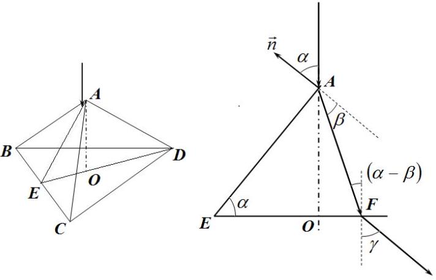
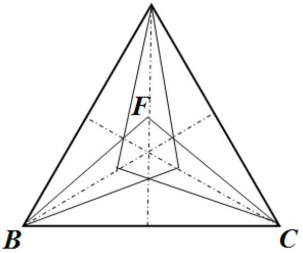
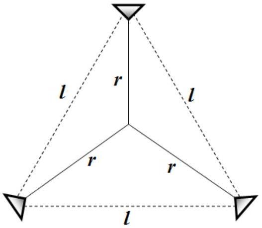
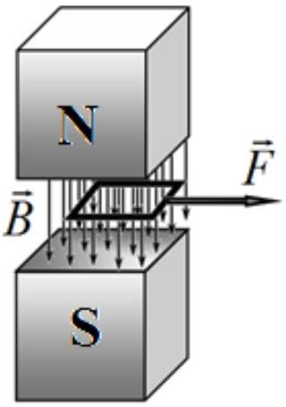
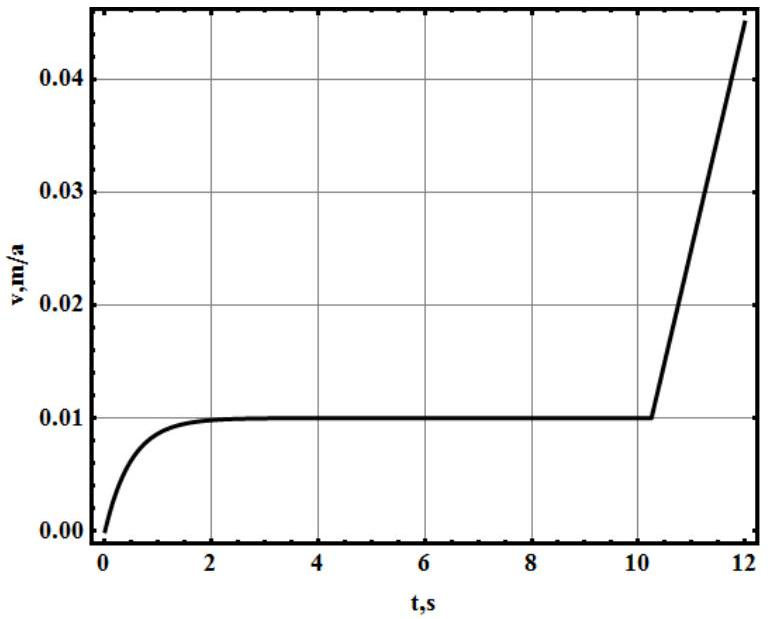
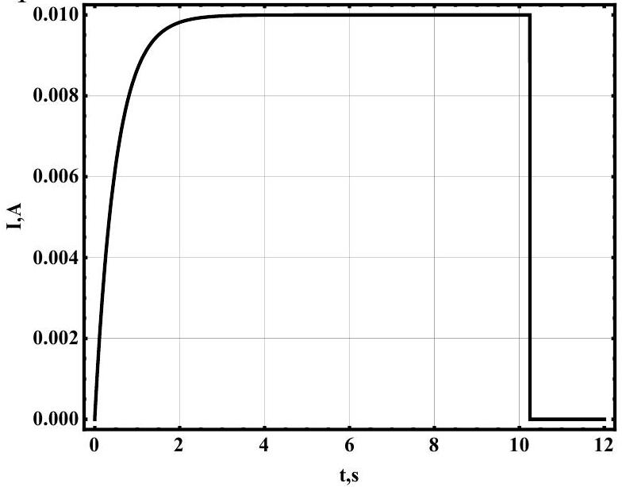
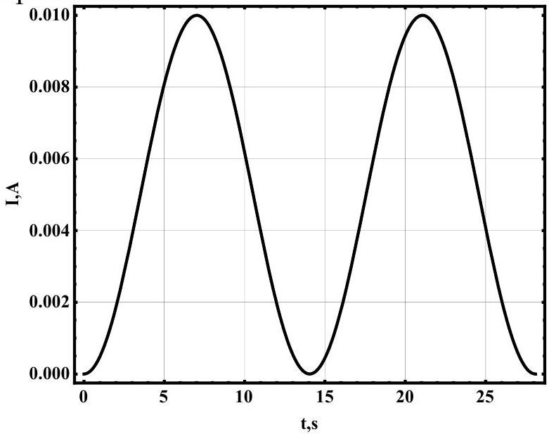

## SOLUTIONS TO THE PROBLEMS OF THE THEORETICAL COMPETITION

## Problem 1 (10 points)

Problem 1.A
Let $l _ { 1 }$ and $l _ { 2 }$ be the lengths of the hanging ends of the rope $\left( l _ { 1 } < l _ { 2 } \right)$. Then $l _ { 2 } - l _ { 1 } = \frac { L } { 2 }$ and $l _ { 1 } + l _ { 2 } + \pi R = L$, fromwhich $l _ { 2 } = \frac { 3 } { 4 } L - \frac { \pi } { 2 } R$.

1. Considertheropeaftera veryshorttimeinterval $\Delta$ tfromthemomentwhentheheightdifferenceof the rope ends is $h = l _ { 2 } - l _ { 1 } = \frac { L } { 2 }$ to the moment when one end of the rope is displaced by the small interval $\Delta x$.Sincethereisnofrictioninthesystem, anyincreaseinthekineticenergyoftheropeshouldbeequaltodecrease in the potential energy. Itcouldbeeasilynoticedthatthe displacementoftheropealongitselfisequivalenttoloweringofa smallpieceoftherope $\Delta x$ bytheheight $h$ :

$$
\begin{aligned}
\Delta \frac { m v ^ { 2 } } { 2 } & = \frac { m } { L } \Delta x \cdot g h , \\
\frac { m 2 v \Delta v } { 2 } & = \frac { m } { L } v \Delta t \cdot g h .
\end{aligned}
$$

Hence,

$$
a = \frac { \Delta v } { \Delta t } = \frac { h } { L } g = \frac { g } { 2 } .
$$

2. Using similar approach as in section 1 , an equation for the conservation of energy is written for the right hand part of the rope (from the top point) considered for a small time interval $\Delta t$. Let $l = l _ { 2 } + \frac { \pi } { 2 } R = \frac { 3 } { 4 } L$ bethelengthofthatpart, $M = m \frac { l } { L } = \frac { 3 } { 4 } m$ isitsmass, $T$ is thetension at the top point, $H = l _ { 2 } + R = \frac { 3 } { 4 } L - R \left( \frac { \pi } { 2 } - 1 \right)$ is thedifference in heights between the top point and the lowest points of the rope. Then:

$$
\begin{gathered}
\Delta \frac { M v ^ { 2 } } { 2 } = \frac { m } { L } \Delta x \cdot g H - T \Delta x , \\
M v a = \frac { m } { L } v \cdot g H - T v , \\
T = \frac { m g H } { L } - M a = m g \left[ \frac { 3 } { 8 } + \frac { R } { L } \left( 1 - \frac { \pi } { 2 } \right) \right] .
\end{gathered}
$$

3. Thesecondlaw of Newtonforthesmallpieceoftherope is writteninprojectiontothetangentline:

$$
\Delta m \cdot a = \Delta m \cdot g \sin \alpha + T _ { 1 } - T _ { 2 } .
$$

If that small piece is chosen at the point with the maximum tension, then $T _ { 1 } = T _ { 2 }$, from which the following can be obtained:

$$
\begin{gathered}
\sin \alpha = \frac { a } { g } = \frac { 1 } { 2 } . \\
\alpha = 30 ^ { \circ }
\end{gathered}
$$

Grading scheme for Problem 1.A
| № | Description | Points |
| :--- | :--- | :--- |
| 1. | Correct value of the acceleration | 1 |
| 2. | There is a correct reasoning, some justification for the final answer | 1 |
| 3. | Correctmethodtofind $T _ { \text {top } }$ is presented | 1 |
| 4. | Exact answer for $T _ { \text {top } }$ | 0,5 |
| 5. | Reasonable method to solve for $\alpha$ is presented | 1 |
| 6. | Final answer for $\alpha$ | 0,5 |
|  | Total | 5,0 |

Problem 1.B Assistant Vapor

Air, closedinthevesselatthetemperatureof $200 ^ { \circ } \mathrm { C }$,exertsthe following pressure:

$$
1 \mathrm {~atm} \cdot \frac { 473 \mathrm {~K} } { 293 \mathrm {~K} } = 1,61 \mathrm {~atm}
$$

At the same temperature, the vapor pressure is $2,88 - 1,61 = 1,27 a t m$. Then, the vaporpressureatanytemperature Twhen all water is vaporized is found as:

$$
P _ { \text {vap } } = 1,27 \cdot \frac { T } { 473 } \mathrm {~atm} = \frac { T } { 373 } \mathrm {~atm}
$$

Let $P ( T )$ be the temperature dependence of the saturated vapor pressure. Then, all water isevaporated at the temperature, which is derived from the following equation:

$$
P ( T ) = \frac { T } { 373 } \mathrm {~atm} ,
$$

Solution of this equation could be obtained even without further knowledge of the function $P ( T )$. It is well known, that at $P = 1 \mathrm {~atm} , T = 373 \mathrm {~K} = 100 ^ { \circ } \mathrm { C }$. Thus, this checks the solution.

## Marking scheme for Problem 1B:

| № | Description | Points |
| :--- | :--- | :--- |
| 1. | Correct value for air pressure at $\mathrm { T } = 200 ^ { \circ } \mathrm { C }$ | 0,5 |
| 2. | Vapor pressure was found for any temperature $T$ | 0,5 |
| 3. | Conditionfor $T _ { \text {vap } }$ was written | 0,5 |
| 4. | Correct final answer | 0,5 |
| Total |  | 2.0 |

## Problem 1.C Pyramid

1. Considera beam, which falls down on one of the sidesat the point, close to the top of the pyramid. The angle of incidence of the beam on the facet is equal to the angle between the lateral facet and the base of the pyramid $\angle A E O = \alpha$. It is easy to prove geometrically that $\cos \alpha = \frac { 1 } { \sqrt { 3 } }$, thus $\alpha = 54,7 ^ { \circ }$.
According tothe refraction law the angle $\beta$ can be written as follows:

$\sin \beta = \frac { \sin \alpha } { n } = \frac { 1 } { n } \sqrt { \frac { 2 } { 3 } }$. Thus, $\beta = 24,6 ^ { \circ }$.
Let us find the point F, where that beam falls on the base of the pyramid. The height of the lateral facet is $| A E | = \frac { a } { 2 }$, pyramid's height $| A O | = \frac { a } { 2 } \sin \alpha = \frac { a } { 2 } \sqrt { \frac { 2 } { 3 } } = 0,41 m m$.
Then, $| O F | = | A O | \operatorname { tg } ( \alpha - \beta ) = 0,24 m m$. Finally, the point sought is located at the distance $| D F | = | O D | - | O F | = \frac { a } { \sqrt { 3 } } - 0,24 m m = 0,91 m m$. The

same point is located at a distance

$| E O | = a \frac { \sqrt { 3 } } { 2 } - | D F | = 0,82 m m$ fromthemiddlepointofbase'sside Thus, the beam refracted by the facet BCF illuminates a triangle at the base of the pyramid. Symmetrical triangles are illuminated by the other two facets (see figure 2).
2. Let usfindanangle $\gamma$, of the beam after its refraction on the base of the pyramid. It follows fromFigure 1 andthe refractionlaw that:

$$
\begin{equation*}
\sin \gamma = n \sin ( \alpha - \beta ) = n ( \sin \alpha \cos \beta - \cos \alpha \sin \beta ) = \sqrt { \frac { 2 } { 3 } } \sqrt { n ^ { 2 } - \frac { 2 } { 3 } } - \frac { \sqrt { 2 } } { 3 } . \tag{1}
\end{equation*}
$$

Numericalvalueofthisangleis $\gamma = 41 ^ { \circ }$. As the beams, refracted by one facet are parallel to each other, they illuminate similar regions on the screen as they do at the base of the pyramid.Theonlydifferenceisthatthose triangular regions are displaced at the distance $r = L \operatorname { tg } \gamma = 8,6 c m$. Thus, threesmalltriangularregionsareseenonthescreen, which are located at the tops of the triangle of theside $l = r \sqrt { 3 } = 14,9 c m$.

Marking scheme for Problem 1C:
| № | Description | Points |
| :--- | :--- | :--- |
| 1 | Light refraction law | 0.2 |
| 2 | Incidence angle on the facet of the pyramid | 0.4 |
| 3 | Location of pointF | 1.0 |
| 4 | Illuminated regions at the base of the pyramid | 0.4 |
| 5 | Outlet angle at the base | 0.4 |
| 6 | Illuminated regions at the screen | 0.6 |
| Total |  | 3.0 |

## Problem 2 (10 points) Square frame

1. In physics, it is agreed that the magnetic field lines begin at the north pole and ends at the South pole. Therefore, the drawing should look like this

2. Whentheframe is removedfromtheuniformmagneticfield,the induced emf can be found from the Faraday law

$$
\begin{equation*}
\varepsilon = - \frac { d \Phi } { d t } = - \frac { d } { d t } ( \operatorname { Bax } ) = \operatorname { Bav } ( t ) . \tag{1}
\end{equation*}
$$

On the other hand Ohm's law is written as

$$
\begin{equation*}
\varepsilon = I R , \tag{2}
\end{equation*}
$$

Thus, we get the relation between the current and the velocity

$$
\begin{equation*}
I ( t ) = \frac { B a v ( t ) } { R } . \tag{3}
\end{equation*}
$$

The frame is affectedbythe force that pullsthe frame back into the magnetic field.It isfoundfromAmpere'slaw

$$
\begin{equation*}
F _ { A } ( t ) = B a I ( t ) = \frac { B ^ { 2 } a ^ { 2 } \mathrm { v } ( t ) } { R } . \tag{4}
\end{equation*}
$$

Thus, the equation of motion is written as

$$
\begin{equation*}
m \frac { d v ( t ) } { d t } = F - \frac { B ^ { 2 } a ^ { 2 } v ( t ) } { R } . \tag{5}
\end{equation*}
$$

Solutionofequation (5) with the initial condition $\mathrm { v } ( 0 ) = 0$ is

$$
\begin{equation*}
\mathrm { v } ( t ) = \frac { F R } { B ^ { 2 } a ^ { 2 } } \left[ 1 - \exp \left( - \frac { B ^ { 2 } a ^ { 2 } } { m R } t \right) \right] . \tag{6}
\end{equation*}
$$

3. Integrating (6) we get following relation

$$
\begin{equation*}
x ( t ) = \int _ { 0 } ^ { t } \mathrm { v } ( t ) d t = \frac { F R } { B ^ { 2 } a ^ { 2 } } \left[ t + \frac { m R } { B ^ { 2 } a ^ { 2 } } \left( \exp \left( - \frac { B ^ { 2 } a ^ { 2 } } { m R } t \right) - 1 \right) \right] . \tag{7}
\end{equation*}
$$

When the frame leaves the magnetic field

$$
\begin{equation*}
x \left( t _ { 0 } \right) = a , \tag{8}
\end{equation*}
$$

Thus, we get an equation for $t _ { 0 }$

$$
\begin{equation*}
t _ { 0 } + \frac { m R } { B ^ { 2 } a ^ { 2 } } \left[ \exp \left( - \frac { B ^ { 2 } a ^ { 2 } } { m R } t _ { 0 } \right) - 1 \right] = \frac { B ^ { 2 } a ^ { 3 } } { F R } . \tag{9}
\end{equation*}
$$

Equation (9) istranscendentalandcannotbesolvedanalytically. Toestimate $t _ { 0 }$ wecansee from equation (6) thatforthe characteristic time $\tau \sim m R / B ^ { 2 } a ^ { 2 }$ the frame reaches the steady velocity $\mathrm { v } _ { 0 } = F R / B ^ { 2 } a ^ { 2 }$. Weassumethatfrom 0 to $\tau$ the framemoveswiththe constantacceleration $w = F / m$, then it moves with the steady velocity $\mathrm { v } _ { 0 }$. Hence, we get an estimate

$$
\begin{equation*}
t _ { 0 } \sim \tau + \frac { a - \frac { w t ^ { 2 } } { 2 } } { \mathrm { v } _ { 0 } } = \frac { B ^ { 2 } a ^ { 3 } } { F R } + \frac { m R } { 2 B ^ { 2 } a ^ { 2 } } = 10.25 \mathrm { c } . \tag{10}
\end{equation*}
$$

Note that numerical solution of equation (9) gives $t _ { 0 } \approx 10.5 \mathrm { c }$.
4. Afterthe $t _ { 0 }$ theframe continues its motion with the constant acceleration $w$. At the same time the speed should be a continuous function of time, so the time dependence is written as

$$
\mathrm { v } ( t ) = \left\{ \begin{array} { l l }
\frac { F R } { B ^ { 2 } a ^ { 2 } } \left[ 1 - \exp \left( - \frac { B ^ { 2 } a ^ { 2 } } { m R } t \right) \right] , & t < t _ { 0 }  \tag{11}\\
\frac { F R } { B ^ { 2 } a ^ { 2 } } + \frac { F } { m } \left( t - t _ { 0 } \right) , & t \geq t _ { 0 }
\end{array} . \right.
$$

The corresponding graph is plotted as

5. Whilethe frameisbetweenthe magneticpoles, thecurrent is determined by the equations (3) and (6). After that, the frame current vanishesinstantaneously. Thus,

$$
I ( t ) = \left\{ \begin{array} { l l }
\frac { F } { B a } \left[ 1 - \exp \left( - \frac { B ^ { 2 } a ^ { 2 } } { m R } t \right) \right] , & t < t _ { 0 }  \tag{12}\\
0 , & t \geq t _ { 0 }
\end{array} . \right.
$$

The corresponding graph is plotted as

6. As in the previous part, when the frame is removed from the constant magnetic field,theemf (1) is induced.There is anotheremfappearing due to the self-induction of the superconductive frame

$$
\begin{equation*}
\varepsilon _ { L } = - L \frac { d I } { d t } . \tag{13}
\end{equation*}
$$

Since the resistance of the superconductive frame is zero, Ohm's law for the frame becomes

$$
\begin{equation*}
\operatorname { Bav } ( t ) - L \frac { d I } { d t } = 0 . \tag{14}
\end{equation*}
$$

Taking into accountthat $I = 0$ when $x = 0$ we get from equations (13) and (14)

$$
\begin{equation*}
I = \frac { B a x } { L } . \tag{15}
\end{equation*}
$$

The corresponding force is given by

$$
\begin{equation*}
F _ { A } = B a I = \frac { B ^ { 2 } a ^ { 2 } x } { L } . \tag{16}
\end{equation*}
$$

Thus,the equation of motion is written as

$$
\begin{equation*}
m \frac { d ^ { 2 } x } { d t ^ { 2 } } = F - \frac { B ^ { 2 } a ^ { 2 } } { L } x . \tag{17}
\end{equation*}
$$

Expression (17) isan equation ofsimpleharmonicoscillationswith the frequency

$$
\begin{equation*}
\omega = \frac { B a } { \sqrt { m L } } , \tag{18}
\end{equation*}
$$

that are performed near the new equilibrium position with the coordinate

$$
\begin{equation*}
x _ { 0 } = \frac { F L } { B ^ { 2 } a ^ { 2 } } . \tag{19}
\end{equation*}
$$

Obviously, theforce $F$ is minimal when

$$
\begin{equation*}
x _ { 0 } = a / 2 , \tag{20}
\end{equation*}
$$

whence

$$
\begin{equation*}
F _ { \min } = \frac { B ^ { 2 } a ^ { 3 } } { 2 L } = 5.00 \times 10 ^ { - 5 } \mathrm { H } . \tag{21}
\end{equation*}
$$

7. From previoussection 6, the frame reaches the edge of the magnet for a half period of oscillations, thus

$$
\begin{equation*}
t _ { 0 } = \frac { \pi } { \omega } = \pi \frac { \sqrt { m L } } { B a } = 7.02 \mathrm { c } . \tag{22}
\end{equation*}
$$

8. Solutionofequation (17) with the initial conditions $x ( 0 ) = 0 , x ^ { \prime } ( 0 ) = 0$ is written as

$$
\begin{equation*}
x ( t ) = \frac { F _ { \min } L } { B ^ { 2 } a ^ { 2 } } ( 1 - \cos \omega t ) = \frac { a } { 2 } ( 1 - \cos \omega t ) . \tag{23}
\end{equation*}
$$

According to equation (15) the frame current varies as

$$
\begin{equation*}
I ( t ) = \frac { B a x ( t ) } { L } = \frac { B a ^ { 2 } } { 2 L } ( 1 - \cos \omega t ) . \tag{24}
\end{equation*}
$$

The corresponding graph is plotted as

9. Ohm's law for the frame is written as

$$
\begin{equation*}
B a \mathrm { v } - L \frac { d I } { d t } = I R \tag{25}
\end{equation*}
$$

and its equation of motion is as follows

$$
\begin{equation*}
m \frac { d \mathrm { v } } { d t } = - B I a . \tag{26}
\end{equation*}
$$

Equations (25) and (26) can be rewritten in finite differences as follows

$$
\begin{align*}
& B a ^ { 2 } - L I _ { 0 } = q R ,  \tag{27}\\
& m \mathrm { v } _ { 0 } = B q a , \tag{28}
\end{align*}
$$

where $q$ is the charge flown through the circuit.
Solving (27) and (28) together, we obtain

$$
\begin{equation*}
I _ { 0 } = \frac { B ^ { 2 } a ^ { 3 } - m \mathrm { v } _ { 0 } R } { a B L } . \tag{29}
\end{equation*}
$$

Marking scheme
| № | Description | points |  |
| :--- | :--- | :--- | :--- |
| 1 | Properly set northern N and southern S poles | 0.2 | 0.2 |
| 2 | Eq (1) | 0.2 | 1.2 |
|  | Eq (2) | 0.2 |  |
|  | Eq (3) | 0.2 |  |
|  | Eq (4) | 0.2 |  |
|  | Eq (5) | 0.2 |  |
|  | Solution (6) | 0.2 |  |
| 3 | Eq (7) | 0.2 | 0.8 |
|  | Eq (8) | 0.2 |  |
|  | Eq (9) | 0.2 |  |
|  | Numerical value of $t _ { 0 }$ | 0.2 |  |
| 4 | Eq (11) | 0.2 | 1.2 |
|  | Graphof $\mathrm { v } ( t )$ : axis signed and digitized | 0.2 |  |
|  | Graphof $\mathrm { v } ( t )$ : there is a part with a constant velocity | 0.2 |  |
|  | Graphof $\mathrm { v } ( t )$ : there is a part with constant acceleration | 0.2 |  |
|  | Graph of $\mathrm { v } ( t )$ : continuous | 0.2 |  |
|  | Graphof $\mathrm { v } ( t )$ : correct numerical values | 0.2 |  |
| 5 | Eq (12) | 0.2 | 1.2 |
|  | Graphof $I ( t )$ : axis signed and digitized | 0.2 |  |
|  | Graphof $I ( t )$ : there is a part with constant current | 0.2 |  |
|  | Graphof $I ( t )$ : there is a part with zero current | 0.2 |  |
|  | Graph of $I ( t )$ : discontinuous | 0.2 |  |
|  | Graphof $I ( t )$ : correct numerical values | 0.2 |  |
| 6 | Eq (13) | 0.2 | 1.8 |
|  | Eq (14) | 0.2 |  |
|  | Relationship (15) | 0.2 |  |
|  | Quasi-elastic force (16) | 0.2 |  |
|  | Eq of motion (17) | 0.2 |  |
|  | Equilibrium point (19) | 0.2 |  |
|  | Condition (20) | 0.2 |  |
|  | Eq (21) for $F _ { \text {min } }$ | 0.2 |  |
|  | Numerical value $F _ { \text {min } }$ | 0.2 |  |
| 7 | Frequency (18) | 0.2 |  |
|  | Eq (22) | 0.2 |  |
|  | Numerical value of $t _ { 0 }$ | 0.2 |  |
| 8 | Eq (23) | 0.2 | 1.0   1.0 |
|  | Eq (24) | 0.2 |  |
|  | Graphof $I ( t )$ : axis signed and digitized | 0.2 |  |
|  | Graphof $I ( t )$ : two periods of current oscillation | 0.2 |  |
|  | Graphof $I ( t )$ : correct value of amplitude | 0.2 |  |
| 9 | Ohm's Law (25) | 0.2 |  |
|  | Eq of motion (26) | 0.2 |  |

|  | Eq (27) | 0.7 | 2.0 |
| :--- | :--- | :--- | :--- |
|  | Eq (28) | 0.7 |  |
|  | Expression (29) | 0.2 |  |
| Total |  |  | 10,0 |

## Problem 3 (10 pts)   Bohr model for hydrogen atom

1. We can use Kepler's third law to find the free fall time of the electron onto the proton. Consider a circular orbit of radius $R$, then the equation of motion of the electron can be written as

$$
\begin{equation*}
m _ { e } \left( \frac { 2 \pi } { T } \right) ^ { 2 } R = \frac { 1 } { 4 \pi \varepsilon _ { 0 } } \frac { e ^ { 2 } } { R ^ { 2 } } , \tag{1}
\end{equation*}
$$

where $T$ is the period of revolution.
Thus,Kepler's third law for the electron is given by

$$
\begin{equation*}
\frac { a ^ { 3 } } { T ^ { 2 } } = \frac { 1 } { 16 \pi ^ { 3 } \varepsilon _ { 0 } } \frac { e ^ { 2 } } { m _ { e } } , \tag{2}
\end{equation*}
$$

where $a$ is the majorsemi-axisof an elliptic orbit.
Consider the free fall of the electron onto the proton as a motion along a very elongated ellipse with semi-axes $a = r _ { 0 } / 2$. Then,the free fall time of the electron equals to the half of this period

$$
\begin{equation*}
t _ { 1 } = \frac { T } { 2 } = \sqrt { \frac { \pi ^ { 3 } m _ { e } \varepsilon _ { 0 } r _ { 0 } ^ { 3 } } { 2 e ^ { 2 } } } = 2.46 \times 10 ^ { - 17 } \mathrm { c } . \tag{3}
\end{equation*}
$$

2. To find the dependence of the electron velocity on the orbit radius we again use Newton's second law, which is now written in the form

$$
\begin{equation*}
m _ { e } \frac { \mathrm { v } ^ { 2 } } { r } = \frac { 1 } { 4 \pi \varepsilon _ { 0 } } \frac { e ^ { 2 } } { r ^ { 2 } } , \tag{4}
\end{equation*}
$$

which yields

$$
\begin{equation*}
\mathrm { v } = \sqrt { \frac { 1 } { 4 \pi \varepsilon _ { 0 } } \frac { e ^ { 2 } } { m _ { e } r } } , \tag{5}
\end{equation*}
$$

3. The angular momentum of the electron is found from equation (5) as

$$
\begin{equation*}
L = m _ { e } \mathrm { v } r = \sqrt { \frac { m _ { e } r e ^ { 2 } } { 4 \pi \varepsilon _ { 0 } } } . \tag{6}
\end{equation*}
$$

4. Since, according to the Bohr model of the hydrogen atom the angular momentum of the electron is quantized, that is $L = n \hbar$, From equation (6) we can get

$$
\begin{equation*}
r _ { n } = \frac { 4 \pi \varepsilon _ { 0 } n ^ { 2 } \hbar ^ { 2 } } { m _ { e } e ^ { 2 } } . \tag{7}
\end{equation*}
$$

5. Fromequation (7) weseethatthe minimalradiuscorresponds tothe quantumnumber $n = 1$, hence

$$
\begin{equation*}
r _ { 1 } = \frac { 4 \pi \varepsilon _ { 0 } \hbar ^ { 2 } } { m _ { e } e ^ { 2 } } = 5.19 \times 10 ^ { - 11 } \mathrm { M } . \tag{8}
\end{equation*}
$$

6. The total energy of the electron in the atom is the sum of the kinetic and potential energies.Takingintoaccountequation (5) wecanwritethetotalenergyofelectronin the following form

$$
\begin{equation*}
E = \frac { m _ { e } v ^ { 2 } } { 2 } - \frac { e ^ { 2 } } { 4 \pi \varepsilon _ { 0 } r } = - \frac { e ^ { 2 } } { 8 \pi \varepsilon _ { 0 } r } . \tag{9}
\end{equation*}
$$

Substituting the possible values of the orbit radii ofthe electron (7), we immediately obtain

$$
\begin{equation*}
E _ { n } = - \frac { m _ { e } e ^ { 4 } } { 32 \pi ^ { 2 } \varepsilon _ { 0 } ^ { 2 } \hbar ^ { 2 } n ^ { 2 } } . \tag{10}
\end{equation*}
$$

7. Fromequation (10) weseethatthe minimaltotalenergycorrespondstothe quantumnumber $n = 1$, hence

$$
\begin{equation*}
E _ { 1 } = - \frac { m _ { e } e ^ { 4 } } { 32 \pi ^ { 2 } \varepsilon _ { 0 } ^ { 2 } \hbar ^ { 2 } } = - 2.24 \times 10 ^ { - 18 } \text { Дж. } \tag{11}
\end{equation*}
$$

8. The total energy of the electron (9) is spent on the emission of electromagnetic waves

$$
\begin{equation*}
\frac { d E } { d t } = - P . \tag{12}
\end{equation*}
$$

From the equation (9) and (12) we get

$$
\begin{equation*}
r ( t ) ^ { 2 } \frac { d r ( t ) } { d t } = - \frac { e ^ { 4 } } { 12 \pi ^ { 2 } \varepsilon _ { 0 } ^ { 2 } m _ { e } ^ { 2 } c ^ { 3 } } . \tag{13}
\end{equation*}
$$

By solving equation (13) with the initial condition $r ( 0 ) = r _ { 1 }$, we get

$$
\begin{equation*}
r ( t ) = \sqrt [ 3 ] { r _ { 1 } ^ { 3 } - \frac { e ^ { 4 } } { 4 \pi ^ { 2 } \varepsilon _ { 0 } ^ { 2 } m _ { e } ^ { 2 } c ^ { 3 } } } t . \tag{14}
\end{equation*}
$$

9. The fallingtime $\tau _ { 1 }$ is found from the condition $r ( t ) = 0$. By substituting this into equation (14)

$$
\begin{equation*}
\tau _ { 1 } = \frac { 4 \pi ^ { 2 } m _ { e } ^ { 2 } \varepsilon _ { 0 } ^ { 2 } c ^ { 3 } r _ { 1 } ^ { 3 } } { e ^ { 4 } } = \frac { 256 \pi ^ { 5 } \varepsilon _ { 0 } ^ { 5 } c ^ { 3 } \hbar ^ { 5 } } { m _ { e } e ^ { 10 } } = 1.44 \times 10 ^ { - 11 } \mathrm { c } . \tag{15}
\end{equation*}
$$

10. |For a short time interval $d t$ the electron makes a turn by theangle $d \varphi$, defined as

$$
\begin{equation*}
d \varphi = \frac { \mathrm { v } } { r } d t . \tag{16}
\end{equation*}
$$

Bysubstituting the velocity from equation (5) and $d t$ from equation (13), we find

$$
\begin{equation*}
d \varphi = - \frac { 6 c ^ { 3 } \left( \pi m _ { e } \varepsilon _ { 0 } \right) ^ { 3 / 2 } } { e ^ { 3 } } \sqrt { r } d r . \tag{17}
\end{equation*}
$$

Total angle of rotation is found by the integration from $r _ { 1 }$ to zero

$$
\begin{equation*}
\varphi = \int _ { r _ { 1 } } ^ { 0 } d \varphi = \int _ { 0 } ^ { r _ { 1 } } \frac { 6 c ^ { 3 } \left( \pi m _ { e } \varepsilon _ { 0 } \right) ^ { 3 / 2 } } { e ^ { 3 } } \sqrt { r } d r = \frac { 4 c ^ { 3 } \left( \pi m _ { e } \varepsilon _ { 0 } r _ { 1 } \right) ^ { 3 / 2 } } { e ^ { 3 } } = \frac { 32 \pi ^ { 3 } \varepsilon _ { 0 } ^ { 3 } c ^ { 3 } \hbar ^ { 3 } } { e ^ { 6 } } . \tag{18}
\end{equation*}
$$

Thus, the total number of revolutions is equal to

$$
\begin{equation*}
N = \frac { \varphi } { 2 \pi } = \frac { 16 \pi ^ { 2 } \varepsilon _ { 0 } ^ { 3 } c ^ { 3 } \hbar ^ { 3 } } { e ^ { 6 } } = 1.96 \times 10 ^ { 5 } . \tag{19}
\end{equation*}
$$

Marking scheme
| № | Description | points |  |
| :--- | :--- | :--- | :--- |
| 1 | Eq (1) | 0.5 |  |
|  | Eq(2) | 0.5 |  |
|  | Eq(3) | 0.5 |  |
|  | Correct numerical value of $t _ { 1 }$ | 0.5 |  |
| 2 | Eq (4) | 0.5 | 1,0 |
|  | Eq (5) | 0.5 |  |
| 3 | Eq (6) | 0.5 | 0.5 |
| 4 | Eq (7) | 0.5 | 0.5 |
| 5 | Correct numerical value of $r _ { 1 }$ | 0.5 | 0.5 |

| 6 | Eq (9) | 0.5 | 1.0 |
| :--- | :--- | :--- | :--- |
|  | Eq (10) | 0.5 |  |
| 7 | Correct numerical value of $E _ { 1 }$ | 0.5 | 0.5 |
| 8 | The conservation law (12) | 0.5 | 1.5 |
|  | Eq (13) | 0.5 |  |
|  | Eq (14) | 0.5 |  |
| 9 | Correct numerical value $\tau _ { 1 }$ | 0.5 | 0.5 |
| 10 | Eq (16) | 0.5 | 2.0 |
|  | Eq(17) | 0.5 |  |
|  | Eq(18) | 0.5 |  |
|  | Correct numerical value $N$ | 0.5 |  |
| Total |  |  | 10,0 |
