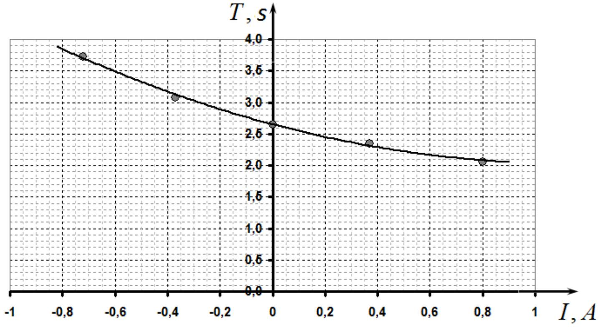
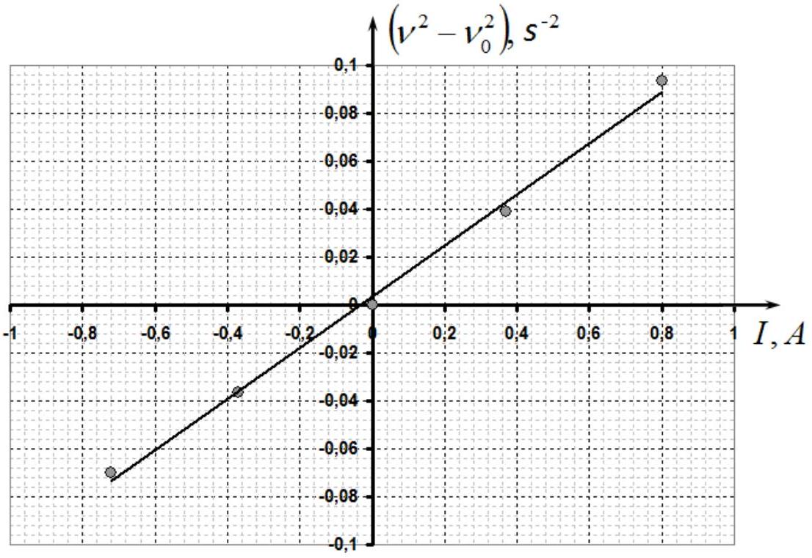
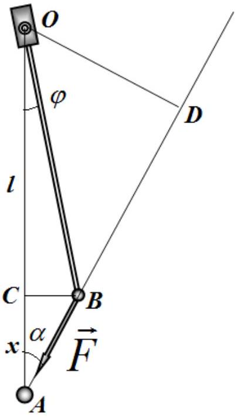
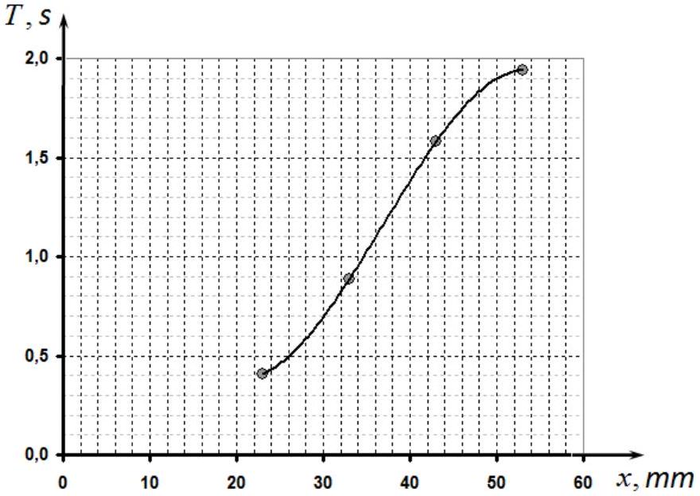
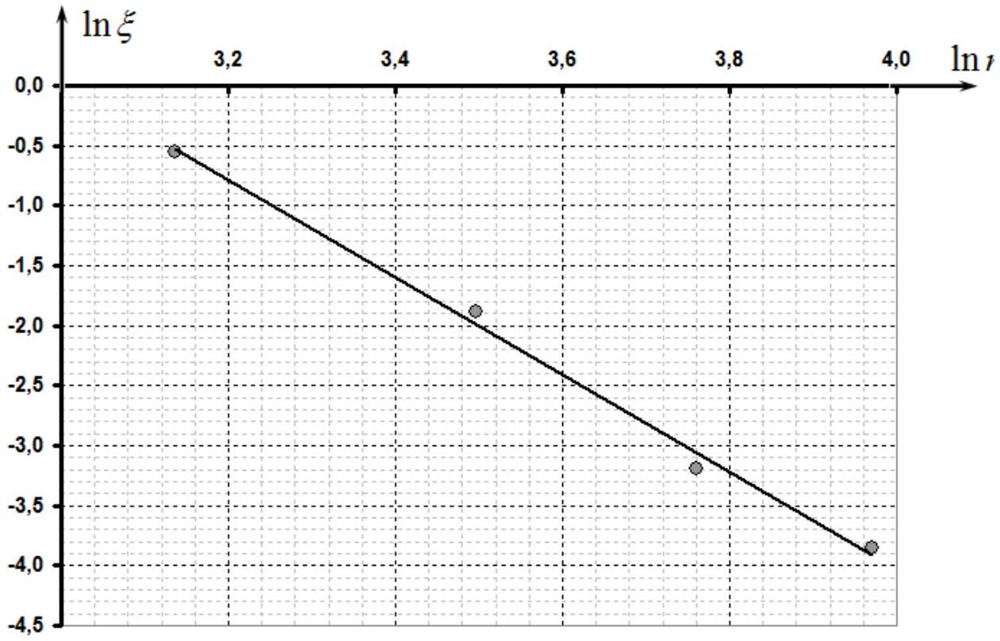
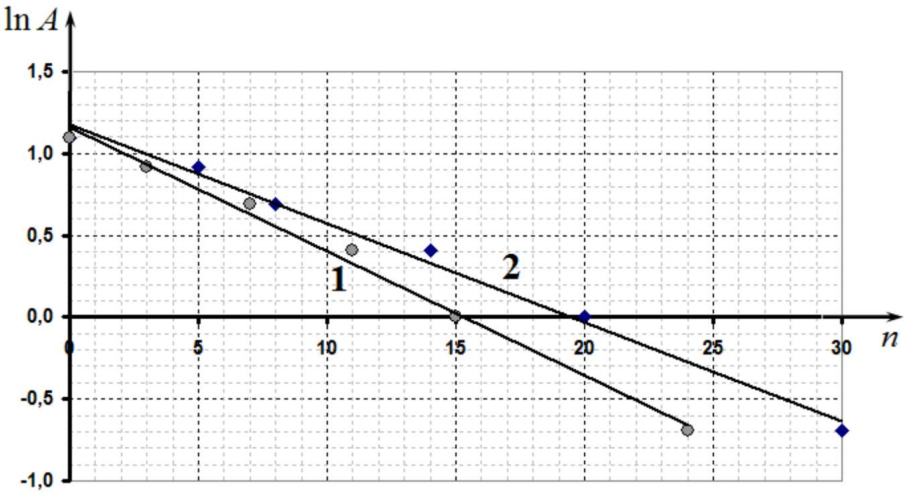

## SOLUTION FOR THE EXPERIMENTAL COMPETITION Magnetic interactions

## Part 1. Interaction with the magnetic field of a coil

1.1. To measure the oscillation period it is necessary to measure the time of at least 10 oscillations several times. The following values for 10 oscillations are obtained:

$$
\begin{aligned}
& t _ { 1 } = 25,02 \mathrm {~s} \\
& t _ { 2 } = 25,06 \mathrm {~s} . \\
& t _ { 3 } = 24,92 \mathrm {~s}
\end{aligned}
$$

Evaluation of the period from this data gives rise to

$$
T = \frac { \langle t \rangle } { 10 } = 2,50 \mathrm {~s} .
$$

Experimental error is evaluated by the formula

$$
\Delta t = 2 \sqrt { \frac { \sum _ { k } \left( t _ { k } - \langle t \rangle \right) ^ { 2 } } { n ( n - 1 ) } } = 0,08 s ,
$$

and, therefore, the accuracy of the period is equal to $\Delta T = \Delta t / 10 = 0,008 s$.
Finally, one can write

$$
\begin{equation*}
T = ( 2,50 \pm 0,01 ) s . \tag{1}
\end{equation*}
$$

1.2. The following circuit can be used for measurements (it is also acceptable for the rheostat to be used as a potentiometer).

Table 1
| $I , A$ | $T , s$ | $v ^ { 2 } , s ^ { - 2 }$ | ( $v ^ { 2 } - v _ { 0 } ^ { 2 }$ ), $s ^ { - 2 }$ |
| :--- | :--- | :--- | :--- |
| 0,00 | 2,655 | 0,142 | 0,000 |
| 0,80 | 2,062 | 0,235 | 0,093 |
| 0,37 | 2,350 | 0,181 | 0,039 |
| -0,37 | 3,083 | 0,105 | -0,037 |
| -0,72 | 3,724 | 0,072 | -0,070 |

Figure 1. Dependence of the oscillation period of the pendulum on the current in the coil.

1.4. To describe the motion of the pendulum the following equation should be used

$$
\begin{equation*}
J \frac { d ^ { 2 } \varphi } { d t ^ { 2 } } = - m g a \cdot \varphi - \mu I \varphi , \tag{2}
\end{equation*}
$$

where $\varphi$ stands for the angle of deflection of the pendulum from the vertical, $J$ denotes the moment of inertia of the pendulum about the axis of rotation, $m$ is the pendulum mass, a designates the distance from the axis of rotation to the center of the pendulum mass, $\mu I \varphi$ refers to the moment of the force acting on a magnetized bead caused by the magnetic field of the coil. Equation (2) implies that the square of the oscillation frequency depends linearly on the current strength as:

$$
v ^ { 2 } = \frac { 1 } { T ^ { 2 } } = \frac { m g a + \mu I } { J }
$$

It is clearly seen that the square of the oscillation frequency against the coil current is convinuently represented as

$$
v ^ { 2 } - v _ { 0 } ^ { 2 } = \frac { \mu I } { J } ,
$$

where $v _ { 0 } ^ { 2 } = \frac { m g a } { J }$ stands for the square of the oscillation frequency in the absence of the current in the coil.

Thus, the linear dependence of the value $\left( v ^ { 2 } - v _ { 0 } ^ { 2 } \right)$ against the current strength proves the assertion of direct proportionality between the strength of the magnetic interaction and the current in the coil. The figure shows the
 corresponding graph which confirms the linearity assumption.

## Part 2. Pointlike interaction

2.1.

To write the equation of motion it is necessary to correctly calculate the torque of the interaction forces between magnetized beads. Since the force is central, the shoulder is a segment $O D$, and its length is

$$
d = | O D | = ( l + x ) \cdot \alpha ,
$$

where $l$ is the distance from the rotation axis to the bead in the pendulum, $x$ stands for the distance between the beads in the equilibrium position. Hereinafter angles are assumed small. The angle $\alpha$ should be expressed through the angle $\varphi$ of the pendulum deflection. For this purpose the following ratio can be used

$$
| C B | = l \varphi = x \alpha ,
$$

which gives rise to

$$
\alpha = \frac { l } { x } \varphi .
$$

Thus, the motion of the pendulum is described by the equation

$$
\begin{equation*}
J \frac { d ^ { 2 } \varphi } { d t ^ { 2 } } = - m g a \varphi - F \frac { l ( l + x ) } { x } \varphi . \tag{3}
\end{equation*}
$$

This equation implies that the formula for the oscillation period is given by

$$
\begin{equation*}
T = 2 \pi \sqrt { \frac { J } { m g a + F \frac { l ( l + x ) } { x } } } . \tag{4}
\end{equation*}
$$

2.2. Measurement results of the time of 10 oscillations at different distances between the centers of the beads are given in Table 2 and are drawn in the graph below.

Table 2.
| $x , \mathrm {~mm}$ | $t _ { 1 } , \mathrm {~s}$ | $t _ { 2 } , \mathrm {~s}$ | $t _ { 3 } , \mathrm {~s}$ | $T , \mathrm {~s}$ |
| :--- | :--- | :--- | :--- | :--- |
| 23 | 4,27 | 4,09 | 3,90 | 0,409 |
| 33 | 8,72 | 9,03 | 8,83 | 0,886 |
| 43 | 15,96 | 15,73 | 15,68 | 1,579 |
| 53 | 19,20 | 19,64 | 19,36 | 1,940 |

2.3. To determine the exponent it is necessary to express the strength of interaction in terms of measurable characteristics. It follows from the formula for the oscillation period that the change of the squared frequency is found as

$$
v ^ { 2 } - v _ { 0 } ^ { 2 } = F \frac { l ( l + x ) } { x } \frac { 1 } { J } ,
$$

This means that the value

$$
\xi = \left( v ^ { 2 } - v _ { 0 } ^ { 2 } \right) \frac { x } { l + x }
$$

is proportional to the strength of the magnetic interaction $F = \frac { C } { r ^ { \gamma } }$. To determine the exponent it is necessary to plot the dependence of $\xi$ on the distance $\xi$ in a logarithmic scale. The slope coefficient in this graph provides the desired exponent.

The figure shows the corresponding graph. It follows from this graph that the exponent is equal to $\gamma = 4$.

## Part 3 . Magnetic chocolate

3.1 Chocolate does not affect the period of oscillation, but significantly increases the damping of oscillations. This occurs due to the occurrence of eddy currents in the foil.
3.2 In order to prove this, one can measure the dependence of the oscillation amplitude on the time ( or, equivalently, on the number of oscillations in semi-logarithmic scale.
The graph below shows the corresponding data with (1) and without (2) chocolate. The graphs show an increase in the damping of oscillations in the presence of chocolate.

Grading scheme
| № | Part of the problem | Total for the part | Points |
| :--- | :--- | :--- | :--- |
| 1.1 | Measurement of the period: | 0,5 |  |
|  | - Period is larger than 2 seconds; |  | 0,1 |
|  | - Not less than 3 measurements; |  | 0,1 |
|  | - Each measurement includes at least 10 periods; |  | 0,1 |
|  | - The average value is found; |  | 0,1 |
|  | - Random error is evaluated; |  | 0,1 |
| 1.2 |  | 0,5 |  |
|  | Circuit diagram (all elements connected in series): |  |  |
|  | - Source; |  | 0,1 |
|  | - Coil; |  | 0,1 |
|  | - Rheostat (two possible ways); |  | 0,1 |
|  | - Key; |  | 0,1 |
|  | - Ammeter; |  | 0,1 |
| 1.3 |  | 2,0 |  |
|  | Measurements (counted only if the period is measured in the range 1-5 s) |  |  |
|  | - Measured at 7 (5, 3, less) values of the current; |  | 1(0,5; 0,3; 0) |
|  | - Current flows in two directions; |  | 0,4 |
|  | - Change in the period is not less than 50\% (20\% less); |  | 0,2 (0,1;0) |
|  | - Measured not less than 5 oscillations; |  | 0,1 |
|  | Plotting: |  |  |
|  | - Axis signed and digitized; |  | 0,1 |
|  | - All the points of the table are plotted; |  | 0,1 |
|  | - A smooth line is drawn; |  | 0,1 |
| 1.4 |  | 1,0 |  |
|  | Linearization: |  |  |
|  | - Dependence of the squared frequency on the current is |  |  |
|  | linear; |  | 0,4 |
|  | - all the points are included in evaluation; |  | 0,2 |
|  | Plotting: |  |  |
|  | - Axis signed and digitized; |  | 0,1 |
|  | - All the points of the table are plotted; |  | 0,1 |
|  | - A smooth straight line is drawn; |  | 0,1 |
|  | Conclusions on the validity |  | 0,1 |
| 2.1 |  | 1,0 |  |
|  | The equation of motion: |  |  |
|  | - General view (the dynamics of rotational motion); |  | 0,3 |
|  | - Torque of the gravity force; |  | 0,2 |
|  | - Torque of the magnetic interaction force; |  | 0,3 |
|  | Formula for the period of oscillation |  | 0,2 |
| 2.2 | Measurements of the oscillation period (counted only if the period is the range of 0.3-5 s) | 4,0 |  |
|  | - Measurements for 7 (5.3 less) distances; |  | 2,5(1,5; 1,0; 0) |
|  | - Change in the period is not less than 4 times (2 times, or less); |  | 1,2(0,5;0) |
|  | Plotting: |  |  |
|  | - Axis signed and digitized; |  | 0,1 |
|  | - All the points of the table are plotted; |  | 0,1 |

|  | - A smooth line is drawn; |  | 0,1 |
| :--- | :--- | :--- | :--- |
| 2.3 | Determination of the exponent | 4,0 |  |
|  | The correct linearization is found; |  | 2,0 |
|  | The parameters of the linearized dependence are determined; |  | 0,5 |
|  | Plotting: |  |  |
|  | - Axis signed and digitized; |  | 0,1 |
|  | - All the points of the table are plotted; |  | 0,1 |
|  | - A smooth straight line is drawn; |  | 0,1 |
|  | The slope lies in the range from 2 to 6; |  | $( 0,6 )$ |
|  | The exponent is found to be equal to 4; |  | 1,2 |
| 3.1 |  | 0,5 |  |
|  | Period is constant; |  | 0,2 |
|  | Damping is increased; |  | 0,2 |
|  | The reason is the eddy currents in the chocolate bar. |  | 0,1 |
| 3.2 |  | 1,5 |  |
|  | The dependence of the amplitude on the number of oscillations (it is equivalent to measure the number of oscillations for amplitude decrease in the specified |  |  |
|  | limits) |  | 1,2 |
|  | Plotting: |  |  |
|  | - Axis signed and digitized; |  | 0,1 |
|  | - All the points of the table are plotted; |  | 0,1 |
|  | - A smooth line is drawn; |  | 0,1 |
|  | TOTAL | 15 |  |
