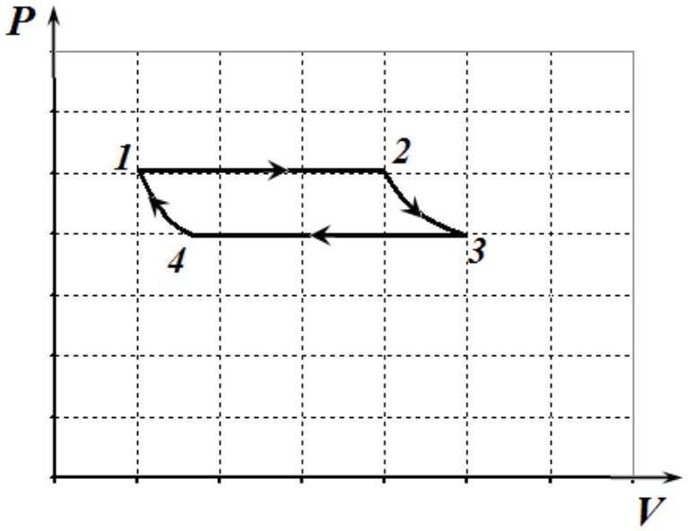
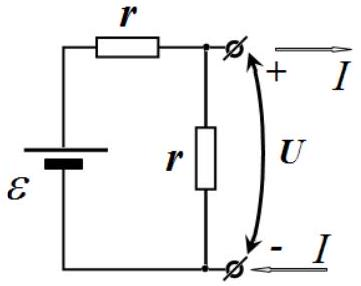
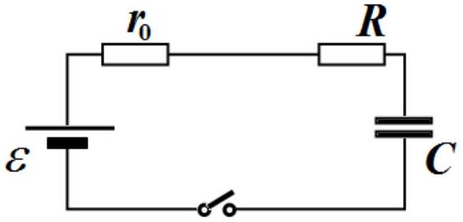
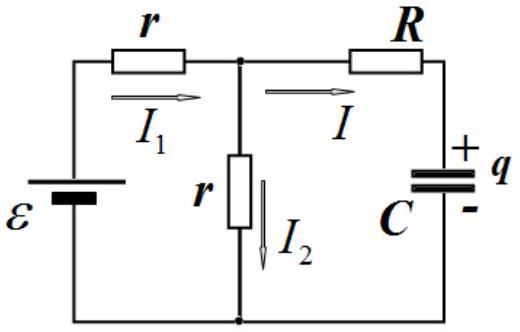
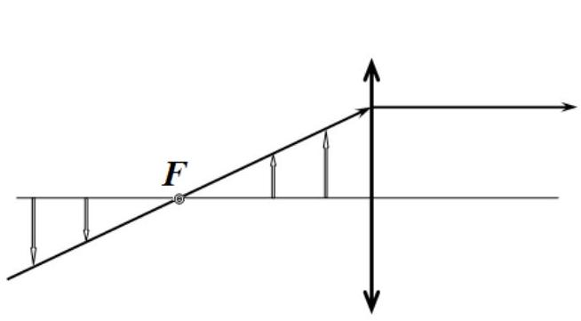
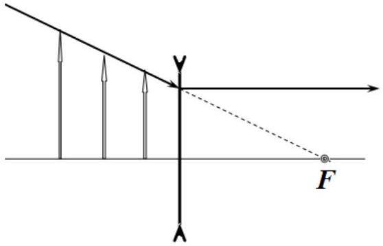
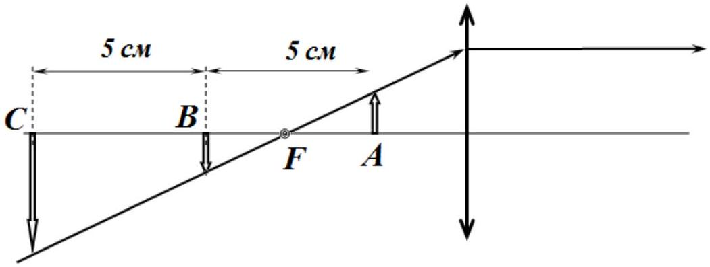

## SOLUTIONS TO THE PROBLEMS OF THE THEORETICAL COMPETITION   Problem 1 (10 points)   Problem 1A (3 points)

In the first stage boiling occurs at a constant pressure, hence at a constant temperature. Likewise, in the third stage condensation takes place at a constant pressure and temperature. The second and the fourth stages can be considered as adiabatic. Schematic $( \boldsymbol { P } , \boldsymbol { V } )$ diagram of the steam engine cycle is shown in the figure on the right. Since this cycle is composed of two isotherms and two adiabats, it is, thus, simply the Carnot cycle. Therefore, its efficiency is found as

$$
\begin{equation*}
\eta = \frac { T _ { 1 } - T _ { 2 } } { T _ { 1 } } , \tag{1}
\end{equation*}
$$

where $T _ { 1 }$ is the boiling temperature in the first stage of the cycle, and $T _ { 2 }$ is the condensation temperature in the third stage of the cycle.

The corresponding temperatures are found from the approximate formula for the saturated vapor pressure provided at the formulation of the problem.
The first stage of the cycle happens at constant pressure

$$
\begin{equation*}
P _ { 1 } = P _ { 0 } + \frac { ( M + m ) g } { S } \approx 1,3 \cdot 10 ^ { 5 } \mathrm {~Pa} . \tag{2}
\end{equation*}
$$

The vapor temperature is the temperature of the water boiling point and is equal to

$$
\begin{equation*}
t _ { 1 } = \frac { P _ { 1 } + b } { a } = \frac { 130 + 384 } { 4,85 } \approx 106 ^ { \circ } \mathrm { C } = 379 \mathrm {~K} . \tag{3}
\end{equation*}
$$

The temperature difference in formula (1) is conveniently evaluated as

$$
\begin{equation*}
T _ { 1 } - T _ { 2 } = \frac { P _ { 1 } - P _ { 2 } } { a } = \frac { m g } { S a } = \frac { 20 } { 4,85 } \approx 4,2 K . \tag{4}
\end{equation*}
$$

Thus, the efficiency of the steam engine is $\eta = \frac { T _ { 1 } - T _ { 2 } } { T _ { 1 } } = \frac { 4,2 } { 379 } = 1,1 \%$.

## Grading scheme

| № | Content | Points |
| :--- | :--- | :--- |
| 1. | 1 and 3 stages are isobars and isotherms | 0,25 |
| 2. | 2 and 4 stages are adiabats | 0,25 |
| 3. | The cycle is identified as a Carnot cycle | 1,0 |
| 4. | Correct cycle diagram | 0,75 |
| 5. | Formula (1) for the efficiency of the Carnot cycle | 0,25 |
| 6. | Formulas (2) and (4) | 0,25 |
| 7. | Correct numerical value for the efficiency | 0,25 |
| Total |  | 3.0 |

## Problem 1B (5 points)

The first solution.
Consider the left part of the circuit. Its load characteristic (dependence of $U$ against $I$ ) is the straight line corresponding to an equivalent source with the parameters $\varepsilon _ { 0 } = \frac { \varepsilon } { 2 } , r _ { 0 } = \frac { r } { 2 }$.

For the equivalent circuit

the total released heat is found as $Q _ { 0 } = \frac { C \varepsilon ^ { 2 } } { 2 }$. In the resistor $R$ the released heat is obtained from the simple proportion as

$$
Q = \frac { R } { R + r _ { 0 } } Q _ { 0 } = \frac { R } { R + \frac { r } { 2 } } \cdot \frac { C \left( \frac { \varepsilon } { 2 } \right) ^ { 2 } } { 2 } = \frac { R C \varepsilon ^ { 2 } } { 4 ( 2 R + r ) }
$$

The second solution.
The Kirchhoff set of equations has the following form

$$
\left\{ \begin{array} { c }
\varepsilon = I _ { 1 } r + I _ { 2 } r \\
I _ { 2 } r = I R + \frac { q } { C } \\
I _ { 1 } = I + I _ { 2 } \\
I = \dot { q }
\end{array} \right.
$$

Eliminating $I _ { 1 }$ и $I _ { 2 }$, we obtain the relation

$$
I \left( R + \frac { r } { 2 } \right) + \frac { q } { C } = \frac { \varepsilon } { 2 } ,
$$

and multiplying it by $I$ we get

$$
I ^ { 2 } \left( R + \frac { r } { 2 } \right) = \frac { \varepsilon } { 2 } I - \frac { q I } { C } = \frac { \varepsilon } { 2 } \dot { q } - \frac { 2 q \dot { q } } { 2 C } = \frac { d } { d t } \left( \frac { \varepsilon q } { 2 } - \frac { q ^ { 2 } } { 2 C } \right) .
$$

Hence

$$
I ^ { 2 } R = \frac { R } { R + \frac { r } { 2 } } \frac { d } { d t } \left( \frac { \varepsilon q } { 2 } - \frac { q ^ { 2 } } { 2 C } \right)
$$

and, thus,

$$
\int _ { 0 } ^ { \infty } I ^ { 2 } R d t = \left. \frac { R } { R + \frac { r } { 2 } } \left( \frac { \varepsilon q } { 2 } - \frac { q ^ { 2 } } { 2 C } \right) \right| _ { q ( 0 ) } ^ { q ( \infty ) }
$$

On substituting $q ( 0 ) = 0$ and $q ( \infty ) = C \frac { \varepsilon } { 2 }$, we finally obtain

$$
Q = \frac { R C \varepsilon ^ { 2 } } { 4 ( R + 2 r ) } .
$$

Grading scheme
I. Direct solution

| № | Content | Points |
| :--- | :--- | :--- |
| 1. | There is a correct set of equations allowing to obtain the answer 1.0; if there is an error in the set or it is not complete -0. | 1.0 |
| 2. | Correct expression for the current in the resistor $R$ or/and for the charge of the capacitor | 1.0 |
| 3. | Correct expression for the derivative of the square of the current in $R$, or correct dependence $I ( t )$ For manipulating errors - 1.0 points of 2.0 Propagation error is not accepted | 3.0 |
| 4. | Correct formula for $Q = \int I ^ { 2 } R d t$ | 1.0 |
| Total |  | 5.0 |

II. Solution with the equivalent source
Propagation errors are not accepted

| № | Content | Points |
| :--- | :--- | :--- |
| 1. | Idea: to change the left part of the circuit by an equivalent source and to apply the energy conservation law | 1.0 |
| 2. | The parameters of the equivalent source   2.1 Two of the following statement are present: 1. No-load voltage $\varepsilon / 2$ 2. Short circuit current $\varepsilon / r$ 3. Internal resistance is the parallel connection of two resistors $r$ or the dependence $U ( I )$ is obtained   2.2 It is found that: $\varepsilon _ { 0 } = \varepsilon / 2 , r _ { 0 } = r / 2$ (по 0.5 for each) (Justification of the equivalent circuit is not required) | 1.0   1.0 |
| 3. | Total released heat in the equivalent circuit | 1.0 |
| 4. | Correct answer | 1.0 |
| Total |  | 5.0 |

Problem 1C (2 points)
It is known that the beam, passing through the focal point of the lens, goes parallel to the optical axis of the lens after refraction. Therefore, all the objects, shown in the figure, give the images of the same size, i.e. the lens magnification is inversely proportional to the distance from the object to the focal point.

Figure 1

Figure 2

It is clearly seen from figure 2 that in the case of the diverging lens it is impossible to get the same image size at different positions of the object, so the lens is necessarily converging.

Figure 3

Positions A and B of the object, which are arranged symmetrically with respect to the focal point of the lens, result in the same image sizes (see figure 3). If the object is moved away by another 5 cm, then it will be located in the position C, in which the image of the same size would have been obtained by a three times larger object, so the image of the object is to be three times smaller. Answer: 1/3 cm.

Grading scheme
| № | Content | Points |
| :--- | :--- | :--- |
| 1. | Correct answer | 1.0 |
| 2. | Correct justification of the correct answer | 1.0 |
| 3. | There is an error in the application of the lens formulas | -0.5 |
| Total |  | 2.0 |

## Problem 2 Jet propulsion (10 points)

1. Consider the rocket motion in the proper reference frame, i.e. the inertial reference frame which moves with the speed of the rocket itself relative to the laboratory reference frame. In the proper reference frame the rocket is always at rest at any given time. Let a rocket have mass $m$ at the rime moment $t$ and throw away some fuel of mass $d m$ with the velocity $u$. As a result the rocket velocity changes by $d \mathrm { v }$ and the conservation of the momentum can be written as

$$
\begin{equation*}
m d v - d m u = 0 . \tag{1}
\end{equation*}
$$

In classical mechanics, the change in the rocket velocity in the laboratory reference frame must coincide with the change in rocket velocity in the proper reference frame by virtue of the Galilean transformations. Therefore, solving equation (1) with the initial condition $m = m _ { 0 }$ at $v = 0$, we obtain the formula named after K. Tsiolkovsky

$$
\begin{equation*}
\mathrm { v } = u \ln \left( \frac { m _ { 0 } } { m } \right) . \tag{2}
\end{equation*}
$$

2. It is known that the orbital velocity at the Earth's surface is

$$
\begin{equation*}
v _ { 1 } = \sqrt { g R } , \tag{3}
\end{equation*}
$$

then from equation (2) the initial mass of the rocket is found as

$$
\begin{equation*}
m _ { 0 } = m \exp \left( \frac { v } { u } \right) = 4.87 \times 10 ^ { 3 } \mathrm {~kg} . \tag{4}
\end{equation*}
$$

3. If an external force $F$ is exerted on the rocket, then, in the proper reference frame the total momentum of the system does change, and equation (1) can be rewritten as

$$
\begin{equation*}
m d v - d m u = F d t , \tag{5}
\end{equation*}
$$

or, using the notation $\mu = - d m / d t$, we obtain

$$
\begin{equation*}
m \frac { d v } { d t } = F - \mu u . \tag{6}
\end{equation*}
$$

By virtue of the relativity principle, this equation does not change its form in any inertial frame of reference and it is called after I. Meshcherskij.

On substituting $F = m g$, we finally obtain

$$
\begin{equation*}
m \frac { d v } { d t } = m g - \mu u . \tag{7}
\end{equation*}
$$

4. Since the rocket should hung motionlessly at some height, we assume that $v = 0$. Substituting $v = 0$ in equation (7) and differentiating it over time, we get

$$
\begin{equation*}
- \mu g = \frac { d \mu } { d t } u . \tag{8}
\end{equation*}
$$

Using the initial condition $\mu ( 0 ) = m _ { 0 } g / u$, we finally find

$$
\begin{equation*}
\mu ( t ) = \frac { m _ { 0 } g } { u } \exp \left( - \frac { g t } { u } \right) . \tag{9}
\end{equation*}
$$

5. Substituting $\mathrm { v } ( t ) = A _ { 1 } t + A _ { 2 } \ln \left( 1 + A _ { 3 } t \right)$ and $m = m _ { 0 } - \mu t$ into equation (7), one gets

$$
\begin{align*}
& A _ { 1 } = - g  \tag{10}\\
& A _ { 2 } = - u  \tag{11}\\
& A _ { 3 } = - \frac { \mu } { m _ { 0 } } \tag{12}
\end{align*}
$$

6. The rockets achieves its maximum velocity if the fuel burns out almost instantaneously, and, at the same time, the work done by the gravity force, turns out minimal. Thus, the optimal fuel consumption is

$$
\begin{equation*}
\mu _ { o p t } = \infty . \tag{13}
\end{equation*}
$$

Since the gravity force does not have time to affect the rocket velocity, it turns possible to use the Tsiolkovsky formula (2)

$$
\begin{equation*}
\mathrm { v } = u \ln \left( \frac { m _ { 0 } } { m } \right) . \tag{14}
\end{equation*}
$$

Hence, the maximum height of the rocket is

$$
\begin{equation*}
H _ { \max } = \frac { u ^ { 2 } } { 2 g } \ln ^ { 2 } \left( \frac { m _ { 0 } } { m } \right) . \tag{15}
\end{equation*}
$$

7. Suppose that a particle moves with the velocity v' in the reference frame which, in turn, moves with the velocity v in the laboratory reference frame. Then, the particle velocity $w$ in the laboratory reference frame is given by the relativistic formula

$$
\begin{equation*}
w = \frac { \mathrm { v } + \mathrm { v } ^ { \prime } } { 1 + \frac { \mathrm { vv } ^ { \prime } } { c ^ { 2 } } } \tag{16}
\end{equation*}
$$

Hence, we find the relationship between the velocity changes in corresponding reference frames as

$$
\begin{equation*}
d w = \frac { \left( 1 - \frac { \mathrm { v } ^ { 2 } } { c ^ { 2 } } \right) } { \left( 1 + \frac { \mathrm { vv } ^ { \prime } } { c ^ { 2 } } \right) ^ { 2 } } d \mathrm { v } ^ { \prime } \tag{17}
\end{equation*}
$$

In accordance with the Lorentz transformations

$$
\begin{equation*}
t = \frac { t ^ { \prime } + \frac { \mathrm { v } x ^ { \prime } } { c ^ { 2 } } } { \sqrt { 1 - \mathrm { v } ^ { 2 } / c ^ { 2 } } } \tag{18}
\end{equation*}
$$

the time differences in two frames are related as

$$
\begin{equation*}
d t = d t ^ { \prime } \frac { \left( 1 + \frac { \mathrm { vv } ^ { \prime } } { c ^ { 2 } } \right) } { \sqrt { 1 - \mathrm { v } ^ { 2 } / c ^ { 2 } } } . \tag{19}
\end{equation*}
$$

Dividing equation (17) and (19) and assuming $\mathrm { v } ^ { \prime } = 0$, we finally obtain

$$
\begin{equation*}
a _ { r } = \frac { d w } { d t } = \left( 1 - \frac { \mathrm { v } ^ { 2 } } { c ^ { 2 } } \right) ^ { 3 / 2 } \frac { d \mathrm { v } ^ { \prime } } { d t ^ { \prime } } = \left( 1 - \frac { \mathrm { v } ^ { 2 } } { c ^ { 2 } } \right) ^ { 3 / 2 } a _ { p } . \tag{20}
\end{equation*}
$$

8. In the proper reference frame the rocket motion is classical, and its acceleration is given by

$$
\begin{equation*}
a _ { p } = \frac { d \mathrm { v } ^ { \prime } } { d t ^ { \prime } } = \frac { u } { m } \frac { d m } { d t ^ { \prime } } . \tag{21}
\end{equation*}
$$

Now we make use the transformation of acceleration (20) and time (19) for $\mathrm { v } ^ { \prime } = 0$ to obtain

$$
\begin{equation*}
\frac { d m } { d v } = \frac { m } { u \left( 1 - v ^ { 2 } / c ^ { 2 } \right) } . \tag{22}
\end{equation*}
$$

Hence, we find that

$$
\begin{equation*}
\alpha = \frac { c } { 2 u } . \tag{23}
\end{equation*}
$$

9. Evaluation gives rise

$$
\begin{equation*}
m _ { 0 } = m \left( \frac { 1 + \mathrm { v } / c } { 1 - \mathrm { v } / c } \right) ^ { c / 2 u } = 10 ^ { 28630 } \mathrm {~kg} . \tag{24}
\end{equation*}
$$

10. Evaluation gives rise

$$
\begin{equation*}
m _ { 0 } = m \left( \frac { 1 + \mathrm { v } / c } { 1 - \mathrm { v } / c } \right) ^ { c / 2 u } = 1730 \mathrm {~kg} . \tag{25}
\end{equation*}
$$

Grading scheme
| № | Content | Points |  |
| :--- | :--- | :--- | :--- |
| 1 | Formula (1) | 0.25 | 0.5 |
|  | Formula (2) | 0.25 |  |
| 2 | Formula (3) | 0.25 | 0.5 |
|  | Correct numerical value in (4) | 0.25 |  |
| 3 | Formula (5) | 0.25 | 0.75 |
|  | Formula (6) | 0.25 |  |
|  | Formula (7) | 0.25 |  |

| 4 | Formula (8) | 0.25 | 0.75 |
| :--- | :--- | :--- | :--- |
|  | Initial condition $\mu ( 0 ) = m _ { 0 } g / u$ | 0.25 |  |
|  | Formula (9) | 0.25 |  |
| 5 | Equating the coefficients of the polynomial in time to zero | 0.5 | 2.0 |
|  | Formula (10) | 0.5 |  |
|  | Formula (11) | 0.5 |  |
|  | Formula (12) | 0.5 |  |
| 6 | Formula (13) | 0.5 | 1.0 |
|  | Formula (14) | 0.25 |  |
|  | Formula (15) | 0.25 |  |
| 7 | Formula (16) | 0.25 | 2.5 |
|  | Formula (17) | 0.5 |  |
|  | Formula (18) | 0.25 |  |
|  | Formula (19) | 0.5 |  |
|  | Formula (20) | 0.5 |  |
| 8 | Application of formula (19) to get equation (22) | 0.5 | 1.5 |
|  | Formula (21) | 0.25 |  |
|  | Formula (22) | 0.25 |  |
|  | Formula (23) | 0.5 |  |
| 9 | Correct numerical value in (25) | 0.25 | 0.25 |
| 10 | Correct numerical value in (26) | 0.25 | 0.25 |
| Total |  |  | 10,0 |

## Problem 3 Metamaterials (10 points)

1. Consider the conducting layer disposed radially at the interval $[ r , r + d r ]$. Its conductivity $d \rho$ is

$$
\begin{equation*}
d \rho = \sigma _ { 0 } \frac { d S } { L } = \beta r \frac { 2 \pi r d r } { L } , \tag{1}
\end{equation*}
$$

and, hence, the total conductivity is given by

$$
\begin{equation*}
\rho = \int _ { 0 } ^ { R } d \rho = \frac { 2 \pi \beta R ^ { 3 } } { 3 L } . \tag{2}
\end{equation*}
$$

Thus, the resistance of the wire is found as

$$
\begin{equation*}
R _ { 0 } = \frac { 1 } { \rho } = \frac { 3 L } { 2 \pi \beta R ^ { 3 } } = 2.39 \times 10 ^ { - 2 } \mathrm { Ohm } . \tag{3}
\end{equation*}
$$

2. The amount of heat generated in the wire per unit time is determined by Joule law

$$
\begin{equation*}
P _ { I } = I ^ { 2 } R _ { 0 } . \tag{4}
\end{equation*}
$$

In steady regime, the same amount of heat must be removed through the surface of the wire into the environment, therefore, according to the Newton-Richman law

$$
\begin{equation*}
P _ { I } = 2 \pi R L P _ { e x t } = 2 \pi \alpha R L \left( T _ { s } - T _ { 0 } \right) , \tag{5}
\end{equation*}
$$

whence

$$
\begin{equation*}
T _ { s } = T _ { 0 } + \frac { 3 I ^ { 2 } } { 4 \pi ^ { 2 } \alpha \beta R ^ { 4 } } = 297 \mathrm {~K} . \tag{6}
\end{equation*}
$$

3. Consider a cylinder of radius $r$. Let us find an amount of heat generated per unit time inside that cylinder. To do this, let us find the electric field strength in the wire. According to Ohm's law, the current density is

$$
\begin{equation*}
j = \sigma _ { 0 } E , \tag{7}
\end{equation*}
$$

therefore, the total current can be written as

$$
\begin{equation*}
I = \int _ { 0 } ^ { r } j 2 \pi r d r = E \int _ { 0 } ^ { r } \sigma _ { 0 } 2 \pi r d r = \frac { 2 \pi R ^ { 3 } \beta E } { 3 } . \tag{8}
\end{equation*}
$$

Hence

$$
\begin{equation*}
E = \frac { 3 I } { 2 \pi \beta R ^ { 3 } } . \tag{9}
\end{equation*}
$$

The electric power generated in the cylender is determined by the Joule law in differential form

$$
\begin{equation*}
P _ { r } = \int _ { 0 } ^ { r } \sigma _ { 0 } E ^ { 2 } 2 \pi r L d r = \frac { 3 I ^ { 2 } L r ^ { 3 } } { 2 \pi \beta R ^ { 6 } } . \tag{10}
\end{equation*}
$$

It is evident that the power dissipated inside the cylinder must be taken away through the surface of the cylinder, thus,

$$
\begin{equation*}
P _ { r } = P = - \kappa 2 \pi r L \frac { d T } { d r } . \tag{11}
\end{equation*}
$$

Solving differential equation (11), using (10) together with the initial condition

$$
\begin{equation*}
T ( R ) = T _ { s } , \tag{12}
\end{equation*}
$$

the following solution is obtained in the form

$$
\begin{equation*}
T ( r ) = T _ { 0 } + \frac { I ^ { 2 } \left( \alpha R ^ { 3 } + 3 \kappa R ^ { 2 } - \alpha r ^ { 3 } \right) } { 4 \pi ^ { 2 } \alpha \beta \kappa R ^ { 6 } } . \tag{13}
\end{equation*}
$$

Thus, the temperature in the center of the wire is

$$
\begin{equation*}
T _ { \max } = T _ { 0 } + \frac { I ^ { 2 } \left( \alpha R ^ { 3 } + 3 \kappa R ^ { 2 } \right) } { 4 \pi ^ { 2 } \alpha \beta \kappa R ^ { 6 } } = 299 K . \tag{14}
\end{equation*}
$$

4. The radius change of the wire is determined by the law of thermal expansion of solids and can be written as

$$
\begin{equation*}
\delta R _ { T } = \int _ { 0 } ^ { R } \gamma \left[ T ( r ) - T _ { 0 } \right] d r = \frac { 3 \gamma ( \alpha R + 4 \kappa ) I ^ { 2 } } { 16 \pi ^ { 2 } \alpha \beta \kappa R ^ { 3 } } = 5.70 \times 10 ^ { - 9 } \mathrm {~m} . \tag{15}
\end{equation*}
$$

5. The magnetic field induction is determined by the circulation theorem, which, in this case, is written as

$$
\begin{equation*}
B 2 \pi r = \int _ { 0 } ^ { r } j 2 \pi r d r = E \int _ { 0 } ^ { r } \sigma _ { 0 } 2 \pi r d r \tag{16}
\end{equation*}
$$

Using expression (9), we finally obtain

$$
\begin{equation*}
B ( r ) = \frac { \mu _ { 0 } I r ^ { 2 } } { 2 \pi R ^ { 3 } } . \tag{17}
\end{equation*}
$$

6. The energy density of the magnetic field is given by

$$
\begin{equation*}
w _ { B } ( r ) = \frac { B ^ { 2 } ( r ) } { 2 \mu _ { 0 } } , \tag{18}
\end{equation*}
$$

therefore, the energy of the magnetic field inside the wire

$$
\begin{equation*}
W _ { B } = \int _ { 0 } ^ { R } w _ { B } ( r ) 2 \pi r L d r = \frac { \mu _ { 0 } I ^ { 2 } L } { 24 \pi } = 8.33 \times 10 ^ { - 10 } J . \tag{19}
\end{equation*}
$$

7. Let us write the equilibrium condition for the wire layer of small width $l$ and length $L$, disposed at the interval $r , r + d r$. The total Ampere force acting on this layer is written as

$$
\begin{equation*}
d F _ { A } = j B ( r ) L l d r . \tag{20}
\end{equation*}
$$

Hence, the pressure difference is obtained as

$$
\begin{equation*}
d p ( r ) = \frac { d F _ { A } } { l L } = \frac { 3 \mu _ { 0 } I ^ { 2 } r ^ { 3 } } { 4 \pi ^ { 2 } R ^ { 6 } } d r . \tag{21}
\end{equation*}
$$

Taking into consideration that the pressure at the wire pressure is zero, one gets

$$
\begin{equation*}
p ( r ) = \frac { 3 \mu _ { 0 } I ^ { 2 } \left( R ^ { 4 } - r ^ { 4 } \right) } { 16 \pi ^ { 2 } R ^ { 6 } } . \tag{22}
\end{equation*}
$$

8. As a result of the mechanical pressure the mechanical stress appears in the crystal lattice whose energy density is determined by the expression

$$
\begin{equation*}
w _ { \sigma } = \frac { \sigma ^ { 2 } } { 2 E } = \frac { p ^ { 2 } ( r ) } { 2 E } , \tag{23}
\end{equation*}
$$

thus, the total energy of mechanical deformations is found as

$$
\begin{equation*}
W _ { \sigma } = \int _ { 0 } ^ { R } w _ { \sigma } 2 \pi r L d r = \frac { 3 \mu _ { 0 } ^ { 2 } I ^ { 4 } L } { 320 E \pi ^ { 3 } R ^ { 2 } } = 2.39 \times 10 ^ { - 18 } \mathrm {~J} . \tag{24}
\end{equation*}
$$

9. The radius change of the wire is determined by Hooke's law, which, in this case, can be written in the form

$$
\begin{equation*}
\varepsilon = \frac { \sigma } { E } = \frac { p ( r ) } { E } , \tag{25}
\end{equation*}
$$

where $\varepsilon$ is the relative change in radius.
Thus, the radius change due to mechanical stress is found as

$$
\begin{equation*}
\delta R _ { \sigma } = \int _ { 0 } ^ { R } \varepsilon d r = \frac { 1 } { E } \int _ { a } ^ { R } p ( r ) d r = \frac { 3 \mu _ { 0 } I ^ { 2 } } { 20 \pi ^ { 2 } E R } = 1.91 \times 10 ^ { - 12 } \mathrm {~m} . \tag{26}
\end{equation*}
$$

10. Comparing expressions (15) and (25) we obtain

$$
\begin{equation*}
\gamma = \frac { 4 \mu _ { 0 } \alpha \beta \kappa R ^ { 2 } } { 5 E ( \alpha R + 4 \kappa ) } = 3.35 \times 10 ^ { - 10 } K ^ { - 1 } . \tag{27}
\end{equation*}
$$

Grading scheme
| № | Content | Points |  |
| :--- | :--- | :--- | :--- |
| 1 | Formula (1) | 0.25 | 1.0 |
|  | Formula (2) | 0.25 |  |
|  | Formula (3) | 0.25 |  |
|  | Correct numerical numerical value in (3) | 0.25 |  |
| 2 | Formula (4) | 0.25 | 1,0 |
|  | Formula (5) | 0.25 |  |
|  | Formula (6) | 0.25 |  |
|  | Correct numerical numerical value in (6) | 0.25 |  |
| 3 | Formula (7) | 0.25 | 2.5 |
|  | Formula (8) | 0.25 |  |
|  | Formula (9) | 0.25 |  |
|  | Formula (10) | 0.25 |  |
|  | Formula (11) | 0.25 |  |
|  | Formula (12) | 0.25 |  |
|  | Formula (13) | 0.5 |  |
|  | Formula (14) | 0.25 |  |
|  | Correct numerical numerical value in (14) | 0.25 |  |
| 4 | Formula (15) | 0.25 | 0.5 |
|  | Correct numerical numerical value in (15) | 0.25 |  |
| 5 | Formula (16) | 0.25 | 0.5 |
|  | Formula (17) | 0.25 |  |
| 6 | Formula (18) | 0.5 | 1.0 |
|  | Formula (19) | 0.25 |  |

|  | Correct numerical numerical value in (19) | 0.25 |  |
| :--- | :--- | :--- | :--- |
| 7 | Formula (20) | 0.25 | 1.0 |
|  | Formula (21) | 0.25 |  |
|  | Formula (22) | 0.5 |  |
| 8 | Formula (23) | 0.5 | 1.0 |
|  | Formula (24) | 0.25 |  |
|  | Correct numerical numerical value in (24) | 0.25 |  |
| 9 | Formula (25) | 0.5 | 1.0 |
|  | Formula (26) | 0.25 |  |
|  | Correct numerical numerical value in (26) | 0.25 |  |
| 10 | Formula (27) | 0.25 | 0.5 |
|  | Correct numerical numerical value in (27) | 0.25 |  |
| Total |  |  | 10,0 |
