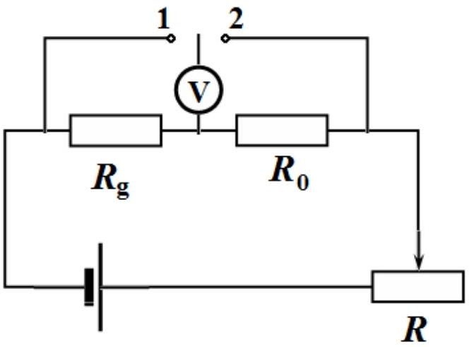
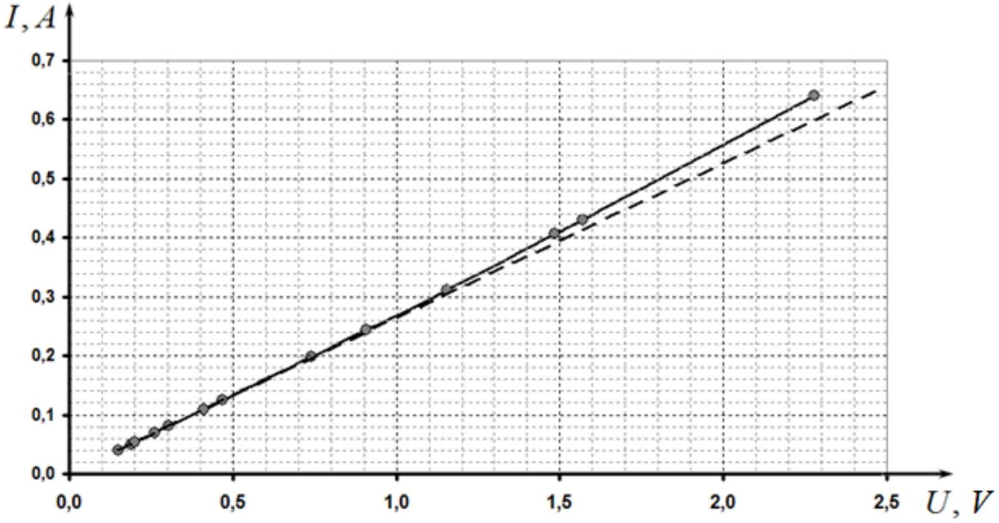
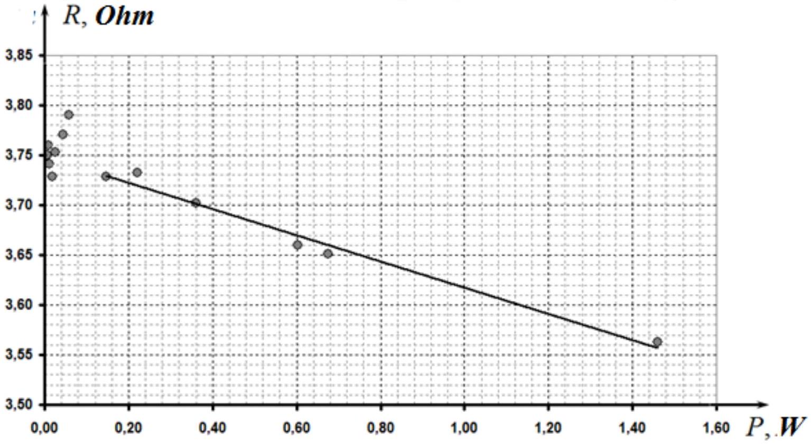
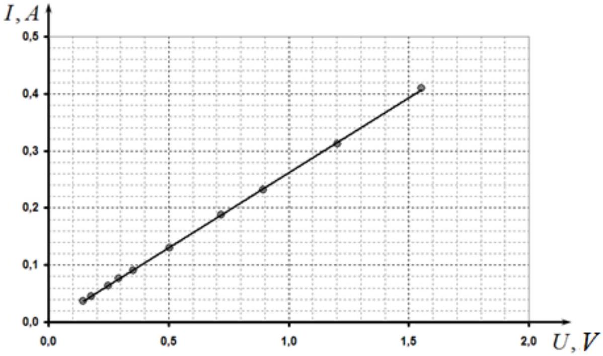
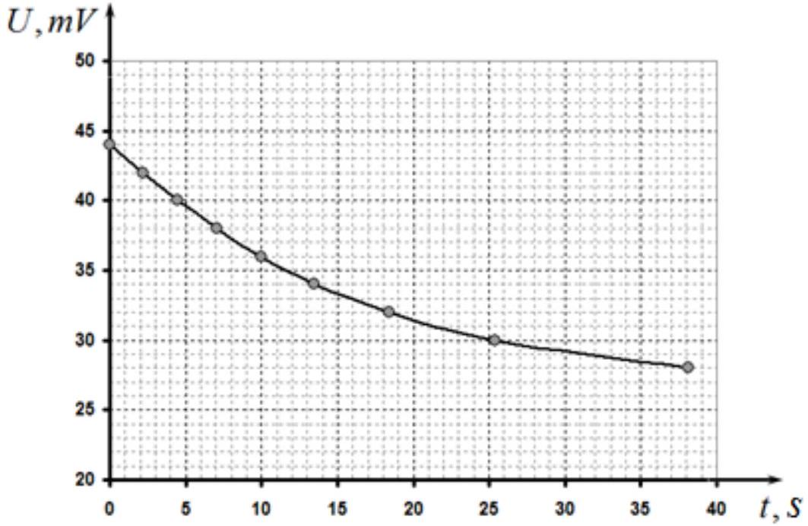
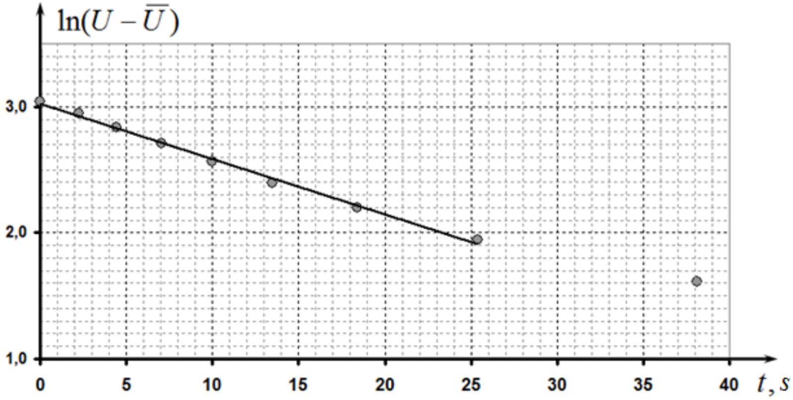

## SOLUTION FOR THE EXPERIMENTAL COMPETITION Resistance of graphite (15 points)

Part 1. The current-voltage characteristic of a graphite rod
1.1 Using the ohmmeter it is easy determine that the the sliding lead is $\boldsymbol { b }$.
1.2.1 To measure the current-voltage characteristics of the graphite rod, the traditional circuit, shown in the figure, can be used. When the voltmeter is thrown into position 1 the voltage across the graphite rod is measured, whereas in position 2 the measured voltage is the one across the resistor $R _ { 0 } = 1,0 \mathrm { Ohm }$. If the voltage is measured in volts, then the voltage across the resistor is numerically equal to the current strength in the circuit in amps.

It is possible to connect the variable resistor as a potentiometer, although in this case the maximum

current in the circuit will be slightly less.
1.2.2 The results of measurements of the current-voltage characteristic of the graphite rod are presented in Table 1. This table also shows the power values calculated via

$$
\begin{equation*}
P = U I \tag{1}
\end{equation*}
$$

as well as the resistance of the graphite rod

$$
\begin{equation*}
R = \frac { U } { I } . \tag{2}
\end{equation*}
$$

Table 1. Measurements made in the air
| $U , V$ | $\boldsymbol { I } \boldsymbol { , } \boldsymbol { A }$ | $\boldsymbol { P } \boldsymbol { , } \boldsymbol { W }$ | R, Ohm |
| :--- | :--- | :--- | :--- |
| 0,150 | 0,040 | 0,0060 | 3,750 |
| 0,188 | 0,050 | 0,0094 | 3,760 |
| 0,202 | 0,054 | 0,0109 | 3,741 |
| 0,261 | 0,070 | 0,0183 | 3,729 |
| 0,304 | 0,081 | 0,0246 | 3,753 |
| 0,411 | 0,109 | 0,0448 | 3,771 |
| 0,470 | 0,124 | 0,0583 | 3,790 |
| 0,742 | 0,199 | 0,1477 | 3,729 |
| 0,907 | 0,243 | 0,2204 | 3,733 |
| 1,155 | 0,312 | 0,3604 | 3,702 |
| 1,486 | 0,406 | 0,6033 | 3,660 |
| 1,570 | 0,430 | 0,6751 | 3,651 |
| 2,280 | 0,640 | 1,4592 | 3,563 |

1.2.3 The current-voltage characteristic of the graphite rod is shown in the figure below.

It can be seen that the curve deviates somewhat up from the linear proportionality which is prescribed to decrease in the resistance of the grathite when the temperature increases.

Derivation of the theoretical formula.
In the steady state the condition of thermal equilibrium is writte as:

$$
\begin{equation*}
\frac { U ^ { 2 } } { R _ { 0 } ( 1 + \alpha \Delta T ) } = \beta \Delta T . \tag{3}
\end{equation*}
$$

Solving the quadratic equation for the temperature difference gives rise to

$$
\begin{align*}
& \frac { U ^ { 2 } } { R _ { 0 } } = \beta \Delta T ( 1 + \alpha \Delta T ) \Rightarrow \alpha \beta ( \Delta T ) ^ { 2 } + \beta \Delta T - \frac { U ^ { 2 } } { R _ { 0 } } = 0 \\
& \Delta T = \frac { - \beta \pm \sqrt { \beta ^ { 2 } + 4 \frac { U ^ { 2 } } { R _ { 0 } } \alpha \beta } } { 2 \alpha \beta } \tag{4}
\end{align*}
$$

From the data obtained it follows that the temperature coefficient of graphite resistance is negative. In addition, it can be shown that from the two roots of equation (3) the smaller one should be chosen (with + sign), since it corresponds to a stable thermal equilibrium. Therefore, the theoretical dependence has the form

$$
\begin{equation*}
I = \frac { U } { R _ { 0 } ( 1 + \alpha \Delta T ) } = \frac { U } { R _ { 0 } \left( 1 + \frac { - \beta + \sqrt { \beta ^ { 2 } + 4 \frac { U ^ { 2 } } { R _ { 0 } } \alpha \beta } } { 2 \beta } \right) } \approx \frac { U } { R _ { 0 } \left( 1 + \frac { U ^ { 2 } } { R _ { 0 } } \frac { \alpha } { \beta } \right) } \approx \frac { U } { R _ { 0 } } \left( 1 - \frac { U ^ { 2 } } { R _ { 0 } } \frac { \alpha } { \beta } \right) . \tag{5}
\end{equation*}
$$

The last two expressions are approximations valid for small $\alpha$.

1.2.3 For a more accurate calculation of the resistance of the graphite rod at room temperature, only several data points at low voltages (less than 0.5 V ) should be taken at which the rod remains practically unheated. Then, the method of least squares must be employed to evaluate the slope, which is equal to the rod resistance.

Calculation of the obtained experimental data leads to the following result

$$
R _ { 0 } = ( 3,78 \pm 0,03 ) O h m .
$$

To calculate the resistivity of use is the following formula

$$
R = \rho \frac { 4 l } { \pi d ^ { 2 } } \Rightarrow \rho = \frac { \pi d ^ { 2 } } { 4 l } R = \frac { \pi \cdot \left( 1,0 \cdot 10 ^ { - 3 } \right) ^ { 2 } } { 4 \cdot 5,0 \cdot 10 ^ { - 2 } } 3,78 = 5,93 \cdot 10 ^ { - 5 } \mathrm { Onm } \cdot \mathrm {~m}
$$

Here $l = ( 5,0 \pm 0,2 ) s m$ is the length of the rod between the leads.
The calculation of experimental error is given by the formula

$$
\Delta \rho = \rho \sqrt { \left( \frac { \Delta R } { R } \right) ^ { 2 } + \left( 2 \frac { \Delta d } { d } \right) ^ { 2 } + \left( \frac { \Delta l } { l } \right) ^ { 2 } } = 5,93 \cdot 10 ^ { - 5 } \sqrt { \left( \frac { 0,03 } { 3,78 } \right) ^ { 2 } + \left( 2 \frac { 0,05 } { 1 } \right) ^ { 2 } + \left( \frac { 0,2 } { 5 } \right) ^ { 2 } } = 6 \cdot 10 ^ { - 6 } \mathrm { Ohm } \cdot \mathrm {~m}
$$

The final result is written as

$$
\begin{equation*}
\rho = ( 5,9 \pm 0,6 ) \cdot 10 ^ { - 5 } \mathrm { Ohm } \cdot \mathrm {~m} \tag{6}
\end{equation*}
$$

1.2.4 In the steady state the power, released when the current flows, is equal to the power of the heat losses:

$$
P = \beta \Delta T \quad \Rightarrow \quad \Delta T = \frac { P } { \beta } ,
$$

Therefore, the dependence of the resistance on the power takes the form

$$
\begin{equation*}
\left. R _ { g } = R _ { 0 } ( 1 + \alpha \Delta T ) = R _ { 0 } \left( 1 + \frac { \alpha } { \beta } P \right) \right) . \tag{7}
\end{equation*}
$$

1.2.5 The dependence of the resistance on the dissipated power is shown in the figure.

1.2.6 The linearity of this dependence is observed at powers larger than $0,2 W$.

The coefficients of this dependence $R = a P + b$, calculated using the least square method, are found as $a = 0,13 \frac { O h m } { W } , b = 3,75 O h m$, consequently, the coefficient in formula (3) is evaluated as $\gamma = \frac { a } { b } = 0,035 W ^ { - 1 }$.

1.3.1 The results of measurements of the current-voltage characteristic of the rod, placed in the snow, are given in Table 2 and the corresponding graph is shown in the figure below.

Table 2
| U, V | $\boldsymbol { I } \boldsymbol { , } \boldsymbol { A }$ |
| :--- | :--- |
| 0,144 | 0,037 |
| 0,177 | 0,045 |
| 0,248 | 0,064 |
| 0,292 | 0,076 |
| 0,354 | 0,091 |
| 0,504 | 0,130 |
| 0,721 | 0,188 |
| 0,895 | 0,232 |
| 1,205 | 0,312 |
| 1,554 | 0,409 |

In this case there is also a weak nonlinearity with increasing power. Therefore, to calculate the resistance at zero temperature and only several initial points at low resistance should be used. Calculation for the first five points leads to the following value

$$
R _ { g } = ( 3,88 \pm 0,03 ) O h m .
$$

Since this value should obey the formula $R _ { g } = R _ { 0 } ( 1 + \alpha \Delta T )$, the temperature coefficient of the resistance can be calculated as

$$
\left. \alpha = \frac { 1 } { \Delta T } \left( \frac { R _ { g } } { R _ { 0 } } - 1 \right) \right) = - \frac { 1 } { 20 ^ { \circ } } \left( \frac { 3,88 } { 3,78 } - 1 \right) = - 1,3 \cdot 10 ^ { - 3 } K ^ { - 1 } .
$$

The experimental error is mainly determined by the measurement error of resistance, thus it can be evaluated via the formula

$$
\Delta \alpha = \sqrt { \left( \frac { \Delta R _ { g } } { \Delta T \cdot R _ { 0 } } \right) ^ { 2 } + \left( \frac { R _ { g } \Delta R _ { 0 } } { \Delta T \cdot R _ { 0 } ^ { 2 } } \right) ^ { 2 } } \approx 6 \cdot 10 ^ { - 4 } \mathrm {~K} ^ { - 1 } . .
$$

## Part 2. Cooling of the graphite rod

2.1 The results of measurements of time time needed to achieve the specified voltage are shown in Table 3 and the corresponding graph is shown n the figure below.

Table 3
| U, mV | $\boldsymbol { t } \boldsymbol { , } \boldsymbol { s }$ | $\ln ( U - \bar { U } )$ |
| :--- | :--- | :--- |
| 44 | 0,00 | 3,045 |
| 42 | 2,22 | 2,944 |
| 40 | 4,45 | 2,833 |
| 38 | 7,03 | 2,708 |
| 36 | 9,99 | 2,565 |
| 34 | 13,50 | 2,398 |
| 32 | 18,42 | 2,197 |
| 30 | 25,38 | 1,946 |
| 28 | 38,14 | 1,609 |

Table 3

Since the voltage is proportional to the measured voltage change and the resistance change is proportional to the change in temperature, the dependence measured coincides, up to an unimportant factor, with the temperature dependence on time.

The solution ot the equation

$$
\frac { \Delta T } { \Delta t } = - \frac { 1 } { \tau } ( T - \bar { T } )
$$

is the exponential function

$$
\begin{equation*}
( T - \bar { T } ) = ( T - \bar { T } ) _ { 0 } \exp \left( - \frac { t } { \tau } \right) . \tag{8}
\end{equation*}
$$

To determine the characteristic cooling time, the resulting dependence should be drawn in a semilogarithmic scale, $\ln ( U - \bar { U } )$ against the time. For numerical calculations it is necessary to measure the steady-state voltage value (achieved after waiting for a few minutes). In our measurements. Table 3 shows the results of calculations of logarithms.

The following figure shows the graph on the semilogarithmic scale.

The slope coefficient of the obtained almost linear dependence is found as $a = - 0,044 s ^ { - 1 }$ Consequently, the characteristic time of thermal equilibration is equal to $\tau = - \frac { 1 } { a } \approx 23 s$.

Marking scheme
| № | Content | points |
| :--- | :--- | :--- |
| 1.1 | Sliding laed is $\boldsymbol { b }$ | 0,2 |
| 1.2.1 | Circuit: | 0,5 |
|  | - the resistor anf the graphite rod are connected in series; | 0,2 |
|  | - voltages are measured on the resistor and the graphite rod; | 0,1 |
|  | - ability to vary the net electric current (the variable resistor |  |
|  | connected in series, or as a voltage diivider); | 0,1 |
|  | - the source is correctly connected; | 0,1 |
| 1.2.2 | marked only if the deviation from the table in the solution is less than 50\% | 3,0 |
|  | Measurements : |  |
|  | - 10 points or more (7-9 points; 5-6 points; less than 5 points) | 1,5(0,8; 0,5;0) |
|  | - minimum voltage less than 0,2 V; | 0,2 |
|  | - maximum voltage larger than 2 V; | 0,2 |
|  | - deviation to the top from the linear dependence; | 0,3 |
|  | Graph: |  |
|  | - axes are anmed and ticked; | 0,1 |
|  | - points in the Table correspond to the points in the graph; | 0,2 |
|  | - smooth ine is drawn; | 0,1 |
|  | Theoretical formula (thermal equilibrium equation, quadratic equation for temperature, smaller root is chosen, substitution into Ohm's law) | 0,4 |
| 1.2.3 | The resistance of the rod is calculated: | 1,1 |
|  | - voltages not larger than 0,3 V are only used; | 0,2 |
|  | - all points in the stated range are used for calcualtion (not less than 5); |  |
|  | (by 2points, by 1 point) | (0,1; 0,05) |
|  | - the calculated value of the resistance is in the range 3,5-4,5 Ohm |  |
|  | (3,0-5,0 Ohm); | 0,1 $( 0,05 )$ |
|  | the length of the rod is measured (not larger than 5 sm); | 0,1 |
|  | Fromula for $\rho$; | 0,1 |
|  | $\rho$ is calculated: |  |
|  | in the range ±20\% (±50\%); | 0,3 $( 0,1 )$ |
|  | Error is estimated (any method) | 0,1 |
| 1.2.4 |  | 0,2 |
|  | Equation for thermal equilibrium; | 0,1 |
|  | Formula for $R ( \Delta T )$ | 0,1 |
| 1.2.5 |  | 0,7 |
|  | Formula for the power; | 0,05 |
|  | Formula for the resistance; | 0,05 |
|  | Calculations for all points; | 0,2 |
|  | Graph: |  |
|  | - axes are named and ticked; | 0,1 |
|  | - points in the Table correspond to the points in the graph; | 0,2 |
|  | - smooth ine is drawn; | 0,1 |
| 1.2.6 |  | 0,5 |
|  | The linear range is stated with the power larger than 0,2 W | 0,1 |
|  | The slope is calculated by all points (by 2 points) | 0,2 $( 0,1 )$ |
|  | Formula for calculation; |  |
|  | -numerical value is in the range $0,025 - 0,045 \mathrm {~W} ^ { - 1 } ( 0,01 - 0,06 )$ | 0,2 $( 0,1 )$ |

| 1.3.1 | marked only if the deviation from the table in the solution is less than 50\% | 2,6 |
| :--- | :--- | :--- |
|  | Measurements : |  |
|  | - 10 points or more (7-9 points; 5-6 points; less than 5 points) | 1,5 (0,8; 0,5) |
|  | - minimum voltage is less than 0,2 V; | 0,2 |
|  | - maximum voltage is larger than 1,5 V; | 0,2 |
|  | - almost linear dependence is obtained; | 0,1 |
|  | - small deviation from the linear dependence to the top | 0,2 |
|  | Graph: |  |
|  | - axes are named and ticked; | 0,1 |
|  | - points in the Table correspond to the points in the graph; | 0,2 |
|  | - smooth ine is drawn; | 0,1 |
| 1.3.2 | The resistance is calculated for the snow temperature: | 1,2 |
|  | - points with voltage less than 0,5 V are only used; | 0,2 |
|  | - calculation by all points (by 2 points, by 1 point); | 0,2 (0,1, 0,05) |
|  | - the numerical value is in the range 3,5-4,5 Ohm (3,0-5,0 Ohm); |  |
|  | - the resistance is larger than at room temperature; | 0,1 $( 0,05 )$ |
|  | - formula for the temperature coefficient of resistance; | 0,1 |
|  | - negative value; | 0,1 |
|  | - numerical value is in the range ± 50\% (±75\%); | 0,1 |
|  | - error is estimated; | 0,2(0,1) |
|  | - error is larger than 50\% | 0,1 |
|  |  | 0,1 |
| 2.1 |  |  |
|  | Measurement: |  |
|  | - not less than 7 points (5-6 points; less than 5 points) | 2 (1,5; 1) |
|  | - decreasing dependence with convexity directed downward; | 0,3 |
|  | The range of voltages is 1,5 larger; | 0,3 |
|  | - there is a limiting value of the voltage; | 0,4 |
| 2.2 | Graph: | 0,4 |
|  | - axes are named and ticked; | 0,1 |
|  | - points in the Table correspond to the points in the graph; | 0,2 |
|  | - smooth ine is drawn; | 0,1 |
| 2.3 | Evaluation of the time equilibration: | 1,6 |
|  | - by graph (the slope to the steady value); | 0,5 |
|  | - by 1-2 points; | 0,2 |
|  | - semilogarithmic linearization is applied; | 1,0 |
|  | - numerical value is in thew range 20-30s (15-40S, 10-45s) | 0,6 (0,4; 0,2) |
