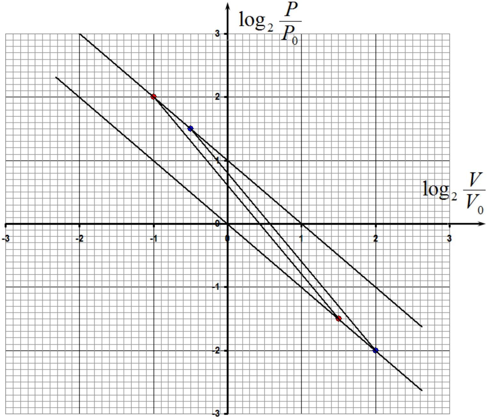
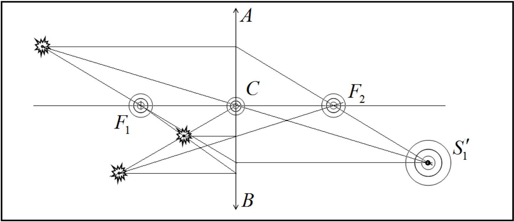
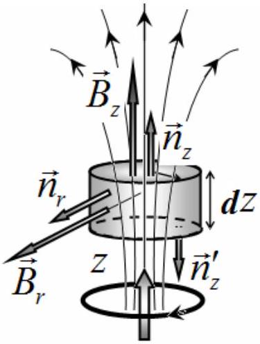
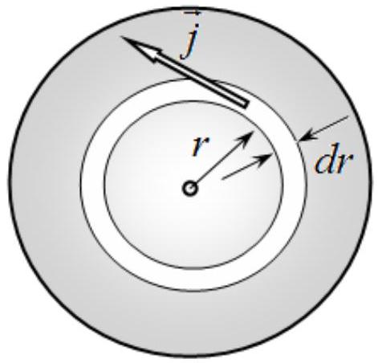
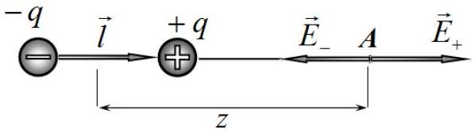

## SOLUTIONS TO THE PROBLEMS OF THE THEORETICAL COMPETITION

Problem 1. Plotting (7 points)
Problem 1.1
The basic idea is that the center of mass of the whole system remains at rest! First of all, find the center of mass at the initial position: Divide the segment $A _ { 1 } A _ { 2 }$ by the ratio of 2:1 (point $C _ { 1 }$ ); connect $C _ { 1 }$ with point $A _ { 3 }$ and cut segment $C _ { 1 } A _ { 3 }$ into halves (point $C _ { 0 }$ ). The point $C _ { 0 }$ is center of mass of the system. To find the position of the third ball one should do the following: divide the segment $B _ { 1 } B _ { 2 }$ by the ratio of 2:1 (point $C _ { 1 } ^ { \prime }$ ), write down straight line from to the point of the center of mass $C _ { 0 }$, and draw the segment $C _ { 0 } B _ { 3 }$, whose length should be equal to the length of the segment $C _ { 1 } ^ { \prime } C _ { 0 }$. The point $B _ { 3 }$ is the position of third ball!

Marking scheme
| 1 | The basic idea of the constancy of the center of mass is formulated | 1,0 |
| :--- | :--- | :--- |
| 2 | Found position of the center of mass |  |
|  | - in circle 1; | 0,5 |
|  | - in circle 2; | $( 0,3 )$ |
|  | - in circle 3; | $( 0,2 )$ |
| 3 | Found position of the third ball: |  |
|  | - in circle 1; | 0,5 |

| - in circle 2; | $( 0,3 )$ |
| :--- | :--- |
| - in circle 3; | $( 0,2 )$ |
| Total | 2 |

## Problem 1.2

Straight lines, shown in figure 1.2, are isotherms since their slope is equal to -1. Consequently, their equations have the form

$$
\begin{equation*}
P V = \text { const. } \tag{1}
\end{equation*}
$$

To obtain a cycle with the maximum efficiency it is necessary to build two adiabatic lines through the extreme points, i.e. Carnot cycle. Since the adiabatic equation has the form

$$
\begin{equation*}
P V ^ { \gamma } = \text { const } , \tag{2}
\end{equation*}
$$

where $\gamma = \frac { C _ { p } } { C _ { V } } = \frac { 7 } { 5 } = 1,4$ is the adiabatic index of a diatomic gas.
In the logarithmic scale, the latter equation has the form

$$
\begin{equation*}
\log _ { 2 } P = \text { const } - 1,4 \log _ { 2 } V . \tag{3}
\end{equation*}
$$

The graphs of these functions are straight lines with the slope coefficient of - 1.4 . The constant in equation (1) is proportional to the absolute temperature. It follows from the shown graphs that the maximum temperature is 2 times greater than the minimal one, so that the cycle efficiency is

$$
\begin{equation*}
\eta = 1 - \frac { T _ { 2 } } { T _ { 1 } } = 50 \% . \tag{4}
\end{equation*}
$$

Marking scheme
| 1 | It has been indicated that the straight lines are isotherms | 0,5 |
| :--- | :--- | :--- |
| 2 | Carnot cycle has been taken | 0,2 |
| 3 | Adiabatic equation has been written, including the formulation of it in logarithmic scale | 0,2 0,2 |
| 4 | Straight lines have been properly plotted | 0,6 |
| 5 | The efficiency has been found | 0,3 |
|  | Total | 2 |

1. Plot straight line $S S ^ { \prime }$ to the intersection with the optical axis. This intersection point is the center of the lens.
2. To determine the positions of focuses, draw the line through point-source parallel to the optical axis, then draw the line through the point of intersection between the ray and the plane of the lens. Then plot the straight line through the point-image to the intersection with the main optical axis: this is the back focus of the lens. Similarly, we find the front focal point. Having focal points determined, finding the image of the second source is carried out in a conventional manner.

Problem 1.3

Marking scheme
| 1 | The optical center of the lens has been found |  |
| :--- | :--- | :--- |
|  | - in circle 1; | 0,5 |
|  | - in circle 2; | $( 0,3 )$ |
|  | - in circle 3; | $( 0,2 )$ |
| 2 | Focal points of the lens are found and plotted |  |
|  | - in circle 1; | 1,0 |
|  | - in circle 2; | $( 0,6 )$ |
|  | - in circle 3; | $( 0,4 )$ |
| 3 | Image of the second source is found and plotted - in circle 1; | 1,5 |

| - in circle 2; - in circle 3;  | $( 1,0 ) ( 0,5 )$ |
| :--- | :--- |
| Total | 3 |

## Problem 2. Vessel with water (7 points)

1. While pouring the water into the vessel the air is compressed and its pressure increases. At the moment when the tube is completely filled with water the air pressure inside the vessel is equal to

$$
\begin{equation*}
p = p _ { 0 } + \rho g \left( L - x _ { 0 } \right) . \tag{1}
\end{equation*}
$$

Since the vessel wall highly conducts heat, the temperature of the air inside the vessel does not change, so the equations of state are

$$
\begin{align*}
& p _ { 0 } S h = v R T _ { 0 } ,  \tag{2}\\
& p S \left( h - x _ { 0 } \right) = v R T _ { 0 } , \tag{3}
\end{align*}
$$

where $S$ is the cross section area of the vessel, $v$ is number of moles of the air inside the vessel.
From Eq. (1) - (3) the following quadratic equation is obtained:

$$
\begin{equation*}
\rho g x _ { 0 } ^ { 2 } - \left[ p _ { 0 } + \rho g ( L + h ) \right] x _ { 0 } + \rho g h L = 0 , \tag{4}
\end{equation*}
$$

which has the obvious solution:

$$
\begin{equation*}
x _ { 0 } = \frac { 1 } { 2 } \left[ \frac { p _ { 0 } } { \rho g } + L + h \pm \sqrt { \left( \frac { p _ { 0 } } { \rho g } + L + h \right) ^ { 2 } - 4 h L } \right] . \tag{5}
\end{equation*}
$$

Among two possible solutions (5), we should choose the one with the less value since it should be $x _ { 0 } = h$ at $p _ { 0 } = 0$ or $x _ { 0 } = 0$ at $L = 0$, that is,

$$
\begin{equation*}
x _ { 0 } = \frac { 1 } { 2 } \left[ \frac { p _ { 0 } } { \rho g } + L + h - \sqrt { \left( \frac { p _ { 0 } } { \rho g } + L + h \right) ^ { 2 } - 4 h L } \right] . \tag{6}
\end{equation*}
$$

Substituting the numerical values gives

$$
\begin{equation*}
x _ { 0 } = 7.86 \cdot 10 ^ { - 2 } \mathrm {~m} . \tag{7}
\end{equation*}
$$

2. The water is at equilibrium and, thus, the air pressure inside the vessel is found as a function of $x$ as follows

$$
\begin{equation*}
p ( x ) = p _ { 0 } + \rho g ( L - x ) . \tag{8}
\end{equation*}
$$

3. Equation of state of an ideal gas for an arbitrary $x$ is given by

$$
\begin{equation*}
p ( x ) S ( h - x ) = v R T ( x ) , \tag{9}
\end{equation*}
$$

which, together with Eq.(1), yields

$$
\begin{equation*}
T ( x ) = T _ { 0 } \left( 1 - \frac { x } { h } \right) \left( 1 + \frac { \rho g ( L - x ) } { p _ { 0 } } \right) . \tag{10}
\end{equation*}
$$

4. The temperature, at which the air displaces water out of the vessel, is determined by the condition $x = 0$, which, in accordance with (10), leads to

$$
\begin{equation*}
T _ { m } = T _ { 0 } \left( 1 + \frac { \rho g L } { p _ { 0 } } \right) , \tag{11}
\end{equation*}
$$

and the corresponding numerical value is evaluated as

$$
\begin{equation*}
T _ { m } = 350 \mathrm {~K} . \tag{12}
\end{equation*}
$$

5. The change of the internal energy of the air is obtained as

$$
\begin{equation*}
\Delta U = \frac { 5 } { 2 } v R \left( T - T _ { 0 } \right) = \frac { 5 } { 2 } \rho g L S h , \tag{13}
\end{equation*}
$$

and the work done by the air to displace the water, is calculated as

$$
\begin{align*}
A = \int _ { 0 } ^ { x _ { 0 } } p ( x ) S d x = \frac { 1 } { 2 } p _ { 0 } S L & \left( 1 + \frac { p _ { 0 } } { 2 \rho g L } + \frac { \rho g L } { 2 p _ { 0 } } \left[ 1 + \frac { 2 h } { L } - \frac { h ^ { 2 } } { L ^ { 2 } } \right] \right) - \\
& - \frac { 1 } { 4 } p _ { 0 } S L \left( 1 + \frac { \rho g ( L - h ) } { p _ { 0 } } \right) \sqrt { \left( 1 + \frac { h } { L } + \frac { p _ { 0 } } { \rho g L } \right) ^ { 2 } - \frac { 4 h } { L } . } \tag{14}
\end{align*}
$$

According to the first law of thermodynamics, the heat given to the air is found as

$$
\begin{equation*}
Q = \Delta U + A , \tag{15}
\end{equation*}
$$

which, together with Eqs. (13) and (14), yields

$$
Q = \frac { 1 } { 2 } p _ { 0 } S L \left( 1 + \frac { p _ { 0 } } { 2 \rho g L } + \frac { \rho g L } { 2 p _ { 0 } } \left[ 1 + \frac { 12 h } { L } - \frac { h ^ { 2 } } { L ^ { 2 } } \right] \right) -
$$

$$
\begin{equation*}
- \frac { 1 } { 4 } p _ { 0 } S L \left( 1 + \frac { \rho g ( L - h ) } { p _ { 0 } } \right) \sqrt { \left( 1 + \frac { h } { L } + \frac { p _ { 0 } } { \rho g L } \right) ^ { 2 } - \frac { 4 h } { L } } . \tag{16}
\end{equation*}
$$

Substituting the numerical values gives

$$
\begin{equation*}
Q = 17.0 \mathrm {~kJ} . \tag{17}
\end{equation*}
$$

Marking scheme
| № | Content | баллы |  |
| :--- | :--- | :--- | :--- |
| 1 | Formula (1) $p = p _ { 0 } + \rho g \left( L - x _ { 0 } \right)$ | 0,25 | 2,0 |
|  | Formula (2) $p _ { 0 } S h = v R T _ { 0 }$ | 0,25 |  |
|  | Formula (3) $p S \left( h - x _ { 0 } \right) = v R T _ { 0 }$ | 0,25 |  |
|  | Formula (4) $\rho g x _ { 0 } ^ { 2 } - \left[ p _ { 0 } + \rho g ( L + h ) \right] x _ { 0 } + \rho g h L = 0$ | 0,25 |  |
|  | Formula (5) $x _ { 0 } = \frac { 1 } { 2 } \left[ \frac { p _ { 0 } } { \rho g } + L + h \pm \sqrt { \left( \frac { p _ { 0 } } { \rho g } + L + h \right) ^ { 2 } - 4 h L } \right]$ | 0,25 |  |
|  | Formula (6) $x _ { 0 } = \frac { 1 } { 2 } \left[ \frac { p _ { 0 } } { \rho g } + L + h - \sqrt { \left( \frac { p _ { 0 } } { \rho g } + L + h \right) ^ { 2 } - 4 h L } \right]$ | 0,5 |  |
|  | Formula (7) $x _ { 0 } = 7,86 \cdot 10 ^ { - 2 } m$ | 0,25 |  |
| 2 | Formula (8) $p ( x ) = p _ { 0 } + \rho g ( L - x )$ | 0,5 | 0,5 |
| 3 | Formula (9) $p ( x ) S ( h - x ) = v R T ( x )$ | 0,5 | 1,0 |
|  | Formula (10) $T ( x ) = T _ { 0 } \left( 1 - \frac { x } { h } \right) \left( 1 + \frac { \rho g ( L - x ) } { p _ { 0 } } \right)$ | 0,5 |  |
| 4 | Formula (11) $T _ { m } = T _ { 0 } \left( 1 + \frac { \rho g L } { p _ { 0 } } \right)$ | 0,5 | 1,0 |
|  | Formula (12) $T _ { m } = 350 \mathrm {~K}$ | 0,5 |  |
| 5 | Formula (13) $\Delta U = \frac { 5 } { 2 } v R \left( T - T _ { 0 } \right) = \frac { 5 } { 2 } \rho g L S h$ | 0,5 | 2,5 |
|  | Formula (14) $A = \frac { 1 } { 2 } p _ { 0 } S L \left( 1 + \frac { p _ { 0 } } { 2 \rho g L } + \frac { \rho g L } { 2 p _ { 0 } } \left[ 1 + \frac { 2 h } { L } - \frac { h ^ { 2 } } { L ^ { 2 } } \right] \right) -$ $- \frac { 1 } { 4 } p _ { 0 } S L \left( 1 + \frac { \rho g ( L - h ) } { p _ { 0 } } \right) \sqrt { \left( 1 + \frac { h } { L } + \frac { p _ { 0 } } { \rho g L } \right) ^ { 2 } - \frac { 4 h } { L } } .$ | 0,5 |  |
|  | Formula (15) $Q = \Delta U + A$ | 0,5 |  |
|  | Formula (16) $Q = \frac { 1 } { 2 } p _ { 0 } S L \left( 1 + \frac { p _ { 0 } } { 2 \rho g L } + \frac { \rho g L } { 2 p _ { 0 } } \left[ 1 + \frac { 12 h } { L } - \frac { h ^ { 2 } } { L ^ { 2 } } \right] \right) -$ $- \frac { 1 } { 4 } p _ { 0 } S L \left( 1 + \frac { \rho g ( L - h ) } { p _ { 0 } } \right) \sqrt { \left( 1 + \frac { h } { L } + \frac { p _ { 0 } } { \rho g L } \right) ^ { 2 } - \frac { 4 h } { L } } .$ | 0,5 |  |
|  | Formula (17) $Q = 17,0 \mathrm {~kJ}$ | 0,5 |  |
| Total |  |  | 7,0 |

## Problem 3. Delay and attenuation (16 points)

1.1.1 It seems simpler to find the magnetic induction of the ring with the current using Biot-Savart law and the superposition principle. The $z$ projection of the magnetic field vector generated by an arbitrary element of the ring is found as

$$
\begin{equation*}
d B _ { z } = \frac { \mu _ { 0 } } { 4 \pi } \frac { I d l } { r ^ { 2 } } \sin \theta \tag{1}
\end{equation*}
$$

Using the geometry, one obtains

$$
\begin{equation*}
d B _ { z } = \frac { \mu _ { 0 } } { 4 \pi } \frac { I d l } { r ^ { 2 } } \frac { R } { r } = \frac { \mu _ { 0 } } { 4 \pi } \frac { I d l R } { r ^ { 3 } } = \frac { \mu _ { 0 } } { 4 \pi } \frac { I d l R } { \left( R ^ { 2 } + z ^ { 2 } \right) ^ { \frac { 3 } { 2 } } } \tag{2}
\end{equation*}
$$

Summation over all elements of the ring is held elementary to eventually get

$$
\begin{equation*}
B _ { z } = \frac { \mu _ { 0 } } { 4 \pi } \frac { I R \cdot 2 \pi R } { \left( R ^ { 2 } + z ^ { 2 } \right) ^ { \frac { 3 } { 2 } } } = \frac { \mu _ { 0 } } { 2 \pi } \frac { I \cdot \pi R ^ { 2 } } { \left( R ^ { 2 } + z ^ { 2 } \right) ^ { \frac { 3 } { 2 } } } = \frac { \mu _ { 0 } } { 2 \pi } \frac { p _ { m } } { \left( R ^ { 2 } + z ^ { 2 } \right) ^ { \frac { 3 } { 2 } } } . \tag{3}
\end{equation*}
$$

At $z \gg R$ it simplifies to

$$
\begin{equation*}
d B _ { z } = \frac { \mu _ { 0 } } { 2 \pi } \frac { p _ { m } } { \left( R ^ { 2 } + z ^ { 2 } \right) ^ { \frac { 3 } { 2 } } } \approx \frac { \mu _ { 0 } } { 2 \pi } \frac { p _ { m } } { z ^ { 3 } } , \tag{4}
\end{equation*}
$$

and finally,

$$
\begin{align*}
& b = \frac { \mu _ { 0 } } { 2 \pi }  \tag{5}\\
& \beta = 3
\end{align*}
$$

1.1.2 It is obvious that the resulting Ampere force $F _ { A }$ is due to the radial component $\vec { B } _ { r }$ of the magnetic field vector. At a short distance from the axis this component can be expressed in terms of the axial component of the field with the help of the magnetic flux theorem.

Selecting the surface shaped as a thin cylinder whose axis coincides with the axis of the field, then writing the expression for the magnetic flux through this surface and equating it to zero yields

$$
\begin{equation*}
B _ { z } ( z + d z ) \cdot \pi r ^ { 2 } - B _ { z } ( z ) \cdot \pi r ^ { 2 } + B _ { r } \cdot 2 \pi r d z = 0 \tag{6}
\end{equation*}
$$

It is thus found from this equation that

$$
\begin{equation*}
B _ { r } = - \frac { r } { 2 } \frac { d B _ { z } } { d z } \tag{7}
\end{equation*}
$$

Using Ampere's law, it is easy to write the equation for the force acting on the ring as

$$
\begin{equation*}
F = I B _ { r } 2 \pi r = - I \frac { r } { 2 } \frac { d B _ { z } } { d z } 2 \pi r = - p _ { m } \frac { d B _ { z } } { d z } . \tag{8}
\end{equation*}
$$

1.2.1 The frequency of oscillations is determined by the well-known formula for the oscillation frequency of the spring pendulum

$$
\begin{equation*}
\omega _ { 0 } = \sqrt { \frac { k } { m } } . \tag{9}
\end{equation*}
$$

1.2.2 The feedback mechanism from the disc to the magnet is described as follows: when the magnet moves the rotational electric field is induced in the disk which gives rise to eddy currents. The magnetic field of those eddy currents is a source of force acting on the magnet. For the calculation of the magnetic field generated by eddy currents in the disk, it should be noted that the size of the disk is small compared with the distance to the magnet, so the disk can also be considered as a magnetic dipole. Therefore, it suffices to find the induced magnetic moment of the disk, and then to use formula (4) for calculation of the induction field.

Let us consider a thin ring of radius $r$ and thickness $d r$. The strength of the vortex electric field within this ring is found from Faraday's law of induction as:

$$
\begin{equation*}
2 \pi r E = - \pi r ^ { 2 } \frac { d B _ { z } } { d t } \Rightarrow E = - \frac { r } { 2 } \frac { d B _ { z } } { d t } . \tag{10}
\end{equation*}
$$

It is assumed here that within the entire disc one can neglect the variation of the axial component of the magnetic field generated by the magnet, which is also determined by formula (4). Thus, if the magnet coordinate is $x$, then the magnetic field at its position is obtained as

$$
\begin{equation*}
B _ { z } = \frac { \mu _ { 0 } } { 2 \pi } \frac { p _ { m } } { ( z - \chi ) ^ { 3 } } . \tag{11}
\end{equation*}
$$

Substituting this expression into (10) and calculating the derivative gives rise to

$$
\begin{equation*}
E = - \frac { r } { 2 } \frac { d B _ { z } } { d t } = - \frac { r } { 2 } \cdot \frac { 3 \mu _ { 0 } } { 2 \pi } \frac { p _ { m } } { ( z - x ) ^ { 4 } } \frac { d x } { d t } \approx - \frac { 3 \mu _ { 0 } } { 4 \pi } r \frac { p _ { m } } { z ^ { 4 } } v \tag{12}
\end{equation*}
$$

In the last formula it is taken into account that $x \ll z$.
The current density in the ring under consideration is determined by Ohm's law as

$$
\begin{equation*}
j = \frac { 1 } { \rho } E . \tag{13}
\end{equation*}
$$

Since the current in the ring is $d I = j h d r$, the magnetic moment of the ring is equal to

$$
\begin{equation*}
d p _ { m } ^ { \prime } = \pi r ^ { 2 } d I = \pi r ^ { 2 } j d r \cdot h = - \pi r ^ { 2 } d r \cdot h \frac { 3 \mu _ { 0 } } { 4 \pi \rho } r \frac { p _ { m } } { z ^ { 4 } } v = - \frac { 3 \mu _ { 0 } } { 4 \rho } \frac { p _ { m } } { z ^ { 4 } } h v r ^ { 3 } d r . \tag{14}
\end{equation*}
$$

Integrating over the disk, one obtains its total magnetic moment as:

$$
\begin{equation*}
p _ { m } ^ { \prime } = - \frac { 3 \mu _ { 0 } } { 4 \rho } \frac { p _ { m } } { z ^ { 4 } } h v \int _ { 0 } ^ { R } r ^ { 3 } d r = - \frac { 3 \mu _ { 0 } } { 16 \rho } \frac { p _ { m } } { z ^ { 4 } } h R ^ { 4 } v \tag{15}
\end{equation*}
$$

To calculate the force acting on the magnet, formula (8) is applied wherein the magnitude of the magnetic field induction is calculated by formula (4). These substitutions lead to the expression

$$
\begin{equation*}
F = - p _ { m } \frac { d B _ { z } } { d z } = - p _ { m } \frac { d } { d z } \left( \frac { \mu _ { 0 } } { 2 \pi } \frac { p _ { m } ^ { \prime } } { z ^ { 3 } } \right) = \frac { 3 \mu _ { 0 } } { 2 \pi } \frac { p _ { m } p _ { m } ^ { \prime } } { z ^ { 4 } } = - \frac { 3 \mu _ { 0 } } { 2 \pi } \frac { p _ { m } } { z ^ { 4 } } \frac { 3 \mu _ { 0 } } { 16 \rho } \frac { p _ { m } } { z ^ { 4 } } h R ^ { 4 } v = - \frac { 9 } { 32 } \frac { \mu _ { 0 } ^ { 2 } p _ { m } ^ { 2 } } { \pi \rho z ^ { 8 } } h R ^ { 4 } v . \tag{16}
\end{equation*}
$$

The equation of the magnet motion with the influence of the disc has the form

$$
\begin{equation*}
m x ^ { \prime \prime } = - k x - b x ^ { \prime } \tag{17}
\end{equation*}
$$

where $b = \frac { 9 } { 32 } \frac { \mu _ { 0 } ^ { 2 } p _ { m } ^ { 2 } } { \pi \rho z ^ { 8 } } h R ^ { 4 }$ is the coefficient determined in formula (16).
1.2.3 Using the solution of the equation of attenuating oscillations provided in the problem formulation, one gets

$$
\begin{equation*}
\omega = \sqrt { \omega _ { 0 } ^ { 2 } - \beta ^ { 2 } } = \omega _ { 0 } \left( 1 - \frac { \beta ^ { 2 } } { \omega _ { 0 } ^ { 2 } } \right) ^ { \frac { 1 } { 2 } } \approx \omega _ { 0 } \left( 1 - \frac { \beta ^ { 2 } } { 2 \omega _ { 0 } ^ { 2 } } \right) \tag{18}
\end{equation*}
$$

where $\beta = b / 2 m$. From this expression the relative frequency shift is found as

$$
\frac { \Delta \omega } { \omega _ { 0 } } = - \frac { \beta ^ { 2 } } { 2 \omega _ { 0 } ^ { 2 } } = - \frac { 1 } { 2 k m } \left( \frac { 9 } { 64 } \frac { \mu _ { 0 } ^ { 2 } p _ { m } ^ { 2 } } { \pi \rho z ^ { 8 } } h R ^ { 4 } \right) ^ { 2 }
$$

1.2.4 The characteristic attenuation time is thus equal to

$$
\tau = \frac { 1 } { \beta } = \frac { 2 m } { b } = \frac { 64 m \pi \rho z ^ { 8 } } { 9 \mu _ { 0 } ^ { 2 } p _ { m } ^ { 2 } h R ^ { 4 } }
$$

1.2.5 According to Joule's law, the instantaneous power of heat loss in the disk is derived as

$$
P = \int \rho j ^ { 2 } d V = \int _ { 0 } ^ { R } \rho \left( \frac { 3 \mu _ { 0 } p _ { m } v } { 4 \pi z ^ { 8 } \rho } r \right) ^ { 2 } h 2 \pi r d r = \frac { 9 h \mu _ { 0 } ^ { 2 } p _ { m } ^ { 2 } R ^ { 4 } } { 32 \pi z ^ { 8 } \rho } v ^ { 2 }
$$

and is equal to the product of force (16) on the magnet speed.

## Part 2: Electric

2.1.1 The electric field of the dipole is calculated according to the principle of superposition as

$$
\begin{equation*}
E = E _ { + } - E _ { - } = \frac { q } { 4 \pi \varepsilon _ { 0 } \left( z - \frac { l } { 2 } \right) ^ { 2 } } - \frac { q } { 4 \pi \varepsilon _ { 0 } \left( z + \frac { l } { 2 } \right) ^ { 2 } } = \frac { q \cdot 2 z l } { 4 \pi \varepsilon _ { 0 } \left( z ^ { 2 } - \left( \frac { l } { 2 } \right) ^ { 2 } \right) ^ { 2 } } = \frac { z p _ { e } } { 2 \pi \varepsilon _ { 0 } \left( z ^ { 2 } - \left( \frac { l } { 2 } \right) ^ { 2 } \right) ^ { 2 } } \tag{19}
\end{equation*}
$$

At rather large $z \gg l$, it simplifies to

$$
\begin{equation*}
E = \frac { z p _ { e } } { 2 \pi \varepsilon _ { 0 } \left( z ^ { 2 } - \left( \frac { l } { 2 } \right) ^ { 2 } \right) ^ { 2 } } = \frac { 1 } { 2 \pi \varepsilon _ { 0 } } \frac { p _ { e } } { z ^ { 3 } } \tag{20}
\end{equation*}
$$

Thus,

$$
\begin{equation*}
a = \frac { 1 } { 2 \pi \varepsilon _ { 0 } } , \quad \alpha = 3 \tag{21}
\end{equation*}
$$

2.2.1 Let us derive an expression for the force exerted on the ball by the disc.

The electric field inside the conducting disc should be absent. The field $\vec { E } _ { 0 }$ of the point charge $q$ induces the surface charge densities $\pm \sigma$ on the disc surfaces, which generate an electric field $\vec { E } ^ { \prime }$ equal in magnitude but opposite in direction to the field of the point charge. Given that the size of the disk is small compared to the charge separation, it is possible to neglect the variation electric field vector $\vec { E } _ { 0 }$ at the site of the disc. Therefore, the field should be considered uniform, and the surface density of the induced charges should be treated constant.

The electric field strength of the point charge is determined by the formula $E _ { 0 } = \frac { q } { 4 \pi \varepsilon _ { 0 } z ^ { 2 } }$, and the electric field strength of the induced charges is related to their surface density as $E ^ { \prime } = \frac { \sigma } { \varepsilon _ { 0 } }$. Equating these two expression the surface density of the induced charges is found as $\sigma ^ { \prime } = \frac { q } { 4 \pi z ^ { 2 } }$ and the magnitude of the induced charge on each side of the disc $q ^ { \prime } = \sigma ^ { \prime } S = \frac { q S } { 4 \pi z ^ { 2 } }$, where $S = \pi R ^ { 2 }$ stands for the disc area. Thus, the induced dipole moment of the disc is finally obtained as

$$
\begin{equation*}
p _ { e } ^ { \prime } = q ^ { \prime } h = \frac { q S h } { 4 \pi z ^ { 2 } } = \frac { q } { 4 \pi z ^ { 2 } } V . \tag{22}
\end{equation*}
$$

Therefore, the force acting on the ball is

$$
\begin{equation*}
F = q E = q \frac { 1 } { 2 \pi \varepsilon _ { 0 } } \frac { p _ { e } ^ { \prime } } { z ^ { 3 } } = \frac { q ^ { 2 } } { 8 \pi ^ { 2 } \varepsilon _ { 0 } z ^ { 5 } } V \tag{23}
\end{equation*}
$$

Since the ball moves, in the last formula $z$ should be replaced by $( z - x )$. Given that $x \ll z$ the resulting expression for the force simplifies to

$$
\begin{equation*}
F = \frac { q ^ { 2 } V } { 8 \pi ^ { 2 } \varepsilon _ { 0 } ( z - x ) ^ { 5 } } = \frac { q ^ { 2 } V } { 8 \pi ^ { 2 } \varepsilon _ { 0 } z ^ { 5 } } \left( 1 - \frac { x } { z } \right) ^ { - 5 } \approx \frac { q ^ { 2 } V } { 8 \pi ^ { 2 } \varepsilon _ { 0 } z ^ { 5 } } + 5 \frac { q ^ { 2 } V } { 8 \pi ^ { 2 } \varepsilon _ { 0 } z ^ { 6 } } x \tag{24}
\end{equation*}
$$

The equation of the ball motion in this case takes the form

$$
\begin{equation*}
m x ^ { \prime \prime } = - k x + \frac { q ^ { 2 } V } { 8 \pi ^ { 2 } \varepsilon _ { 0 } z ^ { 5 } } + 5 \frac { q ^ { 2 } V } { 8 \pi ^ { 2 } \varepsilon _ { 0 } z ^ { 6 } } x \tag{25}
\end{equation*}
$$

The first term results in the additional displacement of the equilibrium position, which, within the approximations used, is equal to

$$
\begin{equation*}
k \Delta x = \frac { q ^ { 2 } V } { 8 \pi ^ { 2 } \varepsilon _ { 0 } z ^ { 5 } } \Rightarrow \Delta x = \frac { q ^ { 2 } V } { 8 \pi ^ { 2 } \varepsilon _ { 0 } z ^ { 5 } k } \tag{26}
\end{equation*}
$$

2.2.2 The second term in equation (24) determines the frequency shift of the oscillations as

$$
\begin{equation*}
\omega = \sqrt { \frac { k } { m } - \frac { 5 q ^ { 2 } V } { 8 \pi ^ { 2 } \varepsilon _ { 0 } z ^ { 6 } m } } = \sqrt { \omega _ { 0 } ^ { 2 } - \frac { 5 q ^ { 2 } V } { 8 \pi ^ { 2 } \varepsilon _ { 0 } z ^ { 6 } m } } \approx \omega _ { 0 } \left( 1 - \frac { 5 q ^ { 2 } V } { 16 \pi ^ { 2 } \varepsilon _ { 0 } z ^ { 6 } k } \right) \tag{27}
\end{equation*}
$$

which yields the relative frequency shift in the form

$$
\begin{equation*}
\frac { \Delta \omega } { \omega _ { 0 } } = - \frac { 5 q ^ { 2 } V } { 16 \pi ^ { 2 } \varepsilon _ { 0 } z ^ { 6 } k } \tag{28}
\end{equation*}
$$

2.2.3 The surface charge density $\sigma$ on the disk surface changes due to the current in the disc, which is determined by the electric field strength in the disk $( \dot { \sigma } = j = E / \rho )$. The electric field in the disc is generated by the ball

$$
E _ { 1 } = \frac { 1 } { 4 \pi \varepsilon _ { 0 } } \frac { q } { ( z - x ) ^ { 2 } } \approx \frac { q } { 4 \pi \varepsilon _ { 0 } z ^ { 2 } } \left( 1 + 2 \frac { x } { z } \right)
$$

and the oppositely directed field of the induced charges

$$
E _ { 2 } = - \frac { \sigma } { \varepsilon _ { 0 } } .
$$

Ohm's law $E _ { 1 } + E _ { 2 } = \rho j$ can be thus written as

$$
\frac { q } { 4 \pi \varepsilon _ { 0 } z ^ { 2 } } \left( 1 + 2 \frac { x } { z } \right) - \frac { \sigma } { \varepsilon _ { 0 } } = \rho j
$$

Taking into account the equalities $\dot { \sigma } = j$ and $p = \sigma S h = \sigma V \left( V = \pi R ^ { 2 } h \right)$ he required equation is finally derived as

$$
\varepsilon _ { 0 } \rho \dot { p } + p = \frac { q V } { 4 \pi z ^ { 2 } } \left( 1 + 2 \frac { x } { z } \right) .
$$

2.2.4 $R = \rho \frac { h } { s } , C = \frac { \varepsilon _ { 0 } S } { h } , \tau = R C = \varepsilon _ { 0 } \rho$.
2.2.5 $\frac { 2 \pi } { \omega } \gg \varepsilon _ { 0 } \rho$ or $\varepsilon _ { 0 } \rho \omega \ll 1 .$.
2.2.6 For harmonic oscillations, the ratio of the amplitude of $\varepsilon _ { 0 } \rho \dot { p }$ to the amplitude of $p$ is equal to $\varepsilon _ { 0 } \rho \omega$,, i.e. it is very small. Therefore, the zero-order approximation in the equation

$$
\varepsilon _ { 0 } \rho \dot { p } + p = \frac { q V } { 4 \pi z ^ { 2 } } \left( 1 + 2 \frac { x } { z } \right)
$$

the first member can be neglected to yield

$$
p = \frac { q V } { 4 \pi z ^ { 2 } } \left( 1 + 2 \frac { x } { z } \right) \quad \text { and } \quad \dot { p } = \frac { q V } { 2 \pi z ^ { 3 } } v
$$

The next approximation is obtained by substituting $\dot { p }$ into the initial equation

$$
p = \frac { q V } { 4 \pi z ^ { 2 } } \left( 1 + 2 \frac { x } { z } \right) - \varepsilon _ { 0 } \rho \dot { p } = \frac { q V } { 4 \pi z ^ { 2 } } \left( 1 + 2 \frac { x } { z } \right) - \varepsilon _ { 0 } \rho \frac { q V } { 2 \pi z ^ { 3 } } v
$$

Note that the solution using the vector diagram is also possible.
2.2.7 The force exerted on the ball by the disk is

$$
\begin{gathered}
F = \frac { p } { 2 \pi \varepsilon _ { 0 } ( z - x ) ^ { 3 } } q = \frac { q } { 2 \pi \varepsilon _ { 0 } z ^ { 3 } } \left( 1 + 3 \frac { x } { z } \right) \left[ \frac { q V } { 4 \pi z ^ { 2 } } \left( 1 + 2 \frac { x } { z } \right) - \varepsilon _ { 0 } \rho \frac { q V } { 2 \pi z ^ { 3 } } v \right] = \\
= \frac { q ^ { 2 } R ^ { 2 } h } { 8 \pi \varepsilon _ { 0 } z ^ { 6 } } \left[ ( z + 5 x ) - 2 \varepsilon _ { 0 } \rho v \right]
\end{gathered}
$$

The equation of motion of the ball is thus written as

10/11

$$
m x ^ { \prime \prime } = - k x + \frac { q ^ { 2 } R ^ { 2 } h } { 8 \pi \varepsilon _ { 0 } z ^ { 6 } } \left[ ( z + 5 x ) - 2 \varepsilon _ { 0 } \rho v \right]
$$

or

$$
m x ^ { \prime \prime } + \frac { q ^ { 2 } \rho R ^ { 2 } h } { 4 \pi z ^ { 6 } } x ^ { \prime } + \left[ k - \frac { 5 q ^ { 2 } R ^ { 2 } h } { 8 \pi \varepsilon _ { 0 } z ^ { 6 } } \right] x = \frac { q ^ { 2 } R ^ { 2 } h } { 8 \pi \varepsilon _ { 0 } z ^ { 5 } }
$$

2.2.8

$$
b = \frac { q ^ { 2 } \rho R ^ { 2 } h } { 4 \pi z ^ { 6 } } , \quad \beta = \frac { b } { 2 m } = \frac { q ^ { 2 } \rho R ^ { 2 } h } { 8 \pi z ^ { 6 } m } , \quad \tau = \frac { 1 } { \beta } = \frac { 8 \pi z ^ { 6 } m } { q ^ { 2 } \rho R ^ { 2 } h } .
$$

2.2.9 According to Joule's law, the instant power heat production in the disk is found as

$$
P = j ^ { 2 } \rho V = \left( \frac { q v } { 2 \pi z ^ { 3 } } \right) ^ { 2 } \rho V = \frac { q ^ { 2 } \rho R ^ { 2 } h } { 4 \pi z ^ { 6 } } v ^ { 2 } = b v ^ { 2 }
$$

which is again equal to the power of force ( $F = - b v$ ).

Marking scheme
| № | Content | points |  |
| :--- | :--- | :--- | :--- |
| 1.1.1 | The field is found on the axis | 0,25 | 1 |
|  | Simplification uses z>> R | 0,25 |  |
|  | Correct $b$ | 0,25 |  |
|  | Correct $\beta$ | 0,25 |  |
| 1.1.2 | Relation between $B _ { r }$ and $B _ { z }$ | 0,25 | 1 |
|  | Radial component is found $B _ { r } = - \frac { r } { 2 } \frac { d B _ { z } } { d z }$ (the sign is important) If the minus sign in the above expression is absent | 0,5 |  |
|  | $F = - p _ { m } \frac { d B _ { z } } { d z }$ (the sign is unimportant) | 0,25 |  |
| 1.2.1 | $\omega _ { 0 } = \sqrt { k / m }$ | 0,25 | 0,25 |
| 1.2.2 | $E = - \frac { r } { 2 } \frac { d B _ { z } } { d t }$ (the sign important) | 0,75 | 2 |
|  | Ohm's law in differential form $j = E / \rho$ | 0,25 |  |
|  | Magnetic moment $p _ { m } ^ { \prime } = \frac { 3 \mu _ { 0 } } { 16 \rho } \frac { p _ { m } } { z ^ { 4 } } h R ^ { 4 } v$ | 0,4 |  |
|  | Force $F = - \frac { 9 } { 32 } \frac { \mu _ { 0 } ^ { 2 } p _ { m } ^ { 2 } } { \pi \rho z ^ { 8 } } h R ^ { 4 } v = - b v$ | 0,4 |  |
|  | If the minus sign in the above expression is absent | 0.1 |  |
|  | Coefficient in the above expression is 21/32 instead of 9/32 | 0.2 |  |
|  | $m a = - k x - b v$ | 0,2 |  |
| 1.2.3 | The frequency changes due to attenuation | 0,3 | 1 |
|  | $\Delta \omega = \delta ^ { 2 } / 2 \omega _ { 0 }$ | 0,3 |  |
|  | $\delta = \mathrm { b } / 2 \mathrm {~m}$ | 0,2 |  |
|  | Correct answer | 0,2 |  |
| 1.2.4 | $\tau = \frac { 64 m \pi \rho z ^ { 8 } } { 9 \mu _ { 0 } ^ { 2 } p _ { m } ^ { 2 } h R ^ { 4 } }$ | 0,25 | 0,25 |
| 1.2.5 | Energy losses in the disc are found | 0,5 | 1 |
|  | The power of the friction force is found | 0,4 |  |
|  | They are equal | 0,1 |  |
| 2.1.1 | The field of the dipole is found | 0,25 | 1 |

11/11

|  | Simplification uses z>> R | 0,25 |  |
| :--- | :--- | :--- | :--- |
|  | Correct $a$ | 0,25 |  |
|  | Correct $\alpha$ | 0,25 |  |
| 2.2.1 | The constant component of the force is found $\frac { q ^ { 2 } V } { 8 \pi ^ { 2 } \varepsilon _ { 0 } z ^ { 5 } }$ | 0,5 | 0,75   0,75 |
|  | $\Delta x = \frac { q ^ { 2 } V } { 8 \pi ^ { 2 } \varepsilon _ { 0 } z ^ { 5 } k }$ | 0,25 |  |
| 2.2.2 | The component of the force is found $\frac { 5 q ^ { 2 } V } { 8 \pi ^ { 2 } \varepsilon _ { 0 } z ^ { 6 } } x$ | 0,5 | 0,75 |
|  | $\frac { \Delta \omega } { \omega _ { 0 } } = - \frac { 5 q ^ { 2 } V } { 16 \pi ^ { 2 } \varepsilon _ { 0 } \mathrm { z } ^ { 6 } k }$ | 0,25 |  |
| 2.2.3 | $E _ { 1 } = \frac { 1 } { 4 \pi \varepsilon _ { 0 } } \frac { q } { ( z - x ) ^ { 2 } } \approx \frac { q } { 4 \pi \varepsilon _ { 0 } z ^ { 2 } } \left( 1 + 2 \frac { x } { z } \right)$ | 0,3 | 1,5 |
|  | $E _ { 2 } = - \frac { \sigma } { \varepsilon _ { 0 } }$ | 0,2 |  |
|  | If the minus sign in the above expression is absent | 0.1 |  |
|  | $E _ { 1 } + E _ { 2 } = \rho j$ | 0,2 |  |
|  | $\dot { \sigma } = j$ | 0,2 |  |
|  | $p = \sigma V$ | 0,2 |  |
|  | $\varepsilon _ { 0 } \rho \dot { p } + p = \frac { q V } { 4 \pi z ^ { 2 } } \left( 1 + 2 \frac { x } { z } \right)$ | 0,4 |  |
| 2.2.4 | $\tau = \varepsilon _ { 0 } \rho$ |  | 0,25 |
| 2.2.5 | $\varepsilon _ { 0 } \rho \omega \ll 1$ |  | 0,5 |
| 2.2.6 | $\varepsilon _ { 0 } \rho \dot { p } \ll p$ | 0,5 | 2 |
|  | $\dot { p } = \frac { q V } { 2 \pi z ^ { 3 } } v$ | 1 |  |
|  | $p = \frac { q V } { 4 \pi z ^ { 2 } } \left( 1 + 2 \frac { x } { z } \right) - \varepsilon _ { 0 } \rho \frac { q V } { 2 \pi z ^ { 3 } } v$ | 0,5 |  |
| 2.2.7 | $F = \frac { p } { 2 \pi \varepsilon _ { 0 } z ^ { 3 } } q$ | 0,5 | 1,5 |
|  | $F = \frac { q ^ { 2 } R ^ { 2 } h } { 8 \pi \varepsilon _ { 0 } z ^ { 6 } } \left[ ( z + 5 x ) - 2 \varepsilon _ { 0 } \rho v \right]$ | 0,5 |  |
|  | $m x ^ { \prime \prime } + \frac { q ^ { 2 } \rho R ^ { 2 } h } { 4 \pi z ^ { 6 } } x ^ { \prime } + \left[ k - \frac { 5 q ^ { 2 } R ^ { 2 } h } { 8 \pi \varepsilon _ { 0 } z ^ { 6 } } \right] x = \frac { q ^ { 2 } R ^ { 2 } h } { 8 \pi \varepsilon _ { 0 } z ^ { 5 } }$ | 0,5 |  |
| 2.2.8 | $\tau = \frac { 8 \pi z ^ { 6 } m } { q ^ { 2 } \rho R ^ { 2 } h }$ |  | 0,25 |
| 2.2.9 | Energy losses in the disc are found | 0,5 | 1 |
|  | The power of the friction force is determined | 0,4 |  |
|  | They are equal | 0,1 |  |
| Total |  |  | 16 |
